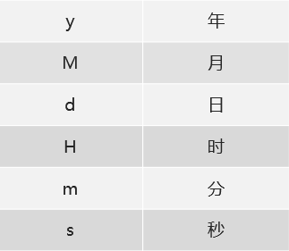

# API 基础

包：其实就是文件夹，作用是对类进行分类管理。

包的定义格式：package 包名;

导包的格式：import 包名;

## Scanner

- Scanner：一个简单的文本扫描程序，可以获取基本类型数据和字符串数据

- 构造方法：

```java
Scanner(InputStream source); //创建Scanner对象
Scanner(System.in); //从键盘输入创建Scanner对象
```

- 成员方法：

```java
int nextInt(); //获取一个int类型的数据
```

## Random

- Random：该类的实例用于生成随机数

- 构造方法：

```java
Random() //创建一个新的随机数生成器
```

- 成员方法：

```java
int nextInt(int bound)：获取一个int类型的随机数，参数bound表示获取到的随机数在[0,bound)之间
```

## String

- String类表示字符串。 Java程序中的所有字符串文字（例如"abc" ）都实现为此类的实例
- 构造方法：

```java
String() //初始化新创建得String对象，使其表示空字符序列
String(String original) //初始化新创建的String对象，使其表示与参数相同的字符序列
```

- 成员方法：

```java
int length() //返回此字符串的长度
boolean equals(Object anObject) //将此字符串与指定的对象进行比较
boolean equalsIgnoreCase(String anotherString) //将此 String与另一个 String比较，忽略了大小写
String trim() //返回一个字符串，其值为此字符串，删除了所有前导和尾随空格
```

## Integer

八种基本数据类型的包装类型


- Integer：Integer类在对象中包装基本类型int的值
- 构造方法：

```java
Integer(int value) //根据 int 值创建 Integer 对象(过时)
Integer(String s) //根据 String 值创建 Integer 对象(过时)
```

- 成员方法

 ```java
 static Integer valueOf(int i) //返回表示指定的 int 值的 Integer 实例
 static Integer valueOf(String s)  //返回一个保存指定值的 Integer 对象 String
 ```

- int和String的相互转换

```java
static String valueOf(int i)  //返回 int 参数的字符串表示形式。该方法是 String 类中的方法
static int parseInt(String s)  //将字符串解析为 int 类型。该方法是 Integer 类中的方法
```

- 自动拆装箱：Integer和int进行运算，过程中会自动拆装箱
  - 装箱：把基本数据类型转换为对应的包装类类型
  - 拆箱：把包装类类型转换为对应的基本数据类型

## Date

- Date：表示特定的时刻，精度为毫秒
- 构造方法：

```java
Date() //分配 Date对象并对其进行初始化，使其表示分配时间，测量 Date到毫秒
Date(long date) //分配 Date对象并初始化它以表示自标准基准时间以来的指定毫秒数，即1970年1月1日00:00:00
```

- SimpleDateFormat：

  - 用于以区域设置敏感的方式格式化和解析日期的具体类。


  - 日期和时间格式由日期和时间模式字符串指定，在日期和时间模式字符串中，从‘A’到‘Z’以及从‘a’到‘z’引号的字母被解释为表示日期或时间字符串的组成部分的模式字母
  - 常用的模式字母及对应关系如下：




- 构造方法：

```java
SimpleDateFormat()  //构造一个SimpleDateFormat，使用默认模式和日期格式
SimpleDateFormat(String pattern) //构造一个SimpleDateFormat使用给定的模式和默认的日期格式
String format(Date date)  //将日期格式化成日期/时间字符串
Date parse(String source)  //从给定字符串的开始解析文本以生成日期
```

## GUI

暂时跳过

# 数组

数组：是一种用于存储多个相同数据类型的存储模型(可以理解为容器)。

- 格式1：数据类型[] 变量名;
- 范例： int[] arr;
- 定义了一个int类型的数组，数组名是arr
- 格式2：数据类型 变量名[];
- 范例： int arr[];

所谓初始化：就是为数组中的数组元素分配内存空间，并为每个数组元素赋值

- 静态初始化：初始化时指定每个数组元素的初始值，由系统决定数组长度
- 格式：数据类型[] 变量名 = new 数据类型[]{数据1,数据2,数据3,…};
- 范例：int[] arr = new int[]{1,2,3};

针对这种格式呢？Java提供了一种简化的格式，让我们使用起来更方便

- 简化格式：数据类型[] 变量名 = {数据1,数据2,数据3,…};
- 范例：int[] arr = {1,2,3};

数组元素访问

数组名[索引]

- 作用：用于访问数组中的数据使用，数组名[索引]等同于变量名，是一种特殊的变量名
- 它还有这样的几个特征：
  - 特征①：索引从0开始
  - 特征②：索引是连续的
  - 特征③：索引逐一增加，每次加1

数组遍历


获取数组长度

元素打断

动态初始化

这里我们来看一下动态初始化的格式：

- 格式：数据类型[] 变量名 = new 数据类型[数组长度];
- 范例：int[] arr = new int[3];

表示我们定义了一个int类型的数组，初始化为3个元素。

演示完毕之后，回到资料我们总结一下数组初始化的两种方式的各自使用场景：

- 静态初始化：开始就存入元素值，适合一开始就能确定元素值的业务场景
- 动态初始化：指定数组长度，后期赋值，适合开始知道数据的数量，但是不确定具体元素值的业务场景

### 索引越界

### 空指针异常

### 二维数组