# 面向对象基础

## 一、面向对象入门 

### 1.1 面向对象编程好处

先来看第一个问题，面向对象编程到底有什么好处呢？ 那就不得不谈，Java的祖师爷对这个世界的理解了。

Java的祖师爷，詹姆斯高斯林认为，在这个世界中 **万物皆对象！**任何一个对象都可以包含一些数据，数据属于哪个对象，就由哪个对象来处理。

这样的话，只要我们找到了对象，其实就找到了对数据的处理方式。


所以面向对象编程的好处，用一句话总结就是：面向对象的开发更符合人类的思维习惯，让编程变得更加简单、更加直观。

### 1.2 什么是对象

**对象实质上是一种特殊的数据结构**。这种结构怎么理解呢？

你可以把对象理解成一张表格，表当中记录的数据，就是对象拥有的数据。

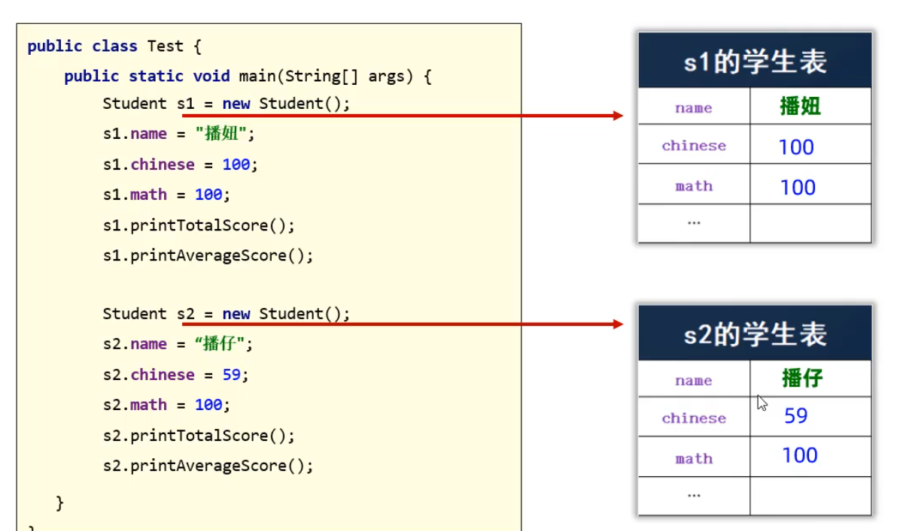

这就是程序中的对象到底是个啥！ **一句话总结，对象其实就是一张数据表，表当中记录什么数据，对象就处理什么数据。**

### 1.3 对象如何创建

刚刚我们讲到对象就是一张数据表，那么这个数据表是怎么来的呢？这张表是不会无缘无故存在的，因为Java也不知道你这个对象要处理哪些数据，所以这张表需要我们设计出来。

用什么来设计这张表呢？就是类（class），**类可以理解成对象的设计图**，或者对象的模板。

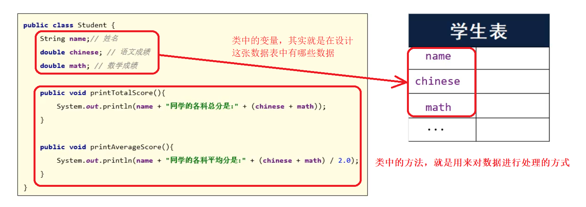

我们需要按照对象的设计图创造一个对象。**设计图中规定有哪些数据，对象中就只能有哪些数据。**

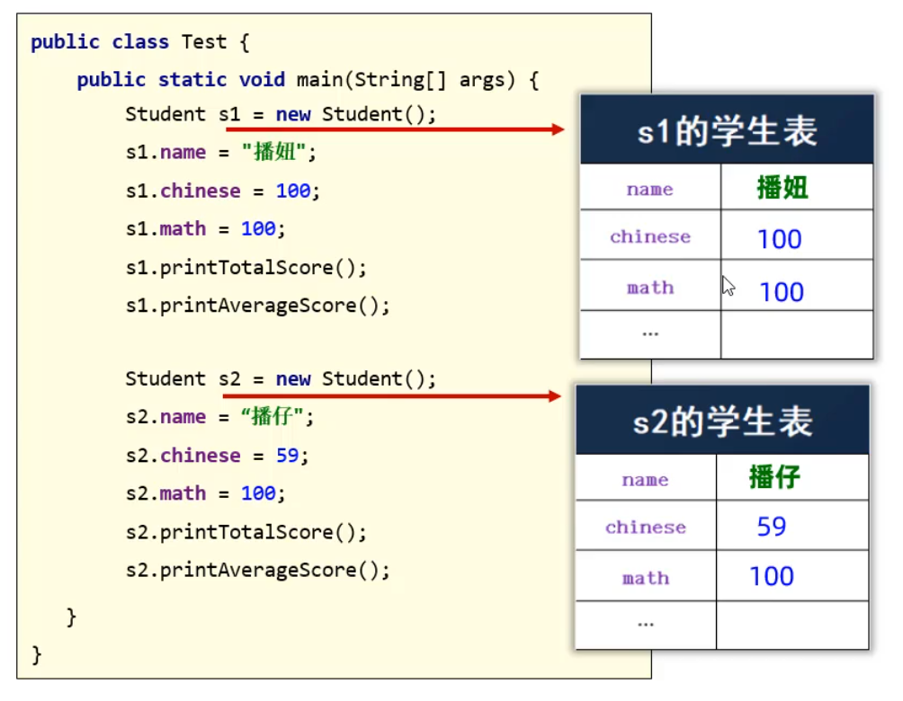

**一句话总结：对象可以理解成一张数据表，而数据表中可以有哪些数据，是有类来设计的。**

## 二、对象在计算机中的执行原理

数组变量记录的其实数数组在堆内存中的地址。其实面向对象的代码执行原理和数组的执行原理是非常类似的。

其实`Student s1 = new Student();`这句话中的原理如下

- `Student s1`表示的是在栈内存中，创建了一个Student类型的变量，变量名为s1

- 而`new Student()`会在堆内存中创建一个对象，而对象中包含学生的属性名和属性值

  同时系统会为这个Student对象分配一个地址值0x4f3f5b24

- 接着把对象的地址赋值给栈内存中的变量s1，通过s1记录的地址就可以找到这个对象

- 当执行`s1.name=“播妞”`时，其实就是通过s1找到对象的地址，再通过对象找到对象的name属性，再给对象的name属性赋值为`播妞`;  

搞明白`Student s1 = new Student();`的原理之后，`Student s2 = new Student();`原理完全一样，只是在堆内存中重新创建了一个对象，又有一个新的地址。`s2.name`是访问另对象的属性。

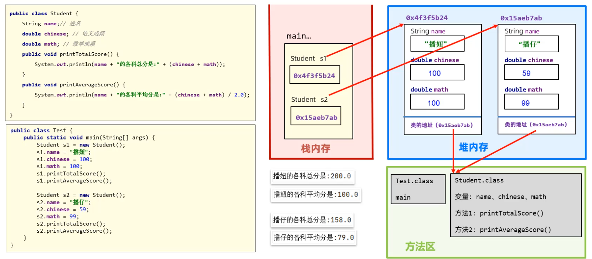

## 三、类和对象注意事项

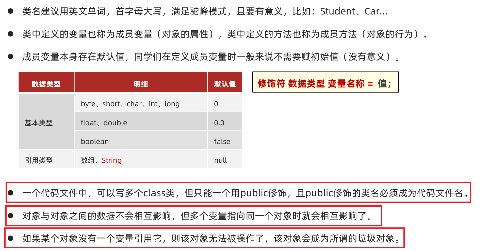

## 四、this关键字

this是什么呢？this就是一个变量，用在方法中，可以拿到当前类的对象。

我们看下图所示代码，通过代码来体会这句话到底是什么意思。哪一个对象调用方法方法中的this就是哪一个对象.

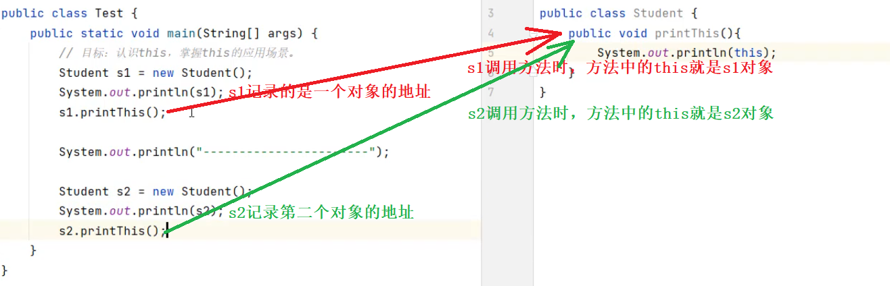

上面代码运行结果如下


**this有什么用呢？**

通过this在方法中可以访问本类对象的成员变量。我们看下图代码，分析打印结果是多少

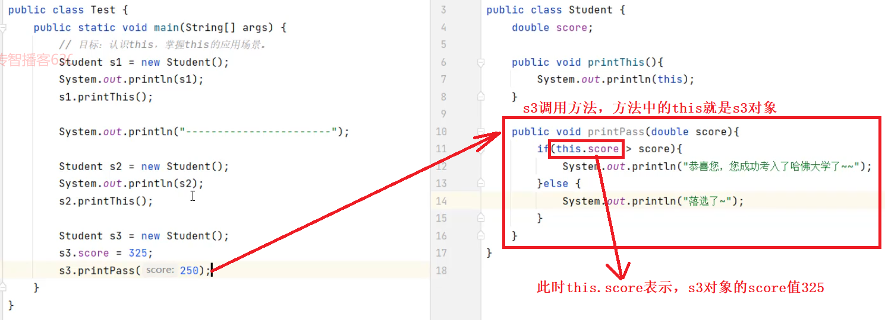

分析上面的代码`s3.score=325`，调用方法printPass方法时，方法中的`this.score`也是325； 而方法中的参数score接收的是250。执行结果是

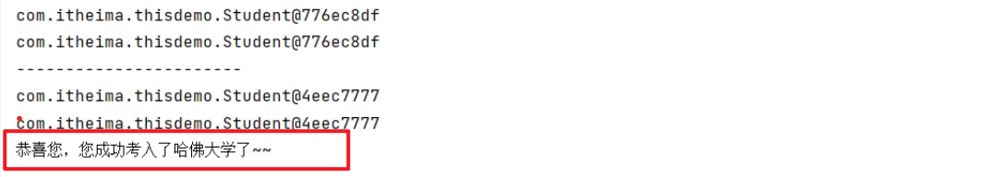

关于this关键字我们就学习到这里，重点记住这句话：**哪一个对象调用方法方法中的this就是哪一个对象**

## 五、构造器

- **什么是构造器？**

  构造器其实是一种特殊的方法，但是这个方法没有返回值类型，方法名必须和类名相同。

  如下图所示：下面有一个Student类，构造器名称也必须叫Student；也有空参数构造器，也可以有有参数构造器。

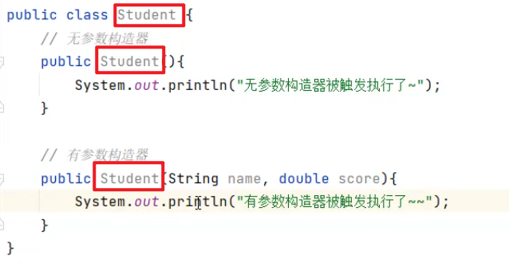

- **构造器的特点？**

  在创建对象时，会调用构造器。

  也就是说 `new Student()`就是在执行构造器，当构造器执行完了，也就意味着对象创建成功。 

  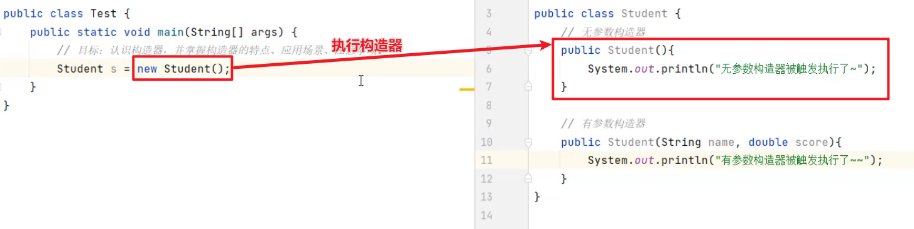

  当执行`new Student("播仔",99)`创建对象时，就是在执行有参数构造器，当有参数构造器执行完，就意味着对象创建完毕了。

  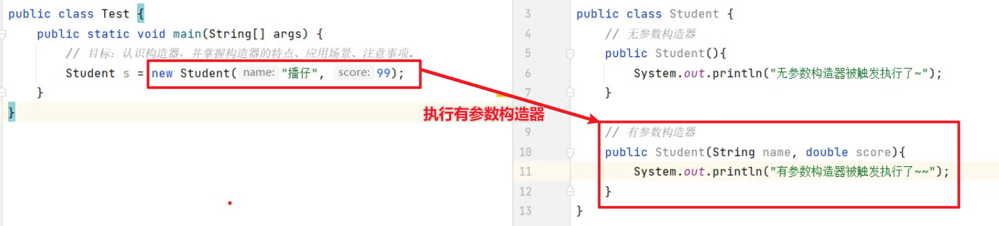

关于构造器的特点，我们记住一句话：**new 对象就是在执行构造方法**

- **构造器的应用场景？**

  其实构造器就是用来创建对象的。可以在创建对象时给对象的属性做一些初始化操作。如下图所示：

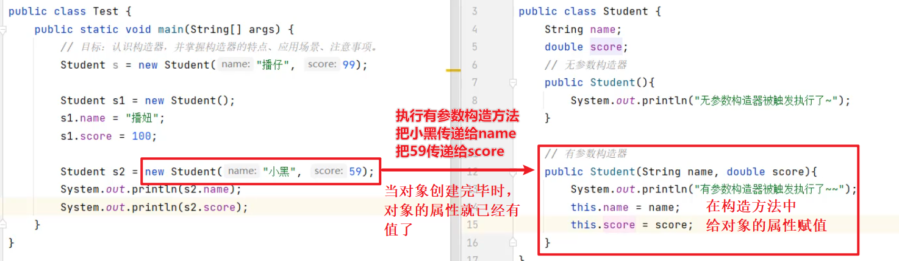

- **构造器的注意事项？**

  学习完构造器的应用场景之后，接下来我们再看一下构造器有哪些注意事项。

  ```java
  1.在设计一个类时，如果不写构造器，Java会自动生成一个无参数构造器。
  2.一旦定义了有参数构造器，Java就不再提供空参数构造器，此时建议自己加一个无参数构造器。
  ```

## 六、封装性

**1. 什么是封装呢？**

所谓封装，就是用类设计对象处理某一个事物的数据时，应该把要处理的数据，以及处理数据的方法，都设计到一个对象中去。

比如：在设计学生类时，把学生对象的姓名、语文成绩、数学成绩三个属性，以及求学生总分、平均分的方法，都封装到学生对象中来。

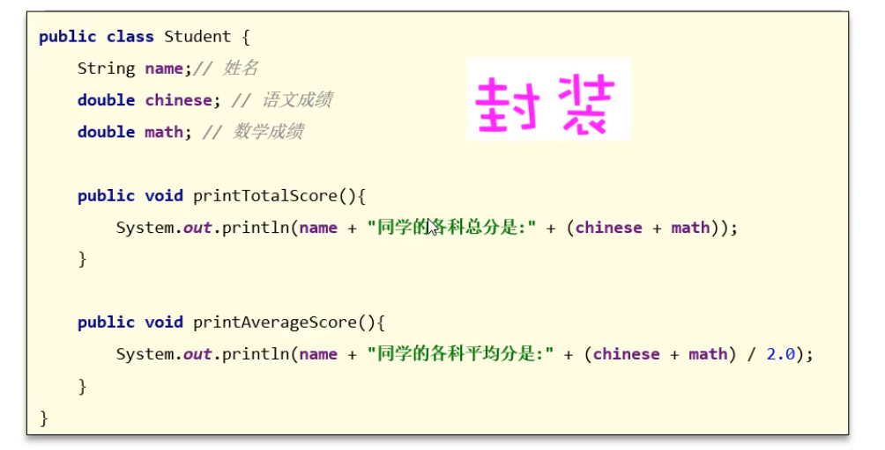

封装的设计规范用8个字总结，就是：**合理隐藏、合理暴露**

比如，设计一辆汽车时，汽车的发动机、变速箱等一些零件并不需要让每一个开车的知道，所以就把它们隐藏到了汽车的内部。

把发动机、变速箱等这些零件隐藏起来，这样做其实更加安全，因为并不是所有人都很懂发动机、变速箱，如果暴露在外面很可能会被不懂的人弄坏。


在设计汽车时，除了隐藏部分零件，但是还是得合理的暴露一些东西出来，让司机能够操纵汽车，让汽车跑起来。比如：点火按钮啊、方向盘啊、刹车啊、油门啊、档把啊... 这些就是故意暴露出来让司机操纵汽车的。


**2. 封装在代码中的体现**

知道什么是封装之后，那封装在代码中如何体现呢？一般我们在设计一个类时，会将成员变量隐藏，然后把操作成员变量的方法对外暴露。

这里需要用到一个修饰符，叫private，**被private修饰的变量或者方法，只能在本类中被访问。**

如下图所示，`private double score;` 就相当于把score变量封装在了Student对象的内部，且不对外暴露，你想要在其他类中访问score这个变量就，就不能直接访问了；

如果你想给Student对象的score属性赋值，得调用对外暴露的方法`setScore(int score)`，在这个方法中可以对调用者传递过来的数据进行一些控制，更加安全。

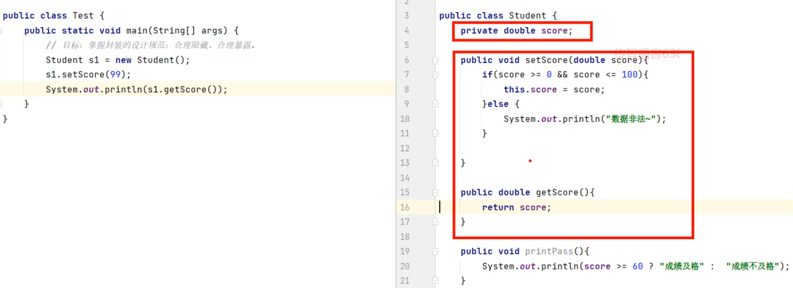

当你想获取socre变量的值时，就得调用对外暴露的另一个方法 `getScore()` 。

## 七、实体JavaBean

接下来，我们学习一个面向对象编程中，经常写的一种类——叫实体JavaBean类。我们先来看什么是实体类？

**1. 什么是实体类？**

实体类就是一种特殊的类，它需要满足下面的要求：


以下是一个Student实体类；

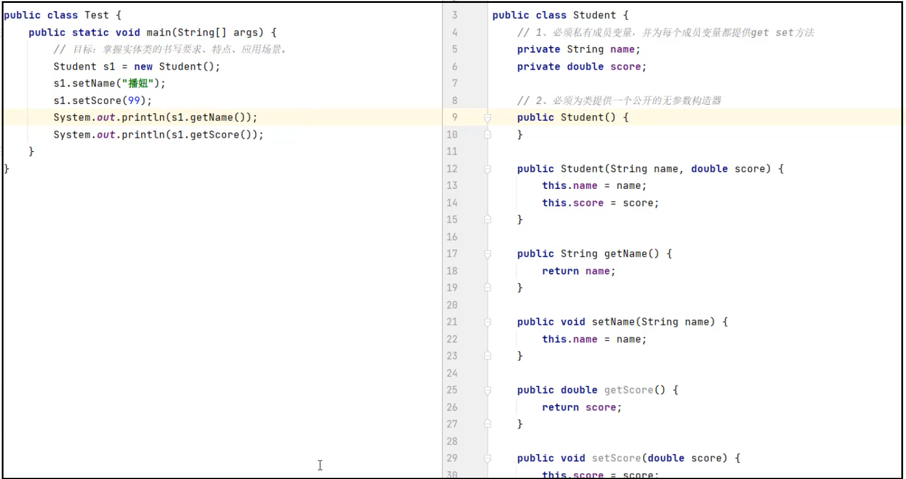

实体类中除了有给对象存、取值的方法就没有提供其他方法了。所以实体类仅仅只是用来封装数据用的。

**2. 实体类的应用场景**

在实际开发中，实体类仅仅只用来封装数据，而对数据的处理交给其他类来完成，以实现数据和数据业务处理相分离。如下图所示

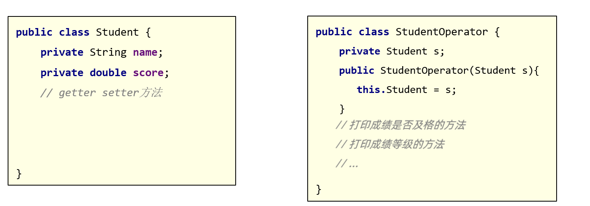

在实际应用中，会将类作为一种数据类型使用。如下图所示，在StudentOperator类中，定义一个Student类型的成员变量student，然后使用构造器给student成员变量赋值。

然后在Student的printPass()方法中，使用student调用Student对象的方法，对Student对象的数据进行处理。

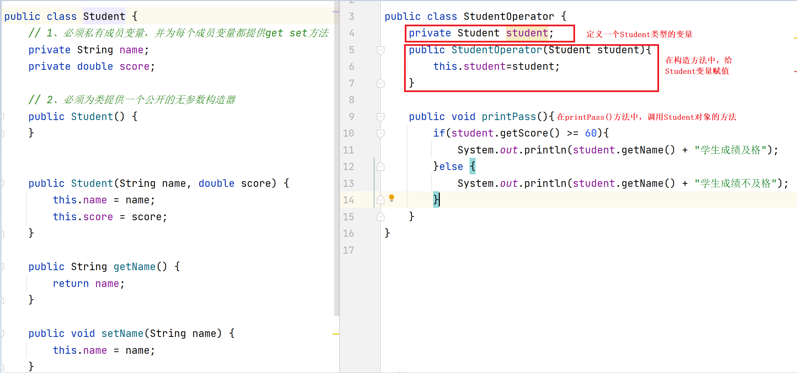

## 八、成员变量和局部变量的区别

各位同学，面向对象的基础内容咱们已经学习完了。同学们在面向对象代码时，经常会把成员变量和局部变量搞混。所以现在我们讲一讲他们的区别。

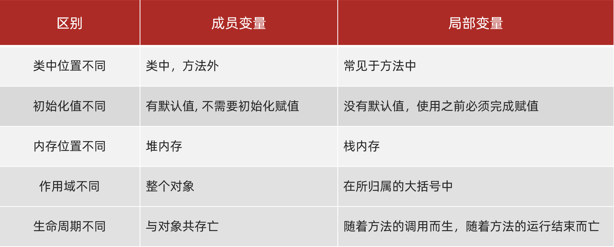

如下图所示，成员变量在类中方法外，而局部变量在方法中。

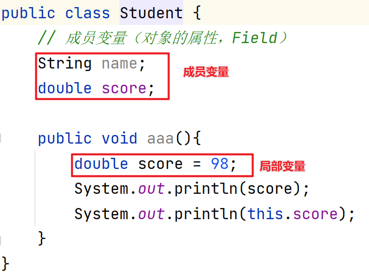


