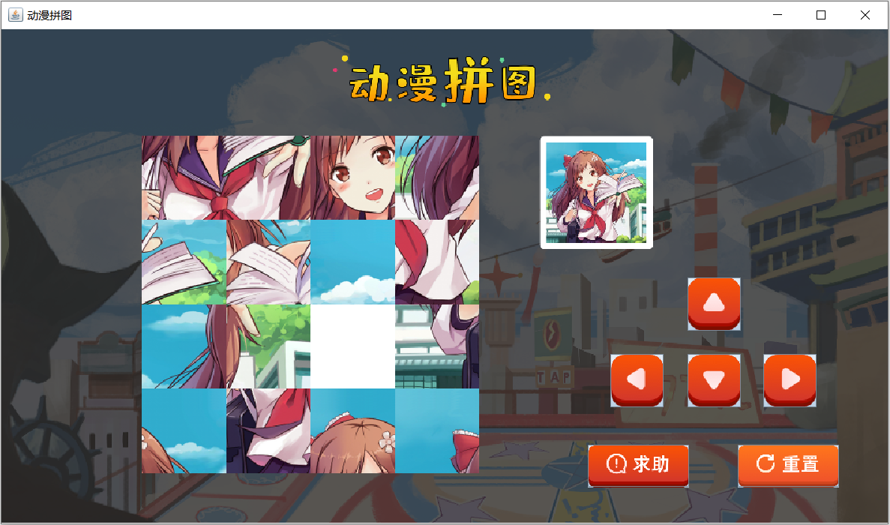

# GUI

## 1. GUI 

### 1.1 GUI概述

- **GUI：**Graphical User Interface(图形用户接口)
- 用图形的方式，来显示计算机操作的界面

Java为GUI提供的API都存在java.awt和javax.Swing两个包中

- **java.awt 包：**
  - awt是这三个单词首字母的缩写，翻译过来是抽象窗口工具包，只不过这个包的API，需要调用本地系统方法实现功能，和本地系统有关联，不利于代码移植，属重量级控件
- **javax.swing 包：**
  - 它是在awt的基础上，建立的一套图形界面系统，提供了更多的组件，而且完全由Java实现。增强了移植性，属轻量级控件

所以，我们做图形界面开发使用的是swing包下的类。

这里出现了一个名词：组件。那什么是组件呢？

- **组件**是具有图形表示的对象，该图形表示可以显示在屏幕上并且可以与用户交互

- 常用组件：


- **基本组件：**具有图形表示的对象
- **容器组件：**是可以添加组件的组件。也就是在容器中可以通过add方法添加组件，既可以添加基本组件，也可以添加容器组件。

- 基本组件 
  - JButton，这是按钮
  - JLabel，这是用来显示文本内容的，或者展示图片使用
  - JTextFile，这是文本框，用来输入内容的
  - JTextArea，这是文本域，用来输入多行多列的数据的
- 容器组件
  - 面板，常用JPanel
  - 窗体，常用JFrame

### 1.2 常用组件

#### 1.2.1 JFrame

**JFrame：**是一个顶层窗口

**构造方法：**

- JFrame()：构造一个最初不可见的新窗体

**成员方法：**

- void setVisible(boolean b)：显示或隐藏此窗体具体取决于参数b的值
- void setSize(int width, int height)：调整此组件的大小，使其宽度为width，高度为height，单位是像素

- void setTitle(String title)：设置窗体标题
- void setLocationRelativeTo(Component c)：设置位置，值为null，则窗体位于屏幕中央
- void setDefaultCloseOperation(int operation)：设置窗体关闭时默认操作
  - 整数3表示：窗口关闭时退出应用程序
- void setAlwaysOnTop(boolean alwaysOnTop)：设置此窗口是否应始终位于其他窗口之上

#### 1.2.2 JButton

**JButton：**按钮

**构造方法：**

- JButton(String text)：创建一个带文本的按钮

**成员方法：**

- void setSize(int width, int height)：设置大小
- void setLocation(int x, int y)：设置位置(x坐标，y坐标)
- <font color='red'>**void setBounds(int x, int y, int width, int height)：设置位置和大小**</font>

**和窗体相关操作：**

- 取消窗体默认布局：<font color='red'>**窗体对象.setLayout(null);**</font>
- 把按钮添加到窗体：<font color='red'>**窗体对象.add(按钮对象);**</font>

#### 1.2.4 JLabel

 **JLable：**短文本字符串或图像的显示区域

**构造方法：**

- JLabel(String text)：使用指定的文本创建 JLabel实例
- JLabel(Icon image)：使用指定的图像创建 JLabel实例
  - ImageIcon(String filename)：从指定的文件创建ImageIcon
  - 文件路径：绝对路径和相对路径

**成员方法：**

- void setBounds(int x, int y, int width, int height)：设置位置和大小

### 1.3 事件监听机制

**事件监听机制的组成：**

- **事件源：**事件发生的地方。可以是按钮，窗体，图片等
- **事件：**发生了什么事情。例如：鼠标点击事件，键盘按下事件等
- **事件绑定：**把事件绑定到事件源上，当发生了某个事件，则触发对应的处理逻辑
  - 事件源对象. addXXXListener(事件);

GUI中的事件比较多，这里呢，我们先告诉一下大家如何给按钮添加事件，能够把我们前面的案例给实现就可以了。至于其他事件，后面我们用到的时候再去学习。


## 2. 继承

### 2.1 继承概述

- 继承
  - 继承是面向对象三大特征之一(封装，继承和多态)
  - 可以使子类具有父类的属性和方法，还可以在子类中重新定义，追加属性和方法

- 格式：public class 子类名 extends 父类名 { }
  - 范例：public class Zi <font color='red'>**extends**</font> Fu { }
  - Fu：是父类，也被称为基类、超类
  - Zi：是子类，也被称为派生类


## 3. 拼图案例

### 2.1 游戏效果


### 2.2 动漫美女拼图游戏实现

#### 2.2.1 窗体绘制


**分析思路：**

1：新建一个模块：itheima-picture-puzzle；在模块的src下新建一个包com.itheima

2：在com.itheima这个包下定义类：PictureFrame，继承自JFrame

3：在PictureFrame类中编写无参构造方法，在构造方法中调用两个方法：

​	第一个方法：initFrame()，用于窗体的基本设置

​	第二个方法：setVisible(true)，用于设置窗体可见

4：在initFrame()方法中编写代码，进行窗体的基本设置

​	窗体大小

​	窗体标题

​	窗体居中

​	窗体关闭时退出应用程序

​	窗体位于其他窗口之上

​	取消窗体默认布局

5：在com.itheima包下定义测试类：App；创建PictureFrame的对象进行测试

**代码实现：**

```java
public class PictureFrame extends JFrame {
    public PictureFrame() {
        //用于窗体的基本设置
        initFrame();
        //设置窗体可见
        this.setVisible(true);
    }

    //用于窗体的基本设置
    public void initFrame() {
        //窗体大小
        this.setSize(960,565);
        //窗体标题
        this.setTitle("动漫拼图");
        //窗体居中
        this.setLocationRelativeTo(null);
        //窗体关闭时退出应用程序
        this.setDefaultCloseOperation(3);
        //窗体位于其他窗口之上
        this.setAlwaysOnTop(true);
        //取消窗体默认布局
        this.setLayout(null);
    }
}

```

```java
public class App {
    public static void main(String[] args) {
        PictureFrame pf = new PictureFrame();
    }
}

```

讲解完毕后，大家赶快动手练习一下吧。

#### 2.2.2 窗体上组件绘制


**分析思路：**

1：定义方法，用于窗体上的组件绘制：paintView()

2：按照如下组件绘制

​	标题图片

​	面板图片，存储着将来要移动的图片

​	参照图

​	上按钮

​	左按钮

​	下按钮

​	右按钮

​	求助按钮

​	重置按钮

3：在构造方法中调用paintView()方法		

**代码实现：**

```java
	//窗体上组件的绘制
    public void paintView() {
        //标题图片
        JLabel titleLabel = new JLabel(new ImageIcon("itheima-picture-puzzle\\images\\title.png"));
        titleLabel.setBounds(354,27,232,57);
        this.add(titleLabel);

        //定义一个二维数组，用来存储图片的编号
        int[][] datas = {
                {1,2,3,4},
                {5,6,7,8},
                {9,10,11,12},
                {13,14,15,16}
        };

        //创建面板
        JPanel imagePanel = new JPanel();
        imagePanel.setBounds(150,114,360,360);
        imagePanel.setLayout(null);
        //遍历二维数组，得到图片编号
        for (int i = 0; i < datas.length; i++) {
            for (int j = 0; j < datas[i].length; j++) {
                //创建JLabel对象，加载图片资源
                JLabel imageLabel = new JLabel(new ImageIcon("itheima-picture-puzzle\\images\\"+datas[i][j]+".png"));
                //调整图片的位置
                imageLabel.setBounds(j*90,i*90,90,90);
                imagePanel.add(imageLabel);
            }
        }
        //把面板添加到窗体上
        this.add(imagePanel);

        //动漫参照图
        JLabel canZhaoTuLabel = new JLabel(new ImageIcon("itheima-picture-puzzle\\images\\canzhaotu.png"));
        canZhaoTuLabel.setBounds(574,114,122,121);
        this.add(canZhaoTuLabel);

        //上下左右，求助，重置按钮
        JButton shangButton = new JButton(new ImageIcon("itheima-picture-puzzle\\images\\shang.png"));
        shangButton.setBounds(732,265,57,57);
        this.add(shangButton);

        JButton zuoButton = new JButton(new ImageIcon("itheima-picture-puzzle\\images\\zuo.png"));
        zuoButton.setBounds(650,347,57,57);
        this.add(zuoButton);

        JButton xiaButton = new JButton(new ImageIcon("itheima-picture-puzzle\\images\\xia.png"));
        xiaButton.setBounds(732,347,57,57);
        this.add(xiaButton);

        JButton youButton = new JButton(new ImageIcon("itheima-picture-puzzle\\images\\you.png"));
        youButton.setBounds(813,347,57,57);
        this.add(youButton);

        JButton qiuZhuButton = new JButton(new ImageIcon("itheima-picture-puzzle\\images\\qiuzhu.png"));
        qiuZhuButton.setBounds(626,444,108,45);
        this.add(qiuZhuButton);

        JButton chongZhiButton = new JButton(new ImageIcon("itheima-picture-puzzle\\images\\chongzhi.png"));
        chongZhiButton.setBounds(786,444,108,45);
        this.add(chongZhiButton);

        //展示背景图
        JLabel backgroundLabel = new JLabel(new ImageIcon("itheima-picture-puzzle\\images\\background.png"));
        backgroundLabel.setBounds(0,0,960,530);
        this.add(backgroundLabel);
    }
```

```java
构造方法方法中调用绘图方法
	public PictureFrame() {
        //用于窗体的基本设置
        initFrame();
        //窗体上组件的绘制
        paintView();
        //设置窗体可见
        this.setVisible(true);
    }
```

讲解完毕后，大家赶快动手练习一下吧。

#### 2.2.3 图片打乱



图片打乱，其实就是二维数组元素打乱。

**注意事项：**

- 由于在多个方法中使用同一个数组，故将二维数组的定义放置在成员位置
- 为了能够进行图片的移动，把16号图片用0号图片替换，当前15个移动到正确位置，显示正确的图片

**分析思路：**

1：定义方法，用于二维数组元素打乱：initData()

2：创建Random对象

3：遍历存储图片编号的二维数组，得到每一个元素

4：产生两个随机索引，进行二维数组元素交换

```
	int x = r.nextInt(datas.length);//行索引
    int y = r.nextInt(datas[x].length);//列索引

	//元素交换
    int temp = datas[i][j];
    datas[i][j] = datas[x][y];
    datas[x][y] = temp;
```

5：在构造方法中调用initData()方法

**代码实现：**

```java
private int[][] datas = {
        {1, 2, 3, 4},
        {5, 6, 7, 8},
        {9, 10, 11, 12},
        {13, 14, 15, 0}
};

```

```java
//二维数组元素打乱
public void randomData() {
    Random r = new Random();
    for (int i = 0; i < datas.length; i++) {
        for (int j = 0; j < datas[i].length; j++) {
            int x = r.nextInt(datas.length);
            int y = r.nextInt(datas[i].length);

            int temp = datas[i][j];
            datas[i][j] = datas[x][y];
            datas[x][y] = temp;
        }
    }
}

public PictureFrame() {
    //用于窗体的基本设置
    initFrame();
    //二维数组元素打乱
    randomData();
    //窗体上组件的绘制
    paintView();
    //设置窗体可见
    this.setVisible(true);
}
```

讲解完毕后，大家赶快动手练习一下吧。

#### 2.2.4 纪录0号图片的索引

为什么要纪录0号图片索引呢？

- 由于将来要进行图片的移动，以实现动漫拼图的实现
- 而移动的操作，得有一个空白的区别，这里我们采用0号图片表示，需要纪录0号图片的位置，也就是在数组中的索引

**分析思路：**

1：在PictureFrame类中定义两个成员变量用于纪录0号图片的索引

​	private int x0;

​	private int y0;

2：在initData()方法中继续编写代码，在打乱后的数组中找到0号图片的位置

​	遍历二维数组，得到每一个元素

​	如果元素为0，则纪录该元素的索引，并结束循环。

**代码实现：**

```java
//定义两个int类型的变量，用于纪录0号图片的位置
private int x0;
private int y0;
```

```java
//二维数组元素打乱
public void randomData() {
    Random r = new Random();
    for (int i = 0; i < datas.length; i++) {
        for (int j = 0; j < datas[i].length; j++) {
            int x = r.nextInt(datas.length);
            int y = r.nextInt(datas[i].length);

            int temp = datas[i][j];
            datas[i][j] = datas[x][y];
            datas[x][y] = temp;
        }
    }

    //纪录0号图片的位置
    wc:for (int i = 0; i < datas.length; i++) {
        for (int j = 0; j < datas[i].length; j++) {
            if(datas[i][j] == 0) {
                x0 = i;
                y0 = j;
                break wc;
            }
        }
    }
    //System.out.println(x0+","+y0);
}
```

在代码讲解过程中，讲解了一个新知识，就是嵌套循环的退出。给循环起名字就可以实现退出指定的循环。

讲解完毕后，大家赶快动手练习一下吧。

#### 2.2.5 给按钮注册事件

**注意事项：**由于在多个方法中使用同一个按钮，故将按钮的定义放置在成员位置

**分析思路：**

1：定义方法，用于给按钮添加事件：addButtonEvent()

2：在addButtonEvent()方法中给每一个按钮添加事件，并给出输出语句提示

3：在构造方法中调用addButtonEvent()方法

**代码实现：**

```java
//给按钮添加事件
public void addButtonEvent() {
    shangButton.addActionListener(new ActionListener() {
        @Override
        public void actionPerformed(ActionEvent e) {
            System.out.println("上");
        }
    });
    zuoButton.addActionListener(new ActionListener() {
        @Override
        public void actionPerformed(ActionEvent e) {
            System.out.println("左");
        }
    });
    xiaButton.addActionListener(new ActionListener() {
        @Override
        public void actionPerformed(ActionEvent e) {
            System.out.println("下");
        }
    });
    youButton.addActionListener(new ActionListener() {
        @Override
        public void actionPerformed(ActionEvent e) {
            System.out.println("右");
        }
    });
    qiuzhuButton.addActionListener(new ActionListener() {
        @Override
        public void actionPerformed(ActionEvent e) {
            System.out.println("求助");
        }
    });
    chongzhiButton.addActionListener(new ActionListener() {
        @Override
        public void actionPerformed(ActionEvent e) {
            System.out.println("重置");
        }
    });
}

```

```java
//无参构造方法
public PictureFrame() {
    //用于窗体的基本设置
    initFrame();
    //二维数组元素打乱
    randomData();
    //窗体上组件的绘制
    paintView();
    //给按钮添加事件
    addButtonEvent();
    //设置窗体可见
    this.setVisible(true);
}
```

讲解完毕后，大家赶快动手练习一下吧。

#### 2.2.6 移动业务实现

**移动原理：**图片的移动，其实就是做元素的交换，也就是二维数组的元素改变了，然后进行图片重绘就可以了

##### 2.2.6.1 上移业务实现

**分析思路：**

1：移动规则：竖的是x，横的是y

​	空白图片，和下方元素(x0+1)，进行交换

2：把空白图片和下方图片的位置交换

​	datas[x0] [y0] = datas[x0 + 1] [y0];

​	datas[x0 + 1] [y0] = 0;

​	x0 = x0 + 1;

3：编写重绘方法：rePaintView()

​	先移除，再重新绘制

4：调用重绘方法

5：边界问题处理：当x0=3，不能进行上移动

**代码实现：**

```java
shangButton.addActionListener(new ActionListener() {
    @Override
    public void actionPerformed(ActionEvent e) {
        //边界处理
        if (x0 == 3) {
            return;
        }
        //位置交换
        datas[x0][y0] = datas[x0 + 1][y0];
        datas[x0 + 1][y0] = 0;
        x0 = x0 + 1;
        //重绘方法调用
        rePaintView();
    }
});

//移动的图形重新绘制
public void rePaintView() {
    //移除所有
    imagePanel.removeAll();

    //遍历二维数组，得到每一个图片编号
    for (int i = 0; i < datas.length; i++) {
        for (int j = 0; j < datas[i].length; j++) {
            //在遍历的过程中，创建 JLabel 对象，加载图片资源
            JLabel imageLabel = new JLabel(new ImageIcon("itheima-picture-puzzle\\images\\" + datas[i][j] + ".png"));
            //调整图片资源的摆放位置
            imageLabel.setBounds(j * 90, i * 90, 90, 90);
            imagePanel.add(imageLabel);
        }
    }

    //重新绘制窗体
    imagePanel.repaint();
}
```

讲解完毕后，大家赶快动手练习一下吧。

##### 2.2.6.2 其他移动业务实现

**分析思路：**

1：左移动

​	边界：y0=3

​	移动代码：

```
        datas[x0][y0] = datas[x0][y0 + 1];
        
        datas[x0][y0 + 1] = 0;
        
        y0 = y0 + 1;

```

2：下移动

​	边界：x0=0

​	移动代码：

```
        datas[x0][y0] = datas[x0 - 1][y0];
        
        datas[x0 - 1][y0] = 0;
        
        x0 = x0 - 1;

```

3：右移动

​	边界：y0=0

​	移动代码：

```
        datas[x0][y0] = datas[x0][y0 - 1];
        
        datas[x0][y0 - 1] = 0;
        
        y0 = y0 - 1;

```

**代码实现：**

```java
zuoButton.addActionListener(new ActionListener() {
    @Override
    public void actionPerformed(ActionEvent e) {
        if (y0 == 3) {
            return;
        }
        datas[x0][y0] = datas[x0][y0 + 1];
        datas[x0][y0 + 1] = 0;
        y0 = y0 + 1;
        rePaintView();
    }
});
xiaButton.addActionListener(new ActionListener() {
    @Override
    public void actionPerformed(ActionEvent e) {
        if (x0 == 0) {
            return;
        }
        datas[x0][y0] = datas[x0 - 1][y0];
        datas[x0 - 1][y0] = 0;
        x0 = x0 - 1;
        rePaintView();
    }
});
youButton.addActionListener(new ActionListener() {
    @Override
    public void actionPerformed(ActionEvent e) {
        if (y0 == 0) {
            return;
        }
        datas[x0][y0] = datas[x0][y0 - 1];
        datas[x0][y0 - 1] = 0;
        y0 = y0 - 1;
        rePaintView();
    }
});
```

讲解完毕后，大家赶快动手练习一下吧。

#### 2.2.7 求助业务实现


**注意事项：**

- 数组元素应该是1-16，而不是0-15了
- 按钮也不能在点击了

**分析思路：**

1：定义移动成功的方法：success()

2：在success()方法内部进行如下操作：

​	修改datas数组的元素为正确的元素值

​	按钮设置为不可用

3：在重置操作中调用两个方法：

​	第一个方法：success()

​	第二个方法：rePaintView()

**代码实现：**

```java
//移动成功的操作
public void success() {
    datas = new int[][]{
            {1, 2, 3, 4},
            {5, 6, 7, 8},
            {9, 10, 11, 12},
            {13, 14, 15, 16}
    };
    shangButton.setEnabled(false);
    zuoButton.setEnabled(false);
    xiaButton.setEnabled(false);
    youButton.setEnabled(false);
}

```

```java
qiuzhuButton.addActionListener(new ActionListener() {
    @Override
    public void actionPerformed(ActionEvent e) {
        success();
        rePaintView();
    }
});
```

讲解完毕后，大家赶快动手练习一下吧。

#### 2.2.8 移动业务的问题

**问题分析：**每次移动之后，都要判断是否移动成功，如果成功了，需要调用成功的方法。

而判断移动是否成功，我们来写方法实现。

**分析思路：**

1：定义一个方法，用于比较两个数组元素是否相同

2：每次移动完毕，调用该方法：

​	如果返回值为true，则调用success()方法

**代码实现：**

```java
//定义移动成功后的数组
private int[][] winDatas = {
    {1, 2, 3, 4},
    {5, 6, 7, 8},
    {9, 10, 11, 12},
    {13, 14, 15, 0}
};


```

```java
//判断移动是否成功
public boolean isSuccess() {
    for (int i = 0; i < datas.length; i++) {
        for (int j = 0; j < datas[i].length; j++) {
            if (datas[i][j] != winDatas[i][j]) {
                return false;
            }
        }
    }
    return true;
}

shangButton.addActionListener(new ActionListener() {
    @Override
    public void actionPerformed(ActionEvent e) {
        //边界处理
        if (x0 == 3) {
            return;
        }

        //位置交换
        datas[x0][y0] = datas[x0 + 1][y0];
        datas[x0 + 1][y0] = 0;
        x0 = x0 + 1;

        //判断移动是否成功
        if(isSuccess()) {
            success();
        }

        //调用重绘的方法
        rePaintView();
    }
});
zuoButton.addActionListener(new ActionListener() {
    @Override
    public void actionPerformed(ActionEvent e) {
        //边界处理
        if (y0 == 3) {
            return;
        }

        //位置交换
        datas[x0][y0] = datas[x0][y0 + 1];
        datas[x0][y0 + 1] = 0;
        y0 = y0 + 1;

        //判断移动是否成功
        if(isSuccess()) {
            success();
        }

        //调用重绘的方法
        rePaintView();
    }
});
xiaButton.addActionListener(new ActionListener() {
    @Override
    public void actionPerformed(ActionEvent e) {
        //边界处理
        if (x0 == 0) {
            return;
        }

        //位置交换
        datas[x0][y0] = datas[x0 - 1][y0];
        datas[x0 - 1][y0] = 0;
        x0 = x0 - 1;

        //判断移动是否成功
        if(isSuccess()) {
            success();
        }

        //调用重绘的方法
        rePaintView();

    }
});
youButton.addActionListener(new ActionListener() {
    @Override
    public void actionPerformed(ActionEvent e) {
        //边界处理
        if (y0 == 0) {
            return;
        }

        //位置交换
        datas[x0][y0] = datas[x0][y0 - 1];
        datas[x0][y0 - 1] = 0;
        y0 = y0 - 1;

        //判断移动是否成功
        if(isSuccess()) {
            success();
        }

        //调用重绘的方法
        rePaintView();
    }
});
```

讲解完毕后，大家赶快动手练习一下吧。

#### 2.2.9 重置业务实现


**分析思路：**

1：当重置的时候，需要修改数组为1,2...15,0

2：打乱数组元素

3：重绘面板图

4：设置按钮可用

**代码实现：**

```java
chongzhiButton.addActionListener(new ActionListener() {
    @Override
    public void actionPerformed(ActionEvent e) {
        datas = new int[][]{
                {1, 2, 3, 4},
                {5, 6, 7, 8},
                {9, 10, 11, 12},
                {13, 14, 15, 0}
        };
        initData();
        rePaintView();
        shangButton.setEnabled(true);
        zuoButton.setEnabled(true);
        xiaButton.setEnabled(true);
        youButton.setEnabled(true);
    }
});
```

讲解完毕后，大家赶快动手练习一下吧。


