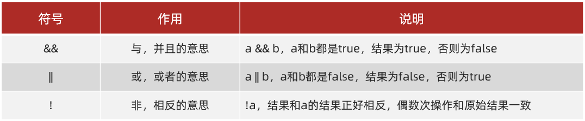

# Java 基础语法

Java  简介

JDK 的下载和安装，设置环境变量

IDEA 的下载和安装

## 基础语法

### 字面量

字面量：直接写出来的人可以理解的数据。

字符串字面量，整数字面量，小数字面量，字符字面量，布尔字面量

### 数据类型

Java 是一种强类型语言。


### 变量

- 变量就是内存中的存储空间
- 空间中存储的数据是可以发生改变
- 格式：数据类型 变量名 = 变量值
- 注意：
  - 变量名不能重复
  - 变量未赋值，不能使用
  - 定义long类型变量，数据后面加L
  - 定义float类型变量，数据后面加F

### 关键字

被 Java 语言赋予了特定含义的单词，关键字的字母全部小写


### 标识符

给类，方法，变量等起名字的符号

- 组成规则：
  - 由数字、字母、下划线(_)和美元符($)组成
  - 不能以数字开头
  - 不能是关键字
  - 区分大小写
- 命令规范
  - 小驼峰命名法
    - 第一个单词首字母小写，其他单词首字母大写，常用于对方法、变量等起名字
  - 大驼峰命名法
    - 每个单词首字母大写，适合用于对类、接口取名

### 运算符&选择语句

运算符：对字面量或者变量进行操作的符号

表达式：用运算符把字面量或者变量连接起来符合java语法的式子就可以称为表达式。

- 算数运算符
- 赋值运算符
- 关系运算符
- 逻辑运算符
- 三元运算符


#### +操作的三种情况

一、数字相加（类型转换）

1.隐式转换：把一个表示数据范围小的数值或者变量赋值给另一个表示数据范围大的变量


2.强制转换：把一个表示数据范围大的数值或者变量赋值给另一个表示数据范围小的变量

```Java
double d = 3.14;
int i = (int)d;
```

二、字符相加

拿字符在计算机底层对应的数值来进行计算的。

ASCII码表；'A' + 'B' = 131;

三、字符串相加

- 当“+”操作中出现字符串时，这个“+”是字符串连接符，而不是算术运算
- 当连续进行“+”操作时，从左到右逐个执行

### 赋值运算符


### 选择语句

顺序结构 Debug

选择结构

```java
if(i > 0) {
	语句体1;
}
----------------------
if(i > 0) {
    语句体1;
} else
{
    语句体2;
}
----------------------
if(i > 0) {
    语句体1;
} else if(i < 0)
{
    语句体2;
} else
{
    语句体3;
}

```

### 关系运算符


### 逻辑运算符



### 三元运算符

a > b ？a : b;

### switch


注意：在switch语句中，如果case控制的语句体后面不写break，将出现穿透现象，在不判断下一个case值的情况下，向下运行，直到遇到break，或者整个switch语句结束

### 循环语句

#### for循环


#### while循环


#### do-while循环


#### continue和break

continue跳转到下一次循环，break结束循环

### 方法

方法：完成特定功能的代码块。

方法的定义：


方法的调用：


带参数方法的定义和调用：


调用：


形参和实参：

形参：方法定义中的参数

实参：方法调用中的参数

#### 带返回值方法的定义和调用


#### 注意：

方法不能嵌套定义

#### 通用格式：


#### 方法重载

方法重载：指同一个类中定义的多个方法之间的关系，满足下列条件的多个方法相互构成重载

- 多个方法在同一个类中
- 多个方法具有相同的方法名
- 多个方法的参数不相同，类型不同或者数量不同

