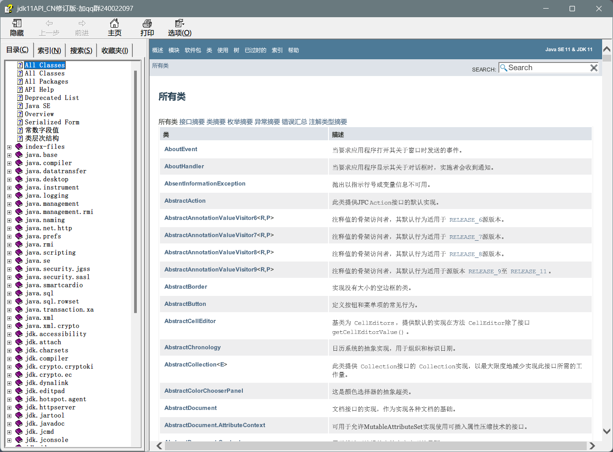
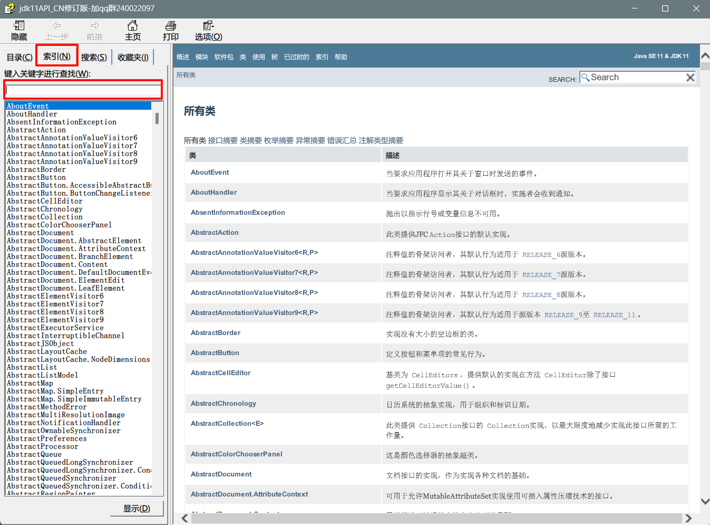
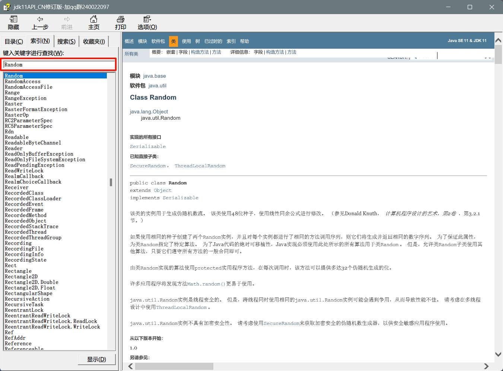
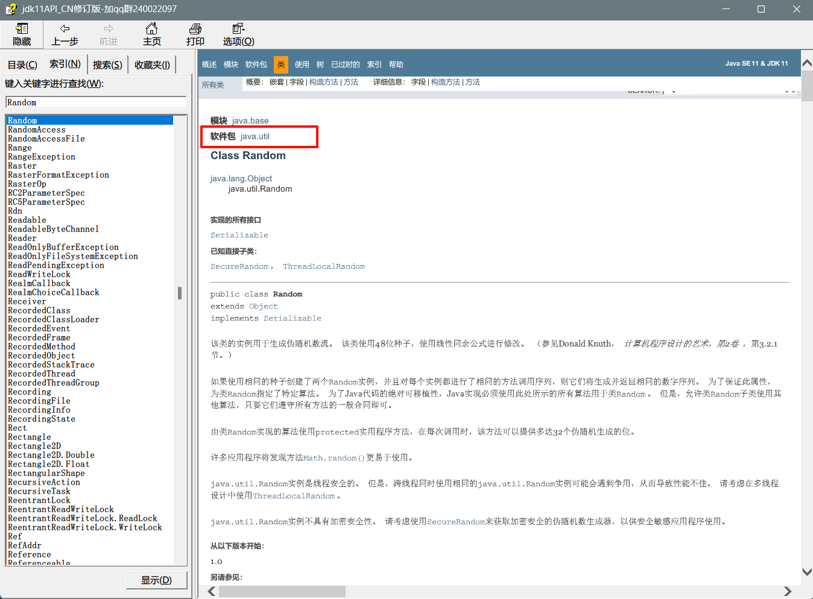
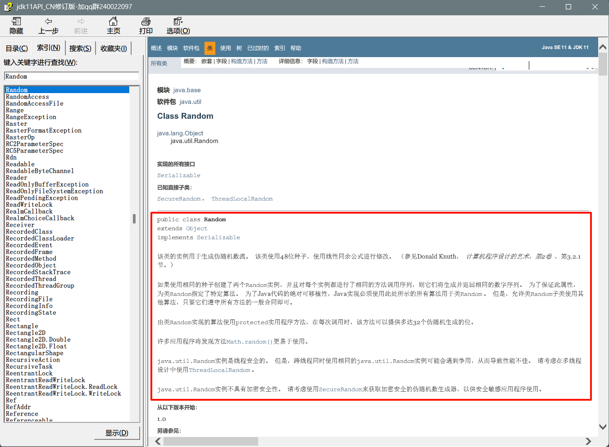
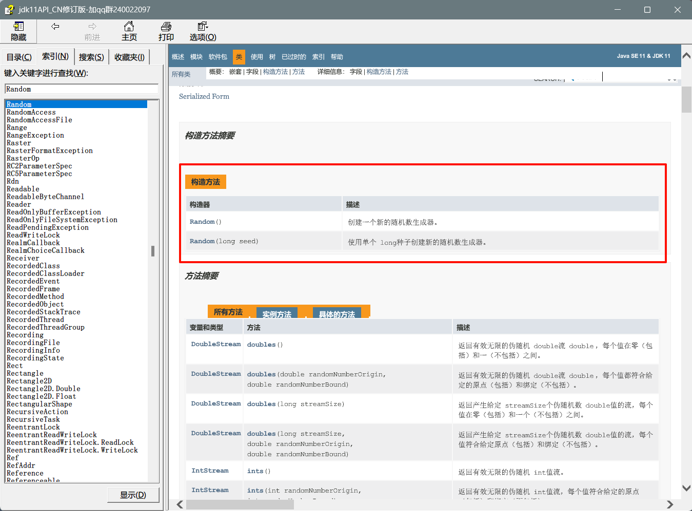
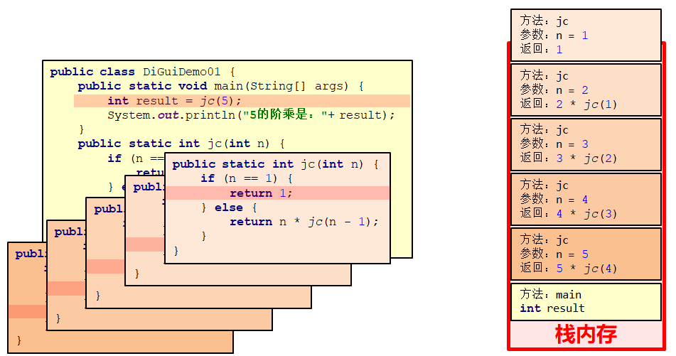
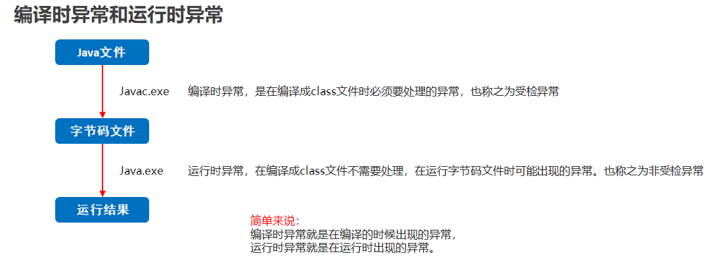

# 一、API

## 1. API概述

### 1.1 概述

- API (Application Programming Interface) ：应用程序编程接口

- java中的API:
  - 指的就是 JDK 中提供的各种功能的 Java类，这些类将底层的实现封装了起来，我们不需要关心这些类是如何实现的，只需要学习这些类如何使用即可，我们可以通过帮助文档来学习这些API如何使用。


### 1.2 使用API帮助文档

- 打开帮助文档



- 找到索引选项卡中的输入框



- 在输入框中输入Random



- 看类在哪个包下



- 看类的描述



- 看构造方法



- 看成员方法


## 2. 常用API

### 2.1 Math

- 1、Math类概述

  - Math 包含执行基本数字运算的方法

- 2、Math中方法的调用方式

  - Math类中无构造方法，但内部的方法都是静态的，则可以通过   **类名.进行调用**

- 3、Math类的常用方法

  | 方法名    方法名                               | 说明                                         |
  | ---------------------------------------------- | -------------------------------------------- |
  | public static int   abs(int a)                 | 返回参数的绝对值                             |
  | public static double ceil(double a)            | 返回大于或等于参数的最小整数值，类型为double |
  | public static double floor(double a)           | 返回小于或等于参数的最大整数值，类型为double |
  | public   static int round(float a)             | 按照四舍五入返回最接近参数的int              |
  | public static int   max(int a,int b)           | 返回两个int值中的较大值                      |
  | public   static int min(int a,int b)           | 返回两个int值中的较小值                      |
  | public   static double pow (double a,double b) | 返回a的b次幂的值                             |
  | public   static double random()                | 返回值为double的正值，[0.0,1.0)              |

### 2.2 System

- System类的常用方法 

  | 方法名                                   | 说明                                             |
  | ---------------------------------------- | ------------------------------------------------ |
  | public   static void exit(int status)    | 终止当前运行的   Java   虚拟机，非零表示异常终止 |
  | public   static long currentTimeMillis() | 返回当前时间(以毫秒为单位)                       |

- 示例代码

  - 需求：在控制台输出1-10000，计算这段代码执行了多少毫秒 

  ```java
  public class SystemDemo {
      public static void main(String[] args) {
          // 获取开始的时间节点
          long start = System.currentTimeMillis();
          for (int i = 1; i <= 10000; i++) {
              System.out.println(i);
          }
          // 获取代码运行结束后的时间节点
          long end = System.currentTimeMillis();
          System.out.println("共耗时：" + (end - start) + "毫秒");
      }
  }
  ```

### 2.3 Object类的toString方法

- Object类概述

  - Object 是类层次结构的根，每个类都可以将 Object 作为超类。所有类都直接或者间接的继承自该类，换句话说，该类所具备的方法，所有类都会有一份

- 查看方法源码的方式

  - 选中方法，按下Ctrl + B

- 重写toString方法的方式

  - 1. Alt + Insert 选择toString
  - 1. 在类的空白区域，右键 -> Generate -> 选择toString

- toString方法的作用：

  - 以良好的格式，更方便的展示对象中的属性值

- 示例代码：

  ```java
  class Student extends Object {
      private String name;
      private int age;
  
      public Student() {
      }
  
      public Student(String name, int age) {
          this.name = name;
          this.age = age;
      }
  
      public String getName() {
          return name;
      }
  
      public void setName(String name) {
          this.name = name;
      }
  
      public int getAge() {
          return age;
      }
  
      public void setAge(int age) {
          this.age = age;
      }
  
      @Override
      public String toString() {
          return "Student{" +
                  "name='" + name + '\'' +
                  ", age=" + age +
                  '}';
      }
  }
  public class ObjectDemo {
      public static void main(String[] args) {
          Student s = new Student();
          s.setName("林青霞");
          s.setAge(30);
          System.out.println(s); 
          System.out.println(s.toString()); 
      }
  }
  ```

- 运行结果：

  ```java
  Student{name='林青霞', age=30}
  Student{name='林青霞', age=30}
  ```

### 2.4 Object类的equals方法

- equals方法的作用

  - 用于对象之间的比较，返回true和false的结果
  - 举例：s1.equals(s2);    s1和s2是两个对象

- 重写equals方法的场景

  - 不希望比较对象的地址值，想要结合对象属性进行比较的时候。

- 重写equals方法的方式

  - 1. alt + insert  选择equals() and hashCode()，IntelliJ Default，一路next，finish即可
  - 1. 在类的空白区域，右键 -> Generate -> 选择equals() and hashCode()，后面的同上。

- 示例代码：

  ```java
  class Student {
      private String name;
      private int age;
  
      public Student() {
      }
  
      public Student(String name, int age) {
          this.name = name;
          this.age = age;
      }
  
      public String getName() {
          return name;
      }
  
      public void setName(String name) {
          this.name = name;
      }
  
      public int getAge() {
          return age;
      }
  
      public void setAge(int age) {
          this.age = age;
      }
  
      @Override
      public boolean equals(Object o) {
          //this -- s1
          //o -- s2
          if (this == o) return true;
          if (o == null || getClass() != o.getClass()) return false;
  
          Student student = (Student) o; //student -- s2
  
          if (age != student.age) return false;
          return name != null ? name.equals(student.name) : student.name == null;
      }
  }
  public class ObjectDemo {
      public static void main(String[] args) {
          Student s1 = new Student();
          s1.setName("林青霞");
          s1.setAge(30);
  
          Student s2 = new Student();
          s2.setName("林青霞");
          s2.setAge(30);
  
          //需求：比较两个对象的内容是否相同
          System.out.println(s1.equals(s2));
      }
  }
  
  ```

- 面试题

  ```java
  // 看程序,分析结果
  String s = “abc”;
  StringBuilder sb = new StringBuilder(“abc”);
  s.equals(sb); 
  sb.equals(s); 
  
  public class InterviewTest {
      public static void main(String[] args) {
          String s1 = "abc";
          StringBuilder sb = new StringBuilder("abc");
          //1.此时调用的是String类中的equals方法.
          //保证参数也是字符串,否则不会比较属性值而直接返回false
          //System.out.println(s1.equals(sb)); // false
  
          //StringBuilder类中是没有重写equals方法,用的就是Object类中的.
          System.out.println(sb.equals(s1)); // false
      }
  }
  ```

### 2.5 Objects

- 常用方法

  | 方法名                                          | 说明                             |
  | ----------------------------------------------- | -------------------------------- |
  | public static String toString(对象)             | 返回参数中对象的字符串表示形式。 |
  | public static String toString(对象, 默认字符串) | 返回对象的字符串表示形式。       |
  | public static Boolean isNull(对象)              | 判断对象是否为空                 |
  | public static Boolean nonNull(对象)             | 判断对象是否不为空               |


### 2.6 BigDecimal

- 作用

  可以用来进行精确计算

- 构造方法

  | 方法名                 | 说明         |
  | ---------------------- | ------------ |
  | BigDecimal(double val) | 参数为double |
  | BigDecimal(String val) | 参数为String |

- 常用方法

  | 方法名                                                       | 说明 |
  | ------------------------------------------------------------ | ---- |
  | public BigDecimal add(另一个BigDecimal对象)                  | 加法 |
  | public BigDecimal subtract (另一个BigDecimal对象)            | 减法 |
  | public BigDecimal multiply (另一个BigDecimal对象)            | 乘法 |
  | public BigDecimal divide (另一个BigDecimal对象)              | 除法 |
  | public BigDecimal divide (另一个BigDecimal对象，精确几位，舍入模式) | 除法 |

- 总结

  1. BigDecimal是用来进行精确计算的
  2. 创建BigDecimal的对象，构造方法使用参数类型为字符串的。
  3. 四则运算中的除法，如果除不尽请使用divide的三个参数的方法。

  代码示例：

  ```java
  BigDecimal divide = bd1.divide(参与运算的对象,小数点后精确到多少位,舍入模式);
  参数1 ，表示参与运算的BigDecimal 对象。
  参数2 ，表示小数点后面精确到多少位
  参数3 ，舍入模式  
    BigDecimal.ROUND_UP  进一法
    BigDecimal.ROUND_FLOOR 去尾法
    BigDecimal.ROUND_HALF_UP 四舍五入
  ```

## 3. 包装类

### 3.1 基本类型包装类

- 基本类型包装类的作用

  将基本数据类型封装成对象的好处在于可以在对象中定义更多的功能方法操作该数据

  常用的操作之一：用于基本数据类型与字符串之间的转换

- 基本类型对应的包装类

  | 基本数据类型 | 包装类    |
  | ------------ | --------- |
  | byte         | Byte      |
  | short        | Short     |
  | int          | Integer   |
  | long         | Long      |
  | float        | Float     |
  | double       | Double    |
  | char         | Character |
  | boolean      | Boolean   |

### 3.2 Integer类

- Integer类概述：包装一个对象中的原始类型 int 的值

- Integer类构造方法

  | 方法名                                  | 说明                                     |
  | --------------------------------------- | ---------------------------------------- |
  | public Integer(int   value)             | 根据 int 值创建 Integer 对象(过时)       |
  | public Integer(String s)                | 根据 String 值创建 Integer 对象(过时)    |
  | public static Integer valueOf(int i)    | 返回表示指定的 int 值的 Integer   实例   |
  | public static Integer valueOf(String s) | 返回一个保存指定值的 Integer 对象 String |


### 3.3 自动拆箱和自动装箱

- 自动装箱：把基本数据类型转换为对应的包装类类型

- 自动拆箱：把包装类类型转换为对应的基本数据类型

### 3.4 int和String类型的相互转换

- int转换为String

  - 方式一：直接在数字后加一个空字符串
  - 方式二：通过String类静态方法valueOf()

- String转换为int
  - 方式一：先将字符串数字转成Integer，再调用valueOf()方法
  - 方式二：通过Integer静态方法parseInt()进行转换

## 4. 递归

### 4.1 递归

- 递归的介绍

  - 以编程的角度来看，递归指的是方法定义中调用方法本身的现象
  - 把一个复杂的问题层层转化为一个与原问题相似的规模较小的问题来求解
  - 递归策略只需少量的程序就可描述出解题过程所需要的多次重复计算

- 递归的基本使用

  ```java
  public class MyFactorialDemo2 {
      public static void main(String[] args) {
          int sum = getSum(100);
          System.out.println(sum);
      }
  
      private static int getSum(int i) {
          //1- 100之间的和
              //100 + (1-99之间的和)
                      // 99 + (1- 98之间的和)
                          //....
                              //1
          //方法的作用: 求 1- i 之间和
          if(i == 1){
              return 1;
          }else{
              return i + getSum(i -1);
          }
      }
  }    
  ```

- 递归的注意事项

  - 递归一定要有出口。否则内存溢出
  - 递归虽然有出口，但是递归的次数也不宜过多。否则内存溢出

### 4.2 递归求阶乘

- 案例需求：用递归求5的阶乘，并把结果在控制台输出

- 代码实现

  ```java
  public class DiGuiDemo01 {
      public static void main(String[] args) {
          //调用方法
          int result = jc(5);
          //输出结果
          System.out.println("5的阶乘是：" + result);
      }
  
      //定义一个方法，用于递归求阶乘，参数为一个int类型的变量
      public static int jc(int n) {
          //在方法内部判断该变量的值是否是1
          if(n == 1) {
              //是：返回1
              return 1;
          } else {
              //不是：返回n*(n-1)!
              return n*jc(n-1);
          }
      }
  }
  ```

- 内存图

  

## 5. 数组的高级操作 

### 5.1 二分查找 

+ 二分查找概述

  查找指定元素在数组中的位置时,以前的方式是通过遍历,逐个获取每个元素,看是否是要查找的元素,这种方式当数组元素较多时,查找的效率很低

  二分查找也叫折半查找,每次可以去掉一半的查找范围,从而提高查找的效率


+ 需求：在数组{1,2,3,4,5,6,7,8,9,10}中,查找某个元素的位置

+ 实现步骤

  1. 定义两个变量，表示要查找的范围。默认min = 0 ，max = 最大索引
  2. 循环查找，但是min <= max
  3. 计算出mid的值
  4. 判断mid位置的元素是否为要查找的元素，如果是直接返回对应索引
  5. 如果要查找的值在mid的左半边，那么min值不变，max = mid -1.继续下次循环查找
  6. 如果要查找的值在mid的右半边，那么max值不变，min = mid + 1.继续下次循环查找
  7. 当min > max 时，表示要查找的元素在数组中不存在，返回-1.

+ 代码实现

  ```java
  public class MyBinarySearchDemo {
      public static void main(String[] args) {
          int [] arr = {1,2,3,4,5,6,7,8,9,10};
          int number = 11;
  
          //1,我现在要干嘛? --- 二分查找
          //2.我干这件事情需要什么? --- 数组 元素
          //3,我干完了,要不要把结果返回调用者 --- 把索引返回给调用者
          int index = binarySearchForIndex(arr,number);
          System.out.println(index);
      }
  
      private static int binarySearchForIndex(int[] arr, int number) {
          //1,定义查找的范围
          int min = 0;
          int max = arr.length - 1;
          //2.循环查找 min <= max
          while(min <= max){
              //3.计算出中间位置 mid
              int mid = (min + max) >> 1;
              //mid指向的元素 > number
              if(arr[mid] > number){
                  //表示要查找的元素在左边.
                  max = mid -1;
              }else if(arr[mid] < number){
                  //mid指向的元素 < number
                  //表示要查找的元素在右边.
                  min = mid + 1;
              }else{
                  //mid指向的元素 == number
                  return mid;
              }
          }
          //如果min大于了max就表示元素不存在,返回-1.
          return -1;
      }
    
  }
  ```

+ 注意事项

  有一个前提条件，数组内的元素一定要按照大小顺序排列，如果没有大小顺序，是不能使用二分查找法的

### 5.2 冒泡排序

+ 冒泡排序概述

  一种排序的方式，对要进行排序的数据中相邻的数据进行两两比较，将较大的数据放在后面，依次对所有的数据进行操作，直至所有数据按要求完成排序

  如果有n个数据进行排序，总共需要比较n-1次

  每一次比较完毕，下一次的比较就会少一个数据参与

+ 代码实现

  ```java
  public class MyBubbleSortDemo2 {
      public static void main(String[] args) {
          int[] arr = {3, 5, 2, 1, 4};
          //1 2 3 4 5
          bubbleSort(arr);
      }
  
      private static void bubbleSort(int[] arr) {
          //外层循环控制的是次数 比数组的长度少一次.
          for (int i = 0; i < arr.length -1; i++) {
              //内存循环就是实际循环比较的
              //-1 是为了让数组不要越界
              //-i 每一轮结束之后,我们就会少比一个数字.
              for (int j = 0; j < arr.length - 1 - i; j++) {
                  if (arr[j] > arr[j + 1]) {
                      int temp = arr[j];
                      arr[j] = arr[j + 1];
                      arr[j + 1] = temp;
                  }
              }
          }
  
          printArr(arr);
      }
  
      private static void printArr(int[] arr) {
          for (int i = 0; i < arr.length; i++) {
              System.out.print(arr[i] + " ");
          }
          System.out.println();
      }
    
  }
  ```

### 5.3 Arrays (应用)

- Arrays的常用方法

  | 方法名                                           | 说明                               |
  | ------------------------------------------------ | ---------------------------------- |
  | public static String toString(int[] a)           | 返回指定数组的内容的字符串表示形式 |
  | public static void sort(int[] a)                 | 按照数字顺序排列指定的数组         |
  | public static int binarySearch(int[] a, int key) | 利用二分查找返回指定元素的索引     |

- 示例代码

  ```java
  public class MyArraysDemo {
        public static void main(String[] args) {
    //        public static String toString(int[] a)    返回指定数组的内容的字符串表示形式
    //        int [] arr = {3,2,4,6,7};
    //        System.out.println(Arrays.toString(arr));
  
    //        public static void sort(int[] a)	  按照数字顺序排列指定的数组
    //        int [] arr = {3,2,4,6,7};
    //        Arrays.sort(arr);
    //        System.out.println(Arrays.toString(arr));
  
    //        public static int binarySearch(int[] a, int key) 利用二分查找返回指定元素的索引
            int [] arr = {1,2,3,4,5,6,7,8,9,10};
            int index = Arrays.binarySearch(arr, 0);
            System.out.println(index);
            //1,数组必须有序
            //2.如果要查找的元素存在,那么返回的是这个元素实际的索引
            //3.如果要查找的元素不存在,那么返回的是 (-插入点-1)
                //插入点:如果这个元素在数组中,他应该在哪个索引上.
        }
    }
  ```

- 工具类设计思想

  1. 构造方法用 private 修饰
  2. 成员用 public static 修饰

## 6. 日期时间类

### 6.1 Date类

+ 计算机中时间原点：1970年1月1日 00:00:00

+ 时间换算单位：1秒 = 1000毫秒

+ Date类概述：Date 代表了一个特定的时间，精确到毫秒

+ Date类构造方法


| 方法名                 | 说明                                                         |
| ---------------------- | ------------------------------------------------------------ |
| public Date()          | 分配一个 Date对象，并初始化，以便它代表它被分配的时间，精确到毫秒 |
| public Date(long date) | 分配一个 Date对象，并将其初始化为表示从标准基准时间起指定的毫秒数 |

+ Date类常用方法

| 方法名                         | 说明                                                  |
| ------------------------------ | ----------------------------------------------------- |
| public long getTime()          | 获取的是日期对象从1970年1月1日 00:00:00到现在的毫秒值 |
| public void setTime(long time) | 设置时间，给的是毫秒值                                |

### 6.2 SimpleDateFormat类

- SimpleDateFormat类概述
  - SimpleDateFormat是一个具体的类，用于以区域设置敏感的方式格式化和解析日期

  - 常用于日期格式化与解析

- SimpleDateFormat类构造方法

| 方法名                                  | 说明                                                   |
| --------------------------------------- | ------------------------------------------------------ |
| public   SimpleDateFormat()             | 构造一个SimpleDateFormat，使用默认模式和日期格式       |
| public SimpleDateFormat(String pattern) | 构造一个SimpleDateFormat使用给定的模式和默认的日期格式 |

- SimpleDateFormat类的常用方法

  - 格式化(从Date到String)
    - public final String format(Date date)：将日期格式化成日期/时间字符串
  - 解析(从String到Date)
    - public Date parse(String source)：从给定字符串的开始解析文本以生成日期


# 二、异常

### 1. 异常

### 1.1 概述

- 异常就是程序出现了不正常的情况

- 异常的体系结构

  

- 编译时异常和运行时异常的区别

  - 编译时异常

    - 都是Exception类及其子类
    - 必须显示处理，否则程序就会发生错误，无法通过编译


  - 运行时异常

    - 都是RuntimeException类及其子类
    - 无需显示处理，也可以和编译时异常一样处理


  - 图示

  

- JVM默认处理异常的方式：

- 如果程序出现了问题，我们没有做任何处理，最终JVM 会做默认的处理，处理方式有如下两个步骤：
  - 把异常的名称，错误原因及异常出现的位置等信息输出在了控制台
  - 程序停止执行

- 查看异常信息
  - 控制台在打印异常信息时,会打印异常类名,异常出现的原因,异常出现的位置
  - 我们调bug时,可以根据提示,找到异常出现的位置,分析原因,修改异常代码


### 1.2 throws方式处理异常

- 定义格式

  ```java
  public void 方法() throws 异常类名 {
      
  }
  ```

- 示例代码

  ```java
  public class ExceptionDemo {
      public static void main(String[] args) throws ParseException{
          System.out.println("开始");
  //        method();
            method2();
  
          System.out.println("结束");
      }
  
      //编译时异常
      public static void method2() throws ParseException {
          String s = "2048-08-09";
          SimpleDateFormat sdf = new SimpleDateFormat("yyyy-MM-dd");
          Date d = sdf.parse(s);
          System.out.println(d);
      }
  
      //运行时异常
      public static void method() throws ArrayIndexOutOfBoundsException {
          int[] arr = {1, 2, 3};
          System.out.println(arr[3]);
      }
  }
  ```

- 注意事项

  - 这个throws格式是跟在方法的括号后面的
  - 编译时异常必须要进行处理，两种处理方案：try...catch …或者 throws，如果采用 throws 这种方案，在方法上进行显示声明,将来谁调用这个方法谁处理
  - 运行时异常因为在运行时才会发生,所以在方法后面可以不写,运行时出现异常默认交给jvm处理

### 1.3 throw抛出异常

- 格式

  throw new 异常();

- 注意

  这个格式是在方法内的，表示当前代码手动抛出一个异常，下面的代码不用再执行了

- throws和throw的区别

  | throws                                         | throw                                      |
  | ---------------------------------------------- | ------------------------------------------ |
  | 用在方法声明后面，跟的是异常类名               | 用在方法体内，跟的是异常对象名             |
  | 表示声明异常，调用该方法有可能会出现这样的异常 | 表示手动抛出异常对象，由方法体内的语句处理 |

- 示例代码

  ```java
  public class ExceptionDemo8 {
      public static void main(String[] args) {
          //int [] arr = {1,2,3,4,5};
          int [] arr = null;
          printArr(arr);//就会 接收到一个异常.
                          //我们还需要自己处理一下异常.
      }
  
      private static void printArr(int[] arr) {
          if(arr == null){
              //调用者知道成功打印了吗?
              //System.out.println("参数不能为null");
              throw new NullPointerException(); //当参数为null的时候
                                              //手动创建了一个异常对象,抛给了调用者,产生了一个异常
          }else{
              for (int i = 0; i < arr.length; i++) {
                  System.out.println(arr[i]);
              }
          }
      }
  
  }
  ```

### 1.4 try-catch方式处理异常

- 定义格式

  ```java
  try {
  	可能出现异常的代码;
  } catch(异常类名 变量名) {
  	异常的处理代码;
  } catch(异常类名 变量名) {
      异常的处理代码;
  } finally {
      // 无论是否发生异常都会被执行
      // 可以写运行清理类型等收尾善后性质的语句
  } 
  ```

- 执行流程

  - 程序从 try 里面的代码开始执行
  - 出现异常，就会跳转到对应的 catch 里面去执行
  - 执行完毕之后，程序还可以继续往下执行

- 示例代码

  ```java
  public class ExceptionDemo01 {
      public static void main(String[] args) {
          System.out.println("开始");
          method();
          System.out.println("结束");
      }
  
      public static void method() {
          try {
              int[] arr = {1, 2, 3};
              System.out.println(arr[3]);
              System.out.println("这里能够访问到吗");
          } catch (ArrayIndexOutOfBoundsException e) {
              System.out.println("你访问的数组索引不存在，请回去修改为正确的索引");
          }
      }
  }
  ```

- 注意

  1. 如果 try 中没有遇到问题，怎么执行？

     会把try中所有的代码全部执行完毕,不会执行catch里面的代码

  2. 如果 try 中遇到了问题，那么 try 下面的代码还会执行吗？

     那么直接跳转到对应的catch语句中,try下面的代码就不会再执行了
     当catch里面的语句全部执行完毕,表示整个体系全部执行完全,继续执行下面的代码

  3. 如果出现的问题没有被捕获，那么程序如何运行？

     那么try...catch就相当于没有写.那么也就是自己没有处理.
     默认交给虚拟机处理.

  4. 同时有可能出现多个异常怎么处理？

     出现多个异常,那么就写多个catch就可以了.
     注意点:如果多个异常之间存在子父类关系.那么父类一定要写在下面

### 1.5 Throwable成员方法

- 常用方法

  | 方法名                        | 说明                              |
  | ----------------------------- | --------------------------------- |
  | public String getMessage()    | 返回此 throwable 的详细消息字符串 |
  | public String toString()      | 返回此可抛出的简短描述            |
  | public void printStackTrace() | 把异常的错误信息输出在控制台      |

- 示例代码

  ```java
  public class ExceptionDemo02 {
      public static void main(String[] args) {
          System.out.println("开始");
          method();
          System.out.println("结束");
      }
  
      public static void method() {
          try {
              int[] arr = {1, 2, 3};
              System.out.println(arr[3]); //new ArrayIndexOutOfBoundsException();
              System.out.println("这里能够访问到吗");
          } catch (ArrayIndexOutOfBoundsException e) { //new ArrayIndexOutOfBoundsException();
  //            e.printStackTrace();
  
              //public String getMessage():返回此 throwable 的详细消息字符串
  //            System.out.println(e.getMessage());
              //Index 3 out of bounds for length 3
  
              //public String toString():返回此可抛出的简短描述
  //            System.out.println(e.toString());
              //java.lang.ArrayIndexOutOfBoundsException: Index 3 out of bounds for length 3
  
              //public void printStackTrace():把异常的错误信息输出在控制台
              e.printStackTrace();
  //            java.lang.ArrayIndexOutOfBoundsException: Index 3 out of bounds for length 3
  //            at com.itheima_02.ExceptionDemo02.method(ExceptionDemo02.java:18)
  //            at com.itheima_02.ExceptionDemo02.main(ExceptionDemo02.java:11)
  
          }
      }
  }
  ```

### 1.6 自定义异常

- 自定义异常：当Java中提供的异常不能满足我们的需求时,我们可以自定义异常

- 实现步骤

  1. 定义异常类
  2. 写继承关系
  3. 提供空参构造
  4. 提供带参构造

- 代码实现

  异常类

  ```java
  public class AgeOutOfBoundsException extends RuntimeException {
      public AgeOutOfBoundsException() {
      }
  
      public AgeOutOfBoundsException(String message) {
          super(message);
      }
  }
  ```

  学生类

  ```java
  public class Student {
      private String name;
      private int age;
  
      public Student() {
      }
  
      public Student(String name, int age) {
          this.name = name;
          this.age = age;
      }
  
      public String getName() {
          return name;
      }
  
      public void setName(String name) {
          this.name = name;
      }
  
      public int getAge() {
          return age;
      }
  
      public void setAge(int age) {
          if(age >= 18 && age <= 25){
              this.age = age;
          }else{
              //如果Java中提供的异常不能满足我们的需求,我们可以使用自定义的异常
              throw new AgeOutOfBoundsException("年龄超出了范围");
          }
      }
  
      @Override
      public String toString() {
          return "Student{" +
                  "name='" + name + '\'' +
                  ", age=" + age +
                  '}';
      }
  }
  ```

  测试类

  ```java
  public class ExceptionDemo12 {
      public static void main(String[] args) {
          // 键盘录入学生的姓名和年龄,其中年龄为 18 - 25岁,
          // 超出这个范围是异常数据不能赋值.需要重新录入,一直录到正确为止。
  
          Student s = new Student();
  
          Scanner sc = new Scanner(System.in);
          System.out.println("请输入姓名");
          String name = sc.nextLine();
          s.setName(name);
         while(true){
             System.out.println("请输入年龄");
             String ageStr = sc.nextLine();
             try {
                 int age = Integer.parseInt(ageStr);
                 s.setAge(age);
                 break;
             } catch (NumberFormatException e) {
                 System.out.println("请输入一个整数");
                 continue;
             } catch (AgeOutOfBoundsException e) {
                 System.out.println(e.toString());
                 System.out.println("请输入一个符合范围的年龄");
                 continue;
             }
             /*if(age >= 18 && age <=25){
                 s.setAge(age);
                 break;
             }else{
                 System.out.println("请输入符合要求的年龄");
                 continue;
             }*/
         }
          System.out.println(s);
  
      }
  }
  ```
