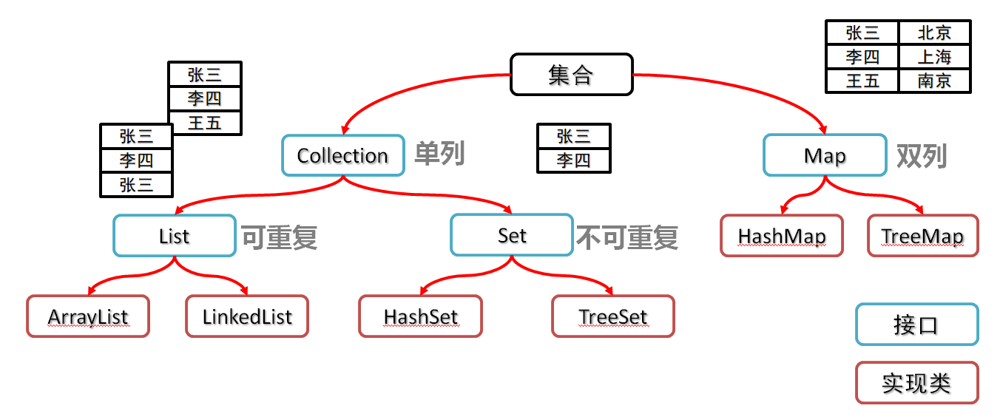
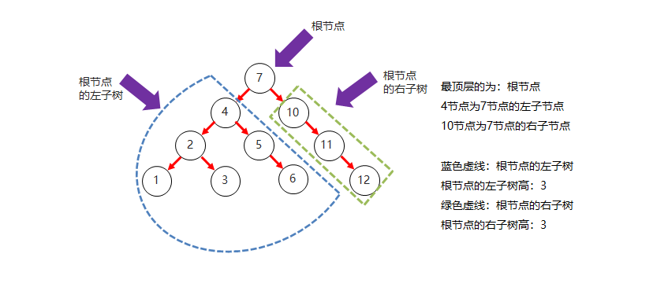
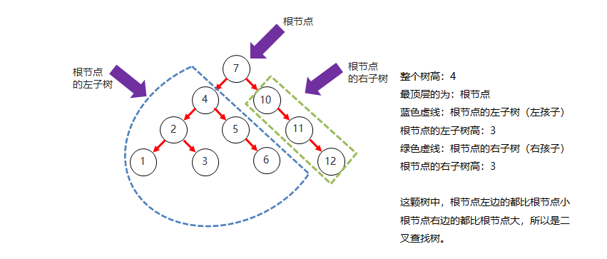
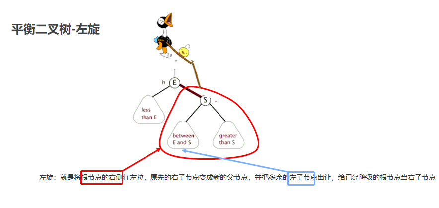
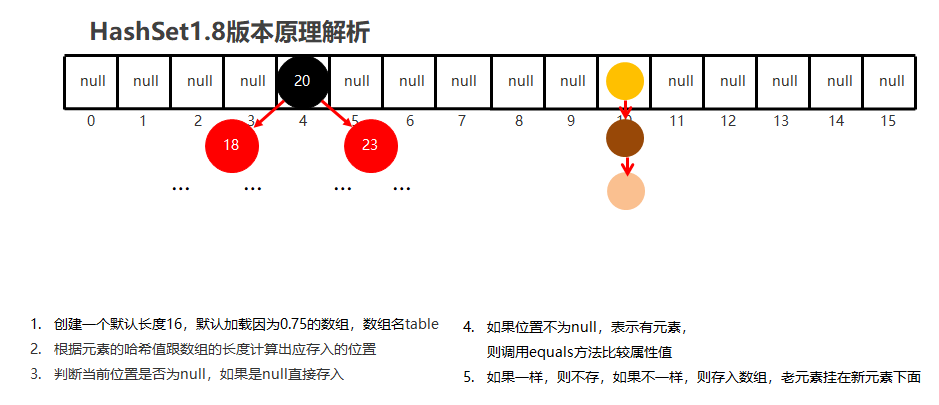

# 集合



## 1. Collection集合

### 1.1 概述与使用

- Collection集合
  - 是单列集合的顶层接口,它表示一组对象,这些对象也称为Collection的元素

  - JDK不提供此接口的任何直接实现.它提供更具体的子接口(如Set和List)实现


- 创建Collection集合的对象

  - 通过多态的方式，创建ArrayList对象或者LinkedList对象赋值给Collection对象
- 常用方法

```java
boolean add(E e)					添加元素
boolean remove(Object o)			从集合中移除指定的元素
boolean removeIf(Object o)			根据条件进行移除
void clear()						清空集合中的元素
boolean contains(Object o)			判断集合中是否存在指定的元素
boolean isEmpty()					判断集合是否为空
int size()							集合的长度，也就是集合中元素的个数
```

### 1.2 迭代器遍历

- 迭代器
  - 集合的专用遍历方式，通过集合对象的iterator()方法得到：
    - `Iterator<E> iterator() ` 返回此集合中元素的迭代器
  - 常用方法：

```java
boolean hasNext()                 如果迭代具有更多元素，则返回 true 。  
E next() 		                  返回迭代中的下一个元素。  
default void remove()             从底层集合中移除此迭代器返回的最后一个元素
```

- Collection集合的遍历

```java
// 创建集合对象
Collection<String> c = new ArrayList<>();
// 添加元素
c.add("hello");
c.add("world");
// 创建迭代器
Iterator<String> it = c.iterator();
// 遍历
while (it.hasNext()) {
    String s = it.next();
    System.out.println(s);
}
```

### 1.3 增强for循环

- 增强for循环

  - 它是JDK5之后出现的,其内部原理是一个Iterator迭代器
  - 实现Iterable接口的类才可以使用迭代器和增强for
  - 简化了数组和Collection集合的遍历

```java
ArrayList<String> list =  new ArrayList<>();
list.add("a");
list.add("b");
// 增强for循环
for(String s : list){
    System.out.println(str);
}
```

## 2. List集合

###  2.1 List集合的概述

- List集合的特点
  - 存取有序
  - 可有重复元素
  - 有索引
- List集合特有方法

```java
void add(int index,E element)            在此集合中的指定位置插入指定的元素
E remove(int index)	                     删除指定索引处的元素，返回被删除的元素
E set(int index,E element)	             修改指定索引处的元素，返回被修改的元素
E get(int index)                         返回指定索引处的元素
```

### 2.2 List集合的实现类

- ArrayList集合
  - 底层是数组结构实现，查询快、增删慢
  
- LinkedList集合
  - 底层是链表结构实现，查询慢、增删快

- LinkedList集合特有方法

```java
public void addFirst(E e)				 在该列表开头插入指定的元素
public void addLast(E e)				 将指定的元素追加到此列表的末尾
public E getFirst()						 返回此列表中的第一个元素
public E getLast()				       	 返回此列表中的最后一个元素
public E removeFirst()					 从此列表中删除并返回第一个元素
public E removeLast()					 从此列表中删除并返回最后一个元素
```

## 3. 泛型

- 泛型是JDK5中引入的特性，它提供了编译时类型安全检测机制

- 泛型的好处

  1. 把运行时期的问题提前到了编译期间
  2. 避免了强制类型转换

- 泛型的定义格式

  - <类型>: 指定一种类型的格式.尖括号里面可任意书写,一般只写一个字母.例如: :\<E>\<T>
  - <类型1,类型2…>: 指定多种类型的格式,多种类型之间用逗号隔开.例如: <E,T> <K,V>

## 4. 数据结构

### 4.1 二叉树

- 二叉树：任意一个节点的度小于等于2的树
  - 节点：树结构中每一个元素称之为节点
  - 度：节点的子节点数量



### 4.2 二叉查找树

- 二叉查找数，又称二叉排序树或者二叉搜索树
- 是特殊的二叉树
- 左子树上所有节点的值都小于根节点的值
- 右子树上所有节点的值都大于根节点的值



- 二叉查找树添加节点规则
  - 小的存左边
  - 大的存右边
  - 一样的不存

### 4.3 平衡二叉树

- 平衡二叉树
  - 左右两个子树高度差不超过一
  - 任意节点的左右两个子树都是一颗平衡二叉树

- 当添加一个新节点时，平衡二叉树不平衡则需要旋转
  - 左旋与右旋
  - **平衡二叉树需旋转的四种情况：左左、左右、右左、右右**




### 4.4 红黑树

- 红黑树的特点

  - 平衡二叉B树
  - 每一个节点可以是红或者黑
  - 红黑树不是高度平衡的,它的平衡是通过"自己的红黑规则"进行实现的

- 红黑树的红黑规则有哪些

  1. 每一个节点或是红色的,或者是黑色的

  2. 根节点必须是黑色

  3. 如果一个节点没有子节点或者父节点,则该节点相应的指针属性值为Nil,这些Nil视为叶节点,每个叶节点(Nil)是黑色的

  4. 如果某一个节点是红色,那么它的子节点必须是黑色(不能出现两个红色节点相连 的情况)

  5. 对每一个节点,从该节点到其所有后代叶节点的简单路径上,均包含相同数目的黑色节点

- 红黑树添加节点可以是红色或者黑色，一般为红色，效率高

## 

- 红黑树添加节点后如何保持红黑规则

  - 根节点位置
    - 直接变为黑色
  - 非根节点位置
    - 父节点为黑色，不需要任何操作,默认红色即可
    - 父节点为红色
      - 叔叔节点为红色
        1. 将"父节点"设为黑色,将"叔叔节点"设为黑色
        2. 将"祖父节点"设为红色
        3. 如果"祖父节点"为根节点,则将根节点再次变成黑色
      - 叔叔节点为黑色
        1. 将"父节点"设为黑色
        2. 将"祖父节点"设为红色
        3. 以"祖父节点"为支点进行旋转

## 5. Set集合

+ 不可以存储重复元素
+ 没有索引,不能使用普通for循环遍历
+ 用迭代器或增强型for循环遍历

### 5.1 TreeSet集合

+ 没有索引
+ 不可以存储重复元素
+ 可以将元素按照规则进行排序

```java
构造方法
TreeSet()                       根据其元素的自然排序进行排序
TreeSet(Comparator comparator)  根据指定的比较器进行排序
```

+ 两种比较方式小结
  + <font color = red>自然排序</font>: 自定义类实现Comparable接口,重写compareTo方法,根据返回值进行排序
  + <font color = red> 比较器排序</font>: 创建对象时传递比较器的实现类对象,重写compare方法,根据返回值排序
  + 默认使用自然排序,当自然排序不满足现在的需求时,选择使用比较器排序
+ 两种方式中关于返回值的规则
  + 如果返回值为负数，表示当前存入的元素是较小值，存左边
  + 如果返回值为0，表示当前存入的元素跟集合中元素重复了，不存
  + 如果返回值为正数，表示当前存入的元素是较大值，存右边

###  5.2 HashSet集合

- 底层数据结构是哈希表
- 存取无序
- 不可以存储重复元素
- 没有索引,不能使用普通for循环遍历

- 基本应用：存储字符串并遍历
- HashSet集合存储自定义类型元素，要想实现元素的唯一，必须重写hashCode方法和equals方法

### 5.3 哈希值

- 哈希值是JDK根据对象的地址或者字符串或者数字算出来的int类型的数值
- Object类中的`public int hashCode()`：返回对象的哈希码值
- 特点：
  - 同一个对象多次调用hashCode()方法返回的哈希值是相同的
  - 默认情况下不同对象的哈希值不同，重写hashCode()方法，可以让不同对象哈希值相同

### 5.4 哈希表结构（理解）

- JDK1.8以前，数组 + 链表
- JDK1.8以后

  - 节点个数少于等于8个，数组 + 链表。

  - 节点个数多于8个，数组 + 红黑树。




## 6. Map集合

### 6.1 概述

- 概述

```java
interface Map<K,V>  K：键的类型；V：值的类型
```

- Map集合的特点

  - 双列集合,一个键对应一个值
  - 键不可以重复,值可以重复

- 基本功能

```java
V put(K key,V value)				添加元素
V remove(Object key)				根据键删除键值对元素
void clear()						移除所有的键值对元素
boolean containsKey(Object key)		判断集合是否包含指定的键
boolean containsValue(Object value)	判断集合是否包含指定的值
boolean isEmpty()					判断集合是否为空
int size()							集合的长度，也就是集合中键值对的个数
```

- 获取功能

```java
V get(Object key)					根据键获取值
Set<K> keySet()						获取所有键的集合
Collection<V> values()				获取所有值的集合
Set<Map.Entry<K,V>> entrySet()		获取所有键值对对象的集合
```

- Map集合的遍历方式一
  - 我们刚才存储的元素都是成对出现的，所以我们把Map看成是一个夫妻对的集合；
  - 把所有的丈夫给集中起来
  - 遍历丈夫的集合，获取到每一个丈夫
  - 根据丈夫去找对应的妻子
- ​	代码实现

```java
public class MapDemo01 {
    public static void main(String[] args) {
        //创建集合对象
        Map<String, String> map = new HashMap<String, String>();

        //添加元素
        map.put("张无忌", "赵敏");
        map.put("郭靖", "黄蓉");
        map.put("杨过", "小龙女");

        //获取所有键的集合。用keySet()方法实现
        Set<String> keySet = map.keySet();
        //遍历键的集合，获取到每一个键。用增强for实现
        for (String key : keySet) {
            //根据键去找值。用get(Object key)方法实现
            String value = map.get(key);
            System.out.println(key + "," + value);
        }
    }
}
```

- Map集合的遍历方式二
  - 我们刚才存储的元素都是成对出现的，所以我们把Map看成是一个夫妻对的集合
  - 获取所有结婚证的集合
  - 遍历结婚证的集合，得到每一个结婚证
  - 根据结婚证获取丈夫和妻子

- 代码实现

```java
public class MapDemo02 {
    public static void main(String[] args) {
        //创建集合对象
        Map<String, String> map = new HashMap<String, String>();

        //添加元素
        map.put("张无忌", "赵敏");
        map.put("郭靖", "黄蓉");
        map.put("杨过", "小龙女");

        //获取所有键值对对象的集合
        Set<Map.Entry<String, String>> entrySet = map.entrySet();
        //遍历键值对对象的集合，得到每一个键值对对象
        for (Map.Entry<String, String> me : entrySet) {
            //根据键值对对象获取键和值
            String key = me.getKey();
            String value = me.getValue();
            System.out.println(key + "," + value);
        }
    }
}
```

### 6.2 HashMap集合

+ HashMap底层是哈希表结构的
+ 依赖hashCode方法和equals方法保证键的唯一
+ 如果键要存储的是自定义对象，需要重写hashCode和equals方法

### 6.3 TreeMap集合

+ TreeMap底层是红黑树结构
+ 依赖自然排序或者比较器排序,对键进行排序
+ 如果键存储的是自定义对象,需要实现Comparable接口或者在创建TreeMap对象时候给出比较器排序规则

### 6.4 可变参数

- 可变参数介绍

  - 可变参数又称参数个数可变，用作方法的形参出现，那么方法参数个数就是可变的了
  - 方法的参数类型已经确定,个数不确定,我们可以使用可变参数

- 可变参数的注意事项

  - 这里的变量其实是一个数组
  - 如果一个方法有多个参数，包含可变参数，可变参数要放在最后

- 可变参数定义格式

  ```java
  修饰符 返回值类型 方法名(数据类型… 变量名) {  }
  public static int sum(int... a) {
      int sum = 0;
      for (int i : a) {
          sum += i;
      }
      retunr su
  }
  ```

### 6.5 创建不可变集合

方法介绍

- 在List、Set、Map接口中,都存在of方法,可以创建一个不可变的集合
  - 这个集合不能添加,不能删除,不能修改
  - 但是可以结合集合的带参构造,实现集合的批量添加
- 在Map接口中,还有一个ofEntries方法可以提高代码的阅读性
  - 首先会把键值对封装成一个Entry对象,再把这个Entry对象添加到集合当中

