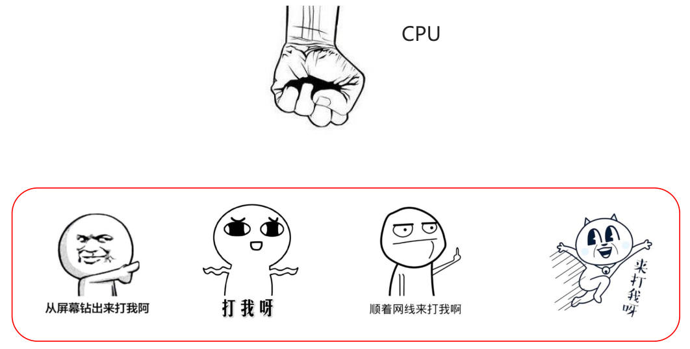
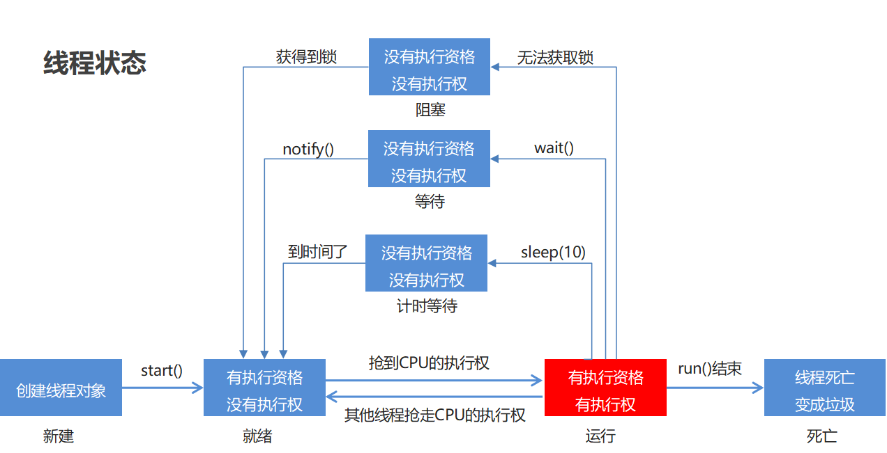

## 1. 实现多线程

### 1.1 简单了解多线程

是指从软件或者硬件上实现多个线程并发执行的技术。
具有多线程能力的计算机因有硬件支持而能够在同一时间执行多个线程，提升性能。


### 1.2 并发和并行

+ 并行：在同一时刻，有多个指令在多个CPU上同时执行。

  

+ 并发：在同一时刻，有多个指令在单个CPU上交替执行。

  

### 1.3 进程和线程

- 进程：是正在运行的程序

  - 独立性：进程是一个能独立运行的基本单位，同时也是系统分配资源和调度的独立单位

  - 动态性：进程的实质是程序的一次执行过程，进程是动态产生，动态消亡的

  - 并发性：任何进程都可以同其他进程一起并发执行

- 线程：是进程中的单个顺序控制流，是一条执行路径

  - 单线程：一个进程如果只有一条执行路径，则称为单线程程序
  - 多线程：一个进程如果有多条执行路径，则称为多线程程序

  ​	


### 1.4 实现多线程方式一：继承Thread类

- 方法介绍

  | 方法名          | 说明                         |
  | ------------ | -------------------------- |
  | void run()   | 在线程开启后，此方法将被调用执行           |
  | void start() | 使此线程开始执行，Java虚拟机会调用run方法() |

- 实现步骤
  - 定义一个类MyThread继承Thread类
  - 在MyThread类中重写run()方法
  - 创建MyThread类的对象
  - 启动线程

- 代码演示

  ```java
  public class MyThread extends Thread {
      @Override
      public void run() {
          for(int i=0; i<100; i++) {
              System.out.println(i);
          }
      }
  }
  public class MyThreadDemo {
      public static void main(String[] args) {
          MyThread my1 = new MyThread();
          MyThread my2 = new MyThread();

  //        my1.run();
  //        my2.run();

          //void start() 导致此线程开始执行; Java虚拟机调用此线程的run方法
          my1.start();
          my2.start();
      }
  }
  ```

- 两个小问题

  - 为什么要重写run()方法？

    因为run()是用来封装被线程执行的代码

  - run()方法和start()方法的区别？

    run()：封装线程执行的代码，直接调用，相当于普通方法的调用

    start()：启动线程；然后由JVM调用此线程的run()方法

### 1.5 实现多线程方式二：实现Runnable接口

- Thread构造方法

  | 方法名                                  | 说明             |
  | ------------------------------------ | -------------- |
  | Thread(Runnable target)              | 分配一个新的Thread对象 |
  | Thread(Runnable target, String name) | 分配一个新的Thread对象 |

- 实现步骤

  - 定义一个类MyRunnable实现Runnable接口
  - 在MyRunnable类中重写run()方法
  - 创建MyRunnable类的对象
  - 创建Thread类的对象，把MyRunnable对象作为构造方法的参数
  - 启动线程

- 代码演示

  ```java
  public class MyRunnable implements Runnable {
      @Override
      public void run() {
          for(int i=0; i<100; i++) {
              System.out.println(Thread.currentThread().getName()+":"+i);
          }
      }
  }
  public class MyRunnableDemo {
      public static void main(String[] args) {
          //创建MyRunnable类的对象
          MyRunnable my = new MyRunnable();
  
          //创建Thread类的对象，把MyRunnable对象作为构造方法的参数
          //Thread(Runnable target)
  //        Thread t1 = new Thread(my);
  //        Thread t2 = new Thread(my);
          //Thread(Runnable target, String name)
          Thread t1 = new Thread(my,"坦克");
          Thread t2 = new Thread(my,"飞机");
  
          //启动线程
          t1.start();
          t2.start();
      }
  }
  ```

### 1.6 实现多线程方式三: 实现Callable接口

+ 方法介绍

  | 方法名                              | 说明                                  |
  | -------------------------------- | ----------------------------------- |
  | V call()                         | 计算结果，如果无法计算结果，则抛出一个异常               |
  | FutureTask(Callable<V> callable) | 创建一个 FutureTask，一旦运行就执行给定的 Callable |
  | V get()                          | 如有必要，等待计算完成，然后获取其结果                 |

+ 实现步骤

  + 定义一个类MyCallable实现Callable接口
  + 在MyCallable类中重写call()方法
  + 创建MyCallable类的对象
  + 创建Future的实现类FutureTask对象，把MyCallable对象作为构造方法的参数
  + 创建Thread类的对象，把FutureTask对象作为构造方法的参数
  + 启动线程
  + 再调用get方法，就可以获取线程结束之后的结果。

+ 代码演示

  ```java
  public class MyCallable implements Callable<String> {
      @Override
      public String call() throws Exception {
          for (int i = 0; i < 100; i++) {
              System.out.println("跟女孩表白" + i);
          }
          //返回值就表示线程运行完毕之后的结果
          return "答应";
      }
  }
  public class Demo {
      public static void main(String[] args) throws ExecutionException, InterruptedException {
          //线程开启之后需要执行里面的call方法
          MyCallable mc = new MyCallable();

          //Thread t1 = new Thread(mc);

          //可以获取线程执行完毕之后的结果.也可以作为参数传递给Thread对象
          FutureTask<String> ft = new FutureTask<>(mc);

          //创建线程对象
          Thread t1 = new Thread(ft);

          String s = ft.get();
          //开启线程
          t1.start();

          //String s = ft.get();
          System.out.println(s);
      }
  }
  ```

+ 三种实现方式的对比
  + 实现Runnable、Callable接口
    + 好处: 扩展性强，实现该接口的同时还可以继承其他的类
    + 缺点: 编程相对复杂，不能直接使用Thread类中的方法
  + 继承Thread类
    + 好处: 编程比较简单，可以直接使用Thread类中的方法
    + 缺点: 可以扩展性较差，不能再继承其他的类

### 1.7 设置和获取线程名称

- 方法介绍

  | 方法名                         | 说明                               |
  | ------------------------------ | ---------------------------------- |
  | void  setName(String name)     | 将此线程的名称更改为等于参数name   |
  | String  getName()              | 返回此线程的名称                   |
  | static Thread  currentThread() | 返回对当前正在执行的线程对象的引用 |

- 代码演示

  ```java
  public class MyThread extends Thread {
      public MyThread() {}
      public MyThread(String name) {
          super(name);
      }
  
      @Override
      public void run() {
          for (int i = 0; i < 100; i++) {
              System.out.println(getName()+":"+i);
          }
      }
  }
  public class MyThreadDemo {
      public static void main(String[] args) {
          MyThread my1 = new MyThread();
          MyThread my2 = new MyThread();
  
          //void setName(String name)：将此线程的名称更改为等于参数 name
          my1.setName("高铁");
          my2.setName("飞机");
  
          //Thread(String name)
          MyThread my1 = new MyThread("高铁");
          MyThread my2 = new MyThread("飞机");
  
          my1.start();
          my2.start();
  
          //static Thread currentThread() 返回对当前正在执行的线程对象的引用
          System.out.println(Thread.currentThread().getName());
      }
  }
  ```

### 1.8 线程休眠

+ 相关方法

  | 方法名                            | 说明                       |
  | ------------------------------ | ------------------------ |
  | static void sleep(long millis) | 使当前正在执行的线程停留（暂停执行）指定的毫秒数 |

+ 代码演示

  ```java
  public class MyRunnable implements Runnable {
      @Override
      public void run() {
          for (int i = 0; i < 100; i++) {
              try {
                  Thread.sleep(100);
              } catch (InterruptedException e) {
                  e.printStackTrace();
              }
  
              System.out.println(Thread.currentThread().getName() + "---" + i);
          }
      }
  }
  public class Demo {
      public static void main(String[] args) throws InterruptedException {
          /*System.out.println("睡觉前");
          Thread.sleep(3000);
          System.out.println("睡醒了");*/
  
          MyRunnable mr = new MyRunnable();
  
          Thread t1 = new Thread(mr);
          Thread t2 = new Thread(mr);
  
          t1.start();
          t2.start();
      }
  }
  ```

### 1.9 线程优先级

- 线程调度

  - 两种调度方式
    - 分时调度模型：所有线程轮流使用 CPU 的使用权，平均分配每个线程占用 CPU 的时间片
    - 抢占式调度模型：优先让优先级高的线程使用 CPU，如果线程的优先级相同，那么会随机选择一个，优先级高的线程获取的 CPU 时间片相对多一些

  - Java使用的是抢占式调度模型

  - 随机性

    假如计算机只有一个 CPU，那么 CPU 在某一个时刻只能执行一条指令，线程只有得到CPU时间片，也就是使用权，才可以执行指令。所以说多线程程序的执行是有随机性，因为谁抢到CPU的使用权是不一定的

    

- 优先级相关方法

  | 方法名                                     | 说明                                |
  | --------------------------------------- | --------------------------------- |
  | final int getPriority()                 | 返回此线程的优先级                         |
  | final void setPriority(int newPriority) | 更改此线程的优先级线程默认优先级是5；线程优先级的范围是：1-10 |

- 代码演示

  ```java
  public class MyCallable implements Callable<String> {
      @Override
      public String call() throws Exception {
          for (int i = 0; i < 100; i++) {
              System.out.println(Thread.currentThread().getName() + "---" + i);
          }
          return "线程执行完毕了";
      }
  }
  public class Demo {
      public static void main(String[] args) {
          //优先级: 1 - 10 默认值:5
          MyCallable mc = new MyCallable();
  
          FutureTask<String> ft = new FutureTask<>(mc);
  
          Thread t1 = new Thread(ft);
          t1.setName("飞机");
          t1.setPriority(10);
          //System.out.println(t1.getPriority());//5
          t1.start();
  
          MyCallable mc2 = new MyCallable();
  
          FutureTask<String> ft2 = new FutureTask<>(mc2);
  
          Thread t2 = new Thread(ft2);
          t2.setName("坦克");
          t2.setPriority(1);
          //System.out.println(t2.getPriority());//5
          t2.start();
      }
  }
  ```

### 1.10 守护线程

- 相关方法

  | 方法名                        | 说明                                   |
  | -------------------------- | ------------------------------------ |
  | void setDaemon(boolean on) | 将此线程标记为守护线程，当运行的线程都是守护线程时，Java虚拟机将退出 |

- 代码演示

  ```java
  public class MyThread1 extends Thread {
      @Override
      public void run() {
          for (int i = 0; i < 10; i++) {
              System.out.println(getName() + "---" + i);
          }
      }
  }
  public class MyThread2 extends Thread {
      @Override
      public void run() {
          for (int i = 0; i < 100; i++) {
              System.out.println(getName() + "---" + i);
          }
      }
  }
  public class Demo {
      public static void main(String[] args) {
          MyThread1 t1 = new MyThread1();
          MyThread2 t2 = new MyThread2();
  
          t1.setName("女神");
          t2.setName("备胎");
  
          //把第二个线程设置为守护线程
          //当普通线程执行完之后,那么守护线程也没有继续运行下去的必要了.
          t2.setDaemon(true);
  
          t1.start();
          t2.start();
      }
  }
  ```

## 2. 线程同步

### 2.1 卖票

- 案例需求

  某电影院目前正在上映国产大片，共有100张票，而它有3个窗口卖票，请设计一个程序模拟该电影院卖票

- 实现步骤

  - 定义一个类SellTicket实现Runnable接口，里面定义一个成员变量：private int tickets = 100;

  - 在SellTicket类中重写run()方法实现卖票，代码步骤如下

  - 判断票数大于0，就卖票，并告知是哪个窗口卖的
  - 卖了票之后，总票数要减1
  - 票卖没了，线程停止
  - 定义一个测试类SellTicketDemo，里面有main方法，代码步骤如下
  - 创建SellTicket类的对象
  - 创建三个Thread类的对象，把SellTicket对象作为构造方法的参数，并给出对应的窗口名称
  - 启动线程

- 代码实现

  ```java
  public class SellTicket implements Runnable {
      private int tickets = 100;
      //在SellTicket类中重写run()方法实现卖票，代码步骤如下
      @Override
      public void run() {
          while (true) {
              if(ticket <= 0){
                      //卖完了
                      break;
                  }else{
                      try {
                          Thread.sleep(100);
                      } catch (InterruptedException e) {
                          e.printStackTrace();
                      }
                      ticket--;
                      System.out.println(Thread.currentThread().getName() + "在卖票,还剩下" + ticket + "张票");
                  }
          }
      }
  }
  public class SellTicketDemo {
      public static void main(String[] args) {
          //创建SellTicket类的对象
          SellTicket st = new SellTicket();
  
          //创建三个Thread类的对象，把SellTicket对象作为构造方法的参数，并给出对应的窗口名称
          Thread t1 = new Thread(st,"窗口1");
          Thread t2 = new Thread(st,"窗口2");
          Thread t3 = new Thread(st,"窗口3");
  
          //启动线程
          t1.start();
          t2.start();
          t3.start();
      }
  }
  ```


### 2.2 卖票案例的问题

- 卖票出现了问题

  - 相同的票出现了多次

  - 出现了负数的票

- 问题产生原因

  线程执行的随机性导致的,可能在卖票过程中丢失cpu的执行权,导致出现问题


### 2.3 同步代码块解决数据安全问题

- 安全问题出现的条件

  - 是多线程环境

  - 有共享数据

  - 有多条语句操作共享数据

- 如何解决多线程安全问题呢?

  - 基本思想：让程序没有安全问题的环境

- 怎么实现呢?

  - 把多条语句操作共享数据的代码给锁起来，让任意时刻只能有一个线程执行即可

  - Java提供了同步代码块的方式来解决

- 同步代码块格式：

  ```java
  synchronized(任意对象) { 
  	多条语句操作共享数据的代码 
  }
  ```

  synchronized(任意对象)：就相当于给代码加锁了，任意对象就可以看成是一把锁

- 同步的好处和弊端  

  - 好处：解决了多线程的数据安全问题

  - 弊端：当线程很多时，因为每个线程都会去判断同步上的锁，这是很耗费资源的，无形中会降低程序的运行效率

- 代码演示

  ```java
  public class SellTicket implements Runnable {
      private int tickets = 100;
      private Object obj = new Object();
  
      @Override
      public void run() {
          while (true) {
              synchronized (obj) { // 对可能有安全问题的代码加锁,多个线程必须使用同一把锁
                  //t1进来后，就会把这段代码给锁起来
                  if (tickets > 0) {
                      try {
                          Thread.sleep(100);
                          //t1休息100毫秒
                      } catch (InterruptedException e) {
                          e.printStackTrace();
                      }
                      //窗口1正在出售第100张票
                      System.out.println(Thread.currentThread().getName() + "正在出售第" + tickets + "张票");
                      tickets--; //tickets = 99;
                  }
              }
              //t1出来了，这段代码的锁就被释放了
          }
      }
  }
  
  public class SellTicketDemo {
      public static void main(String[] args) {
          SellTicket st = new SellTicket();
  
          Thread t1 = new Thread(st, "窗口1");
          Thread t2 = new Thread(st, "窗口2");
          Thread t3 = new Thread(st, "窗口3");
  
          t1.start();
          t2.start();
          t3.start();
      }
  }
  ```

### 2.4 同步方法解决数据安全问题

- 同步方法的格式

  同步方法：就是把synchronized关键字加到方法上

  ```java
  修饰符 synchronized 返回值类型 方法名(方法参数) { 
  	方法体；
  }
  ```

  同步方法的锁对象是什么呢?

  ​	this

- 静态同步方法

  同步静态方法：就是把synchronized关键字加到静态方法上

  ```java
  修饰符 static synchronized 返回值类型 方法名(方法参数) { 
  	方法体；
  }
  ```

  同步静态方法的锁对象是什么呢?

  ​	类名.class

- 代码演示

  ```java
  public class MyRunnable implements Runnable {
      private static int ticketCount = 100;
  
      @Override
      public void run() {
          while(true){
              if("窗口一".equals(Thread.currentThread().getName())){
                  //同步方法
                  boolean result = synchronizedMthod();
                  if(result){
                      break;
                  }
              }
  
              if("窗口二".equals(Thread.currentThread().getName())){
                  //同步代码块
                  synchronized (MyRunnable.class){
                      if(ticketCount == 0){
                         break;
                      }else{
                          try {
                              Thread.sleep(10);
                          } catch (InterruptedException e) {
                              e.printStackTrace();
                          }
                          ticketCount--;
                          System.out.println(Thread.currentThread().getName() + "在卖票,还剩下" + ticketCount + "张票");
                      }
                  }
              }
  
          }
      }
  
      private static synchronized boolean synchronizedMthod() {
          if(ticketCount == 0){
              return true;
          }else{
              try {
                  Thread.sleep(10);
              } catch (InterruptedException e) {
                  e.printStackTrace();
              }
              ticketCount--;
              System.out.println(Thread.currentThread().getName() + "在卖票,还剩下" + ticketCount + "张票");
              return false;
          }
      }
  }
  
  public class Demo {
    public static void main(String[] args) {
        MyRunnable mr = new MyRunnable();
  
        Thread t1 = new Thread(mr);
        Thread t2 = new Thread(mr);
  
        t1.setName("窗口一");
        t2.setName("窗口二");
  
        t1.start();
        t2.start();
    }
  
  }
  ```

### 2.5 Lock 锁

虽然我们可以理解同步代码块和同步方法的锁对象问题，但是我们并没有直接看到在哪里加上了锁，在哪里释放了锁，为了更清晰的表达如何加锁和释放锁，JDK5以后提供了一个新的锁对象Lock

Lock是接口不能直接实例化，这里采用它的实现类ReentrantLock来实例化

- ReentrantLock构造方法

  | 方法名             | 说明                   |
  | --------------- | -------------------- |
  | ReentrantLock() | 创建一个ReentrantLock的实例 |

- 加锁解锁方法

  | 方法名           | 说明   |
  | ------------- | ---- |
  | void lock()   | 获得锁  |
  | void unlock() | 释放锁  |

- 代码演示

  ```java
  public class Ticket implements Runnable {
      //票的数量
      private int ticket = 100;
      private Object obj = new Object();
      private ReentrantLock lock = new ReentrantLock();
  
      @Override
      public void run() {
          while (true) {
              //synchronized (obj){//多个线程必须使用同一把锁.
              try {
                  lock.lock();
                  if (ticket <= 0) {
                      //卖完了
                      break;
                  } else {
                      Thread.sleep(100);
                      ticket--;
                      System.out.println(Thread.currentThread().getName() + "在卖票,还剩下" + ticket + "张票");
                  }
              } catch (InterruptedException e) {
                  e.printStackTrace();
              } finally {
                  lock.unlock();
              }
              // }
          }
      }
  }
  
  public class Demo {
      public static void main(String[] args) {
          Ticket ticket = new Ticket();
  
          Thread t1 = new Thread(ticket);
          Thread t2 = new Thread(ticket);
          Thread t3 = new Thread(ticket);
  
          t1.setName("窗口一");
          t2.setName("窗口二");
          t3.setName("窗口三");
  
          t1.start();
          t2.start();
          t3.start();
      }
  }
  ```

### 2.6 死锁

+ 概述

  线程死锁是指由于两个或者多个线程互相持有对方所需要的资源，导致这些线程处于等待状态，无法前往执行

+ 什么情况下会产生死锁

  1. 资源有限
  2. 同步嵌套

+ 代码演示

  ```java
  public class Demo {
      public static void main(String[] args) {
          Object objA = new Object();
          Object objB = new Object();
  
          new Thread(()->{
              while(true){
                  synchronized (objA){
                      //线程一
                      synchronized (objB){
                          System.out.println("小康同学正在走路");
                      }
                  }
              }
          }).start();
  
          new Thread(()->{
              while(true){
                  synchronized (objB){
                      //线程二
                      synchronized (objA){
                          System.out.println("小薇同学正在走路");
                      }
                  }
              }
          }).start();
      }
  }
  ```

## 3. 生产者消费者

### 3.1 生产者和消费者模式概述

- 概述

  生产者消费者模式是一个十分经典的多线程协作的模式，弄懂生产者消费者问题能够让我们对多线程编程的理解更加深刻。

  所谓生产者消费者问题，实际上主要是包含了两类线程：

  ​	一类是生产者线程用于生产数据

  ​	一类是消费者线程用于消费数据

  为了解耦生产者和消费者的关系，通常会采用共享的数据区域，就像是一个仓库

  生产者生产数据之后直接放置在共享数据区中，并不需要关心消费者的行为

  消费者只需要从共享数据区中去获取数据，并不需要关心生产者的行为

- Object类的等待和唤醒方法

  | 方法名              | 说明                                       |
  | ---------------- | ---------------------------------------- |
  | void wait()      | 导致当前线程等待，直到另一个线程调用该对象的 notify()方法或 notifyAll()方法 |
  | void notify()    | 唤醒正在等待对象监视器的单个线程                         |
  | void notifyAll() | 唤醒正在等待对象监视器的所有线程                         |

### 3.2 生产者和消费者案例

- 案例需求

  + 桌子类(Desk)：定义表示包子数量的变量,定义锁对象变量,定义标记桌子上有无包子的变量

  + 生产者类(Cooker)：实现Runnable接口，重写run()方法，设置线程任务

      1.判断是否有包子,决定当前线程是否执行

      2.如果有包子,就进入等待状态,如果没有包子,继续执行,生产包子

      3.生产包子之后,更新桌子上包子状态,唤醒消费者消费包子

  + 消费者类(Foodie)：实现Runnable接口，重写run()方法，设置线程任务

      1.判断是否有包子,决定当前线程是否执行

      2.如果没有包子,就进入等待状态,如果有包子,就消费包子

      3.消费包子后,更新桌子上包子状态,唤醒生产者生产包子

  + 测试类(Demo)：里面有main方法，main方法中的代码步骤如下

      创建生产者线程和消费者线程对象

      分别开启两个线程

- 代码实现

  ```java
  public class Desk {
  
      //定义一个标记
      //true 就表示桌子上有汉堡包的,此时允许吃货执行
      //false 就表示桌子上没有汉堡包的,此时允许厨师执行
      public static boolean flag = false;
  
      //汉堡包的总数量
      public static int count = 10;
  
      //锁对象
      public static final Object lock = new Object();
  }
  
  public class Cooker extends Thread {
  //    生产者步骤：
  //            1，判断桌子上是否有汉堡包
  //    如果有就等待，如果没有才生产。
  //            2，把汉堡包放在桌子上。
  //            3，叫醒等待的消费者开吃。
      @Override
      public void run() {
          while(true){
              synchronized (Desk.lock){
                  if(Desk.count == 0){
                      break;
                  }else{
                      if(!Desk.flag){
                          //生产
                          System.out.println("厨师正在生产汉堡包");
                          Desk.flag = true;
                          Desk.lock.notifyAll();
                      }else{
                          try {
                              Desk.lock.wait();
                          } catch (InterruptedException e) {
                              e.printStackTrace();
                          }
                      }
                  }
              }
          }
      }
  }
  
  public class Foodie extends Thread {
      @Override
      public void run() {
  //        1，判断桌子上是否有汉堡包。
  //        2，如果没有就等待。
  //        3，如果有就开吃
  //        4，吃完之后，桌子上的汉堡包就没有了
  //                叫醒等待的生产者继续生产
  //        汉堡包的总数量减一
  
          //套路:
              //1. while(true)死循环
              //2. synchronized 锁,锁对象要唯一
              //3. 判断,共享数据是否结束. 结束
              //4. 判断,共享数据是否结束. 没有结束
          while(true){
              synchronized (Desk.lock){
                  if(Desk.count == 0){
                      break;
                  }else{
                      if(Desk.flag){
                          //有
                          System.out.println("吃货在吃汉堡包");
                          Desk.flag = false;
                          Desk.lock.notifyAll();
                          Desk.count--;
                      }else{
                          //没有就等待
                          //使用什么对象当做锁,那么就必须用这个对象去调用等待和唤醒的方法.
                          try {
                              Desk.lock.wait();
                          } catch (InterruptedException e) {
                              e.printStackTrace();
                          }
                      }
                  }
              }
          }
  
      }
  }
  
  public class Demo {
      public static void main(String[] args) {
          /*消费者步骤：
          1，判断桌子上是否有汉堡包。
          2，如果没有就等待。
          3，如果有就开吃
          4，吃完之后，桌子上的汉堡包就没有了
                  叫醒等待的生产者继续生产
          汉堡包的总数量减一*/
  
          /*生产者步骤：
          1，判断桌子上是否有汉堡包
          如果有就等待，如果没有才生产。
          2，把汉堡包放在桌子上。
          3，叫醒等待的消费者开吃。*/
  
          Foodie f = new Foodie();
          Cooker c = new Cooker();
  
          f.start();
          c.start();
  
      }
  }
  ```


## 4. 线程池

### 4.1 线程状态介绍

当线程被创建并启动以后，它既不是一启动就进入了执行状态，也不是一直处于执行状态。线程对象在不同的时期有不同的状态。那么Java中的线程存在哪几种状态呢？Java中的线程

状态被定义在了java.lang.Thread.State枚举类中，State枚举类的源码如下：

```java
public class Thread {
    
    public enum State {
    
        /* 新建 */
        NEW , 

        /* 可运行状态 */
        RUNNABLE , 

        /* 阻塞状态 */
        BLOCKED , 

        /* 无限等待状态 */
        WAITING , 

        /* 计时等待 */
        TIMED_WAITING , 

        /* 终止 */
        TERMINATED;
    
	}
    
    // 获取当前线程的状态
    public State getState() {
        return jdk.internal.misc.VM.toThreadState(threadStatus);
    }
    
}
```

通过源码我们可以看到Java中的线程存在6种状态，每种线程状态的含义如下

| 线程状态      | 具体含义                                                     |
| ------------- | ------------------------------------------------------------ |
| NEW           | 一个尚未启动的线程的状态。也称之为初始状态、开始状态。线程刚被创建，但是并未启动。还没调用start方法。MyThread t = new MyThread()只有线程象，没有线程特征。 |
| RUNNABLE      | 当我们调用线程对象的start方法，那么此时线程对象进入了RUNNABLE状态。那么此时才是真正的在JVM进程中创建了一个线程，线程一经启动并不是立即得到执行，线程的运行与否要听令与CPU的调度，那么我们把这个中间状态称之为可执行状态(RUNNABLE)也就是说它具备执行的资格，但是并没有真正的执行起来而是在等待CPU的度。 |
| BLOCKED       | 当一个线程试图获取一个对象锁，而该对象锁被其他的线程持有，则该线程进入Blocked状态；当该线程持有锁时，该线程将变成Runnable状态。 |
| WAITING       | 一个正在等待的线程的状态。也称之为等待状态。造成线程等待的原因有两种，分别是调用Object.wait()、join()方法。处于等待状态的线程，正在等待其他线程去执行一个特定的操作。例如：因为wait()而等待的线程正在等待另一个线程去调用notify()或notifyAll()；一个因为join()而等待的线程正在等待另一个线程结束。 |
| TIMED_WAITING | 一个在限定时间内等待的线程的状态。也称之为限时等待状态。造成线程限时等待状态的原因有三种，分别是：Thread.sleep(long)，Object.wait(long)、join(long)。 |
| TERMINATED    | 一个完全运行完成的线程的状态。也称之为终止状态、结束状态     |

各个状态的转换，如下图所示：



### 4.2 线程池-基本原理

- **概述 :** 提到池，大家应该能想到的就是水池。水池就是一个容器，在该容器中存储了很多的水。那么什么是线程池呢？线程池也是可以看做成一个池子，在该池子中存储很多个线程。

- 线程池存在的意义：系统创建一个线程的成本是比较高的，因为它涉及到与操作系统交互，当程序中需要创建大量生存期很短暂的线程时，频繁的创建和销毁线程对系统的资源消耗有可能大于业务处理时对系统资源的消耗，这样就有点"舍本逐末"了。针对这一种情况，为了提高性能，我们就可以采用线程池。线程池在启动的时，会创建大量空闲线程，当我们向线程池提交任务的时，线程池就会启动一个线程来执行该任务。等待任务执行完毕以后，线程并不会死亡，而是再次返回到线程池中称为空闲状态。等待下一次任务的执行。

**线程池的设计思路 :**

1. 准备一个任务容器
2. 一次性启动多个(2个)消费者线程
3. 刚开始任务容器是空的，所以线程都在wait
4. 直到一个外部线程向这个任务容器中扔了一个"任务"，就会有一个消费者线程被唤醒
5. 这个消费者线程取出"任务"，并且执行这个任务，执行完毕后，继续等待下一次任务的到来

### 4.3 线程池-Executors默认线程池

概述 : JDK对线程池也进行了相关的实现，在真实企业开发中我们也很少去自定义线程池，而是使用JDK中自带的线程池。

我们可以使用Executors中所提供的**静态**方法来创建线程池

​	static ExecutorService newCachedThreadPool()   创建一个默认的线程池
​	static newFixedThreadPool(int nThreads)	    创建一个指定最多线程数量的线程池

**代码实现 :** 

```java
package com.itheima.mythreadpool;


//static ExecutorService newCachedThreadPool()   创建一个默认的线程池
//static newFixedThreadPool(int nThreads)	    创建一个指定最多线程数量的线程池

import java.util.concurrent.ExecutorService;
import java.util.concurrent.Executors;

public class MyThreadPoolDemo {
    public static void main(String[] args) throws InterruptedException {

        //1,创建一个默认的线程池对象.池子中默认是空的.默认最多可以容纳int类型的最大值.
        ExecutorService executorService = Executors.newCachedThreadPool();
        //Executors --- 可以帮助我们创建线程池对象
        //ExecutorService --- 可以帮助我们控制线程池

        executorService.submit(()->{
            System.out.println(Thread.currentThread().getName() + "在执行了");
        });

        //Thread.sleep(2000);

        executorService.submit(()->{
            System.out.println(Thread.currentThread().getName() + "在执行了");
        });

        executorService.shutdown();
    }
}

```


### 4.4 线程池-Executors创建指定上限的线程池

**使用Executors中所提供的静态方法来创建线程池**

​	static ExecutorService newFixedThreadPool(int nThreads) : 创建一个指定最多线程数量的线程池

**代码实现 :** 

```java
package com.itheima.mythreadpool;

//static ExecutorService newFixedThreadPool(int nThreads)
//创建一个指定最多线程数量的线程池

import java.util.concurrent.ExecutorService;
import java.util.concurrent.Executors;
import java.util.concurrent.ThreadPoolExecutor;

public class MyThreadPoolDemo2 {
    public static void main(String[] args) {
        //参数不是初始值而是最大值
        ExecutorService executorService = Executors.newFixedThreadPool(10);

        ThreadPoolExecutor pool = (ThreadPoolExecutor) executorService;
        System.out.println(pool.getPoolSize());//0

        executorService.submit(()->{
            System.out.println(Thread.currentThread().getName() + "在执行了");
        });

        executorService.submit(()->{
            System.out.println(Thread.currentThread().getName() + "在执行了");
        });

        System.out.println(pool.getPoolSize());//2
//        executorService.shutdown();
    }
}

```


### 4.5 线程池-ThreadPoolExecutor

**创建线程池对象 :** 

ThreadPoolExecutor threadPoolExecutor = new ThreadPoolExecutor(核心线程数量,最大线程数量,空闲线程最大存活时间,任务队列,创建线程工厂,任务的拒绝策略);

**代码实现 :** 

```java
package com.itheima.mythreadpool;

import java.util.concurrent.ArrayBlockingQueue;
import java.util.concurrent.Executors;
import java.util.concurrent.ThreadPoolExecutor;
import java.util.concurrent.TimeUnit;

public class MyThreadPoolDemo3 {
//    参数一：核心线程数量
//    参数二：最大线程数
//    参数三：空闲线程最大存活时间
//    参数四：时间单位
//    参数五：任务队列
//    参数六：创建线程工厂
//    参数七：任务的拒绝策略
    public static void main(String[] args) {
        ThreadPoolExecutor pool = new ThreadPoolExecutor(2,5,2,TimeUnit.SECONDS,new ArrayBlockingQueue<>(10), Executors.defaultThreadFactory(),new ThreadPoolExecutor.AbortPolicy());
        pool.submit(new MyRunnable());
        pool.submit(new MyRunnable());

        pool.shutdown();
    }
}
```

### 4.6 线程池-参数详解


```java
public ThreadPoolExecutor(int corePoolSize,
                              int maximumPoolSize,
                              long keepAliveTime,
                              TimeUnit unit,
                              BlockingQueue<Runnable> workQueue,
                              ThreadFactory threadFactory,
                              RejectedExecutionHandler handler)
    
corePoolSize：   核心线程的最大值，不能小于0
maximumPoolSize：最大线程数，不能小于等于0，maximumPoolSize >= corePoolSize
keepAliveTime：  空闲线程最大存活时间,不能小于0
unit：           时间单位
workQueue：      任务队列，不能为null
threadFactory：  创建线程工厂,不能为null      
handler：        任务的拒绝策略,不能为null  
```


### 4.7 线程池-非默认任务拒绝策略

RejectedExecutionHandler是jdk提供的一个任务拒绝策略接口，它下面存在4个子类。

```java
ThreadPoolExecutor.AbortPolicy: 		    丢弃任务并抛出RejectedExecutionException异常。是默认的策略。
ThreadPoolExecutor.DiscardPolicy： 		   丢弃任务，但是不抛出异常 这是不推荐的做法。
ThreadPoolExecutor.DiscardOldestPolicy：    抛弃队列中等待最久的任务 然后把当前任务加入队列中。
ThreadPoolExecutor.CallerRunsPolicy:        调用任务的run()方法绕过线程池直接执行。
```

注：明确线程池对多可执行的任务数 = 队列容量 + 最大线程数

**案例演示1**：演示ThreadPoolExecutor.AbortPolicy任务处理策略

```java
public class ThreadPoolExecutorDemo01 {

    public static void main(String[] args) {

        /**
         * 核心线程数量为1 ， 最大线程池数量为3, 任务容器的容量为1 ,空闲线程的最大存在时间为20s
         */
        ThreadPoolExecutor threadPoolExecutor = new ThreadPoolExecutor(1 , 3 , 20 , TimeUnit.SECONDS ,
                new ArrayBlockingQueue<>(1) , Executors.defaultThreadFactory() , new ThreadPoolExecutor.AbortPolicy()) ;

        // 提交5个任务，而该线程池最多可以处理4个任务，当我们使用AbortPolicy这个任务处理策略的时候，就会抛出异常
        for(int x = 0 ; x < 5 ; x++) {
            threadPoolExecutor.submit(() -> {
                System.out.println(Thread.currentThread().getName() + "---->> 执行了任务");
            });
        }
    }
}
```

**控制台输出结果**

```java
pool-1-thread-1---->> 执行了任务
pool-1-thread-3---->> 执行了任务
pool-1-thread-2---->> 执行了任务
pool-1-thread-3---->> 执行了任务
```

控制台报错，仅仅执行了4个任务，有一个任务被丢弃了


**案例演示2**：演示ThreadPoolExecutor.DiscardPolicy任务处理策略

```java
public class ThreadPoolExecutorDemo02 {
    public static void main(String[] args) {
        /**
         * 核心线程数量为1 ， 最大线程池数量为3, 任务容器的容量为1 ,空闲线程的最大存在时间为20s
         */
        ThreadPoolExecutor threadPoolExecutor = new ThreadPoolExecutor(1 , 3 , 20 , TimeUnit.SECONDS ,
                new ArrayBlockingQueue<>(1) , Executors.defaultThreadFactory() , new ThreadPoolExecutor.DiscardPolicy()) ;

        // 提交5个任务，而该线程池最多可以处理4个任务，当我们使用DiscardPolicy这个任务处理策略的时候，控制台不会报错
        for(int x = 0 ; x < 5 ; x++) {
            threadPoolExecutor.submit(() -> {
                System.out.println(Thread.currentThread().getName() + "---->> 执行了任务");
            });
        }
    }
}
```

**控制台输出结果**

```java
pool-1-thread-1---->> 执行了任务
pool-1-thread-1---->> 执行了任务
pool-1-thread-3---->> 执行了任务
pool-1-thread-2---->> 执行了任务
```

控制台没有报错，仅仅执行了4个任务，有一个任务被丢弃了


**案例演示3**：演示ThreadPoolExecutor.DiscardOldestPolicy任务处理策略

```java
public class ThreadPoolExecutorDemo02 {
    public static void main(String[] args) {
        /**
         * 核心线程数量为1 ， 最大线程池数量为3, 任务容器的容量为1 ,空闲线程的最大存在时间为20s
         */
        ThreadPoolExecutor threadPoolExecutor;
        threadPoolExecutor = new ThreadPoolExecutor(1 , 3 , 20 , TimeUnit.SECONDS ,
                new ArrayBlockingQueue<>(1) , Executors.defaultThreadFactory() , new ThreadPoolExecutor.DiscardOldestPolicy());
        // 提交5个任务
        for(int x = 0 ; x < 5 ; x++) {
            // 定义一个变量，来指定指定当前执行的任务;这个变量需要被final修饰
            final int y = x ;
            threadPoolExecutor.submit(() -> {
                System.out.println(Thread.currentThread().getName() + "---->> 执行了任务" + y);
            });     
        }
    }
}
```

**控制台输出结果**

```java
pool-1-thread-2---->> 执行了任务2
pool-1-thread-1---->> 执行了任务0
pool-1-thread-3---->> 执行了任务3
pool-1-thread-1---->> 执行了任务4
```

由于任务1在线程池中等待时间最长，因此任务1被丢弃。


**案例演示4**：演示ThreadPoolExecutor.CallerRunsPolicy任务处理策略

```java
public class ThreadPoolExecutorDemo04 {
    public static void main(String[] args) {

        /**
         * 核心线程数量为1 ， 最大线程池数量为3, 任务容器的容量为1 ,空闲线程的最大存在时间为20s
         */
        ThreadPoolExecutor threadPoolExecutor;
        threadPoolExecutor = new ThreadPoolExecutor(1 , 3 , 20 , TimeUnit.SECONDS ,
                new ArrayBlockingQueue<>(1) , Executors.defaultThreadFactory() , new ThreadPoolExecutor.CallerRunsPolicy());

        // 提交5个任务
        for(int x = 0 ; x < 5 ; x++) {
            threadPoolExecutor.submit(() -> {
                System.out.println(Thread.currentThread().getName() + "---->> 执行了任务");
            });
        }
    }
}
```

**控制台输出结果**

```java
pool-1-thread-1---->> 执行了任务
pool-1-thread-3---->> 执行了任务
pool-1-thread-2---->> 执行了任务
pool-1-thread-1---->> 执行了任务
main---->> 执行了任务
```

通过控制台的输出，我们可以看到次策略没有通过线程池中的线程执行任务，而是直接调用任务的run()方法绕过线程池直接执行。

