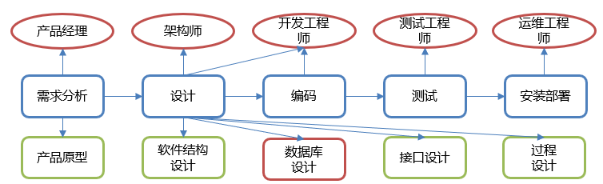
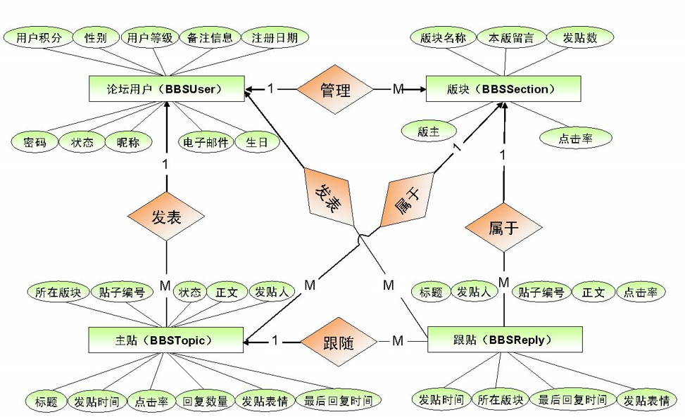
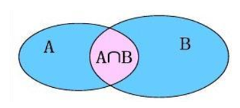

# MySQL高级

## 约束

- 约束是作用于表中列上的规则，用于限制加入表的数据
- 约束的存在保证了数据库中数据的正确性、有效性和完整性

### 分类

* **非空约束： 关键字是 NOT NULL**

  保证列中所有的数据不能有null值。

* **唯一约束：关键字是  UNIQUE**

  保证列中所有数据各不相同。

* **主键约束： 关键字是  PRIMARY KEY**

  一般我们都会给每张表添加一个主键列用来唯一标识数据，主键是一行数据的唯一标识，要求非空且唯一。

* **检查约束： 关键字是  CHECK** 

  保证列中的值满足某一条件。

  > 注意：MySQL不支持检查约束。
  >
  > 这样是不是就没办法保证年龄在指定的范围内了？从数据库层面不能保证，以后可以在java代码中进行限制，一样也可以实现要求。

* **默认约束： 关键字是   DEFAULT**

  保存数据时，未指定值则采用默认值。

* **外键约束： 关键字是  FOREIGN KEY**

  外键用来让两个表的数据之间建立链接，保证数据的一致性和完整性。


### 非空约束

非空约束用于保证列中所有数据不能有NULL值

```mysql
# 创建表时添加非空约束
CREATE TABLE 表名(
   列名 数据类型 NOT NULL,
   …
);

-- 建完表后添加非空约束
ALTER TABLE 表名 MODIFY 字段名 数据类型 NOT NULL;

-- 删除约束
ALTER TABLE 表名 MODIFY 字段名 数据类型;
```

### 唯一约束

唯一约束用于保证列中所有数据各不相同

```mysql
# 创建表时添加唯一约束
CREATE TABLE 表名(
   列名 数据类型 UNIQUE [AUTO_INCREMENT],  # AUTO_INCREMENT: 当不指定值时自动增长
   …
);
CREATE TABLE 表名(
   列名 数据类型,
   …
   [CONSTRAINT] [约束名称] UNIQUE(列名)
); 

-- 建完表后添加唯一约束
ALTER TABLE 表名 MODIFY 字段名 数据类型 UNIQUE;

-- 删除约束
ALTER TABLE 表名 DROP INDEX 字段名;
```

### 主键约束 

```mysql
# 创建表时添加主键约束
CREATE TABLE 表名(
   列名 数据类型 PRIMARY KEY [AUTO_INCREMENT],
   …
); 
CREATE TABLE 表名(
   列名 数据类型,
   [CONSTRAINT] [约束名称] PRIMARY KEY(列名)
); 
-- 建完表后添加主键约束
ALTER TABLE 表名 ADD PRIMARY KEY(字段名);

-- 删除约束
ALTER TABLE 表名 DROP PRIMARY KEY;
```

### 默认约束

```mysql
# 创建表时添加默认约束
CREATE TABLE 表名(
   列名 数据类型 DEFAULT 默认值,
   …
); 

-- 建完表后添加默认约束
ALTER TABLE 表名 ALTER 列名 SET DEFAULT 默认值;

-- 删除约束
ALTER TABLE 表名 ALTER 列名 DROP DEFAULT;
```

### 外键约束

```sql
# 创建表时添加外键约束
CREATE TABLE 表名(
   列名 数据类型,
   …
   [CONSTRAINT] [外键名称] FOREIGN KEY(外键列名) REFERENCES 主表(主表列名) 
); 

# 建完表后添加外键约束
ALTER TABLE 表名 ADD CONSTRAINT 外键名称 FOREIGN KEY (外键字段名称) REFERENCES 主表名称(主表列名称);

# 删除外键约束
ALTER TABLE 表名 DROP FOREIGN KEY 外键名称;
```

## 数据库设计

简介

- 软件研发步骤



* 数据库设计概念

  * 数据库设计就是根据业务系统的具体需求，结合我们所选用的DBMS，为这个业务系统构造出最优的数据存储模型。
  * 建立数据库中的==表结构==以及==表与表之间的关联关系==的过程。
  * 有哪些表？表里有哪些字段？表和表之间有什么关系？

* 数据库设计的步骤

  * 需求分析（数据是什么? 数据具有哪些属性? 数据与属性的特点是什么）

  * 逻辑分析（通过ER图对数据库进行逻辑建模，不需要考虑我们所选用的数据库管理系统）

    如下图就是ER(Entity/Relation)图：

    

  * 物理设计（根据数据库自身的特点把逻辑设计转换为物理设计）

  * 维护设计（1.对新的需求进行建表；2.表优化）

* 表关系

  * 一对一
  * 一对多
  * 多对多

### 一对多

实现方式：在多的一方建立外键，指向一的一方的主键

### 多对多

实现方式：建立第三张中间表，中间表至少包含两个外键，分别关联两方主键

### 一对一

一对一关系多用于表拆分，将一个实体中经常使用的字段放一张表，不经常使用的字段放另一张表，用于提升查询性能。

实现方式：在任意一方加入外键，关联另一方主键，并且设置外键为唯一(UNIQUE)。

## 多表查询



- 内连接：相当于查询AB交集数据
  - 隐式内连接
  - 显式内连接
- 外连接
  - 左外连接：相当于查询A表所有数据和交集部门数据
  - 右外连接：相当于查询B表所有数据和交集部分数据
- 子查询

### 内连接

```sql
-- 隐式内连接
SELECT 字段列表 FROM 表1,表2… WHERE 条件;

-- 显示内连接
SELECT 字段列表 FROM 表1 [INNER] JOIN 表2 ON 条件;
```

### 外连接

  ```sql
  -- 左外连接
  SELECT 字段列表 FROM 表1 LEFT [OUTER] JOIN 表2 ON 条件;
  
  -- 右外连接
  SELECT 字段列表 FROM 表1 RIGHT [OUTER] JOIN 表2 ON 条件;
  ```

### 子查询

查询中嵌套查询，称嵌套查询为子查询。

- 子查询
  - 子查询语句结果是单行单列，子查询语句作为条件值，使用 =  !=  >  <  等进行条件判断
  - 子查询语句结果是多行单列，子查询语句作为条件值，使用 in 等关键字进行条件判断
  - 子查询语句结果是多行多列，子查询语句作为虚拟表

## 事务

> 数据库的事务（Transaction）是一种机制、一个操作序列，包含了一组数据库操作命令。
>
> 事务把所有的命令作为一个整体一起向系统提交或撤销操作请求，即这一组数据库命令要么同时成功，要么同时失败。
>
> 事务是一个不可分割的工作逻辑单元。

语法

* 开启事务

  ```sql
  START TRANSACTION;
  或者  
  BEGIN;
  ```

* 提交事务

  ```sql
  commit;
  ```

* 回滚事务

  ```sql
  rollback;
  ```

事务四大特征

* 原子性（Atomicity）: 事务是不可分割的最小操作单位，要么同时成功，要么同时失败

* 一致性（Consistency） :事务完成时，必须使所有的数据都保持一致状态

* 隔离性（Isolation） :多个事务之间，操作的可见性

* 持久性（Durability） :事务一旦提交或回滚，它对数据库中的数据的改变就是永久的

> 说明：
>
> mysql中事务是自动提交的。
>
> 也就是说我们不添加事务执行sql语句，语句执行完毕会自动的提交事务。
>
> 可以通过下面语句查询默认提交方式：
>
> ```java
> SELECT @@autocommit;
> ```
>
> 查询到的结果是1 则表示自动提交，结果是0表示手动提交。当然也可以通过下面语句修改提交方式
>
> ```sql
> set @@autocommit = 0;
> ```


