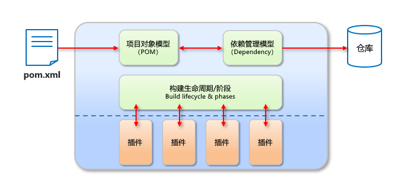
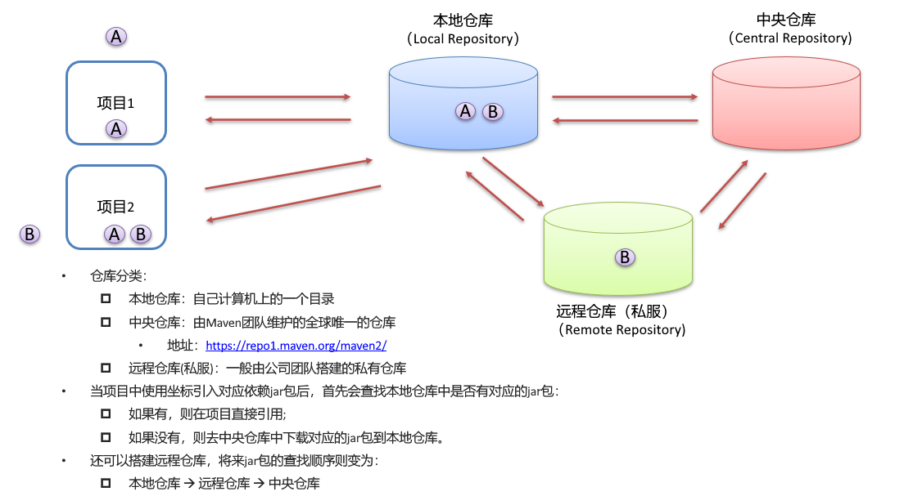
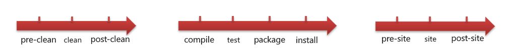
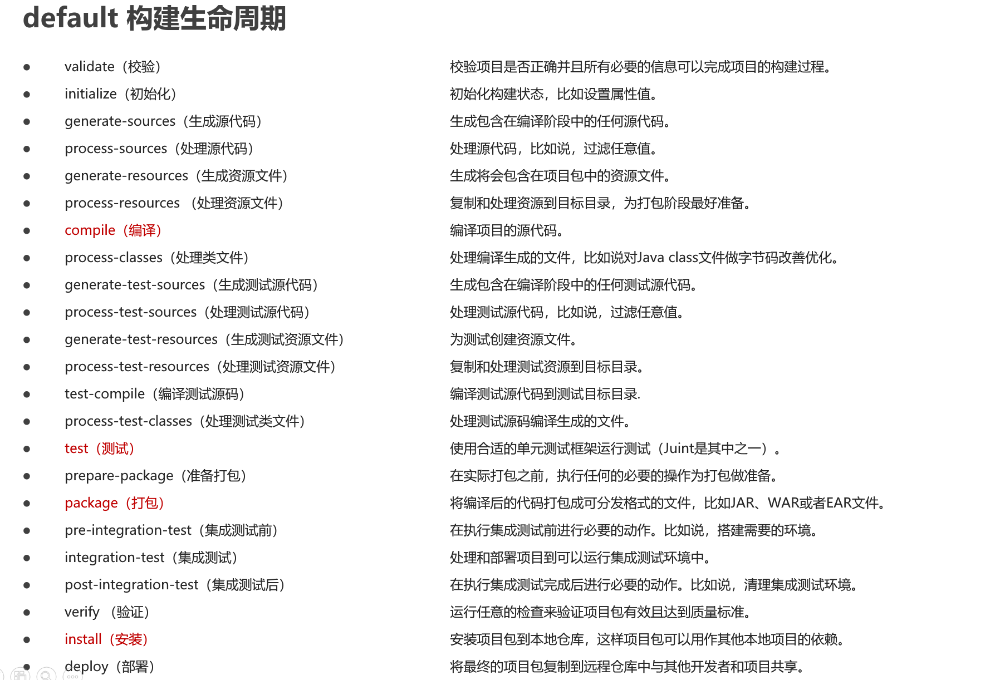
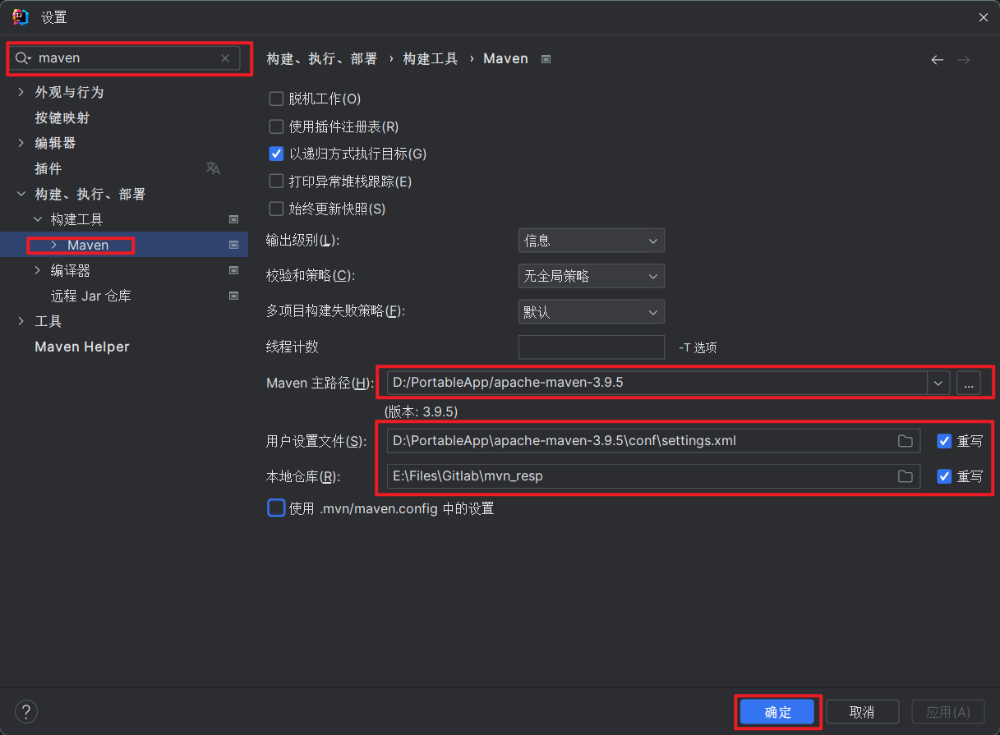
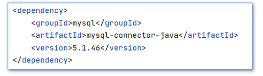
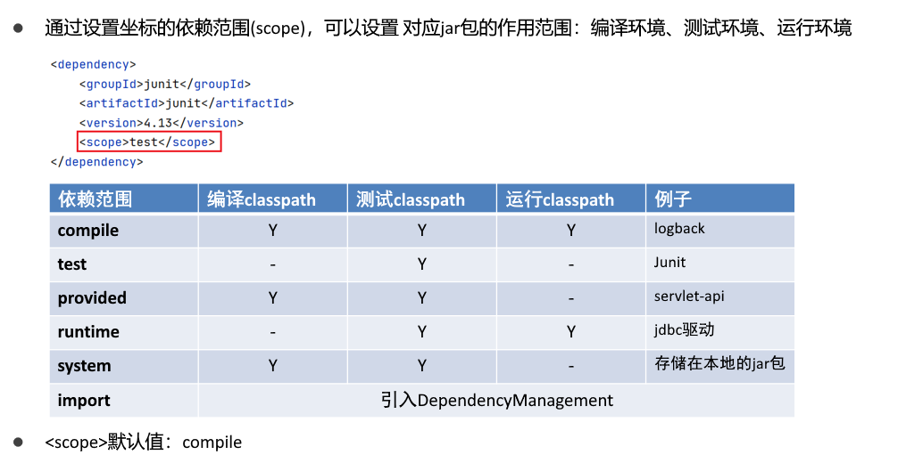

# Maven

## 简介

Apache Maven 是一个项目管理和构建工具，它基于项目对象模型(POM)的概念，通过一小段描述信息来管理项目的构建、报告和文档

- 主要功能
  - 提供了一套标准化的项目结构
  - 提供了一套标准化的构建流程（编译，测试，打包，发布……）
  - 提供了一套依赖管理机制

- 依赖管理
  - Maven 使用标准的坐标配置来管理各种依赖
  - 只需要简单的配置就可以完成依赖管理





## Maven安装配置

下载Maven，解压。[下载链接](https://maven.apache.org/download.cgi)。

配置系统环境变量。

配置本地仓库：修改conf/settings.xml 中的 `<localRepository>` 为一个指定目录。

配置阿里云私服，修改 conf/settings.xml 中的 `<mirrors>`标签内，添加如下子标签

```xml
<mirror>
  <id>aliyunmaven</id>
  <mirrorOf>*</mirrorOf>
  <name>阿里云公共仓库</name>
  <url>https://maven.aliyun.com/repository/public</url>
</mirror>
```

## Maven Index

IDEA 更新索引默认从中央仓库下载，如果在国内，下载非常慢。配置了阿里云镜像，就会从配置的镜像根目录 /.index/ 找索引文件，但是阿里云并没有提供索引服务，所以如果配置了阿里云镜像，再更新索引会报错。因此使用远程下载索引到本地更新的方法。

前提条件：已经在 IDEA 配置好了 Maven 和 tomcat 环境，并且在 IntelliJ IDEA 已经关联了配置好的 Maven。

1. 打开Maven的配置文件`Maven根目录/conf/settings.xml`,注释所有的镜像并添加如下镜像，后面我们的 `tomcat` 本地服务器要伪装成这个镜像服务器：

   ```xml
       <mirror>
           <id>aliyunmaven</id>
           <mirrorOf>*</mirrorOf>
           <name>阿里云公共仓库</name>
           <url>http://maven.aliyun.com/repository/public</url>
       </mirror>
   ```

   > 注意是http而不是https,因为搭建tomcat服务器默认是http服务。

2. 打开tomcat的服务器配置文件:`tomcat根目录/conf/server.xml`,将端口改为80

   ```xml
   <Connector port="8080" protocol="HTTP/1.1"
                  connectionTimeout="60000"
                  redirectPort="8443" acceptCount="500" maxThreads="400"/>
   ```

3. 手动从中央仓库下载索引,需要下载两个文件:[nexus-maven-repository-index.properties](https://repo1.maven.org/maven2/.index/nexus-maven-repository-index.properties)和[nexus-maven-repository-index.gz](https://repo1.maven.org/maven2/.index/nexus-maven-repository-index.gz)。

4. 在`tomcat根目录/webapps/ROOT/`下创建文件夹`/repository/public/.index/`(注意与上面mirror中的对应，且其中的.index文件夹windows无法创建，需要使用Git Bash创建)。将下载好的文件移动到`tomcat根目录/webapps/ROOT/repository/public/.index/`下，tomcat主页对应tomcat文件夹中的 ROOT 文件夹，因此我们在 ROOT 文件夹里加文件，就能通过 127.0.0.1/文件夹名下载。

5. 使用管理员权限修改 host 文件：`C:/Windows/System32/drivers/etc/hosts`，在最后添加一行: `127.0.0.1 maven.aliyun.com`，使访问maven.aliyun.com 映射到 127.0.0.1，计算机是先查 host 再查 dns 的，因此，修改 host 文件，把阿里云映射到本地，这样，访问 maven.aliyun.com 时，系统就自动跳到 127.0.0.1 。

6. 启动 tomcat ，在 Windows 系统下双击 tomcat根目录/bin/startup.bat 即可，启动时可能会报找不到 jdk 或者80端口占用等错误，百度一下自行解决。启动完成后建议浏览器访问`http://maven.aliyun.com/repository/public/.index/nexus-maven-repository-index.properties`,看看是不是正常访问（这里注意：chrome浏览器会强制跳转http为https，所以建议使用Git Bash中使用curl命令访问一下有正常的返回内容即说明配置正确 ）。

7. 打开 IDEA ，然后打开 File -> Settings 或者快捷键 Ctrl + Alt + S 打开设置，找到`Build,Execution,Deployment -> Build Tools -> Maven -> Respositories`，然后点击`http://maven.aliyun.com/repository/public`再点击 Update 按钮进行更新，这时候千万不能关闭对话框，否则会导致更新失败，IDEA 右下角会有更新进度条，等进度条消失就更新完毕啦。

8. 更新完成后我们要恢复一些配置文件：
   关闭 `tomcat` 服务器，修改 `server.xml` 配置文件，将 80 端口再改为8080端口。
   删除 `tomcat根目录/webapps/ROOT/repository` 文件夹。
   删除 `C:/Windows/System32/drivers/etc/hosts` 最后一行我们添加的映射。
   将 `Maven根目录/conf/settings.xml` 配置文件中 `http` 再改为 `https`。

## Maven常用命令

compile ：编译

clean：清理

test：测试

package：打包

install：安装

## Maven生命周期

Maven 构建项目生命周期描述的是一次构建过程经历经历了多少个事件，同一生命周期内，执行后边的命令，前边的所有命令会自动执行

- Maven 对项目构建的生命周期划分为3套

  - clean：清理工作

  - default：核心工作，例如编译，测试，打包，安装等

  - site：产生报告，发布站点等





## IDEA配置Maven

打开IDEA，在不打开项目的情况下打开设置，或者按Ctrl+Alt+s，搜索Maven。

修改Maven的路径，配置文件的路径和本地仓库的路径并保存。



## Maven坐标详解

- 坐标

  - Maven 中的坐标是资源的唯一标识

  - 使用坐标来定义项目或引入项目中需要的依赖

- Maven坐标主要组成
  - groupId：定义当前Maven项目隶属组织名称（通常是域名反写，例如：com.baidu）
  - artifactId：定义当前Maven项目名称（通常是模块名称，例如 order-service、goods-service）
  - version：定义当前项目版本号



## IDEA创建Maven项目

IDEA创建Maven项目

IDEA导入Maven项目

IDEA安装Maven-Helper插件

## 依赖管理

- 添加依赖

  - 使用坐标导入jar包

    - 在 pom.xml 中编写 `<dependencies>`标签

    - 在`<dependencies>`标签中 使用`<dependency>`引入坐标

    - 定义坐标的 `groupId,artifactId,version`

    - 点击刷新按钮，使坐标生效

  - 使用坐标导入jar包-快捷方式
    - 在pom.xml中按Alt + Insert，选择 Dependency
    - 在弹出的面板中搜索对应坐标，然后双击选中对应坐标
    - 点击刷新按钮，使坐标生效

- 修改依赖自动生效自动导入
  - 选择 IDEA中 File --> Settings
  - 在弹出的面板中找到 Build Tools
  - 选择 Any changes，点击 ok 即可生效

## 依赖范围

