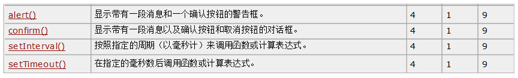
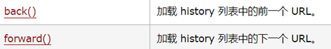
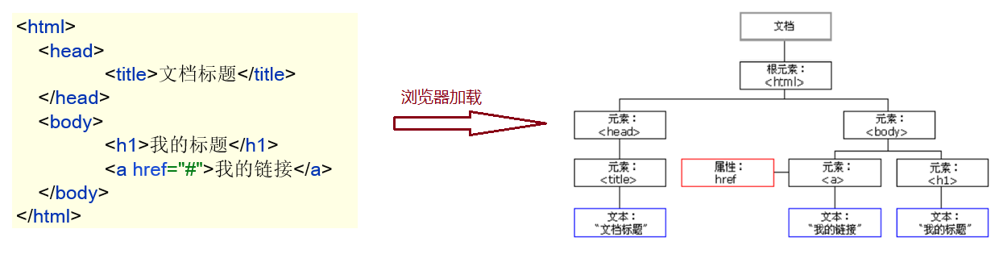
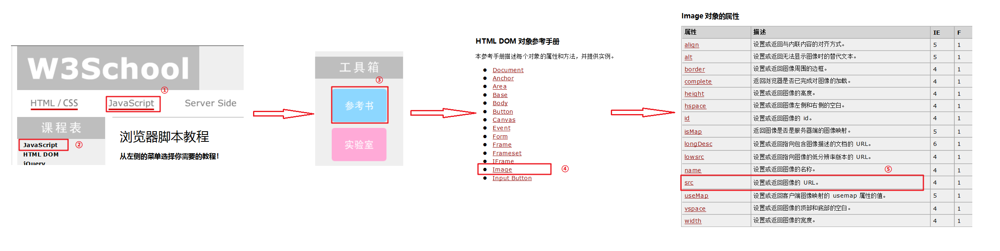

#  JavaScript 笔记

## 1 JS 简介

### 1.1 简介

JavaScript 是一门跨平台、面向对象的脚本语言，而Java语言也是跨平台的、面向对象的语言，只不过Java是编译语言，是需要编译成字节码文件才能运行的；JavaScript是脚本语言，不需要编译，由浏览器直接解析并执行。

JavaScript 是用来控制网页行为的，它能使网页可交互；那么它可以做什么呢？如改变页面内容、修改指定元素的属性值、对表单进行校验等，下面是这些功能的效果展示：

- 改变页面内容
- 修改指定元素的属性值
- 对表单进行校验

JavaScript（简称：JS） 在 1995 年由 Brendan Eich 发明，并于 1997 年成为一部 ECMA 标准。ECMA 规定了一套标准 就叫 `ECMAScript` ，所有的客户端校验语言必须遵守这个标准，当然 JavaScript 也遵守了这个标准。ECMAScript 6 (简称ES6) 是最新的 JavaScript 版本（发布于 2015 年)，我们的课程就是基于最新的 `ES6` 进行讲解。

### 1.2 引入方式

- 内部脚本：将 JS代码定义在HTML页面中，位于 `<script>` 与 `</script>` 标签，一般放在 `<body>` 元素的底部，可改善显示速度。
- 外部脚本
  - `<script src="./js/demo.js"></script>`

##  2 JS 基础语法

### 2.1 书写语法

- 区分大小写
- 每行结尾分号可有可无
- 一行多个语句时分号不能省略
- 注释
  - 单行注释：//注释内容
  - 多行注释：/* 注释内容 */
  - JavaScript 没有文档注释
- 大括号表示代码块 { }

### 2.2 输出语句

```javascript
window.alert("hello"); // 弹窗输出
document.write("js"); // 写入HTML输出
console.log("log"); // 写入浏览器的控制台
```

### 2.3 变量

JavaScript 中用 var 关键字（variable 的缩写）来声明变量。 `var 变量名 = 数据值;`。而在JavaScript 是一门弱类型语言，变量可以存放不同类型的值。

js 中的<font color='red'>变量名命名</font>也有如下规则，和java语言基本都相同

* 组成字符可以是任何字母、数字、下划线（_）或美元符号（$）
* 数字不能开头
* 建议使用驼峰命名

JavaScript 中 `var` 关键字有点特殊，有以下地方和其他语言不一样

* 作用域：全局变量
* 变量可以重复声明

`let`关键字

- 作用域：let关键字所在的代码块内
- 不允许重复声明

### 2.4 数据类型

JavaScript 中提供了两类数据类型：原始类型 和 引用类型。

>使用 typeof 运算符可以获取数据类型
>
>`alert(typeof age);` 以弹框的形式将 age 变量的数据类型输出

- 原始数据类型
  - nubmer：数字（整数、小数、NaN(Not a Number)）
  - string：字符、字符串，单双引号皆可
  - boolean：布尔，true，false
  - null：对象为空
  - undefined：变量未初始化

### 2.5 运算符

JavaScript 提供了如下的运算符。大部分和 Java语言 都是一样的，不同的是 JS 关系运算符中的 `==` 和 `===`，一会我们只演示这两个的区别，其他运算符将不做演示

* 一元运算符：++，--

* 算术运算符：+，-，*，/，%

* 赋值运算符：=，+=，-=…

* 关系运算符：>，<，>=，<=，!=，<font color='red'>==</font>，<font color='red'>===</font>…

* 逻辑运算符：&&，||，!

* 三元运算符：条件表达式 ? true_value : false_value 

> ==和===的区别
>
> ==判断类型是否一样，不一样则进行类型转换，再比较值
>
> ===判断类型是否一样，如果不一样直接返回false，一样则比较其值

### 2.6 类型转换

- 其他类型转为number

  * string 转换为 number 类型：按照字符串的字面值，转为数字。如果字面值不是数字，则转为NaN，将 string 转换为 number 有两种方式：

    * 使用 `+` 正号运算符：

      ```js
      var str = +"20";
      alert(str + 1) //21
      ```

    * 使用 `parseInt()` 函数(方法)：

      ```js
      var str = "20";
      alert(parseInt(str) + 1);
      ```

  * boolean 转换为 number 类型：true 转为1，false转为0

    ```js
    var flag = +false;
    alert(flag); // 0
    ```

- 其他类型转为boolean

  * number 类型转换为 boolean 类型：0和NaN转为false，其他的数字转为true

  * string 类型转换为 boolean 类型：空字符串转为false，其他的字符串转为true

  * null类型转换为 boolean 类型是 false

  * undefined 转换为 boolean 类型是 false

在 Java 中使用字符串前，一般都会先判断字符串不是null，并且不是空字符才会做其他的一些操作，JavaScript也有类型的操作，由于JavaScript 会自动进行类型转换，所以可以简化为如下操作：

```javascript
var str = "abc";

// 健壮性判断
if(str != null && str.length > 0){
    alert("转为true");
}else {
    alert("转为false");
}

// 简化，健壮性判断
if(str){
    alert("转为true");
}else {
    alert("转为false");
}
```

### 2.7 流程控制语句

#### 2.7.1 if语句

```js
var count = 3;
if (count == 3) {
    alert(count);
}
```

#### 2.7.2  switch 语句

```js
var num = 3;
switch (num) {
    case 1:
        alert("一");
        break;
    case 2:
        alert("二");
        break;
    case 3:
        alert("三");
        break;
    default:
        alert("输入有误");
        break;
}
```

#### 2.7.3  for 循环语句

```js
var sum = 0;
//建议for循环小括号中定义的变量使用let
for (let i = 1; i <= 100; i++) { 
    sum += i;
}
alert(sum);
```

#### 2.7.4  while 循环语句

```js
var sum = 0;
var i = 1;
while (i <= 100) {
    sum += i;
    i++;
}
alert(sum);
```

#### 2.7.5  dowhile 循环语句

```js
var sum = 0;
var i = 1;
do {
    sum += i;
    i++;
}
while (i <= 100);
alert(sum);
```

### 2.8 函数

函数（类似Java中的方法）是被设计为执行特定任务的代码块；JavaScript 函数通过 function 关键词进行定义。

#### 2.8.1 定义格式

* 方式1

  ```js
  function 函数名(参数1,参数2..){
      要执行的代码
  }
  ```

* 方式2

  ```js
  var 函数名 = function (参数列表){
      要执行的代码
  }
  ```

>- 注意：
>
>  - 形式参数不需要类型。因为JavaScript是弱类型语言
>
>  - 返回值也不需要定义类型，可以在函数内部直接使用return返回即可

#### 2.8.2 函数调用

```javascript
函数名称(实际参数列表);
```

>- 注意：
>  - JS中，函数调用可以传递任意个数参数
>  - 按照顺序传递数据，多出来的参数没有变量接收

## 3 JS 常用对象

### 3.1 Array对象

JavaScript Array对象用于定义数组

#### 3.1.1  定义格式

数组的定义格式有两种：

```js
var 变量名 = new Array(元素列表); 

var 变量名 = [元素列表];
```

#### 3.1.2  元素访问

访问数组中的元素和 Java 语言的一样，格式如下：

```js
arr[索引] = 值;
```

#### 3.1.3  特点

JavaScript 中的数组相当于 Java 中集合。数组的长度是可以变化的，而 JavaScript 是弱类型，所以可以存储任意的类型的数据。

例如如下代码：

```js
// 变长
var arr3 = [1,2,3];
arr3[10] = 10;
alert(arr3[10]); // 10
alert(arr3[9]);  //undefined
```

上面代码在定义数组中给了三个元素，又给索引是 10 的位置添加了数据 10，那么 `索引3` 到 `索引9` 位置的元素是什么呢？我们之前就介绍了，在 JavaScript 中没有赋值的话，默认就是 `undefined`。如果给 `arr3` 数组添加字符串的数据，也是可以添加成功的。


#### 3.1.4  属性

Array 对象提供了很多属性，如下图是官方文档截取的


而我们只讲解 `length` 属性，该数组可以动态的获取数组的长度。而有这个属性，我们就可以遍历数组了

```js
var arr = [1,2,3];
for (let i = 0; i < arr.length; i++) {
    alert(arr[i]);
}
```

#### 3.1.5  方法

Array 对象同样也提供了很多方法，如下图是官方文档截取的


而我们在课堂中只演示 `push` 函数和 `splice` 函数。

* push 函数：给数组添加元素，也就是在数组的末尾添加元素

  参数表示要添加的元素

  ```js
  // push:添加方法
  var arr5 = [1,2,3];
  arr5.push(10);
  alert(arr5);  //数组的元素是 {1,2,3,10}
  ```

* splice 函数：删除元素

  参数1：索引。表示从哪个索引位置删除

  参数2：个数。表示删除几个元素

  ```js
  // splice:删除元素
  var arr5 = [1,2,3];
  arr5.splice(0,1); //从 0 索引位置开始删除，删除一个元素 
  alert(arr5); // {2,3}
  ```

### 3.2 String对象

String对象的创建方式有两种：

```js
var 变量名 = new String(s); 

var 变量名 = "数组"; 
```

属性：String对象提供了很多属性，下面列举了一个属性 `length` ，该属性是用于动态的获取字符串的长度。


函数：String对象提供了很多函数（方法），下面列举了两个方法。


String对象还有一个函数<font color='red'> `trim()`</font> ，该方法在文档中没有体现，但是所有的浏览器都支持；它是用来去掉字符串两端的空格。

### 3.3 自定义对象

在 JavaScript 中自定义对象特别简单，下面就是自定义对象的格式：

```js
var 对象名称 = {
    属性名称1:属性值1,
    属性名称2:属性值2,
    ...,
    函数名称:function (形参列表){},
	...
};
```

调用属性的格式：

```js
对象名.属性名
```

调用函数的格式：

```js
对象名.函数名()
```

## 4 BOM

BOM：Browser Object Model 浏览器对象模型。也就是 JavaScript 将浏览器的各个组成部分封装为对象。

我们要操作浏览器的各个组成部分就可以通过操作 BOM 中的对象来实现。比如：我现在想将浏览器地址栏的地址改为 `https://www.itheima.com` 就可以通过使用 BOM 中定义的 `Location` 对象的 `href` 属性，代码： `location.href = "https://itheima.com";` 

 BOM 中包含了如下对象：

* Window：浏览器窗口对象
* Navigator：浏览器对象
* Screen：屏幕对象
* History：历史记录对象
* Location：地址栏对象

下图是 BOM 中的各个对象和浏览器的各个组成部分的对应关系


BOM 中的 `Navigator` 对象和 `Screen` 对象基本不会使用，所以我们的课堂只对 `Window`、`History`、`Location` 对象进行讲解。

### 4.1  Window对象

window 对象是 JavaScript 对浏览器的窗口进行封装的对象。

#### 4.1.1  获取window对象

该对象不需要创建直接使用 `window`，其中 `window. ` 可以省略。比如我们之前使用的 `alert()` 函数，其实就是 `window` 对象的函数，在调用是可以写成如下两种

* 显式使用 `window` 对象调用

  ```javascript
  window.alert("abc"); // 显式使用window对象调用
  alert("abc"); // 隐式调用
  ```

#### 4.1.2  window对象属性

`window` 对象提供了用于获取其他 BOM 组成对象的属性


也就是说，我们想使用 `Location` 对象的话，就可以使用 `window` 对象获取；写成 `window.location`，而 `window.` 可以省略，简化写成 `location` 来获取 `Location` 对象。

#### 4.1.3  window对象函数

`window` 对象提供了很多函数供我们使用，而很多都不常用；下面给大家列举了一些比较常用的函数



> `setTimeout(function,毫秒值)` : 在一定的时间间隔后执行一个function，只执行一次
> `setInterval(function,毫秒值)` :在一定的时间间隔后执行一个function，循环执行

### 4.2  History对象

History 对象是 JavaScript 对历史记录进行封装的对象。

* History 对象的获取

  使用 window.history获取，其中window. 可以省略

* History 对象的函数

  

  这两个函数我们平时在访问其他的一些网站时经常使用对应的效果，如下图

  

  当我们点击向左的箭头，就跳转到前一个访问的页面，这就是 `back()` 函数的作用；当我们点击向右的箭头，就跳转到下一个访问的页面，这就是 `forward()` 函数的作用。

### 4.3  Location对象


Location 对象是 JavaScript 对地址栏封装的对象。可以通过操作该对象，跳转到任意页面。

#### 4.3.1  获取Location对象

使用 window.location获取，其中window. 可以省略

```js
window.location.方法();
location.方法();
```

#### 4.3.2  Location对象属性

Location对象提供了很对属性。以后常用的只有一个属性 `href`


**代码演示：**

```js
alert("要跳转了");
location.href = "https://www.baidu.com";
```

在浏览器首先会弹框显示 `要跳转了`，当我们点击了 `确定` 就会跳转到 百度 的首页。

## 5 DOM

### 5.1  概述

DOM：Document Object Model 文档对象模型。也就是 JavaScript 将 HTML 文档的各个组成部分封装为对象。封装的对象分为：

* Document：整个文档对象
* Element：元素对象
* Attribute：属性对象
* Text：文本对象
* Comment：注释对象

如下图，左边是 HTML 文档内容，右边是 DOM 树



作用：JavaScript 通过 DOM， 就能够对 HTML进行操作了

* 改变 HTML 元素的内容
* 改变 HTML 元素的样式（CSS）
* 对 HTML DOM 事件作出反应
* 添加和删除 HTML 元素

DOM相关概念：

DOM 是 W3C（万维网联盟）定义了访问 HTML 和 XML 文档的标准。该标准被分为 3 个不同的部分：

1. 核心 DOM：针对任何结构化文档的标准模型。 XML 和 HTML 通用的标准

   * Document：整个文档对象

   * Element：元素对象

   * Attribute：属性对象

   * Text：文本对象

   * Comment：注释对象

2. XML DOM： 针对 XML 文档的标准模型

3. HTML DOM： 针对 HTML 文档的标准模型

   该标准是在核心 DOM 基础上，对 HTML 中的每个标签都封装成了不同的对象

   * 例如：`` 标签在浏览器加载到内存中时会被封装成 `Image` 对象，同时该对象也是 `Element` 对象。
   * 例如：`<input type='button'>` 标签在浏览器加载到内存中时会被封装成 `Button` 对象，同时该对象也是 `Element` 对象。

### 5.2  获取 Element对象

HTML 中的 Element 对象可以通过 `Document` 对象获取，而 `Document` 对象是通过 `window` 对象获取。`Document` 对象中提供了以下获取 `Element` 元素对象的函数：

* `getElementById()`：根据<font color='red'>id</font>属性值获取，返回单个Element对象
* `getElementsByTagName()`：根据<font color='red'>标签名</font>获取，返回Element对象数组
* `getElementsByName()`：根据<font color='red'>name</font>属性值获取，返回Element对象数组
* `getElementsByClassName()`：根据<font color='red'>class</font>属性值获取，返回Element对象数组

### 5.3  HTML Element对象使用

HTML 中的 `Element` 元素对象有很多，不可能全部记住，以后是根据具体的需求查阅文档使用。

下面我们通过具体的案例给大家演示文档的查询和对象的使用；下面提前给大家准备好的页面

```html
<!DOCTYPE html>
<html lang="en">
<head>
    <meta charset="UTF-8">
    <title>Title</title>
</head>
<body>
     <br>

    <div class="cls">传智教育</div>   <br>
    <div class="cls">黑马程序员</div> <br>

    <input type="checkbox" name="hobby"> 电影
    <input type="checkbox" name="hobby"> 旅游
    <input type="checkbox" name="hobby"> 游戏
    <br>
    <script>
        //在此处写js低吗
    </script>
</body>
</html>
```

**需求：**

1. 点亮灯泡

   此案例由于需要改变 `img` 标签 的图片，所以我们查询文档，下图是查看文档的流程：

   

   代码实现：

   ```js
   //1，根据 id='light' 获取 img 元素对象
   var img = document.getElementById("light");
   //2，修改 img 对象的 src 属性来改变图片
   img.src = "../imgs/on.gif";
   ```

2. 将所有的 `div` 标签的标签体内容替换为 `呵呵`

   ```js
   //1，获取所有的 div 元素对象
   var divs = document.getElementsByTagName("div");
   /*
           style:设置元素css样式
           innerHTML：设置元素内容
       */
   //2，遍历数组，获取到每一个 div 元素对象，并修改元素内容
   for (let i = 0; i < divs.length; i++) {
       //divs[i].style.color = 'red';
       divs[i].innerHTML = "呵呵";
   }
   ```

3. 使所有的复选框呈现被选中的状态

   此案例我们需要看 复选框 元素对象有什么属性或者函数是来操作 复选框的选中状态。下图是文档的查看

   

   代码实现：

   ```js
   //1，获取所有的 复选框 元素对象
   var hobbys = document.getElementsByName("hobby");
   //2，遍历数组，通过将 复选框 元素对象的 checked 属性值设置为 true 来改变复选框的选中状态
   for (let i = 0; i < hobbys.length; i++) {
       hobbys[i].checked = true;
   }
   ```

## 6 事件监听

HTML 事件是发生在 HTML 元素上的“事情”。比如：页面上的 `按钮被点击`、`鼠标移动到元素之上`、`按下键盘按键` 等都是事件。

### 6.1  事件绑定

JavaScript 提供了两种事件绑定方式：

* 方式一：通过 HTML标签中的事件属性进行绑定

  如下面代码，有一个按钮元素，我们是在该标签上定义 `事件属性`，在事件属性中绑定函数。`onclick` 就是 `单击事件` 的事件属性。`onclick='on（）'` 表示该点击事件绑定了一个名为 `on()` 的函数

  ```html
  <input type="button" onclick='on()’>
  ```

  下面是点击事件绑定的 `on()` 函数

  ```js
  function on(){
  	alert("我被点了");
  }
  ```

* 方式二：通过 DOM 元素属性绑定

  如下面代码是按钮标签，在该标签上我们并没有使用 `事件属性`，绑定事件的操作需要在 js 代码中实现

  ```html
  <input type="button" id="btn">
  ```

  下面 js 代码是获取了 `id='btn'` 的元素对象，然后将 `onclick` 作为该对象的属性，并且绑定匿名函数。该函数是在事件触发后自动执行

  ```js
  document.getElementById("btn").onclick = function (){
      alert("我被点了");
  }
  ```

### 6.2  常见事件

上面案例中使用到了 `onclick` 事件属性，那都有哪些事件属性供我们使用呢？下面就给大家列举一些比较常用的事件属性

| 事件属性名  | 说明                     |
| ----------- | ------------------------ |
| onclick     | 鼠标单击事件             |
| onblur      | 元素失去焦点             |
| onfocus     | 元素获得焦点             |
| onload      | 某个页面或图像被完成加载 |
| onsubmit    | 当表单提交时触发该事件   |
| onmouseover | 鼠标被移到某元素之上     |
| onmouseout  | 鼠标从某元素移开         |

* `onfocus` 获得焦点事件。

  如下图，当点击了输入框后，输入框就获得了焦点。而下图示例是当获取焦点后会更改输入框的背景颜色。

  

* `onblur  ` 失去焦点事件。

  如下图，当点击了输入框后，输入框就获得了焦点；再点击页面其他位置，那输入框就失去焦点了。下图示例是将输入的文本转换为大写。

  

* `onmouseout  ` 鼠标移出事件。

* `onmouseover  `  鼠标移入事件。

  如下图，当鼠标移入到 苹果 图片上时，苹果图片变大；当鼠标移出 苹果图片时，苹果图片变小。

  

* `onsubmit  ` 表单提交事件

  当我们点击表单中的 `提交` 按钮后，表单就会提交，此处默认使用的是 `GET` 提交方式，会将提交的数据拼接到 URL 后。现需要通过 js 代码实现阻止表单提交的功能，js 代码实现如下：

  1. 获取 `form` 表单元素对象。
  2. 给 `form` 表单元素对象绑定 `onsubmit` 事件，并绑定匿名函数。
  3. 该匿名函数如果返回的是true，提交表单；如果返回的是false，阻止表单提交。

  ```js
  document.getElementById("register").onsubmit = function (){
      //onsubmit 返回true，则表单会被提交，返回false，则表单不提交
      return true;
  }
  ```

## 7 表单验证案例

需求：


有如下注册页面，对表单进行校验，如果输入的用户名、密码、手机号符合规则，则允许提交；如果不符合规则，则不允许提交。

完成以下需求：

1. 当输入框失去焦点时，验证输入内容是否符合要求

2. 当点击注册按钮时，判断所有输入框的内容是否都符合要求，如果不合符则阻止表单提交

## 8 RegExp对象

RegExp 是正则对象。正则对象是判断指定字符串是否符合规则。

如下图是百度贴吧中的帖子


我们可以通过爬虫技术去爬取该页面源代码，然后获取页面中所有的邮箱，后期我们可以给这些邮箱地址发送推广的邮件。那么问题来了，如何才能知道页面内容中哪些事邮箱地址呢？这里就可以使用正则表达式来匹配邮箱。

在 js 中对正则表达式封装的对象就是正则对象。

### 8.1  正则对象使用

#### 8.1.1  创建对象

正则对象有两种创建方式：

* 直接量方式：注意不要加引号

  ```js
  var reg = /正则表达式/;
  ```

* 创建 RegExp 对象

  ```js
  var reg = new RegExp("正则表达式");
  ```

#### 8.1.2  函数

`test(str)` ：判断指定字符串是否符合规则，返回 true或 false

### 8.2  正则表达式

从上面创建正则对象的格式中可以看出不管哪种方式都需要正则表达式，那么什么是正则表达式呢？

正则表达式定义了字符串组成的规则。也就是判断指定的字符串是否符合指定的规则，如果符合返回true，如果不符合返回false。

正则表达式是和语言无关的。很多语言都支持正则表达式，Java语言也支持，只不过正则表达式在不同的语言中的使用方式不同，js 中需要使用正则对象来使用正则表达式。

正则表达式常用的规则如下：

* ^：表示开始

* $：表示结束

* [ ]：代表某个范围内的单个字符，比如： [0-9] 单个数字字符

* .：代表任意单个字符，除了换行和行结束符

* \w：代表单词字符：字母、数字、下划线(_)，相当于 [A-Za-z0-9_]

* \d：代表数字字符： 相当于 [0-9]

量词：

* +：至少一个

* *：零个或多个

* ？：零个或一个

* {x}：x个

* {m,}：至少m个

* {m,n}：至少m个，最多n个

**代码演示：**

```js
// 规则：单词字符，6~12
//1,创建正则对象，对正则表达式进行封装
var reg = /^\w{6,12}$/;

var str = "abcccc";
//2,判断 str 字符串是否符合 reg 封装的正则表达式的规则
var flag = reg.test(str);
alert(flag);
```

### 8.3  改进表单校验案例

表单校验案例中的规则是我们进行一系列的判断来实现的，现在学习了正则对象后，就可以使用正则对象来改进这个案例。

```html
<!DOCTYPE html>
<html lang="en">
<head>
    <meta charset="UTF-8">
    <title>欢迎注册</title>
    <link href="../css/register.css" rel="stylesheet">
</head>
<body>

<div class="form-div">
    <div class="reg-content">
        <h1>欢迎注册</h1>
        <span>已有帐号？</span> <a href="#">登录</a>
    </div>
    <form id="reg-form" action="#" method="get">

        <table>

            <tr>
                <td>用户名</td>
                <td class="inputs">
                    <input name="username" type="text" id="username">
                    <br>
                    <span id="username_err" class="err_msg" style="display: none">用户名不太受欢迎</span>
                </td>

            </tr>

            <tr>
                <td>密码</td>
                <td class="inputs">
                    <input name="password" type="password" id="password">
                    <br>
                    <span id="password_err" class="err_msg" style="display: none">密码格式有误</span>
                </td>
            </tr>


            <tr>
                <td>手机号</td>
                <td class="inputs"><input name="tel" type="text" id="tel">
                    <br>
                    <span id="tel_err" class="err_msg" style="display: none">手机号格式有误</span>
                </td>
            </tr>

        </table>

        <div class="buttons">
            <input value="注 册" type="submit" id="reg_btn">
        </div>
        <br class="clear">
    </form>

</div>


<script>

    //1. 验证用户名是否符合规则
    //1.1 获取用户名的输入框
    var usernameInput = document.getElementById("username");

    //1.2 绑定onblur事件 失去焦点
    usernameInput.onblur = checkUsername;

    function checkUsername() {
        //1.3 获取用户输入的用户名
        var username = usernameInput.value.trim();

        //1.4 判断用户名是否符合规则：长度 6~12,单词字符组成
        var reg = /^\w{6,12}$/;
        var flag = reg.test(username);

        //var flag = username.length >= 6 && username.length <= 12;
        if (flag) {
            //符合规则
            document.getElementById("username_err").style.display = 'none';
        } else {
            //不合符规则
            document.getElementById("username_err").style.display = '';
        }
        return flag;
    }

    //1. 验证密码是否符合规则
    //1.1 获取密码的输入框
    var passwordInput = document.getElementById("password");

    //1.2 绑定onblur事件 失去焦点
    passwordInput.onblur = checkPassword;

    function checkPassword() {
        //1.3 获取用户输入的密码
        var password = passwordInput.value.trim();

        //1.4 判断密码是否符合规则：长度 6~12
        var reg = /^\w{6,12}$/;
        var flag = reg.test(password);

        //var flag = password.length >= 6 && password.length <= 12;
        if (flag) {
            //符合规则
            document.getElementById("password_err").style.display = 'none';
        } else {
            //不合符规则
            document.getElementById("password_err").style.display = '';
        }
        return flag;
    }

    //1. 验证手机号是否符合规则
    //1.1 获取手机号的输入框
    var telInput = document.getElementById("tel");

    //1.2 绑定onblur事件 失去焦点
    telInput.onblur = checkTel;

    function checkTel() {
        //1.3 获取用户输入的手机号
        var tel = telInput.value.trim();

        //1.4 判断手机号是否符合规则：长度 11，数字组成，第一位是1
        //var flag = tel.length == 11;
        var reg = /^[1]\d{10}$/;
        var flag = reg.test(tel);
        if (flag) {
            //符合规则
            document.getElementById("tel_err").style.display = 'none';
        } else {
            //不合符规则
            document.getElementById("tel_err").style.display = '';
        
        return flag;
    }

    //1. 获取表单对象
    var regForm = document.getElementById("reg-form");

    //2. 绑定onsubmit 事件
    regForm.onsubmit = function () {
        //挨个判断每一个表单项是否都符合要求，如果有一个不合符，则返回false

        var flag = checkUsername() && checkPassword() && checkTel();

        return flag;
    }
</script>
</body>
</html>
```


