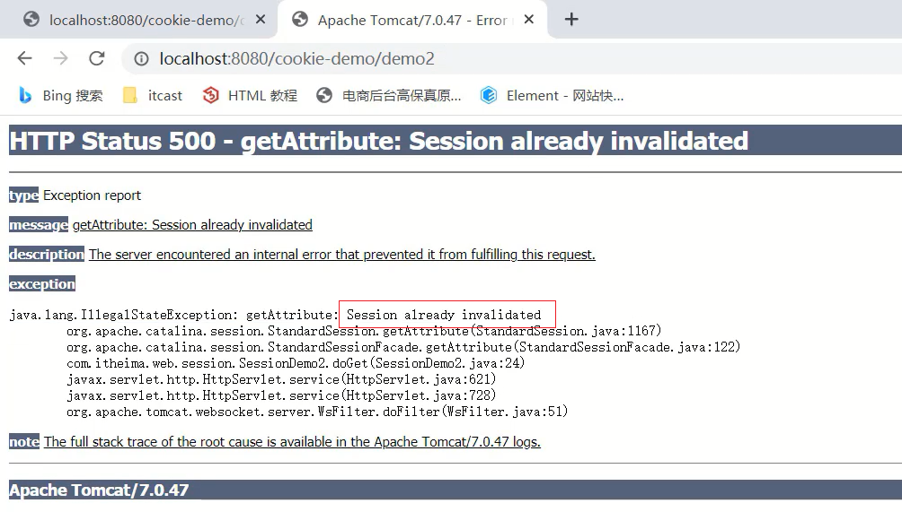

## 会话技术

## 1.会话跟踪技术概述

* 会话:用户打开浏览器，访问web服务器的资源，会话建立，直到有一方断开连接，会话结束。在一次会话中可以包含多次请求和响应。

  * 从浏览器发出请求到服务端响应数据给前端之后，一次会话(在浏览器和服务器之间)就被建立了
  * 会话被建立后，如果浏览器或服务端都没有被关闭，则会话就会持续建立着
  * 浏览器和服务器就可以继续使用该会话进行请求发送和响应，上述的整个过程就被称之为会话。

* 会话跟踪:一种维护浏览器状态的方法，服务器需要识别多次请求是否来自于同一浏览器，以便在同一次会话的多次请求间共享数据。

  * 服务器会收到多个请求，这多个请求可能来自多个浏览器
  * 服务器需要识别请求是否来自同一个浏览器
  * 服务器用来识别浏览器的过程，这个过程就是会话跟踪
  * 服务器识别浏览器后就可以在同一个会话中多次请求之间来共享数据

* 为什么浏览器和服务器不支持数据共享

  * 浏览器和服务器之间使用的是HTTP请求来进行数据传输

  * HTTP协议是无状态的，每次浏览器向服务器请求时，服务器都会将该请求视为新的请求

  * HTTP协议设计成无状态的目的是让每次请求之间相互独立，互不影响

  * 请求与请求之间独立后，就无法实现多次请求之间的数据共享

* 如何实现会话跟踪技术

  * (1)客户端会话跟踪技术：Cookie
  * (2)服务端会话跟踪技术：Session
  * 区别:Cookie是存储在浏览器端而Session是存储在服务器端


## 2.Cookie

### 2.1 Cookie的基本使用

**1.概念**

Cookie：客户端会话技术，将数据保存到客户端，以后每次请求都携带Cookie数据进行访问。

**2.Cookie的工作流程**


* 服务端提供了两个Servlet，分别是ServletA和ServletB
* 浏览器发送HTTP请求1给服务端，服务端ServletA接收请求并进行业务处理
* 服务端ServletA在处理的过程中可以创建一个Cookie对象并将`name=zs`的数据存入Cookie
* 服务端ServletA在响应数据的时候，会把Cookie对象响应给浏览器
* 浏览器接收到响应数据，会把Cookie对象中的数据存储在浏览器内存中，此时浏览器和服务端就建立了一次会话
* 在同一次会话中浏览器再次发送HTTP请求2给服务端ServletB，浏览器会携带Cookie对象中的所有数据
* ServletB接收到请求和数据后，就可以获取到存储在Cookie对象中的数据，这样同一个会话中的多次请求之间就实现了数据共享

**3.Cookie的基本使用**

对于Cookie的使用，我们更关注的应该是后台代码如何操作Cookie，对于Cookie的操作主要分两大类，本别是发送Cookie和获取Cookie

3.1 发送Cookie

* 创建Cookie对象，并设置数据

```
Cookie cookie = new Cookie("key","value");
```

* 发送Cookie到客户端：使用response对象

```
response.addCookie(cookie);
```

3.2 chrome浏览器查看Cookied的值

方式一:


方式二:选中打开开发者工具或者 使用快捷键F12 或者 Ctrl+Shift+I


3.3获取Cookie

- 获取客户端携带的所有Cookie，使用request对象

```
Cookie[] cookies = request.getCookies();
```

- 遍历数组，获取每一个Cookie对象：for
- 使用Cookie对象方法获取数据

```
cookie.getName();
cookie.getValue();
```

### 2.2 Cookie的原理分析

对于Cookie的实现原理是基于HTTP协议的,其中设计到HTTP协议中的两个请求头信息:

* 响应头:set-cookie
* 请求头: cookie


* 前面的案例中已经能够实现，AServlet给前端发送Cookie,BServlet从request中获取Cookie的功能
* 对于AServlet响应数据的时候，Tomcat服务器都是基于HTTP协议来响应数据
* 当Tomcat发现后端要返回的是一个Cookie对象之后，Tomcat就会在响应头中添加一行数据`Set-Cookie:username=zs`
* 浏览器获取到响应结果后，从响应头中就可以获取到`Set-Cookie`对应值`username=zs`,并将数据存储在浏览器的内存中
* 浏览器再次发送请求给BServlet的时候，浏览器会自动在请求头中添加`Cookie: username=zs`发送给服务端BServlet
* Request对象会把请求头中cookie对应的值封装成一个个Cookie对象，最终形成一个数组
* BServlet通过Request对象获取到Cookie[]后，就可以从中获取自己需要的数据

接下来，使用刚才的案例，把上述结论验证下:

(1)访问AServlet对应的地址`http://localhost:8080/cookie-demo/aServlet`

使用Chrom浏览器打开开发者工具(F12或Crtl+Shift+I)进行查看响应头中的数据


（2）访问BServlet对应的地址`http://localhost:8080/cookie-demo/bServlet

使用Chrom浏览器打开开发者工具(F12或Crtl+Shift+I)进行查看请求头中的数据


### 2.3 Cookie的使用细节

在这节我们主要讲解两个知识，第一个是Cookie的存活时间，第二个是Cookie如何存储中文，首先来学习下Cookie的存活时间。

#### 2.3.1 Cookie的存活时间

前面让大家思考过一个问题:


(1)浏览器发送请求给AServlet,AServlet会响应一个存有`usernanme=zs`的Cookie对象给浏览器

(2)浏览器接收到响应数据将cookie存入到浏览器内存中

(3)当浏览器再次发送请求给BServlet,BServlet就可以使用Request对象获取到Cookie数据

(4)在发送请求到BServlet之前，如果把浏览器关闭再打开进行访问，BServlet能否获取到Cookie数据?

注意：浏览器关闭再打开不是指打开一个新的选项卡，而且必须是先关闭再打开，顺序不能变。

针对上面这个问题，通过演示，会发现，BServlet中无法再获取到Cookie数据，这是为什么呢?

* 默认情况下，Cookie存储在浏览器内存中，当浏览器关闭，内存释放，则Cookie被销毁

这个结论就印证了上面的演示效果，但是如果使用这种默认情况下的Cookie,有些需求就无法实现，比如:


上面这个网站的登录页面上有一个`记住我`的功能，这个功能大家都比较熟悉

* 第一次输入用户名和密码并勾选`记住我`然后进行登录
* 下次再登陆的时候，用户名和密码就会被自动填充，不需要再重新输入登录
* 比如`记住我`这个功能需要记住用户名和密码一个星期，那么使用默认情况下的Cookie就会出现问题
* 因为默认情况，浏览器一关，Cookie就会从浏览器内存中删除，对于`记住我`功能就无法实现

所以我们现在就遇到一个难题是如何将Cookie持久化存储?

Cookie其实已经为我们提供好了对应的API来完成这件事，这个API就是setMaxAge,

* 设置Cookie存活时间

```
setMaxAge(int seconds)
```

参数值为:

1.正数：将Cookie写入浏览器所在电脑的硬盘，持久化存储。到时间自动删除

2.负数：默认值，Cookie在当前浏览器内存中，当浏览器关闭，则Cookie被销毁

3.零：删除对应Cookie

接下来，咱们就在AServlet中去设置Cookie的存活时间。

```java
@WebServlet("/aServlet")
public class AServlet extends HttpServlet {
    @Override
    protected void doGet(HttpServletRequest request, HttpServletResponse response) throws ServletException, IOException {
        //发送Cookie
        //1. 创建Cookie对象
        Cookie cookie = new Cookie("username","zs");
        //设置存活时间   ，1周 7天
        cookie.setMaxAge(60*60*24*7); //易阅读，需程序计算
		//cookie.setMaxAge(604800); //不易阅读(可以使用注解弥补)，程序少进行一次计算
        //2. 发送Cookie，response
        response.addCookie(cookie);
    }

    @Override
    protected void doPost(HttpServletRequest request, HttpServletResponse response) throws ServletException, IOException {
        this.doGet(request, response);
    }
}
```

修改完代码后，启动测试，访问`http://localhost:8080/cookie-demo/aServlet`

* 访问一个AServlet后，把浏览器关闭重启后，再去访问`http://localhost:8080/cookie-demo/bServet`,能在控制台打印出`username:zs`,说明Cookie没有随着浏览器关闭而被销毁
*  通过浏览器查看Cookie的内容，会发现Cookie的相关信息


#### 2.3.2 Cookie存储中文

Cookie不能存储中文，但是如果有这方面的需求，这个时候该如何解决呢?

这个时候，我们可以使用之前学过的一个知识点叫`URL编码`，所以如果需要存储中文，就需要进行转码，具体的实现思路为:

> 1.在AServlet中对中文进行URL编码，采用URLEncoder.encode()，将编码后的值存入Cookie中
>
> 2.在BServlet中获取Cookie中的值,获取的值为URL编码后的值
>
> 3.将获取的值在进行URL解码,采用URLDecoder.decode()，就可以获取到对应的中文值

(1)在AServlet中对中文进行URL编码

```java
@WebServlet("/aServlet")
public class AServlet extends HttpServlet {
    @Override
    protected void doGet(HttpServletRequest request, HttpServletResponse response) throws ServletException, IOException {
        //发送Cookie
        String value = "张三";
        //对中文进行URL编码
        value = URLEncoder.encode(value, "UTF-8");
        System.out.println("存储数据："+value);
        //将编码后的值存入Cookie中
        Cookie cookie = new Cookie("username",value);
        //设置存活时间   ，1周 7天
        cookie.setMaxAge(60*60*24*7);
        //2. 发送Cookie，response
        response.addCookie(cookie);
    }

    @Override
    protected void doPost(HttpServletRequest request, HttpServletResponse response) throws ServletException, IOException {
        this.doGet(request, response);
    }
}
```

(2)在BServlet中获取值，并对值进行解码

```java
@WebServlet("/bServlet")
public class BServlet extends HttpServlet {
    @Override
    protected void doGet(HttpServletRequest request, HttpServletResponse response) throws ServletException, IOException {
        //获取Cookie
        //1. 获取Cookie数组
        Cookie[] cookies = request.getCookies();
        //2. 遍历数组
        for (Cookie cookie : cookies) {
            //3. 获取数据
            String name = cookie.getName();
            if("username".equals(name)){
                String value = cookie.getValue();//获取的是URL编码后的值 %E5%BC%A0%E4%B8%89
                //URL解码
                value = URLDecoder.decode(value,"UTF-8");
                System.out.println(name+":"+value);//value解码后为 张三
                break;
            }
        }

    }

    @Override
    protected void doPost(HttpServletRequest request, HttpServletResponse response) throws ServletException, IOException {
        this.doGet(request, response);
    }
}
```

至此，我们就可以将中文存入Cookie中进行使用。

## 3.Session

### 3.1 Session的基本使用

**1.概念**

Session：服务端会话跟踪技术：将数据保存到服务端。

* Session是存储在服务端而Cookie是存储在客户端
* 存储在客户端的数据容易被窃取和截获，存在很多不安全的因素
* 存储在服务端的数据相比于客户端来说就更安全

**2.Session的工作流程**

 

* 在服务端的AServlet获取一个Session对象，把数据存入其中
* 在服务端的BServlet获取到相同的Session对象，从中取出数据
* 就可以实现一次会话中多次请求之间的数据共享了

**3.Session的基本使用**

在JavaEE中提供了HttpSession接口，来实现一次会话的多次请求之间数据共享功能。

具体的使用步骤为:

* 获取Session对象,使用的是request对象

```
HttpSession session = request.getSession();
```

* Session对象提供的功能:

  * 存储数据到 session 域中

    ```
    void setAttribute(String name, Object o)
    ```

  * 根据 key，获取值

    ```
    Object getAttribute(String name)
    ```

  * 根据 key，删除该键值对

    ```
    void removeAttribute(String name)
    ```

* 注意:Session中可以存储的是一个Object类型的数据，也就是说Session中可以存储任意数据类型。

### 3.2 Session的原理分析

* Session是基于Cookie实现的

(1)前提条件


Session要想实现一次会话多次请求之间的数据共享，就必须要保证多次请求获取Session的对象是同一个。

那么最主要的问题就来了，Session是如何保证在一次会话中获取的Session对象是同一个呢


(1)demo1在第一次获取session对象的时候，session对象会有一个唯一的标识，假如是`id:10`

(2)demo1在session中存入其他数据并处理完成所有业务后，需要通过Tomcat服务器响应结果给浏览器

(3)Tomcat服务器发现业务处理中使用了session对象，就会把session的唯一标识`id:10`当做一个cookie，添加`Set-Cookie:JESSIONID=10`到响应头中，并响应给浏览器

(4)浏览器接收到响应结果后，会把响应头中的coookie数据存储到浏览器的内存中

(5)浏览器在同一会话中访问demo2的时候，会把cookie中的数据按照`cookie: JESSIONID=10`的格式添加到请求头中并发送给服务器Tomcat

(6)demo2获取到请求后，从请求头中就读取cookie中的JSESSIONID值为10，然后就会到服务器内存中寻找`id:10`的session对象，如果找到了，就直接返回该对象，如果没有则新创建一个session对象

(7)关闭打开浏览器后，因为浏览器的cookie已被销毁，所以就没有JESSIONID的数据，服务端获取到的session就是一个全新的session对象

### 3.3 Session的使用细节

这节我们会主要讲解两个知识，第一个是Session的钝化和活化，第二个是Session的销毁，首先来学习什么是Session的钝化和活化？

#### 3.3.1 Session钝化与活化

只要服务器是正常关闭和启动，session中的数据是可以被保存下来的。

具体的原因就是:Session的钝化和活化:

* 钝化：在服务器正常关闭后，Tomcat会自动将Session数据写入硬盘的文件中

  * 钝化的数据路径为:`项目目录\target\tomcat\work\Tomcat\localhost\项目名称\SESSIONS.ser`

    

* 活化：再次启动服务器后，从文件中加载数据到Session中

  * 数据加载到Session中后，路径中的`SESSIONS.ser`文件会被删除掉

对于上述的整个过程，只需要了解下即可。因为所有的过程都是Tomcat自己完成的，不需要我们参与。

#### 3.3.2 Session销毁

session的销毁会有两种方式:

* 默认情况下，无操作，30分钟自动销毁

  * 对于这个失效时间，是可以通过配置进行修改的

    * 在项目的web.xml中配置

      ```xml
      <?xml version="1.0" encoding="UTF-8"?>
      <web-app xmlns="http://xmlns.jcp.org/xml/ns/javaee"
               xmlns:xsi="http://www.w3.org/2001/XMLSchema-instance"
               xsi:schemaLocation="http://xmlns.jcp.org/xml/ns/javaee http://xmlns.jcp.org/xml/ns/javaee/web-app_3_1.xsd"
               version="3.1">
      
          <session-config>
              <session-timeout>100</session-timeout>
          </session-config>
      </web-app>
      ```

    * 如果没有配置，默认是30分钟，默认值是在Tomcat的web.xml配置文件中写死的

      

* 调用Session对象的invalidate()进行销毁

  * 在SessionDemo2类中添加session销毁的方法

    ```java
    @WebServlet("/demo2")
    public class SessionDemo2 extends HttpServlet {
        @Override
        protected void doGet(HttpServletRequest request, HttpServletResponse response) throws ServletException, IOException {
            //获取数据，从session中
    
            //1. 获取Session对象
            HttpSession session = request.getSession();
            System.out.println(session);
    
            // 销毁
            session.invalidate();
            //2. 获取数据
            Object username = session.getAttribute("username");
            System.out.println(username);
        }
    
        @Override
        protected void doPost(HttpServletRequest request, HttpServletResponse response) throws ServletException, IOException {
            this.doGet(request, response);
        }
    }
    ```

  * 启动访问测试，先访问demo1将数据存入到session，再次访问demo2从session中获取数据

    

  * 该销毁方法一般会在用户退出的时候，需要将session销毁掉。

## 4.用户登录注册案例

### 4.1 需求分析

 需求说明：

1. 完成用户登录功能，如果用户勾选“记住用户” ，则下次访问登录页面自动填充用户名密码

2. 完成注册功能，并实现验证码功能


### 4.2 用户登录功能

1. 需求:


* 用户登录成功后，跳转到列表页面，并在页面上展示当前登录的用户名称
* 用户登录失败后，跳转回登录页面，并在页面上展示对应的错误信息

2. 实现流程分析


(1)前端通过表单发送请求和数据给Web层的LoginServlet

(2)在LoginServlet中接收请求和数据[用户名和密码]

(3)LoginServlet接收到请求和数据后，调用Service层完成根据用户名和密码查询用户对象

(4)在Service层需要编写UserService类，在类中实现login方法，方法中调用Dao层的UserMapper

(5)在UserMapper接口中，声明一个根据用户名和密码查询用户信息的方法

(6)Dao层把数据查询出来以后，将返回数据封装到User对象，将对象交给Service层

(7)Service层将数据返回给Web层

(8)Web层获取到User对象后，判断User对象，如果为Null,则将错误信息响应给登录页面，如果不为Null，则跳转到列表页面，并把当前登录用户的信息存入Session携带到列表页面。

3. 具体实现

(1)完成Dao层的代码编写

(1.1)将`04-资料\1. 登录注册案例\2. MyBatis环境\UserMapper.java`放到com.itheima.mapper`包下:

```java
public interface UserMapper {
    /**
     * 根据用户名和密码查询用户对象
     * @param username
     * @param password
     * @return
     */
    @Select("select * from tb_user where username = #{username} and password = #{password}")
    User select(@Param("username") String username,@Param("password")  String password);

    /**
     * 根据用户名查询用户对象
     * @param username
     * @return
     */
    @Select("select * from tb_user where username = #{username}")
    User selectByUsername(String username);

    /**
     * 添加用户
     * @param user
     */
    @Insert("insert into tb_user values(null,#{username},#{password})")
    void add(User user);
}
```

(1.2)将`04-资料\1. 登录注册案例\2. MyBatis环境\User.java`放到`com.itheima.pojo`包下:

```java
public class User {

    private Integer id;
    private String username;
    private String password;

    public Integer getId() {
        return id;
    }

    public void setId(Integer id) {
        this.id = id;
    }

    public String getUsername() {
        return username;
    }

    public void setUsername(String username) {
        this.username = username;
    }

    public String getPassword() {
        return password;
    }

    public void setPassword(String password) {
        this.password = password;
    }

    @Override
    public String toString() {
        return "User{" +
                "id=" + id +
                ", username='" + username + '\'' +
                ", password='" + password + '\'' +
                '}';
    }
}
```

(1.3)将`04-资料\1. 登录注册案例\2. MyBatis环境\UserMapper.xml`放入到resources/com/itheima/mapper`目录下:

```xml
<?xml version="1.0" encoding="UTF-8" ?>
<!DOCTYPE mapper
        PUBLIC "-//mybatis.org//DTD Mapper 3.0//EN"
        "http://mybatis.org/dtd/mybatis-3-mapper.dtd">
<mapper namespace="com.itheima.mapper.UserMapper">

</mapper>
```

(2)完成Service层的代码编写

(2.1)在`com.itheima.service`包下，创建UserService类

```java
public class UserService {
    //1.使用工具类获取SqlSessionFactory
    SqlSessionFactory factory = SqlSessionFactoryUtils.getSqlSessionFactory();
    /**
     * 登录方法
     * @param username
     * @param password
     * @return
     */
    public User login(String username,String password){
        //2. 获取SqlSession
        SqlSession sqlSession = factory.openSession();
        //3. 获取UserMapper
        UserMapper mapper = sqlSession.getMapper(UserMapper.class);
        //4. 调用方法
        User user = mapper.select(username, password);
        //释放资源
        sqlSession.close();

        return  user;
    }
}
```

(3)完成页面和Web层的代码编写

(3.1)将`04-资料\1. 登录注册案例\1. 静态页面`拷贝到项目的`webapp`目录下:


(3.2)将login.html内容修改成login.jsp

```jsp
<%@ page contentType="text/html;charset=UTF-8" language="java" %>
<!DOCTYPE html>
<html lang="en">

<head>
    <meta charset="UTF-8">
    <title>login</title>
    <link href="css/login.css" rel="stylesheet">
</head>

<body>
<div id="loginDiv" style="height: 350px">
    <form action="/brand-demo/loginServlet" method="post" id="form">
        <h1 id="loginMsg">LOGIN IN</h1>
        <div id="errorMsg">用户名或密码不正确</div>
        <p>Username:<input id="username" name="username" type="text"></p>
        <p>Password:<input id="password" name="password" type="password"></p>
        <p>Remember:<input id="remember" name="remember" type="checkbox"></p>
        <div id="subDiv">
            <input type="submit" class="button" value="login up">
            <input type="reset" class="button" value="reset">&nbsp;&nbsp;&nbsp;
            <a href="register.html">没有账号？</a>
        </div>
    </form>
</div>
</body>
</html>
```

(3.3)创建LoginServlet类

```java
@WebServlet("/loginServlet")
public class LoginServlet extends HttpServlet {
    private UserService service = new UserService();

    @Override
    protected void doGet(HttpServletRequest request, HttpServletResponse response) throws ServletException, IOException {
        //1. 获取用户名和密码
        String username = request.getParameter("username");
        String password = request.getParameter("password");
   
        //2. 调用service查询
        User user = service.login(username, password);

        //3. 判断
        if(user != null){
            //登录成功，跳转到查询所有的BrandServlet
            
            //将登陆成功后的user对象，存储到session
            HttpSession session = request.getSession();
            session.setAttribute("user",user);
            
            String contextPath = request.getContextPath();
            response.sendRedirect(contextPath+"/selectAllServlet");
        }else {
            // 登录失败,
            // 存储错误信息到request
            request.setAttribute("login_msg","用户名或密码错误");
            // 跳转到login.jsp
            request.getRequestDispatcher("/login.jsp").forward(request,response);

        }
    }

    @Override
    protected void doPost(HttpServletRequest request, HttpServletResponse response) throws ServletException, IOException {
        this.doGet(request, response);
    }
}
```

(3.4)在brand.jsp中<body>标签下添加欢迎当前用户的提示信息:

```jsp
<h1>${user.username},欢迎您</h1>
```

(3.5) 修改login.jsp，将错误信息使用EL表达式来获取

```jsp
修改前内容:<div id="errorMsg">用户名或密码不正确</div>
修改后内容: <div id="errorMsg">${login_msg}</div>
```

(4)启动，访问测试

(4.1) 进入登录页面，输入错误的用户名或密码


(4.2)输入正确的用户和密码信息


**小结**

* 在LoginServlet中，将登录成功的用户数据存入session中，方法在列表页面中获取当前登录用户信息进行展示
* 在LoginServlet中，将登录失败的错误信息存入到request中，如果存入到session中就会出现这次会话的所有请求都有登录失败的错误信息，这个是不需要的，所以不用存入到session中

### 4.3 记住我-设置Cookie

1. 需求:

如果用户勾选“记住用户” ，则下次访问登陆页面自动填充用户名密码。这样可以提升用户的体验。


对应上面这个需求，最大的问题就是: 如何自动填充用户名和密码?

2. 实现流程分析

因为`记住我`功能要实现的效果是，就算用户把浏览器关闭过几天再来访问也能自动填充，所以需要将登陆信息存入一个可以长久保存，并且能够在浏览器关闭重新启动后依然有效的地方，就是我们前面讲的Cookie,所以:

* 将用户名和密码写入Cookie中，并且持久化存储Cookie,下次访问浏览器会自动携带Cookie

* 在页面获取Cookie数据后，设置到用户名和密码框中

* 何时写入Cookie?
  * 用户必须登陆成功后才需要写
  * 用户必须在登录页面勾选了`记住我`的复选框


(1)前端需要在发送请求和数据的时候，多携带一个用户是否勾选`Remember`的数据

(2)LoginServlet获取到数据后，调用Service完成用户名和密码的判定

(3)登录成功，并且用户在前端勾选了`记住我`，需要往Cookie中写入用户名和密码的数据，并设置Cookie存活时间

(4)设置成功后，将数据响应给前端

3. 具体实现

(1)在login.jsp为复选框设置值

```jsp
<%@ page contentType="text/html;charset=UTF-8" language="java" %>
<!DOCTYPE html>
<html lang="en">

<head>
    <meta charset="UTF-8">
    <title>login</title>
    <link href="css/login.css" rel="stylesheet">
</head>

<body>
<div id="loginDiv" style="height: 350px">
    <form action="/brand-demo/loginServlet" method="post" id="form">
        <h1 id="loginMsg">LOGIN IN</h1>
        <div id="errorMsg">${login_msg}</div>
        <p>Username:<input id="username" name="username" type="text"></p>
        <p>Password:<input id="password" name="password" type="password"></p>
        <p>Remember:<input id="remember" name="remember" value="1" type="checkbox"></p>
        <div id="subDiv">
            <input type="submit" class="button" value="login up">
            <input type="reset" class="button" value="reset">&nbsp;&nbsp;&nbsp;
            <a href="register.html">没有账号？</a>
        </div>
    </form>
</div>
</body>
</html>
```

(2)在LoginServlet获取复选框的值并在登录成功后进行设置Cookie

```java
@WebServlet("/loginServlet")
public class LoginServlet extends HttpServlet {
    private UserService service = new UserService();

    @Override
    protected void doGet(HttpServletRequest request, HttpServletResponse response) throws ServletException, IOException {
        //1. 获取用户名和密码
        String username = request.getParameter("username");
        String password = request.getParameter("password");

        //获取复选框数据
        String remember = request.getParameter("remember");

        //2. 调用service查询
        User user = service.login(username, password);

        //3. 判断
        if(user != null){
            //登录成功，跳转到查询所有的BrandServlet

            //判断用户是否勾选记住我，字符串写前面是为了避免出现空指针异常
            if("1".equals(remember)){
                //勾选了，发送Cookie
                //1. 创建Cookie对象
                Cookie c_username = new Cookie("username",username);
                Cookie c_password = new Cookie("password",password);
                // 设置Cookie的存活时间
                c_username.setMaxAge( 60 * 60 * 24 * 7);
                c_password.setMaxAge( 60 * 60 * 24 * 7);
                //2. 发送
                response.addCookie(c_username);
                response.addCookie(c_password);
            }

            //将登陆成功后的user对象，存储到session
            HttpSession session = request.getSession();
            session.setAttribute("user",user);

            String contextPath = request.getContextPath();
            response.sendRedirect(contextPath+"/selectAllServlet");
        }else {
            // 登录失败,

            // 存储错误信息到request
            request.setAttribute("login_msg","用户名或密码错误");

            // 跳转到login.jsp
            request.getRequestDispatcher("/login.jsp").forward(request,response);

        }
    }

    @Override
    protected void doPost(HttpServletRequest request, HttpServletResponse response) throws ServletException, IOException {
        this.doGet(request, response);
    }
}
```

(3)启动访问测试，

只有当前用户名和密码输入正确，并且勾选了Remeber的复选框，在响应头中才可以看得cookie的相关数据


### 4.4 记住我-获取Cookie

1. 需求

登录成功并勾选了Remeber后，后端返回给前端的Cookie数据就已经存储好了，接下来就需要在页面获取Cookie中的数据，并把数据设置到登录页面的用户名和密码框中。


如何在页面直接获取Cookie中的值呢?

2. 实现流程分析

在页面可以使用EL表达式，${cookie.key.value}

key:指的是存储在cookie中的键名称


(1)在login.jsp用户名的表单输入框使用value值给表单元素添加默认值，value可以使用`${cookie.username.value}`

(2)在login.jsp密码的表单输入框使用value值给表单元素添加默认值，value可以使用`${cookie.password.value}`

3. 具体实现

(1)修改login.jsp页面

```jsp
<%@ page contentType="text/html;charset=UTF-8" language="java" %>
<!DOCTYPE html>
<html lang="en">

<head>
    <meta charset="UTF-8">
    <title>login</title>
    <link href="css/login.css" rel="stylesheet">
</head>

<body>
<div id="loginDiv" style="height: 350px">
    <form action="/brand-demo/loginServlet" method="post" id="form">
        <h1 id="loginMsg">LOGIN IN</h1>
        <div id="errorMsg">${login_msg}</div>
        <p>Username:<input id="username" name="username" value="${cookie.username.value}" type="text"></p>

        <p>Password:<input id="password" name="password" value="${cookie.password.value}" type="password"></p>
        <p>Remember:<input id="remember" name="remember" value="1" type="checkbox"></p>
        <div id="subDiv">
            <input type="submit" class="button" value="login up">
            <input type="reset" class="button" value="reset">&nbsp;&nbsp;&nbsp;
            <a href="register.html">没有账号？</a>
        </div>
    </form>
</div>
</body>
</html>
```

4. 访问测试，重新访问登录页面，就可以看得用户和密码已经被填充。


### 4.5 用户注册功能

1. 需求

* 注册功能：保存用户信息到数据库
* 验证码功能
  * 展示验证码：展示验证码图片，并可以点击切换
  * 校验验证码：验证码填写不正确，则注册失败


2. 实现流程分析


(1)前端通过表单发送请求和数据给Web层的RegisterServlet

(2)在RegisterServlet中接收请求和数据[用户名和密码]

(3)RegisterServlet接收到请求和数据后，调用Service层完成用户信息的保存

(4)在Service层需要编写UserService类，在类中实现register方法，需要判断用户是否已经存在，如果不存在，则完成用户数据的保存

(5)在UserMapper接口中，声明两个方法，一个是根据用户名查询用户信息方法，另一个是保存用户信息方法

(6)在UserService类中保存成功则返回true，失败则返回false,将数据返回给Web层

(7)Web层获取到结果后，如果返回的是true,则提示`注册成功`，并转发到登录页面，如果返回false则提示`用户名已存在`并转发到注册页面

3. 具体实现

(1)Dao层代码参考资料中的内容完成

(2)编写Service层代码

```java
public class UserService {
    //1.使用工具类获取SqlSessionFactory
    SqlSessionFactory factory = SqlSessionFactoryUtils.getSqlSessionFactory();
    /**
     * 注册方法
     * @return
     */

    public boolean register(User user){
        //2. 获取SqlSession
        SqlSession sqlSession = factory.openSession();
        //3. 获取UserMapper
        UserMapper mapper = sqlSession.getMapper(UserMapper.class);
        //4. 判断用户名是否存在
        User u = mapper.selectByUsername(user.getUsername());

        if(u  null){
            // 用户名不存在，注册
            mapper.add(user);
            sqlSession.commit();
        }
        sqlSession.close();

        return u  null;

    }
}
```

(3)完成页面和Web层的代码编写

(3.1)将register.html内容修改成register.jsp

```jsp
<%@ page contentType="text/html;charset=UTF-8" language="java" %>
<!DOCTYPE html>
<html lang="en">
<head>
    <meta charset="UTF-8">
    <title>欢迎注册</title>
    <link href="css/register.css" rel="stylesheet">
</head>
<body>
<div class="form-div">
    <div class="reg-content">
        <h1>欢迎注册</h1>
        <span>已有帐号？</span> <a href="login.html">登录</a>
    </div>
    <form id="reg-form" action="/brand-demo/registerServlet" method="post">
        <table>
            <tr>
                <td>用户名</td>
                <td class="inputs">
                    <input name="username" type="text" id="username">
                    <br>
                    <span id="username_err" class="err_msg" style="display:none">用户名不太受欢迎</span>
                </td>
            </tr>
            <tr>
                <td>密码</td>
                <td class="inputs">
                    <input name="password" type="password" id="password">
                    <br>
                    <span id="password_err" class="err_msg" style="display: none">密码格式有误</span>
                </td>
            </tr>
            <tr>
                <td>验证码</td>
                <td class="inputs">
                    <input name="checkCode" type="text" id="checkCode">
                    
                    <a href="#" id="changeImg" >看不清？</a>
                </td>
            </tr>
        </table>
        <div class="buttons">
            <input value="注 册" type="submit" id="reg_btn">
        </div>
        <br class="clear">
    </form>
</div>
</body>
</html>
```

(3.2)编写RegisterServlet

```java
@WebServlet("/registerServlet")
public class RegisterServlet extends HttpServlet {
    private UserService service = new UserService();

    @Override
    protected void doGet(HttpServletRequest request, HttpServletResponse response) throws ServletException, IOException {
       //1. 获取用户名和密码数据
        String username = request.getParameter("username");
        String password = request.getParameter("password");
        
        User user = new User();
        user.setUsername(username);
        user.setPassword(password);

        //2. 调用service 注册
        boolean flag = service.register(user);
        //3. 判断注册成功与否
        if(flag){
             //注册功能，跳转登陆页面
            request.setAttribute("register_msg","注册成功，请登录");
            request.getRequestDispatcher("/login.jsp").forward(request,response);
        }else {
            //注册失败，跳转到注册页面

            request.setAttribute("register_msg","用户名已存在");
            request.getRequestDispatcher("/register.jsp").forward(request,response);
        }


    }

    @Override
    protected void doPost(HttpServletRequest request, HttpServletResponse response) throws ServletException, IOException {
        this.doGet(request, response);
    }
}
```

(3.3)需要在页面上展示后台返回的错误信息，需要修改register.jsp

```jsp
修改前:<span id="username_err" class="err_msg" style="display:none">用户名不太受欢迎</span>
修改后:<span id="username_err" class="err_msg">${register_msg}</span>
```

(3.4)如果注册成功，需要把成功信息展示在登录页面，所以也需要修改login.jsp

```jsp
修改前:<div id="errorMsg">${login_msg}</div>
修改后:<div id="errorMsg">${login_msg} ${register_msg}</div>
```

(3.5)修改login.jsp，将注册跳转地址修改为register.jsp

```jsp
修改前：<a href="register.html">没有账号？</a>
修改后: <a href="register.jsp">没有账号？</a>
```

(3.6)启动测试，

如果是注册的用户信息已经存在:


如果注册的用户信息不存在，注册成功:


### 4.6 验证码-展示

1. 需求分析

展示验证码：展示验证码图片，并可以点击切换


验证码的生成是通过工具类来实现的，具体的工具类参考

`04-资料\1. 登录注册案例\CheckCodeUtil.java`

在该工具类中编写main方法进行测试:

```java
public static void main(String[] args) throws IOException {
    //生成验证码的图片位置
    OutputStream fos = new FileOutputStream("d://a.jpg");
    //checkCode为最终验证码的数据
    String checkCode = CheckCodeUtil.outputVerifyImage(100, 50, fos, 4);
    System.out.println(checkCode);
}

```

生成完验证码以后，我们就可以知晓:

* 验证码就是使用Java代码生成的一张图片
* 验证码的作用:防止机器自动注册，攻击服务器

2. 实现流程分析


(1)前端发送请求给CheckCodeServlet

(2)CheckCodeServlet接收到请求后，生成验证码图片，将图片用Reponse对象的输出流写回到前端

思考:如何将图片写回到前端浏览器呢?

(1)Java中已经有工具类生成验证码图片，测试类中只是把图片生成到磁盘上
(2)生成磁盘的过程中使用的是OutputStream流，如何把这个图片生成在页面呢?
(3)前面在将Reponse对象的时候，它有一个方法可以获取其字节输出流，getOutputStream()
(4)综上所述，我们可以把写往磁盘的流对象更好成Response的字节流，即可完成图片响应给前端

3. 具体实现

(1)修改Register.jsp页面，将验证码的图片从后台获取

```jsp
<tr>
    <td>验证码</td>
        <td class="inputs">
        <input name="checkCode" type="text" id="checkCode">
        
        <a href="#" id="changeImg" >看不清？</a>
    </td>
</tr>

<script>
    document.getElementById("changeImg").onclick = function () {
       	//路径后面添加时间戳的目的是避免浏览器进行缓存静态资源
        document.getElementById("checkCodeImg").src = "/brand-demo/checkCodeServlet?"+new Date().getMilliseconds();
    }
</script>
```

(2)编写CheckCodeServlet类，用来接收请求生成验证码

```java
@WebServlet("/checkCodeServlet")
public class CheckCodeServlet extends HttpServlet {
    @Override
    protected void doGet(HttpServletRequest request, HttpServletResponse response) throws ServletException, IOException {
        // 生成验证码
        ServletOutputStream os = response.getOutputStream();
        String checkCode = CheckCodeUtil.outputVerifyImage(100, 50, os, 4);
    }

    @Override
    protected void doPost(HttpServletRequest request, HttpServletResponse response) throws ServletException, IOException {
        this.doGet(request, response);
    }
}
```

### 4.7验证码-校验

1. 需求

* 判断程序生成的验证码 和 用户输入的验证码 是否一样，如果不一样，则阻止注册
* 验证码图片访问和提交注册表单是两次请求，所以要将程序生成的验证码存入Session中


思考:为什么要把验证码数据存入到Session中呢?

* 生成验证码和校验验证码是两次请求，此处就需要在一个会话的两次请求之间共享数据
* 验证码属于安全数据类的，所以我们选中Session来存储验证码数据。

2. 实现流程分析


(1)在CheckCodeServlet中生成验证码的时候，将验证码数据存入Session对象

(2)前端将验证码和注册数据提交到后台，交给RegisterServlet类

(3)RegisterServlet类接收到请求和数据后，其中就有验证码，和Session中的验证码进行对比

(4)如果一致，则完成注册，如果不一致，则提示错误信息

3. 具体实现

(1)修改CheckCodeServlet类，将验证码存入Session对象

```java
@WebServlet("/checkCodeServlet")
public class CheckCodeServlet extends HttpServlet {
    @Override
    protected void doGet(HttpServletRequest request, HttpServletResponse response) throws ServletException, IOException {

        // 生成验证码
        ServletOutputStream os = response.getOutputStream();
        String checkCode = CheckCodeUtil.outputVerifyImage(100, 50, os, 4);

        // 存入Session
        HttpSession session = request.getSession();
        session.setAttribute("checkCodeGen",checkCode);


    }

    @Override
    protected void doPost(HttpServletRequest request, HttpServletResponse response) throws ServletException, IOException {
        this.doGet(request, response);
    }
}
```

(2)在RegisterServlet中，获取页面的和session对象中的验证码，进行对比

```java
package com.itheima.web;

import com.itheima.pojo.User;
import com.itheima.service.UserService;

import javax.servlet.ServletException;
import javax.servlet.annotation.WebServlet;
import javax.servlet.http.*;
import java.io.IOException;

@WebServlet("/registerServlet")
public class RegisterServlet extends HttpServlet {
    private UserService service = new UserService();

    @Override
    protected void doGet(HttpServletRequest request, HttpServletResponse response) throws ServletException, IOException {
       //1. 获取用户名和密码数据
        String username = request.getParameter("username");
        String password = request.getParameter("password");

        User user = new User();
        user.setUsername(username);
        user.setPassword(password);

        // 获取用户输入的验证码
        String checkCode = request.getParameter("checkCode");

        // 程序生成的验证码，从Session获取
        HttpSession session = request.getSession();
        String checkCodeGen = (String) session.getAttribute("checkCodeGen");

        // 比对
        if(!checkCodeGen.equalsIgnoreCase(checkCode)){

            request.setAttribute("register_msg","验证码错误");
            request.getRequestDispatcher("/register.jsp").forward(request,response);

            // 不允许注册
            return;
        }
        //2. 调用service 注册
        boolean flag = service.register(user);
        //3. 判断注册成功与否
        if(flag){
             //注册功能，跳转登陆页面

            request.setAttribute("register_msg","注册成功，请登录");
            request.getRequestDispatcher("/login.jsp").forward(request,response);
        }else {
            //注册失败，跳转到注册页面

            request.setAttribute("register_msg","用户名已存在");
            request.getRequestDispatcher("/register.jsp").forward(request,response);
        }


    }

    @Override
    protected void doPost(HttpServletRequest request, HttpServletResponse response) throws ServletException, IOException {
        this.doGet(request, response);
    }
}
```

至此，用户的注册登录功能就已经完成了。
