# 0.安装Docker

Docker 分为 CE 和 EE 两大版本。CE 即社区版（免费，支持周期 7 个月），EE 即企业版，强调安全，付费使用，支持周期 24 个月。

Docker CE 分为 `stable` `test` 和 `nightly` 三个更新频道。

官方网站上有各种环境下的 [安装指南](https://docs.docker.com/install/)，这里主要介绍 Docker CE 在 CentOS上的安装。

# 1.CentOS安装Docker

Docker CE 支持 64 位版本 CentOS 7，并且要求内核版本不低于 3.10， CentOS 7 满足最低内核的要求，所以我们在CentOS 7安装Docker。


## 1.1.卸载（可选）

如果之前安装过旧版本的Docker，可以使用下面命令卸载：

```
yum remove docker \
                  docker-client \
                  docker-client-latest \
                  docker-common \
                  docker-latest \
                  docker-latest-logrotate \
                  docker-logrotate \
                  docker-selinux \
                  docker-engine-selinux \
                  docker-engine \
                  docker-ce
```

> 说明：上述命令中的\表示如果一行命令比较多看着不方便，我们可以使用\表示换行。


## 1.2.安装docker

首先需要大家虚拟机联网，安装yum工具

```sh
yum install -y yum-utils \
           device-mapper-persistent-data \
           lvm2 --skip-broken
```

然后更新本地镜像源：

```shell
# 设置docker镜像源
yum-config-manager \
    --add-repo \
    https://mirrors.aliyun.com/docker-ce/linux/centos/docker-ce.repo
# 添加docker镜像相关依赖    
sed -i 's/download.docker.com/mirrors.aliyun.com\/docker-ce/g' /etc/yum.repos.d/docker-ce.repo
# 刷新缓存
yum makecache fast
```

> 说明：yum源默认是从国外下载，上述命令表示更新yum源下载的镜像源从阿里云，这样下面安装docker的时候就会快一些。

然后输入命令开始安装docker：

```shell
yum install -y docker-ce
```

docker-ce为社区免费版本。稍等片刻，docker即可安装成功。


## 1.3.启动docker

Docker应用需要用到各种端口，逐一去修改防火墙设置。非常麻烦，因此建议大家直接关闭防火墙！

启动docker前，一定要关闭防火墙！！

启动docker前，一定要关闭防火墙！！

启动docker前，一定要关闭防火墙！！


```sh
# 关闭
systemctl stop firewalld
# 禁止开机启动防火墙
systemctl disable firewalld
```


通过命令启动docker：

```sh
systemctl start docker  # 启动docker服务

systemctl stop docker  # 停止docker服务

systemctl restart docker  # 重启docker服务

systemctl status docker # 检查docker状态

systemctl enable docker # 设置docker服务开机自启
```


然后输入命令，可以查看docker版本：

```
docker -v
```

如图：

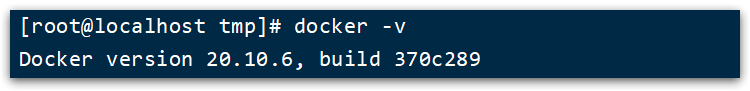 


## 1.4.配置镜像加速

docker官方镜像仓库网速较差，我们需要设置国内镜像服务：

参考阿里云的镜像加速文档：https://cr.console.aliyun.com/cn-hangzhou/instances/mirrors

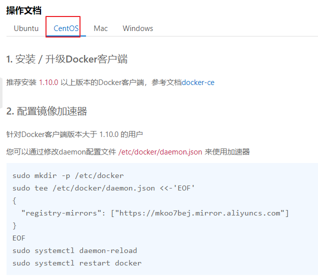

~~~markdown
1. 安装／升级Docker客户端
推荐安装1.10.0以上版本的Docker客户端，参考文档docker-ce

2. 配置镜像加速器
针对Docker客户端版本大于 1.10.0 的用户

您可以通过修改daemon配置文件/etc/docker/daemon.json来使用加速器
# 1）执行第一条命令
# -p 创建多级目录
sudo mkdir -p /etc/docker

# 2）执行第二条命令

sudo tee /etc/docker/daemon.json <<-'EOF'
{
  "registry-mirrors": ["https://mkoo7bej.mirror.aliyuncs.com"]
}
EOF

# 3）执行第三条命令

sudo systemctl daemon-reload

# 4）执行第四条命令

sudo systemctl restart docker
~~~


# 2.CentOS7安装DockerCompose


## 2.1.下载

Linux下需要通过命令下载：

```sh
# 安装
curl -L https://github.com/docker/compose/releases/download/1.23.1/docker-compose-`uname -s`-`uname -m` > /usr/local/bin/docker-compose
```

如果下载速度较慢，或者下载失败，可以使用课前资料提供的docker-compose文件：


上传到`/usr/local/bin/`目录也可以。

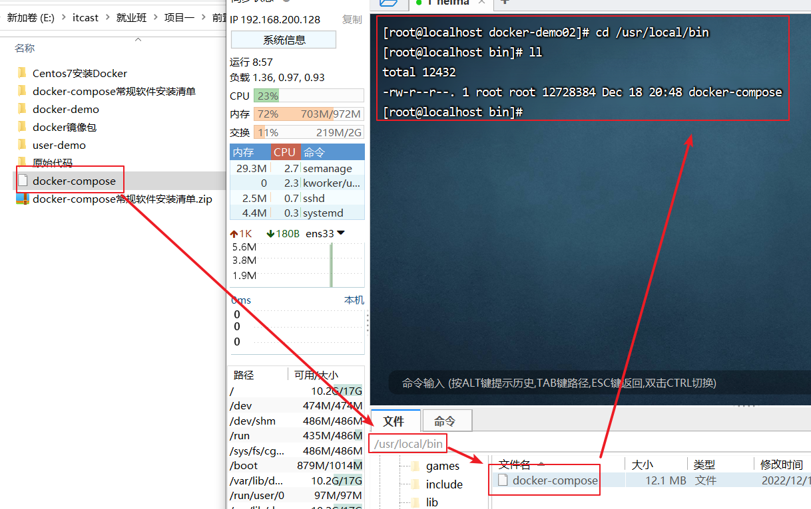

## 2.2.修改文件权限

修改文件权限：将文件变为执行权限

```sh
# 修改权限
chmod +x /usr/local/bin/docker-compose
```


============================================================================================

按照前两步就已经安装好DockerCompose了。下面的操作可选。

## 2.3.Base自动补全命令(可选)

以下的命令可以自选执行，执行之后在docker-compose中会有自动提示。

1.需要修改自己的hosts文件：

~~~java
echo "199.232.68.133 raw.githubusercontent.com" >> /etc/hosts
~~~

2.执行命令

```sh
# 补全命令
curl -L https://raw.githubusercontent.com/docker/compose/1.29.1/contrib/completion/bash/docker-compose > /etc/bash_completion.d/docker-compose
```

======================================================================================================


```
# 查看系统中是否已经包含命令补齐脚本
ls  /usr/share/bash-completion/completions/docker*
# 下载自动补齐工具
yum -y install bash-completion
# 让自动补齐功能生效
source /usr/share/bash-completion/completions/docker
source /usr/share/bash-completion/bash_completion
```

# 3.Docker镜像仓库

搭建镜像仓库可以基于Docker官方提供的DockerRegistry来实现。

官网地址：https://hub.docker.com/_/registry


## 3.1.简化版镜像仓库

Docker官方的Docker Registry是一个基础版本的Docker镜像仓库，具备仓库管理的完整功能。

搭建方式比较简单，命令如下：

```sh
# docker run 创建并运行镜像仓库
# -d 表示后台
# \ 表示放在一行太长不好看，表示换行
docker run -d \
	#  --restart=always每次都是开机自动启动
    --restart=always \
    # --name registry 表示容器名
    --name registry	\
    # 表示端口号是5000
    -p 5000:5000 \
    # 数据卷
    -v registry-data:/var/lib/registry \
    # 表示镜像
    registry
```

~~~shell
docker run -d \
    --restart=always \
    --name registry	\
    -p 5000:5000 \
    -v registry-data:/var/lib/registry \
    registry
~~~

说明:

> 1.Docker Registry 默认端口号是5000

命令中挂载了一个数据卷registry-data到容器内的/var/lib/registry 目录，这是私有镜像库存放数据的目录。

访问http://YourIp:5000/v2/_catalog 可以查看当前私有镜像服务中包含的镜像


## 3.2安装简化版本Docker镜像仓库

### 1.执行上述命令安装Docker镜像仓库

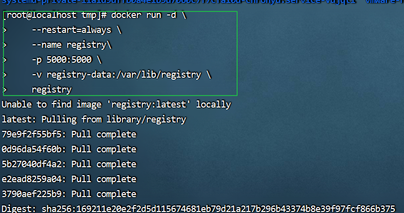

### 2.查看镜像是否安装成功

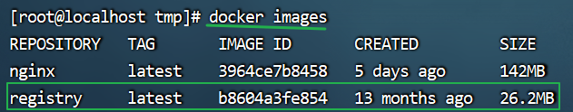

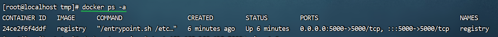


### 3.配置Docker信任地址

我们的私服采用的是http协议，默认不被Docker信任，所以需要做一个配置：

```sh
# 打开要修改的文件
vim /etc/docker/daemon.json
# 添加内容：换成你的linux的ip
"insecure-registries":["http://192.168.200.128:5000"]

# 重加载
systemctl daemon-reload
# 重启docker
systemctl restart docker
```

【1】打开要修改的文件

~~~shell
vim /etc/docker/daemon.json
~~~

【2】添加内容：

~~~shell
"insecure-registries":["http://192.168.200.128:5000"]
~~~

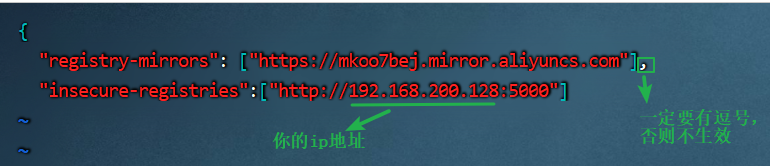

【3】重加载

~~~shell
systemctl daemon-reload
~~~

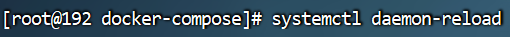

【4】重启docker

~~~shell
systemctl restart docker
~~~

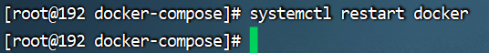

【5】浏览器直接访问,可以查看当前私有镜像服务中包含的镜像

~~~markdown
192.168.200.128:5000/v2/_catalog
~~~


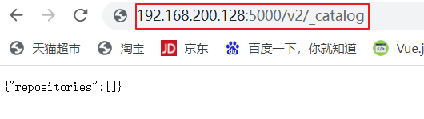


=====================================================================================================


## 3.3.带有图形化界面版本

使用DockerCompose部署带有图象界面的DockerRegistry，命令如下：

这个不是官方提供的，是第三方的。

~~~yaml
version: '3.0'
# 服务
services:
  # 服务名
  registry:
    image: registry
    volumes:
      - ./registry-data:/var/lib/registry
  ui:
    image: joxit/docker-registry-ui:static
    # 对外暴露端口号是8080
    ports:
      - 8080:80
    environment:
      - REGISTRY_TITLE=传智教育私有仓库
      # http://registry:5000 ==>registry表示上述的服务名，5000表示上述registry端口号
      #注意：在DockerCompose一个文件中，是可以通过服务名访问对应的服务。5000属于在当前DockerCompose文件中访问上述registry的内部接口，对外暴露的接口是8080
      - REGISTRY_URL=http://registry:5000
    depends_on:
      - registry
~~~

```yaml
version: '3.0'
services:
  registry:
    image: registry
    volumes:
      - ./registry-data:/var/lib/registry
  ui:
    image: joxit/docker-registry-ui:static
    ports:
      - 8080:80
    environment:
      - REGISTRY_TITLE=传智教育私有仓库
      - REGISTRY_URL=http://registry:5000
    depends_on:
      - registry
```


## 3.4安装带有图形化界面版本Docker镜像仓库

### 1.配置Docker信任地址

我们的私服采用的是http协议，默认不被Docker信任，所以需要做一个配置：

```sh
# 打开要修改的文件
vim /etc/docker/daemon.json
# 添加内容：
"insecure-registries":["http://192.168.200.128:8080"]

# 重加载
systemctl daemon-reload
# 重启docker
systemctl restart docker
```

【1】打开要修改的文件

~~~shell
vim /etc/docker/daemon.json
~~~

【2】添加内容：

~~~shell
"insecure-registries":["http://192.168.200.128:8080"]
~~~


【3】重加载

~~~shell
systemctl daemon-reload
~~~


【4】重启docker

~~~shell
systemctl restart docker
~~~


### 2.使用docker-compose 安装镜像

【1】切换到tmp目录

~~~shell
 cd /tmp
~~~

【2】创建目录registry-ui

~~~shell
mkdir registry-ui
~~~

【3】切换到registry-ui目录，并创建文件docker-compose.yml

~~~shell
cd registry-ui/
touch docker-compose.yml
~~~

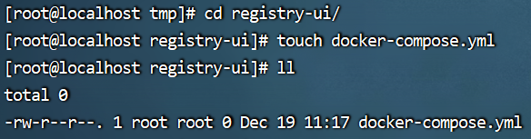

【4】将下面的内容拷贝到docker-compose.yml中

~~~shell
version: '3.0'
services:
  registry:
    image: registry
    volumes:
      - ./registry-data:/var/lib/registry
  ui:
    image: joxit/docker-registry-ui:static
    ports:
      - 8080:80
    environment:
      - REGISTRY_TITLE=传智教育私有仓库
      - REGISTRY_URL=http://registry:5000
    depends_on:
      - registry
~~~

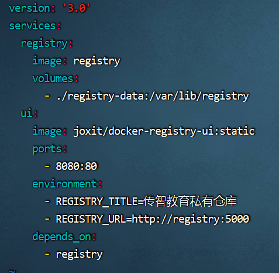

【5】使用docker-compose安装镜像

~~~shell
 docker-compose up -d
~~~

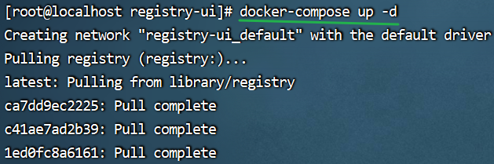


【6】查看日志

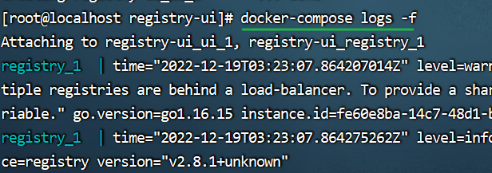

【7】浏览器访问

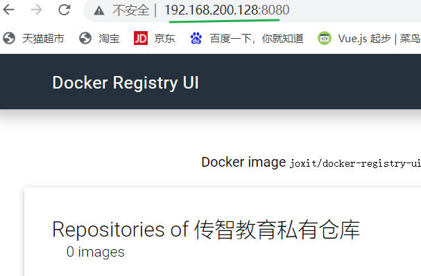
