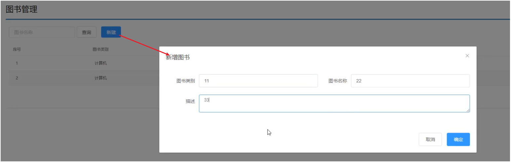
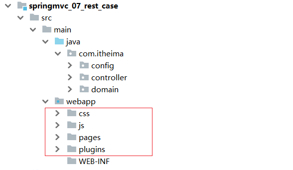
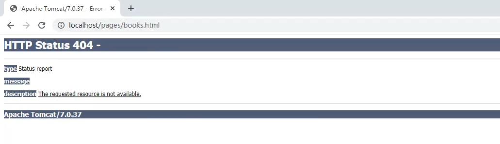

**今日内容**

> - 理解SpringMVC相关概念
> - 掌握SpringMvc请求参数处理
> - 掌握SpringMvc响应结果处理
> - 掌握RESTful风格及其使用

# 1、SpringMVC简介

## 1.1 背景

Servlet属于web层开发技术，技术特点：

1. 每个请求都需要创建一个Servlet进行处理
2. 创建Servlet存在重复操作
3. 代码灵活性低，开发效率低

是否有技术方案可以解决以上问题？


## 1.2 SpringMVC概述

- SpringMVC是一种基于Java实现MVC模型的轻量级Web框架
- 详细介绍见官网：https://docs.spring.io/spring-framework/docs/current/reference/html/web.html#mvc
- 优点
  - 使用简单、开发便捷(相比于Servlet)
  - 灵活性强

## 1.3 技术体系定位


- web程序通过浏览器访问前端页面，发送异步请求到后端服务器
- 后台服务器采用三层架构进行功能开发
  - 表现层负责接收请求和数据然后将数据转交给业务层
  - 业务层负责调用数据层完成数据库表的增删改查，并将结果返给表现层
  - 表现层将数据转换成json格式返回给前端
- 前端页面将数据进行解析最终展示给用户。

变现层采用SpringMVC框架，SpringMVC主要负责的内容有:

- controller如何接收请求和数据
- 如何将请求和数据转发给业务层
- 如何将响应数据转换成json发回到前端

# 2、快速入门

## 2.1 目的

​        能基于SpringMvc快速开发一个web应用

## 2.2 需求

​        搭建SpringMvc工程，定义UserController.save()方法处理/save请求，返回"{'module':'springmvc'}"。

## 2.3 步骤

1. 创建Maven项目，并导入对应的jar包
2. 创建控制器类
3. 创建配置类
4. 创建Tomcat的Servlet容器配置类

## 2.4、代码实操

1. 创建Maven项目，并导入对应的jar包

打开IDEA,创建一个新的maven项目


添加SpringMVC需要的依赖

```java
<?xml version="1.0" encoding="UTF-8"?>
<project xmlns="http://maven.apache.org/POM/4.0.0" xmlns:xsi="http://www.w3.org/2001/XMLSchema-instance"
  xsi:schemaLocation="http://maven.apache.org/POM/4.0.0 http://maven.apache.org/xsd/maven-4.0.0.xsd">
  <modelVersion>4.0.0</modelVersion>
  <groupId>com.itheima</groupId>
  <artifactId>springmvc_01_quickstart</artifactId>
  <version>1.0-SNAPSHOT</version>
  <packaging>war</packaging>
  <properties>
        <project.build.sourceEncoding>UTF-8</project.build.sourceEncoding>
        <maven.compiler.source>1.8</maven.compiler.source>
        <maven.compiler.target>1.8</maven.compiler.target>
   </properties>
   <!--1. 导入SpringMVC与servlet的坐标--> 
  <dependencies>
    <dependency>
      <groupId>javax.servlet</groupId>
      <artifactId>javax.servlet-api</artifactId>
      <version>3.1.0</version>
      <scope>provided</scope>
    </dependency>
    <dependency>
      <groupId>org.springframework</groupId>
      <artifactId>spring-webmvc</artifactId>
      <version>5.2.10.RELEASE</version>
    </dependency>
  </dependencies>

  <build>
    <plugins>
      <plugin>
        <groupId>org.apache.tomcat.maven</groupId>
        <artifactId>tomcat7-maven-plugin</artifactId>
        <version>2.1</version>
        <configuration>
          <port>8080</port>
          <path>/</path>
        </configuration>
      </plugin>
    </plugins>
  </build>
</project>

```

**说明:**servlet的坐标为什么需要添加`<scope>provided</scope>`?

- scope是maven中jar包依赖作用范围的描述，
- 如果不设置默认是`compile`在在编译、运行、测试时均有效
- 如果运行有效的话就会和tomcat中的servlet-api包发生冲突，导致启动报错
- provided代表的是该包只在编译和测试的时候用，运行的时候无效直接使用tomcat中的，就避免冲突

2. 创建控制器类

```java
//2.制作控制器类，等同于Servlet
//2.1必须是一个spring管理的bean
//2.2定义具体处理请求的方法
//2.3设置当前方法的访问路径
//2.4设置响应结果为String类型数据
@Controller
public class UserController {
    
    @RequestMapping("/save")
    @ResponseBody
    public String save(){
        System.out.println("user save ...");
        return "springmvc";
    }
}

```

3. 创建配置类

```java
//3.定义配置类加载Controller对应的bean
@Configuration
@ComponentScan("com.itheima.controller")
public class SpringMvcConfig {
}
```

4. 创建Tomcat的Servlet容器配置类

```java
//4.定义servlet容器的配置类
public class ServletContainersInitConfig extends AbstractDispatcherServletInitializer {
    //加载springMVC配置
    protected WebApplicationContext createServletApplicationContext() {
        //初始化WebApplicationContext对象
        AnnotationConfigWebApplicationContext ctx = new AnnotationConfigWebApplicationContext();
        //加载指定配置类
        ctx.register(SpringMvcConfig.class);
        return ctx;
    }

    //设置Tomcat接收的请求哪些归SpringMVC处理
    protected String[] getServletMappings() {
        return new String[]{"/"};
    }

    //设置spring相关配置
    protected WebApplicationContext createRootApplicationContext() {
        return null;
    }
}
```

5. 配置Tomcat环境


6. 启动运行项目


7. 浏览器访问

浏览器输入`http://localhost/save`进行访问，可以看得如下内容


至此SpringMVC的入门案例就已经完成。

## 2.5、测试工具

### 2.5.1 PostMan简介

代码编写完后，我们要想测试，只需要打开浏览器直接输入地址发送请求即可。但是我们如果我们发送的是`GET`请求可以直接使用浏览器，但是如果要发送的是`POST`请求呢?

如果要求发送的是post请求，我们就得准备页面在页面上准备form表单，测试起来比较麻烦。所以我们就需要借助一些第三方工具，如PostMan.

- PostMan是一款功能强大的网页调试与发送网页HTTP请求的Chrome插件。
- 作用：常用于进行接口测试
- 特征
  - 简单
  - 实用
  - 美观
  - 大方

### 2.5.2 PostMan安装

双击`资料\Postman-win64-8.3.1-Setup.exe`即可自动安装，

安装完成后，如果需要注册，可以按照提示进行注册，如果底部有跳过测试的链接也可以点击跳过注册


看到如下界面，就说明已经安装成功。


### 2.5.3 PostMan使用

- 创建WorkSpace工作空间


- 发送请求


- 保存当前请求


**注意:**第一次请求需要创建一个新的目录，后面就不需要创建新目录，直接保存到已经创建好的目录即可。

## 2.6 知识点总结

1. @Controller

| 名称 | @Controller                   |
| ---- | ----------------------------- |
| 类型 | 类注解                        |
| 位置 | SpringMVC控制器类定义上方     |
| 作用 | 设定SpringMVC的核心控制器bean |

2. @RequestMapping

| 名称     | @RequestMapping                 |
| -------- | ------------------------------- |
| 类型     | 类注解或方法注解                |
| 位置     | SpringMVC控制器类或方法定义上方 |
| 作用     | 设置当前控制器方法请求访问路径  |
| 相关属性 | value(默认)，请求访问路径       |

3. @ResponseBody

| 名称 | @ResponseBody                                    |
| ---- | ------------------------------------------------ |
| 类型 | 类注解或方法注解                                 |
| 位置 | SpringMVC控制器类或方法定义上方                  |
| 作用 | 设置当前控制器方法响应内容为当前返回值，无需解析 |

# 3、请求与参数处理

### 3.1、请求路径

#### 3.1.1 环境准备

- 入门案例基础上编写BookController和UserController

  ```java
  @Controller
  public class UserController {
  
      @RequestMapping("/save")
      @ResponseBody
      public String save(){
          System.out.println("user save ...");
          return "{'module':'user save'}";
      }
      
      @RequestMapping("/delete")
      @ResponseBody
      public String save(){
          System.out.println("user delete ...");
          return "{'module':'user delete'}";
      }
  }
  
  @Controller
  public class BookController {
  
      @RequestMapping("/save")
      @ResponseBody
      public String save(){
          System.out.println("book save ...");
          return "{'module':'book save'}";
      }
  }
  ```

最终创建好的项目结构如下:


把环境准备好后，启动Tomcat服务器，后台会报错:


从错误信息可以看出:

- UserController有一个save方法，访问路径为`http://localhost/save`
- BookController也有一个save方法，访问路径为`http://localhost/save`
- 当访问`http://localhost/saved`的时候，到底是访问UserController还是BookController?

#### 3.1.2 问题分析

团队多人开发，每人设置不同的请求路径，冲突问题该如何解决?

解决思路:为不同模块设置模块名作为请求路径前置

对于Book模块的save,将其访问路径设置`http://localhost/book/save`

对于User模块的save,将其访问路径设置`http://localhost/user/save`

这样在同一个模块中出现命名冲突的情况就比较少了。

#### 3.1.3 解决方式

- 解决方案

```java
@Controller
public class UserController {

    @RequestMapping("/user/save")
    @ResponseBody
    public String save(){
        System.out.println("user save ...");
        return "{'module':'user save'}";
    }
    
    @RequestMapping("/user/delete")
    @ResponseBody
    public String save(){
        System.out.println("user delete ...");
        return "{'module':'user delete'}";
    }
}

@Controller
public class BookController {

    @RequestMapping("/book/save")
    @ResponseBody
    public String save(){
        System.out.println("book save ...");
        return "{'module':'book save'}";
    }
}
```

问题是解决了，但是每个方法前面都需要进行修改，写起来比较麻烦而且还有很多重复代码，如果/user后期发生变化，所有的方法都需要改，耦合度太高。

- 优化方式

```java
@Controller
@RequestMapping("/user")
public class UserController {

    @RequestMapping("/save")
    @ResponseBody
    public String save(){
        System.out.println("user save ...");
        return "{'module':'user save'}";
    }
    
    @RequestMapping("/delete")
    @ResponseBody
    public String delete(){
        System.out.println("user delete ...");
        return "{'module':'user delete'}";
    }
}

@Controller
@RequestMapping("/book")
public class BookController {

    @RequestMapping("/save")
    @ResponseBody
    public String save(){
        System.out.println("book save ...");
        return "{'module':'book save'}";
    }
}
```

**注意:**

- 当类上和方法上都添加了`@RequestMapping`注解，前端发送请求的时候，要和两个注解的value值相加匹配才能访问到。
- @RequestMapping注解value属性前面加不加`/`都可以

### 3.2、请求方式

关于请求参数的传递与接收是和请求方式有关系的，目前比较常见的两种请求方式为：

- GET
- POST

针对于不同的请求前端如何发送，后端如何接收?

#### 3.2.1 环境准备

- 创建处理器方法

```java
@Controller
public class UserController {
@RequestMapping("/user/save")
@ResponseBody
public String save(){
    System.out.println("user save ...");
    return "{'module':'user save'}";
 }
}
```
- 使用PostMan进行GET调用与POST调用


GET请求与POST请求都能正常访问

#### 3.2.2 技术分析

@RequestMapping没有设置请求方式，默认支持以下八种请求类型：


指定请求方式后将不再支持其他类型请求类型：


### 3.3、参数

#### 3.3.1、基本数据类型

1. 发送方式

   - URL地址传参

     

   - 表单传参

     

2. 接收方式

   - 形参与参数名相同

     此时可以直接获取请求参数：

     

   - 形参与参数名不同

     需要设置 @RequestParam 绑定请求参数与方法形参：

     

- 知识点：@RequestParam

| 名称     | @RequestParam                                          |
| -------- | ------------------------------------------------------ |
| 类型     | 形参注解                                               |
| 位置     | SpringMVC控制器方法形参定义前面                        |
| 作用     | 绑定请求参数与处理器方法形参间的关系                   |
| 相关参数 | required：是否为必传参数 <br/>defaultValue：参数默认值 |

#### 3.3.2、POJO

简单数据类型一般处理的是参数个数比较少的请求，如果参数比较多，那么后台接收参数的时候就比较复杂，这个时候我们可以考虑使用POJO数据类型。

- POJO参数：请求参数名与形参对象属性名相同，定义POJO类型形参即可接收参数

1. 新增POJO类

```java
public class User {
    private String name;
    private Integer age;
   //setter...getter...略
}
```

2. URL地址请求或表单请求


3. 后台接收参数

```java
//POJO参数：请求参数与形参对象中的属性对应即可完成参数传递
@RequestMapping("/pojoParam")
@ResponseBody
public String pojoParam(User user){
    System.out.println("pojo参数传递 user ==> "+user);
    return "{'module':'pojo param'}";
}
```

**注意:**

- POJO参数接收，前端GET和POST发送请求数据的方式不变。
- 请求参数key的名称要和POJO中属性的名称一致，否则无法封装。

#### 3.3.3、嵌套POJO

##### 1、新增POJO类

```java
public class User {
    private String name;
    private Integer age;
    private Address address;
    //setter...getter...略
}

public class Address {
    private String province;
    private String city;
    //setter...getter...略
}
```

##### 2、URL地址请求或表单请求

​        请求参数名与形参对象属性名相同，按照对象层次结构关系即可接收嵌套POJO属性参数

发送请求和参数:


##### 3、后台接收参数

```java
//POJO参数：请求参数与形参对象中的属性对应即可完成参数传递
@RequestMapping("/pojoParam")
@ResponseBody
public String pojoParam(User user){
    System.out.println("pojo参数传递 user ==> "+user);
    return "{'module':'pojo param'}";
}
```

**注意:**

==请求参数key的名称要和POJO中属性的名称一致，否则无法封装==

#### 3.3.4、数组

​       请求参数名与形参对象属性名相同且请求参数为多个，定义数组类型即可接收参数

##### 1、URL地址请求或表单请求


##### 2、后台接收参数

```java
  //数组参数：同名请求参数可以直接映射到对应名称的形参数组对象中
    @RequestMapping("/arrayParam")
    @ResponseBody
    public String arrayParam(String[] likes){
        System.out.println("数组参数传递 likes ==> "+ Arrays.toString(likes));
        return "{'module':'array param'}";
    }
```

#### 3.3.5、集合（List、Map）

##### 1、List

数组能接收多个值，那么集合是否也可以实现这个功能呢?

1. 发送请求和参数:
2. [1630484283773](assets/1630484283773.png)


2. 错误接收方式

```java
//集合参数：同名请求参数可以使用@RequestParam注解映射到对应名称的集合对象中作为数据
@RequestMapping("/listParam")
@ResponseBody
public String listParam(List<String> likes){
    System.out.println("集合参数传递 likes ==> "+ likes);
    return "{'module':'list param'}";
}
```

- 运行报错


- 错误原因：

  ​        SpringMVC将List看做是一个POJO对象来处理，将其创建一个对象并准备把前端的数据封装到对象中，但是List是一个接口无法创建对象，所以报错。

3. 正确接收方式

使用`@RequestParam`注解

```java
//集合参数：同名请求参数可以使用@RequestParam注解映射到对应名称的集合对象中作为数据
@RequestMapping("/listParam")
@ResponseBody
public String listParam(@RequestParam List<String> likes){
    System.out.println("集合参数传递 likes ==> "+ likes);
    return "{'module':'list param'}";
}
```

- 集合保存普通参数：请求参数名与形参集合对象名相同且请求参数为多个，@RequestParam绑定参数关系
- 对于简单数据类型使用数组会比集合更简单些。

##### 2.Map

1. 发送请求和参数:

请求参数需要设置map的key值


2. 接收方式

同List接收方式，需要使用`@RequestParam`注解

```java
@RequestMapping("/mapParam")
@ResponseBody
public String mapParam(@RequestParam Map<String,String> maps) {
    System.out.println(maps);
    return "{'module':'mapParam'}";
}
```

#### 3.5.6、Date日期类型

##### 1、URL地址请求或表单请求


##### 2、后台接收参数

```java
@RequestMapping("/dateParam")
@ResponseBody
public String dateParam(Date date,@DateTimeFormat(pattern = "yyyy-MM-dd") Date date2,@DateTimeFormat(pattern = "yyyy-MM-dd HH:mm:ss") Date date3){
    System.out.println("date:"+date);
    System.out.println("date2:"+date2);
    System.out.println("date3:"+date3);
    return "{'module':'dateParam'}";
}
```

**注意:**

- SpringMvc默认时间格式为 yyyy/MM/dd
- 其他时间格式需要使用@DateTimeFormat转换

- 知识点1：@DateTimeFormat

| 名称     | @DateTimeFormat                 |
| -------- | ------------------------------- |
| 类型     | ==形参注解==                    |
| 位置     | SpringMVC控制器方法形参前面     |
| 作用     | 设定日期时间型数据格式          |
| 相关属性 | pattern：指定日期时间格式字符串 |

#### 3.5.7、File文件类型

##### 1、前期准备

1. 添加fileupload依赖

```xml
<!--添加fileupload依赖-->
<dependency>
    <groupId>commons-fileupload</groupId>
    <artifactId>commons-fileupload</artifactId>
    <version>1.3.3</version>
</dependency>
```

2. 配置解析器 

  SpringMvcConfig 中配置 multipartResolver解析器,这里Bean的名称是固定的，否则无法生效

```java
@Bean("multipartResolver")
public CommonsMultipartResolver multipartResolver (){
    CommonsMultipartResolver resolver = new CommonsMultipartResolver();
    resolver.setDefaultEncoding("UTF-8");
    resolver.setMaxUploadSize(1024*1024);
    return resolver;
}
```

##### 2、POST请求方式

post请求选择 form-data 方式传递文件类型参数


##### 3、后台接收参数

使用 MultipartFile 类型接收文件参数

```java
@RequestMapping("/fileParam")
@ResponseBody
public String fileParam(MultipartFile file){
    if(!file.isEmpty()){
        try {
            file.transferTo(new File("D://test.txt"));
        } catch (IOException e) {
            e.printStackTrace();
        }
    }
    return "{'module':'file'}";
}
```

#### 3.5.7、JSON类型

​      现在比较流行的开发方式为异步调用。前后台以异步方式进行交换，传输的数据使用的是JSON,所以前端如果发送的是JSON数据，后端该如何接收?

##### 1、前期准备

- SpringMVC默认使用的是jackson来处理json的转换，所以需要在pom.xml添加jackson依赖

```xml
<dependency>
    <groupId>com.fasterxml.jackson.core</groupId>
    <artifactId>jackson-databind</artifactId>
    <version>2.9.0</version>
</dependency>
```

- 开启SpringMVC注解支持

在SpringMVC的配置类中开启SpringMVC的注解支持，这里面就包含了将JSON转换成对象的功能。

```java
@Configuration
@ComponentScan("com.itheima.controller")
//开启json数据类型自动转换
@EnableWebMvc
public class SpringMvcConfig {
}
```

##### 2、json请求与接收

**注意：** 接收json数据，需要在形参变量前加 @RequestBody注解

1.  JSON对象数据

- 前端请求


- 后端接收

```java
@RequestMapping("/pojoParamForJson")
@ResponseBody
public String pojoParamForJson(@RequestBody User user) {
    System.out.println(user);
    return "{'module':'pojoParamForJson'}";
}
```

2.  JSON普通数组

- 前端请求


- 后端接收

```java
@RequestMapping("/arrayParamForJson")
@ResponseBody
public String arrayParamForJson(@RequestBody String[] likes){
    System.out.println(Arrays.toString(likes));
    return "{'module':'arrayParamForJson'}";
}
```

3.  JSON对象数据

- 前端请求


- 后台接收参数

```java
@RequestMapping("/arrayPojoParamForJson")
@ResponseBody
public String arrayPojoParamForJson(@RequestBody List<User> list){
    System.out.println(list);
    return "{'module':'arrayPojoParamForJson'}";
}
```

#### 3.5.8、中文乱码处理

##### 1、GET请求

- URL地址传参中文


- 响应结果中文乱码：


- 解决方式

修改pom.xml来解决GET请求中文乱码问题

```xml
<build>
    <plugins>
      <plugin>
        <groupId>org.apache.tomcat.maven</groupId>
        <artifactId>tomcat7-maven-plugin</artifactId>
        <version>2.1</version>
        <configuration>
          <port>80</port><!--tomcat端口号-->
          <path>/</path> <!--虚拟目录-->
          <uriEncoding>UTF-8</uriEncoding><!--访问路径编解码字符集-->
        </configuration>
      </plugin>
    </plugins>
  </build>
```

##### 2、POST请求

- POST表单传参


- 中文乱码


- 解决方式

  配置过滤器

```java
public class ServletContainersInitConfig extends AbstractAnnotationConfigDispatcherServletInitializer {
    protected Class<?>[] getRootConfigClasses() {
        return new Class[0];
    }

    protected Class<?>[] getServletConfigClasses() {
        return new Class[]{SpringMvcConfig.class};
    }

    protected String[] getServletMappings() {
        return new String[]{"/"};
    }

    //乱码处理
    @Override
    protected Filter[] getServletFilters() {
        CharacterEncodingFilter filter = new CharacterEncodingFilter();
        filter.setEncoding("UTF-8");
        return new Filter[]{filter};
    }
}
```

CharacterEncodingFilter是在spring-web包中，所以用之前需要导入对应的jar包。

# 4、响应结果处理


### 4.1、前期准备

- 编写模型类User

  ```java
  public class User {
      private String name;
      private int age;
      //getter...setter...toString省略
  }
  ```

- webapp下创建page.jsp

  ```jsp
  <html>
  <body>
  <h2>Hello Spring MVC!</h2>
  </body>
  </html>
  ```

### 4.2、响应页面


##### 4.2.1、后端接口设置

```java
    @RequestMapping("/toJumpPage")
    //注意
    //1.此处不能添加@ResponseBody,如果加了该注入，会直接将page.jsp当字符串返回前端
    //2.方法需要返回String
    public String toJumpPage(){
        System.out.println("跳转页面");
        return "page.jsp";
    }
```

##### 4.2.2、前端请求


### 4.3、响应字符串

1、后端接口设置

```java
@RequestMapping("/toText")
@ResponseBody
public String toText(){
    return "hello,springmvc";
}
```

2、前端请求


### 4.4、响应JSON结果

​       返回值为实体类对象，设置返回值为实体类类型，即可实现返回对应对象的json数据，需要依赖@ResponseBody注解和@EnableWebMvc注解

##### 1、后端接口设置

```java
@RequestMapping("/toJson")
@ResponseBody
public User toJson(){
    User user = new User();
    user.setName("itheima");
    user.setAge(15);
    return user;
}
```

##### 2、前端请求


### 4.5、类型转换器

##### 4.5.1、问题思考

- 前端传递字符串，后端使用日期Date接收
- 前端传递JSON数据，后端使用对象接收
- 后台需要的数据类型有很多种
- 前端传递字符串，后端使用Integer接收
- 在数据的传递过程中存在很多类型的转换

问:谁来做这个类型转换?

答:SpringMVC

问：SpringMVC是如何实现类型转换的?

答:Converter接口、HttpMessageConverter接口

##### 4.5.2、Converter

- 用于实现简单数据型的类型转换逻辑的SPI：

```java
/**
*	S: the source type
*	T: the target type
*/
public interface Converter<S, T> {
    @Nullable
    //该方法就是将从页面上接收的数据(S)转换成我们想要的数据类型(T)返回
    T convert(S source);
}
```

- 详细信息可查看官网介绍：

  [核心技术 (spring.io)](https://docs.spring.io/spring-framework/docs/current/reference/html/core.html#core-convert-Converter-API)

  

  

##### 4.5.3、HttpMessageConverter

- 用于转换HTTP请求和响应的策略接口：

  使用该接口实现了JSON、XML等数据类型的转换

  

- 详细信息可查看官网介绍：

  [Web on Servlet Stack (spring.io)](https://docs.spring.io/spring-framework/docs/current/reference/html/web.html#mvc-config-message-converters)

  

##### 4.5.4、注意事项

简单数据类型可以自动实现类型转换，JSON等类型需要开启@EnableWebMvc注解，根据类型匹配对应的类型转换器。

# 5、RESTful风格

## 5.1、RESTful风格简介

- REST（Representational State Transfer），表现形式状态转换,它是一种软件架构风格

  当我们想表示一个网络资源的时候，可以使用两种方式:

  - 传统风格资源描述形式
    - `http://localhost/user/getById?id=1` 查询id为1的用户信息
    - `http://localhost/user/saveUser` 保存用户信息
  - REST风格描述形式
    - `http://localhost/user/1` 
    - `http://localhost/user`

传统方式一般是一个请求url对应一种操作，这样做不仅麻烦，也不安全，因为会程序的人读取了你的请求url地址，就大概知道该url实现的是一个什么样的操作。

- 按照REST风格访问资源时使用行为动作区分对资源进行了何种操作
  - `http://localhost/users`	查询全部用户信息 GET（查询）
  - `http://localhost/users/1`  查询指定用户信息 GET（查询）
  - `http://localhost/users`    添加用户信息    POST（新增/保存）
  - `http://localhost/users`    修改用户信息    PUT（修改/更新）
  - `http://localhost/users/1`  删除用户信息    DELETE（删除）

请求的方式比较多，但是比较常用的就4种，分别是`GET`,`POST`,`PUT`,`DELETE`。

按照不同的请求方式代表不同的操作类型。

- 发送GET请求是用来做查询
- 发送POST请求是用来做新增
- 发送PUT请求是用来做修改
- 发送DELETE请求是用来做删除

## 5.2、快速体验

#### 5.2.1 环境准备

- 创建一个Web的Maven项目

- pom.xml添加Spring依赖

  ```xml
  <?xml version="1.0" encoding="UTF-8"?>
  
  <project xmlns="http://maven.apache.org/POM/4.0.0" xmlns:xsi="http://www.w3.org/2001/XMLSchema-instance"
    xsi:schemaLocation="http://maven.apache.org/POM/4.0.0 http://maven.apache.org/xsd/maven-4.0.0.xsd">
    <modelVersion>4.0.0</modelVersion>
  
    <groupId>com.itheima</groupId>
    <artifactId>springmvc_06_rest</artifactId>
    <version>1.0-SNAPSHOT</version>
    <packaging>war</packaging>
  
    <dependencies>
      <dependency>
        <groupId>javax.servlet</groupId>
        <artifactId>javax.servlet-api</artifactId>
        <version>3.1.0</version>
        <scope>provided</scope>
      </dependency>
      <dependency>
        <groupId>org.springframework</groupId>
        <artifactId>spring-webmvc</artifactId>
        <version>5.2.10.RELEASE</version>
      </dependency>
      <dependency>
        <groupId>com.fasterxml.jackson.core</groupId>
        <artifactId>jackson-databind</artifactId>
        <version>2.9.0</version>
      </dependency>
    </dependencies>
  
    <build>
      <plugins>
        <plugin>
          <groupId>org.apache.tomcat.maven</groupId>
          <artifactId>tomcat7-maven-plugin</artifactId>
          <version>2.1</version>
          <configuration>
            <port>80</port>
            <path>/</path>
          </configuration>
        </plugin>
      </plugins>
    </build>
  </project>
  
  ```

- 创建对应的配置类

  ```java
  public class ServletContainersInitConfig extends AbstractAnnotationConfigDispatcherServletInitializer {
      protected Class<?>[] getRootConfigClasses() {
          return new Class[0];
      }
  
      protected Class<?>[] getServletConfigClasses() {
          return new Class[]{SpringMvcConfig.class};
      }
  
      protected String[] getServletMappings() {
          return new String[]{"/"};
      }
  
      //乱码处理
      @Override
      protected Filter[] getServletFilters() {
          CharacterEncodingFilter filter = new CharacterEncodingFilter();
          filter.setEncoding("UTF-8");
          return new Filter[]{filter};
      }
  }
  
  @Configuration
  @ComponentScan("com.itheima.controller")
  //开启json数据类型自动转换
  @EnableWebMvc
  public class SpringMvcConfig {
  }
  
  
  ```

- 编写模型类User和Book

  ```java
  public class User {
      private String name;
      private int age;
      //getter...setter...toString省略
  }
  
  public class Book {
      private String name;
      private double price;
       //getter...setter...toString省略
  }
  ```

- 编写UserController和BookController

  ```java
  @Controller
  public class UserController {
  	@RequestMapping("/save")
      @ResponseBody
      public String save(@RequestBody User user) {
          System.out.println("user save..."+user);
          return "{'module':'user save'}";
      }
  
      @RequestMapping("/delete")
      @ResponseBody
      public String delete(Integer id) {
          System.out.println("user delete..." + id);
          return "{'module':'user delete'}";
      }
  
      @RequestMapping("/update")
      @ResponseBody
      public String update(@RequestBody User user) {
          System.out.println("user update..." + user);
          return "{'module':'user update'}";
      }
  
      @RequestMapping("/getById")
      @ResponseBody
      public String getById(Integer id) {
          System.out.println("user getById..." + id);
          return "{'module':'user getById'}";
      }
  
      @RequestMapping("/findAll")
      @ResponseBody
      public String getAll() {
          System.out.println("user getAll...");
          return "{'module':'user getAll'}";
      }
  }
  
  
  @Controller
  public class BookController {
      
  	@RequestMapping(value = "/books",method = RequestMethod.POST)
      @ResponseBody
      public String save(@RequestBody Book book){
          System.out.println("book save..." + book);
          return "{'module':'book save'}";
      }
  
      @RequestMapping(value = "/books/{id}",method = RequestMethod.DELETE)
      @ResponseBody
      public String delete(@PathVariable Integer id){
          System.out.println("book delete..." + id);
          return "{'module':'book delete'}";
      }
  
      @RequestMapping(value = "/books",method = RequestMethod.PUT)
      @ResponseBody
      public String update(@RequestBody Book book){
          System.out.println("book update..." + book);
          return "{'module':'book update'}";
      }
  
      @RequestMapping(value = "/books/{id}",method = RequestMethod.GET)
      @ResponseBody
      public String getById(@PathVariable Integer id){
          System.out.println("book getById..." + id);
          return "{'module':'book getById'}";
      }
  
      @RequestMapping(value = "/books",method = RequestMethod.GET)
      @ResponseBody
      public String getAll(){
          System.out.println("book getAll...");
          return "{'module':'book getAll'}";
      }
      
  }
  ```

最终创建好的项目结构如下:


#### 5.2.2 思路分析

> 需求:将之前的增删改查替换成RESTful的开发方式。
>
> 1.之前不同的请求有不同的路径,现在要将其修改为统一的请求路径
>
> 修改前: 新增: /save ,修改: /update,删除 /delete...
>
> 修改后: 增删改查: /users
>
> 2.根据GET查询、POST新增、PUT修改、DELETE删除对方法的请求方式进行限定
>
> 3.发送请求的过程中如何设置请求参数?

#### 5.2.3 修改RESTful风格

##### 1、新增

```java
@Controller
public class UserController {
	//设置当前请求方法为POST，表示REST风格中的添加操作
    @RequestMapping(value = "/users",method = RequestMethod.POST)
    @ResponseBody
    public String save() {
        System.out.println("user save...");
        return "{'module':'user save'}";
    }
}
```

- 将请求路径更改为`/users`

  - 访问该方法使用 POST: `http://localhost/users`

- 使用method属性限定该方法的访问方式为`POST`

  - 如果发送的不是POST请求，比如发送GET请求，则会报错

    

##### 2、删除

```java
@Controller
public class UserController {
    //设置当前请求方法为DELETE，表示REST风格中的删除操作
	@RequestMapping(value = "/users",method = RequestMethod.DELETE)
    @ResponseBody
    public String delete(Integer id) {
        System.out.println("user delete..." + id);
        return "{'module':'user delete'}";
    }
}
```

- 将请求路径更改为`/users`
  - 访问该方法使用 DELETE: `http://localhost/users`

访问成功，但是删除方法没有携带所要删除数据的id,所以针对RESTful的开发，如何携带数据参数?

答：传递路径参数

前端发送请求的时候使用:`http://localhost/users/1`,路径中的`1`就是我们想要传递的参数。

后端获取参数，需要做如下修改:

- 修改@RequestMapping的value属性，将其中修改为`/users/{id}`，目的是和路径匹配
- 在方法的形参前添加@PathVariable注解

```java
@Controller
public class UserController {
    //设置当前请求方法为DELETE，表示REST风格中的删除操作
	@RequestMapping(value = "/users/{id}",method = RequestMethod.DELETE)
    @ResponseBody
    public String delete(@PathVariable Integer id) {
        System.out.println("user delete..." + id);
        return "{'module':'user delete'}";
    }
}
```

**思考如下两个问题:**

(1)如果方法形参的名称和路径`{}`中的值不一致，该怎么办?


(2)如果有多个参数需要传递该如何编写?

前端发送请求的时候使用:`http://localhost/users/1/tom`,路径中的`1`和`tom`就是我们想要传递的两个参数。

后端获取参数，需要做如下修改:

```java
@Controller
public class UserController {
    //设置当前请求方法为DELETE，表示REST风格中的删除操作
	@RequestMapping(value = "/users/{id}/{name}",method = RequestMethod.DELETE)
    @ResponseBody
    public String delete(@PathVariable Integer id,@PathVariable String name) {
        System.out.println("user delete..." + id+","+name);
        return "{'module':'user delete'}";
    }
}
```

##### 3、修改

```java
@Controller
public class UserController {
    //设置当前请求方法为PUT，表示REST风格中的修改操作
    @RequestMapping(value = "/users",method = RequestMethod.PUT)
    @ResponseBody
    public String update(@RequestBody User user) {
        System.out.println("user update..." + user);
        return "{'module':'user update'}";
    }
}
```

- 将请求路径更改为`/users`

  - 访问该方法使用 PUT: `http://localhost/users`

- 访问并携带参数:

  

##### 4、根据ID查询

```java
@Controller
public class UserController {
    //设置当前请求方法为GET，表示REST风格中的查询操作
    @RequestMapping(value = "/users/{id}" ,method = RequestMethod.GET)
    @ResponseBody
    public String getById(@PathVariable Integer id){
        System.out.println("user getById..."+id);
        return "{'module':'user getById'}";
    }
}
```

将请求路径更改为`/users`

- 访问该方法使用 GET: `http://localhost/users/666`

##### 5、查询所有

```java
@Controller
public class UserController {
    //设置当前请求方法为GET，表示REST风格中的查询操作
    @RequestMapping(value = "/users" ,method = RequestMethod.GET)
    @ResponseBody
    public String getAll() {
        System.out.println("user getAll...");
        return "{'module':'user getAll'}";
    }
}
```

将请求路径更改为`/users`

- 访问该方法使用 GET: `http://localhost/users`

**小结**

RESTful入门案例，我们需要学习的内容如下:

(1)设定Http请求动作(动词)

```java
@RequestMapping(value="",method = RequestMethod.==POST|GET|PUT|DELETE)
```

(2)设定请求参数(路径变量)

```java
@RequestMapping(value="/users/{id}",method = RequestMethod.DELETE)

@ReponseBody

public String delete(@PathVariable Integer id){

}
```


##### 5.2.4 知识点总结

1. @PathVariable介绍

| 名称 | @PathVariable                                                |
| ---- | ------------------------------------------------------------ |
| 类型 | ==形参注解==                                                 |
| 位置 | SpringMVC控制器方法形参定义前面                              |
| 作用 | 绑定路径参数与处理器方法形参间的关系，要求路径参数名与形参名一一对应 |

2. 形参注解对比

   关于接收参数，我们学过三个注解`@RequestBody`、`@RequestParam`、`@PathVariable`,这三个注解之间的区别和应用分别是什么?

- 区别
  | **注解**          | **类型** | **作用**                      | **备注**                   |
  | ----------------- | -------- | ----------------------------- | -------------------------- |
  | **@RequestParam** | 形参注解 | 接收：1.url地址参数2.表单参数 |                            |
  | **@RequestBody**  | 形参注解 | 接收json参数                  | 一个处理器方法只能使用一次 |
  | **@PathVariable** | 形参注解 | 接收路径参数                  |                            |
  
- 应用
  - 后期开发中，发送请求参数超过1个时，以json格式为主，@RequestBody应用较广
  - 如果发送非json格式数据，选用@RequestParam接收请求参数
  - 采用RESTful进行开发，当参数数量较少时，例如1个，可以采用@PathVariable接收请求路径变量，通常用于传递id值

## 5.3、简化注解

做完了RESTful的开发，你会发现好麻烦，麻烦在哪?


问题1：每个方法的@RequestMapping注解中都定义了访问路径/books，重复性太高。

问题2：每个方法的@RequestMapping注解中都要使用method属性定义请求方式，重复性太高。

问题3：每个方法响应json都需要加上@ResponseBody注解，重复性太高。

对于上面所提的这三个问题，具体该如何解决?

```java
@RestController //@Controller + ReponseBody
@RequestMapping("/books")
public class BookController {
    
	//@RequestMapping(method = RequestMethod.POST)
    @PostMapping
    public String save(@RequestBody Book book){
        System.out.println("book save..." + book);
        return "{'module':'book save'}";
    }

    //@RequestMapping(value = "/{id}",method = RequestMethod.DELETE)
    @DeleteMapping("/{id}")
    public String delete(@PathVariable Integer id){
        System.out.println("book delete..." + id);
        return "{'module':'book delete'}";
    }

    //@RequestMapping(method = RequestMethod.PUT)
    @PutMapping
    public String update(@RequestBody Book book){
        System.out.println("book update..." + book);
        return "{'module':'book update'}";
    }

    //@RequestMapping(value = "/{id}",method = RequestMethod.GET)
    @GetMapping("/{id}")
    public String getById(@PathVariable Integer id){
        System.out.println("book getById..." + id);
        return "{'module':'book getById'}";
    }

    //@RequestMapping(method = RequestMethod.GET)
    @GetMapping
    public String getAll(){
        System.out.println("book getAll...");
        return "{'module':'book getAll'}";
    }
    
}
```

对于刚才的问题，我们都有对应的解决方案：

问题1：每个方法的@RequestMapping注解中都定义了访问路径/books，重复性太高。

```
将@RequestMapping提到类上面，用来定义所有方法共同的访问路径。
```

问题2：每个方法的@RequestMapping注解中都要使用method属性定义请求方式，重复性太高。

```
使用@GetMapping  @PostMapping  @PutMapping  @DeleteMapping代替
```

问题3：每个方法响应json都需要加上@ResponseBody注解，重复性太高。

```
1.将ResponseBody提到类上面，让所有的方法都有@ResponseBody的功能
2.使用@RestController注解替换@Controller与@ResponseBody注解，简化书写
```

- @RestController

| 名称 | @RestController                                              |
| ---- | ------------------------------------------------------------ |
| 类型 | ==类注解==                                                   |
| 位置 | 基于SpringMVC的RESTful开发控制器类定义上方                   |
| 作用 | 设置当前控制器类为RESTful风格，<br/>等同于@Controller与@ResponseBody两个注解组合功能 |

- @GetMapping @PostMapping @PutMapping @DeleteMapping

| 名称     | @GetMapping @PostMapping @PutMapping @DeleteMapping          |
| -------- | ------------------------------------------------------------ |
| 类型     | ==方法注解==                                                 |
| 位置     | 基于SpringMVC的RESTful开发控制器方法定义上方                 |
| 作用     | 设置当前控制器方法请求访问路径与请求动作，每种对应一个请求动作，<br/>例如@GetMapping对应GET请求 |
| 相关属性 | value（默认）：请求访问路径                                  |


## 5.4、实战案例

#### 5.4.1 需求分析

需求一:图片列表查询，从后台返回数据，将数据展示在页面上


需求二:新增图片，将新增图书的数据传递到后台，并在控制台打印



**说明:**此次案例的重点是在SpringMVC中如何使用RESTful实现前后台交互，所以本案例并没有和数据库进行交互，所有数据使用`假`数据来完成开发。

步骤分析:

> 1.搭建项目导入jar包
>
> 2.编写Controller类，提供两个方法，一个用来做列表查询，一个用来做新增
>
> 3.在方法上使用RESTful进行路径设置
>
> 4.完成请求、参数的接收和结果的响应
>
> 5.使用PostMan进行测试
>
> 6.将前端页面拷贝到项目中
>
> 7.页面发送ajax请求
>
> 8.完成页面数据的展示

#### 5.4.2 环境准备

- 创建一个Web的Maven项目

- pom.xml添加Spring依赖

  ```xml
  <?xml version="1.0" encoding="UTF-8"?>
  
  <project xmlns="http://maven.apache.org/POM/4.0.0" xmlns:xsi="http://www.w3.org/2001/XMLSchema-instance"
    xsi:schemaLocation="http://maven.apache.org/POM/4.0.0 http://maven.apache.org/xsd/maven-4.0.0.xsd">
    <modelVersion>4.0.0</modelVersion>
  
    <groupId>com.itheima</groupId>
    <artifactId>springmvc_07_rest_case</artifactId>
    <version>1.0-SNAPSHOT</version>
    <packaging>war</packaging>
  
    <dependencies>
      <dependency>
        <groupId>javax.servlet</groupId>
        <artifactId>javax.servlet-api</artifactId>
        <version>3.1.0</version>
        <scope>provided</scope>
      </dependency>
      <dependency>
        <groupId>org.springframework</groupId>
        <artifactId>spring-webmvc</artifactId>
        <version>5.2.10.RELEASE</version>
      </dependency>
      <dependency>
        <groupId>com.fasterxml.jackson.core</groupId>
        <artifactId>jackson-databind</artifactId>
        <version>2.9.0</version>
      </dependency>
    </dependencies>
  
    <build>
      <plugins>
        <plugin>
          <groupId>org.apache.tomcat.maven</groupId>
          <artifactId>tomcat7-maven-plugin</artifactId>
          <version>2.1</version>
          <configuration>
            <port>80</port>
            <path>/</path>
          </configuration>
        </plugin>
      </plugins>
    </build>
  </project>
  
  ```

- 创建对应的配置类

  ```java
  public class ServletContainersInitConfig extends AbstractAnnotationConfigDispatcherServletInitializer {
      protected Class<?>[] getRootConfigClasses() {
          return new Class[0];
      }
  
      protected Class<?>[] getServletConfigClasses() {
          return new Class[]{SpringMvcConfig.class};
      }
  
      protected String[] getServletMappings() {
          return new String[]{"/"};
      }
  
      //乱码处理
      @Override
      protected Filter[] getServletFilters() {
          CharacterEncodingFilter filter = new CharacterEncodingFilter();
          filter.setEncoding("UTF-8");
          return new Filter[]{filter};
      }
  }
  
  @Configuration
  @ComponentScan("com.itheima.controller")
  //开启json数据类型自动转换
  @EnableWebMvc
  public class SpringMvcConfig {
  }
  
  
  ```

- 编写模型类Book

  ```java
  public class Book {
      private Integer id;
      private String type;
      private String name;
      private String description;
      //setter...getter...toString略
  }
  ```

- 编写BookController

  ```java
  @Controller
  public class BookController {
  
      
  }
  ```

最终创建好的项目结构如下:


#### 5.4.2 后台接口开发

1. 编写Controller类并使用RESTful进行配置

```java
@RestController
@RequestMapping("/books")
public class BookController {

    @PostMapping
    public String save(@RequestBody Book book){
        System.out.println("book save ==> "+ book);
        return "{'module':'book save success'}";
    }

 	@GetMapping
    public List<Book> getAll(){
        System.out.println("book getAll is running ...");
        List<Book> bookList = new ArrayList<Book>();

        Book book1 = new Book();
        book1.setType("计算机");
        book1.setName("SpringMVC入门教程");
        book1.setDescription("小试牛刀");
        bookList.add(book1);

        Book book2 = new Book();
        book2.setType("计算机");
        book2.setName("SpringMVC实战教程");
        book2.setDescription("一代宗师");
        bookList.add(book2);

        Book book3 = new Book();
        book3.setType("计算机丛书");
        book3.setName("SpringMVC实战教程进阶");
        book3.setDescription("一代宗师呕心创作");
        bookList.add(book3);

        return bookList;
    }

}
```

2. 使用PostMan进行测试

测试新增

```json
{
    "type":"计算机丛书",
    "name":"SpringMVC终极开发",
    "description":"这是一本好书"
}
```


测试查询


#### 5.4.3 页面访问处理

1. 拷贝静态页面

将`资料\功能页面`下的所有内容拷贝到项目的`webapp`目录下



2. 访问pages目录下的books.html

打开浏览器输入`http://localhost/pages/books.html`



2.1 出现错误的原因?


SpringMVC拦截了静态资源，根据/pages/books.html去controller找对应的方法，找不到所以会报404的错误。

2.2 SpringMVC为什么会拦截静态资源呢?


2.3 解决方案?

- SpringMVC需要将静态资源进行放行。

```java
@Configuration
public class SpringMvcSupport extends WebMvcConfigurationSupport {
    //设置静态资源访问过滤，当前类需要设置为配置类，并被扫描加载
    @Override
    protected void addResourceHandlers(ResourceHandlerRegistry registry) {
        //当访问/pages/????时候，从/pages目录下查找内容
        registry.addResourceHandler("/pages/**").addResourceLocations("/pages/");
        registry.addResourceHandler("/js/**").addResourceLocations("/js/");
        registry.addResourceHandler("/css/**").addResourceLocations("/css/");
        registry.addResourceHandler("/plugins/**").addResourceLocations("/plugins/");
    }
}

```

- 该配置类是在config目录下，SpringMVC扫描的是controller包，所以该配置类还未生效，要想生效需要将SpringMvcConfig配置类进行修改

```java
@Configuration
@ComponentScan({"com.itheima.controller","com.itheima.config"})
@EnableWebMvc
public class SpringMvcConfig {
}

或者

@Configuration
@ComponentScan("com.itheima")
@EnableWebMvc
public class SpringMvcConfig {
}
```

3. 修改books.html页面

```html
<!DOCTYPE html>

<html>
    <head>
        <!-- 页面meta -->
        <meta charset="utf-8">
        <title>SpringMVC案例</title>
        <!-- 引入样式 -->
        <link rel="stylesheet" href="../plugins/elementui/index.css">
        <link rel="stylesheet" href="../plugins/font-awesome/css/font-awesome.min.css">
        <link rel="stylesheet" href="../css/style.css">
    </head>

    <body class="hold-transition">

        <div id="app">

            <div class="content-header">
                <h1>图书管理</h1>
            </div>

            <div class="app-container">
                <div class="box">
                    <div class="filter-container">
                        <el-input placeholder="图书名称" style="width: 200px;" class="filter-item"></el-input>
                        <el-button class="dalfBut">查询</el-button>
                        <el-button type="primary" class="butT" @click="openSave()">新建</el-button>
                    </div>

                    <el-table size="small" current-row-key="id" :data="dataList" stripe highlight-current-row>
                        <el-table-column type="index" align="center" label="序号"></el-table-column>
                        <el-table-column prop="type" label="图书类别" align="center"></el-table-column>
                        <el-table-column prop="name" label="图书名称" align="center"></el-table-column>
                        <el-table-column prop="description" label="描述" align="center"></el-table-column>
                        <el-table-column label="操作" align="center">
                            <template slot-scope="scope">
                                <el-button type="primary" size="mini">编辑</el-button>
                                <el-button size="mini" type="danger">删除</el-button>
                            </template>
                        </el-table-column>
                    </el-table>

                    <div class="pagination-container">
                        <el-pagination
                            class="pagiantion"
                            @current-change="handleCurrentChange"
                            :current-page="pagination.currentPage"
                            :page-size="pagination.pageSize"
                            layout="total, prev, pager, next, jumper"
                            :total="pagination.total">
                        </el-pagination>
                    </div>

                    <!-- 新增标签弹层 -->
                    <div class="add-form">
                        <el-dialog title="新增图书" :visible.sync="dialogFormVisible">
                            <el-form ref="dataAddForm" :model="formData" :rules="rules" label-position="right" label-width="100px">
                                <el-row>
                                    <el-col :span="12">
                                        <el-form-item label="图书类别" prop="type">
                                            <el-input v-model="formData.type"/>
                                        </el-form-item>
                                    </el-col>
                                    <el-col :span="12">
                                        <el-form-item label="图书名称" prop="name">
                                            <el-input v-model="formData.name"/>
                                        </el-form-item>
                                    </el-col>
                                </el-row>
                                <el-row>
                                    <el-col :span="24">
                                        <el-form-item label="描述">
                                            <el-input v-model="formData.description" type="textarea"></el-input>
                                        </el-form-item>
                                    </el-col>
                                </el-row>
                            </el-form>
                            <div slot="footer" class="dialog-footer">
                                <el-button @click="dialogFormVisible = false">取消</el-button>
                                <el-button type="primary" @click="saveBook()">确定</el-button>
                            </div>
                        </el-dialog>
                    </div>

                </div>
            </div>
        </div>
    </body>

    <!-- 引入组件库 -->
    <script src="../js/vue.js"></script>
    <script src="../plugins/elementui/index.js"></script>
    <script type="text/javascript" src="../js/jquery.min.js"></script>
    <script src="../js/axios-0.18.0.js"></script>

    <script>
        var vue = new Vue({

            el: '#app',

            data:{
				dataList: [],//当前页要展示的分页列表数据
                formData: {},//表单数据
                dialogFormVisible: false,//增加表单是否可见
                dialogFormVisible4Edit:false,//编辑表单是否可见
                pagination: {},//分页模型数据，暂时弃用
            },

            //钩子函数，VUE对象初始化完成后自动执行
            created() {
                this.getAll();
            },

            methods: {
                // 重置表单
                resetForm() {
                    //清空输入框
                    this.formData = {};
                },

                // 弹出添加窗口
                openSave() {
                    this.dialogFormVisible = true;
                    this.resetForm();
                },

                //添加
                saveBook () {
                    axios.post("/books",this.formData).then((res)=>{

                    });
                },

                //主页列表查询
                getAll() {
                    axios.get("/books").then((res)=>{
                        this.dataList = res.data;
                    });
                },

            }
        })
    </script>
</html>
```

# 6、扩展

## 6.1、运行原理

### 6.1.1 技术架构


### 6.1.2 组件介绍：

- DispatcherServlet：前端控制器，是整体流程控制的中心，由其调用其它组件处理用户的请求，有效的降低了组件间的耦合性
- HandlerMapping：处理器映射器，负责根据用户请求找到对应具体的Handler处理器
- Handler：处理器，业务处理的核心类，通常由开发者编写，描述具体的业务
- HandlAdapter：处理器适配器，通过它对处理器进行执行
- View Resolver：视图解析器，将处理结果生成View视图
- View：视图，最终产出结果，常用视图如jsp、html 

###  6.1.3 源码解析

#### 1、找到源码位置，了解调用关系

- 找到Servlet容器配置类的继承类 AbstractDispatcherServletInitializer

- 找到 registerDispatcherServlet 方法

  

- 根据createDispatcherServlet 方法找到 DispatcherServlet类

- DispatcherServlet中找到 doDispatch 方法

#### 2、Debug源码

1. 调用 getHandler方法：从HandlerMapping中获取处理器链 HandlerExecutionChain
2. 调用 getHandlerAdapter方法：从处理器链中获取处理器适配器 HandlerAdapter
3. 调用 处理器适配器方法 handle ：执行处理器，返回ModelAndView
4. 调用processDispatchResult方法：解析返回值
   - ModelAndView != null   => 调用视图解析器 viewResolver
   - ModelAndView == null   => 不再调用视图解析器（加上@ResponseBody后不再走视图解析器）


