### SpringBoot高级原理

**今日内容：**

* 理解SpringBoot自动化配置源码
* 理解SpringBoot健康监控


### 1 SpringBoot自动化配置原理

#### 01-SpringBoot2高级-starter依赖管理机制

<font color="red">目的：</font>通过依赖能了解SpringBoot管理了哪些starter

<font color="red">讲解：</font>

1. 通过依赖 `spring-boot-dependencies` 搜索 `starter-` 发现非常多的官方starter，并且已经帮助我们管理好了版本。

2. 项目中使用直接引入对应的 `starter` 即可，这个场景下需要的依赖就会自动导入到项目中，简化了繁琐的依赖。

   **如果需要修改版本可以有两种方式：**

   * 重写maven属性
   * 使用Maven依赖管理的就近原则

3. 引入 `starter` 不仅仅是帮助我们管理了依赖，还帮我做了很多的默认的配置信息，简化了大量的配置，使用更加的简单。

4. 所有的场景启动器的底层都依赖 `spring-boot-starter`

   ```xml
   <dependency>
     <groupId>org.springframework.boot</groupId>
     <artifactId>spring-boot-starter</artifactId>
     <version>2.3.10.RELEASE</version>
     <scope>compile</scope>
   </dependency>
   ```

<font color="red">小结：</font> 

* 引入官方starter**依赖**默认都可以不写版本
* 如果配置满足您当前开发需要，则**默认配置**即可


#### 02-SpringBoot2高级-自动化配置初体验

<font color="red">目的：</font>以web MVC自动化配置原理为例讲解，能够理解web MVC自动化配置加入了哪些依赖，做了哪些默认配置。

<font color="red">讲解：</font>

回忆一下：SpringMVC学习时候，我们在 SSM整合时;

添加spring及spring web mvc相关依赖

springmvc配置类：

​      1、扫描controller层

​      2、静态资源控制

​      3、......

servlet容器配置类：

​      1、扫描springmvc配置类

​      2、扫描spring配置类

​      3、设置哪些请求交给springmvc处理      

​      4、POST请求乱码过滤器

部署还需要单独的tomcat

也就是说：我们现在需要在开发业务代码前，就必须要准备好这些环境，否则无法完成业务代码，这就是我们现在的问题。

让这些问题成为过去，现在我们就探索一下SpringBoot是如何帮助我们完成强大而又简单自动化配置的。

引入 web 开发场景启动器依赖：

```xml
<!--web开发的起步依赖   场景启动器依赖-->
<dependency>
    <groupId>org.springframework.boot</groupId>
    <artifactId>spring-boot-starter-web</artifactId>
</dependency>
```

帮助我们做了以下自动化配置：

1. 依赖版本和依赖什么jar都不需要开发者关注
2. 自动化配置
   * 自动配好SpringMVC
     * 引入SpringMVC全套组件
     * 自动配好SpringMVC常用组件（三大组件，文件上传等）
   * 自动配好Web常见功能，如：字符编码问题，静态资源管理
   
3. 自动配好Tomcat


<font color="red">小结：</font> 

* 有了SpringBoot以后，让开发人员重点关注业务本身，而不是环境上，提升了开发效率。

#### 03-SpringBoot2高级-底层原理-@Configuration配置注解

<font color="red">目的：</font>掌握@Configuration注解的作用及新特性

<font color="red">讲解：</font>

1、@Configuration注解的作用是替代原始 spring配置文件 功能

演示：

1）编写配置类

```java
package com.itheima.sh.config;

import com.itheima.sh.pojo.User;
import org.springframework.context.annotation.Bean;
import org.springframework.context.annotation.Configuration;

/**
 * 1、@Configuration 替代 spring配置文件（配置bean）
 * 2、组件源码中包含 @Component 注解，当前类也会注册到 IOC 容器，默认类名小写
 * 3、默认都是单例的
 */
@Configuration
public class MyConfig {
    
    @Bean   // 默认方法名称作为容器中的name
    public User getUser() {
        return new User();
    }
}
```

2）在引导类编写代码测试：

```java
@SpringBootApplication
@MapperScan(basePackages = "com.itheima.sh.mapper")
public class DataApplication {
  public static void main(String[] args) {
    ConfigurableApplicationContext applicationContext = SpringApplication.run(DataApplication.class, args);

   // 根据name获取容器中的bean
    User user1 = applicationContext.getBean("getUser", User.class);
    User user2 = applicationContext.getBean("getUser", User.class);
    System.out.println(user1 == user2);
    
    MyConfig myConfig1 = applicationContext.getBean("myConfig", MyConfig.class);
    MyConfig myConfig2 = applicationContext.getBean("myConfig", MyConfig.class);
    System.out.println(myConfig1 == myConfig2);
    // 注意：如果 MYConfig配置类没有按照规范编写，则容器中bean 的name为 类名
  }
}
```

> SpringBoot 提供一个注解和当前注解功能一样：@SpringBootConfiguration

2、proxyBeanMethods：代理bean的方法属性（since spring 5.2以后）


功能：

* proxyBeanMethods = true：Full模式，保证每个@Bean方法被调用多少次返回的组件都是单实例的

* proxyBeanMethods = false：Lite模式，每个@Bean方法被调用多少次返回的组件都是新创建的

演示：

1. 默认 proxyBeanMethods=true，springBoot会检查这个组件是否在容器中有,有则直接引用

```java
// 默认 proxyBeanMethods=true springBoot会检查这个组件是否在容器中有,有则直接引用
User user3 = myConfig1.getUser();
System.out.println(user1 == user3);  // true
```

2. 修改 proxyBeanMethods=false，则每调用一次Spring就会创建一个新的Bean对象

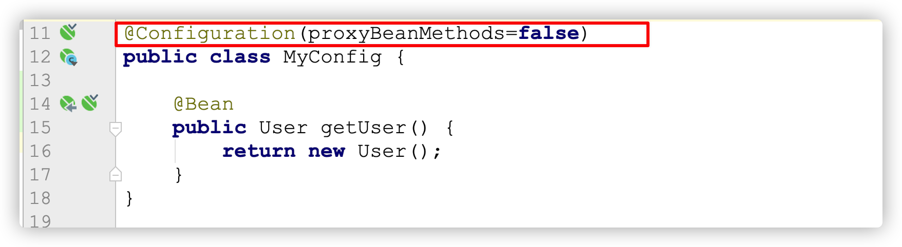

在执行结果则为 false， 证明两次获取的bean不是同一个bean。

<font color="red">小结：</font> 

* 组件依赖必须使用Full模式默认。

* Full模式每次都会检查bean，效率较Lite模式慢

#### 04-SpringBoot2高级-底层原理-@Import注解使用1

<font color="red">目的：</font>能够理解@Import注解作用及4种使用方式

<font color="red">讲解：</font>

作用：使用@Import导入的类会被Spring加载到IOC容器中

@Import提供4种用法：

1. 导入Bean
2. 导入配置类
3. **导入 ImportSelector 实现类。一般用于加载配置文件中的类**
4. 导入 ImportBeanDefinitionRegistrar 实现类


<font color="red">实现：</font>

1、导入Bean

```java
package com.itheima.sh;

import com.itheima.sh.pojo.User;
import org.mybatis.spring.annotation.MapperScan;
import org.springframework.boot.SpringApplication;
import org.springframework.boot.autoconfigure.SpringBootApplication;
import org.springframework.context.ConfigurableApplicationContext;
import org.springframework.context.annotation.Import;

import java.util.Map;

@SpringBootApplication
@Import(User.class)  
//会自动执行当前类的构造方法创建对象，存到IOC容器, bean名称为：类的全路径

public class DataApplication {
  public static void main(String[] args) {
    ConfigurableApplicationContext applicationContext = SpringApplication.run(DataApplication.class, args);

    Map<String, User> map = applicationContext.getBeansOfType(User.class);
    System.out.println(map);
    
    User user1 = applicationContext.getBean("com.itheima.sh.pojo.User", User.class);
    System.out.println(user1);

  }
}
```


2、导入配置类

```java
package com.itheima.sh;

import com.itheima.sh.config.MyConfig;
import com.itheima.sh.pojo.User;
import org.mybatis.spring.annotation.MapperScan;
import org.springframework.boot.SpringApplication;
import org.springframework.boot.autoconfigure.SpringBootApplication;
import org.springframework.context.ConfigurableApplicationContext;
import org.springframework.context.annotation.Import;

import java.util.Map;

@SpringBootApplication
@MapperScan(basePackages = "com.itheima.sh.mapper")
//@Import(User.class)
//1、会自动执行当前类的构造方法创建对象，存到IOC容器, bean名称为：类的全路径

@Import(MyConfig.class)
//2、创建MyConfig bean，并且类中有 带有@Bean注解方法，创建对象存到IOC容器，bean名称为：默认方法名称
public class DataApplication {
    public static void main(String[] args) {
        ConfigurableApplicationContext applicationContext = SpringApplication.run(DataApplication.class, args);

        //{getUser=com.itheima.sh.pojo.User@1b4a3a1}
        Map<String, User> map = applicationContext.getBeansOfType(User.class);
        System.out.println(map);

        User user1 = applicationContext.getBean("getUser", User.class);
        System.out.println(user1);

        Map<String, MyConfig> config = applicationContext.getBeansOfType(MyConfig.class);
        //{com.itheima.sh.config.MyConfig=com.itheima.sh.config.MyConfig@7e848aea}
        System.out.println(config);
    }
}
```


#### 05-SpringBoot2高级-底层原理-@Import注解使用2

<font color="red">目的：</font>讲解@Import注解使用另外两种使用方式

<font color="red">步骤：</font>

1. **导入 ImportSelector 实现类。一般用于加载配置文件中的类**
2. 导入 ImportBeanDefinitionRegistrar 实现类

<font color="red">实现：</font>

**导入 ImportSelector 实现类。一般用于加载配置文件中的类**

1、编写 ImportSelector 实现类，MyImportSelector

2、引导类导入

```java
package com.itheima.sh;

import com.itheima.sh.config.MyImportSelector;
import com.itheima.sh.pojo.User;
import org.mybatis.spring.annotation.MapperScan;
import org.springframework.boot.SpringApplication;
import org.springframework.boot.autoconfigure.SpringBootApplication;
import org.springframework.context.ConfigurableApplicationContext;
import org.springframework.context.annotation.Import;

import java.util.Map;

@SpringBootApplication
@MapperScan(basePackages = "com.itheima.sh.mapper")
//@Import(User.class)
//1、会自动执行当前类的构造方法创建对象，存到IOC容器, bean名称为：类的全路径

//@Import(MyConfig.class)
//2、创建MyConfig bean，并且类中有 带有@Bean注解方法，创建对象存到IOC容器，bean名称为：默认方法名称

@Import(MyImportSelector.class)
//3、创建MyConfig bean 名称为：类名全路径，创建带有@Bean注解方法实例，名称为：方法名称
public class DataApplication {
    public static void main(String[] args) {
        ConfigurableApplicationContext applicationContext = SpringApplication.run(DataApplication.class, args);

      Map<String, MyConfig> map = applicationContext.getBeansOfType(MyConfig.class);
      //{com.itheima.sh.config.MyConfig=com.itheima.sh.config.MyConfig@44384b4a}
      System.out.println(map);

      Map<String, User> userMap = applicationContext.getBeansOfType(User.class);
      //{getUser=com.itheima.sh.pojo.User@5cc3e49b}
      System.out.println(userMap);

    }
}
```


**导入 ImportBeanDefinitionRegistrar 实现类**

1、编写 ImportBeanDefinitionRegistrar 实现类，MyImportBeanDefinitionRegistrar

```java
package com.itheima.sh.config;

import com.itheima.sh.pojo.User;
import org.springframework.beans.factory.support.AbstractBeanDefinition;
import org.springframework.beans.factory.support.BeanDefinitionBuilder;
import org.springframework.beans.factory.support.BeanDefinitionRegistry;
import org.springframework.context.annotation.ImportBeanDefinitionRegistrar;
import org.springframework.core.type.AnnotationMetadata;

public class MyImportBeanDefinitionRegistrar implements ImportBeanDefinitionRegistrar {

  /**
     * @param importingClassMetadata 导入类的元注解信息
     * @param registry Bean注册表
     */
  @Override
  public void registerBeanDefinitions(AnnotationMetadata importingClassMetadata, BeanDefinitionRegistry registry) {
    AbstractBeanDefinition beanDefinition = BeanDefinitionBuilder
      .rootBeanDefinition(User.class).getBeanDefinition();
    registry.registerBeanDefinition("user", beanDefinition);
  }
}
```

2、引导类测试

```java
package com.itheima.sh;

import com.itheima.sh.config.MyImportBeanDefinitionRegistrar;
import com.itheima.sh.pojo.User;
import org.mybatis.spring.annotation.MapperScan;
import org.springframework.boot.SpringApplication;
import org.springframework.boot.autoconfigure.SpringBootApplication;
import org.springframework.context.ConfigurableApplicationContext;
import org.springframework.context.annotation.Import;

import java.util.Map;

@SpringBootApplication
@MapperScan(basePackages = "com.itheima.sh.mapper")

//@Import(User.class)
//1、会自动执行当前类的构造方法创建对象，存到IOC容器, bean名称为：类的全路径

//@Import(MyConfig.class)
//2、创建MyConfig bean，并且类中有 带有@Bean注解方法，创建对象存到IOC容器，bean名称为：默认方法名称

//@Import(MyImportSelector.class)
//3、创建MyConfig bean 名称为：类名全路径，创建带有@Bean注解方法实例，名称为：方法名称

@Import(MyImportBeanDefinitionRegistrar.class)
//4、创建Bean，名称：在registerBeanDefinition中定义
public class DataApplication {
    public static void main(String[] args) {
        ConfigurableApplicationContext applicationContext = SpringApplication.run(DataApplication.class, args);

        Map<String, User> userMap = applicationContext.getBeansOfType(User.class);
        //{user=com.itheima.sh.pojo.User@23c7cb18}
        System.out.println(userMap);

    }
}
```

<font color="red">小结：</font> 

* 讲解当前小节的目的主要是为源码准备
* 还有我们也可以知道创建Bean对象，还可以使用`@Import`四种方式


#### 06-SpringBoot2高级-底层原理-@Conditional衍生条件装配

<font color="red">目的：</font>理解@Conditional衍生条件装配的作用

<font color="red">讲解：</font>

作用：条件装配，满足Conditional指定的条件，则进行组件注入，初始化Bean对象到IOC容器
。

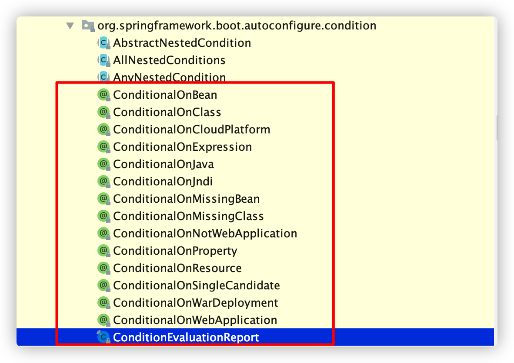

演示：

在RedisConfig类中添加注释：

方法中定义：

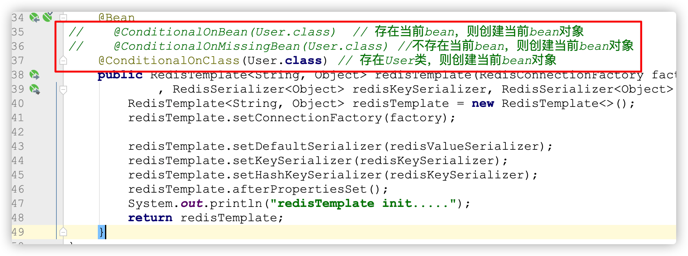

类上定义：

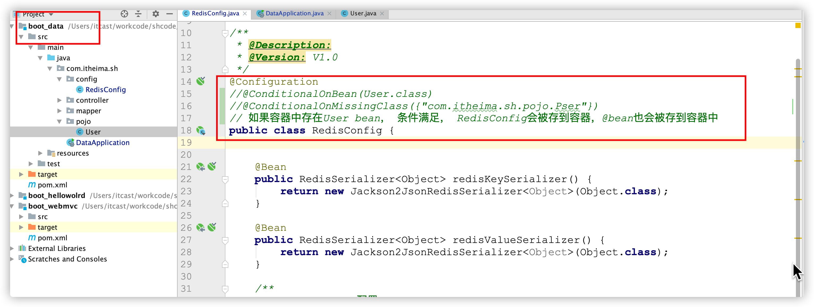

**注意：也可以添加到 类上， 满足条件则类及类中的对象生效。**


<font color="red">小结：</font> 

* @ConditionalOnXXX 注解存在的意义是：满足条件当前类或者Bean才有效，按需导入。

#### 07-SpringBoot2高级-底层原理-@ConfigurationProperties配置绑定

<font color="red">目的：</font>

回顾 @ConfigurationProperties配置绑定 存在的目的是：获取配置属性或者是配置文件指定前缀的属性信息，并且初始化Bean对象到 IOC 容器。

由此我们可以想：将来的配置我们可以放在配置文件中，通过这个注解来读取并封装成对象


#### 08-SpringBoot2高级-自动化配置原理-@SpringBootApplication入口分析

<font color="red">目的：</font>能够理解SpringBoot自动化配置流程中@SpringBootApplication是一个组合注解，及每一个注解的作用能够知道作用。

<font color="red">讲解：</font>

<font color="blue">1、SpringBoot是一个组合注解</font> 

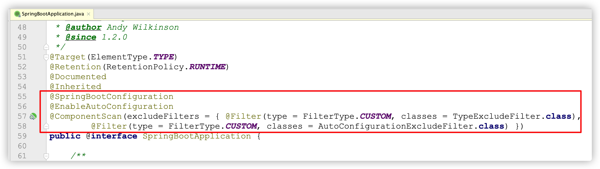

<font color="blue">2、@SpringBootConfiguration注解作用</font> 

* @SpringBootConfiguration是对@Configuration注解的包装，proxyBeanMethods 默认配置 true， full模式（单例Bean）

* 标识是一个配置类，所以 <font color="red">引导类也是配置类</font> 


<font color="blue">3、@ComponentScan注解作用</font> 

* 组件扫描，默认扫描的规则 <font color="red">引导类所在的包及其子包所有带注解的类</font> 


<font color="red">问题：</font> 

1. 在引导类中配置 @Bean 注解可以吗？
2. 为什么Controller、service类添加完注解后，不需要添加扫描包？


#### 09-SpringBoot2高级-自动化配置原理-@EnableAutoConfiguration自动配置注解

<font color="red">目的：理解@EnableAutoConfiguration自动化配置核心实现注解</font>

<font color="red">讲解：</font>

<font color="blue">1、@EnableAutoConfiguration是一个组合注解</font> 

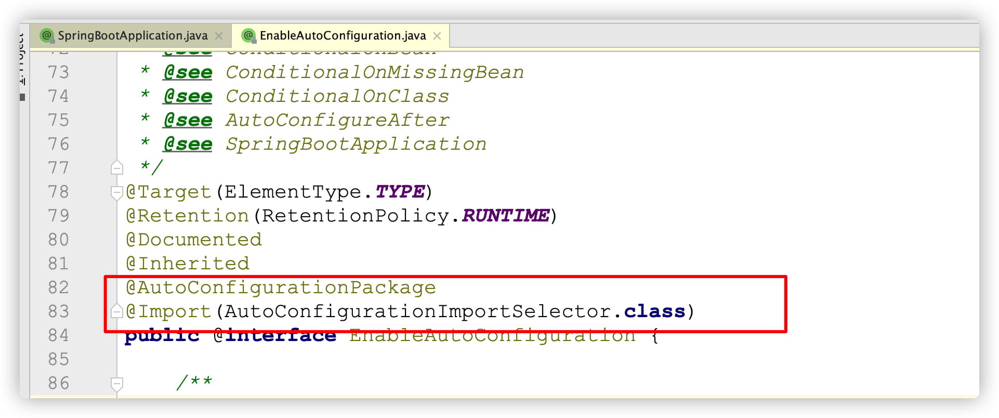


<font color="blue">2、@AutoConfigurationPackage注解作用</font> 

作用：利用Registrar给容器中导入一系列组件


点击 `Registrar` 进入到源码的 `register` 方法，添加 断点，测试


通过 debug 程序发现，默认情况下 <font color="red">将引导类的所有包及其子包的组件导入进来</font> 


<font color="blue">3、@Import(AutoConfigurationImportSelector.class)注解作用</font> 

作用：是利用`selectImports`方法中的 `getAutoConfigurationEntry` 方法给容器中批量导入相关组件

调用流程分析：

1. 调用`AutoConfigurationImportSelector`类中的`selectImports`方法
2. 调用`List<String> configurations = getCandidateConfigurations(annotationMetadata, attributes)`获取到所有需要导入到容器中的配置类
3. 利用工厂加载 `Map<String, List<String>> loadSpringFactories(@Nullable ClassLoader classLoader)`得到所有的组件

4. 从META-INF/spring.factories位置来加载一个文件。 

   默认扫描我们当前系统里面所有META-INF/spring.factories位置的文件

    

   spring-boot-autoconfigure-2.3.4.RELEASE.jar包里面也有META-INF/spring.factories

   

**通过这个配置文件加载的自动配置：当前版本（2.3.10）是有127个默认的自动化配置**

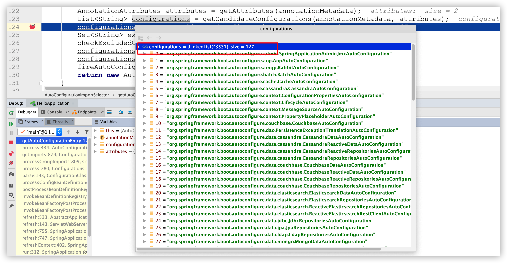


<font color="red">小结：</font> 

* 自动化配置默认加载的配置文件在哪？

#### 10-SpringBoot2高级-自动化配置原理-按条件开启自动配置类和配置项

<font color="red">目的：</font>

* 能够理解所有的自动化配置虽然会全部加载，底层有大量的@ConditionalOnXXX，有很多自动配置类并不能完全开启。
* 如果配置生效了，则会加载默认的属性配置类，实现默认的对应场景的自动化配置

<font color="red">讲解：</font>

1、以上通过 `META-INF/spring.factories` 配置文件找到所有的自动化配置类，但 是不是全部的生效的呢？很显然是不可能全部都生效的。

2、以 `JdbcTemplateAutoConfiguration` 为例讲解， 进入到  `JdbcTemplateAutoConfiguration`  自动化配置类。

```java
//配置类，Lite模式
@Configuration(proxyBeanMethods = false)
//存在 DataSource、JdbcTemplate 类时再加载当前类
@ConditionalOnClass({DataSource.class, JdbcTemplate.class })

//容器中只有一个指定的Bean，或者这个Bean是首选Bean 加载当前类
@ConditionalOnSingleCandidate(DataSource.class)

//在配置类 DataSourceAutoConfiguration 之后执行
@AutoConfigureAfter(DataSourceAutoConfiguration.class)

//如果条件满足：开始加载自动化配置的属性值 JdbcProperties
@EnableConfigurationProperties(JdbcProperties.class)

@Import({JdbcTemplateConfiguration.class, NamedParameterJdbcTemplateConfiguration.class })
public class JdbcTemplateAutoConfiguration {

}
```

3、JdbcProperties，用于加载默认的配置，如果配置文件配置了该属性，则配置文件就生效。

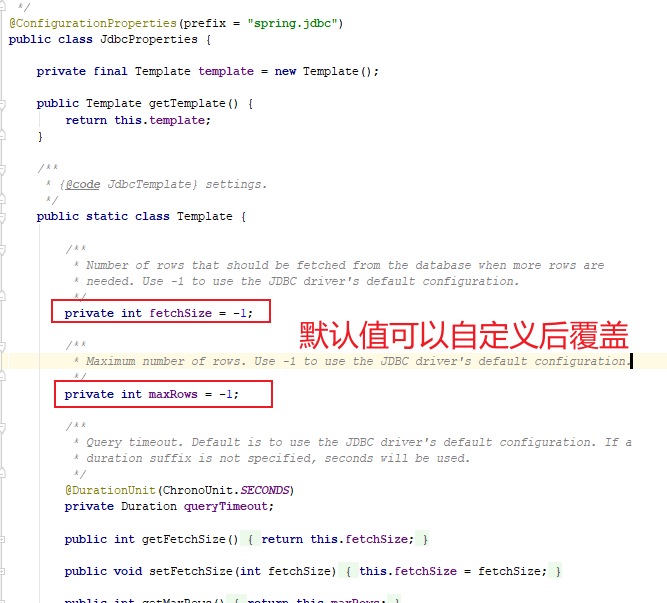

4、通过@Import导入JdbcTemplateConfiguration

```java
//配置类，Lite模式
@Configuration(proxyBeanMethods = false)
//没有JdbcOperations类型的bean时加载当前类，而 JdbcTemplate 是 JdbcOperations 接口实现类
@ConditionalOnMissingBean(JdbcOperations.class)
class JdbcTemplateConfiguration {

    @Bean
    @Primary
    JdbcTemplate jdbcTemplate(DataSource dataSource, JdbcProperties properties) {
        JdbcTemplate jdbcTemplate = new JdbcTemplate(dataSource);
        JdbcProperties.Template template = properties.getTemplate();
        jdbcTemplate.setFetchSize(template.getFetchSize());
        jdbcTemplate.setMaxRows(template.getMaxRows());
        if (template.getQueryTimeout() != null) {
            jdbcTemplate.setQueryTimeout((int) template.getQueryTimeout().getSeconds());
        }
        return jdbcTemplate;
    }

}
```

验证：我们可以在我们自己的项目里面创建一个 JdbcTemplate Bean，看容器创建的Bean执行的是哪一个方法。

```java
@Configuration
public class MyConfig {

    @Bean
    public JdbcTemplate jdbcTemplate(DataSource dataSource){
        JdbcTemplate jdbcTemplate = new JdbcTemplate(dataSource);
        System.out.println("自定义 JdbcTemplate");
        return jdbcTemplate;
    }
}
```

结果：保证容器中只有一个 Bean 实例

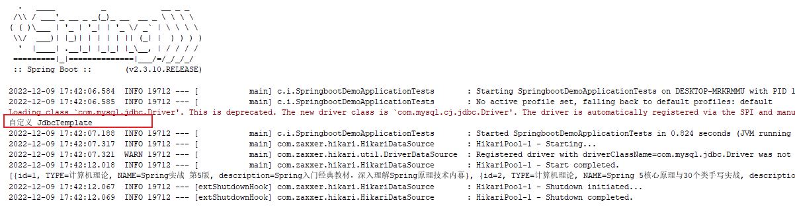


<font color="red">问题：</font> 

* 这些不用的 starter 的依赖，能不能导入到我们工程里面？ 为什么？ 

#### 11-SpringBoot2高级-自动化配置原理-debug全流程

<font color="red">目的：</font>能够理解整个SpringBoot启动的完成自动化配置及属性加载的全过程


#### 12-SpringBoot2高级-自动化配置原理-总结

<font color="red">SpringBoot自动化配置流程总结：</font> 

- 程序启动找到自动化配置包下 `META-INF/spring.factories` 的`EnableAutoConfiguration`
- SpringBoot先加载所有的自动配置类  **xxxxxAutoConfiguration**
- 每个自动配置类按照**条件**进行生效。
- 生效的配置类就会给容器中装配很多组件
- 只要容器中有这些组件，相当于这些功能就有了
- 定制化配置
  - 用户直接自己@Bean替换底层的组件
  - 用户去看这个组件是获取的配置文件什么值就去修改。


<font color="red">开发人员使用步骤总结：</font> 

- 引入[场景依赖](https://docs.spring.io/spring-boot/docs/current/reference/html/using-spring-boot.html#using-boot-starter)

- 查看自动配置了哪些（选做）

  - 自己分析，引入场景对应的自动配置一般都生效了
  - 配置文件中debug=true开启自动配置报告。Negative（不生效）\Positive（生效）

- **自己分析**是否需要修改
- 参照[文档](https://docs.spring.io/spring-boot/docs/current/reference/html/appendix-application-properties.html#common-application-properties)修改配置项，xxxxProperties绑定了配置文件的哪些。
  - 自定义加入或者替换组件，@Bean、@Component等


### 2 SpringBoot健康监控

#### 13-SpringBoot2高级-监控-健康监控服务

<font color="red">目的：</font>能够理解健康监控`actuator`的作用

<font color="red">讲解：</font>

每一个微服务在云上部署以后，我们都需要对其进行监控、追踪、审计、控制等。SpringBoot就抽取了Actuator场景，使得我们每个微服务快速引用即可获得生产级别的应用监控、审计等功能。

<font color="red">实现：</font>

1、引入依赖

```xml
<dependency>
    <groupId>org.springframework.boot</groupId>
    <artifactId>spring-boot-starter-actuator</artifactId>
</dependency>
```

2、启动项目，访问 `http://localhost:80/actuator`

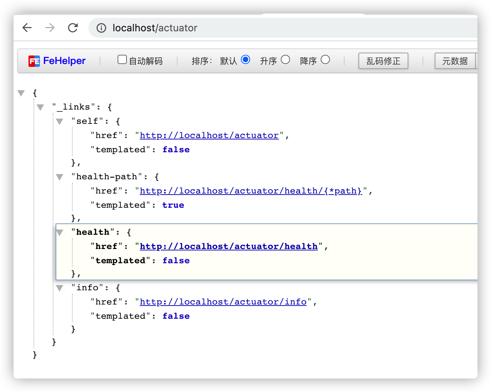

3、暴露所有监控信息为HTTP

```yaml
management:
  endpoints:
    enabled-by-default: true #暴露所有端点信息
    web:
      exposure:
        include: '*'  #以web方式暴露

  endpoint:
    health:
      enabled: true   # 开启健康检查详细信息
      show-details: always
```

访问 `http://localhost:80/actuator` 会发现内容多了，里面的地址分别都可以访问，记录的是对应的健康监测的信息。


#### 14-SpringBoot2高级-监控-Admin可视化

<font color="red">目的：</font>能够搭建 可视化监控平台

<font color="red">讲解：</font>

SpringBoot Admin 有两个角色，客户端(Client)和服务端(Server)。

Spring Boot Admin为注册的应用程序提供以下功能：

- 显示健康状况
- 显示详细信息，例如
  - JVM和内存指标
  - micrometer.io指标
  - 数据源指标
  - 缓存指标
- 显示内部信息
- 关注并下载日志文件
- 查看JVM系统和环境属性
- 查看Spring Boot配置属性
- 支持Spring Cloud的可发布/ env-和// refresh-endpoint
- 轻松的日志级别管理
- 与JMX-beans交互
- 查看线程转储
- 查看http-traces
- 查看审核事件
- 查看http端点
- 查看预定的任务
- 查看和删除活动会话（使用spring-session）
- 查看Flyway / Liquibase数据库迁移
- 下载heapdump
- 状态更改通知（通过电子邮件，Slack，Hipchat等）
- 状态更改的事件日志（非持久性）

 快速入门：https://codecentric.github.io/spring-boot-admin/2.3.1/#getting-started

<font color="red">实现：</font>

以下为创建服务端和客户端工程步骤：

<font color="blue">搭建Server端：</font> 

1、创建 admin_server 模块，引入依赖

```xml
<parent>
    <groupId>org.springframework.boot</groupId>
    <artifactId>spring-boot-starter-parent</artifactId>
    <version>2.3.10.RELEASE</version>
    <relativePath/> <!-- lookup parent from repository -->
</parent>

<dependencies>
    <dependency>
        <groupId>de.codecentric</groupId>
        <artifactId>spring-boot-admin-starter-server</artifactId>
        <version>2.3.1</version>
    </dependency>
    <dependency>
        <groupId>org.springframework.boot</groupId>
        <artifactId>spring-boot-starter-web</artifactId>
    </dependency>

</dependencies>
```

2、开启注解支持

```java
package com.itheima.sh;

import de.codecentric.boot.admin.server.config.EnableAdminServer;
import org.springframework.boot.SpringApplication;
import org.springframework.boot.autoconfigure.SpringBootApplication;

@SpringBootApplication
@EnableAdminServer
public class AdminApplication {
    public static void main(String[] args) {
        SpringApplication.run(AdminApplication.class, args);
    }
}
```

注意端口修改为：9999


<font color="blue">搭建Client端：</font> 

1、在任意服务里面引入依赖

```xml
<dependency>
    <groupId>de.codecentric</groupId>
    <artifactId>spring-boot-admin-starter-client</artifactId>
    <version>2.3.1</version>
</dependency>
```

2、配置文件

```yaml
  # 执行admin.server地址
spring:   
  boot:
    admin:
      client:
        url: http://localhost:9999  # admin 服务地址
        instance:
          prefer-ip: true   # 显示IP
  application:
    name: boot_data  # 项目名称
    
management:
  endpoints:
    enabled-by-default: true #暴露所有端点信息
    web:
      exposure:
        include: '*'  #以web方式暴露

  endpoint:
    health:
      enabled: true   # 开启健康检查详细信息
      show-details: always
```

3、启动服务，访问admin Server http://localhost:9999/

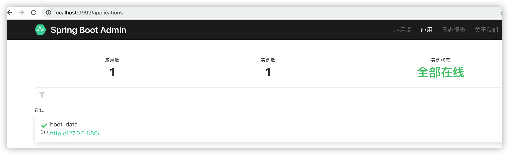


### 3 扩展lombok

1、pom依赖：

```xml
<dependency>
    <groupId>org.projectlombok</groupId>
    <artifactId>lombok</artifactId>
</dependency>
```

2、实体类

```java
@Data  // set/get/tostring ....
@AllArgsConstructor  // 全参
@NoArgsConstructor // 无参构造
@ToString // tostring
@Accessors(chain = true)  // 链式调用
@Builder  // 构建者模式创建对象
@Slf4j  // 日志注解支持
public class User {

    private Long id;
    private String userName;
    private Integer sex;
    private LocalDate birthday;
    private Date created;
    private Date modified;

}
```

3、测试

```java
//        User user = new User();
        //user = user.setId(1L).setSex(1);
        User user1 = User
                .builder()

                .id(1L)
                .sex(1)
                .created(new Date())

                .build();
        System.out.println("user1: "+user1);
```