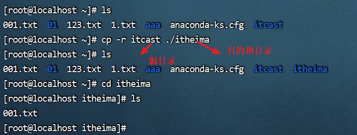
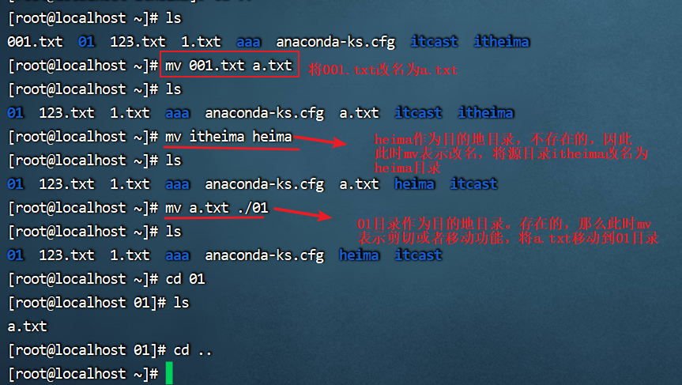
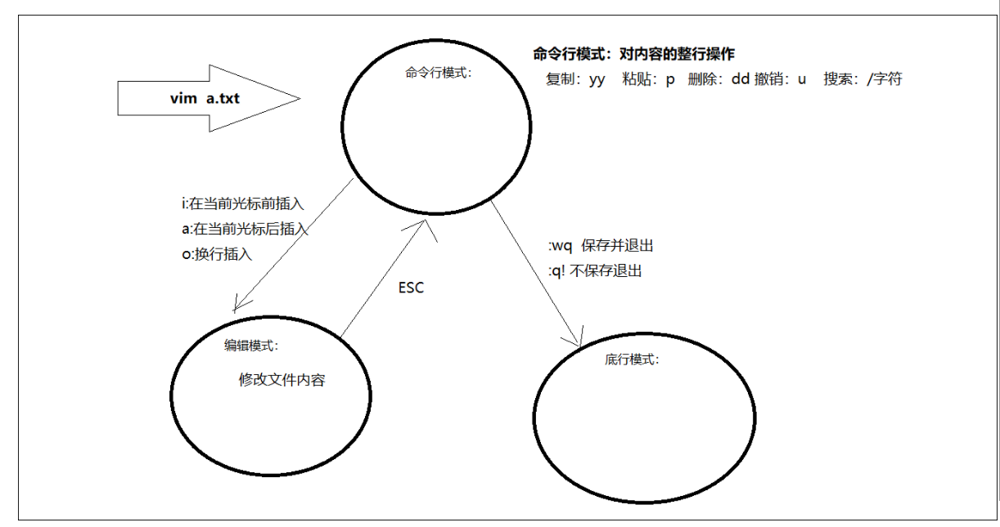

# 随堂笔记

# 1.需要安装的软件

## 1.vmware安装

作用：模拟电脑硬件管理linux操作系统。

# 2.linux入门命令 掌握

~~~markdown
1.ls : list 列出当前目录下的所有内容
2.touch 文件名： 创建文件
3.mkdir 目录 ： 创建目录  make directory
4.cd 目录： 切换目录  .. 上一级目录
5.pwd:显示当前所在目录
6.rm 删除的文件 ：删除文件 remove

~~~

# 3.linux命令技巧和格式

1.清除屏幕 ：ctrl+L  或者clear

2.查找输入过的命令：按向上/下键

3.tab:按一次，补全。按两次表示提示

4.命令格式：

~~~markdown
命令名 选项 参数
	注意：选项 参数 对于不同命令可以写可以不写
~~~

# 4.文件目录操作命令 掌握

## 【1】ls 列出指定目录下的文件和和文件夹

~~~markdown
1.ls : list 列出当前目录的所有内容
2.ls -a : 列出当前目录下面的所有内容，包括隐藏的。隐藏的以.开始
3.ls -l:查看当前目录的详细信息
4.ls -al 指定目录：查看指定目录下面的所有文件的详细信息
5.ll:使用 ls -l的简写 ********
~~~

## 【2】cd change directory 切换目录

~~~markdown
1.cd .. 切换当前目录的上一级目录
2.cd ~ : 如果当前登录的用户是root 则切换到/root目录，如果当前登录的是普通用户那么切换的目录/home
~~~

## 【3】cat 查看文件

~~~markdown
cat 【-n】 文件名
 说明： -n number 显示行号，可以写也可以不写
~~~

## 【4】more 

> 作用：分页查询文件，从前往后查看
>
> more 文件名
>
> 1）回车显示下一行
>
> 2）空格：下一屏幕
>
> 3）b:上一屏
>
> 4）ctrl+c停止查看

## 【5】tail

> 作用：从后往前查看指定文件，默认是查看后10行
>
> tail 文件名
>
> 1.tail -数字 文件名  查看指定文件的后几行
>
> 2.tail -f 文件名  动态查看指定文件的末尾行数

## 【6】mkdir

> 作用：创建文件夹(目录)
>
> 1.mkdir 文件夹
>
> 2.mkdir -p 文件夹/文件夹。。。 创建多级文件夹

## 【7】rmdir 了解

> 作用：删除目录
>
> 1.rmdir 删除的目录
>
> 2.如果删除的目录有子目录：rmdir -p 目录/子目录
>
> 3.通配符删除：rmdir 文件夹名*

## 【8】强制删除指定目录和文件 掌握

> rm -rf 目录/文件
>
> r:递归删除
>
> f:强制删除

## 【9】cp复制文件和目录

> cp 【-r】 源目录/文件  目的地目录/文件
>
> 1.-r : 一般是复制的源目录下面具有子目录或者子文件就使用
>
> 

## 【10】mv命令

小结：

> 1,mv 源目录 目的地目录
>
> 说明：如果目的地目录不存在则mv表示改名。如果目的地目录存在就是剪切。

## 【11】tar命令打包和拆包 重点是拆包

> 1.打包 ： tar -zcvf 压缩包文件 指定的要压缩的文件 .....
>
>   tar -zcvf hello.tar.gz a.txt b.txt .....
>
>   说明： z gzip 打包的文件以.gz结尾   c  表示create 打包    v  详情  f  表示指定文件
>
> **2.拆包   重点**
>
> tar -zxvf 压缩包文件  -C 解压到指定目录
>
> tar -zxvf itcast.tar.gz -C ./01 
>
> 说明： z gzip 打包的文件以.gz结尾   x  表示拆包    v  详情  f  表示指定文件  -C  表示指定目录

# 5.文本编辑命令(掌握)

**注意:在命令行模式切换到底行模式的时候，按冒号一定是英文输入法。**

# 6.搜索 掌握

## 1.find命令

> 1.作用：查找指定目录下的指定文件
>
> find 指定目录 -name '查找的字符串'

## 2.grep 命令

> 1.作用：查找指定文件中的指定字符串
>
> 2.格式：
>
> grep -nvi 查找字符串  文件名
>
> n : 显示行号 number
>
> v：排除
>
> i:忽略大小写

# 今日总结和作业

~~~markdown
掌握Linux的文件目录操作命令
	1.创建文件 ：touch 文件
	2.创建文件夹:mkdir 文件夹名
	3.更改目录：cd 更改目录
	4.查看文件：
		1）cat 文件名 查看整个文件
		2）more 文件名 ：从头开始分屏查看  空格 向下一屏 
		3）tail 文件名  ：从后往前查看，默认查看后10行  tail -行 文件名  
	5.删除文件和目录： rm -rf 删除的内容
掌握Linux的拷贝移动命令
	1.拷贝：复制  cp 源文件 目的地
	2.剪切和重命名；
		mv 源文件  目的地
			剪切：目的地存在
			重命名：目的地不存在
掌握Linux的文本编辑vim命令
	1）进入命令行模式： vim 文件名。都是整行操作。yy 复制 p 粘贴 dd 删除  u撤销 /搜索的内容
	2)从命令行模式进入到编辑模式：i 光标前插入  a  光标后插入  o 换行插入
	3）从编辑模式到命令模式按esc,然后在英文输入法按:进入到底行模式。:wq 保存退出   :q!不保存退出
掌握Linux的查找命令
	1）find 搜索目录 -name '要搜索的字符串'  表示在指定目录查询指定文件或者目录
	2）grep -nvi 搜索的字符串 文件名  ： 在指定文件中查找要搜索的内容
~~~

