# Docker实用篇


# 0.学习目标


# 1.初识Docker

## 1.1.什么是Docker

前面学习的linux系统虽然可以部署应用，但是操作给部署带来了很大的麻烦。

- 分布式系统中，依赖的组件非常多，不同组件之间部署时往往会产生一些冲突。
- 在数百上千台服务中重复部署，环境不一定一致，会遇到各种问题


### 1.1.1.应用部署的环境问题

大型项目组件较多，运行环境也较为复杂，部署时会碰到一些问题：

- 依赖关系复杂，容易出现兼容性问题

- 开发、测试、生产环境有差异


例如一个项目中，部署时需要依赖于node.js、Redis、RabbitMQ、MySQL等，这些服务部署时所需要的函数库、依赖项各不相同，甚至会有冲突。给部署带来了极大的困难。


### 1.1.2.Docker解决依赖兼容问题

而Docker确巧妙的解决了这些问题，Docker是如何实现的呢？

Docker为了解决依赖的兼容问题的，采用了两个手段：

- 将应用的Libs（函数库）、Deps（依赖）、配置与应用一起打包

- 将每个应用放到一个隔离**容器**去运行，避免互相干扰

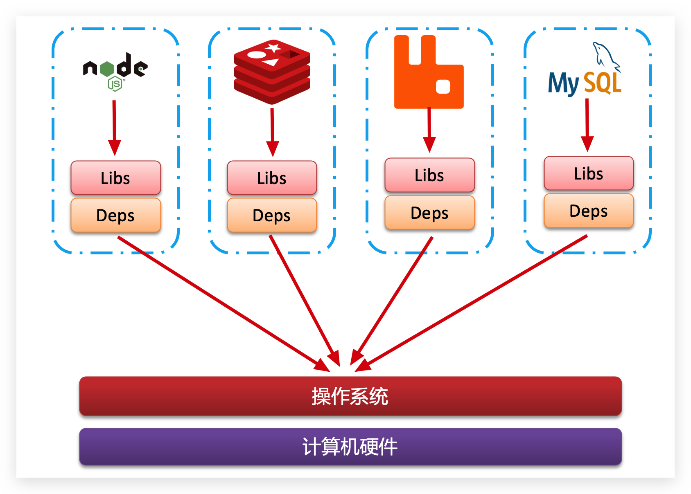


这样打包好的应用包中，既包含应用本身，也保护应用所需要的Libs、Deps，无需再操作系统上安装这些，自然就不存在不同应用之间的兼容问题了。


虽然解决了不同应用的兼容问题，但是开发、测试等环境会存在差异，操作系统版本也会有差异，怎么解决这些问题呢？


### 1.1.3.Docker解决操作系统环境差异

要解决不同操作系统环境差异问题，必须先了解操作系统结构。以一个Ubuntu操作系统为例，结构如下：


结构包括：

- 计算机硬件：例如CPU、内存、磁盘等
- 系统内核：所有Linux发行版的内核都是Linux，例如CentOS、Ubuntu、Fedora等。内核可以与计算机硬件交互，对外提供**内核指令**，用于操作计算机硬件。
- 系统应用：操作系统本身提供的应用、函数库。这些函数库是对内核指令的封装，使用更加方便。


应用于计算机交互的流程如下：

1）应用调用操作系统应用（函数库），实现各种功能

2）系统函数库是对内核指令集的封装，会调用内核指令

3）内核指令操作计算机硬件


Ubuntu和CentOS都是基于Linux内核，无非是系统应用不同，提供的函数库有差异：


此时，如果将一个Ubuntu版本的MySQL应用安装到CentOS系统，MySQL在调用Ubuntu函数库时，会发现找不到或者不匹配，就会报错了：


Docker如何解决不同系统环境的问题？

- Docker将用户程序与所需要调用的系统(比如Ubuntu)函数库一起打包
- Docker运行到不同操作系统时，直接基于打包的函数库，借助于操作系统的Linux内核来运行

如图：


### 1.1.4.小结

Docker如何解决大型项目依赖关系复杂，不同组件依赖的兼容性问题？

- Docker允许开发中将应用、依赖、函数库、配置一起**打包**，形成可移植镜像
- Docker应用运行在容器中，使用沙箱机制，相互**隔离**


Docker如何解决开发、测试、生产环境有差异的问题？

- Docker镜像中包含完整运行环境，包括系统函数库，仅依赖系统的Linux内核，因此可以在任意Linux操作系统上运行


Docker是一个快速交付应用、运行应用的技术，具备下列优势：

- 可以将程序及其依赖、运行环境一起打包为一个镜像，可以迁移到任意Linux操作系统
- 运行时利用沙箱机制形成隔离容器，各个应用互不干扰
- 启动、移除都可以通过一行命令完成，方便快捷


## 1.2.Docker和虚拟机的区别

Docker可以让一个应用在任何操作系统中非常方便的运行。而以前我们接触的虚拟机，也能在一个操作系统中，运行另外一个操作系统，保护系统中的任何应用。


两者有什么差异呢？


**虚拟机**（virtual machine）是在操作系统中**模拟**硬件设备，然后运行另一个操作系统，比如在 Windows 系统里面运行 Ubuntu 系统，这样就可以运行任意的Ubuntu应用了。

> 传统的虚拟机需要模拟整台机器包括硬件，每台虚拟机都需要有⾃⼰的操作系统，虚拟机⼀旦被开启，预分配给他的资源将全部被占⽤。每⼀个虚拟机包括应⽤，必要的⼆进制和库，以及⼀个完整的⽤户操作系统。像平常用的VMware就属于虚拟机操作软件。

**Docker**仅仅是封装函数库，并没有模拟完整的操作系统，如图：

> Docker是一种**容器**技术。
>
> 容器技术是和我们的宿主机共享硬件资源及操作系统可以实现资源的动态分配。容器包含应⽤和其所有的依赖包，但是与其他容器共享内核。容器在宿主机操作系统中，在⽤户空间以**分离的进程**运⾏。
>
> 所有主流的Linux发行版都可以运行Docker


ps:

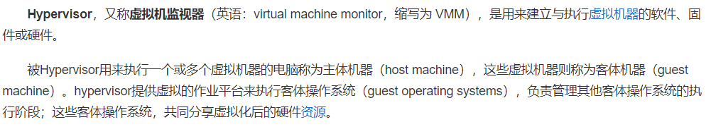


对比来看：


小结：

Docker和虚拟机的差异：

- docker是一个系统进程；虚拟机是在操作系统中的操作系统

- docker体积小、启动速度快、性能好；虚拟机体积大、启动速度慢、性能一般


## 1.3.Docker架构


### 1.3.1.镜像和容器

Docker中有几个重要的概念：

**镜像（Image）**：Docker将应用程序及其所需的依赖、函数库、环境、配置等文件打包在一起，称为镜像。

**容器（Container）**：镜像中的应用程序运行后形成的进程就是**容器**，只是Docker会给容器进程做隔离，对外不可见。


一切应用最终都是代码组成，都是硬盘中的一个个的字节形成的**文件**。只有运行时，才会加载到内存，形成进程。


而**镜像**，就是把一个应用在硬盘上的文件、及其运行环境、部分系统函数库文件一起打包形成的文件包。这个文件包是只读的。

**容器**呢，就是将这些文件中编写的程序、函数加载到内存中允许，形成进程，只不过要隔离起来。因此一个镜像可以启动多次，形成多个容器进程。


例如你下载了一个QQ，如果我们将QQ在磁盘上的运行**文件**及其运行的操作系统依赖打包，形成QQ镜像。然后你可以启动多次，双开、甚至三开QQ，跟多个妹子聊天。


### 1.3.2.DockerHub

开源应用程序非常多，打包这些应用往往是重复的劳动。为了避免这些重复劳动，人们就会将自己打包的应用镜像，例如Redis、MySQL镜像放到网络上，共享使用，就像GitHub的代码共享一样。

- DockerHub：DockerHub是一个官方的Docker镜像的托管平台。这样的平台称为Docker Registry。

- 国内也有类似于DockerHub 的公开服务，比如 [网易云镜像服务](https://c.163yun.com/hub)、[阿里云镜像库](https://cr.console.aliyun.com/)等。


我们一方面可以将自己的镜像共享到DockerHub，另一方面也可以从DockerHub拉取镜像：


### 1.3.3.Docker架构

我们要使用Docker来操作镜像、容器，就必须要安装Docker。

Docker是一个CS架构的程序，由两部分组成：

- 服务端(server)：Docker守护进程，负责处理Docker指令，管理镜像、容器等

- 客户端(client)：通过命令或RestAPI向Docker服务端发送指令。可以在本地或远程向服务端发送指令。


如图：


### 1.3.4.小结

镜像：

- 将应用程序及其依赖、环境、配置打包在一起

容器：

- 镜像运行起来就是容器，一个镜像可以运行多个容器

Docker结构：

- 服务端：接收命令或远程请求，操作镜像或容器

- 客户端：发送命令或者请求到Docker服务端

DockerHub：

- 一个镜像托管的服务器，类似的还有阿里云镜像服务，统称为DockerRegistry


## 1.4.安装Docker

企业部署一般都是采用Linux操作系统，而其中又数CentOS发行版占比最多，因此我们在CentOS下安装Docker。参考课前资料中的文档：


# 2.Docker的基本操作

## 2.1.镜像操作


### 2.1.1.镜像名称

首先来看下镜像的名称组成：

- 镜名称一般分两部分组成：[repository]:[tag]。
- 在没有指定tag时，默认是latest，代表最新版本的镜像

如图：


这里的mysql就是repository，5.7就是tag，合一起就是镜像名称，代表5.7版本的MySQL镜像。


### 2.1.2.镜像命令

常见的镜像操作命令如图：


### 2.1.3.案例1-拉取、查看镜像

需求：从DockerHub中拉取一个nginx镜像并查看

1）首先去镜像仓库搜索nginx镜像，比如[DockerHub](https://hub.docker.com/):


2）根据查看到的镜像名称，拉取自己需要的镜像，通过命令：docker pull nginx


3）通过命令：docker images 查看拉取到的镜像


### 2.1.4.案例2-保存、导入镜像

需求：利用docker save将nginx镜像导出磁盘，然后再通过load加载回来

1）利用docker xx --help命令查看docker save和docker load的语法

例如，查看save命令用法，可以输入命令：

```sh
docker save --help
```

结果：


命令格式：

```shell
docker save -o [保存的目标文件名称] [镜像名称]
```


2）使用docker save导出镜像到磁盘 

运行命令：

```sh
docker save -o nginx.tar nginx:latest
```

结果如图：


3）使用docker load加载镜像

先删除本地的nginx镜像：

```sh
docker rmi nginx:latest
```


然后运行命令，加载本地文件：

```sh
docker load -i nginx.tar
```

结果：


### 2.1.5.练习

需求：去DockerHub搜索并拉取一个Redis镜像

**目标：**

1）去DockerHub搜索Redis镜像

2）查看Redis镜像的名称和版本

3）利用docker pull命令拉取镜像

> 说明：拉取指定版本的redis镜像 **docker pull redis:latest**

4）利用docker save命令将 redis:latest打包为一个redis.tar包

>  docker save -o redis.tar redis:latest

5）利用docker rmi 删除本地的redis:latest

> docker rmi redis:latest

6）利用docker load 重新加载 redis.tar文件

> docker load -i redis.tar


## 2.2.容器操作

### 2.2.1.容器相关命令

容器操作的命令如图：


容器保护三个状态：

- 运行：进程正常运行
- 暂停：进程暂停，CPU不再运行，并不释放内存
- 停止：进程终止，回收进程占用的内存、CPU等资源


其中：

- docker run：创建并运行一个容器，处于运行状态
- docker pause：让一个运行的容器暂停
- docker unpause：让一个容器从暂停状态恢复运行
- docker stop：停止一个运行的容器
- docker start：让一个停止的容器再次运行

- docker rm：删除一个容器

- docker ps -a 查看所有容器


### 2.2.2.案例-创建并运行一个容器

创建并运行nginx容器的命令：

```sh
docker run --name containerName -p 80:80 -d nginx
```

命令解读：

- docker run ：创建并运行一个容器
- --name : 给容器起一个名字，比如叫做mn
- -p ：将宿主机端口与容器端口映射，冒号左侧是宿主机端口，右侧是容器端口
- -d：后台运行容器
- nginx：镜像名称，例如nginx


这里的`-p`参数，是将容器端口映射到宿主机端口。

默认情况下，容器是隔离环境，我们直接访问宿主机的80端口，肯定访问不到容器中的nginx。

现在，将容器的80与宿主机的80关联起来，当我们访问宿主机的80端口时，就会被映射到容器的80，这样就能访问到nginx了：


浏览器直接访问：

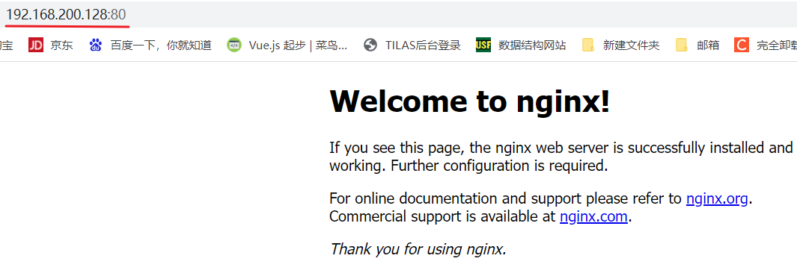


### 2.2.3.案例-进入容器，修改文件

**需求**：进入Nginx容器，修改HTML文件内容，添加“传智教育欢迎您”

**提示**：进入容器要用到docker exec命令。


**步骤**：

1）进入容器。进入我们刚刚创建的nginx容器的命令为：

```sh
docker exec -it mn bash
```

命令解读：

- docker exec ：进入容器内部，执行一个命令

- -it : 给当前进入的容器创建一个标准输入、输出终端，允许我们与容器交互

- mn ：要进入的容器的名称

- bash：进入容器后执行的命令，bash是一个linux终端交互命令

  > bash命令是shell脚本命令的超集，大多数shell脚本都可以在bash下运行，bash主要有如下这些功能：
  >
  > cd rm mkdir....


2）进入nginx的HTML所在目录 /usr/share/nginx/html

容器内部会模拟一个独立的Linux文件系统，看起来如同一个linux服务器一样：


nginx的环境、配置、运行文件全部都在这个文件系统中，包括我们要修改的html文件。

查看DockerHub网站中的nginx页面，可以知道nginx的html目录位置在`/usr/share/nginx/html`

我们执行命令，进入该目录：

```sh
cd /usr/share/nginx/html
```

 查看目录下文件：


3）修改index.html的内容

容器内没有vim命令，无法直接修改，我们用下面的命令来修改：

```sh
sed -i -e 's#Welcome to nginx#传智教育欢迎您#g' -e 's#<head>#<head><meta charset="utf-8">#g' index.html
```

说明：

> 1)-e : 可以在同一行里执行多条命令
>
> 2)**-i** 就是直接对文本文件进行操作的

在浏览器访问自己的虚拟机地址，例如我的是：http://192.168.150.101，即可看到结果：


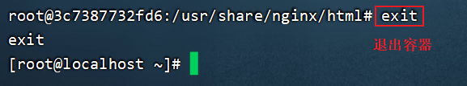

### 2.2.4.小结

【1】暂停容器?

> docker pause 容器名
>
> 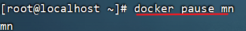
>
> 浏览器访问：
>
> 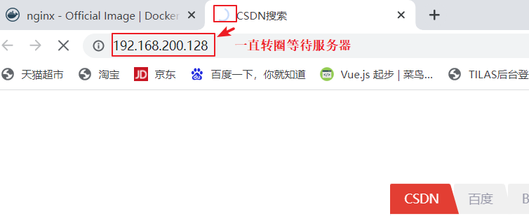

【2】从暂停回到运行容器?

>docker unpause 容器名
>
>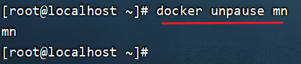
>
>浏览器可以访问了：
>
>

【3】停止容器?

>docker stop 容器名
>
>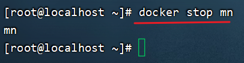
>
>浏览器访问效果:
>
>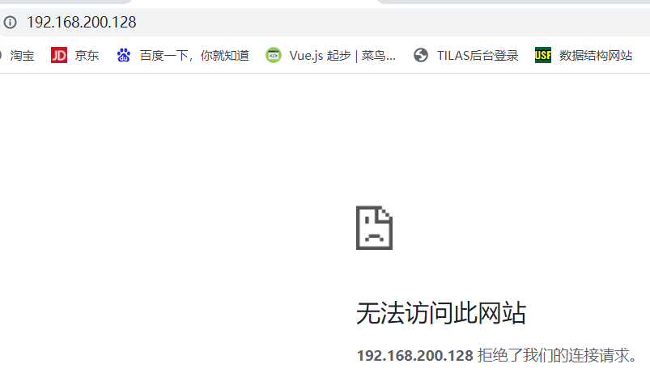

【4】从停止到启动容器?

> docker start 容器名
>
>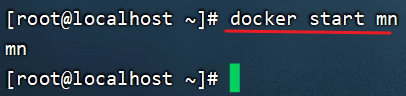
>
>浏览器访问效果:
>
>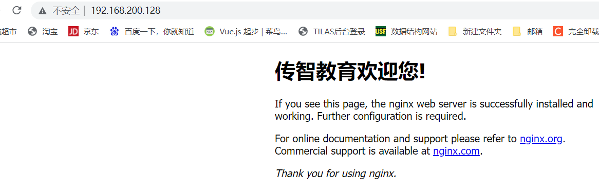

【5】查看所有运行的容器状态?

> 
>
> 如果将容器关闭：
>
> 
>
> 再次查看所有运行的容器状态?
>
> 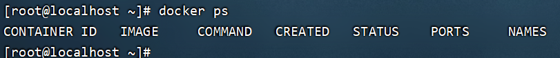
>
> 可以通过-a参数查看所有状态的容器，包括已经停止的
>
> 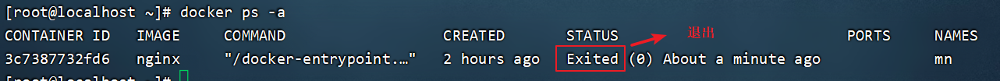

【6】查看容器日志?

>docker logs 容器名
>
>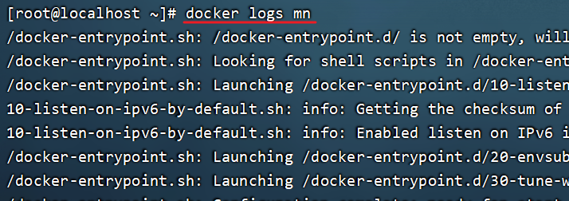
>
>添加 -f 参数可以持续查看日志。浏览器访问，不用执行命令，直接在终端输出日志信息。
>
>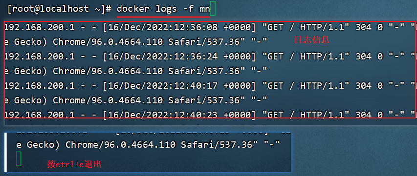

【7】删除容器

>docker rm 容器名
>
>不能删除运行中的容器，除非添加 -f 参数
>
>docker rm -f 容器名
>
>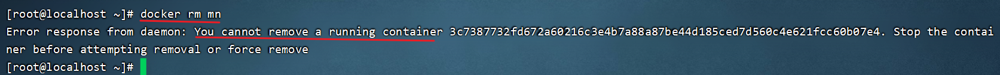

> 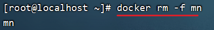

【8】docker run命令的常见参数有哪些？

- --name：指定容器名称
- -p：指定端口映射
- -d：让容器后台运行

~~~java
docker run --name containerName -p 80:80 -d nginx
~~~


### 2.2.5 案例：创建并运行一个redis容器，并且支持数据持久化

#### 1.实现步骤

~~~markdown
步骤一：到DockerHub搜索Redis镜像
步骤二：查看Redis镜像文档中的帮助信息
步骤三：利用docker run 命令运行一个Redis容器
	docker run --name redis -p 6379:6379 -d redis redis-server --appendonly yes
~~~

#### 2.具体实现

##### 步骤一：到DockerHub搜索Redis镜像

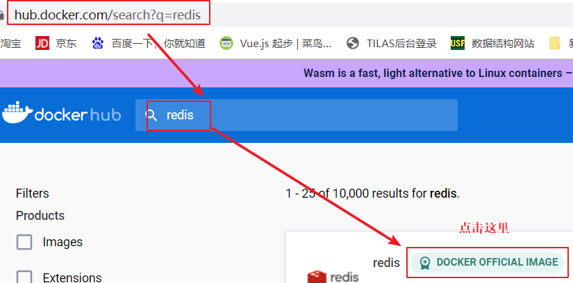


##### 步骤二：查看Redis镜像文档中的帮助信息

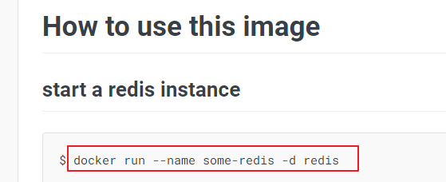

##### 步骤三：利用docker run 命令运行一个Redis容器

~~~markdown
docker run --name redis -p 6379:6379 -d redis redis-server --appendonly yes
    --name：指定容器名称,redis表示容器名
	-p：指定端口映射。6379:6379 冒号左侧是宿主机端口，右侧是容器端口
	-d：让容器后台运行
	redis：表示镜像名
    redis-server：表示redis服务
    --appendonly yes ：开启aof持久化
~~~

##### 步骤四：进入redis容器

~~~markdown
docker exec -it redis bash
~~~

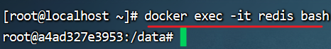

##### 步骤五：执行redis-cli客户端命令

~~~java
redis-cli
~~~

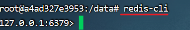

##### 步骤六：设置数据num=666

~~~java
set num 666
~~~


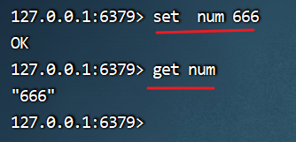

##### 步骤七:在window系统中使用redis客户端连接

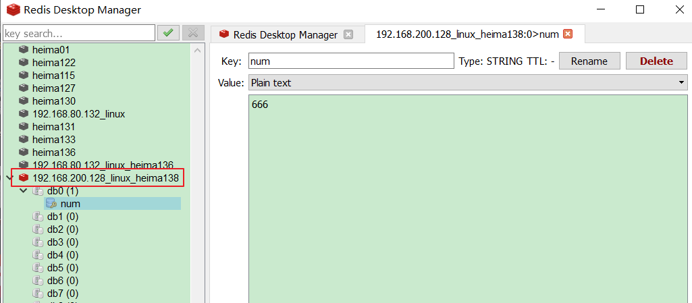

ps:大家可以回想我们前面讲解linux安装redis有多么麻烦。而使用docker是不是更加方便。


## 2.3.数据卷（容器数据管理）

在之前的nginx案例中，修改nginx的html页面时，需要进入nginx内部。并且因为没有编辑器，修改文件也很麻烦。

这就是因为容器与数据（容器内文件）耦合带来的后果。


要解决这个问题，必须将数据与容器解耦，这就要用到数据卷了。


### 2.3.1.什么是数据卷

**数据卷（volume）**是一个虚拟目录，指向宿主机文件系统中的某个目录。


一旦完成数据卷挂载，对容器的一切操作都会作用在数据卷对应的宿主机目录了。

这样，我们操作宿主机的/var/lib/docker/volumes/html目录，就等于操作容器内的/usr/share/nginx/html目录了


### 2.3.2.数据集操作命令


数据卷操作的基本语法如下：

```sh
docker volume [COMMAND]
```

docker volume命令是数据卷操作，根据命令后跟随的command来确定下一步的操作：

- create 创建一个volume
- inspect 显示一个或多个volume的信息
- ls 列出所有的volume
- prune 删除未使用的volume
- rm 删除一个或多个指定的volume


### 2.3.3.创建和查看数据卷

**需求**：创建一个数据卷，并查看数据卷在宿主机的目录位置

① 创建数据卷

```sh
docker volume create html
```


② 查看所有数据

```sh
docker volume ls
```

结果：


说明:

> 第一个数据卷是docker自己生成的。我们不需要关心。


③ 查看数据卷详细信息卷

```sh
docker volume inspect html
```

结果：


可以看到，我们创建的html这个数据卷关联的宿主机目录为`/var/lib/docker/volumes/html/_data`目录。


**小结**：

数据卷的作用：

- 将容器与数据分离，解耦合，方便操作容器内数据，保证数据安全

数据卷操作：

- docker volume create：创建数据卷
- docker volume ls：查看所有数据卷
- docker volume inspect：查看数据卷详细信息，包括关联的宿主机目录位置
- docker volume rm：删除指定数据卷
- docker volume prune：删除所有未使用的数据卷


### 2.3.4.挂载数据卷

我们在创建容器时，可以通过 -v 参数来挂载一个数据卷到某个容器内目录，命令格式如下：

```sh
docker run --name mn -v html:/root/html -p 8080:80 -d nginx:latest 
```

这里的-v就是挂载数据卷的命令：

- `-v html:/root/html` ：把html数据卷挂载到容器内的/root/html这个目录中


### 2.3.5.案例-给nginx挂载数据卷

**需求**：创建一个nginx容器，修改容器内的html目录内的index.html内容


**分析**：上个案例中，我们进入nginx容器内部，已经知道nginx的html目录所在位置/usr/share/nginx/html ，我们需要把这个目录挂载到html这个数据卷上，方便操作其中的内容。

**提示**：运行容器时使用 -v 参数挂载数据卷

步骤：

① 创建容器并挂载数据卷到容器内的HTML目录

```sh
docker run --name mn -v html:/usr/share/nginx/html -p 80:80 -d nginx
```

> -d：后台运行容器

② 进入html数据卷所在位置，并修改HTML内容

```sh
# 查看html数据卷的位置
docker volume inspect html
# 进入该目录
cd /var/lib/docker/volumes/html/_data
# 修改文件
vim index.html
```

③浏览器访问

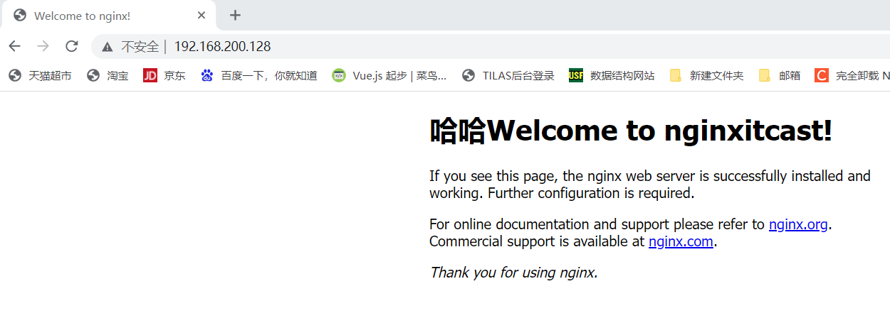

### 2.3.6.案例-给MySQL挂载本地目录

容器不仅仅可以挂载数据卷，也可以直接挂载到宿主机目录上。关联关系如下：

- 带数据卷模式：宿主机目录 --> 数据卷 ---> 容器内目录
- 直接挂载模式：宿主机目录 ---> 容器内目录

如图：


**语法**：

目录挂载与数据卷挂载的语法是类似的：

- -v [宿主机目录]:[容器内目录]
- -v [宿主机文件]:[容器内文件]


**需求**：创建并运行一个MySQL容器，将宿主机目录直接挂载到容器


实现思路如下：

1）在将课前资料中的mysql.tar文件上传到虚拟机，通过load命令加载为镜像

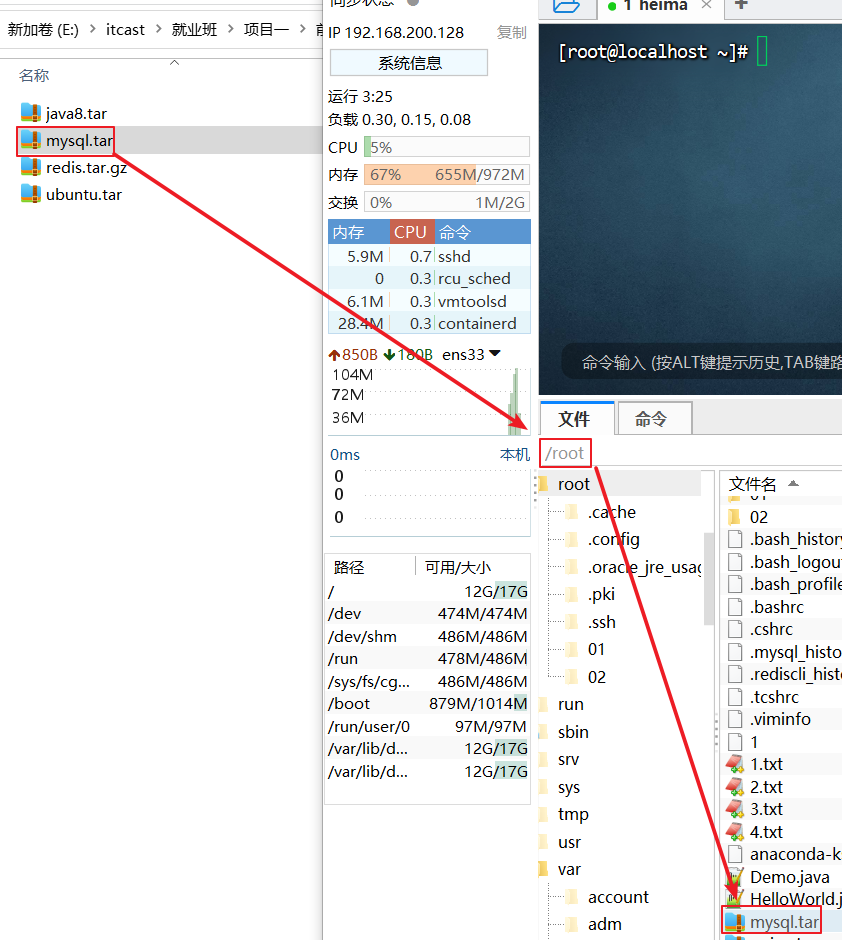

> docker load -i mysql.tar

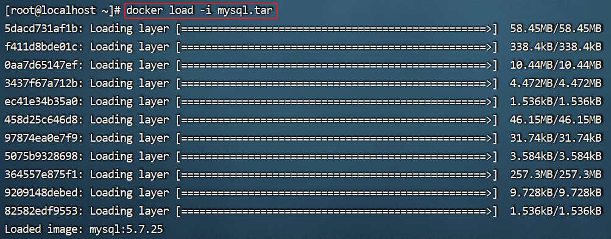

> 查看镜像： docker images

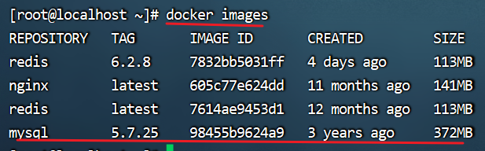


2）创建目录/tmp/mysql/data

> mkdir -p /tmp/mysql/data
>
> 说明：-p表示创建多级目录

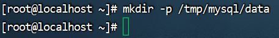

3）去

[DockerHub]: https://hub.docker.com/

查阅资料，创建并运行MySQL容器，要求：

① 挂载/tmp/mysql/data到mysql容器内数据存储目录

> 说明：mysql的data目录是我们平常经常容易修改的目录，因此我们将容器中的data目录挂载到宿主机的本地目录

② 设置MySQL密码

```shell
docker run --restart=always -p 3306:3306 --name mysql -v /tmp/mysql/data:/var/lib/mysql  -e MYSQL_ROOT_PASSWORD=1234 -d mysql:5.7.25

说明：
	1.--restart=always 表示当Docker重启时，当前mysql容器总是重启容器.如果不加，docker重启，mysql不会重启
	2.-p 3306:3306 ：port ，冒号前面的表示宿主机的端口号，冒号右边的表示mysql容器端口号
	3.--name mysql 表示当前的容器名
	4.-v /tmp/mysql/data:/var/lib/mysql
		1)-v [宿主机目录]:[容器内目录] 
		2)/tmp/mysql/data 表示宿主机目录
		3)/var/lib/mysql 表示data在容器中的位置，这个目录是通过dockerhub官方查看的
```

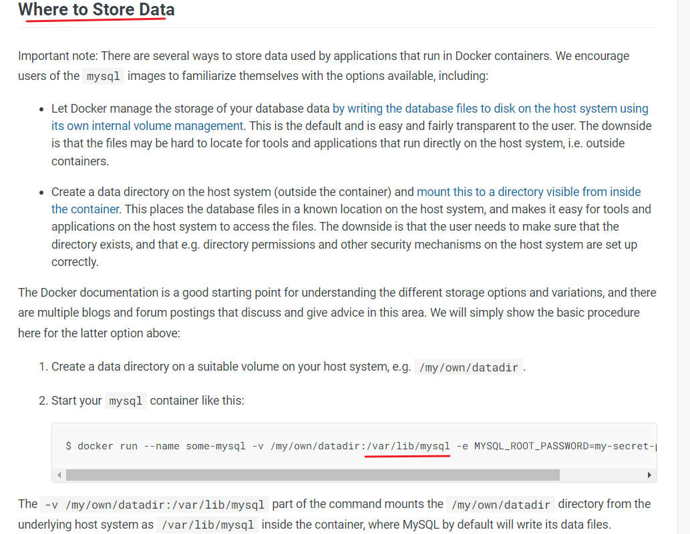


~~~shell
	5.-e：表示environment环境变量的意思
	6.-d：表示后台运行
	7.mysql:5.7.25  表示mysql镜像名
	
~~~

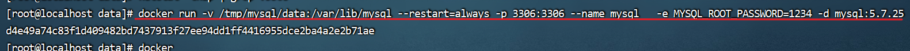

> 注意：
>
> ​	1.如果启动报错，有可能是端口号冲突，此时可以执行命令 systemctl stop mysqld。停止之前开启的mysql服务。
>
> ​	2.删除之前创建的mysql容器：docker rm mysql

查看mysql容器是否启动：


使用mysql客户端datagrip访问下：

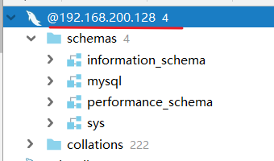


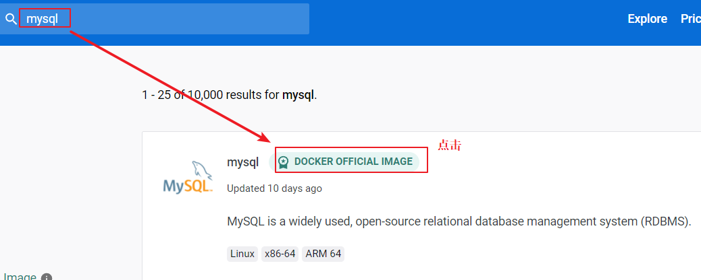

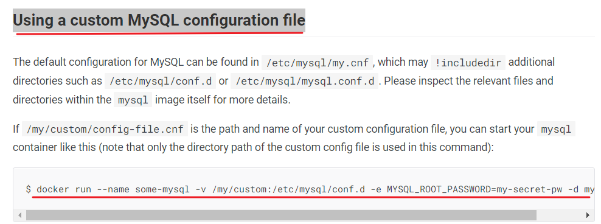

补充：

> 1.netstat -tnlp | grep :3306 属于linux系统命令查看3306端口号是否被占用
>
> 2.service mysqld stop 停止mysql服务


### 2.3.7.小结

docker run的命令中通过 -v 参数挂载文件或目录到容器中：

- -v volume名称:容器内目录
- -v 宿主机文件:容器内文
- -v 宿主机目录:容器内目录

数据卷挂载与目录直接挂载的

- 数据卷挂载耦合度低，由docker来管理目录，但是目录较深，不好找
- 目录挂载耦合度高，需要我们自己管理目录，不过目录容易寻找查看


# 3.Dockerfile自定义镜像(理解)

之前学习的镜像都是DockerHub官方制作的镜像，我们在实际开发中自己写的代码是否可以让DockerHub官方帮助我们制作镜像呢?

显然是不能的，我们不能把公司代码交给DockerHub官方来制作镜像，主要是不安全。所以在实际开发中，我们自己写的代码一定要自己制作镜像。

而要自定义镜像，就必须先了解镜像的结构才行。

## 3.1.镜像结构

镜像是将应用程序及其需要的系统函数库、环境、配置、依赖打包而成。

我们以MySQL为例，来看看镜像的组成结构：


简单来说，镜像就是在系统函数库、运行环境基础上，添加应用程序文件、配置文件、依赖文件等组合，然后编写好启动脚本打包在一起形成的文件。


我们要构建镜像，其实就是实现上述打包的过程。


## 3.2.Dockerfile语法

构建自定义的镜像时，并不需要一个个文件去拷贝，打包。

我们只需要告诉Docker，我们的镜像的组成，需要哪些BaseImage、需要拷贝什么文件、需要安装什么依赖、启动脚本是什么，将来Docker会帮助我们构建镜像。

而描述上述信息的文件就是Dockerfile文件。

**Dockerfile**就是一个文本文件，其中包含一个个的**指令(Instruction)**，用指令来说明要执行什么操作来构建镜像。每一个指令都会形成一层Layer。


更新详细语法说明，请参考官网文档： https://docs.docker.com/engine/reference/builder


## 3.3.构建Java项目


### 3.3.1.基于Ubuntu构建Java项目

需求：基于Ubuntu镜像构建一个新镜像，运行一个java项目

- 步骤1：新建一个空文件夹docker-demo

  

  

- 步骤2：拷贝课前资料中的docker-demo.jar文件到docker-demo这个目录

  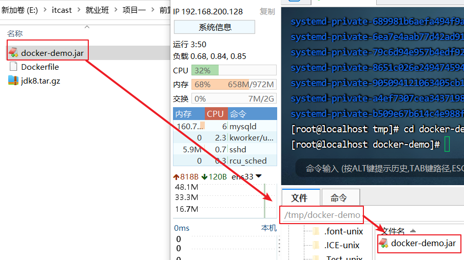

  

- 步骤3：拷贝课前资料中的jdk8.tar.gz文件到docker-demo这个目录

  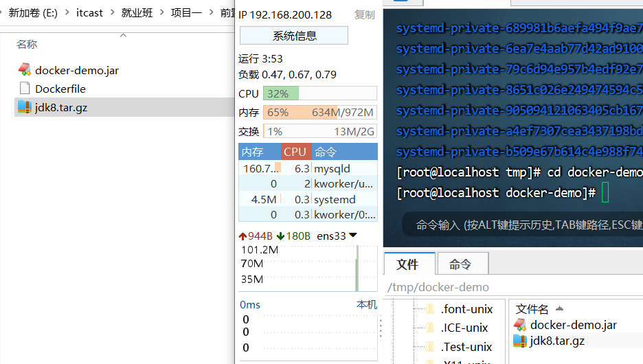

  

- 步骤4：拷贝课前资料提供的Dockerfile到docker-demo这个目录

  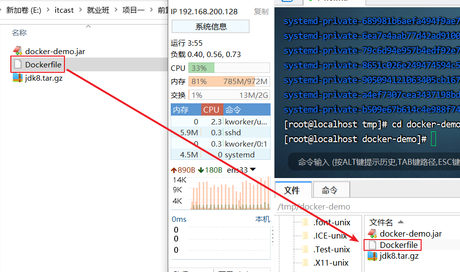

  

  其中的内容如下：

  ```dockerfile
  # 指定基础镜像
  FROM ubuntu:16.04
  # 配置环境变量，JDK的安装目录
  ENV JAVA_DIR=/usr/local
  
  # 拷贝jdk和java项目的包
  COPY ./jdk8.tar.gz $JAVA_DIR/
  COPY ./docker-demo.jar /tmp/app.jar
  
  # 安装JDK
  RUN cd $JAVA_DIR \
   && tar -xf ./jdk8.tar.gz \
   && mv ./jdk1.8.0_144 ./java8
  
  # 配置环境变量
  ENV JAVA_HOME=$JAVA_DIR/java8
  ENV PATH=$PATH:$JAVA_HOME/bin
  
  # 暴露端口
  EXPOSE 8090
  # 入口，java项目的启动命令
  ENTRYPOINT java -jar /tmp/app.jar
  ```

- 步骤5：切换到docker-demo

  将准备好的docker-demo上传到虚拟机任意目录，然后进入docker-demo目录下

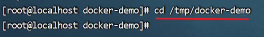


- 步骤6：运行命令：

  ```markdown
  docker build -t javaweb:1.0 .
  	说明:
  		1.docker build 表示构建
  		2.-t:t的全称是tag表示版本
  		3.javaweb:1.0 ：镜像组成格式  repository:版本  javaweb表示repository，属于标识符，随便定义
  		4. 在版本即1.0后面一定加空格然后书写点，点表示在当前目录执行Dockerfile文件
  ```

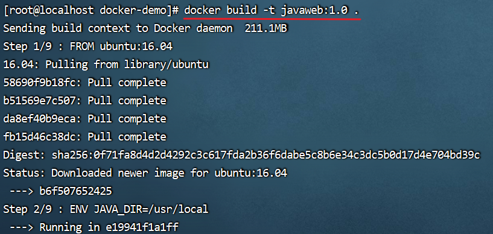

- 查看镜像

  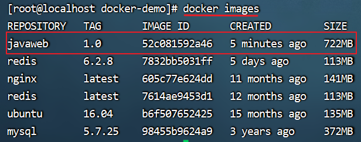


- 构建容器：

```shell
docker run --name myWeb1.0 -p 8090:8090 -d javaweb:1.0
```

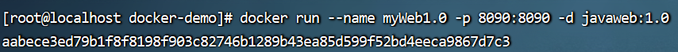

- 查看启动的容器

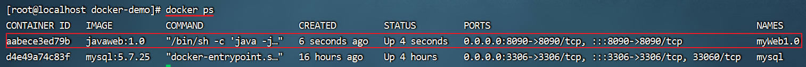


- 最后访问 http://192.168.200.128:8090/hello/count，其中的ip改成你的虚拟机ip

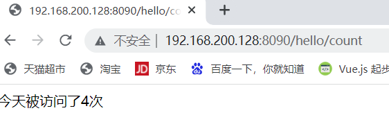

### 3.3.2.基于java8构建Java项目

虽然我们可以基于Ubuntu基础镜像，添加任意自己需要的安装包，构建镜像，但是却比较麻烦。所以大多数情况下，我们都可以在一些安装了部分软件的基础镜像上做改造。

例如，构建java项目的镜像，可以在已经准备了JDK的基础镜像基础上构建。

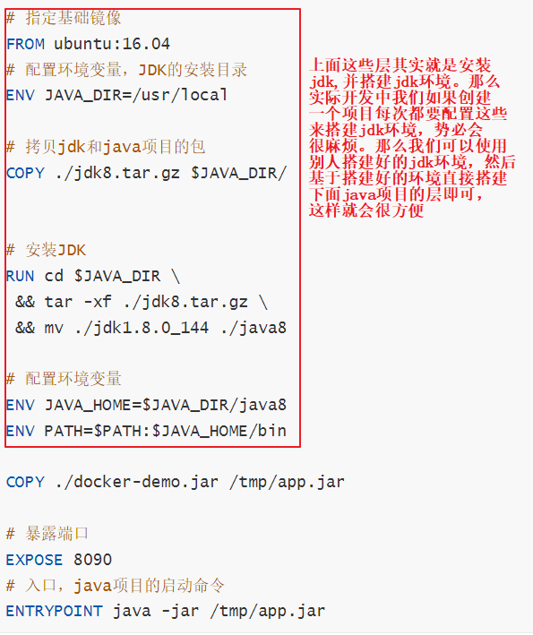

**需求：**基于java:8-alpine镜像，将一个Java项目构建为镜像

实现思路如下：

- ① 在tmp目录下在新建一个空的目录docker-demo02

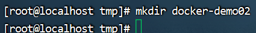

- ② 拷贝课前资料提供的docker-demo.jar到这个目录中

- ③ 然后在目录中新建一个文件，命名为Dockerfile，编写Dockerfile文件：

  - a ）基于java:8-alpine作为基础镜像

  - b ）将docker-demo.jar拷贝到镜像中

  - c ）暴露端口

  - d ）编写入口ENTRYPOINT

    内容如下：

    ```dockerfile
    FROM java:8-alpine
    COPY ./docker-demo.jar /tmp/app.jar
    # 暴露端口
    EXPOSE 8090
    # 入口，java项目的启动命令
    ENTRYPOINT java -jar /tmp/app.jar
    ```

  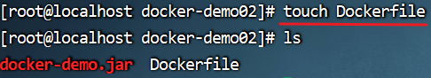

  

- ④ 使用docker build命令构建镜像

  ~~~markdown
  docker build -t javaweb:2.0 .
  ~~~

- ⑤停止之前启动的容器myWeb1.0，否则端口号冲突

  ~~~markdown
  docker stop myWeb1.0
  ~~~

- ⑥ 使用docker run创建容器并运行

~~~markdown
docker run --name myWeb2.0 -p 8090:8090 -d javaweb:2.0
~~~

- ⑦浏览器访问

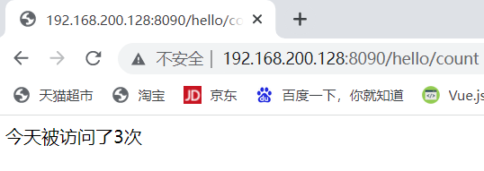


## 3.4.小结

小结：

1. Dockerfile的本质是一个文件，通过指令描述镜像的构建过程

2. Dockerfile的第一行必须是FROM，从一个基础镜像来构建

3. 基础镜像可以是基本操作系统，如Ubuntu。也可以是其他人制作好的镜像，例如：java:8-alpine


# 4.Docker-Compose

通过我们上述学习，对于每个应用都是手动创建和运行容器，那么实际开发中小一点的公司几十个应用，大一点公司几百个应用，而如果一个一个手动部署，效率会比较低也比较麻烦。因此我们可以学习下面的技术Docker-Compose来解决。

Docker Compose可以基于Compose文件帮我们快速的部署分布式应用，而无需手动一个个创建和运行容器！


## 4.1.初识DockerCompose

Compose文件是一个文本文件，通过指令定义集群中的每个容器如何运行。格式如下：

```json
version: "3.8"
 services:
  mysql:
    image: mysql:5.7.25
    environment:
     MYSQL_ROOT_PASSWORD: 123 
    volumes:
     - "/tmp/mysql/data:/var/lib/mysql"
  web:
    build: .
    ports:
     - "8090:8090"

```

上面的Compose文件就描述一个项目，其中包含两个容器：

- mysql：一个基于`mysql:5.7.25`镜像构建的容器，并且挂载了1个目录
- web：一个基于`docker build`临时构建的镜像容器，映射端口时8090

DockerCompose的详细语法参考官网：https://docs.docker.com/compose/compose-file/

其实DockerCompose文件可以看做是将多个docker run命令写到一个文件，只是语法稍有差异。

补充:以前执行命令创建镜像和容器方式：

~~~markdown
docker run --restart=always -p 3306:3306 --name mysql -v /tmp/mysql/data:/var/lib/mysql  -e MYSQL_ROOT_PASSWORD=1234 -d mysql:5.7.25

docker build -t javaweb:1.0 .
~~~


## 4.2.安装DockerCompose

参考课前资料

## 4.3.部署应用(这里简单实现就好，后期学习微服务会多个微服务部署) 课下完成

### 4.3.1.实现思路

【1】 查看  **资料\原始代码\docker-compose**文件夹，里面是已经编写好了docker-compose文件和项目

【2】修改docker-compose的配置文件docker-compose.yml变为自己当前的环境配置参数

【3】将docker-compose目录上传到虚拟机中的/tmp目录下面

【4】切换到docker-compose目录下即docker-compose.yml文件所在位置

【5】查看之前启动的容器并全部删除

【6】停止mysql服务

【7】执行命令 docker-compose up -d 批量构建容器，并启动

【8】使用浏览器访问项目

【9】使用mysql客户端datagrip访问mysql服务


### 4.3.2.具体实现

【1】 查看  **资料\原始代码\docker-compose**文件夹，里面是已经编写好了docker-compose文件和项目

【2】修改docker-compose的配置文件docker-compose.yml变为自己当前的环境配置参数

~~~yaml
# DockerCompose的版本是3.2
version: "3.2"
# DockerCompose启动时启动的服务(应用)，一共启动2个服务
services:
  # 基于已有的镜像image: mysql:5.7.25去创建mysql容器
  mysql:
    # 你的虚拟机镜像应该是mysql:5.7.25。这里基于你的mysql镜像创建容器
    image: mysql:5.7.25
    container_name: mysql_container
    environment:
      MYSQL_ROOT_PASSWORD: 1234
    volumes:
      - "/tmp/mysql/data:/var/lib/mysql"
      - "/tmp/mysql/conf/my.cnf:/etc/mysql/conf.d/my.cnf"
    ports:
      - "3306:3306"
  # 自己构建镜像然后创建容器
  myweb:
    # 找到当前目录下myweb-service下面的Dockerfile然后构建镜像
    build: ./myweb-service
    # 镜像名是 myweb:3.0
    image: myweb:3.0
    container_name: myweb_container
    ports:
      # 在浏览器访问项目的端口号是8082
      - "8082:8090"
~~~

【3】将docker-compose目录上传到虚拟机中的/tmp目录下面

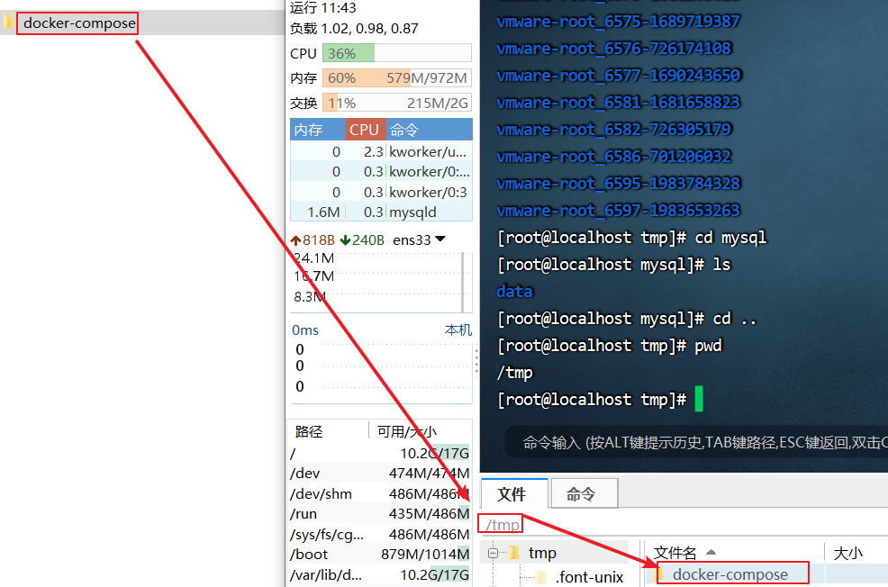

【4】切换到docker-compose目录下即docker-compose.yml文件所在位置

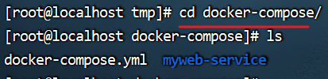

【5】查看之前启动的容器并全部删除

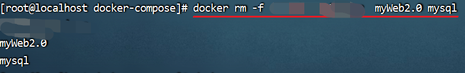

【6】停止mysql服务

> service mysqld stop

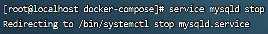

【7】执行命令 docker-compose up -d 批量构建容器，并启动

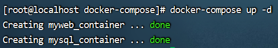

~~~markdown
# 利用DockerCompose部署,批量构建容器，并启动
# 说明:docker-compose up -d 以后台的方式运行容器.
# up表示创建和启动容器
# -d 表示后台
docker-compose up -d

~~~

【8】使用浏览器访问项目

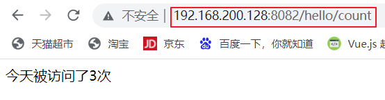

【9】使用mysql客户端datagrip访问mysql服务

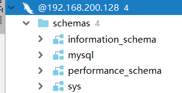


# 5.Docker镜像仓库 理解

## 5.1Docker镜像仓库介绍

我们之前学习了一些镜像，例如第三方的镜像mysql reids等，也有我们自己创建的镜像。那么这些镜像都需要管理和保存，管理和保存镜像的地方就叫镜像仓库（ Docker Registry ）。有公共的和私有的两种形式：

- 公共仓库：例如Docker官方的 [Docker Hub](https://hub.docker.com/)，国内也有一些云服务商提供类似于 Docker Hub 的公开服务，比如 [网易云镜像服务](https://c.163.com/hub)、[DaoCloud](https://hub.daocloud.io/)[ ](https://hub.daocloud.io/)[镜像服务](https://hub.daocloud.io/)、[阿里云镜像服务](https://cr.console.aliyun.com/)等。

- 私有仓库：除了使用公开仓库外，用户还可以在本地搭建私有 Docker Registry。企业自己的镜像最好是采用私有Docker Registry来实现。实际开发中我们一般都是自己搭建镜像仓库，因为将企业的项目的镜像上传到公共仓库不安全。


## 5.1.搭建私有镜像仓库

参考课前资料《CentOS7安装Docker.md》


## 5.2.推送、拉取镜像

推送镜像到私有镜像服务必须先tag(版本)，步骤如下：

① 重新tag本地镜像，名称前缀为私有仓库的地址：192.168.200.128:5000/

 ```sh
docker tag nginx:latest 192.168.200.128:5000/nginx:1.0 
 ```

说明：

> 1.nginx:latest 表示原来的镜像名和版本
>
> 2.192.168.200.128:5000 私有仓库的地址
>
> 3.nginx:1.0 ：新的镜像和版本

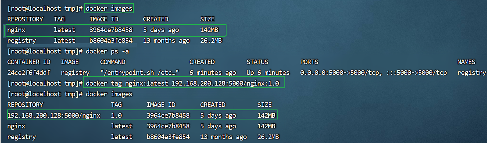


② 推送镜像

```shell
docker push 192.168.200.128:5000/nginx:1.0 
```

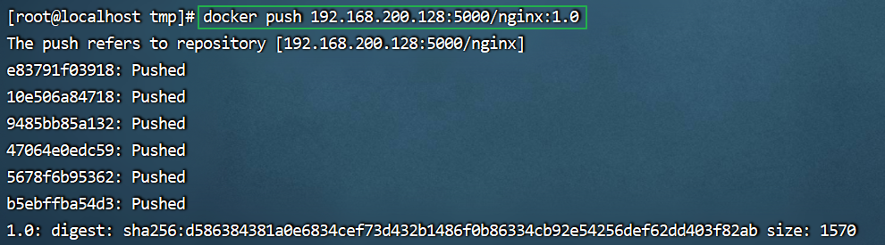

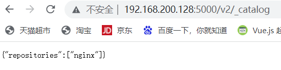

③ 拉取镜像

【1】先删除之前的镜像

~~~markdown
docker rmi 192.168.200.128:5000/nginx:1.0 nginx:latest
~~~

【2】在拉取新的镜像

```sh
docker pull 192.168.200.128:5000/nginx:1.0 
```

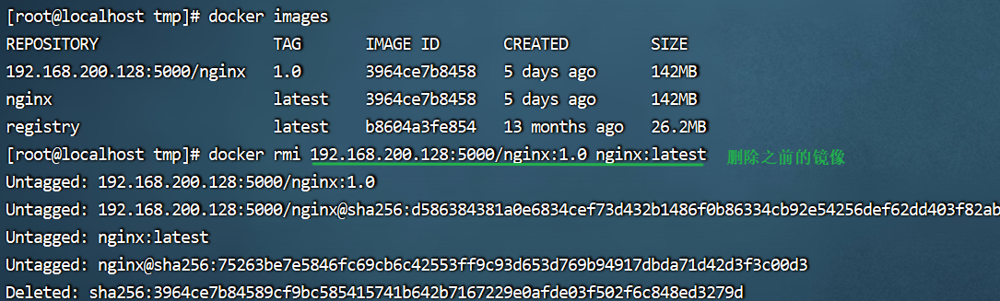

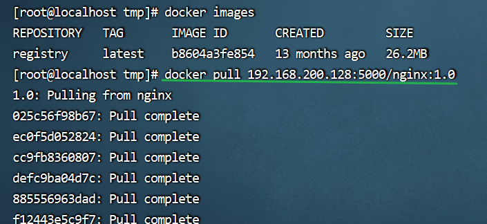
