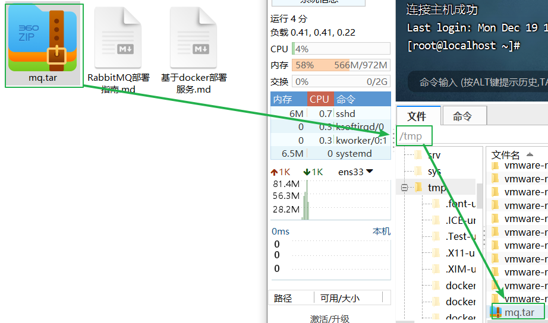
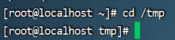
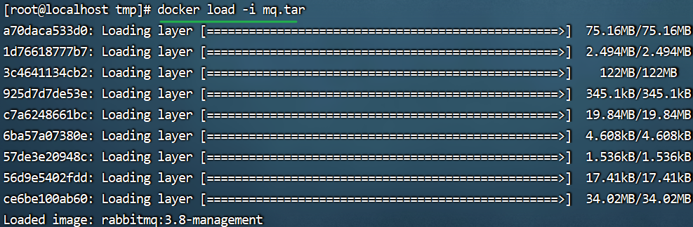
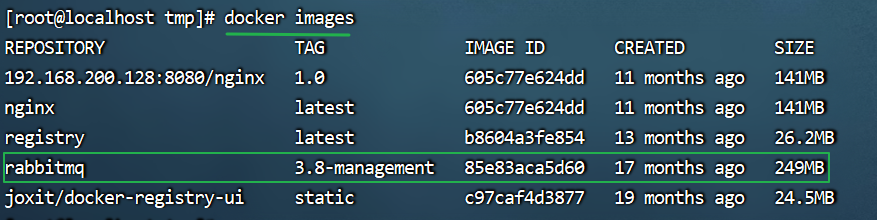
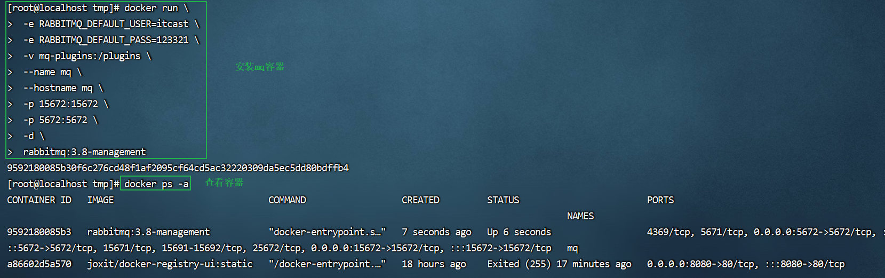
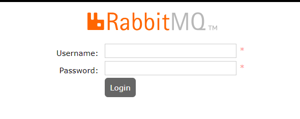
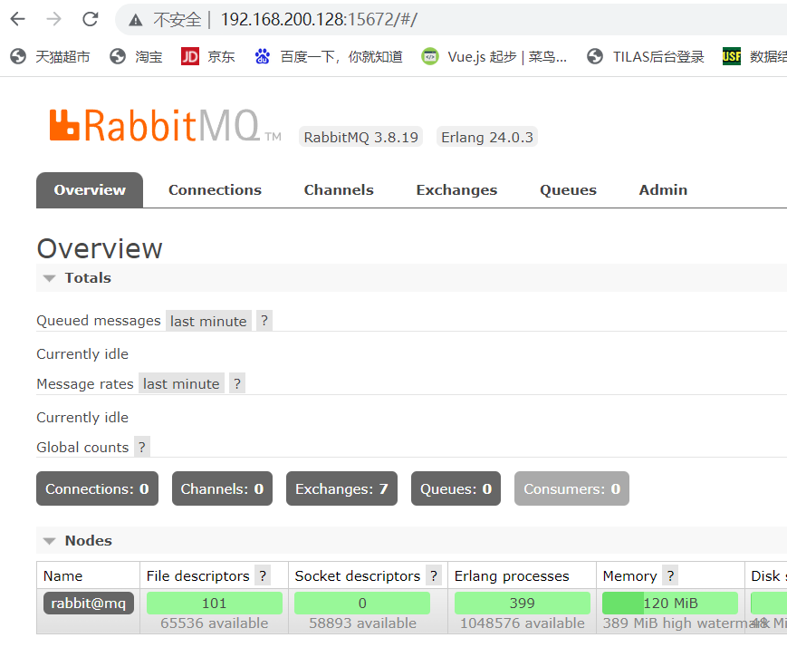

# RabbitMQ部署指南

# 1.单机部署

我们在Centos7虚拟机中使用Docker来安装。

## 1.1.下载镜像

方式一：在线拉取

``` sh
docker pull rabbitmq:3.8-management
```

**方式二：从本地加载(推荐使用这种)**

在课前资料已经提供了镜像包：

 

【1】将该镜像包上传到虚拟机的tmp目录




【2】上传到虚拟机中后，切换到存放mq.tar文件的tmp的目录



【3】切换目录后使用命令加载镜像即可：

```sh
docker load -i mq.tar
```



【4】查看镜像



## 1.2.安装MQ

执行下面的命令来运行MQ容器：

~~~shell
docker run \
 # 设置环境变量  用户名是 itcast
 -e RABBITMQ_DEFAULT_USER=itcast \
 # 设置环境变量  密码是 123321
 -e RABBITMQ_DEFAULT_PASS=123321 \
 # 挂载数据卷，后面高级会用到下面的插件
 -v mq-plugins:/plugins \
 # mq的名字
 --name mq \
 # 主机名 这里不配置也可以，后期如果是集群必须配置
 --hostname mq \
 # web可视化终端监控端口；mq的ui界面管理平台端口
 -p 15672:15672 \
 # 程序与mq交互的访问端口；发消息和收消息的端口
 -p 5672:5672 \
 # 后端运行
 -d \
 # 镜像名称
 rabbitmq:3.8-management
~~~

```sh
docker run \
 -e RABBITMQ_DEFAULT_USER=itcast \
 -e RABBITMQ_DEFAULT_PASS=123321 \
 -v mq-plugins:/plugins \
 --name mq \
 --hostname mq \
 -p 15672:15672 \
 -p 5672:5672 \
 -d \
 rabbitmq:3.8-management
```

> 15672端口：web可视化终端监控端口；mq的ui界面管理平台端口
>
> 5672端口：程序与mq交互的访问端口；发消息和收消息的端口



访问路径：http://192.168.200.128:15672/

> 注意:192.168.200.128是你的linux系统的ip地址。





> 注意：访问阻塞，则尝试重启mq服务 或者重启docker服务；
>
> 重启[rabbitmq](https://so.csdn.net/so/search?q=rabbitmq&spm=1001.2101.3001.7020)服务通过两个命令来实现：
> `rabbitmqctl stop` ：停止rabbitmq
> `rabbitmq-server restart` : 重启rabbitmq

