# day03-股票数据表报与导出

## 目标

1. 理解涨幅榜业务需求;
2. 理解涨停跌停概念，并涨停跌停基本实现;
3. 理解涨停跌停SQL分析流程，并根据接口文档自定义实现;
4. 理解echarts基本使用;
5. 掌握easyExcel基本使用,并实现涨幅榜数据导出功能;

# 第一章 股票涨幅统计

## 1、涨幅榜更多数据功能实现

### 1.1 涨幅榜更多数据功能分析

#### 1.1.1 原型效果

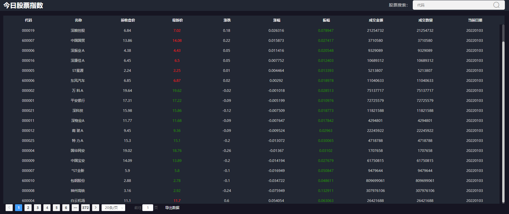

#### 1.1.2 涨幅榜分页查询功能分析

功能描述：分页查询最新股票交易时间点下沪深两市个股行情数据，并根据涨幅降序排序展示

服务路径：/api/quot/stock/all
服务方法：GET
请求参数：

| 参数说明 | 参数名称     | 是否必须  | 数据类型    | 备注     |
| :--- | -------- | ----- | ------- | ------ |
| 当前页  | page     | false | Integer | 默认值：1  |
| 每页大小 | pageSize | false | Integer | 默认值：20 |

响应数据格式：

~~~json
{
    "code": 1,
    "data": {
        "totalRows": 46750,//总行数
        "totalPages": 4675,//总页数
        "pageNum": 2,//当前页
        "pageSize": 10,//每页大小
        "size": 10,//当前页大小
        "rows": [
            {
                "tradeAmt": 4594802,//交易量
                "preClosePrice": 18.78,//前收盘价
                "amplitude": 0.059638,//振幅
                "code": "000004",//股票编码
                "name": "国华网安",//股票名称
                "curDate": "2021-12-30 10:20",//当前日期
                "tradeVol": 4594802,//交易金额
                "increase": 0.039936,//涨跌
                "upDown": 0.75,//涨幅
                "tradePrice": 19.53//当前价格
            },
           //省略......
        ]
    }
}
~~~

> 说明：
>
> 1.项目第一天已配置好PageHelper分页插件；
>
> 2.相关参数：
>
> ​	涨跌：当前价-前收盘价
> ​	涨幅：（当前价-前收盘价）/ 前收盘价 * 100%
> ​	振幅：（最高成交价-最低成交价）/ 前收盘价 * 100%

####  1.1.3 实体类封装

**1）查询记录实体封装**

在stock_common工程下封装查询行记录数据：

~~~java
package com.itheima.stock.pojo.domain;

import com.fasterxml.jackson.annotation.JsonFormat;
import lombok.AllArgsConstructor;
import lombok.Builder;
import lombok.Data;
import lombok.NoArgsConstructor;

import java.math.BigDecimal;
import java.util.Date;

/**
 * @author by itheima
 * @Date 2022/2/28
 * @Description 股票涨跌信息
 */
@Data
@NoArgsConstructor
@AllArgsConstructor
@Builder
public class StockUpdownDomain {

    private String code;

    private String name;

    private BigDecimal preClosePrice;

    private BigDecimal tradePrice;

    private BigDecimal increase;

    private BigDecimal upDown;

    private BigDecimal amplitude;

    private Long tradeAmt;

    private BigDecimal tradeVol;

    /**
     * 日期
     */
    @JsonFormat(pattern = "yyyy-MM-dd HH:mm")
    private Date curDate;
}
~~~

**2）封装分页实体类**

分页实体类是前端响应对象，我们维护到stock_backend工程下即可；

分页实体对象的数据来自分页PageInfo对象，所以我们在构造器中传入PageInfo直接转化即可：

~~~java
package com.itheima.stock.vo.resp;

import com.github.pagehelper.PageInfo;
import lombok.Data;
import java.io.Serializable;
import java.util.List;

/**
 * 分页工具类
 */
@Data
public class PageResult<T> implements Serializable {
    /**
     * 总记录数
     */
    private Long totalRows;

    /**
     * 总页数
     */
    private Integer totalPages;

    /**
     * 当前第几页
     */
    private Integer pageNum;
    /**
     * 每页记录数
     */
    private Integer pageSize;
    /**
     * 当前页记录数
     */
    private Integer size;
    /**
     * 结果集
     */
    private List<T> rows;

    /**
     * 分页数据组装
     * @param pageInfo
     * @return
     */
    public PageResult(PageInfo<T> pageInfo) {
        totalRows = pageInfo.getTotal();
        totalPages = pageInfo.getPages();
        pageNum = pageInfo.getPageNum();
        pageSize = pageInfo.getPageSize();
        size = pageInfo.getSize();
        rows = pageInfo.getList();
    }
}
~~~

> 分页实体类维护到stock_backend下vo/resp下即可；
>
> 直接导入：day03\资料\后端资料\PageResult.java；

### 1.2 涨幅榜更多SQL分析

方式1：全表数据根据时间和涨幅降序排序

~~~sql
# 分析：统计国内A股股票的最新数据，根据涨幅排序取前4
# 方式1：根据日期和涨幅降序排序取前4即可
select 
	sri.trade_amount as tradeAmt,
	sri.pre_close_price as preClosePrice,
	(sri.max_price- sri.min_price)/sri.pre_close_price as amplitude,
	sri.stock_code as code,
	sri.stock_name as name,
	sri.cur_time   as curDate,
	sri.trade_volume as tradeVol,
	(sri.cur_price-sri.pre_close_price) as upDown,
	(sri.cur_price- sri.pre_close_price)/sri.pre_close_price as increase,
	sri.cur_price as tradePrice
from stock_rt_info as sri 
order by sri.cur_time desc,upDown desc
# 分析：存在的问题：全表排序查询开下太大，不适合大数据量的查询；
~~~

方式2：先根据最新股票交易时间点走索引查询，然后再根据涨幅排序

~~~sql
# 好处：走索引，避免全表排序查询，速度更快
select 
	sri.trade_amount as tradeAmt,
	sri.pre_close_price as preClosePrice,
	(sri.max_price- sri.min_price)/sri.pre_close_price as amplitude,
	sri.stock_code as code,
	sri.stock_name as name,
	sri.cur_time   as curDate,
	sri.trade_volume as tradeVol,
	(sri.cur_price-sri.pre_close_price) as upDown,
	(sri.cur_price- sri.pre_close_price)/sri.pre_close_price as increase,
	sri.cur_price as tradePrice
from stock_rt_info as sri 
where sri.cur_time='2021-12-30 09:42:00'
order by upDown desc
~~~


### 1.3 更多涨幅信息功能实现

#### 1.3.1 定义服务访问接口方法

~~~java
    /**
     * 分页查询股票最新数据，并按照涨幅排序查询
     * @param page
     * @param pageSize
     * @return
     */
    @GetMapping("/stock/all")
    public R<PageResult> getStockPageInfo(@RequestParam(name = "page",required = false,defaultValue = "1") Integer page,
                                          @RequestParam(name = "pageSize",required = false,defaultValue = "20") Integer pageSize){
            return stockService.getStockPageInfo(page,pageSize);
    }
~~~

#### 1.3.2 定义服务接口方法和实现

接口方法

~~~java
    /**
     * 分页查询股票最新数据，并按照涨幅排序查询
     * @param page
     * @param pageSize
     * @return
     */
    R<PageResult> getStockPageInfo(Integer page, Integer pageSize);
~~~

实现

~~~java
    /**
     * 分页查询股票最新数据，并按照涨幅排序查询
     * @param page
     * @param pageSize
     * @return
     */
    @Override
    public R<PageResult> getStockPageInfo(Integer page, Integer pageSize) {
        //1.设置PageHelper分页参数
        PageHelper.startPage(page,pageSize);
        //2.获取当前最新的股票交易时间点
        Date curDate = DateTimeUtil.getLastDate4Stock(DateTime.now()).toDate();
        //todo
        curDate= DateTime.parse("2022-06-07 15:00:00", DateTimeFormat.forPattern("yyyy-MM-dd HH:mm:ss")).toDate();
        //3.调用mapper接口查询
        List<StockUpdownDomain> infos= stockRtInfoMapper.getNewestStockInfo(curDate);
        if (CollectionUtils.isEmpty(infos)) {
            return R.error(ResponseCode.NO_RESPONSE_DATA);
        }
        //4.组装PageInfo对象，获取分页的具体信息,因为PageInfo包含了丰富的分页信息，而部分分页信息是前端不需要的
        //PageInfo<StockUpdownDomain> pageInfo = new PageInfo<>(infos);
//        PageResult<StockUpdownDomain> pageResult = new PageResult<>(pageInfo);
        PageResult<StockUpdownDomain> pageResult = new PageResult<>(new PageInfo<>(infos));
        //5.封装响应数据
        return R.ok(pageResult);
    }
~~~

#### 1.3.3 定义mapper接口方法和xml

在StockRtInfoMapper接口下定义：

~~~java
    /**
     * 查询指定时间点下股票的数据，并按照涨幅降序排序
     * @param curDate
     * @return
     */
    List<StockUpdownDomain> getNewestStockInfo(@Param("timePoint") Date curDate);
~~~

在StockRtInfoMapper.xml下定义绑定sql：

~~~xml
    <select id="getNewestStockInfo" resultType="com.itheima.stock.pojo.domain.StockUpdownDomain">
        select
            sri.trade_amount as tradeAmt,
            sri.pre_close_price as preClosePrice,
            (sri.max_price-sri.min_price)/sri.pre_close_price as amplitude,
            sri.stock_code as code,
            sri.stock_name as  name,
            sri.cur_time as curDate,
            sri.trade_volume as tradeVol,
            sri.cur_price-sri.pre_close_price as increase,
            (sri.cur_price-sri.pre_close_price) /pre_close_price as upDown,
            sri.cur_price as tradePrice
        from stock_rt_info as   sri
        where sri.cur_time=#{timePoint}
        order by upDown desc
    </select>
~~~

#### 1.3.4 web接口测试

- postman测试：http://127.0.0.1:8091/api/quot/stock/all?page=2&pageSize=10

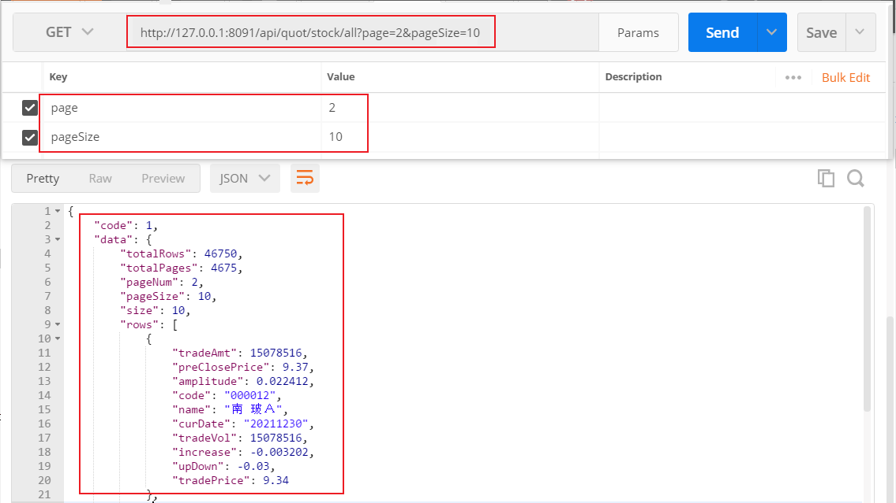

- 页面展示效果：

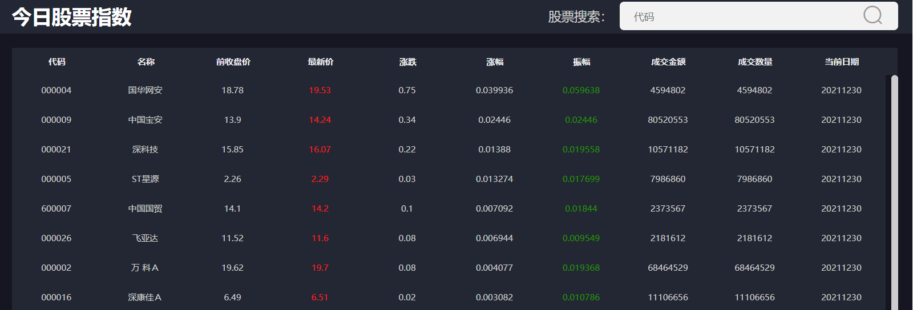


## 2、涨幅榜功能实现(作业)

### 2.1 股票涨幅榜功能分析

#### 2.1.1 涨幅榜原型效果

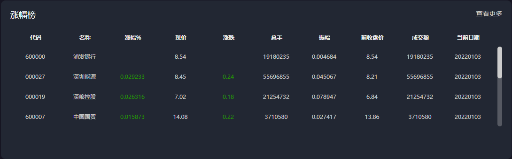

#### 2.1.2 股票表结构分析

表：stock_rt_info流水表：

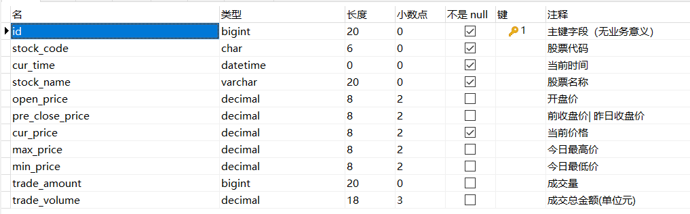

#### 2.1.3 涨幅榜功能分析

功能描述：统计沪深两市个股最新交易数据，并按涨幅降序排序查询前4条数据 
服务路径：/api/quot/stock/increase
服务方法：GET
前端请求频率：每分钟
请求参数：无

响应数据格式：

```json
{
    "code": 1,
    "data": [
        {
            "code": "000004",//股票编码
            "name": "国华网安",//股票名称
            "preClosePrice": 18.78,//前收盘价
            "tradePrice": 19.53//当前价格
             "tradeAmt": 4594802,//交易量
            "tradeVol": 4594802,//交易金额
            "increase": 0.039936,//涨跌
            "upDown": 0.75,//涨幅
            "amplitude": 0.059638,//振幅
            "curDate": "2021-12-30 10:30",//当前日期
        },
       //省略......
    ]
}
```


## 3.涨停跌停数据统计功能

### 3.1 涨跌停数据统计业务分析

#### 3.1.1 涨跌停原型效果

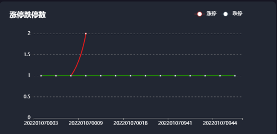

> 说明：
>
> A股市场有涨幅±10%限制；
>
> 股票是否涨停和跌停并不以我们的统计结果为基准，而是由证券交易所来确定，可能真实情况是涨幅超过10%或者低于-10%；

#### 3.1.2 涨停跌停接口说明

功能描述：统计沪深两市T日(当前股票交易日)每分钟达到涨跌停股票的数据 

​		   注意：如果不在股票的交易日内，则统计最近的股票交易日下的数据

服务路径：/api/quot/stock/updown/count
服务方法：GET
前端请求频率：每分钟
请求参数：无

响应数据格式：

~~~json
{
    "code": 1,
    "data": {
        "upList": [
            {
                "count": 1,//涨停数量
                "time": "202112311412"//当天分时
            },
           {
                "count": 3,//涨停数量
                "time": "202112311413"//当天分时
            },
          	//省略......
        ],
        "downList": [
            {
                "count": 2,//跌停数量
                "time": "202112310925"//当天分时
            },
			//省略......
        ]
    }
}
~~~

>  总之，业务要求获取最新交易日下每分钟达到涨跌停数股票的数量；
>
>  关于SQL日期函数，详见：今日指数资料\V3\day03-股票数据报表与导出\资料\预习基础知识点\SQL日期函数.md

### 3.2 T日涨跌停统计SQL分析

#### 3.2.1 SQL分析思路

~~~sql
# 1.以统计当前股票交易日下，每分钟对应的涨停数量为例
# 思考：涨停与涨幅有关，但是我们的股票流水表中没有涨幅的数据，需要自己去就是那
# 1.先统计指定日期下（开盘时间点到最新时间点）涨幅达到涨停的数据
# 查询后的条件过滤，使用关键字：having
select
    (sri.cur_price-sri.pre_close_price)/sri.pre_close_price as ud,
    sri.cur_time as time
from stock_rt_info sri
where sri.cur_time BETWEEN '2022-01-06 09:30:00' and '2022-01-06 14:25:00'
having ud>=0.1;

# 2.将上述结果作为一张表，然后根据time时间分组，统计出每分钟对应的数量，而这个数量就是涨停的数量
select
   tmp.time,
   count(*) as count
from () as tmp
group by tmp.time;
# 填充sql
select
   tmp.time,
    count(*) as count
from (select
    (sri.cur_price-sri.pre_close_price)/sri.pre_close_price as ud,
    sri.cur_time as time
from stock_rt_info sri
where sri.cur_time BETWEEN '2022-01-06 09:30:00' and '2022-01-06 14:25:00'
having ud>=0.1) as tmp
group by tmp.time
order by tmp.time asc;

# 跌停
select
    date_format(tmp.time,'%Y%m%d%H%i') as time ,
    count(*) as count
from (select
    (sri.cur_price-sri.pre_close_price)/sri.pre_close_price as ud,
    sri.cur_time as time
from stock_rt_info sri
where sri.cur_time BETWEEN '2022-01-06 09:30:00' and '2022-01-06 14:25:00'
having ud<=-0.1) as tmp
group by tmp.time
order by tmp.time asc;
~~~

#### 3.2.2 查询数据组装思路

- 涨跌停数据包含了涨停统计数据和跌停统计数据，而每个数据组中的元素又仅仅包含时间和数量，这些数据是高度聚合得出的结果，所以我们可以把每组数据封装到map下，数据类型为：Map<String,List<Map>>
- 涨停统计SQL和跌停统计的SQL除了条件外，结构是一致的，我们可定义一个flag标识，mapper中传入时，0代表涨停，1代表跌停；


### 3.3 T日涨跌停统计功能实现

#### 3.3.1 定义访问接口

~~~java
    /**
     * 统计最新交易日下股票每分钟涨跌停的数量
     * @return
     */
    @GetMapping("/stock/updown/count")
    public R<Map> getStockUpdownCount(){
        return stockService.getStockUpdownCount();
    }
~~~

#### 3.3.2 定义服务接口方法与实现

服务接口定义：

~~~java
    /**
     * 统计最新交易日下股票每分钟涨跌停的数量
     * @return
     */
    R<Map> getStockUpdownCount();
~~~

方法实现：

~~~java
    /**
     * 统计最新交易日下股票每分钟涨跌停的数量
     * @return
     */
    @Override
    public R<Map> getStockUpdownCount() {
        //1.获取最新的交易时间范围 openTime  curTime
        //1.1 获取最新股票交易时间点
        DateTime curDateTime = DateTimeUtil.getLastDate4Stock(DateTime.now());
        Date curTime = curDateTime.toDate();
        //TODO
        curTime= DateTime.parse("2022-01-06 14:25:00", DateTimeFormat.forPattern("yyyy-MM-dd HH:mm:ss")).toDate();
        //1.2 获取最新交易时间对应的开盘时间
        DateTime openDate = DateTimeUtil.getOpenDate(curDateTime);
        Date openTime = openDate.toDate();
        //TODO
        openTime= DateTime.parse("2022-01-06 09:30:00", DateTimeFormat.forPattern("yyyy-MM-dd HH:mm:ss")).toDate();
        //2.查询涨停数据
        //约定mapper中flag入参： 1-》涨停数据 0：跌停
        List<Map> upCounts=stockRtInfoMapper.getStockUpdownCount(openTime,curTime,1);
        //3.查询跌停数据
        List<Map> dwCounts=stockRtInfoMapper.getStockUpdownCount(openTime,curTime,0);
        //4.组装数据
        HashMap<String, List> mapInfo = new HashMap<>();
        mapInfo.put("upList",upCounts);
        mapInfo.put("downList",dwCounts);
        //5.返回结果
        return R.ok(mapInfo);
    }
~~~

#### 3.3.3 mapper接口方法定义与xml

Mapper接口定义：

~~~java
    /**
     * 查询指定时间范围内每分钟涨停或者跌停的数量
     * @param openTime 开始时间
     * @param curTime 结束时间 一般开始时间和结束时间在同一天
     * @param flag 约定:1->涨停 0:->跌停
     * @return
     */
    List<Map> getStockUpdownCount(@Param("openTime") Date openTime, @Param("curTime") Date curTime, @Param("flag") int flag);
~~~

xml定义：

~~~xml
    <select id="getStockUpdownCount" resultType="map">
        select
            date_format(tmp.time,'%Y%m%d%H%i') as time ,
            count(*) as count
        from (select
                    (sri.cur_price-sri.pre_close_price)/sri.pre_close_price as ud,
                    sri.cur_time as time
              from stock_rt_info sri
              where sri.cur_time BETWEEN #{openTime} and #{curTime}
             having ud
             <if test="flag==1">
                 >=0.1
             </if>
             <if test="flag==0">
                 &lt;=-0.1
             </if>
             )
       as tmp
        group by tmp.time
        order by tmp.time asc
    </select>
~~~

#### 3.3.4 web接口测试

- postman测试地址：http://localhost:8091/api/quot//stock/updown/count

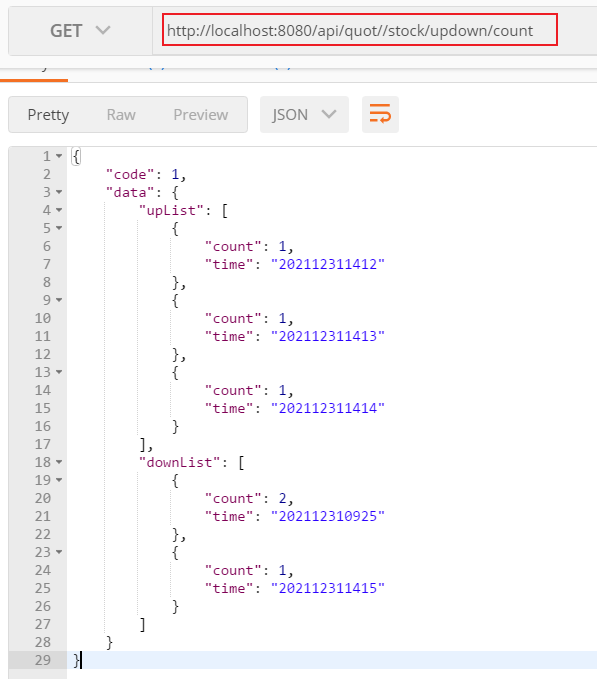


# 第二章 EchartJs报表展示

## 1、Echarts介绍

我们当前项目下的图形报表是使用echarts实现，所以接下来我们学习下echart的基本使用。

echarts Apache官网：https://echarts.apache.org/zh/index.html

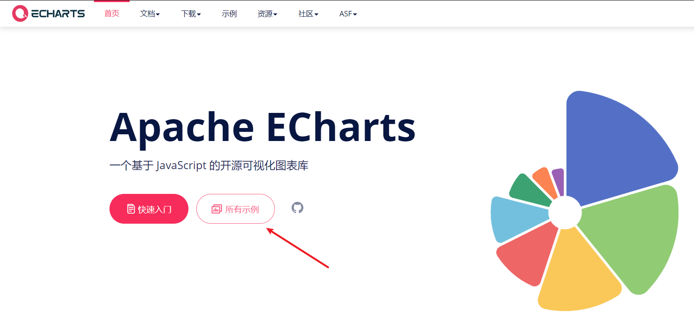

点击所有示例，可快速学习echarts的基本使用：

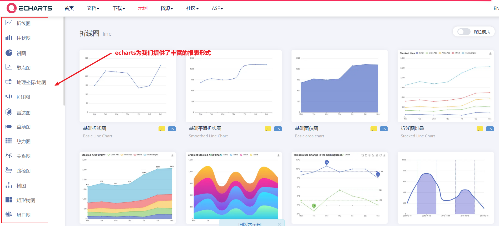

我们以折线图为例，演示echarts的基本使用：

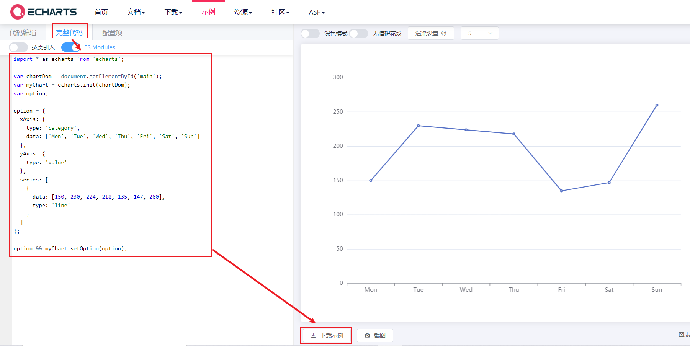

>  我们发现对于不同的图形展示方式，只需提供x轴和y轴数据即可；

## 2、Vue整合Echarts快速入门

### 2.1 Vue架手架安装echarts

**1) 打开Vue脚手架工程**

​	vscode打开: **day03\资料\echart_vue_project** 工程，启动命令：npm run serve

**2)工程安装echarts依赖**

​	运行安装命令：npm install echarts -S

说明：-D：仅仅用于开发环境  -S：既用于开发环境，又可用于生产环境

命令执行完毕后，我们发现工程package.json文件下已经引入了echarts依赖：

~~~json
  "dependencies": {
    "core-js": "^3.6.5",
    "echarts": "^5.2.2",
    "vue": "^2.6.11"
  }
~~~

### 2.2 配置echarts

在main.js入口文件下引入echarts,并将echarts对象挂在Vue对象下；

~~~js
import Vue from 'vue'
import App from './App.vue'
//引入echarts对象
import * as echarts from 'echarts'

Vue.config.productionTip = false

//挂在在Vue全局对象下
Vue.prototype.$echarts=echarts
new Vue({
  render: h => h(App),
}).$mount('#app')
~~~

### 2.3 vue使用echarts

在App.vue组件下添加echarts视图资源：

~~~vue
<template>
  <div id="app" >
    <h1>echartjs入门</h1>
    <div ref="echartDiv" :style="{width: '100%', height: '500px'}"></div>
  </div>
</template>

<script>

export default {
  name: 'App',
  methods:{
    drawLine(){
           this.myChart = this.$echarts.init(this.$refs.echartDiv);
           let eOption = {
              xAxis: {
                type: 'category',
                data: ['Mon', 'Tue', 'Wed', 'Thu', 'Fri', 'Sat', 'Sun']
              },
            yAxis: {
              type: 'value'
            },
            series: [
              {
                data: [150, 230, 224, 218, 135, 147, 260],
                type: 'line'
              }
            ]
    };
    this.myChart.setOption(eOption);
    }
  },
  mounted(){
    this.drawLine();
  }
}
</script>

<style>
#app {
  font-family: Avenir, Helvetica, Arial, sans-serif;
  -webkit-font-smoothing: antialiased;
  -moz-osx-font-smoothing: grayscale;
  text-align: center;
  color: #2c3e50;
  margin-top: 60px;
}
</style>
~~~

### 2.4 页面效果

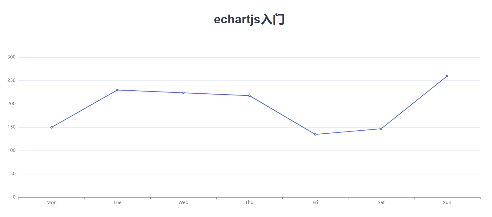

## 3、项目中Echarts的使用

### 3.1 配置和使用流程说明

我们当前项目的前端也是同样的使用方式，在package.json中已经引入了echart依赖：

~~~json
  "dependencies": {
    "echarts": "^4.7.0",
   	//省略.......
  }   
~~~

main.js中也已经引入echarts:

~~~js
import echarts from 'echarts'
Vue.prototype.$echarts = echarts
~~~

home组件下使用echarts：

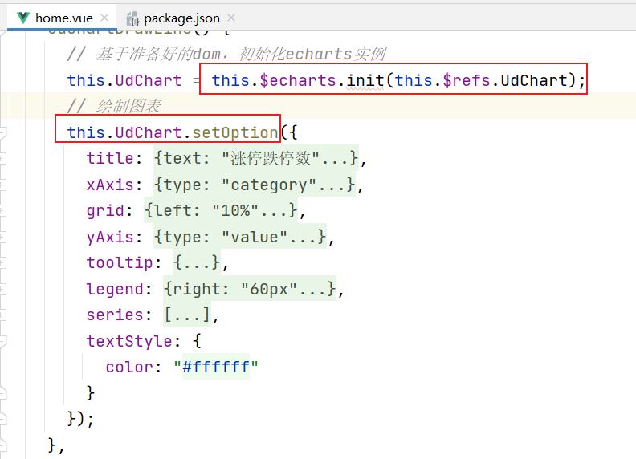

### 3.2 前端显示效果

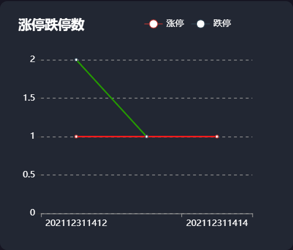

> 注意：点击涨停和跌停，也可单独显示；

# 第三章 EasyExcel使用

## 1、EasyExcel介绍

### 1.1 官网介绍

传统操作Excel大多都是利用Apach POI进行操作的，但是POI框架并不完善，使用过程非常繁琐且有较多的缺陷：

- 动态操作Excel非常繁琐,对于新手来说，很难在短时间内上手;
- 读写时需要占用较大的内存，当数据量大时容易发生内存溢出问题（OOM）;

基于上述原因，阿里开源出一款易于上手，且比较节省内存的Excel框架：EasyExcel

> 注意：easyExcel底层也是使用POI实现的；

官网地址：https://www.yuque.com/easyexcel/doc/easyexcel

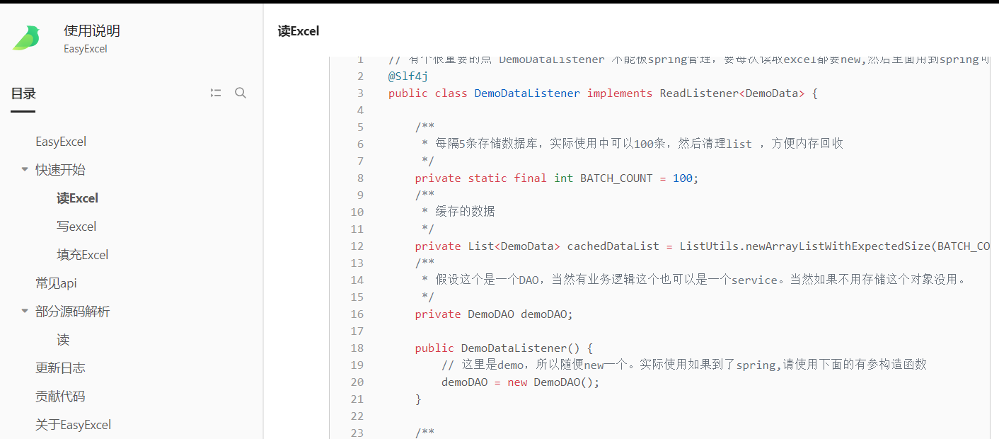

依赖资源：

```xml
<!--引入easyexcel-->
<dependency>
    <groupId>com.alibaba</groupId>
    <artifactId>easyexcel</artifactId>
    <version>3.0.4</version>
</dependency>
```

> 注意：目前版本与JDK8较为契合，高版本的JDK可能会出现兼容性问题;

### 1.2 Excel相关结构说明

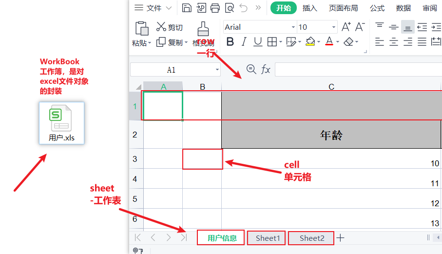

## 2、EasyExcel导出数据快速入门

### 2.1 构建测试实体类

~~~java
package com.itheima.stock.pojo;

import lombok.AllArgsConstructor;
import lombok.Builder;
import lombok.Data;
import lombok.NoArgsConstructor;

import java.io.Serializable;
import java.util.Date;

/**
 * @author by itheima
 * @Date 2021/12/19
 * @Description
 */
@Data
@NoArgsConstructor
@AllArgsConstructor
@Builder
public class User implements Serializable {
    private String userName;
    private Integer age;
    private String address;
    private Date birthday;
}
~~~

### 2.2 数据导出到excel

~~~java
package com.itheima.stock;

import com.alibaba.excel.EasyExcel;
import com.itheima.stock.pojo.User;
import org.junit.jupiter.api.Test;

import java.util.ArrayList;
import java.util.Date;
import java.util.List;

/**
 * @author by itheima
 * @Date 2021/12/31
 * @Description
 */
public class TestEasyExcel {

    public List<User> init(){
        //组装数据
        ArrayList<User> users = new ArrayList<>();
        for (int i = 0; i < 10; i++) {
            User user = new User();
            user.setAddress("上海"+i);
            user.setUserName("张三"+i);
            user.setBirthday(new Date());
            user.setAge(10+i);
            users.add(user);
        }
        return users;
    }
    /**
     * 直接导出后，表头名称默认是实体类中的属性名称
     */
    @Test
    public void test02(){
        List<User> users = init();
        //不做任何注解处理时，表头名称与实体类属性名称一致
        EasyExcel.write("C:\\Users\\46035\\Desktop\\ex\\用户.xls",User.class).sheet("用户信息").doWrite(users);
    }
}
~~~

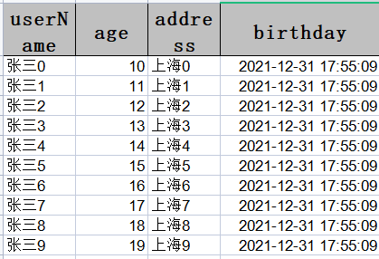

### 2.3 自定义表头

修改User实体类,设置表头数据和排序规则：

~~~java
package com.itheima.stock.pojo;

import com.alibaba.excel.annotation.ExcelProperty;
import lombok.AllArgsConstructor;
import lombok.Builder;
import lombok.Data;
import lombok.NoArgsConstructor;
import java.io.Serializable;
import java.util.Date;

/**
 * @author by itheima
 * @Date 2021/12/19
 * @Description
 */
@Data
@NoArgsConstructor
@AllArgsConstructor
@Builder
/**
  * 通过注解自定义表头名称 注解添加排序规则，值越大 越靠近右边
*/
public class User implements Serializable {
    @ExcelProperty(value = {"用户名"},index = 1)
    private String userName;
    @ExcelProperty(value = {"年龄"},index = 2)
    private Integer age;
    @ExcelProperty(value = {"地址"} ,index = 4)
    private String address;
    @ExcelProperty(value = {"生日"},index = 3)
    private Date birthday;
}
~~~

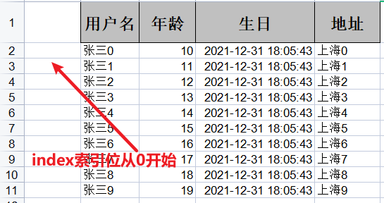

## 3、EasyExcel导出数据高级设置

### 3.1 自定义日期格式

~~~java
package com.itheima.stock.pojo;

import com.alibaba.excel.annotation.ExcelProperty;
import com.alibaba.excel.annotation.format.DateTimeFormat;
import lombok.AllArgsConstructor;
import lombok.Builder;
import lombok.Data;
import lombok.NoArgsConstructor;

import java.io.Serializable;
import java.util.Date;

/**
 * @author by itheima
 * @Date 2021/12/19
 * @Description
 */
@Data
@NoArgsConstructor
@AllArgsConstructor
@Builder
public class User implements Serializable {
    @ExcelProperty(value = {"用户名"},index = 1)
    private String userName;
    @ExcelProperty(value = {"年龄"},index = 2)
    private Integer age;
    @ExcelProperty(value = {"地址"} ,index = 4)
    private String address;
    @ExcelProperty(value = {"生日"},index = 3)
    //注意：日期格式注解由alibaba.excel提供
    @DateTimeFormat("yyyy/MM/dd HH:mm")
    private Date birthday;
}
~~~

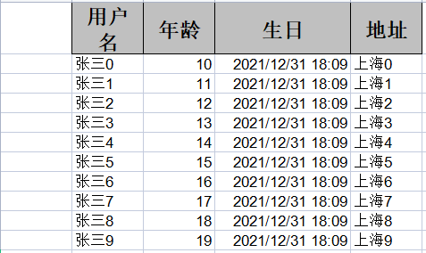

### 3.2 合并表头

添加合并表头信息：

~~~java
package com.itheima.stock.pojo;

import com.alibaba.excel.annotation.ExcelIgnore;
import com.alibaba.excel.annotation.ExcelProperty;
import com.alibaba.excel.annotation.format.DateTimeFormat;
import lombok.AllArgsConstructor;
import lombok.Builder;
import lombok.Data;
import lombok.NoArgsConstructor;

import java.io.Serializable;
import java.util.Date;

/**
 * @author by itheima
 * @Date 2021/12/19
 * @Description
 */
@Data
@NoArgsConstructor
@AllArgsConstructor
@Builder
public class User implements Serializable {
    @ExcelProperty(value = {"用户基本信息","用户名"},index = 1)
    private String userName;
    @ExcelProperty(value = {"用户基本信息","年龄"},index = 2)
    private Integer age;
    @ExcelProperty(value = {"用户基本信息","地址"} ,index = 4)
    private String address;
    @ExcelProperty(value = {"用户基本信息","生日"},index = 3)
    //注意：日期格式注解由alibaba.excel提供
    @DateTimeFormat("yyyy/MM/dd HH:mm")
    private Date birthday;
}
~~~

效果：

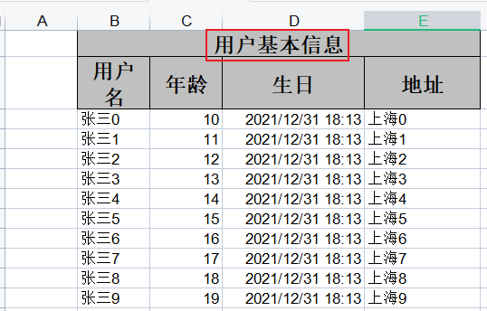

### 3.3 忽略指定表头信息

~~~java
/**
 * @author by itheima
 * @Date 2021/12/19
 * @Description
 */
@Data
@NoArgsConstructor
@AllArgsConstructor
@Builder
public class User implements Serializable {
    @ExcelProperty(value = {"用户基本信息","用户名"},index = 1)
    @ExcelIgnore
    private String userName;
    @ExcelProperty(value = {"用户基本信息","年龄"},index = 2)
    private Integer age;
    @ExcelProperty(value = {"用户基本信息","地址"} ,index = 4)
    private String address;
    @ExcelProperty(value = {"用户基本信息","生日"},index = 3)
    //注意：日期格式注解由alibaba.excel提供
    @DateTimeFormat("yyyy/MM/dd HH:mm")
    private Date birthday;
}
~~~

效果：

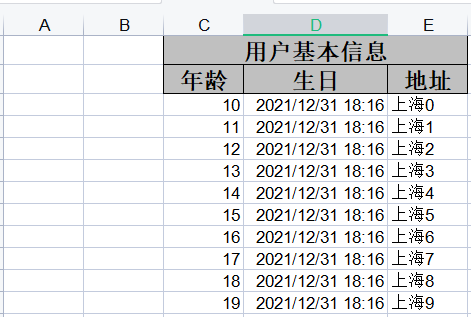

### 3.4 设置单元格大小

~~~java
@Data
@NoArgsConstructor
@AllArgsConstructor
@Builder
@HeadRowHeight(value = 35) // 表头行高
@ContentRowHeight(value = 25) // 内容行高
@ColumnWidth(value = 18) // 列宽
public class User implements Serializable {
    @ExcelProperty(value = {"用户基本信息","用户名"},index = 1)
    @ExcelIgnore
    private String userName;
    @ExcelProperty(value = {"用户基本信息","年龄"},index = 2)
    private Integer age;
    @ExcelProperty(value = {"用户基本信息","地址"} ,index = 4)
    private String address;
    @ExcelProperty(value = {"用户基本信息","生日"},index = 3)
    //注意：日期格式注解由alibaba.excel提供
    @DateTimeFormat("yyyy/MM/dd HH:mm")
    private Date birthday;
}
~~~

效果：

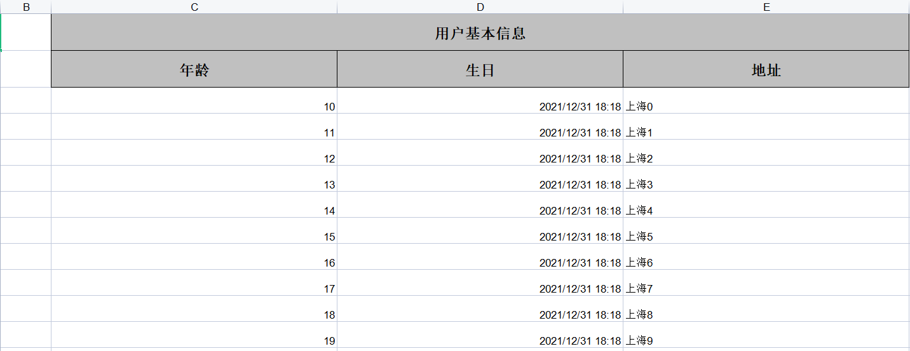

## 4、EasyExcel导入数据

~~~java
    /**
     * excel数据格式必须与实体类定义一致，否则数据读取不到
     */
    @Test
    public void readExcel(){
        ArrayList<User> users = new ArrayList<>();
        //读取数据
        EasyExcel.read("C:\\Users\\46035\\Desktop\\ex\\用户.xls", User.class, new AnalysisEventListener<User>() {
            @Override
            public void invoke(User o, AnalysisContext analysisContext) {
                System.out.println(o);
                users.add(o);
            }
            @Override
            public void doAfterAllAnalysed(AnalysisContext analysisContext) {
                System.out.println("完成。。。。");
            }
        }).sheet().doRead();
        System.out.println(users);
    }
~~~

# 第四章 股票涨幅数据导出

## 1、涨幅榜数据导出功能分析

### 1.1 原型效果

通过点击【导出数据】按钮，将当前页的数据导出到excel下：

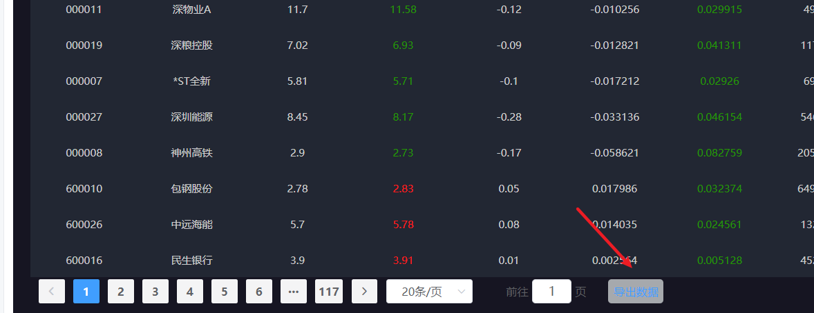

### 1.2  数据导出接口说明

功能说明：将分页涨幅榜下指定页码的数据导出到excel表格下
请求地址：/api/quot/stock/export
请求方式：GET

请求参数：

| 参数名称 | 参数说明     | 是否必须  | 数据类型    | 备注     |
| :--- | -------- | ----- | ------- | ------ |
| 当前页  | page     | false | Integer | 默认值：1  |
| 每页大小 | pageSize | false | Integer | 默认值：20 |

响应：excel格式的文件流

### 1.3 功能实现准备

在stock_common工程下引入easyExcel依赖：

~~~xml
<!--引入easyExcel-->
<dependency>
  <groupId>com.alibaba</groupId>
  <artifactId>easyexcel</artifactId>
</dependency>
~~~

调整StockUpdownDomain实体类：

~~~java
@Data
@NoArgsConstructor
@AllArgsConstructor
@Builder
public class StockUpdownDomain {
    @ExcelProperty(value = {"股票涨幅信息统计表","股票编码"},index = 0)
    private String code;

    @ExcelProperty(value = {"股票涨幅信息统计表","股票名称"},index = 1)
    private String name;

    @ExcelProperty(value = {"股票涨幅信息统计表","前收盘价格"},index = 2)
    private BigDecimal preClosePrice;

    @ExcelProperty(value = {"股票涨幅信息统计表","当前价格"},index= 3)
    private BigDecimal tradePrice;

    @ExcelProperty(value = {"股票涨幅信息统计表","涨跌"},index= 4)
    private BigDecimal increase;

    @ExcelProperty(value = {"股票涨幅信息统计表","涨幅"},index= 5)
    private BigDecimal upDown;

    @ExcelProperty(value = {"股票涨幅信息统计表","振幅"},index= 6)
    private BigDecimal amplitude;

    @ExcelProperty(value = {"股票涨幅信息统计表","交易总量"},index = 7)
    private Long tradeAmt;

    @ExcelProperty(value = {"股票涨幅信息统计表","交易总金额"},index = 8)
    private BigDecimal tradeVol;

    @ExcelProperty(value = {"股票涨幅信息统计表","日期"},index = 9)
    @DateTimeFormat("yyy-MM-dd HH:mm")//easyExcel的注解-》excel
    @JsonFormat(pattern = "yyyy-MM-dd HH:mm")//springmvc支持的注解-》json格式数据
    private Date curDate;
}
~~~

> 详见：**day03\资料\后端资料\easyExcel修饰\StockUpdownDomain.java**

## 2、涨幅信息数据导出功能实现

### 2.1 定义web访问方法

~~~java
    /**
     * 将指定页的股票数据导出到excel表下
     * @param response
     * @param page  当前页
     * @param pageSize 每页大小
     */
    @GetMapping("/stock/export")
    public void stockExport(HttpServletResponse response,Integer page,Integer pageSize){
         stockService.stockExport(response,page,pageSize);
    }
~~~

### 2.2 定义服务接口及实现

接口定义：

~~~java
    /**
     * 将指定页的股票数据导出到excel表下
     * @param response
     * @param page  当前页
     * @param pageSize 每页大小
     */
    void stockExport(HttpServletResponse response, Integer page, Integer pageSize);
~~~

接口实现：

~~~java
    /**
     * 将指定页的股票数据导出到excel表下
     * @param response
     * @param page  当前页
     * @param pageSize 每页大小
     */
    @Override
    public void stockExport(HttpServletResponse response, Integer page, Integer pageSize) {
        try {
            //1.获取最近最新的一次股票有效交易时间点（精确分钟）
            Date curDate = DateTimeUtil.getLastDate4Stock(DateTime.now()).toDate();
            //因为对于当前来说，我们没有实现股票信息实时采集的功能，所以最新时间点下的数据
            //在数据库中是没有的，所以，先临时指定一个假数据,后续注释掉该代码即可
            curDate=DateTime.parse("2022-01-05 09:47:00", DateTimeFormat.forPattern("yyyy-MM-dd HH:mm:ss")).toDate();
            //2.设置分页参数 底层会拦截mybatis发送的sql，并动态追加limit语句实现分页
            PageHelper.startPage(page,pageSize);
            //3.查询
            List<StockUpdownDomain> infos=stockRtInfoMapper.getAllStockUpDownByTime(curDate);
            //如果集合为空，响应错误提示信息
            if (CollectionUtils.isEmpty(infos)) {
                //响应提示信息
                RequestInfoUtil.setUtf8(response);
                R<Object> r = R.error(ResponseCode.NO_RESPONSE_DATA);
              	response.setContentType("application/json");
                response.setCharacterEncoding("utf-8");
                response.getWriter().write(new ObjectMapper().writeValueAsString(r));
                return;
            }
            //设置响应excel文件格式类型
            response.setContentType("application/vnd.ms-excel");
            //2.设置响应数据的编码格式
            response.setCharacterEncoding("utf-8");
            //3.设置默认的文件名称
            // 这里URLEncoder.encode可以防止中文乱码 当然和easyexcel没有关系
            String fileName = URLEncoder.encode("stockRt", "UTF-8");
            //设置默认文件名称：兼容一些特殊浏览器
            response.setHeader("content-disposition", "attachment;filename=" + fileName + ".xlsx");
            //4.响应excel流
            EasyExcel
                    .write(response.getOutputStream(),StockUpdownDomain.class)
                    .sheet("股票信息")
                    .doWrite(infos);
        } catch (IOException e) {
            e.printStackTrace();
            log.info("当前导出数据异常，当前页：{},每页大小：{},异常信息：{}",page,pageSize,e.getMessage());
        }
    }
~~~

### 2.3 访问测试效果

测试方式：

- 通过浏览器直接访问http://localhost/aip/quot/stock/export?page=1&pageSize=20，可直接获取stockRt.xlsx文件
- 通过前端点击按钮获取，则会获取其它名称的文件，因为前端对文件进行了重命名操作；

最终效果：

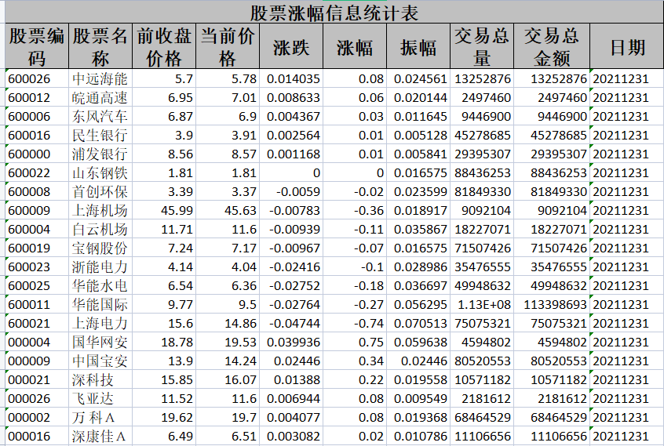


