# 股票流水定时多线程采集实现

## 学习目标

1.分析并理解当前股票采集功能存在的问题;
2.理解XXLJOB的使用场景和使用流程;
  	2.1 掌握xxljob的基本使用流程;
  	2.2 理解cron表达式;
3.理解xxljob集成到项目的基本流程;
 	 3.1 自定义任务执行器;
  	3.2 分析国内大盘的开盘周期，自定义适合的cron表达式;
  	3.3 完成大盘、股票流水、板块数据定义采集功能; 
4.多线程优化股票流水采集功能;
5.理解线程池基本工作原理和参数设置原则[面试];

# 第一章 股票数据采集分析

## 1、股票流水持续采集问题

### 1.1 股票流水数据采集

​	当前我们仅完成了股票瞬时数据的采集工作，但是股票本身的数据是一系列时间的流水，所以我们需要定时定量的采集股票最新的数据；

​	总之，我们需要借助一个定时任务框架来完成数据周期性的采集工作；

### 1.2 定时任务框架

若想持续(比如每分钟)采集股票数据，需要借助定时任务组件完成数据周期性采集工作，以下是常见的定时任务框架；

| 实现方式            | cron表达式 | 监控平台 | 任务告警 | 集群\|分布式    | 开发难易程度 |
| --------------- | ------- | ---- | ---- | ---------- | ------ |
| JDK 的TimeTask   | 不支持     | 无    | 无    | 不支持        | 复杂     |
| Spring Schedule | 支持      | 无    | 无    | 不支持        | 简单     |
| Quartz          | 支持      | 无    | 无    | 不支持（需自行开发） | 复杂     |
| **XXL-JOB**     | 支持      | 支持   | 支持   | 偏向集中式架构    | 相对简单   |
| Elastic-Job     | 支持      | 支持   | 支持   | 偏向分布式架构    | 相对复杂   |

## 2、股票批量采集入库高延迟问题

​	目前股票相关的数据在采集和入库时都是批量且串行执行的，显然串行执行网络I/O和磁盘I/0导致股票数据存在较高的延迟性问题，这同样会严重影响性能，我们可使用多线程并发采集和入库，提高整体操作效率（TPS）；

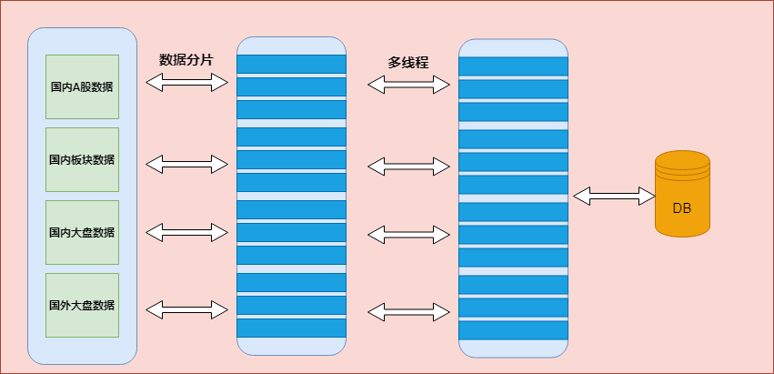

## 3、线程复用和挤压问题

### 3.1 线程复用问题

​	线程资源本身是比较重的资源，运行时需要与计算机硬件交互，而这些资源如果被反复的创建和销毁会给应用带来很大的性能开销。

​	所以，我们尽量提高线程资源的复用性，这就需要我们通过线程池来维护这些线程资源；

> 池化技术：数据源连接池 、线程池、http连接池等本质是以空间换时间：提前构建好资源（占用内存空间），省却了再次构建资源时的时间成本；

### 3.2 线程挤压问题

​	当前项目本质是单体架构，股票数据采集线程和主业务线程共享硬件资源，这可能会发生因为股票采集线程长时占用物理资源，导致主业务线程无法正常提供有效服务的情况（主业务线程被挤压，导致饥渴现象）；

​	综上，我们可使用线程池将采集业务与主业务安全隔离(舱壁模式)，且提供线程的复用性；

> 当然，如果条件允许stock_job服务和stock_backend服务器分开部署,则最佳；

# 第二章 定时任务框架

## 1、XXL-JOB介绍

### 1.1 XXL-JOB概述

​	XXL-JOB是一个轻量级分布式任务调度平台，其核心设计目标是开发迅速、学习简单、轻量级、易扩展。现已开放源代码并接入多家公司线上产品线，开箱即用。
​	目前已有多家公司接入xxl-job，包括比较知名的大众点评，京东，优信二手车，北京尚德，360金融 (360)，联想集团 (联想)，易信 (网易)等;

### 1.2 XXL-JOB特性

   官方地址：http://www.xuxueli.com/xxl-job

> 更多详情见官网;

### 1.3 整体架构

## 2、XXL-JOB任务中心环境搭建

### 2.1 XXL-JOB源码下载

考虑到网络原因，我们选择gitee下的开源地址下载：

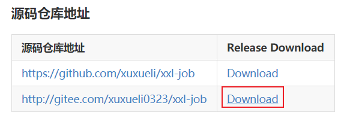

> 选择最新的2.30版本下载，资料已经下载：**day06\资料\xxljob\xxl-job-2.3.0.zip**

### 2.2 IDEA导入xxljob工程

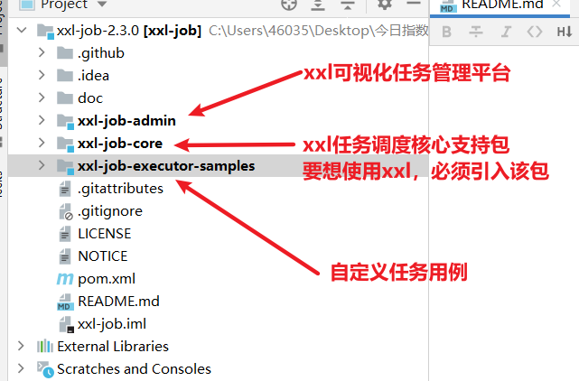

### 2.3 初始化数据库

将xxljob提供的SQL脚本导入到mysql容器服务中：

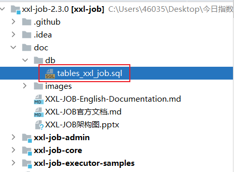

整体如下：

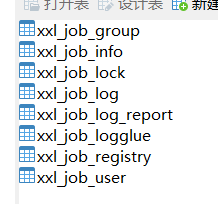

>  注意：
>
>  如果表xxl_job_registry导入过程报Specified key was too long; max key length is 767 bytes错误，则将i_g_k_v联合索引相关字段的varchar改小一些即可；

### 2.4 Docker安装任务管理中心

拉取xxl-job-admin任务中心镜像：

~~~shell
docker pull xuxueli/xxl-job-admin:2.3.0
~~~

启动xxl-job任务中心容器：

~~~shell
# 在指定目录构建xxldata目录，然后运行如下docker指令：
docker run -e PARAMS="--spring.datasource.url=jdbc:mysql://192.168.200.128:3306/xxl_job?useUnicode=true&characterEncoding=UTF-8&autoReconnect=true&serverTimezone=UTC --spring.datasource.username=root --spring.datasource.password=root" -p 8093:8080  -v $PWD/xxldata:/data/applogs --name=xxl-job-admin -d xuxueli/xxl-job-admin:2.3.0
~~~

访问容器服务：

~~~http
http://192.168.200.128:8093/xxl-job-admin
~~~

效果如下：

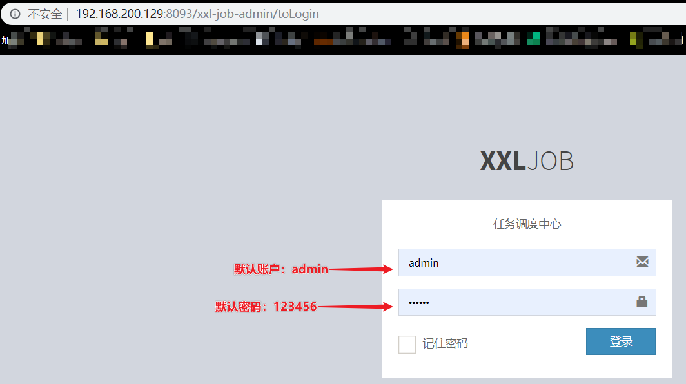

登录进入后效果：

> 注意：**Docker服务重启时，保证对应的mysql服务启动，否则任务信息无法加载！**
>

## 3、XXL-JOB任务注册测试

### 3.1 引入xxl-job核心依赖

通过官方提供的xxljob代码，我们可知道在xxl-job-executor-sample-springboot工程中引入和xxljob的核心依赖：

~~~xml
<!-- xxl-job-core -->
<dependency>
    <groupId>com.xuxueli</groupId>
    <artifactId>xxl-job-core</artifactId>
    <version>${project.parent.version}</version>
</dependency>
~~~

> 将来我们的项目也可通过这种方式集成xxl-job

### 3.2 配置xxljob相关信息

接下来就是配置任务工程信息：

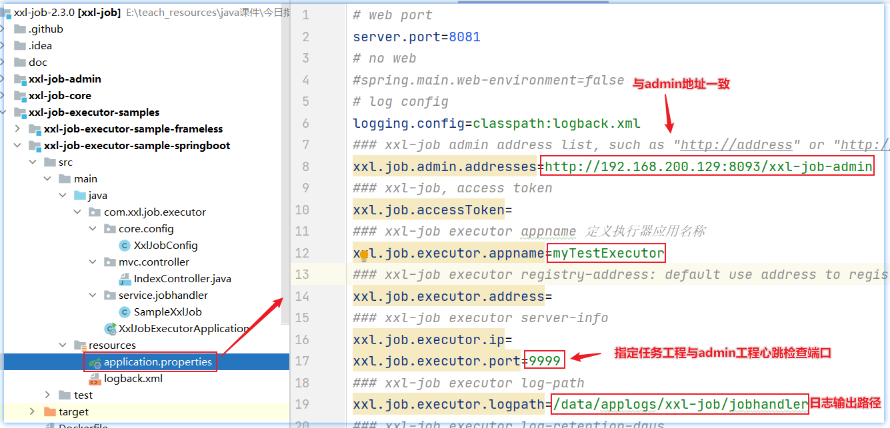

配置完毕后，工程底层通过XxlJobConfig配置类加载配置信息，实现xxljob相关资源的初始化工作：

~~~java
package com.xxl.job.executor.core.config;
@Configuration
public class XxlJobConfig {
    private Logger logger = LoggerFactory.getLogger(XxlJobConfig.class);

    @Value("${xxl.job.admin.addresses}")
    private String adminAddresses;

    @Value("${xxl.job.accessToken}")
    private String accessToken;

    @Value("${xxl.job.executor.appname}")
    private String appname;

    @Value("${xxl.job.executor.address}")
    private String address;

    @Value("${xxl.job.executor.ip}")
    private String ip;

    @Value("${xxl.job.executor.port}")
    private int port;

    @Value("${xxl.job.executor.logpath}")
    private String logPath;

    @Value("${xxl.job.executor.logretentiondays}")
    private int logRetentionDays;
    @Bean
    public XxlJobSpringExecutor xxlJobExecutor() {
        logger.info(">>>>>>>>>>> xxl-job config init.");
        XxlJobSpringExecutor xxlJobSpringExecutor = new XxlJobSpringExecutor();
        xxlJobSpringExecutor.setAdminAddresses(adminAddresses);
        xxlJobSpringExecutor.setAppname(appname);
        xxlJobSpringExecutor.setAddress(address);
        xxlJobSpringExecutor.setIp(ip);
        xxlJobSpringExecutor.setPort(port);
        xxlJobSpringExecutor.setAccessToken(accessToken);
        xxlJobSpringExecutor.setLogPath(logPath);
        xxlJobSpringExecutor.setLogRetentionDays(logRetentionDays);
        return xxlJobSpringExecutor;
    }
}
~~~

### 3.3 定义定时任务执行方法

~~~java
package com.xxl.job.executor.service.jobhandler;
@Component
public class SampleXxlJob {
    private static Logger logger = LoggerFactory.getLogger(SampleXxlJob.class);

    /**
     * 1、简单任务示例（Bean模式）
     */
    @XxlJob("demoJobHandler")
    public void demoJobHandler() throws Exception {
       //todo 打印时间
       System.out.println("hello xxljob.....");
    }

	//.....省略......

    /**
     * 5、生命周期任务示例：任务初始化与销毁时，支持自定义相关逻辑；
     */
    @XxlJob(value = "demoJobHandler2", init = "init", destroy = "destroy")
    public void demoJobHandler2() throws Exception {
        XxlJobHelper.log("XXL-JOB, Hello World.");
    }
    public void init(){
        logger.info("init");
    }
    public void destroy(){
        logger.info("destory");
    }
}
~~~

> 说明：
>
> @XxlJob中的value值就是定时任务的一个标识，注解作用的方法就是定时任务要执行逻辑的逻辑方法；

### 3.4 配置任务执行器

> 注意：如果自动注册不识别，可手动录入执行服务地址，格式比如：http://192.168.200.1:9999

### 3.5 配置任务执行计划

接下来，我们将xxl-job-executor-sample-springboot工程下的demoJobHandler任务，可视化配置，并启动：

接下来，输入JobHanler，输入的名称保证与@xxljob注解下的value值一致即可：

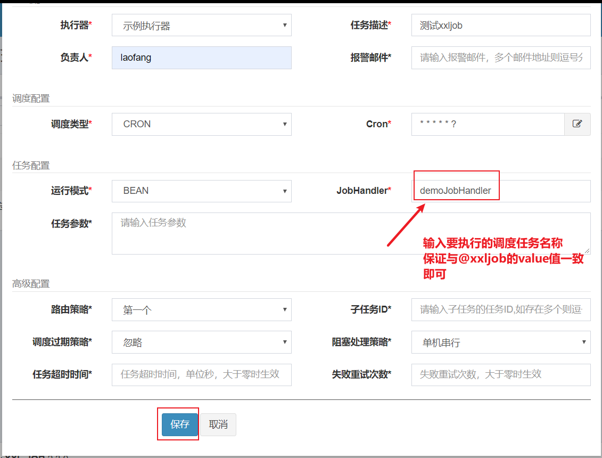

启动任务查看执行效果：

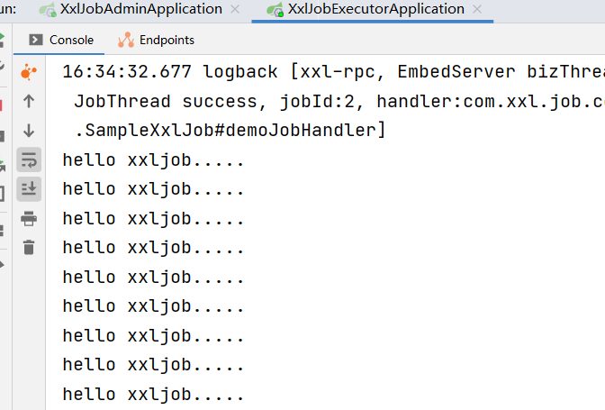

当然，我们也可以随时停止正在被执行的任务；

## 4、CRON表达式入门

### 4.1 cron表达式介绍

cron表达式类似就java中的正则，通过cron表达式可定义周期性的任务计划。

许多开源的定时任务框架大多支持cron表达式；

### 4.2 cron表达式语法介绍

​	xxl-job同样支持通过cron表达式来控制任务周期性调度执行表达式包含7个部分：分别从**秒、分、时、日、月、星期、年**七个时间维度来定义任务执行的周期；

cron表达式时间取值范围：

~~~json
cron表达式格式：
*    *    *    *    *    *    *
-    -    -    -    -    -    -
|    |    |    |    |    |    |
|    |    |    |    |    |    + year [optional]
|    |    |    |    |    +----- day of week (1 - 7）
|    |    |    |    +---------- month (1 - 12)
|    |    |    +--------------- day of month (1 - 31)
|    |    +-------------------- hour (0 - 23)
|    +------------------------- min (0 - 59)
+------------------------------ second (0 - 59)
~~~

| 字段    | 允许值                                   | 允许的特殊字符         |
| ----- | ------------------------------------- | --------------- |
| 秒     | 0-59                                  | , - * /         |
| 分     | 0-59                                  | , - * /         |
| 小时    | 0-23                                  | , - * /         |
| 月内日期  | 1-31                                  | , - * ? / L W C |
| 月     | 1-12 或者 JAN-DEC                       | , - * /         |
| 周内日期  | 1-7 或者 SUN-SAT（==注意：周日是1，周一为2，周六位7==） | , - * ? / L C # |
| 年（可选） | 留空, 1970-2099                         | , - * /         |

特殊字段含义：

| 特殊字符 | 意义                                       |
| ---- | :--------------------------------------- |
| *    | 匹配所有的值。如：*在分钟的字段域里表示 每分钟                 |
| ?    | 只在日期域和星期域中使用。它被用来指定“非明确的值” 不关心           |
| -    | 指定一个范围。如：“10-12”在小时域意味着“10点、11点、12点”     |
| ,    | 指定几个可选值。如：“MON,WED,FRI”在星期域里表示“星期一、星期三、星期五” |
| /    | 指定增量。如：“0/15”在秒域意思是每分钟的0，15，30和45秒。“5/15”在分钟域表示每小时的5，20，35和50。符号“*”在“/”前面（如：*/10）等价于0在“/”前面（如：0/10） |
| L    | 表示day-of-month和day-of-week域，但在两个字段中的意思不同，例如day-of-month域中表示一个月的最后一天。如果在day-of-week域表示‘7’或者‘SAT’，如果在day-of-week域中前面加上数字，它表示一个月的最后几天，例如‘6L’就表示一个月的最后一个星期五(在西方，周末索引位为1，那么周一就是2，其它一次类推) |
| W    | 只允许日期域出现。这个字符用于指定日期的最近工作日。例如：如果你在日期域中写 “15W”，表示：这个月15号最近的工作日。所以，如果15号是周六，则任务会在14号触发。如果15好是周日，则任务会在周一也就是16号触发。如果是在日期域填写“1W”即使1号是周六，那么任务也只会在下周一，也就是3号触发，“W”字符指定的最近工作日是不能够跨月份的。字符“W”只能配合一个单独的数值使用，不能够是一个数字段，如：1-15W是错误的 |
| LW   | L和W可以在日期域中联合使用，LW表示这个月最后一周的工作日           |
| #    | 只允许在星期域中出现。这个字符用于指定本月的某某天。例如：“6#3”表示本月第三周的星期五（6表示星期五，3表示第三周）。“2#1”表示本月第一周的星期一。“4#5”表示第五周的星期三 |

> 参考cron在线表达式：https://www.matools.com/cron/

### 4.3 cron表达式阅读练习

~~~tex
（1）0 0 2 1 * ? 表示在每月的1日的凌晨2点调整任务

（2）0 15 10 ? * MON-FRI 表示周一到周五每天上午10:15执行作业 ★★★

（3）0 15 10 ? 6L 2002-2006 表示2002-2006年的每个月的最后一个星期五上午10:15执行作

（4）0 0 10,14,16 * * ? 每天上午10点，下午2点，4点

（5）0 0/30 9-17 * * ? 朝九晚五工作时间内每半小时

（6）0 0 12 ? * WED 表示每个星期三中午12点

（7）0 15 10 * * ? 每天上午10:15触发

（8）0 * 14 * * ? 在每天下午2点到下午2:59期间的每1分钟触发

（9）0 0/5 14,18 * * ? 在每天下午2点到2:55期间和下午6点到6:55期间的每5分钟触发

（10）0 0-5 14 * * ? 在每天下午2点到下午2:05期间的每1分钟触发

（12）0 15 10 L * ? 每月最后一日的上午10:15触发

（13）0 15 10 ? * 6L 每月的最后一个星期五上午10:15触发
~~~

# 第三章 股票数据周期采集实现

## 1、stock_job工程集成xxljob

我们按照xxl-job-executor-sample-springboot工程整合流程，将xxljob整合到stock_job工程下，流程如下：

**1）stock_job工程引入核心依赖**

~~~xml
<!--引入xxljob核心依赖-->
<dependency>
    <groupId>com.xuxueli</groupId>
    <artifactId>xxl-job-core</artifactId>
</dependency>
~~~

**2）在application-stock.yml就行添加xxljob配置**

~~~yaml
# XXJOB参数配置
xxl:
  job:
    accessToken:
    admin:
      addresses: http://192.168.200.1:8093/xxl-job-admin
    executor:
      appname: heima-stock-job-executor
      address:
      ip:
      port: 6666
      logpath: .\logs
      logretentiondays: 30
~~~

> 注意：.gitignore文件中应忽略logs目录

激活该配置：

~~~yaml
spring:
	profiles:
		active: stock
~~~

**3）定义xxljob 核心配合bean**

我们直接将xxl-job-executor-sample-springboot工程下的XxlJobConfig类复制过来即可：

~~~java
package com.itheima.stock.job.xxljobconfig;

import com.xxl.job.core.executor.impl.XxlJobSpringExecutor;
import org.slf4j.Logger;
import org.slf4j.LoggerFactory;
import org.springframework.beans.factory.annotation.Value;
import org.springframework.context.annotation.Bean;
import org.springframework.context.annotation.Configuration;

/**
 * xxl-job config
 *
 * @author xuxueli 2017-04-28
 */
@Configuration
public class XxlJobConfig {
    private Logger logger = LoggerFactory.getLogger(XxlJobConfig.class);

    @Value("${xxl.job.admin.addresses}")
    private String adminAddresses;

    @Value("${xxl.job.accessToken}")
    private String accessToken;

    @Value("${xxl.job.executor.appname}")
    private String appname;

    @Value("${xxl.job.executor.address}")
    private String address;

    @Value("${xxl.job.executor.ip}")
    private String ip;

    @Value("${xxl.job.executor.port}")
    private int port;

    @Value("${xxl.job.executor.logpath}")
    private String logPath;

    @Value("${xxl.job.executor.logretentiondays}")
    private int logRetentionDays;

    @Bean
    public XxlJobSpringExecutor xxlJobExecutor() {
        logger.info(">>>>>>>>>>> xxl-job config init.");
        XxlJobSpringExecutor xxlJobSpringExecutor = new XxlJobSpringExecutor();
        xxlJobSpringExecutor.setAdminAddresses(adminAddresses);
        xxlJobSpringExecutor.setAppname(appname);
        xxlJobSpringExecutor.setAddress(address);
        xxlJobSpringExecutor.setIp(ip);
        xxlJobSpringExecutor.setPort(port);
        xxlJobSpringExecutor.setAccessToken(accessToken);
        xxlJobSpringExecutor.setLogPath(logPath);
        xxlJobSpringExecutor.setLogRetentionDays(logRetentionDays);
        return xxlJobSpringExecutor;
    }
}
~~~

**4）定义任务处理器jobhandler**

~~~java
package com.itheima.stock.job.jobhandler;

import com.xxl.job.core.handler.annotation.XxlJob;
import org.slf4j.Logger;
import org.slf4j.LoggerFactory;
import org.springframework.stereotype.Component;

/**
 * 定义股票相关数据的定时任务
 * @author laofang
 */
@Component
public class StockJob {
    @XxlJob("hema_job_test")
    public void jobTest(){
        System.out.println("jobTest run.....");
    }
}
~~~

**5）启动stock_job工程并配置执行器信息**

此时，需要在任务中心执行中手动添加执行器信息：

查看window下与虚拟机交互ip：

在可是化终端配置执行器信息：

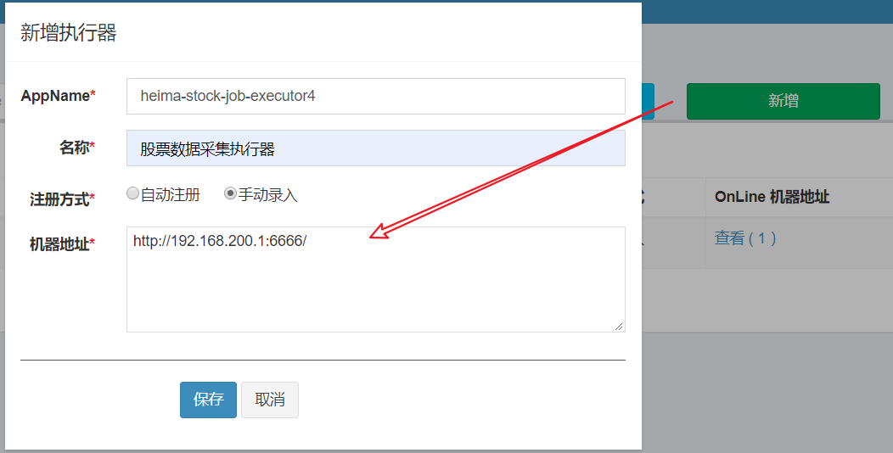

页面刷新后，我们就可以看到自己定义的执行器装填了：

配置任务执行计划：

然后启动任务：

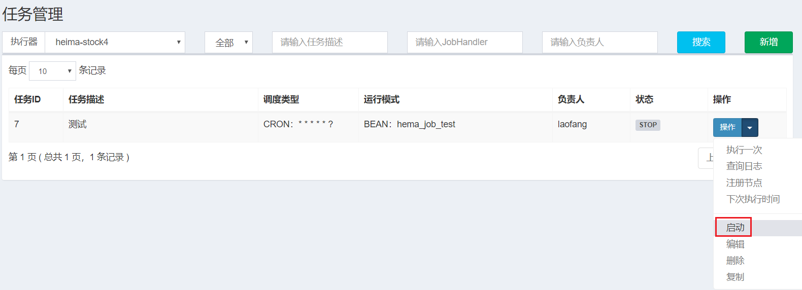

任务顺利启动：

## 2. 定义大盘数据采集任务

### 2.1 定义采集大盘任务方法

~~~java
/**
 * 定义股票相关数据的定时任务
 * @author laofang
 */
@Component
public class StockJob {

    /**
     * 注入股票定时任务服务bean
     */
    @Autowired
    private StockTimerTaskService stockTimerTaskService;

    /**
     * 定义定时任务，采集国内大盘数据
     */
    @XxlJob("getStockInnerMarketInfos")
    public void getStockInnerMarketInfos(){
        stockTimerTaskService.getInnerMarketInfo();
    }
    //.....
}    
~~~

### 2.2 定义大盘任务cron表达式

#### 2.2.1 国内大盘cron表达式分析

分析：

- 国内大盘开盘周期是从周1到周5，每天上午的9:30至11:30和下午的1:00至3:00（节假日暂时不考虑）
- 使用cron表达式不好一次性定义，所以我们可以将任务整体以半小时分段处理，整体分段如下：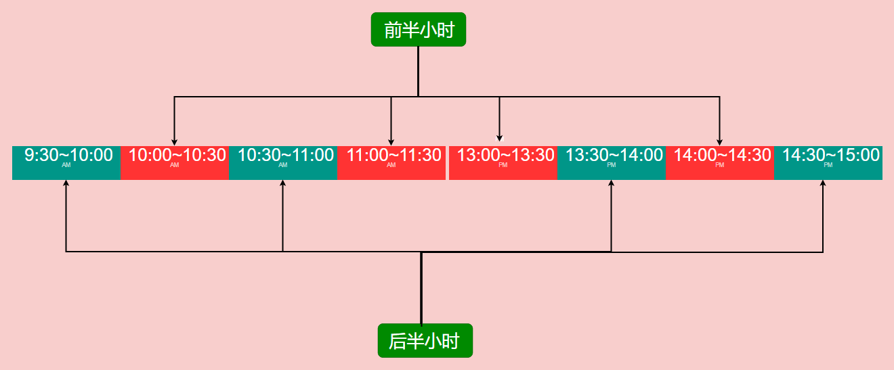

#### 2.2.2 配置cron表达式

**1）前半小时配置**

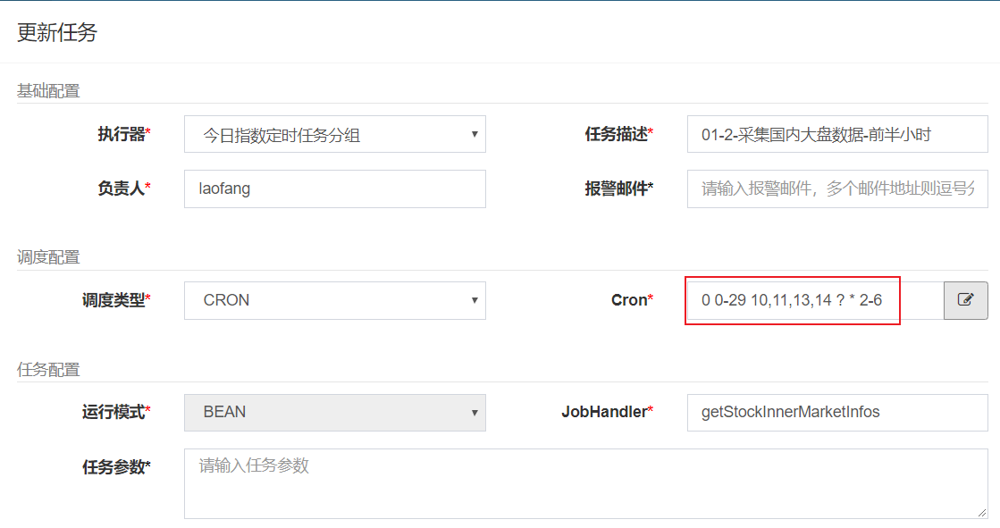

**2）后半小时配置**

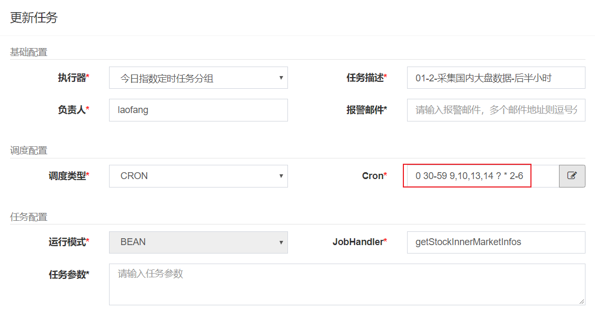

> 注意：
>
> 因为xxl-job-admin工程进行定时任务时，需要参照系统时间，**如果系统时间错误，则会导致任务不能被准时执行**！
>
> 参照：day06-股票流水定时多线程采集实现\资料\Centos下MySql日期校准.png

## 3、国内股票数据采集任务实现

~~~java
    /**
     * 定时采集A股数据
     */
    @XxlJob("getStockInfos")
    public void getStockInfos(){
        stockTimerTaskService.getStockRtIndex();
    }
~~~

> 说明：
>
> 1.xxljob日期采集配置策略与国内大盘采集策略一致！
>
> 2.由于个股数据比较多，新浪后台也会存在更新延迟问题，所以采集过程可能会获取重复的数据，我们利用数据库的唯一性约束避免重复数据的插入。

## 4、国内板块数据采集任务实现[作业]

~~~java
    /**
     * 板块定时任务
     */
    @XxlJob("getStockBlockInfoTask")
    public void getStockBlockInfoTask(){
        stockTimerTaskService.getStockSectorRtIndex();
    }
~~~

> xxljob日期配置策略与国内大盘方式一致！

# 第四章 股票数据采集多线程优化

## 1、项目集成线程池

​	目前个股或者板块的数据在批量插入时是串行执行的，显然数据IO时间成本较高，所以我们可引入多线程并发插入数据来提高操作效率，但是也会有随之而来的问题：

- 当前项目是单体架构，股票数据采集线程和主业务线程共享(线程资源竞争问题)，如果股票数据采集线程长时间占用CPU，会造成主业务线程无法正常提供有效服务（线程挤压问题），这时我们可以通过线程池与主业务进行隔离；
- 线程频繁的创建和销毁会带来非常大的性能开销，我们尽量提高线程的复用性；

### 1.1 配置线程池参数

在stock_job工程下的application-stock.yml文件配置线程池参数：

~~~yaml
# 定时任务线程池基础参数
task:
  pool:
    corePoolSize: 5 # 核心线程数
    maxPoolSize: 20 # 设置最大线程数
    keepAliveSeconds: 300 # 设置线程活跃时间，单位秒
    queueCapacity: 100 # 设置队列容量
~~~

### 1.2 定义参数实体bean

在stock_common工程下定义线程池参数配置实体类：

~~~java
package com.itheima.stock.pojo.domain;

import lombok.Data;
import org.springframework.boot.context.properties.ConfigurationProperties;

/**
 * @author by itheima
 * @Date 2021/12/13
 * @Description
 */
@ConfigurationProperties(prefix = "task.pool")
@Data
public class TaskThreadPoolInfo {
    /**
     *  核心线程数（获取硬件）：线程池创建时候初始化的线程数
     */
    private Integer corePoolSize;
    private Integer maxPoolSize;
    private Integer keepAliveSeconds;
    private Integer queueCapacity;
}
~~~

### 1.3 配置线程池

在stock_job工程定义线程池配置bean：

~~~java
package com.itheima.stock.config;

import com.itheima.stock.common.domain.TaskThreadPoolInfo;
import lombok.extern.slf4j.Slf4j;
import org.springframework.boot.context.properties.EnableConfigurationProperties;
import org.springframework.context.annotation.Bean;
import org.springframework.context.annotation.Configuration;
import org.springframework.scheduling.concurrent.ThreadPoolTaskExecutor;

import java.util.concurrent.RejectedExecutionHandler;
import java.util.concurrent.ThreadPoolExecutor;

/**
 * @author by itheima
 * @Date 2021/12/13
 * @Description
 */
@Configuration
@EnableConfigurationProperties(TaskThreadPoolInfo.class)
@Slf4j
public class TaskExecutePool {
    private TaskThreadPoolInfo info;

    public TaskExecutePool(TaskThreadPoolInfo info) {
        this.info = info;
    }

    /**
     * 定义任务执行器
     * @return
     */
    @Bean(name = "threadPoolTaskExecutor",destroyMethod = "shutdown")
    public ThreadPoolTaskExecutor threadPoolTaskExecutor(){
         //构建线程池对象
         ThreadPoolTaskExecutor taskExecutor = new ThreadPoolTaskExecutor();
         //核心线程数：核心线程数（获取硬件）：线程池创建时候初始化的线程数
         taskExecutor.setCorePoolSize(info.getCorePoolSize());
         //最大线程数：只有在缓冲队列满了之后才会申请超过核心线程数的线程
         taskExecutor.setMaxPoolSize(info.getMaxPoolSize());
         //缓冲队列：用来缓冲执行任务的队列
         taskExecutor.setQueueCapacity(info.getQueueCapacity());
         //允许线程的空闲时间：当超过了核心线程出之外的线程在空闲时间到达之后会被销毁
         taskExecutor.setKeepAliveSeconds(info.getKeepAliveSeconds());
         //线程名称前缀
         taskExecutor.setThreadNamePrefix("StockThread-");
         //设置拒绝策略
         // taskExecutor.setRejectedExecutionHandler(rejectedExecutionHandler());
         //参数初始化
         taskExecutor.initialize();
         return taskExecutor;
    }

    /**
     * 自定义线程拒绝策略
     * @return
     */
  	/**
    @Bean
    public RejectedExecutionHandler rejectedExecutionHandler(){
        RejectedExecutionHandler errorHandler = new RejectedExecutionHandler() {
            @Override
            public void rejectedExecution(Runnable runnable, ThreadPoolExecutor executor) {
                //TODO 可自定义Runable实现类，传入参数，做到不同任务，不同处理
                log.info("股票任务出现异常:发送邮件");
            }
        };
        return errorHandler;
    } */
}
~~~

##  2、股票数据异步采集功能实现

在StockTimerServiceImpl中注入线程池bean：

~~~java
    /**
     * 注入线程池对象
     */
    @Autowired
    private ThreadPoolTaskExecutor threadPoolTaskExecutor;
~~~

股票数据采集异步执行：

~~~java

    /**
     * 批量获取股票分时数据详情信息
     * http://hq.sinajs.cn/list=sz000002,sh600015
     */
    @Override
    public void getStockRtIndex() {
        //1.获取所有股票的id TODO 缓存优化
        List<String> stockIds=stockBusinessMapper.findAllStockIds();//40--->3000
        //深证：A：以0开头 上证：6开头
        stockIds = stockIds.stream().map(id -> {
            id = id.startsWith("6") ? "sh" + id : "sz" + id;
            return id;
        }).collect(Collectors.toList());
        //设置请求头数据
        HttpHeaders headers = new HttpHeaders();
        headers.add("Referer","https://finance.sina.com.cn/stock/");
        headers.add("User-Agent","Mozilla/5.0 (Windows NT 10.0; WOW64) AppleWebKit/537.36 (KHTML, like Gecko) Chrome/72.0.3626.121 Safari/537.36");
        HttpEntity<String> entity = new HttpEntity<>(headers);

        //要求：将集合分组，每组的集合长度为20
        Lists.partition(stockIds,20).forEach(ids->{
           //每个分片的数据开启一个线程异步执行任务
           threadPoolTaskExecutor.execute(()->{
               //拼接获取A股信息的url地址
               String stockRtUrl=stockInfoConfig.getMarketUrl()+String.join(",",ids);
               //发送请求获取数据
//               String result = restTemplate.getForObject(stockRtUrl, String.class);
               String result=restTemplate.postForObject(stockRtUrl,entity,String.class);
               //解析获取股票数据
               List<StockRtInfo> list = parserStockInfoUtil.parser4StockOrMarketInfo(result, 3);
               //分批次批量插入
               log.info("当前股票数据：{}",list);
               stockRtInfoMapper.insertBatch(list);
           });
        });
    }
~~~

## 3、板块数据异步采集实现(作业)

~~~java
    /**
     * 获取板块实时数据
     * http://vip.stock.finance.sina.com.cn/q/view/newSinaHy.php
     */
    @Override
    public void getStockSectorRtIndex() {
        //发送板块数据请求
        String result = restTemplate.getForObject(stockInfoConfig.getBlockUrl(), String.class);
        //响应结果转板块集合数据
        List<StockBlockRtInfo> infos = parserStockInfoUtil.parse4StockBlock(result);
        log.info("板块数据量：{}",infos.size());
        //数据分片保存到数据库下 行业板块类目大概50个，可每小时查询一次即可
        Lists.partition(infos,20).forEach(list->{
            threadPoolTaskExecutor.execute(()->{
                //20个一组，批量插入
                stockBlockRtInfoMapper.insertBatch(list);
            });
        });
    }
~~~

# 第五章 线程池高级-面试

通过上一小节的学习，我们了解到线程池的几个核心参数：

- **核心线程数**
- 最大线程数
- 超过核心线程数的空闲线程存活时间和时间单位
- 任务队列长度
- 拒绝策略
- 线程工厂

## 1、回顾线程池工作流程概述

说明：

- 当一个任务通过submit或者execute方法提交到线程池的时候，如果当前池中线程数（包括闲置线程）小于coolPoolSize，则创建一个新的线程执行该任务;
- 如果当前线程池中线程数已经达到coolPoolSize，则将任务放入等待队列;
- 如果任务队列已满，则任务无法入队列，此时如果当前线程池中线程数小于maxPoolSize，则创建一个临时线程（非核心线程）执行该任务;
- 如果当前池中线程数已经等于maxPoolSize，此时无法执行该任务，对于新的任务会根据拒绝执行策略处理;

> 注意：
>
> 当池中线程数大于coolPoolSize，超过keepAliveTime时间的闲置线程会被回收掉。回收的是非核心线程，核心线程一般是不会回收的。如果设置allowCoreThreadTimeOut(true)，则核心线程在闲置keepAliveTime时间后也会被回收。

## 2、线程池拒绝策略

### 2.1.什么时候会触发拒绝策略?

- 当线程池调用 shutdown() 等方法关闭线程池后，如果再向线程池内提交任务，就会遭到拒绝；
- **当线程达到最大线程数，且无空闲线程，同时任务队列已经满；**

### 2.2.拒绝策略类型有哪些

- 线程池为我们提供了4种拒绝策略：

  - AbortPolicy（抛出异常中断程序执行）

    这种拒绝策略在拒绝任务时，会直接抛出一个类型为 RejectedExecutionException 的 RuntimeException，让你感知到任务被拒绝了，于是你便可以根据业务逻辑选择重试或者放弃提交等策略（默认）。
    说白了不仅不处理当前任务，并且还抛出异常，中断当前任务的执行；

  - DiscardPolicy（任务丢弃不抛出异常）

    当有新任务被提交后直接被丢弃掉，也不会给你任何的通知，相对而言存在一定的风险，因为我们提交的时候根本不知道这个任务会被丢弃，可能造成数据丢失。

  - DiscardOldestPolicy（丢弃存活时长最长的任务）

    丢弃任务队列中的头结点，通常是存活时间最长的任务，它也存在一定的数据丢失风险。

  - CallerRunsPolicy（推荐）

    第四种拒绝策略是 ，相对而言它就比较完善了，当有新任务提交后，如果线程池没被关闭且没有能力执行，则把这个任务交于提交任务的线程执行，也就是谁提交任务，谁就负责执行任务。
     任务线程满了后，改策略可将执行的人为交换给主线程执行，这个过程相当于一个正反馈，此时如果主线程能处理，则处理，如果也不能处理，也就以为这当前服务不能接收新的任务了；
    主线程处理任务期间，可以为线程池腾出时间，如果此时有新的空闲线程，那么继续协助主线程处理任务；

### 2.3.如何自定义拒绝策略？

​	通过实现RejectedExecutionHandler接口来自定义任务拒绝策略；

## 3、验证线程池工作流程

>  直接导入：**day06\资料\线程池测试工程\threadpooltest**

### 3.1 环境准备

独立构建一个springboot测试工程，配置线程参数：

~~~yml
# 定时任务线程池基础参数
task:
  pool:
    corePoolSize: 5 # 核心线程数
    maxPoolSize: 10 # 设置最大线程数
    keepAliveSeconds: 2 # 设置线程活跃时间,单位秒
    queueCapacity: 10 # 设置队列容量
~~~

参数封装：

~~~java
package com.itheima.config;

import lombok.Data;
import org.springframework.boot.context.properties.ConfigurationProperties;

/**
 * @author by itheima
 * @Date 2021/12/13
 * @Description
 */
@ConfigurationProperties(prefix = "task.pool")
@Data
public class TaskThreadPoolInfo {
    /**
     *  核心线程数（获取硬件）：线程池创建时候初始化的线程数
     */
    private Integer corePoolSize;
    private Integer maxPoolSize;
    private Integer keepAliveSeconds;
    private Integer queueCapacity;
}
~~~

配置线程池：

~~~java
package com.itheima.config;
import lombok.extern.slf4j.Slf4j;
import org.springframework.boot.context.properties.EnableConfigurationProperties;
import org.springframework.context.annotation.Bean;
import org.springframework.context.annotation.Configuration;
import org.springframework.scheduling.concurrent.ThreadPoolTaskExecutor;

import java.util.concurrent.RejectedExecutionHandler;
import java.util.concurrent.ThreadPoolExecutor;

/**
 * @author by itheima
 * @Date 2021/12/13
 * @Description
 */
@Configuration
@EnableConfigurationProperties(TaskThreadPoolInfo.class)
@Slf4j
public class TaskExecutePool {
    private TaskThreadPoolInfo info;

    public TaskExecutePool(TaskThreadPoolInfo info) {
        this.info = info;
    }

    /**
     * 定义任务执行器
     * @return
     */
    @Bean(name = "threadPoolTaskExecutor",destroyMethod = "shutdown")
    public ThreadPoolTaskExecutor threadPoolTaskExecutor(){
         //构建线程池对象
         ThreadPoolTaskExecutor taskExecutor = new ThreadPoolTaskExecutor();
         //核心线程数：核心线程数（获取硬件）：线程池创建时候初始化的线程数
         taskExecutor.setCorePoolSize(info.getCorePoolSize());
         //最大线程数：只有在缓冲队列满了之后才会申请超过核心线程数的线程
         taskExecutor.setMaxPoolSize(info.getMaxPoolSize());
         //缓冲队列：用来缓冲执行任务的队列
         taskExecutor.setQueueCapacity(info.getQueueCapacity());
         //允许线程的空闲时间：当超过了核心线程出之外的线程在空闲时间到达之后会被销毁
         taskExecutor.setKeepAliveSeconds(info.getKeepAliveSeconds());
         //线程名称前缀
         taskExecutor.setThreadNamePrefix("StockThread-");
         //参数初始化
         taskExecutor.initialize();
         return taskExecutor;
    }
}
~~~

配置模拟股票采集服务：

~~~java
package com.itheima.service;

import org.springframework.stereotype.Service;

import java.util.concurrent.TimeUnit;

/**
 * @author by itheima
 * @Date 2022/1/7
 * @Description
 */
@Service
public class StockTimerService {
    /**
     * 拉取股票服务
     */
    public void stockRtInto() {
        //模拟网络I/O  1000毫秒
        try {
            TimeUnit.MILLISECONDS.sleep(1000);
        } catch (InterruptedException e) {
            e.printStackTrace();
        }
    }
}
~~~

除参数外，上述设置与我们项目中配置一致。

### 3.2 任务队列未满前场景

#### 3.2.1 并发情况-1

并发任务数小于等于核心线程数情况；

测试代码：

循环总任务数等于核心线程数：

~~~java
package com.itheima;

import com.itheima.service.StockTimerService;
import lombok.extern.slf4j.Slf4j;
import org.junit.jupiter.api.Test;
import org.springframework.beans.factory.annotation.Autowired;
import org.springframework.boot.test.context.SpringBootTest;
import org.springframework.scheduling.concurrent.ThreadPoolTaskExecutor;

import java.util.concurrent.TimeUnit;

@SpringBootTest
@Slf4j
public class ThreadpooltestApplicationTests {
    @Autowired
    private StockTimerService stockTimerService;

    @Autowired
    private ThreadPoolTaskExecutor threadPoolTaskExecutor;

    @Test
    public  void contextLoads() throws InterruptedException {
        //线程池初始化线程数为0
        log.info("线程池初始化大小:{}",threadPoolTaskExecutor.getPoolSize());
        for (int i = 0; i < 3; i++) {
               threadPoolTaskExecutor.execute(()->{
                   stockTimerService.stockRtInto();
               });
            //获取线程池内最新的线程数量
            log.info("当前线池内的程数为：{}",threadPoolTaskExecutor.getPoolSize());
        }
        //休眠2s中，保证前3个线程任务都执行完，有闲余的线程
        TimeUnit.MILLISECONDS.sleep(2000);
        log.info("当前活动线程数：{}" ,threadPoolTaskExecutor.getActiveCount());//此时为0，证明线程内有闲余的线程
        for (int i = 0; i < 2; i++) {
            threadPoolTaskExecutor.execute(()->{
                stockTimerService.stockRtInto();
            });
            //获取线程池内最新的线程数量
            //发现在没有达到核心线程数时，哪怕有新的任务，也依旧开启新的线程执行
            log.info("当前线池内的程数为：{}",threadPoolTaskExecutor.getPoolSize());
        }
        log.info("########任务线程构建完毕");

        while (true) {
            int queueSize = threadPoolTaskExecutor.getThreadPoolExecutor().getQueue().size();
            log.info("当前阻塞队列任务数：{}" , queueSize);
            log.info("当前活动线程数：{}" ,threadPoolTaskExecutor.getActiveCount());
            long completedTaskCount = threadPoolTaskExecutor.getThreadPoolExecutor().getCompletedTaskCount();
            log.info("线程池完成任务数：{}" ,completedTaskCount);
            //当所有任务都完成后，那么completedTaskCount=taskCount
            long taskCount = threadPoolTaskExecutor.getThreadPoolExecutor().getTaskCount();
            log.info("总线池总任务数：{}" ,taskCount);
            try {
                Thread.sleep(500);
            } catch (InterruptedException e) {
                e.printStackTrace();
            }
            //获取线程池内最新的线程数量
            log.info("当前线池内的程数为：{}",threadPoolTaskExecutor.getPoolSize());
            log.info("############################");
        }
    }
}
~~~

运行结果解释：

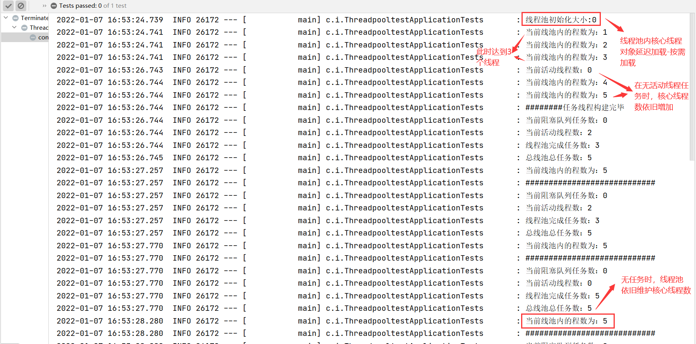

结论：

- 线程池对象初始化时采用延迟加载的方式构建核心线程对象，因为线程对象构建有资源开销；
- 当线程池内的线程数未达到核心线程数时，此时哪怕线程是空闲的，不会复用线程，而是最大努力构建新的线程，直到达到核心线程数为止；

#### 3.2.2 并发情况-2

并发任务数大于核心线程数 ，且小于等于（核心线程数+任务队列长度）

此时循环任务数为：15；

示例代码：

~~~java
package com.itheima;

import com.itheima.service.StockTimerService;
import lombok.extern.slf4j.Slf4j;
import org.junit.jupiter.api.Test;
import org.springframework.beans.factory.annotation.Autowired;
import org.springframework.boot.test.context.SpringBootTest;
import org.springframework.scheduling.concurrent.ThreadPoolTaskExecutor;

import java.util.concurrent.TimeUnit;

@SpringBootTest
@Slf4j
public class ThreadpooltestApplicationTests {
    @Autowired
    private StockTimerService stockTimerService;

    @Autowired
    private ThreadPoolTaskExecutor threadPoolTaskExecutor;

    @Test
    public  void contextLoads() throws InterruptedException {
        //线程池初始化线程数为0
        log.info("线程池初始化大小:{}",threadPoolTaskExecutor.getPoolSize());
//        for (int i = 0; i < 3; i++) {
//               threadPoolTaskExecutor.execute(()->{
//                   stockTimerService.stockRtInto();
//               });
//            //获取线程池内最新的线程数量
//            log.info("当前线池内的程数为：{}",threadPoolTaskExecutor.getPoolSize());
//        }
//        //休眠2s中，保证前3个线程任务都执行完，有闲余的线程
//        TimeUnit.MILLISECONDS.sleep(2000);
//        log.info("当前活动线程数：{}" ,threadPoolTaskExecutor.getActiveCount());//此时为0，证明线程内有闲余的线程
        for (int i = 0; i < 15; i++) {
            threadPoolTaskExecutor.execute(()->{
                stockTimerService.stockRtInto();
            });
            //获取线程池内最新的线程数量
            //发现在没有达到核心线程数时，哪怕有新的任务，也依旧开启新的线程执行
            log.info("当前线池内的程数为：{}",threadPoolTaskExecutor.getPoolSize());
        }
        log.info("########任务线程构建完毕");

        while (true) {
            int queueSize = threadPoolTaskExecutor.getThreadPoolExecutor().getQueue().size();
            log.info("当前阻塞队列任务数：{}" , queueSize);
            log.info("当前活动线程数：{}" ,threadPoolTaskExecutor.getActiveCount());
            long completedTaskCount = threadPoolTaskExecutor.getThreadPoolExecutor().getCompletedTaskCount();
            log.info("线程池完成任务数：{}" ,completedTaskCount);
            //当所有任务都完成后，那么completedTaskCount=taskCount
            long taskCount = threadPoolTaskExecutor.getThreadPoolExecutor().getTaskCount();
            log.info("总线池总任务数：{}" ,taskCount);
            try {
                Thread.sleep(800);
            } catch (InterruptedException e) {
                e.printStackTrace();
            }
            //获取线程池内最新的线程数量
            log.info("当前线池内的程数为：{}",threadPoolTaskExecutor.getPoolSize());
            log.info("############################");
        }
    }
}
~~~

效果：

结论：当核心线程数使用完后，多余的任务优先压入任务队列；

- 当核心线程数被占用，且有新的任务时，优先将新的任务压入队列；
- 当核心线程数已满，且阻塞队列如果未填满，会持续填入；
- 当核心线程存在空闲时，会主动去阻塞队列下领取新的任务处理；

### 3.3 任务队列已满后场景

#### 3.3.1 并发情况-3

阻塞队列已满，且线程池中的线程数为未达到最大线程数：

此时循环任务数为：20

~~~java
package com.itheima;

import com.itheima.service.StockTimerService;
import lombok.extern.slf4j.Slf4j;
import org.junit.jupiter.api.Test;
import org.springframework.beans.factory.annotation.Autowired;
import org.springframework.boot.test.context.SpringBootTest;
import org.springframework.scheduling.concurrent.ThreadPoolTaskExecutor;

import java.util.concurrent.TimeUnit;

@SpringBootTest
@Slf4j
public class ThreadpooltestApplicationTests {
    @Autowired
    private StockTimerService stockTimerService;

    @Autowired
    private ThreadPoolTaskExecutor threadPoolTaskExecutor;

    @Test
    public  void contextLoads() throws InterruptedException {
        //线程池初始化线程数为0
        log.info("线程池初始化大小:{}",threadPoolTaskExecutor.getPoolSize());
//        for (int i = 0; i < 3; i++) {
//               threadPoolTaskExecutor.execute(()->{
//                   stockTimerService.stockRtInto();
//               });
//            //获取线程池内最新的线程数量
//            log.info("当前线池内的程数为：{}",threadPoolTaskExecutor.getPoolSize());
//        }
//        //休眠2s中，保证前3个线程任务都执行完，有闲余的线程
//        TimeUnit.MILLISECONDS.sleep(2000);
//        log.info("当前活动线程数：{}" ,threadPoolTaskExecutor.getActiveCount());//此时为0，证明线程内有闲余的线程
        for (int i = 0; i < 20; i++) {
            threadPoolTaskExecutor.execute(()->{
                stockTimerService.stockRtInto();
            });
            //获取线程池内最新的线程数量
            //发现在没有达到核心线程数时，哪怕有新的任务，也依旧开启新的线程执行
            log.info("当前线池内的程数为：{}",threadPoolTaskExecutor.getPoolSize());
        }
        log.info("########任务线程构建完毕");

        while (true) {
            int queueSize = threadPoolTaskExecutor.getThreadPoolExecutor().getQueue().size();
            log.info("当前阻塞队列任务数：{}" , queueSize);
            log.info("当前活动线程数：{}" ,threadPoolTaskExecutor.getActiveCount());
            long completedTaskCount = threadPoolTaskExecutor.getThreadPoolExecutor().getCompletedTaskCount();
            log.info("线程池完成任务数：{}" ,completedTaskCount);
            //当所有任务都完成后，那么completedTaskCount=taskCount
            long taskCount = threadPoolTaskExecutor.getThreadPoolExecutor().getTaskCount();
            log.info("总线池总任务数：{}" ,taskCount);
            try {
                Thread.sleep(800);
            } catch (InterruptedException e) {
                e.printStackTrace();
            }
            //获取线程池内最新的线程数量
            log.info("当前线池内的程数为：{}",threadPoolTaskExecutor.getPoolSize());
            log.info("############################");
        }
    }
}
~~~

效果：

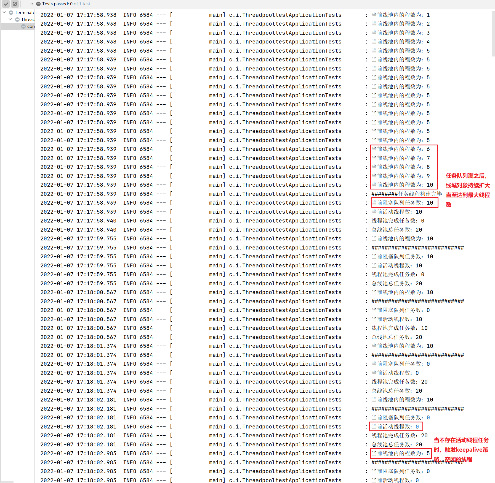

结论：

- 当核心线程数已被使用，且任务队列已满，优先开启临时线程处理任务；
- 线程执行流程：1.先扩容5个核心线程处理任务 2.将多余的10个任务压入队列 3.剩下的构建临时线程处理任务（最大线程数=临时线程数+核心线程数）
- 临时线程如果空闲，且达到keepAliveSenconds指定的最大存活时间，则会被淘汰，直到达到核心线程数为止；

#### 3.3.2 并发情况-4

并发任务数量超过（最大线程数+任务队列长度）的情况；

定义循环线程数量：21，超过了1个线程；

代码：

~~~java
package com.itheima;

import com.itheima.service.StockTimerService;
import lombok.extern.slf4j.Slf4j;
import org.junit.jupiter.api.Test;
import org.springframework.beans.factory.annotation.Autowired;
import org.springframework.boot.test.context.SpringBootTest;
import org.springframework.scheduling.concurrent.ThreadPoolTaskExecutor;

import java.util.concurrent.TimeUnit;

@SpringBootTest
@Slf4j
public class ThreadpooltestApplicationTests {
    @Autowired
    private StockTimerService stockTimerService;

    @Autowired
    private ThreadPoolTaskExecutor threadPoolTaskExecutor;

    @Test
    public  void contextLoads() throws InterruptedException {
        //线程池初始化线程数为0
        log.info("线程池初始化大小:{}",threadPoolTaskExecutor.getPoolSize());
//        for (int i = 0; i < 3; i++) {
//               threadPoolTaskExecutor.execute(()->{
//                   stockTimerService.stockRtInto();
//               });
//            //获取线程池内最新的线程数量
//            log.info("当前线池内的程数为：{}",threadPoolTaskExecutor.getPoolSize());
//        }
//        //休眠2s中，保证前3个线程任务都执行完，有闲余的线程
//        TimeUnit.MILLISECONDS.sleep(2000);
//        log.info("当前活动线程数：{}" ,threadPoolTaskExecutor.getActiveCount());//此时为0，证明线程内有闲余的线程
        for (int i = 0; i < 21; i++) {
            threadPoolTaskExecutor.execute(()->{
                stockTimerService.stockRtInto();
            });
            //获取线程池内最新的线程数量
            //发现在没有达到核心线程数时，哪怕有新的任务，也依旧开启新的线程执行
            log.info("当前线池内的程数为：{}",threadPoolTaskExecutor.getPoolSize());
        }
        log.info("########任务线程构建完毕");

        while (true) {
            int queueSize = threadPoolTaskExecutor.getThreadPoolExecutor().getQueue().size();
            log.info("当前阻塞队列任务数：{}" , queueSize);
            log.info("当前活动线程数：{}" ,threadPoolTaskExecutor.getActiveCount());
            long completedTaskCount = threadPoolTaskExecutor.getThreadPoolExecutor().getCompletedTaskCount();
            log.info("线程池完成任务数：{}" ,completedTaskCount);
            //当所有任务都完成后，那么completedTaskCount=taskCount
            long taskCount = threadPoolTaskExecutor.getThreadPoolExecutor().getTaskCount();
            log.info("总线池总任务数：{}" ,taskCount);
            try {
                Thread.sleep(800);
            } catch (InterruptedException e) {
                e.printStackTrace();
            }
            //获取线程池内最新的线程数量
            log.info("当前线池内的程数为：{}",threadPoolTaskExecutor.getPoolSize());
            log.info("############################");
        }
    }
}
~~~

效果：

通过阅读源码我们发现：

默认采用AbortPolicy策略，直接中断程序执行

结论：

- 什么时候触发任务的拒绝策略？
  - 1.任务队列已满，且没有空闲的线程（线程已经达到最大线程数），则会触发拒绝策略；
  - 2.线程池对象sutdown关闭拒绝服务时，也会触发拒绝策略；
  - 3.拒绝策略：
    - jdk给我们提供了4种；
      - AbortPolicy 抛出异常，终止程序允许
      - DiscardPolicy 丢弃新的任务，不抛出异常
      - DiscardOldestPolicy 丢弃旧的任务，不抛出异常
      - CallsRunerPolicy 委托主线程执行任务 不抛出异常

## 4、自定义线程池拒绝策略

第一步：自定义线程任务对象

~~~java
package com.itheima.config;

import com.itheima.service.StockTimerService;

import java.util.Map;

/**
 * @author by itheima
 * @Date 2022/1/7
 * @Description
 */
public class StockTaskRunable implements Runnable{

    //携带的任务信息,任务拒绝时，使用
    private Map<String,Object> infos;

    private StockTimerService stockTimerService;

    public StockTaskRunable(Map<String, Object> infos, StockTimerService stockTimerService) {
        this.infos = infos;
        this.stockTimerService = stockTimerService;
    }
	//任务逻辑
    @Override
    public void run() {
        stockTimerService.stockRtInto();
    }
	//提供get方法
    public Map<String, Object> getInfos() {
        return infos;
    }
}
~~~

第二步：自定义拒绝策略

~~~java
package com.itheima.config;

import com.itheima.service.StockTimerService;
import lombok.extern.slf4j.Slf4j;

import java.util.Map;
import java.util.concurrent.RejectedExecutionHandler;
import java.util.concurrent.ThreadPoolExecutor;

/**
 * @author by itheima
 * @Date 2022/1/7
 * @Description 自定义线程池任务拒绝策略
 */
@Slf4j
public class StockTaskRejectedExecutionHandler implements RejectedExecutionHandler {
    @Override
    public void rejectedExecution(Runnable r, ThreadPoolExecutor executor) {
        if (r instanceof StockTaskRunable) {
            StockTaskRunable r2= ((StockTaskRunable) r);
            Map<String, Object> infos = r2.getInfos();
            log.info("出现的异常的任务信息：{}",infos);
        }
    }
}
~~~

第三步：配置拒绝策略

~~~java
    /**
     * 定义任务执行器
     * @return
     */
    @Bean(name = "threadPoolTaskExecutor",destroyMethod = "shutdown")
    public ThreadPoolTaskExecutor threadPoolTaskExecutor(){
         //构建线程池对象
         ThreadPoolTaskExecutor taskExecutor = new ThreadPoolTaskExecutor();
         //核心线程数：核心线程数（获取硬件）：线程池创建时候初始化的线程数
         taskExecutor.setCorePoolSize(info.getCorePoolSize());
         //最大线程数：只有在缓冲队列满了之后才会申请超过核心线程数的线程
         taskExecutor.setMaxPoolSize(info.getMaxPoolSize());
         //缓冲队列：用来缓冲执行任务的队列
         taskExecutor.setQueueCapacity(info.getQueueCapacity());
         //允许线程的空闲时间：当超过了核心线程出之外的线程在空闲时间到达之后会被销毁
         taskExecutor.setKeepAliveSeconds(info.getKeepAliveSeconds());
         //线程名称前缀
         taskExecutor.setThreadNamePrefix("StockThread-");
         //设置拒绝策略
          taskExecutor.setRejectedExecutionHandler(rejectedExecutionHandler());
         //参数初始化
         taskExecutor.initialize();
         return taskExecutor;
    }

    /**
     * 自定义线程拒绝策略
     * @return
     */
    @Bean
    public RejectedExecutionHandler rejectedExecutionHandler(){
        StockTaskRejectedExecutionHandler errorHandler = new StockTaskRejectedExecutionHandler();
        return errorHandler;
    }
~~~

第四步：测试

~~~java
    @Test
    public  void contextLoads2() throws InterruptedException {
        //线程池初始化线程数为0
        log.info("线程池初始化大小:{}",threadPoolTaskExecutor.getPoolSize());
         for (int i = 0; i < 21; i++) {
             HashMap<String, Object> info = new HashMap<>();
             info.put("handler","stockRtInfo");
             //自定义任务
             StockTaskRunable task = new StockTaskRunable(info, stockTimerService);
             threadPoolTaskExecutor.execute(task);
            //获取线程池内最新的线程数量
            //发现在没有达到核心线程数时，哪怕有新的任务，也依旧开启新的线程执行
            log.info("当前线池内的程数为：{}",threadPoolTaskExecutor.getPoolSize());
        }
        log.info("########任务线程构建完毕");
        while (true) {
            int queueSize = threadPoolTaskExecutor.getThreadPoolExecutor().getQueue().size();
            log.info("当前阻塞队列任务数：{}" , queueSize);
            log.info("当前活动线程数：{}" ,threadPoolTaskExecutor.getActiveCount());
            long completedTaskCount = threadPoolTaskExecutor.getThreadPoolExecutor().getCompletedTaskCount();
            log.info("线程池完成任务数：{}" ,completedTaskCount);
            //当所有任务都完成后，那么completedTaskCount=taskCount
            long taskCount = threadPoolTaskExecutor.getThreadPoolExecutor().getTaskCount();
            log.info("总线池总任务数：{}" ,taskCount);
            try {
                Thread.sleep(800);
            } catch (InterruptedException e) {
                e.printStackTrace();
            }
            //获取线程池内最新的线程数量
            log.info("当前线池内的程数为：{}",threadPoolTaskExecutor.getPoolSize());
            log.info("############################");
        }
    }
~~~

效果：

## 5、线程池参数设置原则

### 5.1 如何为线程池设置合适的线程参数？

目前根据一些开源框架，设置多少个线程数量通常是根据应用的类型**：I/O 密集型、CPU 密集型。**

- I/O密集型

  - I/O密集型的场景在开发中比较常见，比如像 MySQL数据库读写、文件的读写、网络通信等任务，这类任务不会   特别消耗CPU资源，但是IO操作比较耗时，会占用比较多时间;
  - IO密集型通常设置为 2n+1，其中 n 为 CPU 核数;
  - 说白了，对于i/o密集型的场景，不太占用cpu资源，所以并发的任务数大于cpu的核数，这样的话能更加充分的利用CPU资源；
- CPU密集型

  - CPU密集型的场景，比如像加解密，压缩、计算等一系列需要大量耗费 CPU 资源的任务，这些场景大部分都是纯   CPU计算;
  - CPU密集型通常设置为n+1,这样也可避免多线程环境下CPU资源挣钱带来上下文频繁切换的开销；

### 5.2 如何获取当前服务器的cpu核数？

~~~java
int cors= Runtime.getRuntime().availableProcessors();
~~~

### 5.3 无界队列问题

实际运行中，我们一般会设置线程池的阻塞队列长度，如果不设置，则采用默认值：

~~~java
private int corePoolSize = 1;
private int maxPoolSize = Integer.MAX_VALUE;
private int keepAliveSeconds = 60;
private int queueCapacity = Integer.MAX_VALUE;
~~~

在这个过程中，如果设置或者使用不当，容易造成内存溢出问题，同时如果设置了无界队列，那么线程池的最大线程数也就失去了意义；

所以企业开发中会命令**禁止使用默认的队列长度**；
