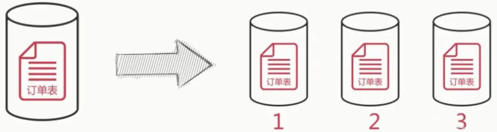
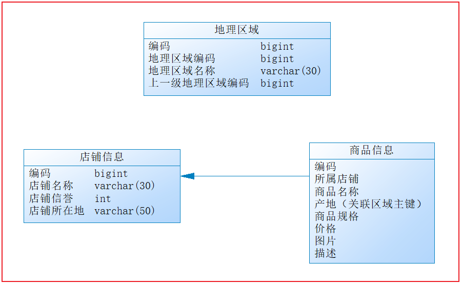
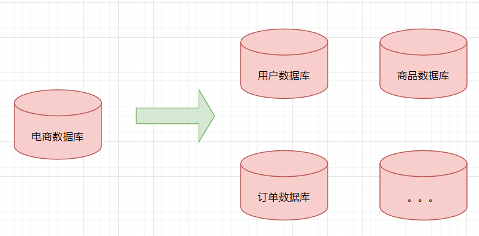
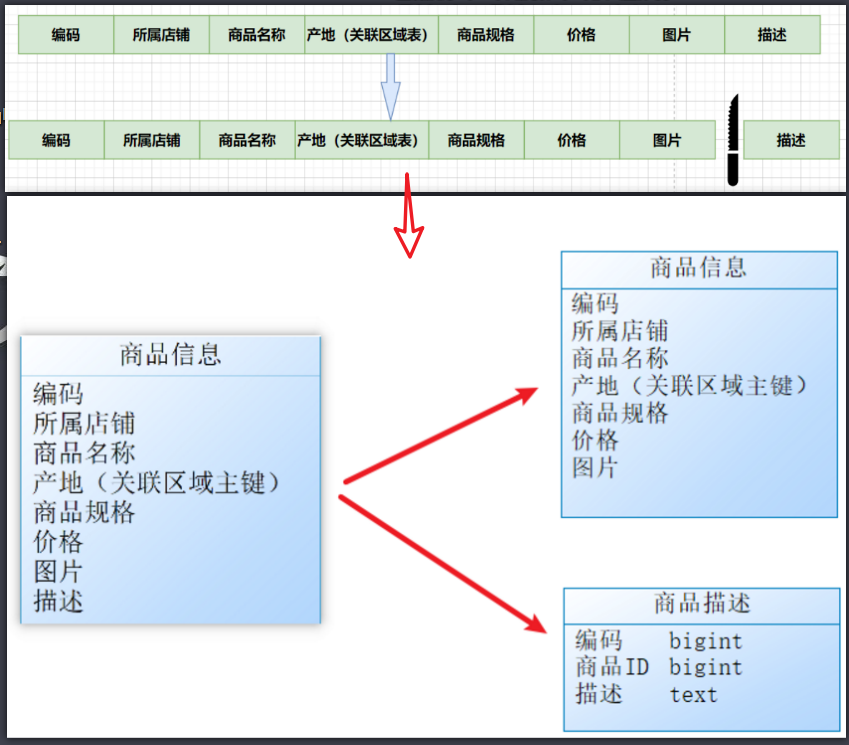
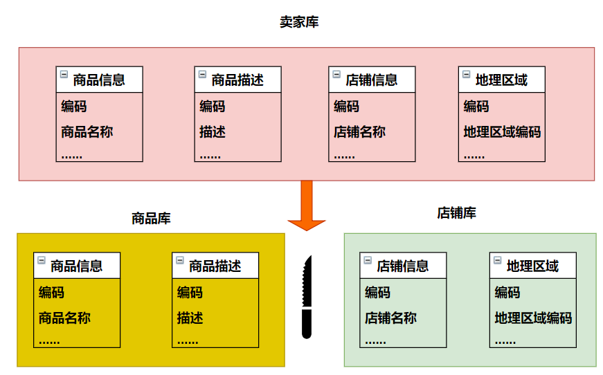
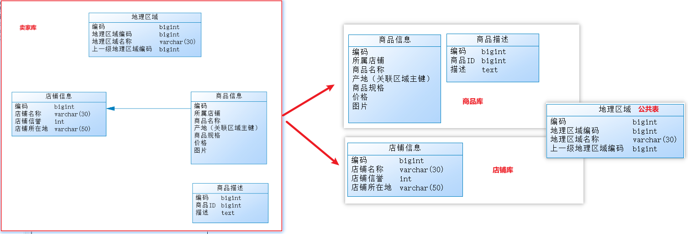
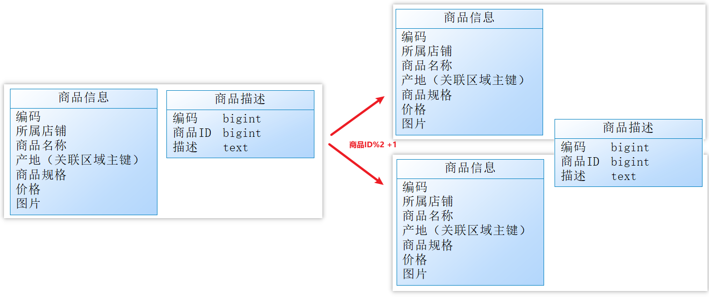
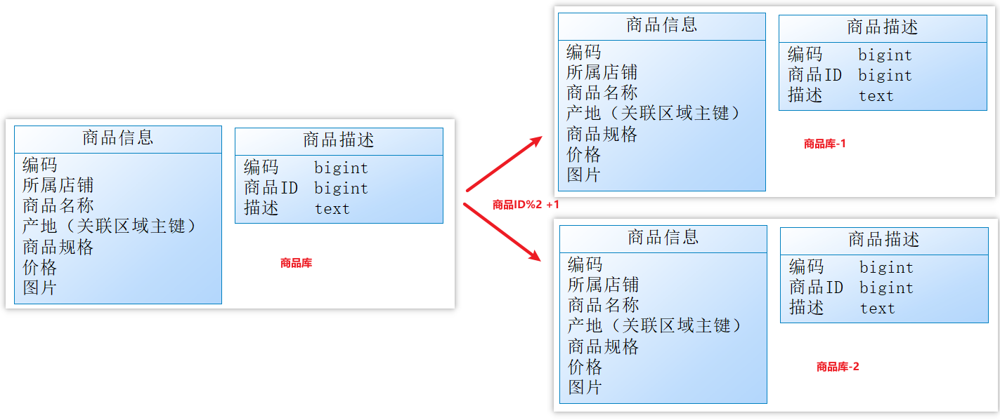
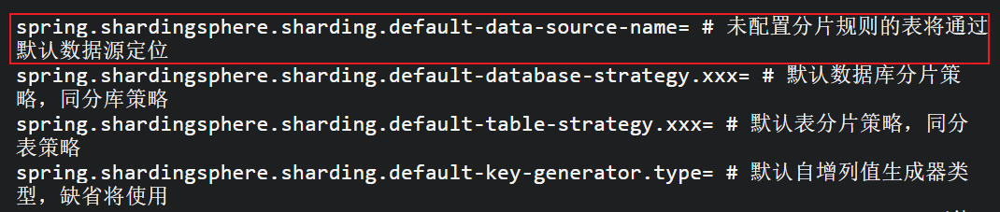
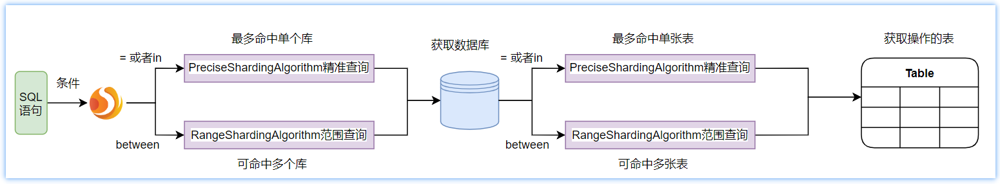

# 分库分表专题

## 学习目标

1、理解分库分表基础概念【垂直分库分表、水平分库分表】
2、能够说出sharding-jdbc为我们解决什么问题
3、理解sharding-jdbc中的关键名词
4、理解sharding-jdbc的整体架构及原理
5、掌握sharding-jdbc集成SpringBoot的方式

# 第一章 分库分表介绍

## 1、分库分表概述

分库分表本质上就是为了解决由于库表数据量过大而导致数据库性能降低的问题;
核心操作：

- 将原来独立的数据库拆分成若干数据库组成;
- 将原来的大表(存储近千万数据的表)拆分成若干个小表；

目的：**使得单一数据库、单一数据表的数据量变小，从而达到提升数据库性能的目的**；



## 2、分库分表场景示例

### 2.1 场景说明

 老王是一家初创电商平台的开发人员,负责**卖家模块**的功能开发，其中涉及了店铺、商品的相关业务，设计如下数据库：



实际业务中经常需要查询商品、商铺、地理位置等信息，效果如下：


通过以下SQL能够获取到商品相关的店铺信息、地理区域信息：

~~~sql
SELECT p.*,r.[地理区域名称],s.[店铺名称],s.[信誉]
FROM [商品信息表] p 
LEFT JOIN [地理区域表] r ON p.[产地] = r.[地理区域编码]
LEFT JOIN [店铺信息表] s ON p.id = s.[所属店铺]
WHERE p.id = ?
~~~

随着公司业务快速发展，数据库中的店铺、商品等数据量会猛增，大数据量且并发高的访问会导致数据库性能急剧下降；

### 2.2 数据库访问变慢原因分析

原因如下：

- 在系统应用中关系型数据库本身比较容易成为系统瓶颈（I/O）,比如：单机存储容量、数据库连接数、处理能力等都有上限；
- 当单表的数据量达到1000W或100G以后(大表)，即使做了优化索引等操作，查询性能仍会下降严重，更不要说复杂的多表关联查询了；
- 对于商家模块来说，当数据量过大是，会存在大表关联查询，导致查询性能急剧下降！[尽量避免大表的关联查询-查询优化-反三大范式]

## 3、大数据存储下数据库性能分析

优化数据库要从硬件和软件层面优化：

- 硬件层面

  - 提升服务器硬件能力来提高数据处理能力，比如增加存储容量 、CPU等；
  - 提升硬件配置相对成本较高，且如果瓶颈在MySQL本身那么提高硬件带来的性能提升也是有限的；

- 软件层面

  - 把大量数据分散在不同的数据库中，使得单一数据库的数据量变小来缓解单一数据库的性能问题；
  - 把大表拆分成若干小表，解决单张大表查询性能问题；


  - 对于关系型数据库来说，磁盘I/O会成为其瓶颈，通过缓存热点数据，在一定程度来可提升系统性能；

如下图将电商数据库拆分为若干独立的数据库，并且对于大表也拆分为若干小表，通过这种数据库拆分的方法来解决数据库的性能问题：



### 小结

- 分库分表是为了解决由于数据量过大而导致数据库性能降低的问题；
- 分库分表是将原来独立的数据库拆分成若干数据库，将独立的大表拆分成若干小表过程；
- 分库分表最终使得单一数据库、单一数据表的数据量变小，从而达到提升数据库性能的目的；


# 第二章 分库分表方式

 分库分表包括**分库和分表**两个部分，在生产中通常包括：**垂直分库、水平分库、垂直分表、水平分表**四种方式；

## 1、垂直分表

### 1.1 垂直分表定义

- 垂直分表就是在同一数据库内将一张表按照指定字段分成若干表，每张表仅存储其中一部分字段；
- 垂直分表拆解了原有的表结构，拆分的表之间一般是一对一的关系；

### 1.2 垂直分表场景示例

#### 1.2.1 场景说明

下边通过一个商品查询的案例讲解垂直分表，通常在商品列表中是不显示商品详情信息的，如下图：


 说明：

- 用户浏览商品列表时只对感兴趣商品查看商品详情：**商品描述信息被访问的频次较低，且该字段占用存储空间较大**；
- 商品表字段出现部分字段访问频次不一致的情况：**商品名称、商品图片、商品价格等其他字段数据访问频次较高**

 由于这两组数据的特性不一样，因此我们可以考虑将商品信息表拆分如下，将访问频次低的商品描述信息单独存放在一张表中，访问频次较高的商品基本信息单独放在一张表中：



商品列表可采用以下sql：

~~~sql
SELECT p.*,r.[地理区域名称],s.[店铺名称],s.[信誉]
FROM [商品信息] p 
LEFT JOIN [地理区域] r ON p.[产地] = r.[地理区域编码]
LEFT JOIN [店铺信息] s ON p.id = s.[所属店铺]
WHERE...ORDER BY...LIMIT...
~~~

需要获取商品描述时，再通过以下sql获取：

~~~sql
SELECT *
FROM [商品描述] 
WHERE [商品ID] = ?
~~~

#### 1.2.2 垂直分表优势

- 充分提高了**热点数**据的操作效率，商品信息的操作的高效率不会被商品描述的低效率所拖累（冷热数据分离）；
- 避免了IO过度争抢并减少锁表的几率，查看商品详情的用户与商品信息浏览互不影响；

#### 1.2.3 垂直分表原则

- 把不常用的字段单独放在一张表;（因为数据库加载数据时，会将表整整行的信息加载）
- 把text（大文本存储），blob（图片、视频类存储）等大字段拆分出来放在附表中（阿里开发手册严禁使用text等大字段）;
- 经常组合查询的列放在一张表中，避免多表联查，性能最高;


## 2、垂直分库

### 2.1 垂直分表存在的问题

- 经过**垂直分表**后表的查询性能确实得到了一定程度的提升，但数据始终限制在同一台机器内，因此因此每个表还是竞争同一个物理机的CPU、内存、网络IO、磁盘；
- 单台服务器的性能瓶颈（比如：CPU、内存、网络IO、磁盘等）通过垂直分表始终得不到突破；

### 2.2 垂直分库定义

​	垂直分库是指按照业务将表进行归类，然后把不同类的表分布到不同的数据库上面，而每个库又可以放在不同的服务器上，它的核心理念是-**专库专用**；

### 2.3 示例场景

 经过思考，我们可以将原有的卖家库，拆分为分为商品库和店铺库，并把这两个库分散到不同服务器上，如下图：





> 注意事项：
>
> 由于商品信息与商品描述业务耦合度较高，因此一起被存放在商品库（避免跨库联查）；
> 店铺信息相对独立，因此可单独被存放在店铺库下；
> 对于地理区域表，因为商品信息和店铺信息都需要，且地理区域是不经常变动的常量表但是会存在与其他表联查的情况，所以可以将它作为公共表分别等量部署到不同的数据库节点下；
> 以上操作就可以称为垂直分库。

### 2.4垂直分库优势

垂直分库带来的提升是：

- 通过不同表的业务聚合（聚合为库），使得数据库维护更加清晰；

- 能对不同业务的数据进行分级管理、维护、监控、扩展等；

- 高并发场景下，垂直分库在一定程度上提高了磁盘IO和数据库连接数，并改善了单机硬件资源的瓶颈问题；


 但是，**垂直分库依然没有解决库中单表数据量过大的问题！** 

## 3、 水平分表

### 3.1水平分表定义

- 水平分表就是在同一个数据库内，把同一个表的数据按一定规则拆到多个表中，表的结构没有变化；
- 水平分表解决单表数据量大的问题；

### 3.2 水平分表示例

为解决单表数据量大的问题，我们可把商品库内的表进行水平拆分，得到若干相同表结构的小表；

需要注意的是各个小表存储的数据不同，且数据依旧保存在同一个数据库内；

如下图：



> 分表算法说明：
>
> 如果商品ID为双数，将此操作映射至商品信息1表；如果商品ID为单数，将操作映射至商品信息2表。此操作要访问表名称的表达式为商品信息[商品ID%2 + 1];
>
> 这种操作就叫做：水平分表。

### 3.3 水平分表优势

 **水平分表**是在同一个数据库内，把同一个表的数据按一定规则拆到多个表中，它带来的提升是：

- 优化单一表数据量过大而产生的性能问题;
- 避免IO争抢并减少锁表的几率;

**整体看，水平分表仅仅解决了单表数据量过大的问题，但是没有解决单库数据量过大的问题；**

## 4、水平分库

### 4.1 水平分库定义

- 水平分库可以看做是水平分表的进一步拆分，是把同一个表的数据按一定规则拆到不同的数据库中，每个库又可以部署到不同的服务器上；
- 水平分库解决了单库数据量大的问题，突破了服务器物理存储的瓶颈；

### 4.2 水平分库示例场景

​	经过**垂直分库和水平分表**后，数据库性能问题得到一定程度的解决，但是随着业务量的增长，商品库单库存储数据已经超出预估。

假如当前有8w店铺，每个店铺平均150个不同规格的商品，那商品数量得往1200w+上预估，并且商品库属于访问非常频繁的资源，**单台服务器已经无法支撑**。

此时该如何优化？

​	目前情况是那怕**再次垂直分库也无法解决数据瓶颈问题**。我们可以尝试**水平分库**，将商品ID为单数的和商品ID为双数的商品信息分别放在两个不同库中；



>说明：
>
>如果商品ID为双数，将此操作映射至【商品库-1】；
>如果店铺ID为单数，将操作映射至【商品库-2】；
>此操作要访问数据库名称的表达式为：商品库_(商品ID%2 + 1)；
>这种操作就叫水平分库。
>总之，水平分库后，各个库保存的表结构是一致的，但是表中内容不一样；

### 4.3 水平分库优势

水平分库带来的提升是：

- 解决了单库大数据，高并发的性能瓶颈问题；
- 提高了系统的稳定性及可用性；

 总之，当一个应用难以再细粒度的垂直切分，或切分后数据量行数巨大，存在单库读写、存储性能瓶颈，这时候就需要进行**水平分库**了，经过水平切分的优化，往往能==解决单库存储量及性能瓶颈==。但由于同一个表被分配在不同的数据库，需要额外进行数据操作的路由工作，因此大大提升了系统复杂度。


## 5、分库分表带来的问题

分库分表能有效的缓解了单机和单库带来的性能瓶颈和压力，突破网络IO、硬件资源、连接数的瓶颈，同时也带来了一些问题。 

- 分布式事务一致性问题
- 跨节点关联查询
- 跨节点分页、排序函数
- 主键避重
- 公共表(小数据量的表且经常使用，可能存在联查的情况）

显然如果我们自己去解决上述问题，开发工作量较大，所以我们就有必要学习一种支持分库分表特性的技术：sharding-jdbc、mycat等；

## 6、分库分表小结

分库分表方式：垂直分表、垂直分库、水平分库和水平分表

**垂直分表：**可以把一个宽表的字段按访问频次、是否是大字段的原则拆分为多个表，这样既能使业务清晰，还能提升部分性能。拆分后，尽量从业务角度避免联查，否则性能方面将得不偿失【**同一库中将单张表按照字段拆分成若干表，拆分后表的记录行数不变**】。 

**垂直分库：**可以把多个表按业务耦合松紧归类，分别存放在不同的库，这些库可以分布在不同服务器，从而使访问压力被多服务器负载，大大提升性能，同时能提高整体架构的业务清晰度，不同的业务库可根据自身情况定制优化方案。但是它需要解决跨库带来的所有复杂问题。 【**根据业务将表分组形成不同的库，这些库又可以部署到不同的数据库中-专库专用**】

**水平分表：**可以把一个表的数据(按数据行)分到多个同一个数据库的多张表中，每个表只有这个表的部分数据，这样做能小幅提升性能，它仅仅作为水平分库的一个补充优化。【**同一数据库中将大表拆分成若干小表，每张表的结构一致，但保存的数据不同**】

**水平分库：**可以**把表的数据(按数据行)分 到多个不同的库**，每个库只有这个表的部分数据，这些库可以分布在不同服务器，从而使访问压力被多服务器负载，大大提升性能。它不仅需要解决跨库带来的所有复杂问题，还要解决数据路由的问题(数据路由问题后边介绍)。 

**最佳实践：**

一般来说，在**系统设计阶段**就应该根据业务耦合松紧来确定**垂直分库，垂直分表**方案。当然在数据量及访问压力不是特别大的情况，首先**考虑缓存、读写分离、索引技术**等方案。若数据量极大，且持续增长，再考虑**水平分库水平分表**方案。 

总之，基于开发和维护成本比考虑，非必须，不要对数据库做分库分表处理！

# 第三章 Sharding-JDBC入门

## 1、ShardingSphere生态简介

​	Apache ShardingSphere 是一套开源的**分布式数据库**解决方案组成的生态圈，核心由： **JDBC**、Proxy 和 Sidecar（规划中）这 3 款既能够独立部署，又支持混合部署配合使用的产品组成；

功能特性：它们均提供标准化的数据**水平扩展**、**分布式事务**和**分布式治理**等功能，可适用于如 Java 同构、异构语言、云原生等各种多样化的应用场景。

官方网站：https://shardingsphere.apache.org/index_zh.html

文档地址：https://shardingsphere.apache.org/document/legacy/4.x/document/cn/overview

本教程主要介绍：Sharding-JDBC；

​	Sharding-jdbc是ShardingSphere的其中一个模块，定位为==轻量级Java框架==，在Java的JDBC层提供的额外服务。 它使用客户端直连数据库，以jar包形式提供服务，无需额外部署和依赖，**可理解为增强版的JDBC驱动，完全兼容JDBC和各种ORM框架**。

- 适用于任何基于Java的ORM框架，如：JPA, Hibernate, Mybatis, Spring JDBC Template或直接使用JDBC。
- 基于任何第三方的数据库连接池，如：DBCP, C3P0, BoneCP, Druid, HikariCP等。
- 支持任意实现JDBC规范的数据库。目前支持MySQL，Oracle，SQLServer和PostgreSQL。

Sharding-JDBC的核心功能为**数据分片**和**读写分离**，通过Sharding-JDBC，应用可以**透明**的使用jdbc访问已经分库分表、读写分离的多个数据源，而不用关心数据源的数量以及数据如何分布。 

## 2、sharding-jdbc相关名词解释

参考官网-[核心概念](https://shardingsphere.apache.org/document/legacy/4.x/document/cn/features/sharding/concept/sql/)

- 逻辑表（LogicTable）：进行水平拆分的时候同一类型（逻辑、数据结构相同）的表的总称。例：用户数据根据主键尾数拆分为2张表，分别是tab_user_0到tab_user_1，他们的逻辑表名为tab_user。

- 真实表（ActualTable）：在分片的数据库中真实存在的物理表。即上个示例中的tab_user_0到tab_user_1。

- 数据节点（DataNode）：数据分片的最小单元。由数据源名称和数据表组成，例：spring-boot_0.tab_user_0，spring-boot_0.tab_user_1，spring-boot_1.tab_user_0，spring-boot_1.tab_user_1。

  说白了，具体到指定库下的指定表就是一个数据节点；

- 动态表（DynamicTable）：逻辑表和物理表不一定需要在配置规则中静态配置。如，按照日期分片的场景，物理表的名称随着时间的推移会产生变化（股票流水）。

- 广播表（公共表）：指所有的分片数据源中都存在的表，表结构和表中的数据在**每个数据库中均完全一致**。适用于数据量不大且需要与海量数据的表进行关联查询的场景，例如：字典表。

- 绑定表（BindingTable）：指E。例如：`t_order`表和`t_order_item`表，均按照`order_no`分片，则此两张表互为绑定表关系。绑定表之间的多表关联查询不会出现笛卡尔积关联，关联查询效率将大大提升。举例说明，如果SQL为：

  ```sql
  SELECT i.* FROM t_order o JOIN t_order_item i ON o.order_id=i.order_id WHERE o.order_id in (10, 11);
  ```

  让order的数据落库位置，与order_item落库的位置在同一个数据节点。

  在不配置绑定表关系时，假设分片键`order_id`将数值10路由至第0片，将数值11路由至第1片，那么路由后的SQL应该为4条，它们呈现为笛卡尔积：

  ```sql
  SELECT i.* FROM t_order_0 o JOIN t_order_item_0 i ON o.order_id=i.order_id WHERE o.order_id in (10, 11);
   
  SELECT i.* FROM t_order_0 o JOIN t_order_item_1 i ON o.order_id=i.order_id WHERE o.order_id in (10, 11);
   
  SELECT i.* FROM t_order_1 o JOIN t_order_item_0 i ON o.order_id=i.order_id WHERE o.order_id in (10, 11);

  SELECT i.* FROM t_order_1 o JOIN t_order_item_1 i ON o.order_id=i.order_id WHERE o.order_id in (10, 11);
  ```

  在配置绑定表关系后，路由的SQL应该为2条：

  ```sql
  SELECT i.* FROM t_order_0 o JOIN t_order_item_0 i ON o.order_id=i.order_id WHERE o.order_id in (10, 11);
       
  SELECT i.* FROM t_order_1 o JOIN t_order_item_1 i ON o.order_id=i.order_id WHERE o.order_id in (10, 11);
  ```

  其中t_order在FROM的最左侧，ShardingSphere将会以它作为整个绑定表的主表。 所有路由计算将会只使用主表的策略，那么t_order_item表的分片计算将会使用t_order`的条件。故绑定表之间的分区键要完全相同。【解决多表关联查询造成笛卡尔积问题】

- [分片键](https://shardingsphere.apache.org/document/legacy/4.x/document/cn/features/sharding/concept/sharding/)（ShardingColumn）：分片字段用于将数据库（表）水平拆分的字段，支持单字段及多字段分片。例如上例中的order_id。

  一般在业务中经常查询使用的字段会作为分片键；

## 3、Sharding-JDBC执行原理


参考官网-[内部剖析](https://shardingsphere.apache.org/document/legacy/4.x/document/cn/features/sharding/principle/)：

逻辑表：t_user

物理表：ds0.t_user_1,ds0.t_user_2,ds1.t_user_1,ds1.t_user_2

shardingSphere的3个产品的数据分片主要流程是完全一致的。 核心由`SQL解析 => 执行器优化 => SQL路由 => SQL改写 => SQL执行 => 结果归并`的流程组成。

例如现在有一条查询语句：

```sql
# 此时t_user对应的表是不存在的，是逻辑上表
select * from t_user where id=10 
```

进行了分库分表操作，2个库ds0，ds1，采用的分片键为id，逻辑表为t_user,真实表为t_user_0、t_user_1两张表，分库、分表算法为均为取余（%2）。

- sql解析：通过解析sql语句提取分片键列与值进行分片，例如比较符 =、in 、between and，及查询的表等。

- 执行器优化：合并和优化分片条件，如OR 转化成 in等。

  ​		select * from t_user where id=1 or id=2 or id=3 自动优化：select * from t_user where id in （1,2,3）	

- sql路由：找到sql需要去哪个库、哪个表执行语句，上例sql根据采用的策略可以得到将在ds0库，t_user_0表执行语句。说白了，就是根据逻辑表查找物理表的过程；

- sql改写：根据解析结果，及采用的分片逻辑改写sql，SQL改写分为正确性改写和优化改写。

  上例经过sql改写后，真实语句为：

```sql
select * from ds0.t_user_0 where id=10；==>ds0.t_user_0 2S
select * from ds0.t_user_1 where id=10；==>ds0.t_user_1 2S
select * from ds1.t_user_0 where id=10；==>ds1.t_user_0 2S
select * from ds1.t_user_1 where id=10；==>ds1.t_user_1 2S
```

- sql执行：通过多线程执行器异步执行。
- 结果归并：将多个执行结果集归并以便于通过统一的JDBC接口输出。结果归并包括流式归并、内存归并和使用装饰者模式的追加归并这几种方式；


## 4、sharding-jdbc分片方式介绍

> 参考：https://shardingsphere.apache.org/document/legacy/4.x/document/cn/manual/sharding-jdbc/configuration/config-spring-boot/

sharding-jdbc实现数据分片有4种策略：

- **inline模式**

  - 使用最简单，开发成本比较低；
  - 只能使用单个字段作为分片键；
  - 基于行表达式定义分片规则；

  ```tex
  通过groovy表达式来表示分库分表的策略；
  db0
    ├── t_order0
    └── t_order1
  db1
    ├── t_order0
    └── t_order1
    表达式：db${0..1}.t_order${0..1}
    	     t_order${orderId % 2}
  ```

- **standard标准分片模式**

  - 用户可通过代码自定义复杂的分片策略；
  - 同样只能使用单个字段作为分片键；

- complex复合分片模式

  - 用于多分片键的复合分片策略（多片键）

- Hint强制分片模式

  - 不指定片键，通过代码动态指定路由规则
  - 强制分片策略（强制路由）

## 5、基于inline模式实现水平分表

### 5.1 水平分表数据准备

```tex
order_db_1
  ├── t_order_1
  └── t_order_2
```

SQL准备

```sql
#创建数据库
CREATE DATABASE `order_db_1` CHARACTER SET 'utf8' COLLATE 'utf8_general_ci';
#建表
USE order_db_1;
DROP TABLE IF EXISTS `t_order_1`;
CREATE TABLE `t_order_1` (
    `order_id` BIGINT (20) NOT NULL COMMENT '订单id',
    `price` DECIMAL (10, 2) NOT NULL COMMENT '订单价格',
    `user_id` BIGINT (20) NOT NULL COMMENT '下单用户id',
    `status` VARCHAR (50) CHARACTER
SET utf8 COLLATE utf8_general_ci NOT NULL COMMENT '订单状态',
 PRIMARY KEY (`order_id`) USING BTREE
) ENGINE = INNODB CHARACTER
SET = utf8 COLLATE = utf8_general_ci ROW_FORMAT = Dynamic;

DROP TABLE IF EXISTS `t_order_2`;
CREATE TABLE `t_order_2` (
    `order_id` BIGINT (20) NOT NULL COMMENT '订单id',
    `price` DECIMAL (10, 2) NOT NULL COMMENT '订单价格',
    `user_id` BIGINT (20) NOT NULL COMMENT '下单用户id',
    `status` VARCHAR (50) CHARACTER
SET utf8 COLLATE utf8_general_ci NOT NULL COMMENT '订单状态',
 PRIMARY KEY (`order_id`) USING BTREE
) ENGINE = INNODB CHARACTER
SET = utf8 COLLATE = utf8_general_ci ROW_FORMAT = Dynamic;
```

### 5.2 工程集成sharding-jdbc

准备环境：jdk8

导入基础测试工程：day09-分库分表专题\资料\基础代码\ **sharding_demo**

第一步：测试工程引入核心依赖

```xml
<dependencies>
  <dependency>
    <groupId>org.mybatis.spring.boot</groupId>
    <artifactId>mybatis-spring-boot-starter</artifactId>
    <version>2.1.4</version>
  </dependency>
  <!--引入sharding依赖-->
  <dependency>
    <groupId>org.apache.shardingsphere</groupId>
    <artifactId>sharding-jdbc-spring-boot-starter</artifactId>
    <version>4.0.0-RC1</version>
  </dependency>

  <dependency>
    <groupId>com.alibaba</groupId>
    <artifactId>druid</artifactId>
    <version>1.2.8</version>
  </dependency>
</dependencies>
```

第二步：定义sharding相关配置

**1) 主配置**

```properties
# 应用名称
spring.application.name=sharding_all
#下面这些内容是为了让MyBatis映射
#指定Mybatis的Mapper文件
mybatis.mapper-locations=classpath:mappers/*xml
#指定Mybatis的实体目录
mybatis.type-aliases-package=com.sharding.inline.pojo
spring.profiles.active=test1
```

**2) 环境application-test1.properties配置**

```properties
# 分表配置
# 数据源名称，多数据源以逗号分隔
spring.shardingsphere.datasource.names=ds1
# 数据库连接池类名称
spring.shardingsphere.datasource.ds1.type=com.alibaba.druid.pool.DruidDataSource
# 数据库驱动类名
spring.shardingsphere.datasource.ds1.driver-class-name=com.mysql.cj.jdbc.Driver
# 数据库 url 连接
spring.shardingsphere.datasource.ds1.url=jdbc:mysql://192.168.188.130:3306/order_db_1?useUnicode=true&characterEncoding=UTF-8&allowMultiQueries=true&useSSL=false&serverTimezone=Asia/Shanghai
# 数据库用户名
spring.shardingsphere.datasource.ds1.username=root
# 数据库密码
spring.shardingsphere.datasource.ds1.password=root
# 数据库连接池的其它属性
#spring.shardingsphere.datasource.ds1.xxx=

# 由数据源名 + 表名组成，以小数点分隔。多个表以逗号分隔，支持 inline 表达式
spring.shardingsphere.sharding.tables.t_order.actual-data-nodes=ds1.t_order_$->{1..2}
# 行表达式分片策略
# 分片列名称
spring.shardingsphere.sharding.tables.t_order.table-strategy.inline.sharding-column=order_id
# 分片算法行表达式，需符合 groovy 语法
spring.shardingsphere.sharding.tables.t_order.table-strategy.inline.algorithm-expression=t_order_$->{order_id % 2 +1}
```

**3) 定义mapper接口和xml**

```java
package com.itheima.shardingjdbc.mapper;

import com.itheima.shardingjdbc.pojo.TOrder;
import org.apache.ibatis.annotations.Mapper;

/**
 * @Entity com.itheima.shardingjdbc.pojo.TOrder
 */
@Mapper
public interface TOrderMapper {

    int deleteByPrimaryKey(Long id);

    int insert(TOrder record);

    int insertSelective(TOrder record);

    TOrder selectByPrimaryKey(Long id);

    int updateByPrimaryKeySelective(TOrder record);

    int updateByPrimaryKey(TOrder record);

}
```

定义与接口绑定的xml:

```xml
<?xml version="1.0" encoding="UTF-8"?>
<!DOCTYPE mapper
        PUBLIC "-//mybatis.org//DTD Mapper 3.0//EN"
        "http://mybatis.org/dtd/mybatis-3-mapper.dtd">
<mapper namespace="com.itheima.shardingjdbc.mapper.TOrderMapper">

    <resultMap id="BaseResultMap" type="com.itheima.shardingjdbc.pojo.TOrder">
            <id property="orderId" column="order_id" jdbcType="BIGINT"/>
            <result property="price" column="price" jdbcType="DECIMAL"/>
            <result property="userId" column="user_id" jdbcType="BIGINT"/>
            <result property="status" column="status" jdbcType="VARCHAR"/>
    </resultMap>

    <sql id="Base_Column_List">
        order_id,price,user_id,
        status
    </sql>

    <select id="selectByPrimaryKey" parameterType="java.lang.Long" resultMap="BaseResultMap">
        select
        <include refid="Base_Column_List" />
        from t_order
        where  order_id = #{orderId,jdbcType=BIGINT} 
    </select>

    <delete id="deleteByPrimaryKey" parameterType="java.lang.Long">
        delete from t_order
        where  order_id = #{orderId,jdbcType=BIGINT} 
    </delete>
    <insert id="insert" parameterType="com.itheima.shardingjdbc.pojo.TOrder">
        insert into t_order
        ( order_id,price,user_id
        ,status)
        values (#{orderId,jdbcType=BIGINT},#{price,jdbcType=DECIMAL},#{userId,jdbcType=BIGINT}
        ,#{status,jdbcType=VARCHAR})
    </insert>
    <insert id="insertSelective" keyColumn="id" keyProperty="id" parameterType="com.itheima.shardingjdbc.pojo.TOrder" useGeneratedKeys="true">
        insert into t_order
        <trim prefix="(" suffix=")" suffixOverrides=",">
                <if test="orderId != null">orderId,</if>
                <if test="price != null">price,</if>
                <if test="userId != null">userId,</if>
                <if test="status != null">status,</if>
        </trim>
        <trim prefix="values (" suffix=")" suffixOverrides=",">
                <if test="orderId != null">order_id = #{orderId,jdbcType=BIGINT},</if>
                <if test="price != null">price = #{price,jdbcType=DECIMAL},</if>
                <if test="userId != null">user_id = #{userId,jdbcType=BIGINT},</if>
                <if test="status != null">status = #{status,jdbcType=VARCHAR},</if>
        </trim>
    </insert>
    <update id="updateByPrimaryKeySelective" parameterType="com.itheima.shardingjdbc.pojo.TOrder">
        update t_order
        <set>
                <if test="price != null">
                    price = #{price,jdbcType=DECIMAL},
                </if>
                <if test="userId != null">
                    user_id = #{userId,jdbcType=BIGINT},
                </if>
                <if test="status != null">
                    status = #{status,jdbcType=VARCHAR},
                </if>
        </set>
        where   order_id = #{orderId,jdbcType=BIGINT} 
    </update>
    <update id="updateByPrimaryKey" parameterType="com.itheima.shardingjdbc.pojo.TOrder">
        update t_order
        set 
            price =  #{price,jdbcType=DECIMAL},
            user_id =  #{userId,jdbcType=BIGINT},
            status =  #{status,jdbcType=VARCHAR}
        where   order_id = #{orderId,jdbcType=BIGINT} 
    </update>
</mapper>
```

> 注意：xml中使用的逻辑表t_order，而不是t_order1、t_order2

**4) 测试**

```java
@SpringBootTest
public class TestAll {

    @Autowired
    private TOrderMapper tOrderMapper;
    @Test
   public void test1() {
        int orderId=0;
        Random random = new Random();
        for (int i = 0; i < 20; i++) {
            //保证随机生成奇数或者偶数
            orderId+=random.nextInt(2)+1;
            TOrder order = TOrder.builder().orderId(Long.valueOf(orderId))
                    .userId(Long.valueOf(i))
                    .status("1")
                    .price(new BigDecimal(300))
                    .build();
            tOrderMapper.insert(order);
        }
    }
}
```

## 6、基于inline模式实现水平分库分表

### 6.1 数据库准备

```tex
order_db_1
  ├── t_order_1
  └── t_order_2
order_db_2
  ├── t_order_1
  └── t_order_2  
```

SQL准备：

```sql
#继续构建order_db_2数据库
CREATE DATABASE `order_db_2` CHARACTER SET 'utf8' COLLATE 'utf8_general_ci';
#建表
USE order_db_2;
DROP TABLE IF EXISTS `t_order_1`;
CREATE TABLE `t_order_1` (
    `order_id` BIGINT (20) NOT NULL COMMENT '订单id',
    `price` DECIMAL (10, 2) NOT NULL COMMENT '订单价格',
    `user_id` BIGINT (20) NOT NULL COMMENT '下单用户id',
    `status` VARCHAR (50) CHARACTER
SET utf8 COLLATE utf8_general_ci NOT NULL COMMENT '订单状态',
 PRIMARY KEY (`order_id`) USING BTREE
) ENGINE = INNODB CHARACTER
SET = utf8 COLLATE = utf8_general_ci ROW_FORMAT = Dynamic;

DROP TABLE IF EXISTS `t_order_2`;
CREATE TABLE `t_order_2` (
    `order_id` BIGINT (20) NOT NULL COMMENT '订单id',
    `price` DECIMAL (10, 2) NOT NULL COMMENT '订单价格',
    `user_id` BIGINT (20) NOT NULL COMMENT '下单用户id',
    `status` VARCHAR (50) CHARACTER
SET utf8 COLLATE utf8_general_ci NOT NULL COMMENT '订单状态',
 PRIMARY KEY (`order_id`) USING BTREE
) ENGINE = INNODB CHARACTER
SET = utf8 COLLATE = utf8_general_ci ROW_FORMAT = Dynamic;
```

### 6.2 sharding配置

第一步：定义application-test2.properties环境配置：

```properties
# 分表配置
# 数据源名称，多数据源以逗号分隔
spring.shardingsphere.datasource.names=ds1,ds2
# 数据库连接池类名称
spring.shardingsphere.datasource.ds1.type=com.alibaba.druid.pool.DruidDataSource
# 数据库驱动类名
spring.shardingsphere.datasource.ds1.driver-class-name=com.mysql.cj.jdbc.Driver
# 数据库 url 连接
spring.shardingsphere.datasource.ds1.url=jdbc:mysql://192.168.188.130:3306/order_db_1?useUnicode=true&characterEncoding=UTF-8&allowMultiQueries=true&useSSL=false&serverTimezone=Asia/Shanghai
# 数据库用户名
spring.shardingsphere.datasource.ds1.username=root
# 数据库密码
spring.shardingsphere.datasource.ds1.password=root

# 数据库连接池类名称
spring.shardingsphere.datasource.ds2.type=com.alibaba.druid.pool.DruidDataSource
# 数据库驱动类名
spring.shardingsphere.datasource.ds2.driver-class-name=com.mysql.cj.jdbc.Driver
# 数据库 url 连接
spring.shardingsphere.datasource.ds2.url=jdbc:mysql://192.168.188.130:3306/order_db_2?useUnicode=true&characterEncoding=UTF-8&allowMultiQueries=true&useSSL=false&serverTimezone=Asia/Shanghai
# 数据库用户名
spring.shardingsphere.datasource.ds2.username=root
# 数据库密码
spring.shardingsphere.datasource.ds2.password=root

# 由数据源名 + 表名组成，以小数点分隔。多个表以逗号分隔，支持 inline 表达式。
spring.shardingsphere.sharding.tables.t_order.actual-data-nodes=ds$->{1..2}.t_order_$->{1..2}

# 定义库分片
分片列名称
spring.shardingsphere.sharding.tables.t_order.database-strategy.inline.sharding-column=user_id
# 分片算法行表达式，需符合 groovy 语法
spring.shardingsphere.sharding.tables.t_order.database-strategy.inline.algorithm-expression=ds$->{user_id % 2 +1}

# 行表达式分片策略
# 分片列名称
spring.shardingsphere.sharding.tables.t_order.table-strategy.inline.sharding-column=order_id
# 分片算法行表达式，需符合 groovy 语法
spring.shardingsphere.sharding.tables.t_order.table-strategy.inline.algorithm-expression=t_order_$->{order_id % 2 +1}
```

在主配置文件中激活test2环境：

```properties
# 应用名称
spring.application.name=sharding_all
#下面这些内容是为了让MyBatis映射
#指定Mybatis的Mapper文件
mybatis.mapper-locations=classpath:mappers/*xml
#指定Mybatis的实体目录
mybatis.type-aliases-package=com.sharding.inline.pojo
## 数据库驱动：
#spring.datasource.driver-class-name=com.mysql.cj.jdbc.Driver
# 激活换将
spring.profiles.active=test2
```

### 6.3 测试

与分表操作一致

```java
    /**
     * 测试水平分库分表
     */
    @Test
   public void test2() {
        int orderId=0;
        int userId=0;
        Random random = new Random();
        for (int i = 0; i < 40; i++) {
            //保证随机生成奇数或者偶数
            orderId+=random.nextInt(2)+1;
            userId+=random.nextInt(2)+1;
            TOrder order = TOrder.builder().orderId(Long.valueOf(orderId))
                    .userId(Long.valueOf(userId))
                    .status("1")
                    .price(new BigDecimal(300))
                    .build();
            tOrderMapper.insert(order);
        }
    }
```

> 整体来看，sharding-jdbc配置分库分表的核心步骤：
>
> 1.配置数据源
> 2.配置逻辑表对应的数据节点
> 3.配置库的分片策略
> 4.配置表的分片策略


## 7、sharding-jdbc广播表

### 7.1 广播表介绍

- 广播表属于数据库中数据量较小和变动较少，且存在高频联合查询的表，比如：数据字典表等属于此广播表。
- 可以将这类表在每个数据库都保存一份，所有更新操作都同时发送到所有分库执行。

课堂广播表接口如下：

~~~tex
order_db_1
  ├── t_order_1
  └── t_order_2
  └── t_dict
order_db_2
  ├── t_order_1
  └── t_order_2  
  └── t_dict  
~~~

相关SQL:

```sql
#在数据库 user_db、order_db_1、order_db_2中均要建表
CREATE TABLE `t_dict` (
 `dict_id` BIGINT (20) NOT NULL COMMENT '字典id',
 `type` VARCHAR (50) CHARACTER SET utf8 COLLATE utf8_general_ci NOT NULL COMMENT '字典类型',
 `code` VARCHAR (50) CHARACTER SET utf8 COLLATE utf8_general_ci NOT NULL COMMENT '字典编码',
 `value` VARCHAR (50) CHARACTER SET utf8 COLLATE utf8_general_ci NOT NULL COMMENT '字典值',
 PRIMARY KEY (`dict_id`) USING BTREE
) ENGINE = INNODB CHARACTER SET = utf8 COLLATE = utf8_general_ci ROW_FORMAT = Dynamic;
```

### 7.2 广播表配置

在test2环境配置中添加：

```properties
# 指定t_dict为公共表，多个公共表以逗号间隔
spring.shardingsphere.sharding.broadcast‐tables=t_dict
```

### 7.3 测试广播表

```java
    @Autowired
    private TDictMapper tDictMapper;
    
	@Test
    public void commonTable(){
        TDict build = TDict.builder().dictId(1l).code("666").type("1").value("888")
                .build();
        tDictMapper.insert(build);
    }
```

## 8、基于inline模式实现垂直分库

### 8.1 数据库准备

```tex
order_db_1
  ├── t_order_1
  └── t_order_2
  └── t_dict
order_db_2
  ├── t_order_1
  └── t_order_2  
  └── t_dict  
user_db
  └── t_user
```

SQL准备

```sql
#创建数据库
CREATE DATABASE `user_db` CHARACTER SET 'utf8' COLLATE 'utf8_general_ci';
#建表
USE user_db;
DROP TABLE IF EXISTS `t_user`;
CREATE TABLE `t_user` (
 `user_id` BIGINT (20) NOT NULL COMMENT '用户id',
 `fullname` VARCHAR (255) CHARACTER SET utf8 COLLATE utf8_general_ci NOT NULL COMMENT '用户姓名',
 `user_type` CHAR (1) DEFAULT NULL COMMENT '用户类型',
 PRIMARY KEY (`user_id`) USING BTREE
) ENGINE = INNODB CHARACTER
SET = utf8 COLLATE = utf8_general_ci ROW_FORMAT = Dynamic;
```

### 8.2 配置

我们可以水平分库分表的配置文件基础上添加如下配置：

```properties
# 数据库连接池类名称
spring.shardingsphere.datasource.ds3.type=com.alibaba.druid.pool.DruidDataSource
# 数据库驱动类名
spring.shardingsphere.datasource.ds3.driver-class-name=com.mysql.cj.jdbc.Driver
# 数据库 url 连接
spring.shardingsphere.datasource.ds3.url=jdbc:mysql://192.168.188.130:3306/user_db?useUnicode=true&characterEncoding=UTF-8&allowMultiQueries=true&useSSL=false&serverTimezone=Asia/Shanghai
# 数据库用户名
spring.shardingsphere.datasource.ds3.username=root
# 数据库密码
spring.shardingsphere.datasource.ds3.password=root

# 配置用户表信息
# 由数据源名 + 表名组成，以小数点分隔。多个表以逗号分隔，支持 inline 表达式。
spring.shardingsphere.sharding.tables.t_user.actual-data-nodes=ds3.t_user
# 分片列名称 在库和表直接定位时，分片键可以不指定
spring.shardingsphere.sharding.tables.t_user.table-strategy.inline.sharding-column=user_id
# 分片算法行表达式，需符合 groovy 语法
spring.shardingsphere.sharding.tables.t_user.table-strategy.inline.algorithm-expression=t_user
```

测试：

```java
    @Test
    public void test04(){
        TUser user = TUser.builder().userId(133l).userType("1")
                .fullname("laozhang").build();
        tUserMapper.insert(user);
    }
```

## 9、默认数据源模式

如果没有配置分片策略，则可指定默认访问的数据源，也就是说只需指定数据源，无需指定数据节点、库和表的分片策略也无需执行；

如果在进行相关操作时，发现**逻辑表没有对应的数据节点、库表的分片配置**，则走默认指定的数据源；



初始化sql：

~~~sql
-- 构建数据
create database default_db character set utf8;
use default_db;
-- 构建表
create table tb_log (
    id bigint primary key ,
    info varchar(30)
);
~~~

相关配置：

~~~properties
# 配置shardingjdbc数据源
# 数据源名称，多数据源以逗号分隔
spring.shardingsphere.datasource.names=ds1,ds2,ds3,ds4
# 配置数据源参数
# 数据库连接池类名称
spring.shardingsphere.datasource.ds4.type=com.alibaba.druid.pool.DruidDataSource
# 数据库驱动类名
spring.shardingsphere.datasource.ds4.driver-class-name=com.mysql.cj.jdbc.Driver
# 数据库 url 连接
spring.shardingsphere.datasource.ds4.url=jdbc:mysql://192.168.200.130:3306/default_db?useUnicode=true&characterEncoding=UTF-8&allowMultiQueries=true&useSSL=false&serverTimezone=Asia/Shanghai
# 数据库用户名
spring.shardingsphere.datasource.ds4.username=root
# 数据库密码
spring.shardingsphere.datasource.ds4.password=root

# 配置默认数据源（特点：对于不做分片处理的操作，都会直接访问默认数据源
# 未配置分片规则的表将通过默认数据源定位
spring.shardingsphere.sharding.default-data-source-name=ds4
~~~

测试：

~~~java
	/**
     * 测试默认数据源
     *  对于没有做分片处理的操作，则会直接访问默认数据源处理
     */
    @Test
    public void test5(){
        TbLog log = TbLog.builder().id(1l).info("这是一个测试").build();
        tbLogMapper.insert(log);
    }
~~~

 inline模式小结：

- 优点：
  - 配置简单，开发成本低；
  - 便于理解和维护；
- 缺点：
  - 复杂的分片策略支持不友好；
  - 对范围查询支持不太友好，动辄全节点查询，查询效率低下；

## 10、Standard模式实现分库分表

### 10.1 标准模式分片API介绍

```properties
# 用于单分片键的标准分片场景
sharding.jdbc.config.sharding.tables.<logic-table-name>.database-strategy.standard.sharding-column= # 分片列名称
sharding.jdbc.config.sharding.tables.<logic-table-name>.database-strategy.standard.precise-algorithm-class-name= # 精确分片算法类名称，用于 = 和 IN。该类需实现 PreciseShardingAlgorithm 接口并提供无参数的构造器
sharding.jdbc.config.sharding.tables.<logic-table-name>.database-strategy.standard.range-algorithm-class-name= # 范围分片算法类名称，用于 BETWEEN，可选。该类需实现 RangeShardingAlgorithm 接口并提供无参数的构造器
```

> 参考：
>
> https://shardingsphere.apache.org/document/current/cn/reference/api-change-history/shardingsphere-jdbc/spring-boot-starter/#shardingsphere-4x

通过阅读官方API，我们发现基于标准模式实现分库分表，需要分别为库和表定义精准查询和范围查询实现：



```properties
PreciseShardingAlgorithm ：精准查询库或者表（sql使用使用了= 、in）
RangeShardingAlgorithm ：范围查询库或者表 （between and 、 > 、 <）
所以，使用sharding-jdbc时尽量让分片键去查询，且遵循使用规范；
```

### 10.2 标准分片模式实现

分库分表场景：

order_db_1
  ├── t_order_1
  └── t_order_2
order_db_2
  ├── t_order_1
  └── t_order_2  

### 10.1 定义标准分库策略

精准查询库实现：

```java
package com.itheima.algorithm;

import org.apache.shardingsphere.api.sharding.standard.PreciseShardingAlgorithm;
import org.apache.shardingsphere.api.sharding.standard.PreciseShardingValue;

import java.util.Collection;

/**
 * @author by itheima
 * @Date 2022/5/20
 * @Description 定义精准查询库的算法类
 * 接口中的泛型类型与分片键的类型一致
 */
public class MyPreciseShardingAlgorithm4Db implements PreciseShardingAlgorithm<Long> {
    /**
     *
     * @param dbNames 一切配置中可用的数据源集合：ds1,ds2
     * @param shardingValue 分片键信息的封装
     * @return 返回具体一个数据源
     */
    @Override
    public String doSharding(Collection<String> dbNames, PreciseShardingValue<Long> shardingValue) {
        //获取数据库的分片键名称：user_id
        String dbColumnName = shardingValue.getColumnName();
        //获取此时查询时的片键值
        Long value = shardingValue.getValue();
        //获取逻辑表名称 t_user
        String logicTableName = shardingValue.getLogicTableName();
        //ds1,ds2 根据分片键的值获取dbName :user_id % 2 +1
        //获取数据源的下标
        String idx=String.valueOf(value % 2 +1);//1 或者 2
        String dsName = dbNames.stream().filter(dbName -> dbName.endsWith(idx)).findFirst().get();
        return dsName;
    }
}
```

范围查询数据库实现：

```java
package com.itheima.algorithm;

import com.google.common.collect.Range;
import org.apache.shardingsphere.api.sharding.standard.RangeShardingAlgorithm;
import org.apache.shardingsphere.api.sharding.standard.RangeShardingValue;

import java.util.Arrays;
import java.util.Collection;

/**
 * @author by itheima
 * @Date 2022/5/20
 * @Description 定义范围匹配库
 */
public class MyRangeShardingAlgorithm4Db implements RangeShardingAlgorithm<Long> {

    /**
     * 根据片键的范围匹配数据库
     * @param dsNames 所有数据源的名称集合
     * @param shardingValue 片键信息的封装
     * @return 当前数据库查询名称的数据库集合
     * select * form xxx where user_id between 10 and 100
     */
    @Override
    public Collection<String> doSharding(Collection<String> dsNames, RangeShardingValue<Long> shardingValue) {
        //获取分片键名称
        String columnName = shardingValue.getColumnName();
        //获取逻辑表
        String logicTableName = shardingValue.getLogicTableName();
        //对范围数据的封装
        Range<Long> valueRange = shardingValue.getValueRange();
        //判断是否有范围查询的起始值
        if (valueRange.hasLowerBound()) {
            //获取起始值
            Long start = valueRange.lowerEndpoint();//10
        }
        //判断是否有上限值
        if (valueRange.hasUpperBound()) {
            Long end = valueRange.upperEndpoint();
        }
        //一般会根据start和end值找符合条件的数据源集合
        return Arrays.asList("ds1","ds2");
    }
}
```

配置标准分库：

```properties
# 配置shardingjdbc
# 数据源名称，多数据源以逗号分隔(datasource名称不要使用特殊符号)
spring.shardingsphere.datasource.names=ds1,ds2
# 数据库连接池类名称
spring.shardingsphere.datasource.ds1.type=com.alibaba.druid.pool.DruidDataSource
# 数据库驱动类名
spring.shardingsphere.datasource.ds1.driver-class-name=com.mysql.cj.jdbc.Driver
# 数据库 url 连接
spring.shardingsphere.datasource.ds1.url=jdbc:mysql://192.168.200.130:3306/order_db_1?useUnicode=true&characterEncoding=UTF-8&allowMultiQueries=true&useSSL=false&serverTimezone=Asia/Shanghai
# 数据库用户名
spring.shardingsphere.datasource.ds1.username=root
# 数据库密码
spring.shardingsphere.datasource.ds1.password=root
#spring.shardingsphere.datasource.ds1.xxx= # 数据库连接池的其它属性
# 数据库连接池类名称
spring.shardingsphere.datasource.ds2.type=com.alibaba.druid.pool.DruidDataSource
# 数据库驱动类名
spring.shardingsphere.datasource.ds2.driver-class-name=com.mysql.cj.jdbc.Driver
# 数据库 url 连接
spring.shardingsphere.datasource.ds2.url=jdbc:mysql://192.168.200.130:3306/order_db_2?useUnicode=true&characterEncoding=UTF-8&allowMultiQueries=true&useSSL=false&serverTimezone=Asia/Shanghai
# 数据库用户名
spring.shardingsphere.datasource.ds2.username=root
# 数据库密码
spring.shardingsphere.datasource.ds2.password=root

# 配置数据节点：datanode,数据源.表 t_order是逻辑表，属于t_order_1和t_order_2
spring.shardingsphere.sharding.tables.t_order.actual-data-nodes=ds$->{1..2}.t_order_$->{1..2}

# 分库策略，缺省表示使用默认分库策略，以下的分片策略只能选其一
# 使用标准分片策略
# 用于单分片键的标准分片场景
# 分片列名称,指定标准分片库的片键
spring.shardingsphere.sharding.tables.t_order.database-strategy.standard.sharding-column=user_id
# 精确分片算法类名称，用于 = 和 IN。该类需实现 PreciseShardingAlgorithm 接口并提供无参数的构造器
spring.shardingsphere.sharding.tables.t_order.database-strategy.standard.precise-algorithm-class-name=com.itheima.algorithm.MyPreciseShardingAlgorithm4Db
# 范围分片算法类名称，用于 BETWEEN，可选。该类需实现 RangeShardingAlgorithm 接口并提供无参数的构造器
spring.shardingsphere.sharding.tables.t_order.database-strategy.standard.range-algorithm-class-name=com.itheima.algorithm.MyRangeShardingAlgorithm4Db

# 分表策略
## 分片列名称
spring.shardingsphere.sharding.tables.t_order.table-strategy.inline.sharding-column=order_id
# 分片算法行表达式，需符合 groovy 语法
spring.shardingsphere.sharding.tables.t_order.table-strategy.inline.algorithm-expression=t_order_$->{order_id % 2 +1}
# 是否开启 SQL 显示，默认值: false
spring.shardingsphere.props.sql.show=true
```

测试：

```java
    /**
     * @Description 测试数据库标准精准查询=
     */
    @Test
    public void test2(){
        List<TOrder> tOrder = tOrderMapper.findByUserId(18l);
        System.out.println(tOrder);
    }

    /**
     * @Description 测试标准查询：范围匹配 between
     */
    @Test
    public void test3(){
        List<TOrder> tOrder = tOrderMapper.findByUserIdBetween(18l,70l);
        System.out.println(tOrder);
    }
```

### 10.3 定义标准分表策略

精准查询表实现：

```java
package com.itheima.algorithm;

import org.apache.shardingsphere.api.sharding.standard.PreciseShardingAlgorithm;
import org.apache.shardingsphere.api.sharding.standard.PreciseShardingValue;

import java.util.Collection;

/**
 * @author by itheima
 * @Date 2022/5/20
 * @Description 定义精准查询表的算法类
 * 接口中的泛型类型与分片键的类型一致
 */
public class MyPreciseShardingAlgorithm4Tb implements PreciseShardingAlgorithm<Long> {
    /**
     *
     * @param tbNames 一切配置中可用的表集合：t_order_$->{1..2}---》t_order_1,t_order_2
     * @param shardingValue 分片键信息的封装
     * @return 返回具体一个数据源
     */
    @Override
    public String doSharding(Collection<String> tbNames, PreciseShardingValue<Long> shardingValue) {
        //获取数据库的分片键名称：order_id
        String dbColumnName = shardingValue.getColumnName();
        //获取此时查询时的片键值
        Long value = shardingValue.getValue();
        //获取逻辑表名称 t_user
        String logicTableName = shardingValue.getLogicTableName();
        //ds1,ds2 根据分片键的值获取dbName :user_id % 2 +1
        //获取数据源的下标
        String idx=String.valueOf(value % 2 +1);//1 或者 2
        String tName = tbNames.stream().filter(dbName -> dbName.endsWith(idx)).findFirst().get();
        return tName;
    }
}
```

范围查询表实现：

```java
package com.itheima.algorithm;

import com.google.common.collect.Range;
import org.apache.shardingsphere.api.sharding.standard.RangeShardingAlgorithm;
import org.apache.shardingsphere.api.sharding.standard.RangeShardingValue;

import java.util.Arrays;
import java.util.Collection;

/**
 * @author by itheima
 * @Date 2022/5/20
 * @Description 定义范围匹配表
 */
public class MyRangeShardingAlgorithm4Tb implements RangeShardingAlgorithm<Long> {

    /**
     * 根据片键的范围匹配数据库
     * @param tbNames 所有表名称集合(当前逻辑表对应的物理表集合)
     * @param shardingValue 片键信息的封装
     * @return 当前数据库查询名称的数据库集合
     * select * form xxx where user_id between 10 and 100
     */
    @Override
    public Collection<String> doSharding(Collection<String> tbNames, RangeShardingValue<Long> shardingValue) {
        //获取分片键名称
        String columnName = shardingValue.getColumnName();
        //获取逻辑表
        String logicTableName = shardingValue.getLogicTableName();
        //对范围数据的封装
        Range<Long> valueRange = shardingValue.getValueRange();
        //判断是否有范围查询的起始值
        if (valueRange.hasLowerBound()) {
            //获取起始值
            Long start = valueRange.lowerEndpoint();//10
        }
        //判断是否有上限值
        if (valueRange.hasUpperBound()) {
            Long end = valueRange.upperEndpoint();
        }
        //一般会根据start和end值找符合条件的数据源集合
        return Arrays.asList("t_order_1","t_order_2");
    }
}
```

定义properties配置：

```properties
# 配置shardingjdbc
# 数据源名称，多数据源以逗号分隔(datasource名称不要使用特殊符号)
spring.shardingsphere.datasource.names=ds1,ds2
# 数据库连接池类名称
spring.shardingsphere.datasource.ds1.type=com.alibaba.druid.pool.DruidDataSource
# 数据库驱动类名
spring.shardingsphere.datasource.ds1.driver-class-name=com.mysql.cj.jdbc.Driver
# 数据库 url 连接
spring.shardingsphere.datasource.ds1.url=jdbc:mysql://192.168.200.130:3306/order_db_1?useUnicode=true&characterEncoding=UTF-8&allowMultiQueries=true&useSSL=false&serverTimezone=Asia/Shanghai
# 数据库用户名
spring.shardingsphere.datasource.ds1.username=root
# 数据库密码
spring.shardingsphere.datasource.ds1.password=root
#spring.shardingsphere.datasource.ds1.xxx= # 数据库连接池的其它属性
# 数据库连接池类名称
spring.shardingsphere.datasource.ds2.type=com.alibaba.druid.pool.DruidDataSource
# 数据库驱动类名
spring.shardingsphere.datasource.ds2.driver-class-name=com.mysql.cj.jdbc.Driver
# 数据库 url 连接
spring.shardingsphere.datasource.ds2.url=jdbc:mysql://192.168.200.130:3306/order_db_2?useUnicode=true&characterEncoding=UTF-8&allowMultiQueries=true&useSSL=false&serverTimezone=Asia/Shanghai
# 数据库用户名
spring.shardingsphere.datasource.ds2.username=root
# 数据库密码
spring.shardingsphere.datasource.ds2.password=root

# 配置数据节点：datanode,数据源.表 t_order是逻辑表，属于t_order_1和t_order_2
spring.shardingsphere.sharding.tables.t_order.actual-data-nodes=ds$->{1..2}.t_order_$->{1..2}

# 分库策略，缺省表示使用默认分库策略，以下的分片策略只能选其一
spring.shardingsphere.sharding.tables.t_order.database-strategy.standard.sharding-column=user_id
# 精确分片算法类名称，用于 = 和 IN。该类需实现 PreciseShardingAlgorithm 接口并提供无参数的构造器
spring.shardingsphere.sharding.tables.t_order.database-strategy.standard.precise-algorithm-class-name=com.itheima.algorithm.MyPreciseShardingAlgorithm4Db
# 范围分片算法类名称，用于 BETWEEN，可选。该类需实现 RangeShardingAlgorithm 接口并提供无参数的构造器
spring.shardingsphere.sharding.tables.t_order.database-strategy.standard.range-algorithm-class-name=com.itheima.algorithm.MyRangeShardingAlgorithm4Db

# 分表策略
spring.shardingsphere.sharding.tables.t_order.table-strategy.standard.sharding-column=order_id
# 精确分片算法类名称，用于 = 和 IN。该类需实现 PreciseShardingAlgorithm 接口并提供无参数的构造器
spring.shardingsphere.sharding.tables.t_order.table-strategy.standard.precise-algorithm-class-name=com.itheima.algorithm.MyPreciseShardingAlgorithm4Tb
# 范围分片算法类名称，用于 BETWEEN，可选。该类需实现 RangeShardingAlgorithm 接口并提供无参数的构造器
spring.shardingsphere.sharding.tables.t_order.table-strategy.standard.range-algorithm-class-name=com.itheima.algorithm.MyRangeShardingAlgorithm4Tb
# 是否开启 SQL 显示，默认值: false
spring.shardingsphere.props.sql.show=true
```

功能测试：

```java
    /**
     * @Description 测试表的精准查询
     * 查询中没有使用user_id,则不会走自定义的精准和范围查询，而是直接全库查询
     * 但是查询时根据order_id等值查询，所以会走表的精准查询逻辑
     */
    @Test
    public void testPrecisTable(){
        TOrder tOrder = tOrderMapper.selectByPrimaryKey(34l);
        System.out.println(tOrder);
    }

    /**
     * @Description 测试精准匹配表的范围查询
     */
    @Test
    public void testRangeTable(){
        List<TOrder> tOrders = tOrderMapper.selectByRange(1l, 40l);
        System.out.println(tOrders);
    }

    /**
     * @Description 整体标准擦护心
     */
    @Test
    public void testAll(){
        //结论：因为user_id是等值查询，所以对于数据库调用精准查询算法类
        //因为order_id使用between ，那么会被调用表的范围查询的算法类
        List<TOrder> tOrders = tOrderMapper.selectByCondition(36l, 10l, 60l);
        System.out.println(tOrders);
    }
```

## 11、标准模式最佳实践

​	当前的精准和范围分片基于两个接口实现，且配置中非常容易出错，我们可将两个接口在同一个类中实现，这样在配置时，将公共的分片算法类提取，配置就精简很多。

### 11.1 定义库的分片算法类

~~~java
package com.itheima.sharding.algorithm.common;

import com.google.common.collect.Range;
import org.apache.shardingsphere.api.sharding.standard.PreciseShardingAlgorithm;
import org.apache.shardingsphere.api.sharding.standard.PreciseShardingValue;
import org.apache.shardingsphere.api.sharding.standard.RangeShardingAlgorithm;
import org.apache.shardingsphere.api.sharding.standard.RangeShardingValue;

import java.util.Arrays;
import java.util.Collection;

/**
 * @author by itheima
 * @Date 2022/6/11
 * @Description 定义精准查询数据库的算法类 接口中的泛型与数据库的片键类型一致
 * 保证片键中使用= in
 */
public class CommonAlgorithm4Db implements PreciseShardingAlgorithm<Long>, RangeShardingAlgorithm<Long> {

    /**
     * 定义匹配数据源的方法
     * @param dsNames 所有配置的数据源的集合ds${1..2} 包含ds1 ds2封装到该集合下
     *                说白了就是sharinding把所有的数据源都给你，然后让你根据片键值选择
     * @param shardingValue 封装分片相关信息
     * @return 返回匹配的数据源
     */
    @Override
    public String doSharding(Collection<String> dsNames, PreciseShardingValue<Long> shardingValue) {
        //获取数据库分片的字段名称 user_id = in
        String columnName = shardingValue.getColumnName();
        //获取逻辑表名称
        String logicTableName = shardingValue.getLogicTableName();
        //获取片键对应的值 select * from t_order where user_id=10,这里的value就等于10
        Long value = shardingValue.getValue();
        //一般是根据片键值获取对应的数据源，并返回
        String sufix=String.valueOf(value % 2 +1);
        String dsName = dsNames.stream().filter(ds -> ds.endsWith(sufix)).findFirst().get();
        return dsName;
    }

    /**
     *
     * @param dsNames 数据源集合
     * @param shardingValue 范围查询信息封装
     * @return
     */
    @Override
    public Collection<String> doSharding(Collection<String> dsNames, RangeShardingValue<Long> shardingValue) {
        //获取分片字段
        String columnName = shardingValue.getColumnName();
        //获取逻辑表
        String logicTableName = shardingValue.getLogicTableName();
        //获取范围数据
        Range<Long> valueRange = shardingValue.getValueRange();
        //select * from t_order where user_id between 1 and 20;
        //判断是否有上限值
        if (valueRange.hasUpperBound()) {
            //获取上限值 20
            Long uppper = valueRange.upperEndpoint();
            System.out.println(uppper);
        }
        if (valueRange.hasLowerBound()){
            Long lower = valueRange.lowerEndpoint();
            System.out.println(lower);
        }
        //理论上要根据上限值和下限值获取满足条件的数据源集合
        return Arrays.asList("ds1","ds2");
    }
}
~~~

### 11.2 定义表分片算法类

~~~java
package com.itheima.sharding.algorithm.common;

import com.google.common.collect.Range;
import org.apache.shardingsphere.api.sharding.standard.PreciseShardingAlgorithm;
import org.apache.shardingsphere.api.sharding.standard.PreciseShardingValue;
import org.apache.shardingsphere.api.sharding.standard.RangeShardingAlgorithm;
import org.apache.shardingsphere.api.sharding.standard.RangeShardingValue;

import java.util.Arrays;
import java.util.Collection;

/**
 * @author by itheima
 * @Date 2022/6/11
 * @Description 定义精准查询表的算法类 接口中的泛型与数据库的片键类型一致
 * 保证片键中使用= in
 */
public class CommonAlgorithm4Tb implements PreciseShardingAlgorithm<Long>, RangeShardingAlgorithm<Long> {

    /**
     * 定义精准匹配表的方法
     * @param tbNames 所有配置的物理表的集合t_order_${1..2} 包含t_order_1 t_order_2封装到该集合下
     *                说白了就是sharinding把所有的数据源都给你，然后让你根据片键值选择
     * @param shardingValue 封装分片相关信息
     * @return 返回匹配的数据源
     */
    @Override
    public String doSharding(Collection<String> tbNames, PreciseShardingValue<Long> shardingValue) {
        //获取数据库分片的字段名称 user_id = in
        String columnName = shardingValue.getColumnName();
        //获取逻辑表名称
        String logicTableName = shardingValue.getLogicTableName();
        //获取片键对应的值 select * from t_order where order_id=10,这里的value就等于10
        Long value = shardingValue.getValue();
        //一般是根据片键值获取对应的数据源，并返回
        String sufix=String.valueOf(value % 2 +1);
        String dsName = tbNames.stream().filter(ds -> ds.endsWith(sufix)).findFirst().get();
        return dsName;
    }

    /**
     * @param tbNames 数据源集合
     * @param shardingValue 范围查询信息封装
     * @return
     */
    @Override
    public Collection<String> doSharding(Collection<String> tbNames, RangeShardingValue<Long> shardingValue) {
        //获取分片字段
        String columnName = shardingValue.getColumnName();
        //获取逻辑表
        String logicTableName = shardingValue.getLogicTableName();
        //获取范围数据
        Range<Long> valueRange = shardingValue.getValueRange();
        //select * from t_order where user_id between 1 and 20;
        //判断是否有上限值
        if (valueRange.hasUpperBound()) {
            //获取上限值 20
            Long uppper = valueRange.upperEndpoint();
            System.out.println(uppper);
        }
        if (valueRange.hasLowerBound()){
            Long lower = valueRange.lowerEndpoint();
            System.out.println(lower);
        }
        //理论上要根据上限值和下限值获取满足条件的数据源集合
        return Arrays.asList("t_order_1","t_order_2");
    }
}
~~~

### 11.3  配置

~~~properties
# 第一步：配置数据源 --》数据源名称，多数据源以逗号分隔
spring.shardingsphere.datasource.names=ds1,ds2
# 配置数据源的具体信息
# 数据库连接池类名称
spring.shardingsphere.datasource.ds1.type=com.alibaba.druid.pool.DruidDataSource
# 数据库驱动类名
spring.shardingsphere.datasource.ds1.driver-class-name=com.mysql.cj.jdbc.Driver
# 数据库 url 连接
spring.shardingsphere.datasource.ds1.url=jdbc:mysql://192.168.200.130:3306/order_db_1?serverTimezone=GMT%2B8
# 数据库用户名
spring.shardingsphere.datasource.ds1.username=root
# 数据库密码
spring.shardingsphere.datasource.ds1.password=root

# 数据库连接池类名称
spring.shardingsphere.datasource.ds2.type=com.alibaba.druid.pool.DruidDataSource
# 数据库驱动类名
spring.shardingsphere.datasource.ds2.driver-class-name=com.mysql.cj.jdbc.Driver
# 数据库 url 连接
spring.shardingsphere.datasource.ds2.url=jdbc:mysql://192.168.200.130:3306/order_db_2?serverTimezone=GMT%2B8
# 数据库用户名
spring.shardingsphere.datasource.ds2.username=root
# 数据库密码
spring.shardingsphere.datasource.ds2.password=root

# 第二步：配置物理节点
# 由数据源名 + 表名组成，以小数点分隔。多个表以逗号分隔，支持 inline 表达式。
# 缺省表示使用已知数据源与逻辑表名称生成数据节点，用于广播表（即每个库中都需要一个同样的表用于关联查询，
# 多为字典表）或只分库不分表且所有库的表结构完全一致的情况
# 基于表达式定义数据节点，groovy表示中库和表自动笛卡尔积：ds1.t_order_1，ds1.t_order_2,ds2.t_order_1，ds2.t_order_2
spring.shardingsphere.sharding.tables.t_order.actual-data-nodes=ds${1..2}.t_order_${1..2}

# 第三步：配置数据库的分片策略
# 此时访问的库存在多个，需要通过库的片键指定分库的算法
# 分片列名称
common.algorithm.db=com.itheima.sharding.algorithm.common.CommonAlgorithm4Db
common.algorithm.tb=com.itheima.sharding.algorithm.common.CommonAlgorithm4Tb
spring.shardingsphere.sharding.tables.t_order.database-strategy.standard.sharding-column=user_id
# 精确分片算法类名称，用于 = 和 IN。该类需实现 PreciseShardingAlgorithm 接口并提供无参数的构造器
#spring.shardingsphere.sharding.tables.t_order.database-strategy.standard.precise-algorithm-class-name=com.itheima.sharding.algorithm.common.CommonAlgorithm4Db
spring.shardingsphere.sharding.tables.t_order.database-strategy.standard.precise-algorithm-class-name=${common.algorithm.db}
# 范围分片算法类名称，用于 BETWEEN，可选。该类需实现 RangeShardingAlgorithm 接口并提供无参数的构造器
#spring.shardingsphere.sharding.tables.t_order.database-strategy.standard.range-algorithm-class-name=com.itheima.sharding.algorithm.common.CommonAlgorithm4Db
spring.shardingsphere.sharding.tables.t_order.database-strategy.standard.range-algorithm-class-name=${common.algorithm.db}

# 第四部：配置表的分片策略
# 行表达式分片策略 如果查询时没有指定表的片键作为条件，则全量查询对应数据库下的所有表
# 分片列名称
#spring.shardingsphere.sharding.tables.t_order.table-strategy.inline.sharding-column=order_id
## 分片算法行表达式，需符合 groovy 语法
#spring.shardingsphere.sharding.tables.t_order.table-strategy.inline.algorithm-expression=t_order_${order_id % 2 +1}
# 分片列名称
spring.shardingsphere.sharding.tables.t_order.table-strategy.standard.sharding-column=order_id
# 精确分片算法类名称，用于 = 和 IN。该类需实现 PreciseShardingAlgorithm 接口并提供无参数的构造器
#spring.shardingsphere.sharding.tables.t_order.table-strategy.standard.precise-algorithm-class-name=com.itheima.sharding.algorithm.common.CommonAlgorithm4Tb
spring.shardingsphere.sharding.tables.t_order.table-strategy.standard.precise-algorithm-class-name=${common.algorithm.tb}
# 范围分片算法类名称，用于 BETWEEN，可选。该类需实现 RangeShardingAlgorithm 接口并提供无参数的构造器
#spring.shardingsphere.sharding.tables.t_order.table-strategy.standard.range-algorithm-class-name=com.itheima.sharding.algorithm.common.CommonAlgorithm4Tb
spring.shardingsphere.sharding.tables.t_order.table-strategy.standard.range-algorithm-class-name=${common.algorithm.tb}

# 配置广播表
# 广播表规则列表 常量的数据且数据量较少，如果有多个，以逗号间隔即可
spring.shardingsphere.sharding.broadcast-tables=t_dict

# 打印逻辑sql和物理sql
# 是否开启 SQL 显示，默认值: false
spring.shardingsphere.props.sql.show=true
~~~

