# 项目集成SpringSecurity

**学习目标**

- 理解自定义认证和授权过滤器流程；
- 理解项目集成SprignSecurity流程；

# 第一章 自定义认证授权过滤器

## 1、SpringSecurity内置认证流程

通过研究SpringSecurity内置基于form表单认证的UsernamePasswordAuthenticationFilter过滤器，我们可以仿照自定义认证过滤器：

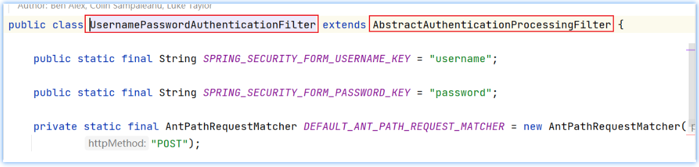

内置认证过滤器的核心流程：

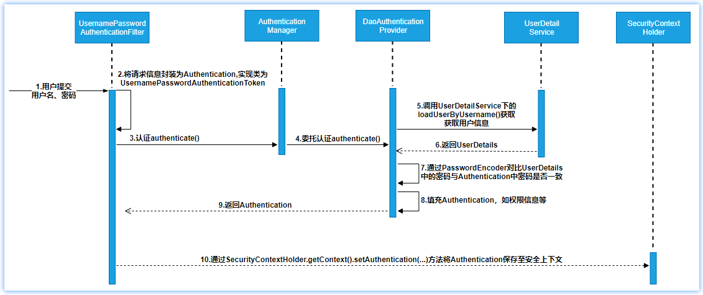

核心流程梳理如下：

- 认证过滤器(UsernamePasswordAuthentionFilter)接收form表单提交的账户、密码信息，并封装成UsernamePasswordAuthenticationToken认证凭对象；
- 认证过滤器调用认证管理器AuthenticationManager进行认证处理；
- 认证管理器通过调用用户详情服务获取用户详情UserDetails；
- 认证管理器通过密码匹配器PasswordEncoder进行匹配，如果密码一致，则将用户相关的权限信息一并封装到Authentication认证对象中；
- 认证过滤器将Authentication认证过滤器放到认证上下文，方便请求从上下文获取认证信息；

## 2、自定义Security认证过滤器

​	SpringSecurity内置的认证过滤器是基于post请求且为form表单的方式获取认证数据的，那如何接收前端Json异步提交的数据据实现认证操作呢？

​	显然，我们可仿照UsernamePasswordAuthentionFilter类自定义一个过滤器并实现认证过滤逻辑；

### 2.1 自定义认证过滤器

​	UsernamePasswordAuthentionFilter过滤器继承了模板认证过滤器AbstractAuthenticationProcessingFilter抽象类，我们也可仿照实现：

~~~java
package com.itheima.security.security_test.config;

import com.fasterxml.jackson.databind.ObjectMapper;
import org.springframework.http.MediaType;
import org.springframework.security.authentication.UsernamePasswordAuthenticationToken;
import org.springframework.security.core.Authentication;
import org.springframework.security.core.AuthenticationException;
import org.springframework.security.web.authentication.AbstractAuthenticationProcessingFilter;

import javax.servlet.FilterChain;
import javax.servlet.ServletException;
import javax.servlet.ServletInputStream;
import javax.servlet.http.HttpServletRequest;
import javax.servlet.http.HttpServletResponse;
import java.awt.*;
import java.io.IOException;
import java.util.HashMap;

/**
 * @author by itheima
 * @Date 2022/1/21
 * @Description
 */
public class MyUserNamePasswordAuthenticationFilter extends AbstractAuthenticationProcessingFilter {

    /**
     * 设置构造，传入自定义登录url地址
     * @param defaultFilterProcessesUrl
     */
    public MyUserNamePasswordAuthenticationFilter(String defaultFilterProcessesUrl) {
        super(defaultFilterProcessesUrl);
    }

    @Override
    public Authentication attemptAuthentication(HttpServletRequest request, HttpServletResponse response) throws AuthenticationException, IOException, ServletException {
        //判断请求方法必须是post提交，且提交的数据的内容必须是application/json格式的数据
        if (!request.getMethod().equals("POST") ||
                ! (request.getContentType().equalsIgnoreCase(MediaType.APPLICATION_JSON_VALUE) || request.getContentType().equalsIgnoreCase(MediaType.APPLICATION_JSON_UTF8_VALUE))) {
            throw new AuthenticationServiceException("Authentication method not supported: " + request.getMethod());
        }
        //获取请求参数
        //获取reqeust请求对象的发送过来的数据流
        ServletInputStream in = request.getInputStream();
        //将数据流中的数据反序列化成Map
        HashMap<String,String> loginInfo = new ObjectMapper().readValue(in, HashMap.class);
        String username = loginInfo.get(USER_NAME);
        username = (username != null) ? username : "";
        username = username.trim();
        String password = loginInfo.get(PASSWORD);
        password = (password != null) ? password : "";
        //将用户名和密码信息封装到认证票据对象下
        UsernamePasswordAuthenticationToken authRequest = new UsernamePasswordAuthenticationToken(username, password);
        // Allow subclasses to set the "details" property
		//setDetails(request, authRequest);
        //调用认证管理器认证指定的票据对象
        return this.getAuthenticationManager().authenticate(authRequest);
    }

    /**
     * 认证成功处理方法
     * @param request
     * @param response
     * @param chain
     * @param authResult
     * @throws IOException
     * @throws ServletException
     */
    @Override
    protected void successfulAuthentication(HttpServletRequest request,
                                            HttpServletResponse response,
                                            FilterChain chain,
                                            Authentication authResult) throws IOException, ServletException {
        response.getWriter().write("login success 666.....");
    }

    /**
     * 认证失败处理方法
     * @param request
     * @param response
     * @param failed
     * @throws IOException
     * @throws ServletException
     */
    @Override
    protected void unsuccessfulAuthentication(HttpServletRequest request,
                                              HttpServletResponse response,
                                              AuthenticationException failed) throws IOException, ServletException {
        response.getWriter().write("login failue 999");
    }
}
~~~

### 2.2 定义获取用户详情服务bean

~~~java
package com.itheima.service;

import com.itheima.entity.TbUser;
import com.itheima.mapper.TbUserMapper;
import org.springframework.beans.factory.annotation.Autowired;
import org.springframework.security.core.GrantedAuthority;
import org.springframework.security.core.authority.AuthorityUtils;
import org.springframework.security.core.userdetails.User;
import org.springframework.security.core.userdetails.UserDetails;
import org.springframework.security.core.userdetails.UserDetailsService;
import org.springframework.security.core.userdetails.UsernameNotFoundException;
import org.springframework.stereotype.Service;

import java.util.List;

/**
 * @author by itheima
 * @Date 2022/5/23
 * @Description
 */
@Service("userDetailsService")
public class MyUserDetailServiceImpl implements UserDetailsService {

    @Autowired
    private TbUserMapper tbUserMapper;
    /**
     * 使用security当用户认证时，会自动将用户的名称注入到该方法中
     * 然后我们可以自己写逻辑取加载用户的信息，然后组装成UserDetails认证对象
     * @param userName
     * @return 用户的基础信息，包含密码和权限集合，security底层会自动比对前端输入的明文密码
     * @throws UsernameNotFoundException
     */
    @Override
    public UserDetails loadUserByUsername(String userName) throws UsernameNotFoundException {
        //1.根据用户名称获取用户的账户信息
        TbUser dbUser=tbUserMapper.findUserInfoByName(userName);
        //判断该用户是否存在
        if (dbUser==null) {
            throw new UsernameNotFoundException("用户名输入错误！");
        }
        //2.组装UserDetails对象
        //获取当前用户对应的权限集合（自动将以逗号间隔的权限字符串封装到权限集合中）
        List<GrantedAuthority> list = AuthorityUtils.commaSeparatedStringToAuthorityList(dbUser.getRoles());
        /*
            参数1：账户
            参数2：密码
            参数3：权限集合
         */
        User user = new User(dbUser.getUsername(), dbUser.getPassword(), list);
        return user;
    }
}
~~~


### 2.3 定义SecurityConfig类

配置默认认证过滤器，保证自定义的认证过滤器要在默认的认证过滤器之前；

~~~java
    /**
     * 配置授权策略
     * @param http
     * @throws Exception
     */
    @Override
    protected void configure(HttpSecurity http) throws Exception {
        http.csrf().disable();//禁用跨站请求伪造
  		http.authorizeRequests()//对资源进行认证处理
    	.antMatchers("/authentication/form").permitAll()//登录路径无需拦截
    	.anyRequest().authenticated();  //除了上述资源外，其它资源，只有 认证通过后，才能有权访问
     	http
          		//坑-过滤器要添加在默认过滤器之前，否则，登录失效
                .addFilterBefore(myUserNamePasswordAuthenticationFilter(), UsernamePasswordAuthenticationFilter.class);
    }

    @Bean
    public MyUserNamePasswordAuthenticationFilter myUserNamePasswordAuthenticationFilter() throws Exception {
      	//设置默认登录路径
        MyUserNamePasswordAuthenticationFilter myUserNamePasswordAuthenticationFilter =
                new MyUserNamePasswordAuthenticationFilter("/authentication/form");
        myUserNamePasswordAuthenticationFilter.setAuthenticationManager(authenticationManagerBean());
        return myUserNamePasswordAuthenticationFilter;
    }
~~~

### 2.4 自定义认证流程测试

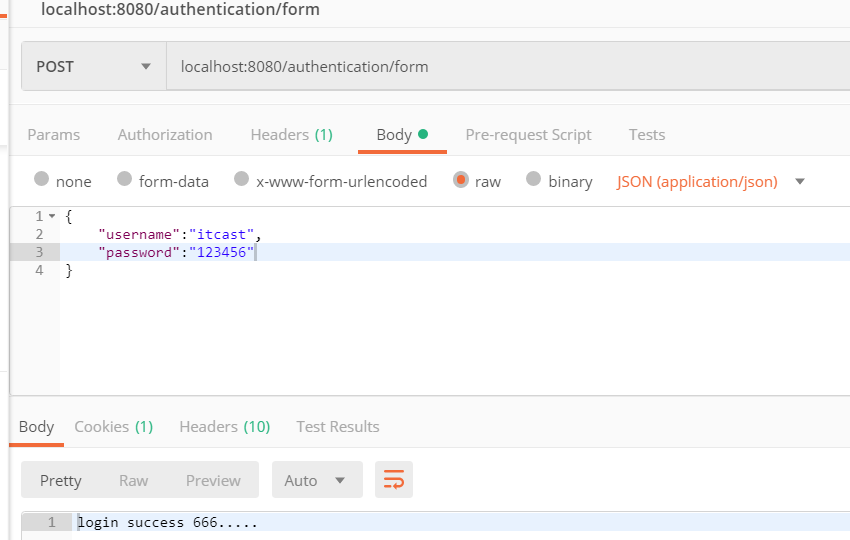

## 3、 基于JWT实现无状态认证

​	JWT是无状态的，所以在服务器端无需存储和维护认证信息，这样会大大减轻服务器的压力，所以我们可在自定义的认证过滤器认证成功后通过successfulAuthentication方法向前端颁发token认证字符串；

### 3.1 认证成功响应JWT实现

测试工程导入Jwt工具类，详见：资料\项目集成代码\JwtTokenUtil.java，集成流程如下：

~~~java
    /**
     * 认证工程处理方法
     * @param request
     * @param response
     * @param chain
     * @param authResult
     * @throws IOException
     * @throws ServletException
     */
    @Override
    protected void successfulAuthentication(HttpServletRequest request,
                                            HttpServletResponse response,
                                            FilterChain chain,
                                            Authentication authResult) throws IOException, ServletException {
        //认证主体信息，此时以填充用户权限信息
        UserDetails principal = (UserDetails) authResult.getPrincipal();
        //组装响应前端的信息
        String username = principal.getUsername();
        Collection<? extends GrantedAuthority> authorities = principal.getAuthorities();
        //构建JwtToken 加入权限信息是为了将来访问时，jwt解析获取当前用户对应的权限，做授权的过滤
      	//权限字符串格式：[P5, ROLE_ADMIN]
        String token = JwtTokenUtil.createToken(username, authorities.toString());
        HashMap<String, String> info = new HashMap<>();
        info.put("name",username);
        info.put("token",token);
        //设置响应格式
        response.setContentType(MediaType.APPLICATION_JSON_VALUE);
        //内容编码格式
        response.setCharacterEncoding("utf-8");
        response.getWriter().write(new ObjectMapper().writeValueAsString(info));
    }
~~~

测试获取认证Token

略

### 3.2 SpringSecurity基于Jwt实现认证小结

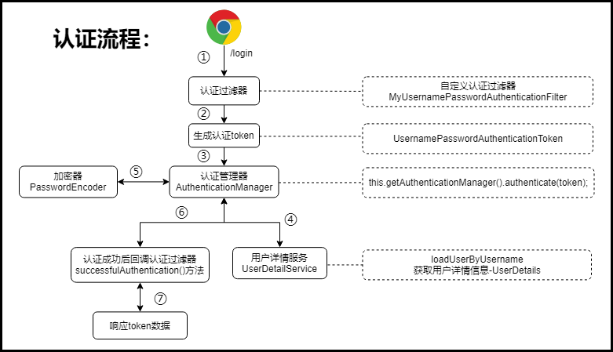

## 4、自定义Security授权过滤

​	上一小结认证成功后向请求方响应了token信息，那么请求方访问其它系统资源时，就需要带着这个token到后台，后台需要一个授权过滤器获取token信息，并解析用户权限信息，将信息封装到UsernamePasswordAuthentionToken对象存入安全上下文，方便请求时安全过滤处理；

### 4.1 授权流程说明

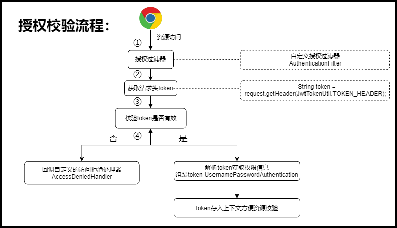

### 4.2 授权实现流程

定义授权过滤器：

~~~java
package com.itheima.security.config;

import com.google.gson.Gson;
import com.itheima.security.utils.JwtTokenUtil;
import org.springframework.http.MediaType;
import org.springframework.security.authentication.UsernamePasswordAuthenticationToken;
import org.springframework.security.core.authority.AuthorityUtils;
import org.springframework.security.core.context.SecurityContextHolder;
import org.springframework.web.filter.OncePerRequestFilter;

import javax.servlet.FilterChain;
import javax.servlet.ServletException;
import javax.servlet.http.HttpServletRequest;
import javax.servlet.http.HttpServletResponse;
import java.io.IOException;
import java.util.HashMap;

/**
 * @author by itheima
 * @Date 2022/1/23
 * @Description 权限认证filter
 */
public class AuthenticationFilter extends OncePerRequestFilter {
    @Override
    protected void doFilterInternal(HttpServletRequest request,
                                    HttpServletResponse response,
                                    FilterChain filterChain) throws ServletException, IOException {
        //1.获取http请求头中携带的jwt票据字符串（注意：如果用户尚未认证，则jwt票据字符串不存在）
        String jwtToken = request.getHeader(JwtTokenUtil.TOKEN_HEADER);
        //2.判断请求中的票据是否存在
        if (StringUtils.isBlank(jwtToken)) {
            //如果票据为空，可能用户准备取认证，所以不做拦截，但是此时UsernamePasswordAuthenticationToken对象未生成，那么即使放行本次请求
            //后续的过滤器链中也会校验认证票据对象
            filterChain.doFilter(request,response);
            return;
        }
        //3.校验票据
        Claims claims = JwtTokenUtil.checkJWT(jwtToken);
        //票据失效
        if (claims==null) {
            //票据失效则提示前端票据已经失效，需要重新认证
            response.setContentType(MediaType.APPLICATION_JSON_VALUE);
            response.setContentType("utf-8");
            response.getWriter().write("jwt token failure!!");
            return;
        }
        //4.从合法的票据中获取用户名和权限信息
        //用户名
        String username = JwtTokenUtil.getUsername(jwtToken);
        //权限信息 [P5, ROLE_ADMIN]
        String roles = JwtTokenUtil.getUserRole(jwtToken);
        //将数组格式的字符串转化成权限对象集合
        String comStr = StringUtils.strip(roles, "[]");
        List<GrantedAuthority> authorityList = AuthorityUtils.commaSeparatedStringToAuthorityList(comStr);
        //5.组装认证成功的票据对象（认证成功时，密码位置null）
        UsernamePasswordAuthenticationToken token = new UsernamePasswordAuthenticationToken(username, null, authorityList);
        //6.将认证成功的票据对象保存到安全上下文中，方便后续的过滤器直接获取权限信息
        SecurityContextHolder.getContext().setAuthentication(token);
        //7.发行过滤器
        filterChain.doFilter(request,response);
    }
}
~~~

### 4.3 配置自定义授权过滤器

~~~java
/**
  * 给访问的资源配置权限过滤
  * @param http
  * @throws Exception
  */
@Override
protected void configure(HttpSecurity http) throws Exception {
  http.csrf().disable();//禁用跨站请求伪造
  http.authorizeRequests()//对资源进行认证处理
    .antMatchers("/myLogin").permitAll()//登录路径无需拦截
    .anyRequest().authenticated();  //除了上述资源外，其它资源，只有 认证通过后，才能有权访问
  //添加自定义的认证过滤器：UsernamePasswordAuthenticationFilter是默认的登录认证过滤器，而我们重写了该过滤器，所以访问时，应该先走我们
  //自定义的过滤器
  http.addFilterBefore(myUsernamePasswordAuthenticationFilter(), UsernamePasswordAuthenticationFilter.class);
  //配置授权过滤器，过滤一切资源
  http.addFilterBefore( authenticationFilter(),MyUsernamePasswordAuthenticationFilter.class);
}  

/**
  * 自定义授权过滤器
  * 过滤一切被访问的资源
  * @return
  */
@Bean
public AuthenticationFilter authenticationFilter(){
  AuthenticationFilter filter = new AuthenticationFilter();
  return filter;
}
~~~

访问测试:

​	略

## 5、自定义权限拒绝处理

​	上一小结当用户未认证访问资源或者认证成功后访问没有权限的资源时，响应给前端的信息不友好，我们可通过自定义权限访问拒绝的处理器来友好提醒用户；

### 5.1 自定义认证用户权限拒绝处理器

通过实现AccessDeniedHandler接口实现：

~~~java
    /**
     * 自定义登录认证策略配置授权策略 -1
     * @param http
     * @throws Exception
     */
    @Override
    protected void configure(HttpSecurity http) throws Exception {
		//......
        http.exceptionHandling()
                .accessDeniedHandler(new AccessDeniedHandler() {
                    @Override
                    public void handle(HttpServletRequest request,
                                       HttpServletResponse response,
                                       AccessDeniedException e) throws IOException, ServletException {
                        //认证用户访问资源时权限拒绝处理策略
                        response.getWriter().write("no permission......reject....");
                    }
                });
    }
~~~

效果：

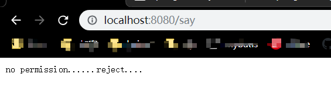

### 5.2 自定义匿名用户拒绝处理器

同样通过实现AuthenticationEntryPoint接口实现：

~~~java
    /**
     * 自定义登录认证策略配置授权策略 -1
     * @param http
     * @throws Exception
     */
    @Override
    protected void configure(HttpSecurity http) throws Exception {
		//......
				http.exceptionHandling()
                .accessDeniedHandler(new AccessDeniedHandler() {
                    @Override
                    public void handle(HttpServletRequest request,
                                       HttpServletResponse response,
                                       AccessDeniedException e) throws IOException, ServletException {
                        //认证用户访问资源时权限拒绝处理策略
                        response.getWriter().write("no permission......reject....");
                    }
                })
          		.authenticationEntryPoint(new AuthenticationEntryPoint(){
                    @Override
    				public void commence(HttpServletRequest request,
                         HttpServletResponse response,
                         AuthenticationException authException) throws IOException, ServletException {
        				 response.setContentType(MediaType.APPLICATION_JSON_VALUE);
        				 response.setCharacterEncoding("UTF-8");
        				 response.getWriter().write("匿名用户无权访问");
          });
    }
}                                         
~~~


##  6、自定义认证授权整体流程小结


# 第二章  项目集成SpringSecurity

​	在第一章我们是基于SpringSecurity、JWT技术实现前后端无状态化认证授权，而我们当前的项目是前后端分离的架构，同样也可借助Security框架和Jwt实现前后端的无状态认证授权操作；

## 1、项目自定义认证过滤器

### 1.1 依赖导入

在stock_backend工程导入SpringSecurity启动依赖：

~~~xml
<!--引入security-->
<dependency>
  <groupId>org.springframework.boot</groupId>
  <artifactId>spring-boot-starter-security</artifactId>
</dependency>
~~~

### 1.2  自定义认证过滤器

当前项目中认证登录信息的合法性，除了用户名、密码外，还需要校验验证码，所以认证过滤器需要注入redis模板对象：

~~~java
package com.itheima.stock.security.filter;

import com.fasterxml.jackson.databind.ObjectMapper;
import com.google.common.base.Strings;
import com.itheima.stock.constant.StockConstant;
import com.itheima.stock.security.detail.LoginUserDetail;
import com.itheima.stock.utils.JwtTokenUtil;
import com.itheima.stock.vo.req.LoginReqVo;
import com.itheima.stock.vo.resp.LoginRespVoExt;
import com.itheima.stock.vo.resp.R;
import com.itheima.stock.vo.resp.ResponseCode;
import org.apache.commons.lang3.StringUtils;
import org.springframework.beans.BeanUtils;
import org.springframework.data.redis.core.RedisTemplate;
import org.springframework.http.MediaType;
import org.springframework.security.authentication.AuthenticationServiceException;
import org.springframework.security.authentication.UsernamePasswordAuthenticationToken;
import org.springframework.security.core.Authentication;
import org.springframework.security.core.AuthenticationException;
import org.springframework.security.core.GrantedAuthority;
import org.springframework.security.web.authentication.AbstractAuthenticationProcessingFilter;

import javax.servlet.FilterChain;
import javax.servlet.ServletException;
import javax.servlet.ServletInputStream;
import javax.servlet.http.HttpServletRequest;
import javax.servlet.http.HttpServletResponse;
import java.io.IOException;
import java.util.List;

/**
 * @author by itheima
 * @Date 2022/7/14
 * @Description
 */
public class JwtLoginAuthenticationFilter extends AbstractAuthenticationProcessingFilter {

    private RedisTemplate redisTemplate;

    /**
     * 通过setter方法注解redis模板对象
     * @param redisTemplate
     */
    public void setRedisTemplate(RedisTemplate redisTemplate) {
        this.redisTemplate = redisTemplate;
    }

    /**
     * 通过构造器传入自定义的登录地址
     * @param loginUrl
     */
    public JwtLoginAuthenticationFilter(String loginUrl) {
        super(loginUrl);
    }

    /**
     * 用户认证处理的方法
     * @param request
     * @param response
     * @return
     * @throws AuthenticationException
     * @throws IOException
     * @throws ServletException
     * 我们约定请求方式必须是post方式，且请求的数据时json格式
     *              约定请求是账户key：username  密码：password
     */
    @Override
    public Authentication attemptAuthentication(HttpServletRequest request, HttpServletResponse response) throws AuthenticationException, IOException, ServletException {
        //判断请求方法必须是post提交，且提交的数据的内容必须是application/json格式的数据
        if (!request.getMethod().equals("POST") ||
                ! (request.getContentType().equalsIgnoreCase(MediaType.APPLICATION_JSON_VALUE) || request.getContentType().equalsIgnoreCase(MediaType.APPLICATION_JSON_UTF8_VALUE))) {
            throw new AuthenticationServiceException("Authentication method not supported: " + request.getMethod());
        }
        //获取请求参数
        //获取reqeust请求对象的发送过来的数据流
        ServletInputStream in = request.getInputStream();
        //将数据流中的数据反序列化成Map
        LoginReqVo vo = new ObjectMapper().readValue(in, LoginReqVo.class);
        response.setContentType(MediaType.APPLICATION_JSON_VALUE);
        response.setCharacterEncoding("utf-8");
        //1.判断参数是否合法
        if (vo==null || StringUtils.isBlank(vo.getUsername())
                || StringUtils.isBlank(vo.getPassword())
                || StringUtils.isBlank(vo.getSessionId()) || StringUtils.isBlank(vo.getCode())) {
            R<Object> resp = R.error(ResponseCode.USERNAME_OR_PASSWORD_ERROR.getMessage());
            response.getWriter().write(new ObjectMapper().writeValueAsString(resp));
            return null;
        }
        //从程序执行的效率看，先进行校验码的校验，成本较低
        String rCheckCode =(String) redisTemplate.opsForValue().get(StockConstant.CHECK_PREFIX + vo.getSessionId());
        if (rCheckCode==null || ! rCheckCode.equalsIgnoreCase(vo.getCode())) {
            //响应验证码输入错误
            R<Object> resp = R.error(ResponseCode.CHECK_CODE_ERROR.getMessage());
            response.getWriter().write(new ObjectMapper().writeValueAsString(resp));
            return null;
        }
        String username = vo.getUsername();
        //username = (username != null) ? username : "";
        username = username.trim();
        String password = vo.getPassword();
        //password = (password != null) ? password : "";
        //将用户名和密码信息封装到认证票据对象下
        UsernamePasswordAuthenticationToken authRequest = new UsernamePasswordAuthenticationToken(username, password);
        // Allow subclasses to set the "details" property
        //setDetails(request, authRequest);
        //调用认证管理器认证指定的票据对象
        return this.getAuthenticationManager().authenticate(authRequest);
    }
}
~~~

## 2、自定义用户详情服务

​	上一小结，我们完成了认证过滤器的开发，认证过程中认证管理器AutenticationManager底层会调用用户详情服务对象获取用户详情信息，所以接下来我们需要实现用户详情服务；

权限表注意事项：

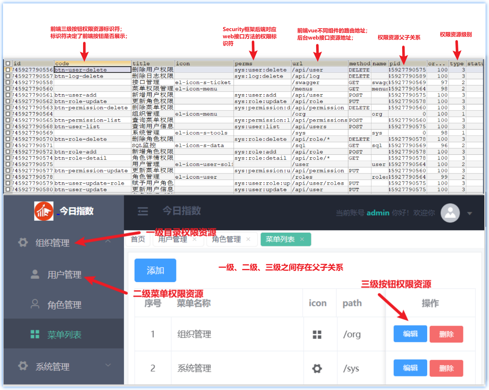

### 2.1 自定义UserDetail认证详情信息类

~~~java
package com.itheima.stock.security.detail;

import com.itheima.stock.vo.resp.PermissionRespNodeVo;
import lombok.AllArgsConstructor;
import lombok.Builder;
import lombok.Data;
import lombok.NoArgsConstructor;
import org.springframework.security.core.GrantedAuthority;
import org.springframework.security.core.userdetails.UserDetails;

import java.util.Collection;
import java.util.List;

/**
 * @author by itheima
 * @Date 2022/7/14
 * @Description 自定义用户认证详情类
 */
@Data//setter getter toString
@NoArgsConstructor
@AllArgsConstructor
@Builder
public class LoginUserDetail implements UserDetails {

    /**
     * 用户名称
     */
    private String username;
//    @Override
//    public String getUsername() {
//        return null;
//    }

    /**
     * 密码
     */
    private String password;
//    @Override
//    public String getPassword() {
//        return null;
//    }

    /**
     * 权限信息
     */
    private List<GrantedAuthority> authorities;
//    @Override
//    public Collection<? extends GrantedAuthority> getAuthorities() {
//        return null;
//    }

    /**
     * 账户是否过期
     */
    private boolean isAccountNonExpired=true;
//    @Override
//    public boolean isAccountNonExpired() {
//        return false;
//    }

    /**
     * 账户是否被锁定
     *  true：没有被锁定
     */
    private boolean isAccountNonLocked=true;
//    @Override
//    public boolean isAccountNonLocked() {
//        return false;
//    }

    /**
     * 密码是否过期
     *  true:没有过期
     */
    private boolean isCredentialsNonExpired=true;
//    @Override
//    public boolean isCredentialsNonExpired() {
//        return false;
//    }

    /**
     * 账户是否禁用
     *  true：没有禁用
     */
    private boolean isEnabled=true;
//    @Override
//    public boolean isEnabled() {
//        return false;
//    }

    /**
     * 用户ID
     */
    private String id;
    /**
     * 电话
     */
    private String phone;
    /**
     * 昵称
     */
    private String nickName;

    /**
     * 真实姓名
     */
    private String realName;

    /**
     * 性别(1.男 2.女)
     */
    private Integer sex;

    /**
     * 账户状态(1.正常 2.锁定 )
     */
    private Integer status;

    /**
     * 邮箱
     */
    private String email;

    /**
     * 权限树，不包含按钮相关权限信息
     */
    private List<PermissionRespNodeVo> menus;

    /**
     * 按钮权限树
     */
    private List<String> permissions;
}
~~~

### 2.2 自定义UserDetailsService实现

~~~java
package com.itheima.stock.security.service;

import com.google.common.base.Strings;
import com.itheima.stock.mapper.SysPermissionMapper;
import com.itheima.stock.mapper.SysRoleMapper;
import com.itheima.stock.mapper.SysUserMapperExt;
import com.itheima.stock.pojo.entity.SysPermission;
import com.itheima.stock.pojo.entity.SysRole;
import com.itheima.stock.pojo.entity.SysUser;
import com.itheima.stock.security.detail.LoginUserDetail;
import com.itheima.stock.service.PermissionService;
import com.itheima.stock.vo.resp.PermissionRespNodeVo;
import org.apache.commons.lang3.StringUtils;
import org.springframework.beans.BeanUtils;
import org.springframework.beans.factory.annotation.Autowired;
import org.springframework.security.core.GrantedAuthority;
import org.springframework.security.core.authority.AuthorityUtils;
import org.springframework.security.core.userdetails.UserDetails;
import org.springframework.security.core.userdetails.UserDetailsService;
import org.springframework.security.core.userdetails.UsernameNotFoundException;
import org.springframework.stereotype.Component;

import java.util.List;
import java.util.stream.Collectors;

/**
 * @author by itheima
 * @Date 2022/7/13
 * @Description 定义获取用户合法详情信息的服务
 */
@Component
public class LoginUserDetailService implements UserDetailsService {

    @Autowired
    private SysUserMapperExt sysUserMapperExt;

    @Autowired
    private SysPermissionMapper sysPermissionMapper;

    @Autowired
    private SysRoleMapper sysRoleMapper;

    @Autowired
    private PermissionService permissionService;


    /**
     * 当用户登录认证是，底层会自动调用MyUserDetailService#loadUserByUsername（）把登录的账户名称传入
     * 根据用户名称获取用户的详情信息：用户名 加密密码 权限集合，还包含前端需要的侧边栏树 、前端需要的按钮权限标识的集合等
     * @param loginName
     * @return
     * @throws UsernameNotFoundException
     */
    @Override
    public UserDetails loadUserByUsername(String loginName) throws UsernameNotFoundException {
        //2.根据用户名查询用户信息
        SysUser dbUser= sysUserMapperExt.findUserByUserName(username);
        //3.判断查询的用户信息
        if (dbUser==null) {
            throw new UsernameNotFoundException("用户不存在");
        }
        //4.2 成功则返回用户的正常信息
        //获取指定用户的权限集合 添加获取侧边栏数据和按钮权限的结合信息
        List<SysPermission> permissions = permissionService.getPermissionByUserId(dbUser.getId());
        //前端需要的获取树状权限菜单数据
        List<PermissionRespNodeVo> tree = permissionService.getTree(permissions, 0l, true);
        //前端需要的获取菜单按钮集合
        List<String> authBtnPerms = permissions.stream()
                .filter(per -> !Strings.isNullOrEmpty(per.getCode()) && per.getType() == 3)
                .map(per -> per.getCode()).collect(Collectors.toList());
        //5.组装后端需要的权限标识
        //5.1 获取用户拥有的角色
        List<SysRole> roles = sysRoleMapper.getRoleByUserId(dbUser.getId());
        //5.2 将用户的权限标识和角色标识维护到权限集合中
        List<String> perms=new ArrayList<>();
        permissions.stream().forEach(per->{
            if (StringUtils.isNotBlank(per.getPerms())) {
                perms.add(per.getPerms());
            }
        });
        roles.stream().forEach(role->{
            perms.add("ROLE_"+role.getName());
        });
        String[] permStr=perms.toArray(new String[perms.size()]);
        //5.3 将用户权限标识转化成权限对象集合
        List<GrantedAuthority> authorityList = AuthorityUtils.createAuthorityList(permStr);
        //6.封装用户详情信息实体对象
        LoginUserDetail loginUserDetail = new LoginUserDetail();
        //将用户的id nickname等相同属性信息复制到详情对象中
        BeanUtils.copyProperties(dbUser,loginUserDetail);
        loginUserDetail.setMenus(tree);
        loginUserDetail.setAuthorities(authorityList);
        loginUserDetail.setPermissions(authBtnPerms);
        return loginUserDetail;
    }
}
~~~

### 2.3 完善相关mapper

**A.定义根据用户名查询用户信息的接口方法**

在SysUserMapper定义方法：

~~~java
    /**
     * 根据用户名查询用户信息
     * @param username
     * @return
     */
    SysUser findUserByUserName(@Param("username") String username);
~~~

绑定xml：

~~~xml
    <select id="findUserByUserName" resultMap="BaseResultMap">
        select <include refid="Base_Column_List"/> from sys_user where username=#{username}
    </select>
~~~

**B.定义根据用户id查询角色信息的接口方法**

在SysRoleMapper定义方法：

```java
    /**
     * 根据用户id查询角色信息
     * @param userId
     * @return
     */
    List<SysRole> getRoleByUserId(@Param("userId") Long userId);
```

绑定xml：

```xml
<select id="getRoleByUserId" resultMap="BaseResultMap">
  SELECT
  r.*
  FROM
  sys_user_role AS ur,
  sys_role AS r
  WHERE
  ur.role_id = r.id
  AND ur.user_id = #{userId}
</select>
```

**C.定义根据用户id查询权限信息的接口方法**

在SysPermissionMapper定义方法：

~~~java
    /**
     * 根据用户id查询用户信息
     * @param userId
     * @return
     */
    List<SysPermission> getPermissionByUserId(@Param("userId") Long userId);
~~~

绑定xml：

~~~xml
    <select id="getPermissionByUserId" resultMap="BaseResultMap">
        SELECT
           distinct  p.*
        FROM
            sys_role_permission AS rp,
            sys_user_role AS ur,
            sys_permission AS p
        WHERE
            ur.role_id = rp.role_id
          AND rp.permission_id = p.id
          AND ur.user_id = #{userId}
    </select>
~~~


## 3、认证成功后响应Token实现

在认证成功方法successfulAuthentication中，基于jwt将用户信息和相关的权限信息通过jwt加密响应给前端请求：

~~~java
public class JwtLoginAuthenticationFilter extends AbstractAuthenticationProcessingFilter {
   //省略N行代码......
  
    /**
     * 用户认证成功后回调的方法
     * 认证成功后，响应前端token信息
     * @param request
     * @param response
     * @param chain security的过滤器链
     * @param authResult
     * @throws IOException
     * @throws ServletException
     */
    @Override
    protected void successfulAuthentication(HttpServletRequest request,
                                            HttpServletResponse response,
                                            FilterChain chain,
                                            Authentication authResult) throws IOException, ServletException {
        //获取用户的详情信息
        LoginUserDetail userDetail = (LoginUserDetail) authResult.getPrincipal();
        //组装LoginRespVoExt
        //获取用户名称
        String username = userDetail.getUsername();
        //获取权限集合对象
        List<GrantedAuthority> authorities = userDetail.getAuthorities();
        String auStrList = authorities.toString();
        //复制userDetail属性值到LoginRespVoExt对象即可
        LoginRespVoExt resp = new LoginRespVoExt();
        BeanUtils.copyProperties(userDetail,resp);
        //生成token字符串:将用户名称和权限信息价格生成token字符串
        String tokenStr = JwtTokenUtil.createToken(username, auStrList);
        resp.setAccessToken(tokenStr);
        //封装统一响应结果
        R<Object> r = R.ok(resp);
        String respStr = new ObjectMapper().writeValueAsString(r);
        response.setContentType(MediaType.APPLICATION_JSON_VALUE);
        response.setCharacterEncoding("UTF-8");
        response.getWriter().write(respStr);
    }

    /**
     * 认证失败后，回调的方法
     * @param request
     * @param response
     * @param failed
     * @throws IOException
     * @throws ServletException
     */
    @Override
    protected void unsuccessfulAuthentication(HttpServletRequest request, HttpServletResponse response, AuthenticationException failed) throws IOException, ServletException {
        R<Object> r = R.error(ResponseCode.SYSTEM_PASSWORD_ERROR);
        String respStr = new ObjectMapper().writeValueAsString(r);
        response.setContentType(MediaType.APPLICATION_JSON_VALUE);
        response.setCharacterEncoding("UTF-8");
        response.getWriter().write(respStr);
    }
~~~


## 4、定义Security配置类

过程同第一章节大致一样，需要注意swagger访问、knif4j、验证码等资源设置pertmall访问权限；

~~~java
package com.itheima.stock.security.config;

import com.itheima.stock.security.filter.JwtAuthorizationFilter;
import com.itheima.stock.security.filter.JwtLoginAuthenticationFilter;
import com.itheima.stock.security.handler.StockAccessDenyHandler;
import com.itheima.stock.security.handler.StockAuthenticationEntryPoint;
import org.springframework.beans.factory.annotation.Autowired;
import org.springframework.context.annotation.Bean;
import org.springframework.context.annotation.Configuration;
import org.springframework.data.redis.core.RedisTemplate;
import org.springframework.security.config.annotation.method.configuration.EnableGlobalMethodSecurity;
import org.springframework.security.config.annotation.web.builders.HttpSecurity;
import org.springframework.security.config.annotation.web.configuration.EnableWebSecurity;
import org.springframework.security.config.annotation.web.configuration.WebSecurityConfigurerAdapter;
import org.springframework.security.config.http.SessionCreationPolicy;
import org.springframework.security.crypto.bcrypt.BCryptPasswordEncoder;
import org.springframework.security.crypto.password.PasswordEncoder;
import org.springframework.security.web.authentication.UsernamePasswordAuthenticationFilter;

/**
 * @author by itheima
 * @Date 2022/7/14
 * @Description
 */
@Configuration
@EnableWebSecurity
@EnableGlobalMethodSecurity(prePostEnabled = true)
public class SecurityConfig  extends WebSecurityConfigurerAdapter {

    @Autowired
    private RedisTemplate redisTemplate;

    /**
     * 定义公共的无需被拦截的资源
     * @return
     */
    private String[] getPubPath(){
        //公共访问资源
        String[] urls = {
                "/**/*.css","/**/*.js","/favicon.ico","/doc.html",
                "/druid/**","/webjars/**","/v2/api-docs","/api/captcha",
                "/swagger/**","/swagger-resources/**","/swagger-ui.html"
        };
        return urls;
    }

    /**
     * 配置过滤规则
     * @param http
     * @throws Exception
     */
    @Override
    protected void configure(HttpSecurity http) throws Exception {
        //登出功能
        http.logout().logoutUrl("/api/logout").invalidateHttpSession(true);
        //开启允许iframe 嵌套。security默认禁用ifram跨域与缓存
        http.headers().frameOptions().disable().cacheControl().disable();
        //session禁用
        http.sessionManagement().sessionCreationPolicy(SessionCreationPolicy.STATELESS);
        http.csrf().disable();//禁用跨站请求伪造
        http.authorizeRequests()//对资源进行认证处理
                .antMatchers(getPubPath()).permitAll()//公共资源都允许访问
                .anyRequest().authenticated();  //除了上述资源外，其它资源，只有 认证通过后，才能有权访问
        //自定义的过滤器
        http.addFilterBefore(jwtLoginAuthenticationFilter(), UsernamePasswordAuthenticationFilter.class);
    }

    /**
     * 自定义认证过滤器bean
     * @return
     * @throws Exception
     */
    @Bean
    public JwtLoginAuthenticationFilter jwtLoginAuthenticationFilter() throws Exception {
        JwtLoginAuthenticationFilter filter = new JwtLoginAuthenticationFilter("/api/login");
        filter.setAuthenticationManager(authenticationManagerBean());
        filter.setRedisTemplate(redisTemplate);
        return filter;
    }

    /**
     * 定义密码加密器，实现对明文密码的加密和匹配操作
     * @return
     */
    @Bean
    public PasswordEncoder passwordEncoder(){
        return new BCryptPasswordEncoder();
    }
}
~~~

> 注意：认证过滤器配置完毕后，需要注释掉原来的登录入口；

断点调试认证流程：

​	略；

## 5、自定义授权过滤器

授权的逻辑与第一章相似，需要实现OncePerRequestFilter过滤器；

### 5.1 定义授权过滤器

~~~java
package com.itheima.stock.security.filter;
import com.fasterxml.jackson.databind.ObjectMapper;
import com.itheima.stock.constant.StockConstant;
import com.itheima.stock.utils.JwtTokenUtil;
import com.itheima.stock.vo.resp.R;
import com.itheima.stock.vo.resp.ResponseCode;
import io.jsonwebtoken.Claims;
import org.apache.commons.lang3.StringUtils;
import org.springframework.http.MediaType;
import org.springframework.security.authentication.UsernamePasswordAuthenticationToken;
import org.springframework.security.core.GrantedAuthority;
import org.springframework.security.core.authority.AuthorityUtils;
import org.springframework.security.core.context.SecurityContextHolder;
import org.springframework.web.filter.OncePerRequestFilter;

import javax.servlet.FilterChain;
import javax.servlet.ServletException;
import javax.servlet.http.HttpServletRequest;
import javax.servlet.http.HttpServletResponse;
import java.io.IOException;
import java.util.List;

/**
 * @author by itheima
 * @Date 2022/7/14
 * @Description 定义授权过滤器，核心作用：
 *      1.过滤请求，获取请求头中的token字符串
 *      2.解析token字符串，并获取token中信息：username role
 *      3.将用户名和权限信息封装到UsernamePassowrdAuthentionToken票据对象下
 *      4.将票据对象放入安全上下文，方便校验权限时，随时获取
 */
public class JwtAuthorizationFilter extends OncePerRequestFilter {

    /**
     * 访问过滤的方法
     * @param request
     * @param response
     * @param filterChain 过滤器链
     * @throws ServletException
     * @throws IOException
     */
    @Override
    protected void doFilterInternal(HttpServletRequest request,
                                    HttpServletResponse response,
                                    FilterChain filterChain) throws ServletException, IOException {
        //1.从request对象下获取token数据，约定key：Authorization
        String tokenStr = request.getHeader(StockConstant.TOKEN_HEADER);
        //判断token字符串是否存在
        if (tokenStr==null) {
            //如果票据为null，可能用户还没有认证，正准备去认证,所以放行请求
            //放行后，会不会访问当受保护的资源呢？不会，因为没有生成UsernamePassowrdAuthentionToken
            filterChain.doFilter(request,response);
            return;
        }
        //2.解析tokenStr,获取用户详情信息
        Claims claims = JwtTokenUtil.checkJWT(tokenStr);
        //token字符串失效的情况
        if (claims==null) {
            //说明 票据解析出现异常，票据就失效了
            R<Object> r = R.error(ResponseCode.TOKEN_NO_AVAIL);
            String respStr = new ObjectMapper().writeValueAsString(r);
            response.setContentType(MediaType.APPLICATION_JSON_VALUE);
            response.setCharacterEncoding("UTF-8");
            response.getWriter().write(respStr);
            return;
        }
        //获取用户名和权限信息
        String userName = JwtTokenUtil.getUsername(tokenStr);
        //生成token时，权限字符串的格式是：[P8,ROLE_ADMIN]
        String perms = JwtTokenUtil.getUserRole(tokenStr);
        //生成权限集合对象
        //P8,ROLE_ADMIN
        String strip = StringUtils.strip(perms, "[]");
        List<GrantedAuthority> authorityList = AuthorityUtils.commaSeparatedStringToAuthorityList(strip);
        //将用户名和权限信息封装到token对象下
        UsernamePasswordAuthenticationToken token=new UsernamePasswordAuthenticationToken(userName,null,authorityList);
        //将token对象存入安全上限文，这样，线程无论走到哪里，都可以获取token对象，验证当前用户访问对应资源是否被授权
        SecurityContextHolder.getContext().setAuthentication(token);
        //资源发行
        filterChain.doFilter(request,response);
    }
}
~~~

### 5.2 配置授权过滤器

在SecurityConfig类中配置授权过滤器：

```java
    /**
     * 配置过滤规则
     * @param http
     * @throws Exception
     */
    @Override
    protected void configure(HttpSecurity http) throws Exception {
		//......省略
        //配置授权过滤器，过滤一切资源
        http.addFilterBefore(jwtAuthorizationFilter(),JwtLoginAuthenticationFilter.class);
    }

    /**
     * 自定义授权过滤器
     * @return
     */
    @Bean
    public JwtAuthorizationFilter jwtAuthorizationFilter(){
        return new JwtAuthorizationFilter();
    }
```

授权访问测试；

​	略

## 6、定义权限拒绝处理器

- 定义用户认证成功无权限访问处理器

~~~java
package com.itheima.stock.security.handler;

import com.fasterxml.jackson.databind.ObjectMapper;
import com.itheima.stock.vo.resp.R;
import com.itheima.stock.vo.resp.ResponseCode;
import lombok.extern.slf4j.Slf4j;
import org.springframework.http.MediaType;
import org.springframework.security.access.AccessDeniedException;
import org.springframework.security.web.access.AccessDeniedHandler;

import javax.servlet.ServletException;
import javax.servlet.http.HttpServletRequest;
import javax.servlet.http.HttpServletResponse;
import java.io.IOException;

/**
 * @author by itheima
 * @Date 2022/7/14
 * @Description 定义没有权限，访问拒绝的处理器
 * 用户认证成功，但是没有访问的权限，则会除非拒绝处理器
 * 如果是匿名用户访问被拒绝则使用匿名拒绝的处理器
 */
@Slf4j
public class StockAccessDenyHandler implements AccessDeniedHandler {
    @Override
    public void handle(HttpServletRequest request,
                       HttpServletResponse response,
                       AccessDeniedException ex) throws IOException, ServletException {
        log.info("访问拒绝，异常信息：{}",ex.getMessage());
        //说明 票据解析出现异常，票据就失效了
        R<Object> r = R.error(ResponseCode.NOT_PERMISSION);
        String respStr = new ObjectMapper().writeValueAsString(r);
        response.setContentType(MediaType.APPLICATION_JSON_VALUE);
        response.setCharacterEncoding("UTF-8");
        response.getWriter().write(respStr);
    }
}
~~~

- 匿名用户(未认证用户)访问拒绝处理器

~~~java
package com.itheima.stock.security.handler;

import com.fasterxml.jackson.databind.ObjectMapper;
import com.itheima.stock.vo.resp.R;
import com.itheima.stock.vo.resp.ResponseCode;
import org.springframework.http.MediaType;
import org.springframework.security.core.AuthenticationException;
import org.springframework.security.web.AuthenticationEntryPoint;

import javax.servlet.ServletException;
import javax.servlet.http.HttpServletRequest;
import javax.servlet.http.HttpServletResponse;
import java.io.IOException;

/**
 * @author by itheima
 * @Date 2022/7/14
 * @Description
 *  未认证的用户访问被拒绝的处理器
 */
public class StockAuthenticationEntryPoint implements AuthenticationEntryPoint {
    @Override
    public void commence(HttpServletRequest request,
                         HttpServletResponse response,
                         AuthenticationException authException) throws IOException, ServletException {
        //说明 票据解析出现异常，票据就失效了
        R<Object> r = R.error(ResponseCode.NOT_PERMISSION);
        String respStr = new ObjectMapper().writeValueAsString(r);
        response.setContentType(MediaType.APPLICATION_JSON_VALUE);
        response.setCharacterEncoding("UTF-8");
        response.getWriter().write(respStr);
    }
}
~~~

- 配置类配置处理器

在SecurityConfig类配置处理器：

~~~java
    /**
     * 配置过滤规则
     * @param http
     * @throws Exception
     */
    @Override
    protected void configure(HttpSecurity http) throws Exception {
		//省略......
        //配置权限访问拒绝处理器
        http.exceptionHandling().accessDeniedHandler(new StockAccessDenyHandler())
                .authenticationEntryPoint(new StockAuthenticationEntryPoint());
    }
~~~

测试拒绝处理器：

​	略

## 7、配置资源访问权限注解

为接口添加权限注解，比如：

~~~java
@RestController
@RequestMapping("/api")
public class LogController {

    @Autowired
    private LogService logService;


    /**
     * 日志信息综合查询
     * @param vo
     * @return
     */
    @PreAuthorize("hasAuthority('sys:log:list')")
    @PostMapping("/logs")
    public R<PageResult> logPageQuery(@RequestBody LogPageReqVo vo){

        return logService.logPageQuery(vo);
    }

    /**
     * 批量删除日志信息功能
     * @param logIds
     * @return
     */
    @DeleteMapping("/log")
    @PreAuthorize("hasAuthority('sys:log:delete')")
    public R<String> deleteBatch(@RequestBody List<Long> logIds){
        return this.logService.deleteBatch(logIds);
    }

}
~~~

使用test和admin用户分别访问测试:

略；

## 8、前端动态路由调整

当前前端的路由资源都是配置死的，而我们需要根据不同的用户加载不同路由资源，所以前端需要做如下调整：

前端请求时携带token逻辑如下：

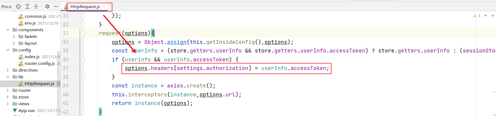

登录逻辑中注释掉默认的参数配置：

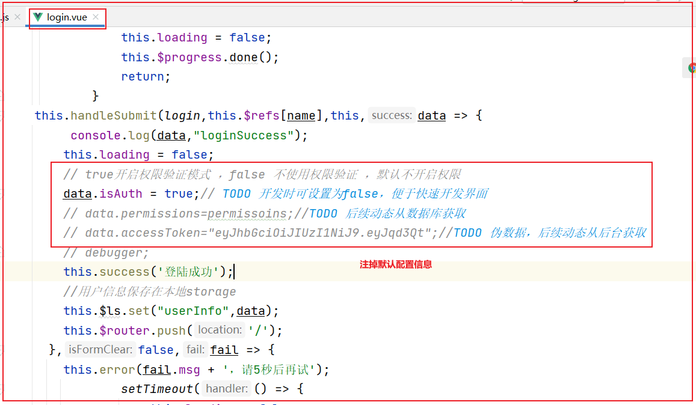

注释掉默认的路由组件，自动加载来自后台的动态路由参数；

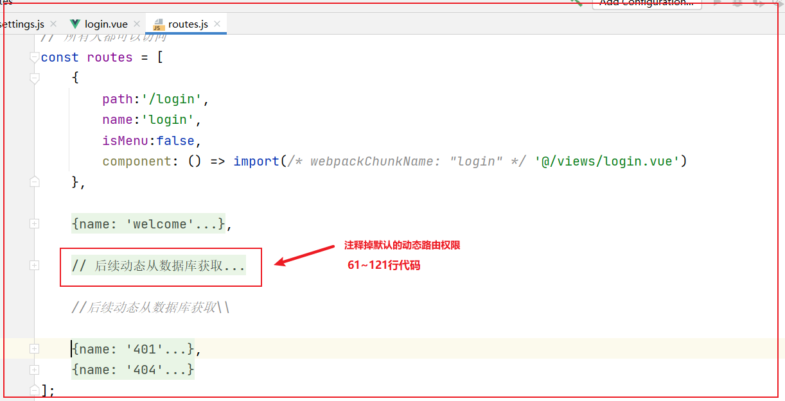

访问测试：用户：test 密码：123456登录后效果：

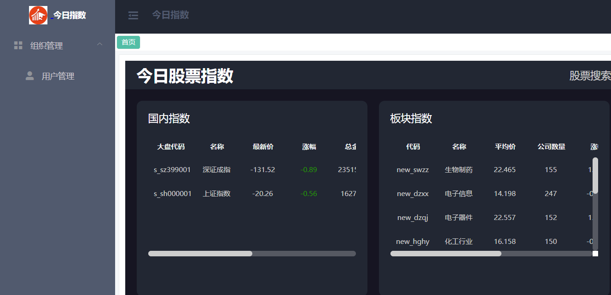

用户：admin 密码：123456登录后效果：

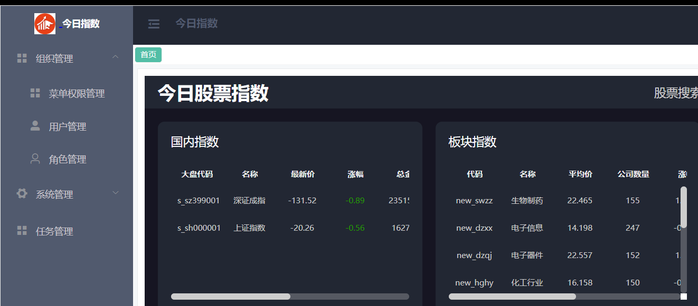

用户登录信息保存在前端SessionStorage下：

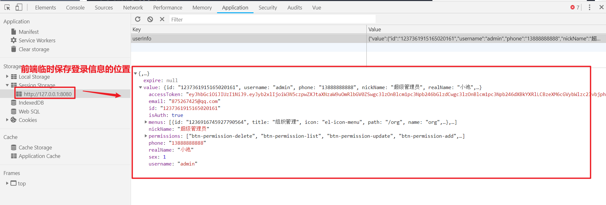
