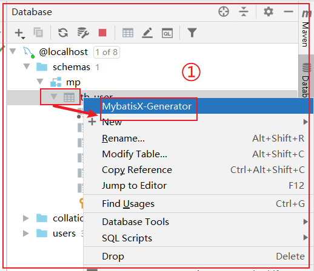
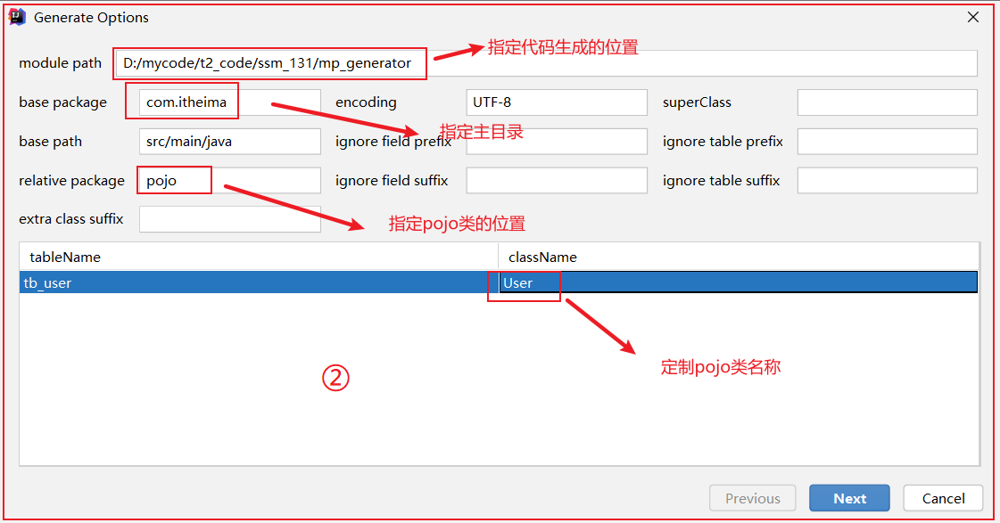
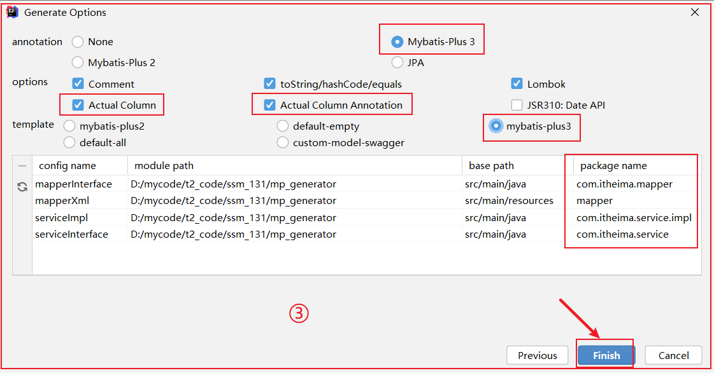
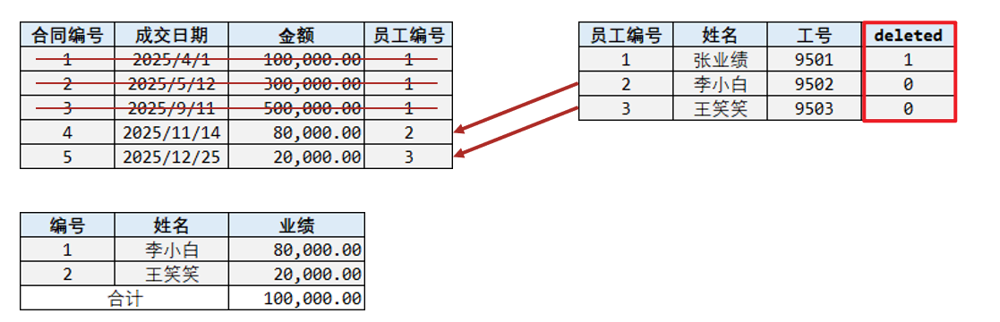
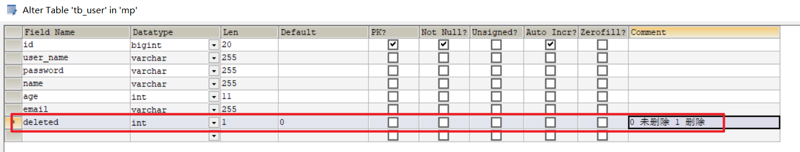
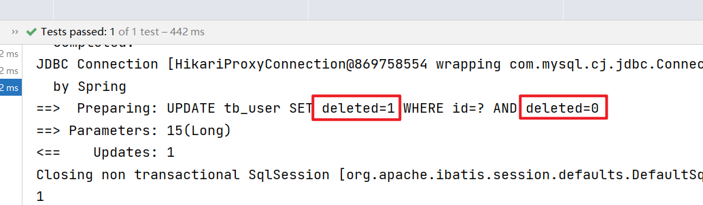
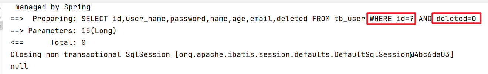
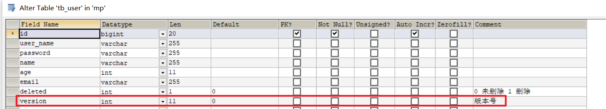
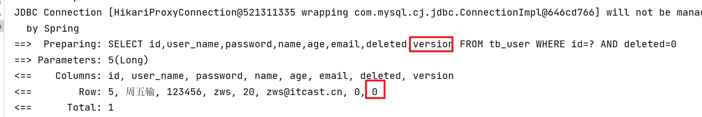
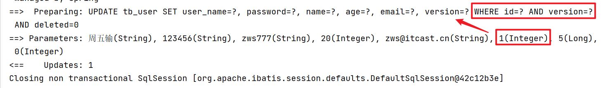

# 7 MybatisX插件[扩展]

## 7.1 MybatisX插件介绍

MybatisX 是一款基于 IDEA 的快速开发插件，为效率而生。

安装方法：打开 IDEA，进入 File -> Settings -> Plugins -> Browse Repositories，输入 `mybatisx` 搜索并安装。

功能：

- Java 与 XML 调回跳转
- Mapper 方法自动生成 XML 


## 7.2 基于MybatisX实现逆向工程








# 8.逻辑删除[扩展]

实际在删除数据时，为了数据留痕，一般选择逻辑删除，也就是为删除表添加逻辑删除字段，通过修改字段状态值来表示数据是否被删除；



案例：

为tb_user添加逻辑删除字段：



mp配置：

```yaml
# 设置mp运行时行为
mybatis-plus:
  configuration:
    log-impl: org.apache.ibatis.logging.stdout.StdOutImpl # 控制台输出sql
  global-config:
    db-config:
      logic-delete-field: deleted # 约定全局删除字段
      logic-delete-value: 1
      logic-not-delete-value: 0
```

调整实体类：

```java
@Data
@NoArgsConstructor//主要用于mybatis底层反射构建user实体类对象
@AllArgsConstructor//主要是lombok基于构建者模式构建对象
@Builder
/**
 * 如果变的名称与实体类名称一致，该注解可省略
 */
@TableName("tb_user")
public class User {
	//......
    @TableLogic//指定逻辑删除字段
    private Integer deleted;
}
```

测试

```java
    @Test
    public void testDelete(){
        //根据id删除
        int count = userMapper.deleteById(15l);
        System.out.println(count);
    }  
```

输出的效果：




但是对应的查询如果不加添加，则删除的无法查询到：

```java
    @Test
    public void testGetById(){
        User user = userMapper.selectById(15l);
        System.out.println(user);
    }
```

效果：



> 逻辑删除本质就是拦截sql，动态追加sql片段
>
> ​	查询  deleted=0
>
> ​        删除： 将sql转化成update操作；

# 9.乐观锁[扩展]

乐观锁就是当前操作者认为在自己操作资源的过程中，其他人操作相同资源的可能性极低，所以无需加锁，而是通过设置一个版本号来加以约束；

悲观锁：排它锁，比如synchronized关键字就是悲观锁，当前线程做操作时，不允许其它线程做操作；

乐观锁：当前线程做操作时，允许其它线程做操作，但是如果其它线程做了操作，则当前操作失败；

乐观锁在数据库中有什么优势？

​	避免长事务场景锁定数据资源，导致其它线程操作该资源时阻塞，如果阻塞过多，那么导致数据库连接资源耗尽，进而数据库宕机了；

​	本质上就是在操作前，先获取操作行的version版本号，然后再做前天操作，然后最后再更新这一行，更新时，给sql条件一个判断版本号的sql片段： select version，xxx  from user where id=100; version=30 --> 做其他操作(20s);---> update user set xxx,version=version+1 where xxxx   and version=30;

使用场景：

​	1.业务操作周期长，如果业务整个加入事务，导致数据库资源锁定周期过长，性能降低；

​	2.如果资源争抢过于激烈，会导致失败重试次数过多，导致性能降低；

示例：



实体类配置：

```java
@Data
@NoArgsConstructor//主要用于mybatis底层反射构建user实体类对象
@AllArgsConstructor//主要是lombok基于构建者模式构建对象
@Builder
/**
 * 如果变的名称与实体类名称一致，该注解可省略
 */
@TableName("tb_user")
public class User {
	//......
    @Version
    private Integer version;
}
```

配置乐观锁拦截器：

```java
    /**
     * 注册插件
     * @return
     */
    @Bean
    public MybatisPlusInterceptor mybatisPlusInterceptor(){
        //构建mp的插件注册器bean，通过该bean可批量注册多个插件
        MybatisPlusInterceptor plusInterceptor = new MybatisPlusInterceptor();
        //配置乐观锁拦截器
        OptimisticLockerInnerInterceptor optimisticLockerInnerInterceptor = new OptimisticLockerInnerInterceptor();
        //注册
        plusInterceptor.addInnerInterceptor(optimisticLockerInnerInterceptor);
        return plusInterceptor;
    }
```

测试：

```java
    /**
     * @Description 测试乐观锁
     */
    @Test
    public void testOp(){
        User user = userMapper.selectById(5l);
        System.out.println(user);
        user.setName("zws777");
        userMapper.updateById(user);
    }
```

> 使用mp的乐观锁，需要先自己根据主键id查询用户信息，信息中包含了此时的version数据，然后再更新，更新时会将查询的version值作为更新条件取更新；

效果：



