# day01-项目介绍与工程搭建

# 项目概述与工程搭建

##  学习目标

- 能说出项目的基本概述;

- 能说出股票相关的核心概念;

   - 股票、板块、大盘的概念;
   - 股票涨幅、涨跌、振幅、开盘、收盘、涨停| 跌停概念;

- 能说出项目的技术架构;

- 能说出项目开发的基本流程;

- 能够手动搭建开发环境;

   - 搭建后端开发环境;
   - 搭建前端环境;

- 能够完成用户登录功能;

#  第一章  今日指数项目概述

## 1、项目介绍

### 1.1 项目概述

- 今日指数是基于股票实时交易产生的**数据分析产品**，旨在为特定用户和机构提供定制化的股票数据分析和展示服务;
- 项目的核心功能以数据分析和展示为主，功能涵盖了A股大盘实时指数展示、涨幅榜、个股涨跌、个股秒级行情、实时日K线行情等;

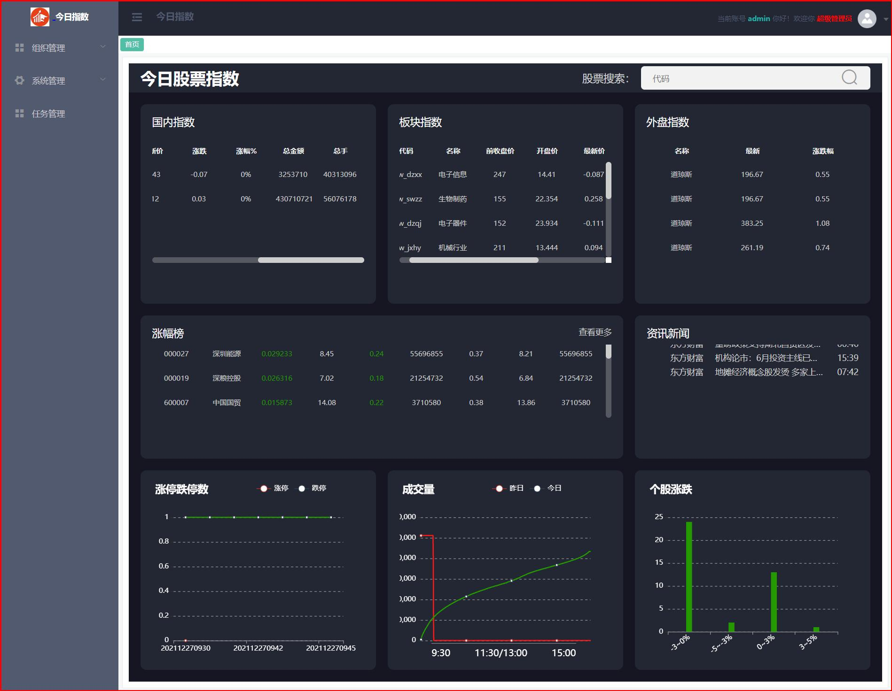

> 参考网站：
>
> http://q.10jqka.com.cn/(同花顺)
> https://xueqiu.com/(雪球)
> https://finance.sina.com.cn/stock/(新浪)
> http://quote.eastmoney.com/(东方财富)

## 2、股票相关名词解释

### 2.1 股票概念介绍

#### 2.1.1 什么是股票？

股票是股份证书的简称,是股份公司为筹集资金而发行给股东的一种有价证券，股东可凭此取得红利和买卖抵押，是资金市场中主要的信用工具之一；

>  举例：我和朋友开公司，一人出10万块钱，那怎么证明公司里的20万里有我的10万呢？
>
>  最传统的办法就是发行股票，也就是盖章签字的纸质凭证。
>
>  每人出了10万，那我们就发行200股，这样每个人就分得100股，股票就是证明你是公司股东且占有公司200股里面100股的一个凭证。

#### 2.1.2 股票的分类

- A股-人民币普通股票
  - 即人民币普通股票，是由中国境内注册公司发行，在境内上市，以人民币标明面值，供境内机构、组织或个人以人民币认购和交易的普通股股票；
  - 英文字母A没有特殊意义，只是用来区分人民币普通股票和人民币特种股票；
  - 我们当前项目重点关注A股的数据信息；
- B股-人民币特种股票
  - 即公司在中国大陆注册和上市，但只能以外币认购和交易；
  - 主要吸引外资；

> 其它：
>
> H股：指国有企业在香港 (Hong Kong) 上市的股票；
> N股：指在中国大陆注册，但是在纽约（New York）上市的外资股；
> SCA股: 指核心业务在中国大陆,而企业的注册地在新加坡(其他国家和地区),但是在新加坡交易所上市的企业股票；

### 2.2  个股指标参数介绍

- 开盘价
  - 又称开市价，是证券交易所在每个交易日开市后的第一笔股票买卖成交的价格；
  - 开盘价是在9点15分至9点25分买卖双方的竞价撮合产生（了解）；
  - 开盘价一般会参考前一个股票交易日收盘价；
- 收盘价
  - 又称收市价，是指股票在每个交易日里最后一笔买卖成交价格；
  - 昨收：上一个交易日的收盘价格；
- 当前价
  - 当前股票实时的最新成交价格；
- 涨跌值
  - 涨跌值=最新价格-前收盘价格 ；
  - 股票涨跌值主要用于反应股票的涨跌情况，单位是元(A股)；
  - 一般用“+”或“-”号表示，正值为涨，负值为跌，否则为持平；
- 涨跌幅度（涨幅）
  - 股票涨幅=（最新成交价-前收盘价）÷ 前收盘价×100%
- 涨停与跌停
  - 股市涨跌停的机制与生活中电路过载保护思想一致，在股票市场中为了防止股价过分的暴涨暴跌，同时抑制过度投机行为，证券交易所给股价的涨跌做了相关限制；
  - 在A股市场中，股价的涨跌幅度范围：-10%~+10%；
  - 打新-对于新上市股票第一天交易中股价涨幅不设限，第二天才会有限制（了解）；
- 振幅
  - 股票振幅=（当日最高价-当日最低价）÷ 前收盘价 ×100%；
  - 股票振幅在一定程度上反应了股票的活跃程度；
- 成交量
  - 成交量指当天成交的股票总手数（1手=100股）;
- 成交金额
  - 股票成交金额是成交量和成交价格的累加，由证券交易锁计算得出；
  - 示例投资者以每股10元的价格买入50手，那么此时成交金额为：10X50X100=5w;
- 股票编码
  - 每个上市公司的股票都一个唯一的编码，通过这个编码就可定义具体股票；
  - **沪市A股的代码是以600、601或603打头（6打头）；**
  - **深市A股 深市A股的代码是以000打头（0打头）；**
  - 其它：创业板股票代码以300打头，沪市B股代码以900打头，深圳B股代码以200打头等等；

### 2.3 个股K线图介绍

#### 2.3.1 个股K线图

K线图源于日本，早期主要用于米价涨跌情况统计，后来发展到股市金融领域；

k线图又分为日K线、周K线、月K线等，信息主要包含股票的开盘、收盘、最高、最低等价格信息；

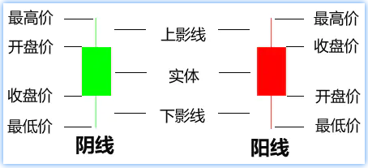

#### 2.3.2 K线图示例

以传智教育股票为例：

----

备注：

>分时图：统计当天每分钟的交易数据（当前价格、均价、涨跌、涨幅、成交量和成交金额等）
>日K线图：统计每天交易数据（最高、最低、开盘、收盘、涨跌、涨幅等）
>周K线图：统计每周交易数据（最高、最低、开盘、收盘、涨跌、涨幅等）
>月K线图：统计每月交易数据（最高、最低、开盘、收盘、涨跌、涨幅等）

#### 小结

1.什么是股票？

​	证明股东持有公司股份的有价证券；
​	说白了正证明投资人投资的一种凭证；

2.什么是A股？

​	国内企业，国内证券交易所上市，且必须以人民币结算，且必须国内的组织、个人、机构购买；

3.股票核心参数?

​	开盘价、收盘价、涨跌值、涨幅、振幅、涨停|跌停、成交量、成交金额等；
4.K线图核心参数及分类？

​	参数：开盘、收盘、最高、最低等；

​	分类：日k线图、周k线图、月K图等；

### 2.4 大盘与板块概念介绍

#### 2.4.1 什么是大盘指数

股市的大盘指数是由证券交易所经过一系列专业计算得出的一个反应股市行情健康状态的指数。

国内A股公司的大盘指数有上海证券交易所(上交所)和深圳证券交易(深交所)所提供；

总之，大盘指数整体反应了股市的行情信息；

- 国内大盘信息

- 国外大盘信息	

> 大盘指数参数与股票类似，也有开盘点、收盘点、当前点、涨跌、涨幅、振幅等信息；

#### 2.4.2 什么是板块指数

大盘指数反应了整体的市场行情，不能反应具体某个行业，而板块指数可以更加细粒度的反应具体某个行业股市的活跃程度；

根据定义板块的方式主要分为:地域板块、行业板块、概念板块等；

## 3、项目架构

### 3.1 今日指数技术选型

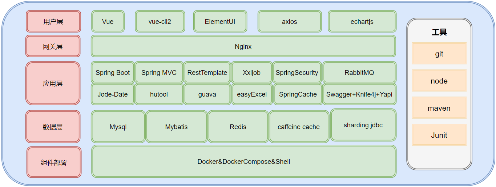

- 前端技术

| 名称   | 技术                        | 场景                      |
| ---- | ------------------------- | ----------------------- |
| 基本骨架 | vue-cli+vue+element+axios | 前端核心技术架构                |
| 报表   | echartsjs                 | 股票数据报表展示，比如折线图、柱状图、K线图等 |
| 前端支持 | node webpack              | 脚手架支持                   |

- 后端技术栈

| 名称        | 技术                                       | 场景                       |
| --------- | ---------------------------------------- | ------------------------ |
| 基础框架      | SpringBoot、Mybatis、SpringMVC             | 项目基础骨架                   |
| 安全框架      | SpringSecurity+Jwt+Token                 | 认证与授权                    |
| 缓存        | Redis+SpringCache                        | 数据缓存                     |
| excel表格导出 | EasyExcel                                | 导出股票相关热点数据               |
| 小组件       | Jode-Time 、hutool 、Guava 、HttpClient \| RestTemplate 、线程池 | 生产力工具                    |
| 定时任务      | Xxljob                                   | 定时采集股票数据                 |
| 分库分表      | Sharding-JDBC                            | 股票数据分库分表方案落地             |
| 前端资源部署    | Nginx+Linux                              | 前端静态资源部署; 代理访问后端功能接口; |

### 3.2 核心业务介绍

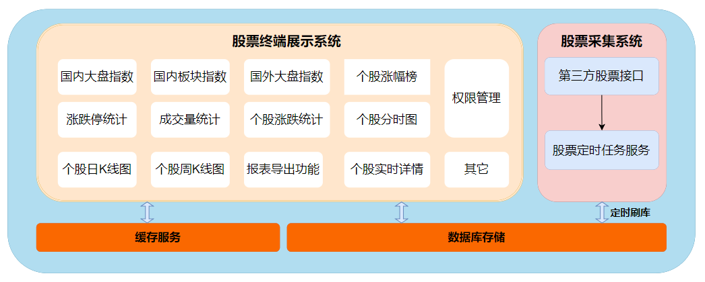

- 股票采集系统
  - 核心功能是周期性采集股票数据，并刷入数据库；
  - 借助xxljob提供完善的任务监控机制；
- 国内指数服务
  - 主要统计国内大盘实时数据信息；
- 板块分析服务
  - 主要统计国内各大行业板块行情数据信息；
- 涨幅榜展示功能
  - 根据个股涨幅排序，提供热点股票数据展示；
- 涨停跌停数展示功能
  - 统计股票涨停跌停的数量；
- 成交量对比展示功能
  - 综合对比真个股市成交量的变化趋势；
- 个股详情展示功能
  - 包含分时行情、日k线、周K线图、个股描述服务等
- 报表导出服务
  - 根据涨幅排序导出热点股票数据信息；
- 其它
  - 用户信息管理；
  - 角色管理；
  - 权限管理等

# 第二章 软件开发流程介绍

​	作为一名软件开发工程师,我们有必要了解软件开发的基本流程， 以及软件开发过程中涉及到的岗位角色，角色的分工、职责， 并了解软件开发中涉及到的常用三种软件环境。

本小节我们将从 软件开发流程、角色分工、软件环境 三个方面，来整体上介绍一下软件开发的核心流程。

## 1、软件开发流程

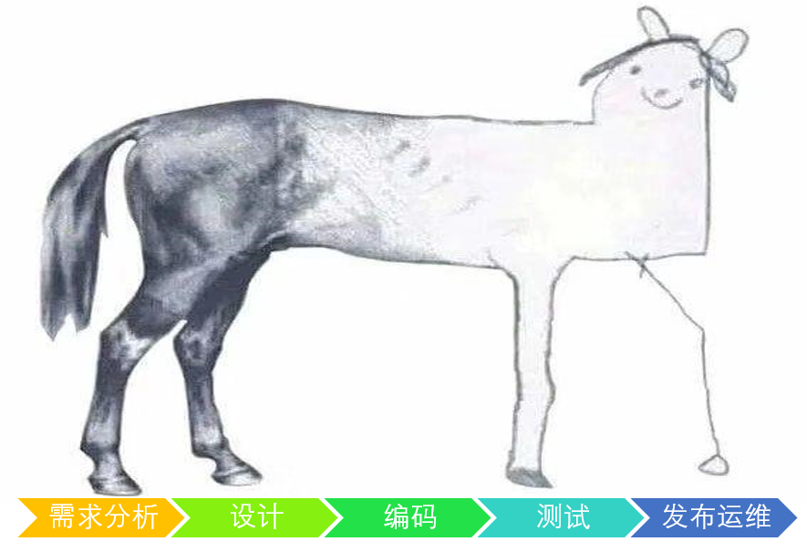

### **1.1.第1阶段: 需求分析**

|      | 说明                                       | 其它                                       |
| ---- | ---------------------------------------- | ---------------------------------------- |
| 参与者  | 小公司：一般由产品经理（兼项目经理和架构师）参与； 大公司：专职需求分析师+产品经理 | 该过程开发、测试、运维相关人员也可参与（团队头脑风暴），方便后期工作的开展；   |
| 过程   | 市场调研+甲方诉求+竞品分析                           | 一个字：抄                                    |
| 产出   | 《用户需求及合同》 《需求分析说明书》 《需求分析确认书》 《产品原型》 | 需求分析说明书用于描述项目的业务细节需求； 产品原型一般是低保真展示产品的布局雏形； |

> 需求来自：甲方、公司自研产品（市场）

### **1.2. 第2阶段: 设计**

| 参与者                 | 产出              | 其它                                       |
| ------------------- | --------------- | ---------------------------------------- |
| 产品经理&前端UI           | 高保真产品原型&UI界面设计  | 输出高保真html原型                              |
| 系统架构师               | 系统概要设计 & 系统架构设计 | 决定项目技术选型&业务架构划分 该阶段其它成员也会参与           |
| 前端开发 后端后端 架构师 | 接口文档说明书&数据库设计   | 前端和后端开发人员根据系统概要设计细化功能模块，进行详细设计：  包括接口文档设计(由前端和后端参与）、 后端开发者参的数据库设计  当然该过程团队其它人员也会参与； |
| 测试人员                | 系统测试计划&测试用例设计   |                                          |
| 运维人员                | 运维手册            | 提前编写软件环境运维手册等                            |

### **1.3. 第3阶段: 编码**

​	在编码阶段，项目经理主要负责把控软件开发的整体进度，其它相关人员各司其职：

- 开发人员
  - 前端：负责前端代码的编写；
  - 后端：负责后端代码的编写；
- 测试人员
  - 根据需求提前编写好测试用例和测试测试计划；
- 运维人员
  - 提前准备好一些运维相关的手册资料；

### **1.4. 第4阶段: 测试**

​	在该阶段中主要由测试人员, 对部署在测试环境的项目进行功能测试, 并出具测试报告。

### **1.5. 第5阶段: 上线运维**

​	在项目上线之前会由运维人员准备服务器上的软件部署环境（包括各种关键的安装和环境配置），然后再将我们开发好的项目，部署在服务器上运行。

>  作为软件开发工程师,我们主要的任务是在编码阶段， 但是在一些小企业中， 我们也可能会涉及到前端开发、软件测试、发布运维等方面的工作；

### 小结

**软件的开发流程：**  

## 2、软件开发角色分工

学习了软件开发的流程之后， 我们还需要了解一下在整个软件开发过程中涉及到的哪些岗位角色，以及各个角色的职责分工。

| 岗位/角色      | 职责/分工                           | 人员分配           |
| ---------- | ------------------------------- | -------------- |
| 项目经理       | 对整个项目负责，任务分配、把控进度               | 1+             |
| 产品经理       | 进行需求调研，输出需求调研文档、产品原型等           | 1+             |
| UI设计师+交互   | 根据产品原型输出界面效果图                   | 1+             |
| 架构师(前端和后端) | 项目整体架构设计、技术选型等（技术总监统筹前后端）       | 1+             |
| 开发工程师      | 功能代码实现（前端开发工程师和后端开发工程师、测试开发工程师） | 前端：2+ 后端：5+ |
| 测试工程师      | 编写测试用例，输出测试报告                   | 2+             |
| 运维工程师      | 软件环境搭建、项目上线、编写运维手册              | 1+             |

> 实际情况中开发团队的人员会随着市场行情、业务调整、项目所处阶段等因素而发生变化，并不能一概而论；

## 3、 软件环境环境

​	软件开发中为了避免开发、测试和运维人员彼此在协作过程中产生不必要的干扰，一般会使用不同的环境加以隔离: 开发环境、测试环境、生产环境。

 接下来，我们分别介绍一下这三套环境的作用和特点。

### **3.1. 开发环境**

​	我们作为软件开发人员，在开发阶段使用的环境，就是开发环境，一般外部用户无法访问。

比如，我们在开发中使用的MySQL数据库和其他的一些常用软件，我们可以安装在本地， 也可以安装在一台专门的服务器中， 这些应用软件仅仅在软件开发过程中使用， 项目测试、上线时，我们不会使用这套环境了，这个环境就是开发环境。

### **3.2. 测试环境**

​	当软件开发工程师，将项目的功能模块开发完毕，并且单元测试通过后，就需要将项目部署到测试服务器上，让测试人员对项目进行测试。那这台测试服务器就是专门给测试人员使用的环境， 也就是测试环境，用于项目测试，一般外部用户无法访问。

### **3.3. 生产环境**

​	当项目开发完毕，并且由测试人员测试通过之后，就可以上线项目，将项目部署到线上环境，并正式对外提供服务，这个线上环境也称之为生产环境。

> 拓展知识:
>
> 灰度发布：一些互联公司在软件升级发布新功能时，并不会一次性全量升级，而是先把部分流量导入新功能，运行一段时间未定后，再逐批次全量升级；

# 第三章 今日指数工程搭建

## 1、数据库环境搭建

### 1.1 表结构介绍

- 大盘和板块相关表

  

- 个股相关表

  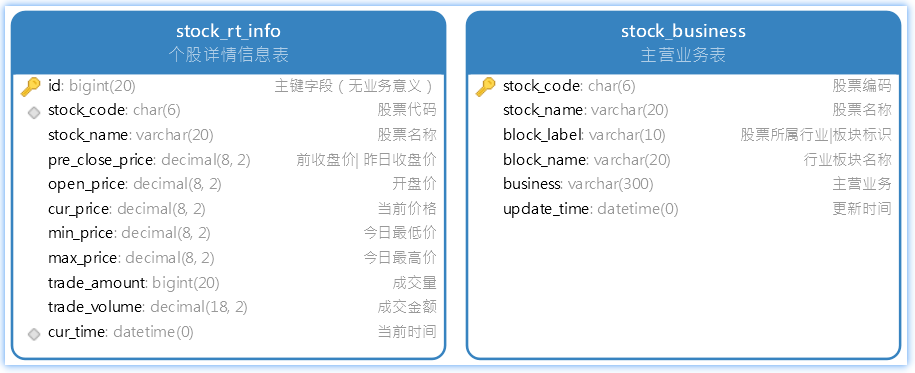

- 权限相关表

  

- 日志表

  

> 注意事项
>
> 1）表与表之间的关系尽量通过业务逻辑维护，而不是通过使用数据库外键约束，原因如下：
>
> ​	1.性能问题：外键约束会使约束的表之间做级联检查，导致数据库性能降低；
>
> ​	2.并发问题：外键约束的表在事务中需要获取级联表的锁，才能进行写操作，这更容易造成死锁问题；（数据库自身存在死锁检查，当放生死锁时，会自动终端另一方的事务）
>
> ​	3.扩展性问题：数据分库分表时，加大了拆分的难度；
>
> 2）**docker容器中的数据库注意时区问题**；
>
> ​	docker run --restart=always -p 3306:3306 --name mysql -v /tmp/mysql/data:/var/lib/mysql  -e MYSQL_ROOT_PASSWORD=root -e TZ=Asia/Shanghai -d mysql:5.7.25  --character-set-server=utf8mb4 --collation-server=utf8mb4_unicode_ci --default-time_zone='+8:00'
>
>    模拟公共的开发环境；

### 1.2 构建项目数据库

- 提前构建好数据库:**stock_db**,并设置编码格式为:utf8；
- 导入 **day01\资料\stock.sql**到数据库中, 自动构建库和表；

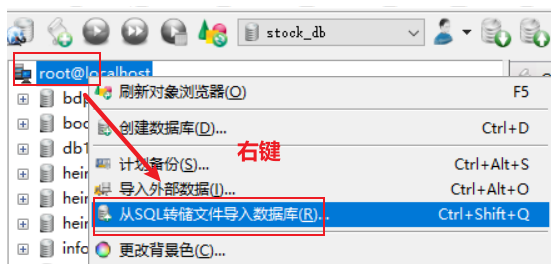

---

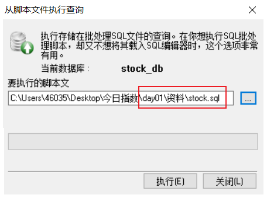

> 说明：当前我们先整体了解项目相关的表结构，等后边用到在细致分析即可；
>

## 2、后端工程搭建

后端工程工程结构：

### 2.1.构建父工程

基于maven构建stock_parent 父工程：

~~~xml
<?xml version="1.0" encoding="UTF-8"?>
<project xmlns="http://maven.apache.org/POM/4.0.0"
         xmlns:xsi="http://www.w3.org/2001/XMLSchema-instance"
         xsi:schemaLocation="http://maven.apache.org/POM/4.0.0 http://maven.apache.org/xsd/maven-4.0.0.xsd">
    <modelVersion>4.0.0</modelVersion>
    <groupId>com.itheima.stock</groupId>
    <artifactId>stock_parent</artifactId>
    <version>1.0-SNAPSHOT</version>
    <modules>
        <module>stock_common</module>
        <module>stock_backend</module>
        <module>stock_job</module>
    </modules>
    <packaging>pom</packaging>
    <description>
        该工程为股票项目的父工程，作用：
        1.聚合若干子工程，统一管理子工程的生命周期
        2.统一管理资源依赖的版本（版本锁定）
        3.统一管理插件的版本依赖
        4.统一导入公共的依赖资源等
    </description>
    <properties>
        <project.build.sourceEncoding>UTF-8</project.build.sourceEncoding>
        <maven.compiler.encoding>UTF-8</maven.compiler.encoding>
        <maven.compiler.source>8</maven.compiler.source>
        <maven.compiler.target>8</maven.compiler.target>
        <maven.surefire.version>2.12.4</maven.surefire.version>
        <mybatis-spring-boot-starter.version>2.1.4</mybatis-spring-boot-starter.version>
        <pagehelper-spring-boot-starter.version>1.2.12</pagehelper-spring-boot-starter.version>
        <mysql-driver.version>5.1.49</mysql-driver.version>
        <fastjson.version>1.2.71</fastjson.version>
        <springfox-swagger2.version>2.9.2</springfox-swagger2.version>
        <druid-spring-boot-starter.version>1.1.22</druid-spring-boot-starter.version>
        <druid-core-version>1.2.8</druid-core-version>
        <sharding-jdbc.version>4.0.0-RC1</sharding-jdbc.version>
        <jjwt.version>0.9.1</jjwt.version>
        <easyExcel.version>3.0.4</easyExcel.version>
        <xxl-job-core.version>2.3.0</xxl-job-core.version>
        <spring-boot.version>2.5.3</spring-boot.version>
        <joda-time.version>2.10.5</joda-time.version>
        <google.guava.version>30.0-jre</google.guava.version>
        <knif4j.version>2.0.2</knif4j.version>
        <hutool.version>5.7.21</hutool.version>
    </properties>
    <!--依赖资源的版本锁定-->
    <dependencyManagement>
        <dependencies>
            <!--引入springboot依赖-->
            <dependency>
                <groupId>org.springframework.boot</groupId>
                <artifactId>spring-boot-starter-parent</artifactId>
                <version>${spring-boot.version}</version>
                <type>pom</type>
                <!--将springboot中锁定的资源依赖与当前工程锁定的资源依赖进行合并-->
                <scope>import</scope>
            </dependency>
            <!--引入mybatis场景依赖-->
            <dependency>
                <groupId>org.mybatis.spring.boot</groupId>
                <artifactId>mybatis-spring-boot-starter</artifactId>
                <version>${mybatis-spring-boot-starter.version}</version>
            </dependency>
            <!--pageHelper场景依赖-->
            <dependency>
                <groupId>com.github.pagehelper</groupId>
                <artifactId>pagehelper-spring-boot-starter</artifactId>
                <version>${pagehelper-spring-boot-starter.version}</version>
            </dependency>
            <!--mysql驱动包-->
            <dependency>
                <groupId>mysql</groupId>
                <artifactId>mysql-connector-java</artifactId>
                <version>${mysql-driver.version}</version>
            </dependency>
            <!--shardingjdbc分库分表-->
            <dependency>
                <groupId>org.apache.shardingsphere</groupId>
                <artifactId>sharding-jdbc-spring-boot-starter</artifactId>
                <version>${sharding-jdbc.version}</version>
            </dependency>
            <!--json工具包-->
            <dependency>
                <groupId>com.alibaba</groupId>
                <artifactId>fastjson</artifactId>
                <version>${fastjson.version}</version>
            </dependency>
            <!--druid-boot依赖-->
            <dependency>
                <groupId>com.alibaba</groupId>
                <artifactId>druid-spring-boot-starter</artifactId>
                <version>${druid-spring-boot-starter.version}</version>
            </dependency>
            <!--druid core-->
            <dependency>
                <groupId>com.alibaba</groupId>
                <artifactId>druid</artifactId>
                <version>${druid-core-version}</version>
            </dependency>
            <!--引入jwt依赖-->
            <dependency>
                <groupId>io.jsonwebtoken</groupId>
                <artifactId>jjwt</artifactId>
                <version>${jjwt.version}</version>
            </dependency>
            <!-- 导出 excel -->
            <dependency>
                <groupId>com.alibaba</groupId>
                <artifactId>easyexcel</artifactId>
                <version>${easyExcel.version}</version>
            </dependency>
            <!--xxl-job定义任务框架支持-->
            <dependency>
                <groupId>com.xuxueli</groupId>
                <artifactId>xxl-job-core</artifactId>
                <version>${xxl-job-core.version}</version>
            </dependency>
            <!--时间小工具-->
            <dependency>
                <groupId>joda-time</groupId>
                <artifactId>joda-time</artifactId>
                <version>${joda-time.version}</version>
            </dependency>
            <!--引入google的工具集-->
            <dependency>
                <groupId>com.google.guava</groupId>
                <artifactId>guava</artifactId>
                <version>${google.guava.version}</version>
            </dependency>

            <dependency>
                <groupId>io.springfox</groupId>
                <artifactId>springfox-swagger2</artifactId>
                <version>${springfox-swagger2.version}</version>
            </dependency>
            <dependency>
                <groupId>io.springfox</groupId>
                <artifactId>springfox-swagger-ui</artifactId>
                <version>${springfox-swagger2.version}</version>
            </dependency>

            <!--knife4j的依赖-->
            <dependency>
                <groupId>com.github.xiaoymin</groupId>
                <artifactId>knife4j-spring-boot-starter</artifactId>
                <version>${knif4j.version}</version>
            </dependency>

            <!--hutool万能工具包-->
            <dependency>
                <groupId>cn.hutool</groupId>
                <artifactId>hutool-all</artifactId>
                <version>${hutool.version}</version>
            </dependency>
        </dependencies>
    </dependencyManagement>

    <!--管理插件-->
    <build>
        <!--引入插件的版本锁定-->
        <pluginManagement>
            <plugins>
                <!--Springboot核心插件-->
                <plugin>
                    <groupId>org.springframework.boot</groupId>
                    <artifactId>spring-boot-maven-plugin</artifactId>
                    <version>${spring-boot.version}</version>
                    <executions>
                        <execution>
                            <goals>
                                <!--防止打包时出现找不到springboot启动类的情况-->
                                <goal>repackage</goal>
                            </goals>
                        </execution>
                    </executions>
                    <configuration>
                        <excludes>
                            <!--插件运行时排除依赖-->
                            <exclude>
                                <groupId>org.springframework.boot</groupId>
                                <artifactId>spring-boot-configuration-processor</artifactId>
                            </exclude>
                        </excludes>
                    </configuration>
                </plugin>
            </plugins>
        </pluginManagement>
    </build>

</project>
~~~

> 注意事项：
>
> 1.父工程会聚合各个子工程，打包方式为pom；
>
> 2.通过dependencyManagement、pluginManagement锁定开发中的依赖和插件的版本；

### 2.2 构建common工程

stock_common公共工程是对stock_backend主业务工程和stock_job任务工程共性代码的抽取，包括pojo、mapper、utils、constant等共享资源；

构建流程如下：

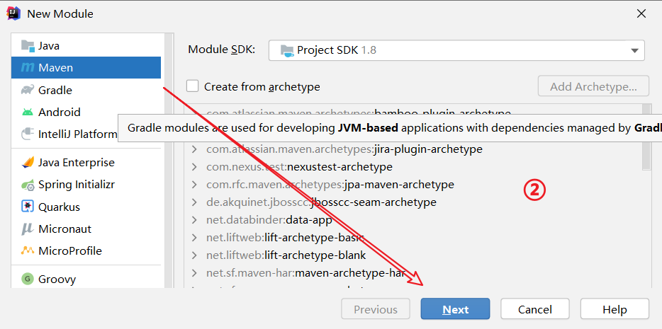

在工程stock_common下pom中引入公共依赖资源：

~~~xml
<?xml version="1.0" encoding="UTF-8"?>
<project xmlns="http://maven.apache.org/POM/4.0.0"
         xmlns:xsi="http://www.w3.org/2001/XMLSchema-instance"
         xsi:schemaLocation="http://maven.apache.org/POM/4.0.0 http://maven.apache.org/xsd/maven-4.0.0.xsd">
    <parent>
        <artifactId>stock_parent</artifactId>
        <groupId>com.itheima.stock</groupId>
        <version>1.0-SNAPSHOT</version>
    </parent>
    <modelVersion>4.0.0</modelVersion>
    <packaging>jar</packaging>
    <artifactId>stock_common</artifactId>
    <description>common工程仅维护公共代码</description>
    <properties>
        <maven.compiler.source>8</maven.compiler.source>
        <maven.compiler.target>8</maven.compiler.target>
    </properties>

    <dependencies>
        <dependency>
            <groupId>org.projectlombok</groupId>
            <artifactId>lombok</artifactId>
        </dependency>
        <!--jackson相关注解，实现日期格式转换和类型格式转换并序列化等-->
        <dependency>
            <groupId>com.fasterxml.jackson.core</groupId>
            <artifactId>jackson-annotations</artifactId>
        </dependency>

        <!--mybatis场景依赖-->
        <dependency>
            <groupId>org.mybatis.spring.boot</groupId>
            <artifactId>mybatis-spring-boot-starter</artifactId>
        </dependency>

        <!--json工具包-->
        <dependency>
            <groupId>com.google.code.gson</groupId>
            <artifactId>gson</artifactId>
        </dependency>

        <!--jode日期插件-->
        <dependency>
            <groupId>joda-time</groupId>
            <artifactId>joda-time</artifactId>
        </dependency>

        <!--工具包-->
        <dependency>
            <groupId>com.google.guava</groupId>
            <artifactId>guava</artifactId>
        </dependency>

        <!--分页插件-->
        <dependency>
            <groupId>com.github.pagehelper</groupId>
            <artifactId>pagehelper-spring-boot-starter</artifactId>
        </dependency>

        <dependency>
            <groupId>com.alibaba</groupId>
            <artifactId>druid-spring-boot-starter</artifactId>
        </dependency>

        <!--apache工具包-->
        <dependency>
            <groupId>org.apache.commons</groupId>
            <artifactId>commons-lang3</artifactId>
        </dependency>

        <dependency>
            <groupId>mysql</groupId>
            <artifactId>mysql-connector-java</artifactId>
        </dependency>

        <!--配置提示-->
        <dependency>
            <groupId>org.springframework.boot</groupId>
            <artifactId>spring-boot-configuration-processor</artifactId>
        </dependency>
    </dependencies>

</project>
~~~

借助IDEA插件mybatisx逆向生成mybatis代码：

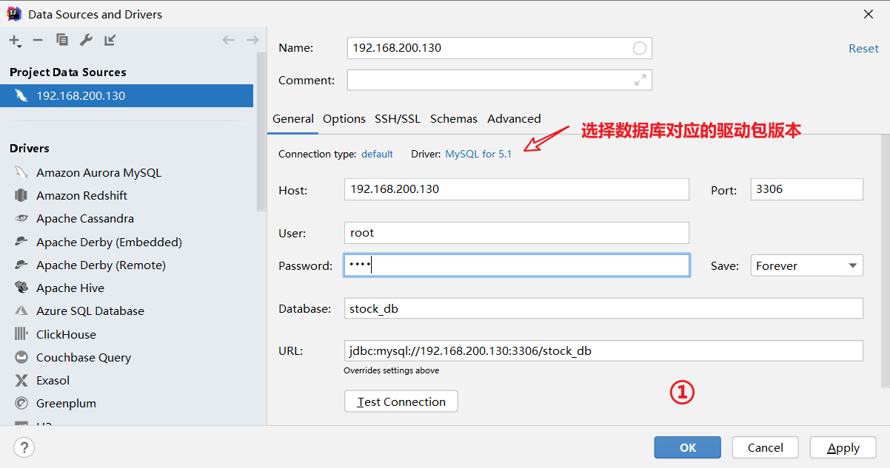

---

---

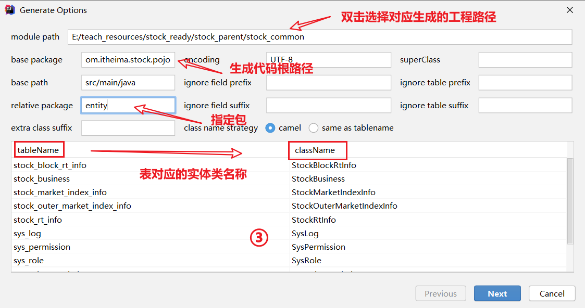

---

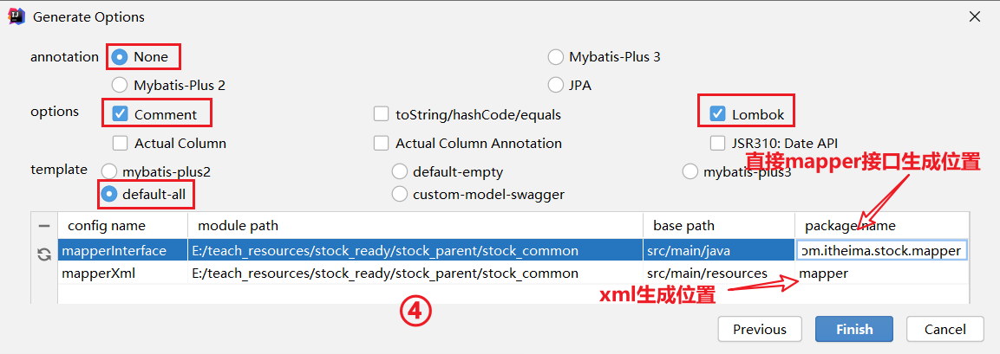

最后stock_common工程效果如下：

> 注意：新版IDEA中MybatisX GUI做了调整，如下：
>
> 

### 2.3.构建stock_backend主业务工程

在stock_parent工程下构建子工程stock_backend，整个过程与stock_common工程一致；

#### 2.3.1 引入依赖

stock_backend工程被stock_parent父工程聚合，pom配置如下：

~~~xml
<?xml version="1.0" encoding="UTF-8"?>
<project xmlns="http://maven.apache.org/POM/4.0.0"
         xmlns:xsi="http://www.w3.org/2001/XMLSchema-instance"
         xsi:schemaLocation="http://maven.apache.org/POM/4.0.0 http://maven.apache.org/xsd/maven-4.0.0.xsd">
    <parent>
        <artifactId>stock_parent</artifactId>
        <groupId>com.itheima.stock</groupId>
        <version>1.0-SNAPSHOT</version>
    </parent>
    <modelVersion>4.0.0</modelVersion>
    <description>股票后端核心工程</description>
    <artifactId>stock_backend</artifactId>
    <!--不指定打包方式默认就是jar-->
    <packaging>jar</packaging>
    <properties>
        <maven.compiler.source>8</maven.compiler.source>
        <maven.compiler.target>8</maven.compiler.target>
    </properties>

    <dependencies>
      	<!--引入公共依赖-->
        <dependency>
            <groupId>com.itheima.stock</groupId>
            <artifactId>stock_common</artifactId>
            <version>1.0-SNAPSHOT</version>
        </dependency>
        <!-- 基本依赖 -->
        <dependency>
            <groupId>org.springframework.boot</groupId>
            <artifactId>spring-boot-starter-web</artifactId>
        </dependency>
      <!--springboot测试依赖-->
        <dependency>
            <groupId>org.springframework.boot</groupId>
            <artifactId>spring-boot-starter-test</artifactId>
            <scope>test</scope>
        </dependency>
    </dependencies>

    <build>
        <!--打包名称-->
        <finalName>${project.artifactId}</finalName>
        <plugins>
            <plugin>
                <groupId>org.springframework.boot</groupId>
                <artifactId>spring-boot-maven-plugin</artifactId>
            </plugin>
        </plugins>
    </build>
</project>

~~~

#### 2.3.2 配置yml

~~~yaml
# web定义
server:
  port: 8091
spring:
  # 配置mysql数据源
  datasource:
    druid:
      username: root
      password: root
      url: jdbc:mysql://192.168.200.131:3306/stock_db?useUnicode=true&characterEncoding=UTF-8&allowMultiQueries=true&useSSL=false&serverTimezone=Asia/Shanghai
      driver-class-name: com.mysql.jdbc.Driver
      # 初始化时建立物理连接的个数。初始化发生在显示调用 init 方法，或者第一次 getConnection 时
      initialSize: 6
      # 最小连接池数量
      minIdle: 2
      # 最大连接池数量
      maxActive: 20
      # 获取连接时最大等待时间，单位毫秒。配置了 maxWait 之后，缺省启用公平锁，
      # 并发效率会有所下降，如果需要可以通过配置 useUnfairLock 属性为 true 使用非公平锁。
      maxWait: 60000

# 配置mybatis
mybatis:
  type-aliases-package: com.itheima.stock.pojo
  mapper-locations: classpath:mapper/*.xml
  configuration:
    map-underscore-to-camel-case: true # 开启驼峰映射
# pagehelper配置
pagehelper:
  helper-dialect: mysql #指定分页数据库类型（方言）
  reasonable: true #合理查询超过最大页，则查询最后一页
~~~

#### 2.3.3 定义main启动类

~~~java
package com.itheima.stock;

import org.mybatis.spring.annotation.MapperScan;
import org.springframework.boot.SpringApplication;
import org.springframework.boot.autoconfigure.SpringBootApplication;
/**
 * @author by itheima
 * @Date 2021/12/29
 * @Description 定义main启动类
 */
@SpringBootApplication
@MapperScan("com.itheima.stock.mapper")
public class StockApp {
    public static void main(String[] args) {
        SpringApplication.run(StockApp.class,args);
    }
}
~~~

> 注意：yml和main启动类也可通过IDEA插件JBLSpringBootAppGen插件生成，然后再完善yml配置；

### 2.4 后端工程可用性测试

目的：我们通过一个简单的web接口访问数据库，验证工程搭建是否可用；
测试接口功能说明:

- 功能要求：根据用户名称等值查询用户信息；
  - 入参：userName
  - 出参：SysUser实体对象
- 接口url: /api/user/{userName}

#### 2.4.1 定义mapper接口方法

StockUserMapper接口和xml定义查询所有股票业务信息的接口方法：

~~~java
    /**
     * 根据用户名称查询用户信息
     * @param userName 用户名称
     * @return
     */
    SysUser findByUserName(@Param("name") String userName);
~~~

~~~xml
    <!--根据用户名称查询用户信息-->
    <select id="findByUserName" resultMap="BaseResultMap">
        select
            <include refid="Base_Column_List" />
        from sys_user
        where   username= #{name}
    </select>
~~~

#### 2.4.2 定义服务接口及实现

定义服务接口：

~~~java
package com.itheima.stock.service;

import com.itheima.stock.pojo.entity.SysUser;

/**
 * @author by itheima
 * @Date 2022/6/29
 * @Description 定义用户服务接口
 */
public interface UserService {

    /**
     * 根据用户查询用户信息
     * @param userName 用户名称
     * @return
     */
    SysUser getUserByUserName(String userName);
}

~~~

定义UserService服务接口实现：

~~~java
package com.itheima.stock.service.impl;

import com.itheima.stock.mapper.SysUserMapper;
import com.itheima.stock.pojo.entity.SysUser;
import com.itheima.stock.service.UserService;
import org.springframework.beans.factory.annotation.Autowired;
import org.springframework.stereotype.Service;

/**
 * @author by itheima
 * @Date 2022/6/29
 * @Description 定义user服务实现
 */

@Service("userService")
public class UserServiceImpl implements UserService {

    @Autowired
    private SysUserMapper sysUserMapper;

    /**
     * 根据用户名称查询用户信息
     * @param userName 用户名称
     * @return
     */
    @Override
    public SysUser getUserByUserName(String userName) {
       SysUser user=sysUserMapper.findByUserName(userName);
        return user;
    }
}

~~~

#### 2.4.3 定义web访问接口

~~~java
package com.itheima.stock.controller;

import com.itheima.stock.pojo.entity.SysUser;
import com.itheima.stock.service.UserService;
import org.springframework.beans.factory.annotation.Autowired;
import org.springframework.web.bind.annotation.GetMapping;
import org.springframework.web.bind.annotation.PathVariable;
import org.springframework.web.bind.annotation.RequestMapping;
import org.springframework.web.bind.annotation.RestController;

/**
 * @author by itheima
 * @Date 2022/6/29
 * @Description 定义用户处理器接口
 */
@RestController
@RequestMapping("/api")
public class UserController {

    @Autowired
    private UserService userService;

    /**
     * 根据用户名查询用户信息
     * @param userName
     * @return
     */
    @GetMapping("/user/{userName}")
    public SysUser getUserByUserName(@PathVariable("userName") String userName){
        return userService.getUserByUserName(userName);
    }
}
~~~

####2.4.4 启动项目测试

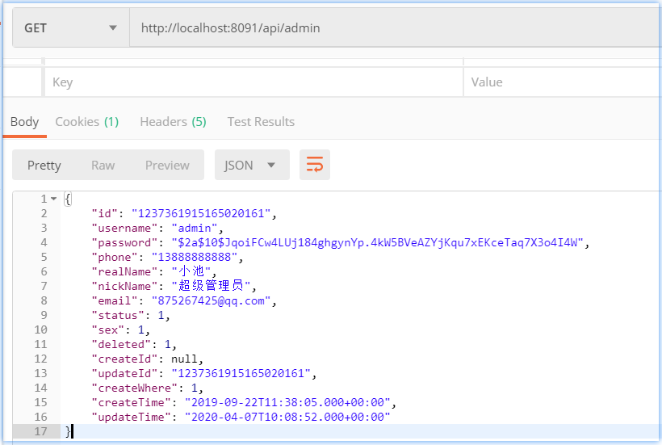

至此，后台基本开发环境构建完毕！

## 3、前端开发环境搭建

### 3.1 前端环境准备

#### 3.1.1 node安装

前端node版本：

> 说明：我们在前面的课程中已安装好node，相关安装包详见：day01\资料\node；
>

#### 3.1.2 VS导入前端代码

> 资料详见day01\资料\前端资料\stock_front_admin.zip,解压并导入vs中；

使用vscode打开工程：

效果如下：

#### 3.1.3 前端工程依赖安装与启动

~~~shell
npm install # 若安装依赖过慢，可安装cnpm并下载安装依赖
~~~

~~~shell
npm run dev # 启动工程
~~~

#### 3.1.4 页面效果

> 注意：
>
> **Windows11系统可能内置winspace服务，该服务占用80端口，导致前端页面不可访问，可将winspace服务停用即可！**

### 3.2 前后端分离跨域问题

浏览器跨域问题：

- 只要请求的协议、端口、ip域名不一致，浏览器就拒绝访问对应的资源；
- 浏览器的同源策略：访问安全问题；

在前面的知识中，我们已经了解到项目进行前后端分离后，存在跨域问题，只需在前端进行简单配置即可；

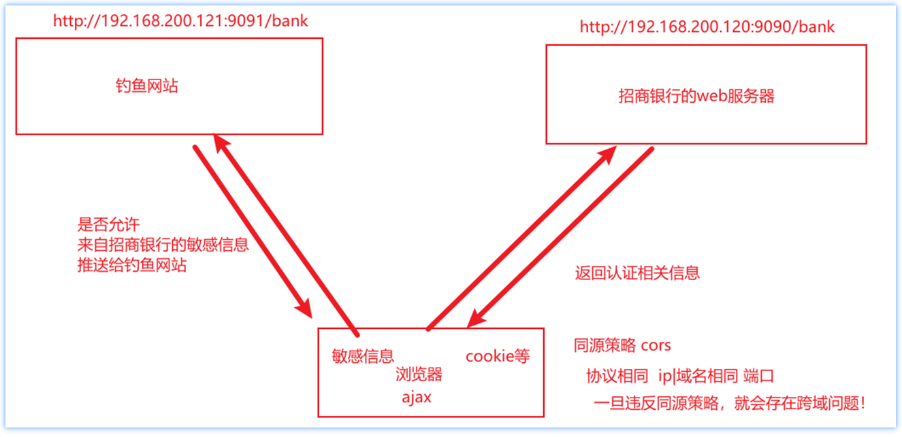

#### 3.2.1 前后端跨域配置

在stock_front_admin\src\settings.js文件下配置跨域：

~~~json
    devServer: {
        port: 80,
        host: '127.0.0.1',// 开发host
        open:true,// 是否启动时打开浏览器
        disableHostCheck: true, // 映射外网时，需要设置为true
        /**
         * 域名，他将会基于 window.location来链接服务器，需要使用public配置
         * dev-server被代理到nginx中配置的 itheima.com
         */
        public: "127.0.0.1:80",//itheima.com
        publicPath:'/',
        compress:true,
        overlay: {// 是否在浏览器全屏显示错误与警告
            warnings: false,
            errors:true
        },
        proxy: {// 跨域请求配置
            "/api": {
                secure: false,// 关闭安全检测，默认请求 https
                //target: "http://192.168.188.131:8091",
                target: "http://localhost:8091",
                changeOrigin: true,
                // pathRewrite: {"^/api" : ""},
            }
        },
    },
~~~

> 注意：请求路径中以api开头的路径则通过代理转发到8091端口，而8091端口就是我们后端展示服务的端口！

#### 3.2.2.前后端交互数据格式

- 前端与后端使用json格式进行交互；

- 后端响应数据封装到统一类中；

  ~~~json
  {
    code: 1 //状态码
    msg: "" //提示信息
    data:   //任意响应数据
  }
  ~~~

  > 前端解析响应数据时，语法格式统一；

统一数据封装：

~~~java
package com.itheima.stock.vo.resp;

import com.fasterxml.jackson.annotation.JsonInclude;

import java.io.Serializable;

/**
 * 返回数据类
 * @JsonInclude 保证序列化json的时候,如果是null的对象,key也会消失
 * @param <T>
 */
@JsonInclude(JsonInclude.Include.NON_NULL)
public class R<T> implements Serializable {
    private static final long serialVersionUID = 7735505903525411467L;

    // 成功值,默认为1
    private static final int SUCCESS_CODE = 1;
    // 失败值,默认为0
    private static final int ERROR_CODE = 0;

    //状态码
    private int code;
    //消息
    private String msg;
    //返回数据
    private T data;

    private R(int code){
        this.code = code;
    }
    private R(int code, T data){
        this.code = code;
        this.data = data;
    }
    private R(int code, String msg){
        this.code = code;
        this.msg = msg;
    }
    private R(int code, String msg, T data){
        this.code = code;
        this.msg = msg;
        this.data = data;
    }

    public static <T> R<T> ok(){
        return new R<T>(SUCCESS_CODE,"success");
    }
    public static <T> R<T> ok(String msg){
        return new R<T>(SUCCESS_CODE,msg);
    }
    public static <T> R<T> ok(T data){
        return new R<T>(SUCCESS_CODE,data);
    }
    public static <T> R<T> ok(String msg, T data){
        return new R<T>(SUCCESS_CODE,msg,data);
    }

    public static <T> R<T> error(){
        return new R<T>(ERROR_CODE,"error");
    }
    public static <T> R<T> error(String msg){
        return new R<T>(ERROR_CODE,msg);
    }
    public static <T> R<T> error(int code, String msg){
        return new R<T>(code,msg);
    }
    public static <T> R<T> error(ResponseCode res){
        return new R<T>(res.getCode(),res.getMessage());
    }

    public int getCode(){
        return code;
    }
    public String getMsg(){
        return msg;
    }
    public T getData(){
        return data;
    }
}
~~~

定义状态码与提示信息枚举：

~~~java
package com.itheima.stock.vo.resp;

/**
 * @author by itheima
 * @Date 2021/12/21
 * @Description
 */
public enum ResponseCode{
    ERROR(0,"操作失败"),
    SUCCESS(1,"操作成功"),
    DATA_ERROR(0,"参数异常"),
    NO_RESPONSE_DATA(0,"无响应数据"),
    CHECK_CODE_NOT_EMPTY(0,"验证码不能为空"),
    CHECK_CODE_ERROR(0,"验证码错误"),
    USERNAME_OR_PASSWORD_ERROR(0,"用户名或密码错误"),
    ACCOUNT_EXISTS_ERROR(0,"该账号已存在"),
    ACCOUNT_NOT_EXISTS(0,"该账号不存在"),
    TOKEN_ERROR(2,"用户未登录，请先登录"),
    NOT_PERMISSION(3,"没有权限访问该资源"),
    ANONMOUSE_NOT_PERMISSION(0,"匿名用户没有权限访问"),
    INVALID_TOKEN(0,"无效的票据"),
    OPERATION_MENU_PERMISSION_CATALOG_ERROR(0,"操作后的菜单类型是目录，所属菜单必须为默认顶级菜单或者目录"),
    OPERATION_MENU_PERMISSION_MENU_ERROR(0,"操作后的菜单类型是菜单，所属菜单必须为目录类型"),
    OPERATION_MENU_PERMISSION_BTN_ERROR(0,"操作后的菜单类型是按钮，所属菜单必须为菜单类型"),
    OPERATION_MENU_PERMISSION_URL_CODE_NULL(0,"菜单权限的按钮标识不能为空"),
    ROLE_PERMISSION_RELATION(0, "该菜单权限存在子集关联，不允许删除");
    private int code;
    private String message;

    ResponseCode(int code, String message) {
        this.code = code;
        this.message = message;
    }

    public int getCode() {
        return code;
    }

    public String getMessage() {
        return message;
    }
}
~~~

# 第四章 用户登录工程实现

## 1、需求分析

###1.1 页面原型效果

###1.2 相关的表结构

sys_user表如下：

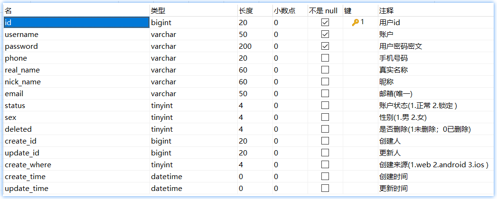

###1.3 访问接口定义

~~~json
请求接口：/api/login
请求方式：POST
请求数据示例：
   {
       username:'zhangsan',//用户名
       password:'666',//密码
       code:'1234' //校验码
    }
响应数据：
    {
        "code": 1,//成功1 失败0
        "data": { //data为响应的具体数据，不同的接口，data数据格式可能会不同
                "id":"1237365636208922624",
                "username":"zhangsan",
                "nickName":"xiaozhang",
                "phone":"1886702304"
        }
    }
~~~

请求参数：

| 参数名称 | 参数说明     | 是否必须 | 数据类型   | 备注      |
| :--- | -------- | ---- | ------ | ------- |
| 用户名  | username | true | string |         |
| 密码   | password | true | string |         |
| 校验码  | code     | true | string | 配置校验码功能 |

### 1.4 封装请求和响应vo

在stock_backend工程下构建构建包：

~~~tex
com.itheima.stock.vo
                  ├── req  # 请求数据封装类
                  └── resp # 响应数据封装类
~~~

> vo对象直接在：**day01\资料\vo导入即可**；

~~~java
package com.itheima.stock.vo.req;

import lombok.Data;

/**
 * @author by itheima
 * @Date 2021/12/30
 * @Description 登录请求vo
 */
@Data
public class LoginReqVo {
    /**
     * 用户名
     */
    private String username;
    /**
     * 密码
     */
    private String password;
    /**
     * 验证码
     */
    private String code;
}
~~~

登录响应vo工程导入：day01\资料\LoginRespVo.java

~~~java
package com.itheima.stock.vo.resp;

import lombok.AllArgsConstructor;
import lombok.Builder;
import lombok.Data;
import lombok.NoArgsConstructor;

/**
 * @author by itheima
 * @Date 2021/12/24
 * @Description 登录后响应前端的vo
 */
@Data
@NoArgsConstructor
@AllArgsConstructor
@Builder
public class LoginRespVo {
    /**
     * 用户ID
     * 将Long类型数字进行json格式转化时，转成String格式类型
     */
    @JsonSerialize(using = ToStringSerializer.class)
    /**
     * 电话
     */
    private String phone;
    /**
     * 用户名
     */
    private String username;
    /**
     * 昵称
     */
    private String nickName;

}
~~~

## 2、登录功能开发实现

### 2.1 配置密码加密匹配器

引入依赖资源：

~~~xml
<!--密码加密和校验工具包-->
<dependency>
    <groupId>org.springframework.security</groupId>
    <artifactId>spring-security-crypto</artifactId>
</dependency>
~~~

配置密码加密匹配bean：

~~~java
package com.itheima.stock.config;

import org.springframework.context.annotation.Bean;
import org.springframework.context.annotation.Configuration;
import org.springframework.security.crypto.bcrypt.BCryptPasswordEncoder;
import org.springframework.security.crypto.password.PasswordEncoder;

/**
 * @author by itheima
 * @Date 2021/12/30
 * @Description 定义公共配置类
 */
@Configuration
public class CommonConfig {
    /**
     * 密码加密器
     * BCryptPasswordEncoder方法采用SHA-256对密码进行加密
     * @return
     */
    @Bean
    public PasswordEncoder passwordEncoder(){
        return new BCryptPasswordEncoder();
    }
}
~~~

密码加密测试：

~~~java
@SpringBootTest
public class TestAll {
    @Autowired
    private PasswordEncoder passwordEncoder;
        @Test
    public void testPwd(){
        String pwd="1234";
        //加密  $2a$10$WAWV.QEykot8sHQi6FqqDOAnevkluOZJqZJ5YPxSnVVWqvuhx88Ha
        String encode = passwordEncoder.encode(pwd);
        System.out.println(encode);
        /*
            matches()匹配明文密码和加密后密码是否匹配，如果匹配，返回true，否则false
            just test
         */
        boolean flag = passwordEncoder.matches(pwd, 				          "$2a$10$WAWV.QEykot8sHQi6FqqDOAnevkluOZJqZJ5YPxSnVVWqvuhx88Ha");
        System.out.println(flag);
    }
}    
~~~

### 2.2 登录接口方法定义

~~~java
package com.itheima.stock.controller;

import com.itheima.stock.service.UserService;
import com.itheima.stock.vo.req.LoginReqVo;
import com.itheima.stock.vo.resp.LoginRespVo;
import com.itheima.stock.vo.resp.R;
import org.springframework.beans.factory.annotation.Autowired;
import org.springframework.web.bind.annotation.*;

/**
 * @author by itheima
 * @Date 2021/12/29
 * @Description 定义用户访问层
 */
@RestController
@RequestMapping("/api")
public class UserController {

    @Autowired
    private UserService userService;

    /**
     * 用户登录功能实现
     * @param vo
     * @return
     */
    @PostMapping("/login")
    public R<LoginRespVo> login(@RequestBody LoginReqVo vo){
        R<LoginRespVo> r= this.userService.login(vo);
        return r;
    }
}
~~~

### 2.3 定义登录服务实现

服务接口：

~~~java
package com.itheima.stock.service;

import com.itheima.stock.vo.req.LoginReqVo;
import com.itheima.stock.vo.resp.LoginRespVo;
import com.itheima.stock.vo.resp.R;

/**
 * @author by itheima
 * @Date 2021/12/30
 * @Description 用户服务
 */
public interface UserService {
    /**
     * 用户登录功能实现
     * @param vo
     * @return
     */
    R<LoginRespVo> login(LoginReqVo vo);
}
~~~

接口服务实现：

~~~java
package com.itheima.stock.service.impl;

import com.google.common.base.Strings;
import com.itheima.stock.common.enums.ResponseCode;
import com.itheima.stock.mapper.SysUserMapper;
import com.itheima.stock.pojo.SysUser;
import com.itheima.stock.service.UserService;
import com.itheima.stock.vo.req.LoginReqVo;
import com.itheima.stock.vo.resp.LoginRespVo;
import com.itheima.stock.vo.resp.R;
import org.springframework.beans.BeanUtils;
import org.springframework.beans.factory.annotation.Autowired;
import org.springframework.security.crypto.password.PasswordEncoder;
import org.springframework.stereotype.Service;

/**
 * @author by itheima
 * @Date 2021/12/30
 * @Description 定义服务接口实现
 */
@Service("userService")
public class UserServiceImpl implements UserService {

    @Autowired
    private SysUserMapper sysUserMapper;

    @Autowired
    private PasswordEncoder passwordEncoder;

    @Override
    public R<LoginRespVo> login(LoginReqVo vo) {
        if (vo==null || StringUtils.isBlank(vo.getUsername()) || StringUtils.isBlank(vo.getPassword())){
            return R.error(ResponseCode.DATA_ERROR.getMessage());
        }
        //根据用户名查询用户信息
        SysUser user=this.sysUserMapper.findByUserName(vo.getUsername());
        //判断用户是否存在，存在则密码校验比对
        if (user==null || !passwordEncoder.matches(vo.getPassword(),user.getPassword())){
            return R.error(ResponseCode.SYSTEM_PASSWORD_ERROR.getMessage());
        }
        //组装登录成功数据
        LoginRespVo respVo = new LoginRespVo();
        //属性名称与类型必须相同，否则属性值无法copy
        BeanUtils.copyProperties(user,respVo);
        return  R.ok(respVo);
    }
}
~~~

### 2.4 定义mapper方法

在stock_common工程中SysUserMapper下定义接口方法：

~~~java
    /**
     * 根据用户名查询用户信息
     * @param username
     * @return
     */
    SysUser findByUserName(@Param("username") String username);
~~~

绑定xml：

~~~xml
    <select id="findByUserName" resultMap="BaseResultMap">
        select <include refid="Base_Column_List"/> from sys_user where
        username=#{username}
    </select>
~~~

### 2.5 Postman测试

