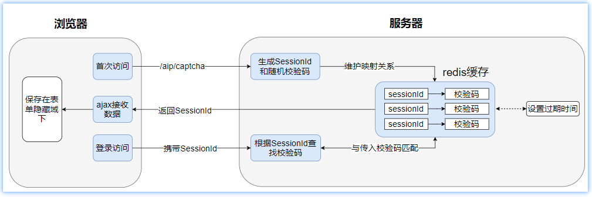

# day02-大盘板块功能实现

## 今日目标

- 完善基于前后端分离用户验证码登录功能;
- 理解验证码生成流程,并使用postman测试;
- 掌握Swagger+Yapi使用
- 理解并实现国内大盘数据展示功能;
- 理解并实现国内板块数据展示功能;
- 理解后端接口调试和前后端联调的概念;


# 第一章 验证码登录功能

## 1、前后端分离状态识别问题

### 1.1 前后端分离存在的问题

单体架构基于session-cookie机制实现验证码流程：


对于前后端分离的架构会存在跨域问题，这会导致请求无法携带Cookie,而Session机制是基于Cookie的，所以会导致session失效；

同时对于后端服务后期如果要搭建集群，则还需要解决单点session共享的问题；

### 1.2 解决Session和Cookie失效问题

- cookie失效问题
  - 我们可在后端生成一个sessionId,并将sessionId作为key，校验码作为value保存在redis下（redis代替session),之后借鉴cookie思路再将sessionId作为参数响应给前端；
- Session过期失效问题
  - 我们借助redis的过期失效机制来模拟Session过期失效的行为；

## 2、验证码功能流程分析

我们可使用分布式缓存redis模拟session机制，实现验证码的生成和校验功能，核心流程如下：



> 注意事项：需要保证SessionId的唯一性，否则可能会出现用户输入了正确的校验码，但是依旧可能会校验失败的问题；
>

### 2.1 验证码生成接口说明

功能描述：验证码生成功能  

请求路径：/api/captcha
请求参数：无
请求方式：get
响应数据格式：

```json
{
    "code": 1,
    "data": {
        "imageData": "iVBORw0KGgoAAAANSUh...省略...AAAPoAAAAoCAYAAADX=", //base64格式图片
        "sessionId": "1479063316897845248" //保存在redis中验证码对应的key，模拟sessioinId
    }
}
```
> 说明：前端图片验证码以base64数据格式展示(**点击图片查看源码**)：
>
> 

### 2.2.项目集成redis

在stock_backend工程引入redis相关依赖：

~~~xml
<!--redis场景依赖-->
<dependency>
    <groupId>org.springframework.boot</groupId>
    <artifactId>spring-boot-starter-data-redis</artifactId>
</dependency>
<!-- redis创建连接池，默认不会创建连接池 -->
<dependency>
    <groupId>org.apache.commons</groupId>
    <artifactId>commons-pool2</artifactId>
</dependency>
~~~

定义application-cache.yml文件专门配置缓存信息：

~~~yaml
spring:
  # 配置缓存
  redis:
    host: 192.168.188.130
    port: 6379
    database: 0 #Redis数据库索引（默认为0）
    lettuce:
      pool:
        max-active: 8 # 连接池最大连接数（使用负值表示没有限制）
        max-wait: -1ms # 连接池最大阻塞等待时间（使用负值表示没有限制）
        max-idle: 8 # 连接池中的最大空闲连接
        min-idle: 1  # 连接池中的最小空闲连接
    timeout: PT10S # 连接超时时间
~~~

> 说明：由于application主配置文件在后续会写入很多其它配置信息，这会导致主配置臃肿难以维护，所以我们把不同的信息独立配置，这样就降低了维护成本；

在主配置文件中激活配置：

~~~yaml
spring.profiles.active=cache
~~~

自定义RedisTemplate序列化：

~~~java
@Configuration
public class RedisCacheConfig {
    /**
     * 配置redisTemplate bean，自定义数据的序列化的方式
     * @param redisConnectionFactory 连接redis的工厂，底层有场景依赖启动时，自动加载
     * @return
     */
    @Bean
    public RedisTemplate redisTemplate(@Autowired RedisConnectionFactory redisConnectionFactory){
        //1.构建RedisTemplate模板对象
        RedisTemplate<String, Object> template = new RedisTemplate<>();
        template.setConnectionFactory(redisConnectionFactory);
        //2.为不同的数据结构设置不同的序列化方案
        //设置key序列化方式
        template.setKeySerializer(new StringRedisSerializer());
        //设置value序列化方式
        template.setValueSerializer(new Jackson2JsonRedisSerializer<>(Object.class));
        //设置hash中field字段序列化方式
        template.setHashKeySerializer(new StringRedisSerializer());
        //设置hash中value的序列化方式
        template.setHashValueSerializer(new Jackson2JsonRedisSerializer<>(Object.class));
        //5.初始化参数设置
        template.afterPropertiesSet();
        return template;
    }
}
~~~

测试redis基础环境：

~~~java
package com.itheima.stock;

import org.junit.jupiter.api.Test;
import org.springframework.beans.factory.annotation.Autowired;
import org.springframework.boot.test.context.SpringBootTest;
import org.springframework.data.redis.core.RedisTemplate;

/**
 * @author by itheima
 * @Date 2021/12/30
 * @Description
 */
@SpringBootTest
public class TestRedis {

    @Autowired
    private RedisTemplate<String,String> redisTemplate;

    @Test
    public void test01(){
        //存入值
        redisTemplate.opsForValue().set("myname","zhangsan");
        //获取值
        String myname = redisTemplate.opsForValue().get("myname");
        System.out.println(myname);
    }   
}
~~~

效果：


## 3、SessionID唯一性解决方案

### 3.1 雪花算法介绍

- 后台生成SessionId需要保证全局唯一，我们可借鉴SnowFlake（雪花算法）来实现；
- 什么是雪花算法？
  - 雪花算法是Twitter公司内部为分布式环境下生成唯一ID的一种算法解决方案，底层会帮助我们生成一个64位(比特位)的long类型的Id；

    

### 3.2 导入雪花算法工具类

各种开发语言都有对雪花算法的实现，我们直接在stock_common工程中引入已写好的工具类即可：

~~~java
package com.itheima.stock.utils;

import java.lang.management.ManagementFactory;
import java.net.InetAddress;
import java.net.NetworkInterface;

/**
 * 分布式自增长ID实现，底层基于Twitter的Snowflake
 * 64位ID (42(时间戳)+5(机房ID)+5(机器ID)+12(序列号-同毫秒内重复累加))
 * @author itheima
 */
public class IdWorker {
    // 时间起始标记点，作为基准，一般取系统的最近时间（一旦确定不能变动）
    private final static long twepoch = 1288834974657L;
    // 机器标识位数
    private final static long workerIdBits = 5L;
    // 数据中心标识位数
    private final static long datacenterIdBits = 5L;
    // 机器ID最大值
    private final static long maxWorkerId = -1L ^ (-1L << workerIdBits);
    // 数据中心ID最大值
    private final static long maxDatacenterId = -1L ^ (-1L << datacenterIdBits);
    // 毫秒内自增位
    private final static long sequenceBits = 12L;
    // 机器ID偏左移12位
    private final static long workerIdShift = sequenceBits;
    // 数据中心ID左移17位
    private final static long datacenterIdShift = sequenceBits + workerIdBits;
    // 时间毫秒左移22位
    private final static long timestampLeftShift = sequenceBits + workerIdBits + datacenterIdBits;

    private final static long sequenceMask = -1L ^ (-1L << sequenceBits);
    /* 上次生产id时间戳 */
    private static long lastTimestamp = -1L;
    //同毫秒并发控制
    private long sequence = 0L;
	//机器ID
    private final long workerId;
    //机房ID
    private final long datacenterId;

    public IdWorker(){
        this.datacenterId = getDatacenterId(maxDatacenterId);
        this.workerId = getMaxWorkerId(datacenterId, maxWorkerId);
    }
    /**
     * @param workerId
     *            工作机器ID
     * @param datacenterId
     *            序列号
     */
    public IdWorker(long workerId, long datacenterId) {
        if (workerId > maxWorkerId || workerId < 0) {
            throw new IllegalArgumentException(String.format("worker Id can't be greater than %d or less than 0", maxWorkerId));
        }
        if (datacenterId > maxDatacenterId || datacenterId < 0) {
            throw new IllegalArgumentException(String.format("datacenter Id can't be greater than %d or less than 0", maxDatacenterId));
        }
        this.workerId = workerId;
        this.datacenterId = datacenterId;
    }
    /**
     * 获取下一个ID
     *
     * @return
     */
    public synchronized long nextId() {
        long timestamp = timeGen();
        if (timestamp < lastTimestamp) {
            throw new RuntimeException(String.format("Clock moved backwards.  Refusing to generate id for %d milliseconds", lastTimestamp - timestamp));
        }

        if (lastTimestamp == timestamp) {
            // 当前毫秒内，则+1
            sequence = (sequence + 1) & sequenceMask;
            if (sequence == 0) {
                // 当前毫秒内计数满了，则等待下一秒
                timestamp = tilNextMillis(lastTimestamp);
            }
        } else {
            sequence = 0L;
        }
        lastTimestamp = timestamp;
        // ID偏移组合生成最终的ID，并返回ID
        long nextId = ((timestamp - twepoch) << timestampLeftShift)
                | (datacenterId << datacenterIdShift)
                | (workerId << workerIdShift) | sequence;

        return nextId;
    }

    private long tilNextMillis(final long lastTimestamp) {
        long timestamp = this.timeGen();
        while (timestamp <= lastTimestamp) {
            timestamp = this.timeGen();
        }
        return timestamp;
    }

    private long timeGen() {
        return System.currentTimeMillis();
    }

    /**
     * <p>
     * 获取 maxWorkerId
     * </p>
     */
    protected static long getMaxWorkerId(long datacenterId, long maxWorkerId) {
        StringBuffer mpid = new StringBuffer();
        mpid.append(datacenterId);
        String name = ManagementFactory.getRuntimeMXBean().getName();
        if (!name.isEmpty()) {
            /*
             * GET jvmPid
             */
            mpid.append(name.split("@")[0]);
        }
        /*
         * MAC + PID 的 hashcode 获取16个低位
         */
        return (mpid.toString().hashCode() & 0xffff) % (maxWorkerId + 1);
    }

    /**
     * <p>
     * 数据标识id部分
     * </p>
     */
    protected static long getDatacenterId(long maxDatacenterId) {
        long id = 0L;
        try {
            InetAddress ip = InetAddress.getLocalHost();
            NetworkInterface network = NetworkInterface.getByInetAddress(ip);
            if (network == null) {
                id = 1L;
            } else {
                byte[] mac = network.getHardwareAddress();
                id = ((0x000000FF & (long) mac[mac.length - 1])
                        | (0x0000FF00 & (((long) mac[mac.length - 2]) << 8))) >> 6;
                id = id % (maxDatacenterId + 1);
            }
        } catch (Exception e) {
            System.out.println(" getDatacenterId: " + e.getMessage());
        }
        return id;
    }
}
~~~

效果：


在stock_backend工程配置ID生成器bean对象：

~~~java
package com.itheima.stock.config;

import com.itheima.stock.utils.IdWorker;
import org.springframework.context.annotation.Bean;
import org.springframework.context.annotation.Configuration;
import org.springframework.security.crypto.bcrypt.BCryptPasswordEncoder;
import org.springframework.security.crypto.password.PasswordEncoder;

/**
 * @author by itheima
 * @Date 2021/12/30
 * @Description 定义公共配置类
 */
@Configuration
public class CommonConfig {
    
    /**
     * 配置id生成器bean
     * @return
     */
    @Bean
    public IdWorker idWorker(){
        //基于运维人员对机房和机器的编号规划自行约定
        return new IdWorker(1l,2l);
    }
	......
}
~~~

## 4、验证码功能实现

### 4.1 定义web接口

在UserController接口定义访问方法：

~~~java
    /**
     * 生成登录校验码的访问接口
     * @return
     */
    @GetMapping("/captcha")
    public R<Map> getCaptchaCode(){
        return userService.getCaptchaCode();
    }
~~~

### 4.2 定义生成验证码服务

在UserService服务接口：

~~~java
    /**
     * 登录校验码生成服务方法
     * @return
     */
    R<Map> getCaptchaCode();
~~~

在stock_backend工程引入图片验证码生成工具包：

~~~xml
<!--hutool万能工具包-->
<dependency>
  <groupId>cn.hutool</groupId>
  <artifactId>hutool-all</artifactId>
</dependency>
~~~

实现验证码功能：

~~~java
    @Autowired
    private RedisTemplate redisTemplate;
	/**
     * 分布式环境保证生成id唯一
     */
    @Autowired
    private IdWorker idWorker;  

    /**
     * 登录校验吗方法实现
     * @return
     */
    @Override
    public R<Map> getCaptchaCode() {
        //参数分别是宽、高、验证码长度、干扰线数量
        LineCaptcha captcha = CaptchaUtil.createLineCaptcha(250, 40, 4, 5);
        //设置背景颜色清灰
        captcha.setBackground(Color.lightGray);
        //自定义校验码生成方式
//        captcha.setGenerator(new CodeGenerator() {
//            @Override
//            public String generate() {
//                return RandomStringUtils.randomNumeric(4);
//            }
//            @Override
//            public boolean verify(String code, String userInputCode) {
//                return code.equalsIgnoreCase(userInputCode);
//            }
//        });
        //获取图片中的验证码，默认生成的校验码包含文字和数字，长度为4
        String checkCode = captcha.getCode();
        log.info("生成校验码:{}",checkCode);
        //生成sessionId
        String sessionId = String.valueOf(idWorker.nextId());
        //将sessionId和校验码保存在redis下，并设置缓存中数据存活时间一分钟
        redisTemplate.opsForValue().set(StockConstant.CHECK_PREFIX +sessionId,checkCode,1, TimeUnit.MINUTES);
        //组装响应数据
        HashMap<String, String> info = new HashMap<>();
        info.put("sessionId",sessionId);
        info.put("imageData",captcha.getImageBase64());//获取base64格式的图片数据
        //设置响应数据格式
        return R.ok(info);
    }
~~~

### 4.3 定义常量类

项目中一些业务经常会使用一些常量字段，开发者一般会将这些业务相关的常量信息封装到一个常量类中统一维护；

> 举例：在redis中为了方便维护用户登录校验码信息，我们可为key配置一个业务前缀，比如CK:12312323->6677,这样后期开发和运维人员就会很方便的查找出以CK开头的验证码信息了；

作为公共的常量信息类，我们就将它封装到stock_common工程下即可：

```java
package com.itheima.stock.constant;

/**
 * @author by itheima
 * @Description 常量类信息封装
 */
public class StockConstant {

    /**
     * 定义校验码的前缀
     */
    public static final String CHECK_PREFIX="CK:";

    /**
     * http请求头携带Token信息key
     */
    public static final String TOKEN_HEADER = "authorization";

    /**
     * 缓存股票相关信息的cacheNames命名前缀
     */
    public static final String STOCK="stock";
}
```

### 4.4 访问测试

postman:http://127.0.0.1:8091/api/captcha


页面效果：


## 5、完善验证码登录功能

### 5.1 完善登录请求VO

LoginReqVo添加rkey属性：

~~~java
package com.itheima.stock.vo.req;

import lombok.Data;

/**
 * @author by itheima
 * @Date 2021/12/30
 * @Description 登录请求vo
 */
@Data
public class LoginReqVo {
	//.....

    /**
     * 保存redis随机码的key，也就是sessionId
     */
    private String sessionId;
}

~~~

### 5.2 完善登录验证码逻辑

添加校验码校验功能：

~~~java
    /**
     * 用户登录功能
     * @param vo
     * @return
     */
    @Override
    public R<LoginRespVo> login(LoginReqVo vo) {
        //1.校验参数的合法性
        if (vo==null || StringUtils.isBlank(vo.getUsername()) || StringUtils.isBlank(vo.getPassword())) {
            return R.error(ResponseCode.DATA_ERROR);
        }
        //2.校验验证码和sessionId是否有效
        if (StringUtils.isBlank(vo.getCode()) || StringUtils.isBlank(vo.getSessionId())){
            return R.error(ResponseCode.DATA_ERROR);
        }
        //3.根据Rkey从redis中获取缓存的校验码
        String rCode= (String) redisTemplate.opsForValue().get(StockConstant.CHECK_PREFIX+vo.getSessionId());
        //判断获取的验证码是否存在，以及是否与输入的验证码相同
        if (StringUtils.isBlank(rCode) || ! rCode.equalsIgnoreCase(vo.getCode())) {
                //验证码输入有误
            return R.error(ResponseCode.CHECK_CODE_ERROR);
        }
        //4.根据账户名称去数据库查询获取用户信息
        SysUser dbUser = sysUserMapper.getUserByUserName(vo.getUsername());
        //5.判断数据库用户是否存在
        if (dbUser==null) {
            return R.error(ResponseCode.ACCOUNT_NOT_EXISTS);
        }
        //6.如果存在，则获取密文密码，然后传入的明文进行匹配,判断是否匹配成功
        if (!passwordEncoder.matches(vo.getPassword(),dbUser.getPassword())) {
           return R.error(ResponseCode.USERNAME_OR_PASSWORD_ERROR);
        }
        //7.正常响应
        LoginRespVo respVo = new LoginRespVo();
        BeanUtils.copyProperties(dbUser,respVo);
        return R.ok(respVo);
    }
~~~

### 5.3 登录测试联调

页面登录效果：


# 第二章 接口文档管理工具

## 1、Swagger快速入门

### 1.1 swagger介绍

官网：https://swagger.io/


Swagger 是一个规范和完整的Web API框架，用于生成、描述、调用和可视化 RESTful 风格的 Web 服务。

功能主要包含以下几点:

A. 使得前后端分离开发更加方便，有利于团队协作;

B. 接口文档在线自动生成，降低后端开发人员编写接口文档的负担;

C. 接口功能测试;

使用Swagger只需要按照它的规范去定义接口及接口相关的信息，再通过Swagger衍生出来的一系列项目和工具，就可以做到生成各种格式的接口文档，以及在线接口调试页面等等;

### 1.2 项目集成swagger流程

 - 引入swagger依赖；
 - 定义swagger配置类；
    - swagger扫描管理的web资源路径；
    - 配置项目文档标题、描述、版本等信息、官网地址等信息；
 - 通过swagger注解给指定资源添加描述信息；
 - 项目启动，访问并测试在线资源；


### 1.3 项目集成swagger

- 在stock_common工程引入依赖

  ~~~xml
  <dependency>
    <groupId>io.springfox</groupId>
    <artifactId>springfox-swagger2</artifactId>
  </dependency>
  <dependency>
    <groupId>io.springfox</groupId>
    <artifactId>springfox-swagger-ui</artifactId>
  </dependency>
  ~~~

- 在stock_backend工程config包定义swagger配置类

  ~~~java
  package com.itheima.stock.config;
  import com.github.xiaoymin.knife4j.spring.annotations.EnableKnife4j;
  import org.springframework.context.annotation.Bean;
  import org.springframework.context.annotation.Configuration;
  import org.springframework.context.annotation.Import;
  import springfox.bean.validators.configuration.BeanValidatorPluginsConfiguration;
  import springfox.documentation.builders.ApiInfoBuilder;
  import springfox.documentation.builders.PathSelectors;
  import springfox.documentation.builders.RequestHandlerSelectors;
  import springfox.documentation.service.ApiInfo;
  import springfox.documentation.service.Contact;
  import springfox.documentation.spi.DocumentationType;
  import springfox.documentation.spring.web.plugins.Docket;
  import springfox.documentation.swagger2.annotations.EnableSwagger2;
  /**
   * @author : itheima
   * @date : 2022/12/15 11:27
   * @description : 定义swagger配置类
   */
  @Configuration
  @EnableSwagger2
  public class SwaggerConfiguration {
     @Bean
     public Docket buildDocket() {
        //构建在线API概要对象
        return new Docket(DocumentationType.SWAGGER_2)
                .apiInfo(buildApiInfo())
                .select()
                // 要扫描的API(Controller)基础包
                .apis(RequestHandlerSelectors.basePackage("com.itheima.stock.web"))
                .paths(PathSelectors.any())
                .build();
     }
     private ApiInfo buildApiInfo() {
        //网站联系方式
        Contact contact = new Contact("黑马程序员","https://www.itheima.com/","itcast@163.com");
        return new ApiInfoBuilder()
                .title("今日指数-在线接口API文档")//文档标题
                .description("这是一个方便前后端开发人员快速了解开发接口需求的在线接口API文档")//文档描述信息
                .contact(contact)//站点联系人相关信息
                .version("1.0.0")//文档版本
                .build();
     }
  }
  ~~~

  在stock_backend工程导入配置类：

  ~~~java
  @SpringBootApplication
  @MapperScan("com.itheima.stock.mapper")
  public class StockApp {
      public static void main(String[] args) {
          SpringApplication.run(StockApp.class, args);
      }
  }
  ~~~

- swagger相关注解介绍

  | 注解                 | 位置         | 说明                                       |
  | ------------------ | ---------- | ---------------------------------------- |
  | @Api               | 类          | 加载Controller类上,表示对类的说明                   |
  | @ApiModel          | 类(通常是实体类)  | 描述实体类的作用，通常表示接口接收参数的实体对象                 |
  | @ApiModelProperty  | 属性         | 描述实体类的属性，（用对象接收参数时，描述对象的一个字段）            |
  | @ApiOperation      | 方法         | 说明方法的用途、作用                               |
  | @ApiImplicitParams | 方法         | 表示一组参数说明                                 |
  | @ApiImplicitParam  | 方法         | 用在@ApiImplicitParams注解中，指定一个请求参数的各个方面的属性 |
  | @ApiParam          | 方法入参或者方法之上 | 单个参数的描述信息，描述form表单、url参数                 |

  @ApiImplicitParam注解详解：

  | 属性           | 取值     | 作用                                     |
  | ------------ | ------ | -------------------------------------- |
  | paramType    |        | 查询参数类型                                 |
  |              | path   | 以地址的形式（rest风格）提交数据                     |
  |              | query  | 直接跟参数完成自动映射赋值(/add/user?name=zhangsan) |
  |              | body   | 以流的形式提交 仅支持POST                        |
  |              | header | 参数在request headers 里边提交                |
  |              | form   | 以form表单的形式提交 仅支持POST                   |
  | dataType     |        | 参数的数据类型 只作为标志说明，并没有实际验证                |
  |              | Long   |                                        |
  |              | String |                                        |
  | name         |        | 接收参数名(方法入参的名称)                         |
  | value        |        | 接收参数的意义描述（描述信息）                        |
  | required     |        | 参数是否必填                                 |
  |              | true   | 必填                                     |
  |              | false  | 非必填                                    |
  | defaultValue |        | 默认值                                    |

> 其它注解：
>
> @ApiResponse：HTTP响应其中1个描述  
>
> @ApiResponses：HTTP响应整体描述  
>
> @ApiIgnore：使用该注解忽略这个API  
>
> @ApiError ：发生错误返回的信息 

- 在stock_backent工程为web资源添加注解支持

~~~java
@RestController
@RequestMapping("/api")
@Api(value = "用户认证相关接口定义",tags = "用户功能-用户登录功能")
public class UserController {
    /**
     * 注入用户服务bean
     */
    @Autowired
    private UserService userService;
    /**
     * 根据用户名查询用户信息
     * @param userName
     * @return
     */
    @GetMapping("/{userName}")
    @ApiOperation(value = "根据用户名查询用户信息",notes = "用户信息查询",response = SysUser.class)
    @ApiImplicitParam(paramType = "path",name = "userName",value = "用户名",required = true)
    public SysUser getUserByUserName(@PathVariable("userName") String userName){
        return userService.getUserByUserName(userName);
    }
    /**
     * 用户登录功能接口
     * @param vo
     * @return
     */
    @PostMapping("/login")
    @ApiOperation(value = "用户登录功能",notes = "用户登录",response = R.class)
    public R<LoginRespVo> login(@RequestBody LoginReqVo vo){
        return userService.login(vo);
    }
    /**
     * 生成登录校验码的访问接口
     * @return
     */
    @GetMapping("/captcha")
    @ApiOperation(value = "验证码生成功能",response = R.class)
    public R<Map> getCaptchaCode(){
        return userService.getCaptchaCode();
    }
}
~~~

- 资源访问：http://localhost:8091/swagger-ui.html


## 2、knife4j快速入门

### 2.1 knife4j介绍

knife4j是为Java MVC框架集成Swagger生成Api文档的增强解决方案,前身是swagger-bootstrap-ui,取名kni4j是希望它能像一把匕首一样小巧,轻量,并且功能强悍!

gitee地址：https://gitee.com/xiaoym/knife4j

官方文档：https://doc.xiaominfo.com/

效果演示：http://knife4j.xiaominfo.com/doc.html

**核心功能**

该UI增强包主要包括两大核心功能：文档说明 和 在线调试

- 文档说明：根据Swagger的规范说明，详细列出接口文档的说明，包括接口地址、类型、请求示例、请求参数、响应示例、响应参数、响应码等信息，使用swagger-bootstrap-ui能根据该文档说明，对该接口的使用情况一目了然。
- 在线调试：提供在线接口联调的强大功能，自动解析当前接口参数,同时包含表单验证，调用参数可返回接口响应内容、headers、Curl请求命令实例、响应时间、响应状态码等信息，帮助开发者在线调试，而不必通过其他测试工具测试接口是否正确,简介、强大。
- 个性化配置：通过个性化ui配置项，可自定义UI的相关显示信息
- 离线文档：根据标准规范，生成的在线markdown离线文档，开发者可以进行拷贝生成markdown接口文档，通过其他第三方markdown转换工具转换成html或pdf，这样也可以放弃swagger2markdown组件
- 接口排序：自1.8.5后，ui支持了接口排序功能，例如一个注册功能主要包含了多个步骤,可以根据swagger-bootstrap-ui提供的接口排序规则实现接口的排序，step化接口操作，方便其他开发者进行接口对接

### 2.2 项目集成knife4j

**1)快速集成knife4j**

在stock_common工程添加依赖：

~~~xml
<!--knife4j的依赖-->
<dependency>
  <groupId>com.github.xiaoymin</groupId>
  <artifactId>knife4j-spring-boot-starter</artifactId>
</dependency>
<!--支持接口参数校验处理-->
<dependency>
  <groupId>org.springframework.boot</groupId>
  <artifactId>spring-boot-starter-validation</artifactId>
</dependency>
~~~

在swagger配置类添加knife4j配置：

~~~java
@Configuration
@EnableSwagger2
@EnableKnife4j
@Import(BeanValidatorPluginsConfiguration.class)
public class SwaggerConfiguration {
     //.....其它不变......
}
~~~

以上有两个注解需要特别说明，如下表：

| 注解                | 说明                                       |
| ----------------- | ---------------------------------------- |
| `@EnableSwagger2` | 该注解是Springfox-swagger框架提供的使用Swagger注解，该注解必须加 |
| `@EnableKnife4j`  | 该注解是`knife4j`提供的增强注解,Ui提供了例如动态参数、参数过滤、接口排序等增强功能,如果你想使用这些增强功能就必须加该注解，否则可以不用加 |

**2)访问在线文档资源**：http://localhost:8091/doc.html


## 3、Yapi使用

### 3.1 Yapi介绍与安装

**（1）Yapi介绍**

​	YApi 是高效、易用、功能强大的 api 管理平台，旨在为开发、产品、测试人员提供更优雅的接口管理服务。可以帮助开发者轻松创建、发布、维护 API，YApi 还为用户提供了优秀的交互体验，开发人员只需利用平台提供的接口数据写入工具以及简单的点击操作就可以实现接口的管理。

YApi让接口开发更简单高效，让接口的管理更具可读性、可维护性，让团队协作更合理。


官方源码地址: https://github.com/YMFE/yapi

官方文档: https://hellosean1025.github.io/yapi/

**（2）Yapi安装**

docker安装过程参考：https://www.jianshu.com/p/a97d2efb23c5

流程如下：

安装mongo数据库：

```shell
# 拉取mongo镜像，当然一位内部包比较大，直接导入资料包中的镜像资源即可
docker pull mongo
# 安装mongo数据库服务
# 创建存储卷
docker volume create mongo-data
# 启动 MongoDB
docker run -d \
  --name mongo-yapi \
  -v mongo-data:/data/db \
  -p 27017:27017 \
  -e MONGO_INITDB_ROOT_USERNAME=anoyi \
  -e MONGO_INITDB_ROOT_PASSWORD=anoyi.com \
  mongo
```

初始化yaml的管理员账号和密码：

```shell
# 拉取yapi镜像包
docker pull registry.cn-hangzhou.aliyuncs.com/anoyi/yapi
# 自定义名称为config.json的配置文件
{
  "port": "3000",
  "adminAccount": "admin@anoyi.com",
  "timeout":120000,
  "db": {
    "servername": "mongo",
    "DATABASE": "yapi",
    "port": 27017,
    "user": "anoyi",
    "pass": "anoyi.com",
    "authSource": "admin"
  }
}
# 初始化管理员账户和密码
docker run -it --rm \
  --link mongo-yapi:mongo \
  --entrypoint npm \
  --workdir /yapi/vendors \
  -v $PWD/config.json:/yapi/config.json \
  registry.cn-hangzhou.aliyuncs.com/anoyi/yapi \
  run install-server
```

效果如下：


最后初始化yaml容器：

```shell
docker run -d \
  --name yapi \
  --link mongo-yapi:mongo \
  --workdir /yapi/vendors \
  -p 3000:3000 \
  -v $PWD/config.json:/yapi/config.json \
  registry.cn-hangzhou.aliyuncs.com/anoyi/yapi \
  server/app.js
```

访问路径：

```tex
访问： http://192.168.200.130:3000
登录账号：admin@anoyi.com
密码：ymfe.org
```

登录后效果：


> 注意：
>
> **重启yapi服务时，需要同时启动mongo服务，可通过 docker start mongo-yapi  yapi 启动**

### 3.2 Yapi基本使用

登录到Yapi平台之后，我们可以创建项目，在项目下创建接口分类，在对应的分类中添加接口。

 1). 创建项目


2). 添加分类

在当前项目中,有针对用户、股票、日志、权限等相关的操作，我们在进行接口维护时，可以针对接口进行分类，如果没有对应的分类，我们自己添加分类；


3). 添加接口


接口基本信息录入之后，点击提交按钮，就可以看到该接口的基本信息：


> 说明：
>
> 通过【编辑】设置请求参数约束信息，比如：参数类型、是否必填、参数描述等；
>
> 通过【运行】可设置ip、端口等相关运行环境；

4). 运行接口

Yapi也提供了接口测试功能，当我们接口编辑完毕后，后端服务的代码开发完毕，启动服务，就可以使用Yapi进行接口测试了；


> 注意：访问过程若出现跨域问题，则需要给chrome浏览器安装扩展插件，参考：chrome 安装 yapi 扩展教程.mhtml

在Yapi平台中，将接口文档定义好了之后，**前后端开发人员就需要根据接口文档中关于接口的描述进行前端和后端功能的开发**；


### 3.3 Yapi自动同步swagger


> 注意：yapi平台要同步本地stock_backend下的swagger信息时，要**保证填写的ip地址能够访问到本地的backend工程**，否则同步失效！！

### 3.4 Yapi接口导入导出【了解】

#### 3.3.1 导出接口文档

在Yapi平台中我们不仅可以在线阅读文档，还可以将Yapi中维护的文档直接导出来，可以导出md，json，html格式，在导出时自行选择即可；


而在导出的html文件或md文件中，主要描述的就是接口的基本信息， 包括： 请求路径、请求方式、接口描述、请求参数、返回数据等信息。展示形式如下： 


#### 3.3.2 导入接口文档

上述我们讲解了接口文档的导出，我们也可以将外部的接口文档导入到Yapi的平台中，这样我们就不用一个接口一个接口的添加了；

我们可以将课程资料中提供的json格式的接口文档直接导入Yapi平台中来(文档可通过swagger下载)；


导入过程中出现的确认弹窗，选择"确认"。


导入效果：


# 第三章 大盘板块

## 1、国内大盘指数功能

### 1.1国内大盘指数业务分析

#### 1.1.1 页面原型效果

查询A股大盘最新的数据：


> 国内大盘数据包含：大盘代码、大盘名称、开盘点、最新点、前收盘点、交易量、交易金额、涨跌值、涨幅、振幅、当前日期

#### 1.1.2 相关表结构分析

大盘指数包含国内和国外的大盘数据，目前我们先完成国内大盘信数据的展示功能；

国内股票大盘数据详情表设计如下：


> 注意事项：
>
> 数据库字段类型decimal—>java中的BigDecimal
>
> 数据库字段类型bigint—> java中的Long类型

#### 1.1.3 A股大盘指数接口说明

功能说明：

- 获取最新国内A股大盘信息（仅包含上证和深证大盘数据）;
- 查询时间点不在正常股票交易时间内，则显示最近时间点的交易信息;
  - 比如:当前查询时间点是周一上午8点整，因为当天尚未开盘，则显示上周五最新的数据，也就是收盘时数据；

请求路径：/api/quot/index/all
请求方式：GET
参数：无

响应数据格式：

```json
{
    "code": 1,
    "data": [
        {
            "code": "sh000001",//大盘编码
            "name": "上证指数",//指数名称
            "openPoint": 3267.81,//开盘点
            "curPoint": 3236.70,//当前点
            "preClosePoint": 3283.43,//前收盘点
            "tradeAmt": 160591,//交易量
            "tradeVol": 1741099,//交易金额
            "upDown": -46.73,//涨跌值
            "rose": -0.01.42,//涨幅
            "amplitude": 0.0164,//振幅
            "curTime": "2022-01-02 01:32"//当前时间
        },
      	{......}
    ]
}
```

> A股大盘开盘周期：周一至周五，每天上午9:30到11:30和下午13:00到15:00；

#### 1.1.4 响应结果实体类封装

我们约定从数据库查询的数据如果来自多张表或者单表的部分字段，则封装到domain实体类下；

domain、pojo、entity、vo类等实体类作为公共资源都维护在stock_common工程下；

```java
package com.itheima.stock.pojo.domain;

import lombok.Data;

import java.math.BigDecimal;

/**
 * @author by itheima
 * @Date 2022/1/9
 * @Description 定义封装多内大盘数据的实体类
 */
@Data
public class InnerMarketDomain {
    /**
     * 大盘编码
     */
    private String code;
    /**
     * 大盘名称
     */
    private String name;
    /**
     * 开盘点
     */
    private BigDecimal openPoint;
    /**
     * 当前点
     */
    private BigDecimal curPoint;
    /**
     * 前收盘点
     */
    private BigDecimal preClosePoint;
    /**
     * 交易量
     */
    private Long tradeAmt;
    /**
     * 交易金额
     */
    private Long tradeVol;
    /**
     * 涨跌值
     */
    private BigDecimal upDown;
    /**
     * 涨幅
     */
    private BigDecimal rose;

    /**
     * 振幅
     */
    private BigDecimal amplitude;
    /**
     * 当前时间
     */
    @JsonFormat(pattern = "yyyy-MM-dd HH:mm")
    private Date curTime;
}
```

> 注意：在stock_common工程下直接导入**day02\资料\domain\InnerMarketDomain.java** 即可


### 1.2 国内大盘功能实现准备

#### 1.2.1 股票交易时间工具类封装

项目中经常需要查询股票最近的一次交易时间点，而大盘的开盘时间又分为不同的时间段，这给我们的逻辑判断增加了复杂度，而且项目中股票是每分钟采集一次，时间需要精确到分钟，综上，我们需要在stock_common工程下维护一个公共的时间工具类：

~~~java
package com.itheima.stock.utils;

import org.joda.time.DateTime;
import org.joda.time.format.DateTimeFormat;

/**
 * @author by itheima
 * @Date 2021/12/31
 * @Description 日期时间工具类
 */
public class DateTimeUtil {
    /**
     * 获取指定日期下股票的上一个有效交易日时间
     * @return
     */
    public static DateTime getPreviousTradingDay(DateTime dateTime){
        //获取指定日期对应的工作日
        int weekNum = dateTime.dayOfWeek().get();
        //判断所属工作日
        DateTime preDateTime=null;
        //周一，那么T-1就是周五
        if (weekNum==1){
            //日期后退3天
          preDateTime=dateTime.minusDays(3);
        }
        //周末，那么T-1就是周五
        else if (weekNum==7){
            preDateTime=dateTime.minusDays(2);
        }
        else {
            preDateTime=dateTime.minusDays(1);
        }
        return getDateTimeWithoutSecond(preDateTime);
    }

    /**
     * 判断是否是工作日
     * @return true：在工作日 false:不在工作日
     */
    public static boolean isWorkDay(DateTime dateTime){
        //获取工作日
        int weekNum = dateTime.dayOfWeek().get();
        return  weekNum>=1 && weekNum<=5;
    }

    /**
     * 获取上一天日期
     * @param dateTime
     * @return
     */
    public static DateTime getPreDateTime(DateTime dateTime){
        return dateTime.minusDays(1);
    }

    /**
     * 日期转String
     * @param dateTime 日期
     * @param pattern 日期正则格式
     * @return
     */
    public static String parseToString(DateTime dateTime,String pattern){
       return  dateTime.toString(DateTimeFormat.forPattern(pattern));
    }

    /**
     * 获取股票日期格式字符串
     * @param dateTime
     * @return
     */
    public static String parseToString4Stock(DateTime dateTime){
        return parseToString(dateTime,"yyyyMMddHHmmss");
    }

    /**
     * 获取指定日期的收盘日期
     * @param dateTime
     * @return
     */
    public static DateTime getCloseDate(DateTime dateTime){
       return dateTime.withHourOfDay(14).withMinuteOfHour(58).withSecondOfMinute(0).withMillisOfSecond(0);
    }

    /**
     * 获取指定日期的开盘日期
     * @param dateTime
     * @return
     */
    public static DateTime getOpenDate(DateTime dateTime){
       return dateTime.withHourOfDay(9).withMinuteOfHour(30).withSecondOfMinute(0).withMillisOfSecond(0);
    }

    /**
     * 获取最近的股票有效时间，精确到分钟
     * @param target
     * @return
     */
    public static String getLastDateString4Stock(DateTime target){
        DateTime dateTime = getLastDate4Stock(target);
        dateTime=getDateTimeWithoutSecond(dateTime);
        return parseToString4Stock(dateTime);
    }
    /**
     * 获取最近的股票有效时间，精确到分钟
     * @param target
     * @return
     */
    public static DateTime getLastDate4Stock(DateTime target){
        //判断是否是工作日
        if (isWorkDay(target)) {
            //当前日期开盘前
            if (target.isBefore(getOpenDate(target))) {
                target=getCloseDate(getPreviousTradingDay(target));
            }else if (isMarketOffTime(target)){
                target=target.withHourOfDay(11).withMinuteOfHour(28).withSecondOfMinute(0).withMillisOfSecond(0);
            }else if (target.isAfter(getCloseDate(target))){
                //当前日期收盘后
                target=getCloseDate(target);
            }
        }else{
            //非工作日
            target=getCloseDate(getPreviousTradingDay(target));
        }
         target = getDateTimeWithoutSecond(target);
        return target;
    }

    /**
     * 判断当前时间是否在大盘的中午休盘时间段
     * @return
     */
    public static boolean isMarketOffTime(DateTime target){
        //上午休盘开始时间
        DateTime start = target.withHourOfDay(11).withMinuteOfHour(28).withSecondOfMinute(0).withMillisOfSecond(0);
        //下午开盘时间
        DateTime end = target.withHourOfDay(13).withMinuteOfHour(0).withSecondOfMinute(0).withMillisOfSecond(0);
        if (target.isAfter(start) && target.isBefore(end)) {
            return true;
        }
        return false;
    }

    /**
     * 将秒时归零
     * @param dateTime 指定日期
     * @return
     */
    public static DateTime getDateTimeWithoutSecond(DateTime dateTime){
        DateTime newDate = dateTime.withSecondOfMinute(0).withMillisOfSecond(0);
        return newDate;
    }

    /**
     * 将秒时归零
     * @param dateTime 指定日期字符串，格式必须是：yyyy-MM-dd HH:mm:ss
     * @return
     */
    public static DateTime getDateTimeWithoutSecond(String dateTime){
        DateTime parse = DateTime.parse(dateTime, DateTimeFormat.forPattern("yyyy-MM-dd HH:mm:ss"));
        return getDateTimeWithoutSecond(parse);
    }
}
~~~

> 说明：
>
> 在stock_common下直接导入日期工具类：**今日指数\day02\资料\date工具类\DateTimeUtil.java**
>
> 工具类借助jode-time日期插件实现，jode-date核心方式参考：**day02\资料\date工具类\TestJodeDate.java**

#### 1.2.2 常量数据封装

股票常用的公共参数非常多，我们可以在stock_common下把他们封装到一个Value Object(vo)对象下，并通过Spring为调用方动态赋值；

本小节我们把股票大盘编码信息配置到StockInfoConfig实体类下：

```java
package com.itheima.stock.pojo.vo;

import lombok.Data;
import org.springframework.boot.context.properties.ConfigurationProperties;

import java.util.List;

/**
 * @author by itheima
 * @Date 2021/12/30
 * @Description
 */
@ConfigurationProperties(prefix = "stock")
@Data
public class StockInfoConfig {
    //A股大盘ID集合
    private List<String> inner;
    //外盘ID集合
    private List<String> outer;
}
```

在调用方stock_backend工程下定义application-stock.yml文件，并配置A股大盘和外盘的编码数据：

```yaml
# 配置股票相关的参数
stock:
  inner: # A股
    - sh000001 # 上证ID
    - sz399001 #  深证ID
  outer: # 外盘
    - int_dji # 道琼斯
    - int_nasdaq # 纳斯达克
    - int_hangseng # 恒生
    - int_nikkei # 日经指数
    - b_FSSTI # 新加坡
```

同时在主配置文件application.yml中激活该配置：

```yaml
spring:
   profiles:
   		active: stock
```

> 说明：将股票相关的配置文件独立出来，方便后期维护，且避免产生臃肿的主配置文件；

在公共配置类中加载实体VO对象：

```java
@EnableConfigurationProperties(StockInfoConfig.class)
@Configuration
public class CommonConfig {
	//省略N行
}
```

### 1.3 国内大盘指数SQL分析

业务功能：获取最新的国内大盘的数据信息

~~~sql
-- 功能说明：获取最新国内A股大盘信息（上证和深证）
-- 	如果不在股票交易时间，则显示最近时间点的交易信息
-- 分析：就是根据大盘的编码查询大盘的最新交易数据
-- 大盘编码：sh000001 sz399001
SELECT 
	smi.market_code AS code,
	smi.market_name AS name,
	smi.open_point AS openPoint,
	smi.cur_point AS curPoint,
	smi.pre_close_point AS preClosePoint,
	smi.trade_amount AS tradeAmt,
	smi.trade_volume AS tradeVol,
	smi.cur_point-smi.pre_close_point AS upDown,
	(smi.cur_point-smi.pre_close_point)/smi.pre_close_point AS rose,
	(smi.max_point-smi.min_point)/smi.pre_close_point AS amplitude,
	smi.cur_time AS curTime
FROM stock_market_index_info AS smi
WHERE smi.market_code IN ('sh000001','sz399001')
ORDER BY smi.cur_time DESC LIMIT 2;
# 存在的问题：1.全表查询，效率较低，如何优化？
# 一方面为了为了避免重复数据，将时间和大盘编码作为联合唯一索引，起到
-- 唯一约束的作用 另外，借助这个索引，也避免全表查询
-- 查询最新的数据，可转化成查询最新的股票交易时间点下的数据
SELECT 
	smi.market_code AS code,
	smi.market_name AS name,
	smi.open_point AS openPoint,
	smi.cur_point AS curPoint,
	smi.pre_close_point AS preClosePoint,
	smi.trade_amount AS tradeAmt,
	smi.trade_volume AS tradeVol,
	smi.cur_point-smi.pre_close_point AS upDown,
	(smi.cur_point-smi.pre_close_point)/smi.pre_close_point AS rose,
	(smi.max_point-smi.min_point)/smi.pre_close_point AS amplitude,
	smi.cur_time AS curTime
FROM stock_market_index_info AS smi
WHERE smi.market_code IN ('sh000001','sz399001')
AND smi.cur_time ='2021-12-28 09:31:00';
# 在sql查询时，尽量避免全表查询，否则随着数据量的增加，全表查询导致的查询时间成本会不断上升！
~~~

### 1.4 国内大盘指数功能实现

#### 1.4.1 定义获取A股大盘数据接口

~~~java
package com.itheima.stock.controller;

import com.itheima.stock.pojo.StockBusiness;
import com.itheima.stock.service.StockService;
import com.itheima.stock.vo.resp.R;
import org.springframework.beans.factory.annotation.Autowired;
import org.springframework.web.bind.annotation.GetMapping;
import org.springframework.web.bind.annotation.RequestMapping;
import org.springframework.web.bind.annotation.RestController;

import java.util.List;
import java.util.Map;

/**
 * @author by itheima
 * @Date 2021/12/19
 * @Description
 */
@RestController
@RequestMapping("/api/quot")
public class StockController {

    @Autowired
    private StockService stockService;

	//其它省略.....
    /**
     * 获取国内最新大盘指数
     * @return
     */
    @GetMapping("/index/all")
    public R<List<InnerMarketDomain>> innerIndexAll(){
        return stockService.innerIndexAll();
    }
}
~~~

#### 1.4.2 定义国内大盘数据服务

服务接口：

~~~java
package com.itheima.stock.service;
import com.itheima.stock.pojo.StockBusiness;
import com.itheima.stock.vo.resp.R;

import java.util.List;
import java.util.Map;

/**
 * @author by itheima
 * @Date 2021/12/19
 * @Description 定义股票服务接口
 */
public interface StockService {
	//其它省略......
    /**
     * 获取国内大盘的实时数据
     * @return
     */
    R<List<InnerMarketDomain>> innerIndexAll();
}
~~~

服务接口实现：

~~~java
package com.itheima.stock.service.impl;

import com.itheima.stock.common.domain.StockInfoConfig;
import com.itheima.stock.mapper.StockBusinessMapper;
import com.itheima.stock.mapper.StockMarketIndexInfoMapper;
import com.itheima.stock.pojo.StockBusiness;
import com.itheima.stock.service.StockService;
import com.itheima.stock.vo.resp.R;
import org.springframework.beans.factory.annotation.Autowired;
import org.springframework.stereotype.Service;
import org.springframework.util.CollectionUtils;

import java.util.List;
import java.util.Map;

/**
 * @author by itheima
 * @Date 2021/12/19
 * @Description
 */
@Service("stockService")
public class StockServiceImpl implements StockService {

    @Autowired
    private StockBusinessMapper stockBusinessMapper;

    @Autowired
    private StockMarketIndexInfoMapper stockMarketIndexInfoMapper;

    @Autowired
    private StockInfoConfig stockInfoConfig;

    @Override
    public List<StockBusiness> getAllStockBusiness() {
        return stockBusinessMapper.findAll();
    }

    /**
     * 获取国内大盘的实时数据
     * @return
     */
    @Override
    public R<List<InnerMarketDomain>> innerIndexAll() {
        //1.获取国内A股大盘的id集合
        List<String> inners = stockInfoConfig.getInner();
        //2.获取最近股票交易日期
        Date lastDate = DateTimeUtil.getLastDate4Stock(DateTime.now()).toDate();
        //TODO mock测试数据，后期数据通过第三方接口动态获取实时数据 可删除
        lastDate=DateTime.parse("2022-01-02 09:32:00", DateTimeFormat.forPattern("yyyy-MM-dd HH:mm:ss")).toDate();
        //3.将获取的java Date传入接口
        List<InnerMarketDomain> list= stockMarketIndexInfoMapper.getMarketInfo(inners,lastDate);
        //4.返回查询结果
        return R.ok(list);
    }
}
~~~

#### 1.4.3 定义mapper接口方法和xml

mapper下定义接口方法和xml：

~~~java
    /**
     * 根据大盘的id和时间查询大盘信息
     * @param marketIds 大盘id集合
     * @param timePoint 当前时间点（默认精确到分钟）
     * @return
     */
    List<InnerMarketDomain> getMarketInfo(@Param("marketIds") List<String> marketIds, @Param("timePoint") Date timePoint);
~~~

定义mapper接口绑定SQL:

~~~xml
    <select id="getMarketInfo" resultType="com.itheima.stock.pojo.domain.InnerMarketDomain">
        select
            smi.market_code as code,
            smi.market_name as name,
            smi.open_point as openPoint,
            smi.cur_point as curPoint,
            smi.pre_close_point as preClosePrice,
            smi.trade_amount as tradeAmt,
            smi.trade_volume as tradeVol,
            smi.cur_point-smi.pre_close_point as upDown,
            (smi.cur_point-smi.pre_close_point)/smi.pre_close_point as rose,
            (smi.max_point-smi.min_point)/smi.pre_close_point as amplitude,
            smi.cur_time as curTime
        from stock_market_index_info as smi
        where smi.market_code in
        <foreach collection="marketIds" item="marketId"  open="(" separator="," close=")">
            #{marketId}
        </foreach>
        and smi.cur_time=#{timePoint}
    </select>
~~~

#### 1.4.4 接口测试

- postman:http://127.0.0.1:8091/api/quot/index/all


- 页面最终显示效果：


## 2、板块指数功能实现【作业】

### 2.1 国内板块指数业务分析

#### 2.1.1 功能原型效果


#### 2.1.2 板块表数据分析

 stock_block_rt_info板块表分析：


>  说明：板块表涵盖了业务所需的所有字段数据;

#### 2.1.3 国内板块接口说明

需求说明: 查询沪深两市最新的板块行情数据，并按照交易金额降序排序展示前10条记录
请求URL: /api/quot/sector/all
请求方式: GET
请求参数: 无

接口响应数据格式：

~~~json
{
    "code": 1,
    "data": [
        {
            "companyNum": 247,//公司数量
            "tradeAmt": 5065110316,//交易量
            "code": "new_dzxx",//板块编码
            "avgPrice": 14.571,//平均价格
            "name": "电子信息",//板块名称
            "curDate": "2021-12-30 09:50:10",//当前日期
            "tradeVol": 60511659145,//交易总金额
            "updownRate": 0.196//涨幅
        },
		//省略.......   
    ]
}
~~~

#### 2.1.4 查询实体封装

实体类维护到stock_common工程下：

~~~java
package com.itheima.stock.pojo.domain;

import com.fasterxml.jackson.annotation.JsonFormat;
import lombok.AllArgsConstructor;
import lombok.Builder;
import lombok.Data;
import lombok.NoArgsConstructor;

import java.math.BigDecimal;
import java.util.Date;

/**
 * @author by itheima
 * @Date 2022/2/28
 * @Description 股票板块domain
 */
@Data
@NoArgsConstructor
@AllArgsConstructor
@Builder
public class StockBlockDomain {
    /**
     * 公司数量
     */
    private Integer companyNum;
    /**
     * 交易量
     */
    private Long tradeAmt;
    /**
     * 板块编码
     */
    private String code;
    /**
     * 平均价
     */
    private BigDecimal avgPrice;
    /**
     * 板块名称
     */
    private String name;
    /**
     * 当前日期
     */
    @JsonFormat(pattern = "yyyy-MM-dd HH:mm")
    private Date curDate;
    /**
     *交易金额
     */
    private BigDecimal tradeVol;
	/**
     * 涨跌率
     */
    private BigDecimal updownRate;
}
~~~

### 2.2 国内板块指数SQL分析

核心功能要求：查询最新板块数据信息，按交易金额降序排序取前10；

方案1：

~~~sql
-- 思考：将板块表根据日期和交易金额降序排序，取前10
select
	sbr.company_num  as companyNum,
	sbr.trade_amount as tradeAmt,
	sbr.label        as code,
	sbr.avg_price    as avgPrice,
	sbr.block_name   as name,
	sbr.cur_time     as curDate,
	sbr.trade_volume as tradeVol,
	sbr.updown_rate  as updownRate
from stock_block_rt_info as sbr
order by sbr.cur_time desc,sbr.trade_volume desc
	limit 10
~~~

弊端：每次查询都会==全表==排序，然后再limit返回指定数据，开销非常大；

方案2-推荐：

~~~sql
-- 思路：业务要求是查询最新的数据，也就以为这只需查询最新交易时间点对应的数据，然后根据交易金额降序排序取前10即可【日期字段构建索引，提高查询效率，通过索引获取少量数据，然后再排序，这样cpu和磁盘io的开销得以降低】
select
	sbr.company_num  as companyNum,
	sbr.trade_amount as tradeAmt,
	sbr.label        as code,
	sbr.avg_price    as avgPrice,
	sbr.block_name   as name,
	sbr.cur_time     as curDate,
	sbr.trade_volume as tradeVol,
	sbr.updown_rate  as updownRate
from stock_block_rt_info as sbr
where sbr.cur_time='2021-12-21 14:30:00'
order by sbr.trade_volume desc
	limit 10
~~~

### 2.3  国内板块指数功能实现

#### 2.3.1 定义板块web访问接口方法

~~~java
    /**
     *需求说明: 获取沪深两市板块最新数据，以交易总金额降序查询，取前10条数据
     * @return
     */
    @GetMapping("/sector/all")
    public R<List<StockBlockDomain>> sectorAll(){
        return stockService.sectorAllLimit();
    }
~~~

#### 2.3.2 定义服务方法和实现

服务接口方法：

~~~java
    /**
     * 需求说明: 获取沪深两市板块最新数据，以交易总金额降序查询，取前10条数据
     * @return
     */
    R<List<StockBlockDomain>> sectorAllLimit();
~~~

方法实现：

~~~java
    @Autowired
    private StockBlockRtInfoMapper stockBlockRtInfoMapper;
    /**
     *需求说明: 沪深两市板块分时行情数据查询，以交易时间和交易总金额降序查询，取前10条数据
     * @return
     */
    @Override
    public R<List<StockBlockDomain>> sectorAllLimit() {

        //获取股票最新交易时间点
        Date lastDate = DateTimeUtil.getLastDate4Stock(DateTime.now()).toDate();
        //TODO mock数据,后续删除
        lastDate=DateTime.parse("2021-12-21 14:30:00", DateTimeFormat.forPattern("yyyy-MM-dd HH:mm:ss")).toDate();
        //1.调用mapper接口获取数据
        List<StockBlockDomain> infos=stockBlockRtInfoMapper.sectorAllLimit(lastDate);
        //2.组装数据
        if (CollectionUtils.isEmpty(infos)) {
            return R.error(ResponseCode.NO_RESPONSE_DATA.getMessage());
        }
        return R.ok(infos);
    }
~~~

#### 2.3.3 定义mapper方法与xml

mapper接口方法：

~~~java
    /**
     * 沪深两市板块分时行情数据查询，以交易时间和交易总金额降序查询，取前10条数据
     * @param timePoint 指定时间点
     * @return
     */
    List<StockBlockDomain> sectorAllLimit(@Param("timePoint") Date timePoint);
~~~

定义mapper接口xml：

~~~xml
    <select id="sectorAllLimit" resultType="com.itheima.stock.pojo.domain.StockBlockDomain">
        select
            sbr.company_num  as companyNum,
            sbr.trade_amount as tradeAmt,
            sbr.label        as code,
            sbr.avg_price    as avgPrice,
            sbr.block_name   as name,
            sbr.cur_time     as curDate,
            sbr.trade_volume as tradeVol,
            sbr.updown_rate  as updownRate
        from stock_block_rt_info as sbr
        where sbr.cur_time=#{timePoint}
        order by sbr.trade_volume desc
            limit 10
    </select>
~~~

#### 2.3.4 web接口测试

- postman:http://127.0.0.1:8091/api/quot/sector/all


- 前端页面效果：


