# 股票K线功能实现

## 今日目标

1.理解股票T和T-1概念，实现成交量对比功能;
2.理解个股涨跌幅度统计功能;
   	2.1 分析业务，SQL落地;
   	2.2 完善不存在数据的区间默认回显功能;
3.理解个股分时线业务，并实现功能;
4.理解个股日K线业务，并实现功能;   

# 第一章 股票成交量对比功能

## 1、股票成交量对比功能分析

### 1.1 股票成交量对比功能原型

功能描述：统计A股大盘T日和T-1日成交量对比功能（成交量为沪深两市成交量之和）

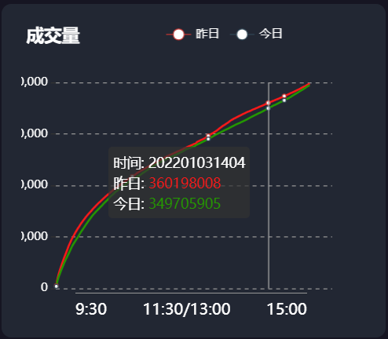

### 1.2 相关表分析

stock_market_index_info表结构相关字段：

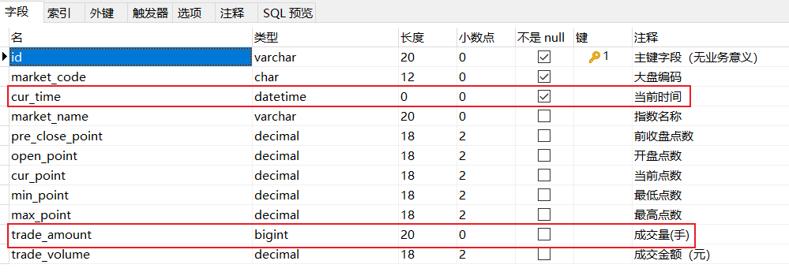

### 1.3 成交量对比功能接口分析

功能描述：统计A股大盘T日和T-1日成交量对比功能（成交量为沪深两市成交量之和）	

服务路径：/api/quot/stock/tradeAmt
服务方法：GET
前端请求频率：每分钟
请求参数：无

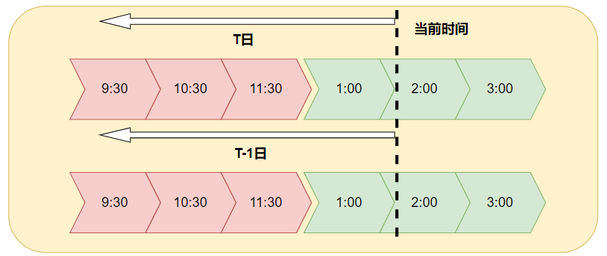	

返回数据格式：

~~~json
{
    "code": 1,
    "data": {
        "amtList": [{"count": 3926392,"time": "202112310930"},{"count": 3926392,"time": "202112310931"}，...],//T日每分钟成交量信息
        "yesAmtList":[{"count": 3926392,"time": "202112310930"},...]//T-1日每分钟成交量信息 
	}
}
~~~

> 注意事项：如果当前日期不在股票交易日，则按照前一个有效股票交易日作为T日查询
>
> R<Map<String,List<Map>>>

## 2、成交量对比功能SQL分析

~~~sql
-- 思路：通过逻辑获取T日开盘时间和当前时间日期范围，ge: 2022-01-03 09:30:00 到 2022-01-03 14:40:00
-- 那么T-1日日期范围则为：2022-01-02 09:30:00 到 2022-01-02 14:40:00
-- 我们可分别统计T日和T-1日国内A股大盘交易量，然后再讲数据组装即可
-- 1.统计T日交易量数据信息（T-1日SQL结构一致）
select
	date_format(smi.cur_time,'%Y%m%d%H%i') as time,
	sum(smi.trade_amount) as count
from
	stock_market_index_info as smi
where
	smi.cur_time between '2022-01-03 09:30:00' and '2022-01-03 14:40:00'
and
	smi.market_code in ('sh000001','sz399001')
group by time
order by smi.cur_time asc;
-- SQL语句添加order by 保证查询的数据是按照日期排序
~~~

## 3、成交量对比功能实现

### 3.1 定义web服务接口方法

~~~java
    /**
     * 功能描述：统计国内A股大盘T日和T-1日成交量对比功能（成交量为沪市和深市成交量之和）
     * @return
     */
    @GetMapping("/stock/tradeAmt")
    public R<Map> stockTradeVol4InnerMarket(){
        return stockService.stockTradeVol4InnerMarket();
    }
~~~

### 3.2 定义服务接口方法与实现

服务接口方法：

~~~java
    /**
     * 功能描述：统计国内A股大盘T日和T-1日成交量对比功能（成交量为沪市和深市成交量之和）
     * @return
     */
    R<Map> stockTradeVol4InnerMarket();
~~~

服务接口方法实现：

~~~java
    /**
     * 功能描述：统计国内A股大盘T日和T-1日成交量对比功能（成交量为沪市和深市成交量之和）
     *   map结构示例：
     *      {
     *         "volList": [{"count": 3926392,"time": "202112310930"},......],
     *       "yesVolList":[{"count": 3926392,"time": "202112310930"},......]
     *      }
     * @return
     */
    @Override
    public R<Map> stockTradeVol4InnerMarket() {
        //1.获取T日和T-1日的开始时间和结束时间
        //1.1 获取最近股票有效交易时间点--T日时间范围
        DateTime lastDateTime = DateTimeUtil.getLastDate4Stock(DateTime.now());
        DateTime openDateTime = DateTimeUtil.getOpenDate(lastDateTime);
        //转化成java中Date,这样jdbc默认识别
        Date startTime4T = openDateTime.toDate();
        Date endTime4T=lastDateTime.toDate();
        //TODO  mock数据
        startTime4T=DateTime.parse("2022-01-03 09:30:00", DateTimeFormat.forPattern("yyyy-MM-dd HH:mm:ss")).toDate();
        endTime4T=DateTime.parse("2022-01-03 14:40:00", DateTimeFormat.forPattern("yyyy-MM-dd HH:mm:ss")).toDate();

        //1.2 获取T-1日的区间范围
        //获取lastDateTime的上一个股票有效交易日
        DateTime preLastDateTime = DateTimeUtil.getPreviousTradingDay(lastDateTime);
        DateTime preOpenDateTime = DateTimeUtil.getOpenDate(preLastDateTime);
        //转化成java中Date,这样jdbc默认识别
        Date startTime4PreT = preOpenDateTime.toDate();
        Date endTime4PreT=preLastDateTime.toDate();
        //TODO  mock数据
        startTime4PreT=DateTime.parse("2022-01-02 09:30:00", DateTimeFormat.forPattern("yyyy-MM-dd HH:mm:ss")).toDate();
        endTime4PreT=DateTime.parse("2022-01-02 14:40:00", DateTimeFormat.forPattern("yyyy-MM-dd HH:mm:ss")).toDate();

        //2.获取上证和深证的配置的大盘id
        //2.1 获取大盘的id集合
        List<String> markedIds = stockInfoConfig.getInner();
        //3.分别查询T日和T-1日的交易量数据，得到两个集合
        //3.1 查询T日大盘交易统计数据
        List<Map> data4T=stockMarketIndexInfoMapper.getStockTradeVol(markedIds,startTime4T,endTime4T);
        if (CollectionUtils.isEmpty(data4T)) {
            data4T=new ArrayList<>();
        }
        //3.2 查询T-1日大盘交易统计数据
        List<Map> data4PreT=stockMarketIndexInfoMapper.getStockTradeVol(markedIds,startTime4PreT,endTime4PreT);
        if (CollectionUtils.isEmpty(data4PreT)) {
            data4PreT=new ArrayList<>();
        }
        //4.组装响应数据
        HashMap<String, List> info = new HashMap<>();
        info.put("amtList",data4T);
        info.put("yesAmtList",data4PreT);
        //5.返回数据
        return R.ok(info);
    }
~~~

> 注意：当前无法获取实时的数据，选择已存在的合适的时间范围查询即可；

### 3.3 定义mapper接口和xml

定义mapper接口方法：

~~~java
    /**
     * 根据时间范围和指定的大盘id统计每分钟的交易量
     * @param markedIds 大盘id集合
     * @param startTime 交易开始时间
     * @param endTime 结束时间
     * @return
     */
    List<Map> getStockTradeVol(@Param("markedIds") List<String> markedIds,
                               @Param("startTime") Date startTime,
                               @Param("endTime") Date endTime);
~~~

XML方法绑定：

~~~sql
    <select id="getStockTradeVol" resultType="map">
        select
            date_format(smi.cur_time,'%Y%m%d%H%i') as time,
            sum(smi.trade_amount)  as count
        from stock_market_index_info as smi
        where smi.market_code in
        <foreach collection="markedIds" item="marketId" open="("  separator="," close=")">
            #{marketId}
        </foreach>
        and smi.cur_time between #{startTime} and #{endTime}
        group by smi.cur_time
        order by time asc;
    </select>
~~~

### 3.4 web接口测试

- postman:http://localhost:8091/api/quot/stock/tradeAmt

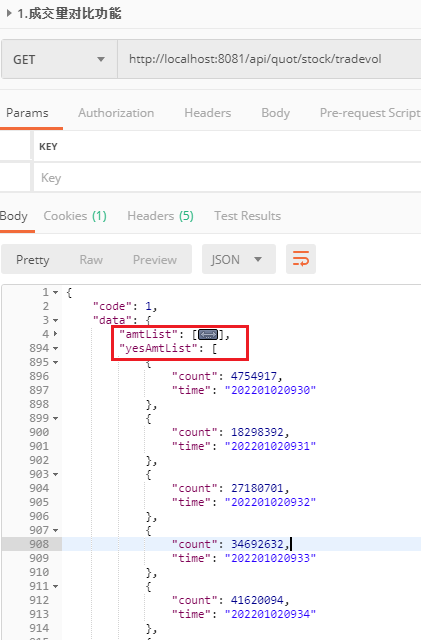

- 页面效果如下

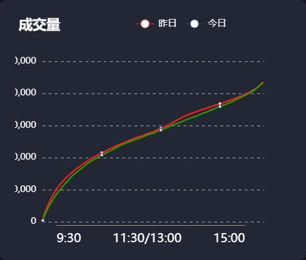

# 第二章 个股分时涨跌幅度统计功能

## 1、个股分时涨跌幅度统计功能分析

### 1.1 个股涨跌幅度功能原型

功能说明：统计当前时间下（精确到分钟），A股在各个涨跌区间股票的数量；

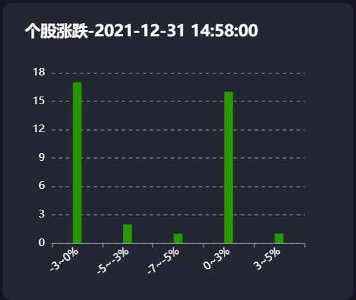

>  股票涨跌幅区间定义: "<-7%" 、 "-7~-5%"、 "-5~-3%" 、 "-3~0%" 、"0~3%" 、 "3~5%" 、 "5~7%" 、 ">7%"

### 1.2 个股分时涨跌幅度统计功能接口说明

功能描述：统计当前时间下（精确到分钟），A股在各个涨跌区间股票的数量；
服务路径：/api/quot/stock/updown
服务方法：GET
前端请求频率：每分钟
请求参数：无

> 注意事项：如果当前不在股票有效时间内，则以最近最新的一个有效股票交易日作为查询时间点展示；

响应数据格式：

~~~json
{
    "code": 1,
    "data": {
        "time": "2021-12-31 14:58:00",
        "infos": [
            {
                "count": 17,
                "title": "-3~0%"
            },
            {
                "count": 2,
                "title": "-5~-3%"
            },
			//省略......
        ]
    }
}
~~~

### 1.3 个股涨跌幅度区间统计功能SQL分析

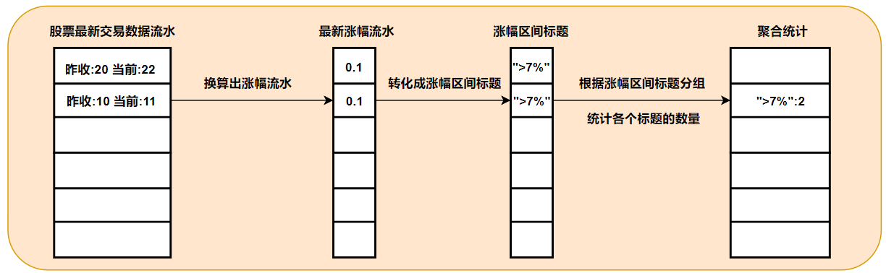

## 2、涨跌幅度统计SQL实现

~~~sql
-- 整体思路：先统计当前时间点下每支股票的涨幅和时间集合，然后再将结果子查询将涨幅值转换成涨幅区间名称，
-- 最后再根据涨幅区间分组统计每一组对应的数量即可
-- 步骤1：统计当前时间下，每只股票的涨幅值
select
	( sri.cur_price - sri.pre_close_price )/ sri.pre_close_price as rate 
from
	stock_rt_info as sri 
where
	sri.cur_time = '2022-01-06 09:55:00'
-- 步骤2：将步骤1的查询结果中数据转换为区间范围集合
select
		CASE
			WHEN tmp.rate > 0.07 THEN  '>7%'
			WHEN tmp.rate > 0.05  AND tmp.rate <= 0.07 THEN '5~7%'
			WHEN tmp.rate > 0.03  AND tmp.rate <= 0.05 THEN '3~5%'
			WHEN tmp.rate > 0     AND tmp.rate <= 0.03 THEN '0~3%'
			WHEN tmp.rate > -0.03 AND tmp.rate <= 0 THEN '-3~0%'
			WHEN tmp.rate > -0.05 AND tmp.rate <= -0.03 THEN '-5~-3%'
			WHEN tmp.rate > -0.07 AND tmp.rate <= -0.05 THEN '-7~-5%'
			ELSE '<-7%'
		END 'title'
from
	(
		select
			(sri.cur_price-sri.pre_close_price)/sri.pre_close_price as rate
		from stock_rt_info as sri
		where sri.cur_time='2022-01-06 09:55:00'
	)as tmp
-- 根据区间分组，统计各个区间数据量
select
	tmp2.title,
	count(*) as count
from
(select
	CASE
		WHEN tmp.rate > 0.07 THEN  '>7%'
		WHEN tmp.rate > 0.05 AND tmp.rate <= 0.07 THEN '5~7%'
		WHEN tmp.rate > 0.03 AND tmp.rate <= 0.05 THEN '3~5%'
		WHEN tmp.rate > 0 AND tmp.rate <= 0.03 THEN '0~3%'
		WHEN tmp.rate > -0.03 AND tmp.rate <= 0 THEN '-3~0%'
		WHEN tmp.rate > -0.05 AND tmp.rate <= -0.03 THEN '-5~-3%'
		WHEN tmp.rate > -0.07 AND tmp.rate <= -0.05 THEN '-7~-5%'
		ELSE '<-7%'
	END 'title'
from
(select
(sri.cur_price-sri.pre_close_price)/sri.pre_close_price as rate
from stock_rt_info as sri
where sri.cur_time='2022-01-06 09:55:00')
as tmp)
as tmp2 group by tmp2.title;
~~~

## 3、个股涨跌幅度区间统计功能实现

### 3.1 定义web访问接口

~~~java
    /**
     * 查询当前时间下股票的涨跌幅度区间统计功能
     * 如果当前日期不在有效时间内，则以最近的一个股票交易时间作为查询点
     * @return
     */
    @GetMapping("/stock/updown")
    public R<Map> getStockUpDown(){
        return stockService.stockUpDownScopeCount();
    }
~~~

### 3.2 定义服务接口和实现

定义服务接口：

~~~java
    /**
     * 查询当前时间下股票的涨跌幅度区间统计功能
     * 如果当前日期不在有效时间内，则以最近的一个股票交易时间作为查询点
     * @return
     */
     R<Map> stockUpDownScopeCount();
~~~

定义实现：

~~~java
    /**
     * 功能描述：统计在当前时间下（精确到分钟），股票在各个涨跌区间的数量
     *  如果当前不在股票有效时间内，则以最近的一个有效股票交易时间作为查询时间点；
     * @return
     *  响应数据格式：
     *  {
     *     "code": 1,
     *     "data": {
     *         "time": "2021-12-31 14:58:00",
     *         "infos": [
     *             {
     *                 "count": 17,
     *                 "title": "-3~0%"
     *             },
     *             //...
     *             ]
     *     }
     */
    @Override
    public R<Map> stockUpDownScopeCount() {
        //1.获取股票最新一次交易的时间点
        Date curDate = DateTimeUtil.getLastDate4Stock(DateTime.now()).toDate();
        //mock data
        curDate=DateTime.parse("2022-01-06 09:55:00", DateTimeFormat.forPattern("yyyy-MM-dd HH:mm:ss")).toDate();
        //2.查询股票信息
        List<Map> maps=stockRtInfoMapper.getStockUpDownSectionByTime(curDate);
        //3.组装数据
        HashMap<String, Object> mapInfo = new HashMap<>();
        //获取指定日期格式的字符串
        String curDateStr = new DateTime(curDate).toString(DateTimeFormat.forPattern("yyyy-MM-dd HH:mm:ss"));
        mapInfo.put("time",curDateStr);
        mapInfo.put("infos",maps);
        //4.返回数据
        return R.ok(mapInfo);
    }
~~~

### 3.3 定义mapper接口方法与xml

mapper接口方法定义

~~~java
    /**
     * 统计指定时间点下，各个涨跌区间内股票的个数
     * @param avlDate
     * @return
     */
    List<Map> stockUpDownScopeCount(@Param("avlDate") Date avlDate);
~~~

xml定义：

~~~xml
<select id="stockUpDownScopeCount" resultType="java.util.Map">
        select
            tmp2.title,
            count(*) as count
        from
            (select
                CASE
                WHEN tmp.rate > 0.07 THEN  '>7%'
                WHEN tmp.rate > 0.05 AND tmp.rate &lt;= 0.07 THEN '5~7%'
                WHEN tmp.rate > 0.03 AND tmp.rate &lt;= 0.05 THEN '3~5%'
                WHEN tmp.rate > 0 AND tmp.rate &lt;= 0.03 THEN '0~3%'
                WHEN tmp.rate > -0.03 AND tmp.rate &lt;= 0 THEN '-3~0%'
                WHEN tmp.rate > -0.05 AND tmp.rate &lt;= -0.03 THEN '-5~-3%'
                WHEN tmp.rate > -0.07 AND tmp.rate &lt;= -0.05 THEN '-7~-5%'
                ELSE '&lt;-7%'
                END 'title'
            from
              (select
              (sri.cur_price-sri.pre_close_price)/sri.pre_close_price as rate
              from stock_rt_info as sri
              where sri.cur_time=#{avlDate})
              as tmp)
            as tmp2 
      group by tmp2.title
</select>
~~~

**大量的转义符书写非常麻烦？**

如果在XML中SQL语句遇到大量特殊字符需要转义，比如：< 等，建议使用**<![CDATA[ sql 语句 ]]>**标记，这样特殊字符就不会被解析器解析，所以最终xml方式：

~~~xml
<select id="stockUpDownScopeCount" resultType="java.util.Map">
    <![CDATA[
        select
            tmp2.title,
            count(*) as count
        from
            (select
            CASE
            WHEN tmp.rate > 0.07 THEN  '>7%'
            WHEN tmp.rate > 0.05 AND tmp.rate <= 0.07 THEN '5~7%'
            WHEN tmp.rate > 0.03 AND tmp.rate <= 0.05 THEN '3~5%'
            WHEN tmp.rate > 0 AND tmp.rate <= 0.03 THEN '0~3%'
            WHEN tmp.rate > -0.03 AND tmp.rate <= 0 THEN '-3~0%'
            WHEN tmp.rate > -0.05 AND tmp.rate <= -0.03 THEN '-5~-3%'
            WHEN tmp.rate > -0.07 AND tmp.rate <= -0.05 THEN '-7~-5%'
            ELSE '<-7%'
            END 'title'
            from
            (select
            (sri.cur_price-sri.pre_close_price)/sri.pre_close_price as rate
            from stock_rt_info as sri
            where sri.cur_time=#{avlDate})
            as tmp)
            as tmp2 group by tmp2.title
    ]]>
</select>
~~~

### 3.4 功能测试

- postman测试:http://localhost:8091/api/quot/stock/updown

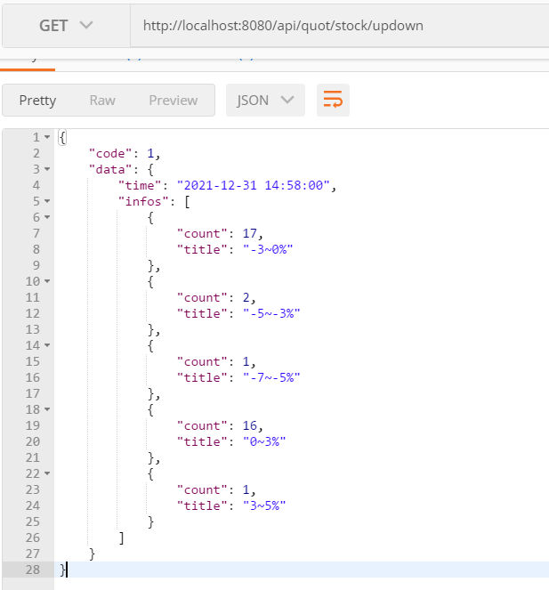

- 页面展示效果：

## 4、股涨幅幅度排序优化

### 4.1 分析问题

- 前端查询的数据是无序展示的，涨幅区间应该从小到大顺序展示;
- 当前涨幅区间下如果没有对应的股票，则区间标题不会被展示，我们需要对无数据的区间默认为0给前端显示；
- 最终效果

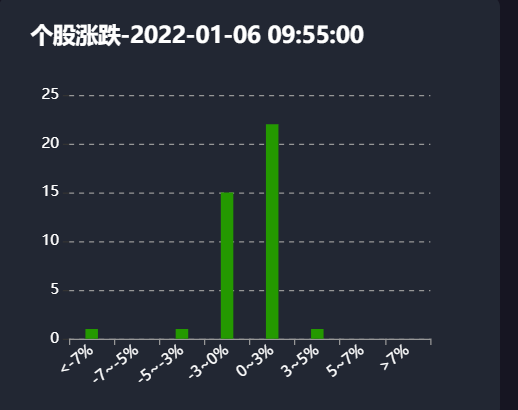

### 4.2 实现思路分析

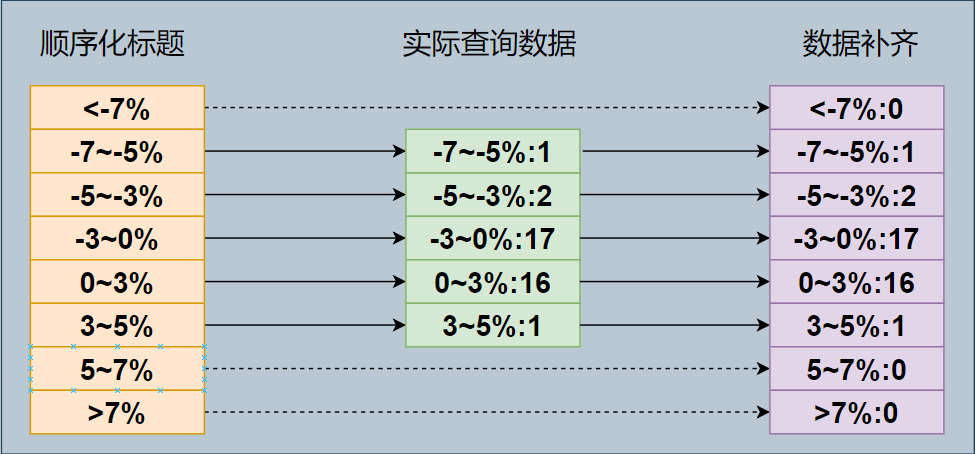

> 说明：
>
> 1.先顺序定义一个包含区间范围标题的有序集合；
>
> 2.遍历有序集合，然后从实际查询结果中找出各自的区间值，如果没有则以0补齐；
>
> 3.遍历过程形成新的集合，包可以顺序性保证数据有序且完整；

### 4.3 顺序定义股票涨幅范围集合

在application-stock.yml中顺序添加股票涨幅区间信息：

~~~yaml
# 配置股票相关的参数
stock:
  upDownRange:
    - "<-7%"
    - "-7~-5%"
    - "-5~-3%"
    - "-3~0%"
    - "0~3%"
    - "3~5%"
    - "5~7%"
    - ">7%"
~~~

> 说明：yml中顺序定义区间范围值，这样加载到内存时也可保证其顺序性；

### 4.4 完善实体类

在stock_common工程下为StockInfoConfig类补齐配置：

~~~java
@Data
@ConfigurationProperties(prefix = "stock")
public class StockInfoConfig {
    //a股大盘ID集合
    private List<String> inner;
    //外盘ID集合
    private List<String> outer;
    //股票区间
    private List<String> upDownRange;
}
~~~

### 4.5 完善过滤实现

~~~java
    /**
     * 查询当前时间下股票的涨跌幅度区间统计功能
     * 如果当前日期不在有效时间内，则以最近的一个股票交易时间作为查询点
     * @return
     */
    @Override
    public R<Map> stockUpDownScopeCount() {
        //1.获取股票最新一次交易的时间点
        Date curDate = DateTimeUtil.getLastDate4Stock(DateTime.now()).toDate();
        //mock data
        curDate=DateTime.parse("2022-01-06 09:55:00", DateTimeFormat.forPattern("yyyy-MM-dd HH:mm:ss")).toDate();
        //2.查询股票信息
        List<Map> maps=stockRtInfoMapper.getStockUpDownSectionByTime(curDate);
        //2.1 获取有序的标题集合
        List<String> orderSections = stockInfoConfig.getUpDownRange();
        //思路：利用List集合的属性，然后顺序编译，找出每个标题对应的map，然后维护到一个新的List集合下即可
//        List<Map> orderMaps =new ArrayList<>();
//        for (String title : orderSections) {
//            Map map=null;
//            for (Map m : maps) {
//                if (m.containsValue(title)) {
//                    map=m;
//                    break;
//                }
//            }
//            if (map==null) {
//                map=new HashMap();
//                map.put("count",0);
//                map.put("title",title);
//            }
//            orderMaps.add(map);
//        }
        //方式2：使用lambda表达式指定
        List<Map> orderMaps  =  orderSections.stream().map(title->{
            Map mp=null;
            Optional<Map> op = maps.stream().filter(m -> m.containsValue(title)).findFirst();
            //判断是否存在符合过滤条件的元素
            if (op.isPresent()) {
                mp=op.get();
            }else{
                mp=new HashMap();
                mp.put("count",0);
                mp.put("title",title);
            }
            return mp;
        }).collect(Collectors.toList());
        //3.组装数据
        HashMap<String, Object> mapInfo = new HashMap<>();
        //获取指定日期格式的字符串
        String curDateStr = new DateTime(curDate).toString(DateTimeFormat.forPattern("yyyy-MM-dd HH:mm:ss"));
        mapInfo.put("time",curDateStr);
        mapInfo.put("infos",orderMaps);
        //4.返回数据
        return R.ok(mapInfo);
    }
~~~

# 第三章 股票K线图功能

## 1、个股分时图行情功能

### 1.1 个股分时K线行情功能分析

#### 1.1.1 个股分时线行情原型效果

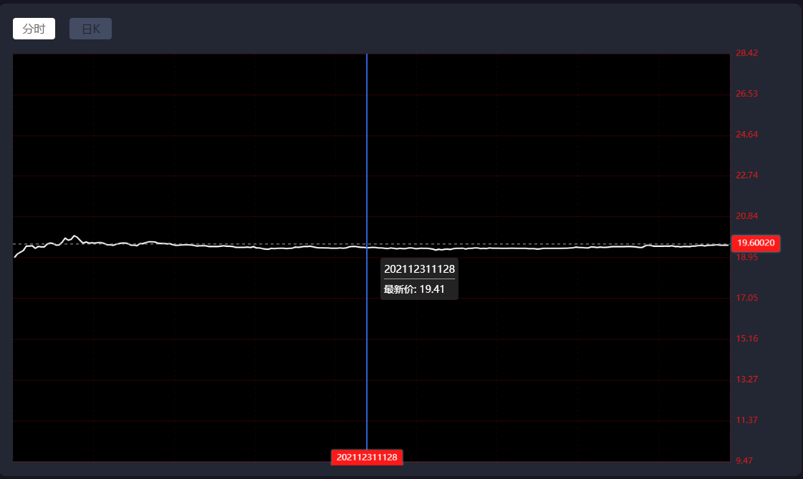

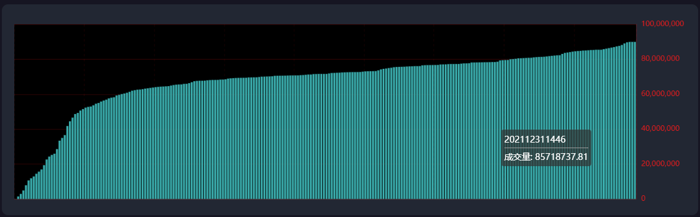

#### 1.1.2 个股分时K线行情接口说明

功能描述：查询个股的分时行情数据，也就是统计指定股票T日每分钟的交易数据；
服务路径：/api/quot/stock/screen/time-sharing
服务方法：GET
前端请求频率：每分钟请求

请求参数：code

| 参数说明 | 参数名称 | 是否必须 | 数据类型   | 备注   |
| :--- | ---- | ---- | ------ | ---- |
| 股票编码 | code | true | string | 股票编码 |

返回数据格式：

~~~json
{
    "code": 1,
    "data": [
        {
            "date": "2021-12-31 09:25",//当前时间，精确到分钟
            "tradeAmt": 63263,//当前交易量
            "code": "000021",//股票编码
            "lowPrice": 15.85,//最低价格
            "preClosePrice": 15.85,//前收盘价格
            "name": "深科技",//股票名称
            "highPrice": 15.85,//最高价格
            "openPrice": 15.85,//开盘价
            "tradeVol": 1002718.55,//交易金额
            "tradePrice": 15.85//当前价格（最新价格）
        },
		//......
          ]
}
~~~

#### 1.1.3 查询封装

在stock_common工程下添加实体类：

~~~java
/**
 * @author by itheima
 * @Date 2022/2/28
 * @Description 个股分时数据封装
 */
@Data
@NoArgsConstructor
@AllArgsConstructor
@Builder
public class Stock4MinuteDomain {
    /**
     * 日期，eg:202201280809
     */
   @JsonFormat(pattern = "yyyy-MM-dd HH:mm",timezone = "Asia/Shanghai")
   private Date date;
    /**
     * 交易量
     */
   private Long tradeAmt;
    /**
     * 股票编码
     */
   private String code;
    /**
     * 最低价
     */
   private BigDecimal lowPrice;
    /**
     * 前收盘价
     */
   private BigDecimal preClosePrice;
    /**
     * 股票名称
     */
   private String name;
    /**
     * 最高价
     */
   private BigDecimal highPrice;
    /**
     * 开盘价
     */
   private BigDecimal openPrice;

    /**
     * 当前交易总金额
     */
   private BigDecimal tradeVol;
    /**
     * 当前价格
     */
   private BigDecimal tradePrice;
}
~~~

### 1.2 个股分时K线行情功能SQL分析

~~~sql
-- 分析：查询个股分时K线图，说白了就是查询指定股票在当前交易日产生的流水数据报表展示
-- 综合条件：1.股票ID 2.股票开盘时间 3.当前时间点
select
	sri.cur_time     as date,
	sri.trade_amount as tradeAmt,
	sri.stock_code as code,
	sri.min_price lowPrice,
	sri.pre_close_price as preClosePrice,
	sri.stock_name as name,
	sri.max_price as highPrice,
	sri.open_price as openPrice,
	sri.trade_volume as tradeVol,
	sri.cur_price as tradePrice
from stock_rt_info as sri
where	sri.stock_code='600021'
and sri.cur_time between '2021-12-30 09:30:00' and '2021-12-30 14:30:00';
~~~

### 1.3 个股分时K线行情功能实现

#### 1.3.1 定义web服务接口

~~~java
    /**
     * 功能描述：查询单个个股的分时行情数据，也就是统计指定股票T日每分钟的交易数据；
     *         如果当前日期不在有效时间内，则以最近的一个股票交易时间作为查询时间点
     * @param code 股票编码
     * @return
     */
    @GetMapping("/stock/screen/time-sharing")
    public R<List<Stock4MinuteDomain>> stockScreenTimeSharing(String code){
        return stockService.stockScreenTimeSharing(code);
    }
~~~

#### 1.3.2 定义服务接口方法与实现

服务接口方法：

~~~java
    /**
     * 功能描述：查询单个个股的分时行情数据，也就是统计指定股票T日每分钟的交易数据；
     *         如果当前日期不在有效时间内，则以最近的一个股票交易时间作为查询时间点
     * @param code 股票编码
     * @return
     */
    R<List<Stock4MinuteDomain>> stockScreenTimeSharing(String code);
~~~

接口实现：

~~~java
    /**
     * 功能描述：查询单个个股的分时行情数据，也就是统计指定股票T日每分钟的交易数据；
     *         如果当前日期不在有效时间内，则以最近的一个股票交易时间作为查询时间点
     * @param code 股票编码
     * @return
     */
    @Override
    public R<List<Stock4MinuteDomain>> stockScreenTimeSharing(String code) {
        //1.获取最近最新的交易时间点和对应的开盘日期
        //1.1 获取最近有效时间点
        DateTime lastDate4Stock = DateTimeUtil.getLastDate4Stock(DateTime.now());
        Date endTime = lastDate4Stock.toDate();
        //TODO mockdata
        endTime=DateTime.parse("2021-12-30 14:47:00", DateTimeFormat.forPattern("yyyy-MM-dd HH:mm:ss")).toDate();

        //1.2 获取最近有效时间点对应的开盘日期
        DateTime openDateTime = DateTimeUtil.getOpenDate(lastDate4Stock);
        Date startTime = openDateTime.toDate();
        //TODO MOCK DATA
        startTime=DateTime.parse("2021-12-30 09:30:00", DateTimeFormat.forPattern("yyyy-MM-dd HH:mm:ss")).toDate();
        //2.根据股票code和日期范围查询
        List<Stock4MinuteDomain> list=stockRtInfoMapper.getStockInfoByCodeAndDate(stockCode,startTime,endTime);
        //判断非空处理
        if (CollectionUtils.isEmpty(list)) {
            list=new ArrayList<>();
        }
        //3.返回响应数据
        return R.ok(list);
    }
~~~

#### 1.3.3 定义mapper接口和xml

mapper接口方法：

~~~java
    /**
     * 根据时间范围查询指定股票的交易流水
     * @param stockCode 股票code
     * @param startTime 起始时间
     * @param endTime 终止时间
     * @return
     */
    List<Stock4MinuteDomain> getStockInfoByCodeAndDate(@Param("stockCode") String stockCode,
                                                       @Param("startTime") Date startTime,
                                                       @Param("endTime") Date endTime);
~~~

xml sql绑定：

~~~xml
    <select id="getStockInfoByCodeAndDate" resultType="com.itheima.stock.pojo.domain.Stock4MinuteDomain">
        select
            sri.cur_time    as date,
            sri.trade_amount as tradeAmt,
            sri.stock_code as code,
            sri.min_price as lowPrice,
            sri.pre_close_price as preClosePrice,
            sri.stock_name as name,
            sri.max_price as highPrice,
            sri.open_price as openPrice,
            sri.trade_volume as tradeVol,
            sri.cur_price as tradePrice
        from stock_rt_info as sri
        where sri.stock_code=#{stockCode}
          and sri.cur_time between #{startTime} and #{endTime}
    </select>
~~~

#### 1.3.4 web接口测试

- postman测试：http://localhost:8091/api/quot/stock/screen/time-sharing?code=600019

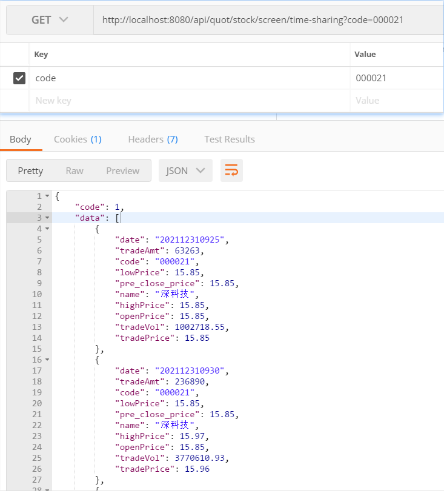

- 页面效果

## 2、个股日K线详情功能

### 2.1 个股日K线详情功能分析

#### 2.1.1 个股日K线详情功能原型

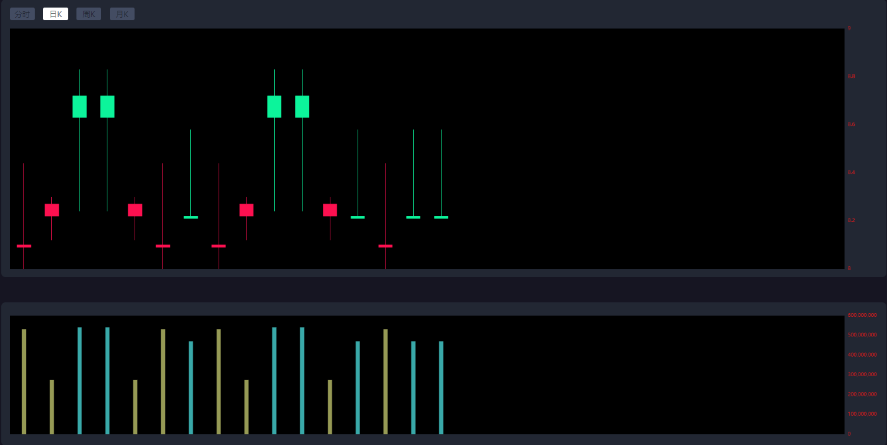

> 说明：
>
> 1.日K线就是将股票交易流水按天分组，然后统计出每天的交易数据，内容包含：日期、股票编码、名称、最高价、最低价、开盘价、收盘价、前收盘价、交易量；
>
> 2.需要注意的是这里的收盘价就是指每天最大交易时间点下对应的价格；

#### 2.1.2 个股日K线详情功能接口说明

功能描述：查询指定股票每天产生的数据，组装成日K线数据；

​		    如果当大盘尚未收盘，则以最新的交易价格作为当天的收盘价格；

服务路径：/api/quot/stock/screen/dkline
服务方法：GET
前端请求频率：每分钟

请求参数：code

| 参数说明 | 参数名称 | 是否必须 | 数据类型   | 备注   |
| :--- | ---- | ---- | ------ | ---- |
| 股票编码 | code | true | string | 股票编码 |

响应数据结构：

~~~json
{
    "code": 1,
    "data": [
        {
            "date": "2021-12-20 10:20",//日期
            "tradeAmt": 28284252,//交易量(指收盘时的交易量，如果当天未收盘，则显示最新数据)
            "code": "000021",//股票编码
            "lowPrice": 16,//最低价格（指收盘时记录的最低价，如果当天未收盘，则显示最新数据）
            "name": "深科技",//名称
            "highPrice": 16.83,//最高价（指收盘时记录的最高价，如果当天未收盘，则显示最新数据）
            "openPrice": 16.8,//开盘价
            "tradeVol": 459088567.58,//交易金额（指收盘时记录交易量，如果当天未收盘，则显示最新数据）
            "closePrice": 16.81//当前收盘价（指收盘时的价格，如果当天未收盘，则显示最新cur_price）
            "preClosePrice": 16.81//前收盘价
        },
        //......
    ]
}
~~~

#### 2.1.3 封装查询数据

在stock_common工程添加实体类：

~~~java

/**
 * @author by itheima
 * @Date 2022/2/28
 * @Description 个股日K数据封装
 */
@Data
@NoArgsConstructor
@AllArgsConstructor
@Builder
public class Stock4EvrDayDomain {
    /**
     * 日期，eg:202201280809
     */
   @JsonFormat(pattern = "yyyy-MM-dd HH:mm",timezone = "Asia/Shanghai")
   private Date date;
    /**
     * 交易量
     */
   private Long tradeAmt;
    /**
     * 股票编码
     */
   private String code;
    /**
     * 最低价
     */
   private BigDecimal lowPrice;
    /**
     * 股票名称
     */
    private String name;
    /**
     * 最高价
     */
    private BigDecimal highPrice;
    /**
     * 开盘价
     */
    private BigDecimal openPrice;
    /**
     * 当前交易总金额
     */
    private BigDecimal tradeVol;
    /**
     * 当前收盘价格指收盘时的价格，如果当天未收盘，则显示最新cur_price）
     */
    private BigDecimal closePrice;
    /**
     * 前收盘价
     */
   private BigDecimal preClosePrice;
}
~~~

### 2.2 个股日K线详情功能SQL分析

#### 2.2.1 核心思路

- SQL查询要划定一个默认的日期范围，这样可避免大数据量下全表查询而导致慢查询的问题；
- 在指定的日期范围内以天分组统计出每天日期的最大值（收盘时间);
- 根据获取的最大日期组，使用in进行条件查询，进而获取日K线相关的数据；

总之，股票每天最后一条数据就包含了当天最高价、最低价等相关信息了。

#### 2.2.2 SQL实现

~~~sql
-- 说明：因为在股票流水中，开盘价、最高价、最低价、当前价等信息在每条记录中都会记录，所以我们更加关注的是每天的收盘价格，业务要求如果当前没有收盘，则以最新价格作为收盘价，所以该业务就可以转化成查询每天最大交易时间对应的信息；
-- 步骤1：查询指定股票在指定日期范围内每天的最大时间，说白了就是以天分组，求每天最大时间
select
	max( sri.cur_time ) as closeDate 
from
	stock_rt_info as sri 
where
	sri.stock_code ='600021' 
	and sri.cur_time between '2022-01-01 09:30:00' and '2022-01-06 14:25:00' 
group by
	date_format( sri.cur_time, '%Y%m%d' )
-- 步骤2：以步骤1查询结果作为条件，同统计指定时间点下，股票的数据信息
select
	sri2.cur_time as date,
	sri2.trade_amount as tradeAmt,
	sri2.stock_code as code,
	sri2.min_price as lowPrice,
	sri2.stock_name as name,
	sri2.max_price as highPrice,
	sri2.open_price as openPrice,
	sri2.trade_volume as tradeVol,
	sri2.cur_price as closePrice,
	sri2.pre_close_price as preClosePrice
from
	stock_rt_info as sri2
where sri2.stock_code='600021'  and sri2.cur_time in (
  select
	max( sri.cur_time ) as closeDate 
  from
	stock_rt_info as sri 
  where
	sri.stock_code ='600021' 
	and sri.cur_time between '2022-01-01 09:30:00' and '2022-01-06 14:25:00' 
  group by
	date_format( sri.cur_time, '%Y%m%d' )
  )	
  order by sri2.cur_time;
~~~

### 2.3 个股日K线详情功能实现

#### 2.3.1 定义web接口方法

~~~java

    /**
     * 单个个股日K 数据查询 ，可以根据时间区间查询数日的K线数据
     * @param stockCode 股票编码
     */
    @RequestMapping("/stock/screen/dkline")
    public R<List<Map>> getDayKLinData(@RequestParam("code") String stockCode){
        return stockService.stockCreenDkLine(stockCode);
    }
~~~

#### 2.3.2 定义服务方法和实现

服务接口方法：

~~~java
    /**
     * 单个个股日K 数据查询 ，可以根据时间区间查询数日的K线数据
     * @param stockCode 股票编码
     */
    R<List<Stock4EvrDayDomain>> stockCreenDkLine(String code);
~~~

服务接口实现方法：

~~~java
    /**
     * 功能描述：单个个股日K数据查询 ，可以根据时间区间查询数日的K线数据
     * 		默认查询历史20天的数据；
     * @param code 股票编码
     * @return
     */
    @Override
    public R<List<Stock4EvrDayDomain>> stockCreenDkLine(String code) {
        //1.获取查询的日期范围
        //1.1 获取截止时间
        DateTime endDateTime = DateTimeUtil.getLastDate4Stock(DateTime.now());
        Date endTime = endDateTime.toDate();
        //TODO MOCKDATA
        endTime=DateTime.parse("2022-01-07 15:00:00", DateTimeFormat.forPattern("yyyy-MM-dd HH:mm:ss")).toDate();
        //1.2 获取开始时间
        DateTime startDateTime = endDateTime.minusDays(10);
        Date startTime = startDateTime.toDate();
        //TODO MOCKDATA
        startTime=DateTime.parse("2022-01-01 09:30:00", DateTimeFormat.forPattern("yyyy-MM-dd HH:mm:ss")).toDate();
        //2.调用mapper接口获取查询的集合信息-方案1
        List<Stock4EvrDayDomain> data= stockRtInfoMapper.getStockInfo4EvrDay(code,startTime,endTime);
        //3.组装数据，响应
        return R.ok(data);
    }
~~~

#### 2.3.3 定义mapper接口方法与xml

在StockRtInfoMapper定义接口方法：

~~~java
    /**
     * 查询指定日期范围内指定股票每天的交易数据
     * @param stockCode 股票code
     * @param startTime 起始时间
     * @param endTime 终止时间
     * @return
     */
    List<Stock4EvrDayDomain> getStockInfo4EvrDay(@Param("stockCode") String stockCode,
                                                 @Param("startTime") Date startTime,
                                                 @Param("endTime") Date endTime);
~~~

在StockRtInfoMapper.xml定义sql：	

~~~xml
    <select id="getStockInfo4EvrDay" resultType="com.itheima.stock.pojo.domain.Stock4EvrDayDomain">
        select
             date_format(sri2.cur_time,'%Y%m%d') as date,
             sri2.trade_amount as tradeAmt,
             sri2.stock_code as code,
             sri2.min_price as lowPrice,
             sri2.stock_name as name,
             sri2.max_price as highPrice,
             sri2.open_price as openPrice,
             sri2.trade_volume as tradeVol,
             sri2.cur_price as closePrice,
             sri2.pre_close_price as preClosePrice
        from stock_rt_info as sri2
        where sri2.cur_time in (select
            max(sri.cur_time) as max_time
            from stock_rt_info as sri
            where sri.stock_code=#{stockCode}
          and sri.cur_time between  #{startTime}   and	#{endTime}
            group by date_format(sri.cur_time,'%Y%m%d'))
          and sri2.stock_code=#{stockCode}
        order by sri2.cur_time
    </select>
~~~

#### 2.3.4 web接口测试

- postman测试：http://localhost:8091/api/quot/stock/screen/dkline?code=600019

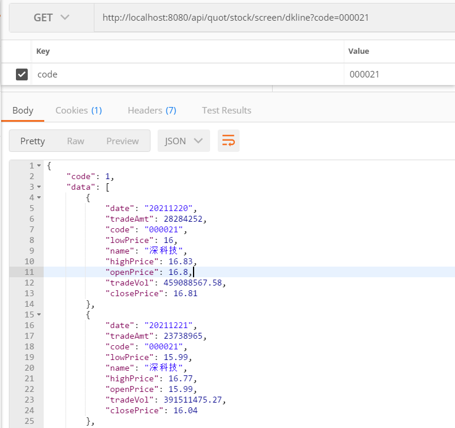

- 页面效果

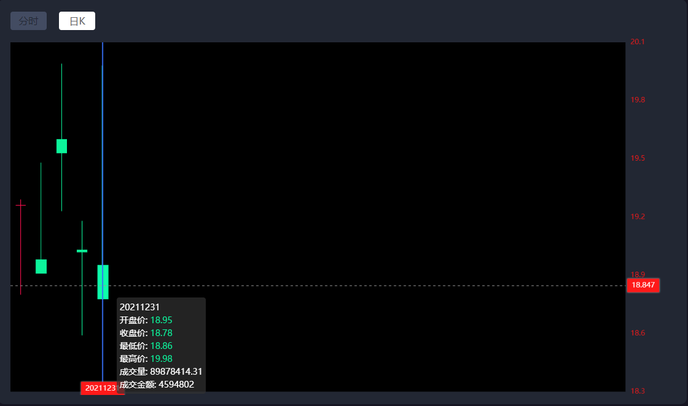

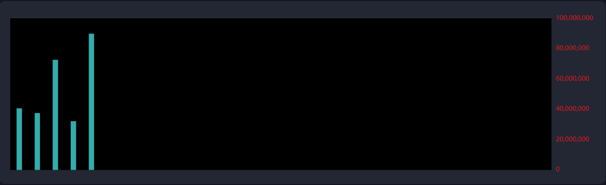

## 3、日K线功能拆分实现[作业]

### 3.1 拆分目标

​	练习复杂sql拆分的实现思路；

### 3.2 日K线功能拆分

- 第一步：查询指定股票在指定日期范围内的每天的最大时间；
- 第二步：将第一步的结果作为条件查询对应的数据；
  - 定义2个Mapper方法。落后逻辑层逐次调用方法，最终获取日K线的数据；

