# 股票数据采集

## 今日目标

1.掌握RestTemplate基本使用;
2.阅读并理解第三方股票接口API;
3.基于RestTemplate实现国内大盘数据采集功能;
  	 3.1 项目集成RestTemplate;
  	 3.2 理解基于正则解析响应数据原理;
 	 3.3 掌握常用lambda stream流操作;
4.基于RestTemplate实现国内板块和股票流水数据采集功能;
5.熟悉mybatis批量插入实现;

6.基于rabbitmq实现股票数据刷新；

# 第一章 股票数据采集环境准备

## 1、股票数据采集背景说明

​	当前项目中的股票数据都是历史数据，不是实时最新的数据，而要想获取股票最新的数据，就需要定时调用第三方接口拉取最新数据流水；

​	Spring框架已为我们封装了一套访问远程http接口的模板工具：RestTemplate，借助于该工具，我们可访问第三方股票接口，获取股票最新数据。
​	RestTemplate本质上就是一个非常轻量级http客户端，使用简单且容易上手；

​	股票数据采集核心流程如下：

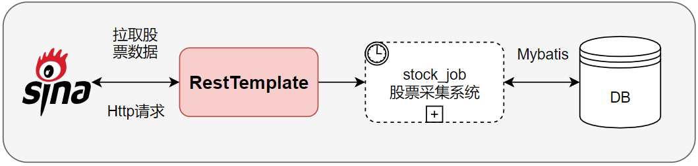

常见http客户端组件：

~~~json
RestTemplate:Spring提供，轻量易上手；
HttpClient:apache提供；
OkHttpClient
~~~

整体工程结构：

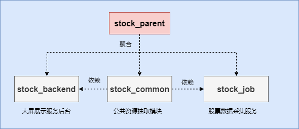

## 2、构建股票数据采集工程

### 2.1 工程搭建

在stock_parent工程下构建stock_job子工程，并在pom中引入依赖：

~~~xml
<?xml version="1.0" encoding="UTF-8"?>
<project xmlns="http://maven.apache.org/POM/4.0.0"
         xmlns:xsi="http://www.w3.org/2001/XMLSchema-instance"
         xsi:schemaLocation="http://maven.apache.org/POM/4.0.0 http://maven.apache.org/xsd/maven-4.0.0.xsd">
    <parent>
        <artifactId>stock_parent</artifactId>
        <groupId>com.itheima.stock</groupId>
        <version>1.0-SNAPSHOT</version>
    </parent>
    <modelVersion>4.0.0</modelVersion>
    <packaging>jar</packaging>
    <artifactId>stock_job</artifactId>
    <description>核心功能:拉去股票数据</description>
    <properties>
        <maven.compiler.source>8</maven.compiler.source>
        <maven.compiler.target>8</maven.compiler.target>
    </properties>

    <dependencies>
        <dependency>
            <groupId>com.itheima.stock</groupId>
            <artifactId>stock_common</artifactId>
            <version>1.0-SNAPSHOT</version>
        </dependency>

        <!-- 基本依赖 -->
        <dependency>
            <groupId>org.springframework.boot</groupId>
            <artifactId>spring-boot-starter-web</artifactId>
        </dependency>

        <dependency>
            <groupId>org.springframework.boot</groupId>
            <artifactId>spring-boot-starter-test</artifactId>
        </dependency>
    </dependencies>

    <build>
        <!--打包名称-->
        <finalName>${project.artifactId}</finalName>
        <plugins>
            <plugin>
                <groupId>org.springframework.boot</groupId>
                <artifactId>spring-boot-maven-plugin</artifactId>
            </plugin>
        </plugins>
    </build>
</project>
~~~

application.yml主配置文件与stock_backend工程一致：

~~~yaml
# 配置服务端口
server:
  port: 8092
spring:
  # 配置mysql数据源
  datasource:
    druid:
      username: root
      password: root
      url: jdbc:mysql://192.168.200.130:3306/stock_db?useUnicode=true&characterEncoding=UTF-8&allowMultiQueries=true&useSSL=false&serverTimezone=Asia/Shanghai
      driver-class-name: com.mysql.jdbc.Driver
      # 初始化时建立物理连接的个数。初始化发生在显示调用 init 方法，或者第一次 getConnection 时
      initialSize: 6
      # 最小连接池数量
      minIdle: 2
      # 最大连接池数量
      maxActive: 20
      # 获取连接时最大等待时间，单位毫秒。配置了 maxWait 之后，缺省启用公平锁，
      # 并发效率会有所下降，如果需要可以通过配置 useUnfairLock 属性为 true 使用非公平锁。
      maxWait: 60000
# 配置mybatis
mybatis:
  type-aliases-package: com.itheima.stock.pojo.* # 配置实体类扫描，取别名
  mapper-locations: classpath:mapper/*.xml # 配置扫描的xml的位置
  configuration:
    map-underscore-to-camel-case: true # 开启驼峰映射 table:user_name-->entity:userName

# pagehelper配置
pagehelper:
  helper-dialect: mysql #指定分页数据库类型（方言）
  reasonable: true #合理查询超过最大页，则查询最后一页
~~~

添加main启动类：

~~~java
package com.itheima.stock;
import org.mybatis.spring.annotation.MapperScan;
import org.springframework.boot.SpringApplication;
import org.springframework.boot.autoconfigure.SpringBootApplication;
@SpringBootApplication
@MapperScan("com.itheima.stock.mapper")
public class JobApp {
    public static void main(String[] args) {
        SpringApplication.run(JobApp.class, args);
    }
}
~~~

工程目录结构如下：

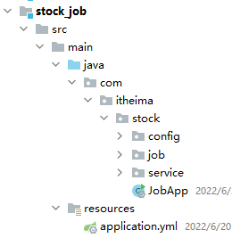

### 2.2 配置RestTemplate

在stock_job工程下配置RestTemplate bean对象：

~~~java
package com.itheima.stock.config;

import org.springframework.context.annotation.Bean;
import org.springframework.context.annotation.Configuration;
import org.springframework.web.client.RestTemplate;

/**
 * @author by itheima
 * @Date 2022/1/1
 * @Description 定义访问http服务的配置类
 */
@Configuration
public class HttpClientConfig {
    /**
     * 定义restTemplate bean
     * @return
     */
    @Bean
    public RestTemplate restTemplate(){
        return new RestTemplate();
    }
}
~~~

> 说明：RestTemplate是一个java Http的客户端，可以模拟浏览器的访问行为，获取接口数据；

## 3、RestTemplate快速入门

### 3.1 RestTemplate API入门-1

测试环境准备: IDEA导入测试工程：**day05\资料\http测试接口工程\test4http**，该工程为restTemplate提供测试接口；

#### 3.1.1 get请求携带参数访问外部url

~~~java
package com.itheima.stock;

import org.junit.jupiter.api.Test;
import org.springframework.beans.factory.annotation.Autowired;
import org.springframework.boot.test.context.SpringBootTest;
import org.springframework.http.HttpHeaders;
import org.springframework.http.HttpStatus;
import org.springframework.http.ResponseEntity;
import org.springframework.web.client.RestTemplate;

/**
 * @author by itheima
 * @Date 2022/1/1
 * @Description
 */
@SpringBootTest
public class TestRestTemplate {

    @Autowired
    private RestTemplate restTemplate;

    /**
     * 测试get请求携带url参数，访问外部接口
     */
    @Test
    public void test01(){
        String url="http://localhost:6666/account/getByUserNameAndAddress?userName=itheima&address=shanghai";
        /*
          参数1：url请求地址
          参数2：请求返回的数据类型
         */
        ResponseEntity<String> result = restTemplate.getForEntity(url, String.class);
        //获取响应头
        HttpHeaders headers = result.getHeaders();
        System.out.println(headers.toString());
        //响应状态码
        int statusCode = result.getStatusCodeValue();
        System.out.println(statusCode);
        //响应数据
        String respData = result.getBody();
        System.out.println(respData);
    }
}
~~~

效果：

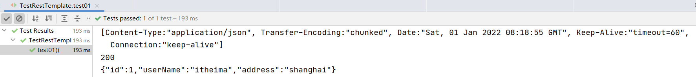

#### 3.1.2 get请求响应数据自动封装vo实体对象

~~~java
    /**
     * 测试响应数据自动封装到vo对象
     */
    @Test
    public void test02(){
        String url="http://localhost:6666/account/getByUserNameAndAddress?userName=itheima&address=shanghai";
        /*
          参数1：url请求地址
          参数2：请求返回的数据类型
         */
        Account account = restTemplate.getForObject(url, Account.class);
        System.out.println(account);
    }

    @Data
    public static class Account {

        private Integer id;

        private String userName;

        private String address;
        
    }
~~~

效果：

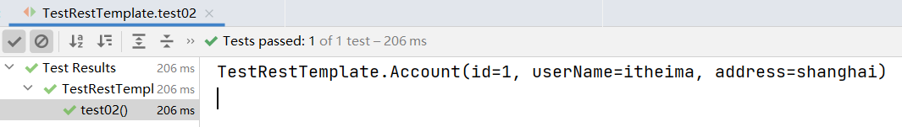

#### 3.1.3  请求头携带参数访问外部接口

~~~java
    /**
     * 请求头设置参数，访问指定接口
     */
    @Test
    public void test03(){
        String url="http://localhost:6666/account/getHeader";
        //设置请求头参数
        HttpHeaders headers = new HttpHeaders();
        headers.add("userName","zhangsan");
        //请求头填充到请求对象下
        HttpEntity<Map> entry = new HttpEntity<>(headers);
        //发送请求
        ResponseEntity<String> responseEntity = restTemplate.exchange(url, HttpMethod.GET, entry, String.class);
        String result = responseEntity.getBody();
        System.out.println(result);
    }
~~~

效果：

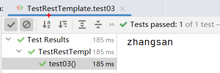

### 3.2 RestTemplate API入门-2

#### 3.2.1 POST请求模拟form表单访问外部接口

~~~java
    /**
     * post模拟form表单提交数据
     */
    @Test
    public void test04(){
        String url="http://localhost:6666/account/addAccount";
        //设置请求头，指定请求数据方式
        HttpHeaders headers = new HttpHeaders();
       //告知被调用方，请求方式是form表单提交，这样对方解析数据时，就会按照form表单的方式解析处理
        headers.add("Content-type","application/x-www-form-urlencoded");
        //组装模拟form表单提交数据，内部元素相当于form表单的input框
        LinkedMultiValueMap<String, Object> map = new LinkedMultiValueMap<>();
        map.add("id","10");
        map.add("userName","itheima");
        map.add("address","shanghai");
        HttpEntity<LinkedMultiValueMap<String, Object>> httpEntity = new HttpEntity<>(map, headers);
        /*
            参数1：请求url地址
            参数2：请求方式 POST
            参数3：请求体对象，携带了请求头和请求体相关的参数
            参数4：响应数据类型
         */
        ResponseEntity<Account> exchange = restTemplate.exchange(url, HttpMethod.POST, httpEntity, Account.class);
        Account body = exchange.getBody();
        System.out.println(body);
    }
~~~

效果：

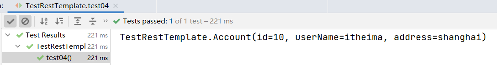

#### 3.2.2 POST请求发送JSON数据

~~~java
    /**
     * post发送json数据
     */
    @Test
    public void test05(){
        String url="http://localhost:6666/account/updateAccount";
        //设置请求头的请求参数类型
        HttpHeaders headers = new HttpHeaders();
       //告知被调用方，发送的数据格式的json格式，对方要以json的方式解析处理
        headers.add("Content-type","application/json; charset=utf-8");
        //组装json格式数据
//        HashMap<String, String> reqMap = new HashMap<>();
//        reqMap.put("id","1");
//        reqMap.put("userName","zhangsan");
//        reqMap.put("address","上海");
//        String jsonReqData = new Gson().toJson(reqMap);
        String jsonReq="{\"address\":\"上海\",\"id\":\"1\",\"userName\":\"zhangsan\"}";
        //构建请求对象
        HttpEntity<String> httpEntity = new HttpEntity<>(jsonReq, headers);
          /*
            发送数据
            参数1：请求url地址
            参数2：请求方式
            参数3：请求体对象，携带了请求头和请求体相关的参数
            参数4：响应数据类型
         */
        ResponseEntity<Account> responseEntity = restTemplate.exchange(url, HttpMethod.POST, httpEntity, Account.class);
      //或者
     // Account account=restTemplate.postForObject(url,httpEntity,Account.class);
        Account body = responseEntity.getBody();
        System.out.println(body);
    }
~~~

效果：

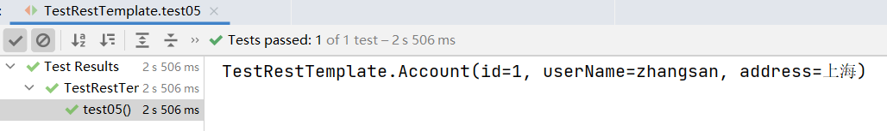

#### 3.2.3 获取接口响应的cookie数据

~~~java
    /**
     * 获取请求cookie值
     */
    @Test
    public void test06(){
        String url="http://localhost:6666/account/getCookie";
        ResponseEntity<String> result = restTemplate.getForEntity(url, String.class);
        //获取cookie
        List<String> cookies = result.getHeaders().get("Set-Cookie");
        //获取响应数据
        String resStr = result.getBody();
        System.out.println(resStr);
        System.out.println(cookies);
    }
~~~

效果：

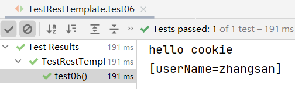

# 第二章 股票数据采集接口介绍

## 1、常规股票接口说明

​	目前市面上有一些正规的API金融接口，可为我们提供实时的股票金融数据，同时也提供有较为完整的开发文档，用起来也会更方便一些，但是大多是付费的，在这里给大家梳理了常用的股票API接口：

| 提供方   | 地址                                       | 是否收费 |
| ----- | ---------------------------------------- | ---- |
| 新浪财经  | https://hq.sinajs.cn/list=sh601003,sh601001 | 否    |
| 腾讯财经  | http://qt.gtimg.cn/q=sh601003,sh601001   | 否    |
| 雪球    | https://stock.xueqiu.com/v5/stock/realtime/quotec.json?symbol=SH601003,SH601001 | 付费   |
| 聚合数据  | https://www.juhe.cn/                     | 付费   |
| 阿里云社区 | https://market.aliyun.com/products/56956004/ | 付费   |

> 参考：**day05\资料\股票接口**

## 2、sina股票接口说明

我们项目中股票数据主要来自新浪提供的公共接口，通过RestTemplate采集股票相关数据，完成A股大盘、外盘、板块、个股等数据的实时采集工作；

接口相关信息如下：

- 采集国内大盘实时数据

  - 接口地址：http://hq.sinajs.cn/list=sh000001,sz399001

  - 响应数据格式：

    - ```js
      var hq_str_sh000001="上证指数,3358.9338,3361.5177,3398.6161,3417.0085,3358.9338,0,0,381243178,510307202948,0,0,0,0,0,0,0,0,0,0,0,0,0,0,0,0,0,0,0,0,2022-06-30,15:30:39,00,";
      var hq_str_sz399001="深证成指,12710.245,12696.505,12896.204,12970.646,12710.245,0.000,0.000,50289473109,649474154593.249,0,0.000,0,0.000,0,0.000,0,0.000,0,0.000,0,0.000,0,0.000,0,0.000,0,0.000,0,0.000,2022-06-30,15:00:03,00";
      ```

- 采集国外大盘实时数据

  - 接口地址：http://hq.sinajs.cn/list=int_dji,int_nasdaq,int_hangseng,int_nikkei,b_FSSTI

  - 响应数据格式：

    - ```js
      var hq_str_int_dji="道琼斯,31029.31,82.32,0.27";
      var hq_str_int_nasdaq="纳斯达克,11177.89,-3.65,-0.03";
      var hq_str_int_hangseng="恒生指数,21859.79,-137.10,-0.62";
      var hq_str_int_nikkei="日经指数,26393.04,-411.56,-1.54";
      var hq_str_b_FSSTI="富时新加坡海峡时报指数,3102.21,-32.66,-1.04,5:20 AM,17:20:00";
      ```

- 采集A股个票实时数据

  - 接口地址：http://hq.sinajs.cn/list=sh601003,sh601001

  - 响应数据格式：

    - ```js
      var hq_str_sh601003="柳钢股份,4.070,4.070,4.050,4.090,4.050,4.050,4.060,8678346,35232152.000,679654,4.050,444200,4.040,284400,4.030,108100,4.020,131700,4.010,60900,4.060,122800,4.070,150460,4.080,133400,4.090,61500,4.100,2022-06-30,15:00:00,00,";
      var hq_str_sh601001="晋控煤业,17.470,17.780,17.750,18.050,17.330,17.750,17.760,34284634,608615747.000,44300,17.750,31300,17.730,23300,17.720,2100,17.700,1700,17.690,115600,17.760,104500,17.770,67700,17.780,61600,17.790,61000,17.800,2022-06-30,15:00:00,00,";
      ```

- 采集国内板块行情数据

  - 接口地址：https://vip.stock.finance.sina.com.cn/q/view/newSinaHy.php

  - 响应数据格式：

    - ```js
      var S_Finance_bankuai_sinaindustry = {"new_blhy":"new_blhy,玻璃行业,19,17.104210526316,-0.030526315789474,-0.17815456444281,393368260,7095333979,sh601636,5.985,12.750,0.720,旗滨集团","new_cbzz":"new_cbzz,船舶制造,8,9.4775,0.03375,0.35737921906023,151355376,1379152954,sz002608,2.362,6.500,0.150,江苏国信","new_cmyl":"new_cmyl,传媒娱乐,40,6.942972972973,0.065405405405405,0.95099618815577,1332569964,7683176463,sz300027,11.111,3.200,0.320,华谊兄弟"}
      ```


# 第三章 股票相关数据采集

## 1、A股大盘数据采集

### 1.1 A股大盘数据采集准备

#### 1.1.1 配置ID生成器bean

A股大盘数据采集入库时，主键ID保证唯一，所以在stock_job工程配置ID生成器：

~~~java
@Configuration
public class CommonConfig {
    /**
     * 配置基于雪花算法生成全局唯一id
     *   参与元算的参数： 时间戳 + 机房id + 机器id + 序列号
     *   保证id唯一
     * @return
     */
    @Bean
    public IdWorker idWorker(){
        //指定当前为1号机房的2号机器生成
        return new IdWorker(2L,1L);
    }
}  
~~~

#### 1.1.2 股票常量数据配置

**1) 配置股票地址参数**

在stock_job工程下，定义股票相关配置文件application-stock.yml,该文件与stock_backend下的配置一致，然后我们把大盘、板块、股票相关的通用参数配置进来：

~~~yaml
# 配置股票相关的参数
stock:
  inner: # 国内大盘ID
    - sh000001 # 上证ID
    - sz399001 #  深证ID
  outer: # 外盘ID
    - int_dji # 道琼斯
    - int_nasdaq # 纳斯达克
    - int_hangseng # 恒生
    - int_nikkei # 日经指数
    - b_TWSE # 台湾加权
    - b_FSSTI # 新加坡
  marketUrl: http://hq.sinajs.cn/list=
  blockUrl: http://vip.stock.finance.sina.com.cn/q/view/newSinaHy.php    
~~~

**2）股票常量数据封装**

在stock_common工程继续完善StockInfoConfig类：

~~~java
package com.itheima.stock.pojo.domain;

import lombok.Data;
import org.springframework.boot.context.properties.ConfigurationProperties;
import java.util.List;
/**
 * @author by itheima
 * @Date 2021/12/30
 * @Description
 */
@ConfigurationProperties(prefix = "stock")
@Data
public class StockInfoConfig {
    //a股大盘ID集合
    private List<String> inner;
    //外盘ID集合
    private List<String> outer;
    //大盘参数获取url
    private String marketUrl;
    //板块参数获取url
    private String blockUrl;
}
~~~

 **2) 在公共配置类上开启配置**

~~~java
@EnableConfigurationProperties(StockInfoConfig.class)//开启常用参数配置bean
@Configuration
public class CommonConfig {
	//......
} 
~~~

#### 1.1.3 A股大盘响应数据说明

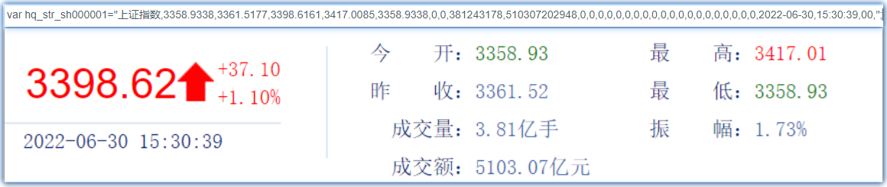

~~~js
var hq_str_sh000001="上证指数,3358.9338,3361.5177,3398.6161,3417.0085,3358.9338,0,0,381243178,510307202948,0,0,0,0,0,0,0,0,0,0,0,0,0,0,0,0,0,0,0,0,2022-06-30,15:30:39,00,";
参数说明：
0：指数名称
1：开盘点
2：前收盘点
3：当前点
4：最高点
5：最低点
8：成交量
9：成交金额
30：当前日期
31：当前时间
~~~

###  1.2 java正则回顾

​	上一小结我们发现，采集的大盘数据是标准的Js格式数据(非json),需要我们自行解析处理，显然在批量解析数据时，我们可借助java的正则实现，所以接下来我们回顾下前面讲的关于正则的一些知识点。

重点应用：

- 正则表达式理解；
- 捕获组理解；
- 核心类:Pattern、Matcher；

参考：**day05\资料\基础知识点预习\Java正则表达式.mhtml**

~~~java
    @Test
    public void testRep2(){
        // 按指定模式在字符串查找
        String line = "This order was placed for QT3000! OK?";
        String pattern = "(\\D*)(\\d+)(.*)";
        // 创建 Pattern 对象
        Pattern r = Pattern.compile(pattern);
        // 现在创建 matcher 对象
        Matcher m = r.matcher(line);
        if (m.find( )) {
            System.out.println("Found value: " + m.group(0) );
            System.out.println("Found value: " + m.group(1) );
            System.out.println("Found value: " + m.group(2) );
            System.out.println("Found value: " + m.group(3) );
        } else {
            System.out.println("NO MATCH");
        }
    }
~~~


### 1.3 A股大盘数据采集实现

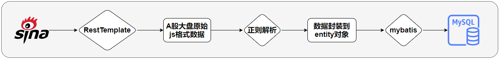

#### 1.3.1 定义A股大盘数据采集服务

在stock_job工程下定义服务接口：

~~~java
/**
 * @author by itheima
 * @Description 定义采集股票数据的定时任务的服务接口
 */
public interface StockTimerTaskService {
    /**
     * 获取国内大盘的实时数据信息
     */
    void getInnerMarketInfo();
} 
~~~

定义服务接口实现：

~~~java
@Service("stockTimerTaskService")
@Slf4j
public class StockTimerTaskServiceImpl implements StockTimerTaskService {

    @Autowired
    private RestTemplate restTemplate;

    @Autowired
    private StockInfoConfig stockInfoConfig;

    @Autowired
    private IdWorker idWorker;

    @Override
    public void getInnerMarketInfo() {
        //1.定义采集的url接口
        String url=stockInfoConfig.getMarketUrl() + String.join(",",stockInfoConfig.getInner());
        //2.调用restTemplate采集数据
        //2.1 组装请求头
        HttpHeaders headers = new HttpHeaders();
        //必须填写，否则数据采集不到
        headers.add("Referer","https://finance.sina.com.cn/stock/");
        headers.add("User-Agent","Mozilla/5.0 (Windows NT 10.0; WOW64) AppleWebKit/537.36 (KHTML, like Gecko) Chrome/72.0.3626.121 Safari/537.36");
        //2.2 组装请求对象
        HttpEntity<Object> entity = new HttpEntity<>(headers);
        //2.3 resetTemplate发起请求
        String resString = restTemplate.postForObject(url, entity, String.class);
        //log.info("当前采集的数据：{}",resString);
        //3.数据解析（重要）
//        var hq_str_sh000001="上证指数,3267.8103,3283.4261,3236.6951,3290.2561,3236.4791,0,0,402626660,398081845473,0,0,0,0,0,0,0,0,0,0,0,0,0,0,0,0,0,0,0,0,2022-04-07,15:01:09,00,";
//        var hq_str_sz399001="深证成指,12101.371,12172.911,11972.023,12205.097,11971.334,0.000,0.000,47857870369,524892592190.995,0,0.000,0,0.000,0,0.000,0,0.000,0,0.000,0,0.000,0,0.000,0,0.000,0,0.000,0,0.000,2022-04-07,15:00:03,00";
        String reg="var hq_str_(.+)=\"(.+)\";";
        //编译表达式,获取编译对象
        Pattern pattern = Pattern.compile(reg);
        //匹配字符串
        Matcher matcher = pattern.matcher(resString);
        ArrayList<StockMarketIndexInfo> list = new ArrayList<>();
        //判断是否有匹配的数值
        while (matcher.find()){
            //获取大盘的code
            String marketCode = matcher.group(1);
            //获取其它信息，字符串以逗号间隔
            String otherInfo=matcher.group(2);
            //以逗号切割字符串，形成数组
            String[] splitArr = otherInfo.split(",");
            //大盘名称
            String marketName=splitArr[0];
            //获取当前大盘的开盘点数
            BigDecimal openPoint=new BigDecimal(splitArr[1]);
            //前收盘点
            BigDecimal preClosePoint=new BigDecimal(splitArr[2]);
            //获取大盘的当前点数
            BigDecimal curPoint=new BigDecimal(splitArr[3]);
            //获取大盘最高点
            BigDecimal maxPoint=new BigDecimal(splitArr[4]);
            //获取大盘的最低点
            BigDecimal minPoint=new BigDecimal(splitArr[5]);
            //获取成交量
            Long tradeAmt=Long.valueOf(splitArr[8]);
            //获取成交金额
            BigDecimal tradeVol=new BigDecimal(splitArr[9]);
            //时间
            Date curTime = DateTimeUtil.getDateTimeWithoutSecond(splitArr[30] + " " + splitArr[31]).toDate();
            //组装entity对象
            StockMarketIndexInfo info = StockMarketIndexInfo.builder()
                    .id(idWorker.nextId())
                    .marketCode(marketCode)
                    .marketName(marketName)
                    .curPoint(curPoint)
                    .openPoint(openPoint)
                    .preClosePoint(preClosePoint)
                    .maxPoint(maxPoint)
                    .minPoint(minPoint)
                    .tradeVolume(tradeVol)
                    .tradeAmount(tradeAmt)
                    .curTime(curTime)
                    .build();
            //收集封装的对象，方便批量插入
            list.add(info);
        }
       log.info("采集的当前大盘数据：{}",list);
        //批量插入
        if (CollectionUtils.isEmpty(list)) {
            return;
        }
        //TODO 后续完成批量插入功能
    }
} 
~~~

#### 1.3.2 A股大盘数据采集测试

~~~java
package com.itheima.stock;

import com.itheima.stock.job.service.StockTimerService;
import org.junit.jupiter.api.Test;
import org.springframework.beans.factory.annotation.Autowired;
import org.springframework.boot.test.context.SpringBootTest;

/**
 * @author by itheima
 * @Date 2022/1/1
 * @Description
 */
@SpringBootTest
public class TestStockTimerService {
    @Autowired
    private StockTimerTaskService stockTimerService;

    /**
     * 获取大盘数据
     */
    @Test
    public void test01(){
        stockTimerService.getInnerMarketInfo();
    }
}    
~~~

效果：

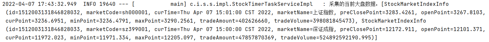

### 1.4 A股大盘批量保存

#### 1.4.1 定义mapper接口方法

在StockMarketIndexInfoMapper接口添加方法：

~~~java
    /**
     * 批量插入股票大盘数据
     * @param infos
     */
    int insertBatch(List<StockMarketIndexInfo> infos);
~~~

#### 1.4.2 绑定xml

在StockMarketIndexInfoMapper.xml添加SQL：

~~~xml
    <insert id="insertBatch">
        insert into stock_market_index_info
        ( id,mark_Id,cur_time
        ,mark_name,cur_point,current_price
        ,updown_rate,trade_account,trade_volume
        )
        values
        <foreach collection="list" item="smi" separator=",">
            (#{smi.id,jdbcType=BIGINT},#{smi.markId,jdbcType=CHAR},#{smi.curTime,jdbcType=TIMESTAMP}
            ,#{smi.markName,jdbcType=VARCHAR},#{smi.curPoint,jdbcType=DECIMAL},#{smi.currentPrice,jdbcType=DECIMAL}
            ,#{smi.updownRate,jdbcType=DECIMAL},#{smi.tradeAccount,jdbcType=BIGINT},#{smi.tradeVolume,jdbcType=BIGINT}
            )
        </foreach>
    </insert>
~~~

#### 1.4.3 国内大盘数据批量插入实现

注入mapper，然后批量插入：

~~~java
    @Autowired
    private StockMarketIndexInfoMapper stockMarketIndexInfoMapper;  

	/**
     * 获取国内大盘数据
     */
    @Override
    public void getInnerMarketInfo() {
		//....省略N行....
        //批量插入
        int count = this.stockMarketIndexInfoMapper.insertBatch(infos);
        log.info("批量插入了：{}条数据",count);
    }
~~~

## 2.个股数据采集

### 2.1 个股数据采集分析

#### 2.1.1 股票响应数据结构说明

第三方接口路径：  https://hq.sinajs.cn/list=sh601003,sh601001,sh601006

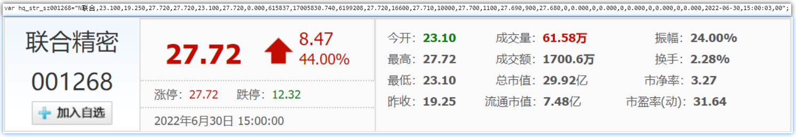

~~~js
var hq_str_sh601006="大秦铁路, 27.55, 27.25, 26.91, 27.55, 26.20, 26.91, 26.92,22114263, 589824680, 4695, 26.91, 57590, 26.90, 14700, 26.89, 14300,
26.88, 15100, 26.87, 3100, 26.92, 8900, 26.93, 14230, 26.94, 25150, 26.95, 15220, 26.96, 2008-01-11, 15:05:32";
这个字符串由许多数据拼接在一起，不同含义的数据用逗号隔开了，按照程序员的思路，顺序号从0开始。
0：”大秦铁路”，股票名字；
1：”27.55″，今日开盘价；
2：”27.25″，昨日收盘价；
3：”26.91″，当前价格；
4：”27.55″，今日最高价；
5：”26.20″，今日最低价；
6：”26.91″，竞买价，即“买一”报价；
7：”26.92″，竞卖价，即“卖一”报价；
8：”22114263″，成交的股票数，由于股票交易以一百股为基本单位，所以在使用时，通常把该值除以一百；
9：”589824680″，成交金额，单位为“元”，为了一目了然，通常以“万元”为成交金额的单位，所以通常把该值除以一万；
10：”4695″，“买一”申请4695股，即47手；
11：”26.91″，“买一”报价；
12：”57590″，“买二”
13：”26.90″，“买二”
14：”14700″，“买三”
15：”26.89″，“买三”
16：”14300″，“买四”
17：”26.88″，“买四”
18：”15100″，“买五”
19：”26.87″，“买五”
20：”3100″，“卖一”申报3100股，即31手；
21：”26.92″，“卖一”报价
(22, 23), (24, 25), (26,27), (28, 29)分别为“卖二”至“卖四的情况”
30：”2008-01-11″，日期；
31：”15:05:32″，时间；
~~~

>  说明：股票请求url地址和数据结构与大盘数据一致；

#### 2.1.2 股票编码注意事项

~~~tex
1、创业板 创业板的代码是300打头的股票代码；
2、沪市A股 沪市A股的代码是以600、601或603打头；★
3、沪市B股 沪市B股的代码是以900打头；
4、深市A股 深市A股的代码是以00打头；★
5、深圳B股 深圳B股的代码是以200打头；
6、新股申购 沪市新股申购的代码是以730打头 深市新股申购的代码与深市股票买卖代码一样；
7、配股代码 沪市以700打头，深市以080打头 权证，沪市是580打头 深市是031打头；
~~~

>  注意：当前的平台仅仅统计沪深两市A股的数据；

#### 2.1.3 个股采集思路分析

​	批量采集股票时，需要在请求的url地址后批量拼接股票的code编码，但是国内A股上市企业达3000+，一次性批量获取某个时间点下股票的详情数据，显然单次请求的网络I/O开销大,磁盘I/O同样如此，这样会导致数据采集耗时过长！同时受限于第三方股票接口流量控制，也不会允许单次如此大的数据量的采集任务；

​	我们可以尝试先将A股的code集合拆分成若干组，然后再分批次批量获取股票的实时信息,所以接下来，我们先完成获取A股code编码集合的功能；

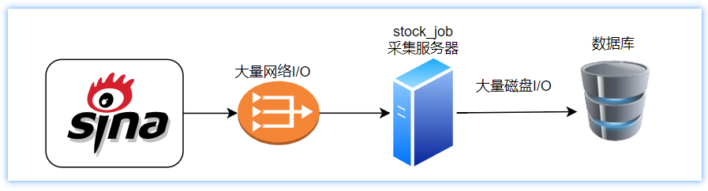

### 2.2 查询个股编码集合

**获取A股股票code信息**

在StockBusinessMapper 接口定义方法：

```java
    /**
     * 获取所有股票的code
     * @return
     */
    List<String> getStockIds();
```

绑定xml：

```xml
<select id="getStockIds" resultType="string">
    select sec_code from stock_business
</select>
```

单元测试

```java
    /**
     * 获取A股数据
     */
    @Test
    public void test02(){
        stockTimerService.getStockRtIndex();
    }
```

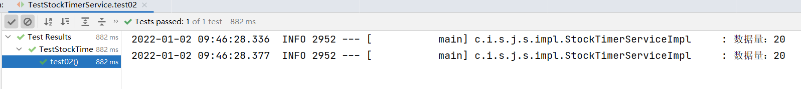

### 2.3 个股数据采集准备

#### 2.3.1 解析工具类封装

​	通过观察接口响应的数据，我们发现无论是A股大盘、外盘，还是个股数据，内容格式和正则解析规则都是一致的，所以我们封装一个工具类统一处理；

在stock_common工程导入已封装好的股票解析工具类：

> 说明：直接从 day05\资料\解析工具类\ParserStockInfoUtil.java、ParseType.java 导入即可

采集股票相关数据的类型封装：

~~~java
package com.itheima.stock.constant;

/**
 * @author by itheima
 * @Date 2022/3/18
 * @Description 股票信息采集数据类型标识
 */
public class ParseType {

    /**
     * A股大盘标识
     */
    public static final int INNER=1;

    /**
     * 国外大盘标识
     */
    public static final int OUTER=2;

    /**
     * A股标识
     */
    public static final int ASHARE=3;

}

~~~

股票解析工具类：

~~~java
package com.itheima.stock.utils;

import com.google.common.base.Strings;
import com.google.gson.Gson;
import com.itheima.stock.pojo.entity.StockBlockRtInfo;
import com.itheima.stock.pojo.entity.StockMarketIndexInfo;
import com.itheima.stock.pojo.entity.StockOuterMarketIndexInfo;
import com.itheima.stock.pojo.entity.StockRtInfo;
import org.joda.time.DateTime;

import java.math.BigDecimal;
import java.util.*;
import java.util.regex.Matcher;
import java.util.regex.Pattern;
import java.util.stream.Collectors;

/**
 * @author by itheima
 * @Date 2021/12/28
 * @Description
 */
public class ParserStockInfoUtil {

    public ParserStockInfoUtil(IdWorker idWorker) {
        this.idWorker = idWorker;
    }

    private IdWorker idWorker;

    /**
     * @param stockStr 大盘 股票 实时拉去原始数据(js格式解析)
     * @param type 1:国内大盘 2.国外大盘 3.A股
     * @return 解析后的数据
     */
    public List parser4StockOrMarketInfo(String stockStr,Integer  type){
        //收集封装数据
        List<Object> datas=new ArrayList<>();
        //合法判断
        if (Strings.isNullOrEmpty(stockStr)) {
            //返回空数组
            return datas;
        }
        //定义正则 第一组：匹配任意非空字符串  第二组：匹配任意除了换行符的字符串包括名称中出现空格的数据
        String reg="var hq_str_(.+)=\"(.+)\";";
        //编译正则，获取正则对象
        Pattern pattern = Pattern.compile(reg);
        //获取正则匹配器
        Matcher matcher = pattern.matcher(stockStr);
        while (matcher.find()) {
            //解析国内股票大盘
            if (type==1){
                StockMarketIndexInfo info=parser4InnerStockMarket(matcher.group(1),matcher.group(2));
                datas.add(info);
            }
            //国外大盘
            if (type==2) {
                StockOuterMarketIndexInfo info=parser4OuterStockMarket(matcher.group(1),matcher.group(2));
                datas.add(info);
            }
            //国内A股信息
            if(type==3){
                StockRtInfo info=parser4StockRtInfo(matcher.group(1),matcher.group(2));
                datas.add(info);
            }
        }
        return datas;
    }

    /**
     * 解析国内A股数据
     * @param stockCode 股票ID
     * @param otherInfo 股票其它信息，以逗号间隔
     * @return
     */
    private StockRtInfo parser4StockRtInfo(String stockCode, String otherInfo) {
                ////去除股票sz或者sh前缀 shxxxx
                stockCode = stockCode.substring(2);
                String[] others = otherInfo.split(",");
                //大盘名称
                String stockName = others[0];
                //今日开盘价
                BigDecimal openPrice = new BigDecimal(others[1]);
                //昨日收盘价
                BigDecimal preClosePrice = new BigDecimal(others[2]);
                //当前价格
                BigDecimal currentPrice = new BigDecimal(others[3]);
                //今日最高价额
                BigDecimal maxPrice = new BigDecimal(others[4]);
                //今日最低价额
                BigDecimal minPrice = new BigDecimal(others[5]);
                //成交量
                Long tradeAmount = Long.valueOf(others[8]);
                //成金额
                BigDecimal tradeVol = new BigDecimal(others[9]);
                //当前日期
                Date curDateTime = DateTimeUtil.getDateTimeWithoutSecond(others[30] + " " + others[31]).toDate();
                //Date currentTime = DateTime.parse(others[30] + " " + others[31], DateTimeFormat.forPattern("yyyy-MM-dd HH:mm:ss")).toDate();
                StockRtInfo stockRtInfo =StockRtInfo.builder()
                        .id(idWorker.nextId())
                        .stockCode(stockCode)
                        .stockName(stockName)
                        .openPrice(openPrice)
                        .preClosePrice(preClosePrice)
                        .curPrice(currentPrice)
                        .maxPrice(maxPrice)
                        .minPrice(minPrice)
                        .tradeAmount(tradeAmount)
                        .tradeVolume(tradeVol)
                        .curTime(curDateTime)
                        .build();
                return stockRtInfo;
    }

    /**
     * 解析国外大盘数据
     * @param marketCode 大盘ID
     * @param otherInfo 大盘其它信息，以逗号间隔
     * @return
     */
    private StockOuterMarketIndexInfo parser4OuterStockMarket(String marketCode, String otherInfo) {
        //其他信息
        String[] others=otherInfo.split(",");
        //大盘名称
        String marketName = others[0];
        //大盘点数
        BigDecimal curPoint = new BigDecimal(others[1]);
        //涨跌值
        BigDecimal upDown = new BigDecimal(others[2]);
        //涨幅
        BigDecimal rose = new BigDecimal(others[3]);
        //获取当前时间
        Date now=DateTimeUtil.getDateTimeWithoutSecond(DateTime.now()).toDate();
        //组装实体对象
        StockOuterMarketIndexInfo smi = StockOuterMarketIndexInfo.builder()
                .id(idWorker.nextId())
                .marketCode(marketCode)
                .curPoint(curPoint)
                .updown(upDown)
                .rose(rose)
                .curTime(now)
                .build();
        return smi;
    }

    /**
     * 解析国内大盘数据
     * @param marketCode 大盘ID
     * @param otherInfo 大盘其它信息，以逗号间隔
     * @return
     */
    private StockMarketIndexInfo parser4InnerStockMarket(String marketCode, String otherInfo) {
        //其他信息
        String[] splitArr=otherInfo.split(",");
        //大盘名称
        String marketName=splitArr[0];
        //获取当前大盘的点数
        BigDecimal openPoint=new BigDecimal(splitArr[1]);
        //获取大盘的涨跌值
        BigDecimal preClosePoint=new BigDecimal(splitArr[2]);
        //获取大盘的涨幅
        BigDecimal curPoint=new BigDecimal(splitArr[3]);
        //获取大盘最高点
        BigDecimal maxPoint=new BigDecimal(splitArr[4]);
        //获取大盘的涨幅
        BigDecimal minPoint=new BigDecimal(splitArr[5]);
        //获取成交量
        Long tradeAmt=Long.valueOf(splitArr[8]);
        //获取成交金额
        BigDecimal tradeVol=new BigDecimal(splitArr[9]);
        //时间
        Date curTime = DateTimeUtil.getDateTimeWithoutSecond(splitArr[30] + " " + splitArr[31]).toDate();
        //组装实体对象
        StockMarketIndexInfo smi = StockMarketIndexInfo.builder()
                .id(idWorker.nextId())
                .marketCode(marketCode)
                .marketName(marketName)
                .curPoint(curPoint)
                .openPoint(openPoint)
                .preClosePoint(preClosePoint)
                .maxPoint(maxPoint)
                .minPoint(minPoint)
                .tradeVolume(tradeVol)
                .tradeAmount(tradeAmt)
                .curTime(curTime)
                .build();
        return smi;
    }


    /**
     * 转化板块数据获取集合信息
     * @param stockStr
     * @return
     */
    public List<StockBlockRtInfo> parse4StockBlock(String stockStr){
        if (Strings.isNullOrEmpty(stockStr)|| !stockStr.contains("=")){
            return Collections.emptyList();
        }
        String jsonStr = stockStr.substring(stockStr.indexOf("=") + 1);
        HashMap mapInfo = new Gson().fromJson(jsonStr, HashMap.class);
        System.out.println(mapInfo);
        Collection values = mapInfo.values();
        List<StockBlockRtInfo> collect = (List<StockBlockRtInfo>) mapInfo.values().stream().map(restStr -> {
            String infos = (String) restStr;
            String[] infoArray = infos.split(",");
            //板块编码
            String label = infoArray[0];
            //板块行业
            String blockName = infoArray[1];
            //板块公司数量
            Integer companyNum = Integer.valueOf(infoArray[2]);
            //均价
            BigDecimal avgPrice = new BigDecimal(infoArray[3]);
            //涨跌幅度
            BigDecimal priceLimit = new BigDecimal(infoArray[5]);
            //涨跌率
            //BigDecimal updownRate=new BigDecimal(infoArray[5]);
            //总成交量
            Long tradeAmount = Long.valueOf(infoArray[6]);
            //总成交金额
            BigDecimal tradeVolume = new BigDecimal(infoArray[7]);
            //当前日期
            Date now=DateTimeUtil.getDateTimeWithoutSecond(DateTime.now()).toDate();
            //构建板块信息对象
            StockBlockRtInfo blockRtInfo = StockBlockRtInfo.builder().id(idWorker.nextId()+"").label(label)
                    .blockName(blockName).companyNum(companyNum).avgPrice(avgPrice).curTime(now)
                    .updownRate(priceLimit).tradeAmount(tradeAmount).tradeVolume(tradeVolume)
                    .build();
            return blockRtInfo;
        }).collect(Collectors.toList());
        return collect;
    }
}
~~~

效果：

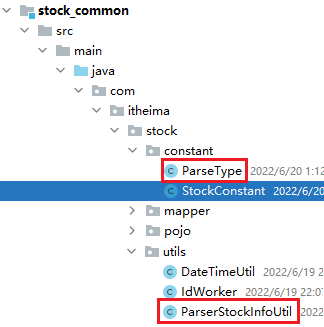

在stock_job工程配置解析工具类bean:

~~~java
@Configuration
@EnableConfigurationProperties(StockInfoConfig.class)//开启常用参数配置bean
public class CommonConfig {
 	//......
    /**
     * 配置解析工具bean
     * @param idWorker
     * @return
     */
    @Bean
    public ParserStockInfoUtil parserStockInfoUtil(IdWorker idWorker){
        return new ParserStockInfoUtil(idWorker);
    } 
}
~~~

#### 2.3.2 集合分片实现

​	国内A股上市公司3000+，显然单次不好全量采集完成。所以我们需要将股票的编码集合拆分成若均等组，然后分批次采集，这样即避免了单次全量采集股票信息导致的过高的I/O开销（网络和磁盘I/O），同时也绕过了对方的服务限流；

​	我们可基于guava提供的工具集实现集合的分片处理，示例代码如下：

~~~java
    @Test
    public void testPartion() {
        List<Integer> all=new ArrayList<>();
        for (int i = 1; i <= 50; i++) {
            all.add(i);
        }
        //将集合均等分，每份大小最多15个
        Lists.partition(all,15).forEach(ids->{
            System.out.println(ids);
        });
    }
~~~

效果：

~~~tex
[1, 2, 3, 4, 5, 6, 7, 8, 9, 10, 11, 12, 13, 14, 15]
[16, 17, 18, 19, 20, 21, 22, 23, 24, 25, 26, 27, 28, 29, 30]
[31, 32, 33, 34, 35, 36, 37, 38, 39, 40, 41, 42, 43, 44, 45]
[46, 47, 48, 49, 50]
~~~

### 2.4 定义股票拉取服务接口方法

在StockTimerService接口下定义：

~~~java
    /**
     * 定义获取分钟级股票数据
     */
void getStockRtIndex();
~~~

在StockTimerServiceImpl下实现：

~~~java
   //注入格式解析bean
   @Autowired
    private ParserStockInfoUtil parserStockInfoUtil; 

   @Autowired
    private StockBusinessMapper stockBusinessMapper;

   /**
     * 批量获取股票分时数据详情信息
     * http://hq.sinajs.cn/list=sz000002,sh600015
     */
    @Override
    public void getStockRtIndex() {
        //批量获取股票ID集合
        List<String> stockIds = stockBusinessMapper.getStockIds();
        //计算出符合sina命名规范的股票id数据
         stockIds = stockIds.stream().map(id -> {
            return id.startsWith("6") ? "sh" + id : "sz" + id;
        }).collect(Collectors.toList());
        //设置公共请求头对象
        //设置请求头数据
        HttpHeaders headers = new HttpHeaders();
        headers.add("Referer","https://finance.sina.com.cn/stock/");
        headers.add("User-Agent","Mozilla/5.0 (Windows NT 10.0; WOW64) AppleWebKit/537.36 (KHTML, like Gecko) Chrome/72.0.3626.121 Safari/537.36");
        HttpEntity<String> entity = new HttpEntity<>(headers);
        //一次性查询过多，我们将需要查询的数据先进行分片处理，每次最多查询20条股票数据
        Lists.partition(stockIds,20).forEach(list->{
            //拼接股票url地址
            String stockUrl=stockInfoConfig.getMarketUrl()+String.join(",",list);
            //获取响应数据
            String result = restTemplate.postForObject(stockUrl,entity,String.class);
            List<StockRtInfo> infos = parserStockInfoUtil.parser4StockOrMarketInfo(result, ParseType.ASHARE);
            log.info("数据量：{}",infos.size());
            //TODO 批量插入
        });
    }
~~~

### 2.4 个股数据批量保存功能实现

#### 2.5.1 定义mapper接口方法和xml

在StockRtInfoMapper接口方法下定义：

~~~java
    /**
     * 批量插入功能
     * @param stockRtInfoList
     */
    int insertBatch(List<StockRtInfo> stockRtInfoList);
~~~

在StockRtInfoMapper.xml定义绑定sql：

~~~xml

    <insert id="insertBatch">
        insert into stock_rt_info
          ( id,stock_code,cur_time
          ,stock_name,open_price,pre_close_price
          ,cur_price,max_price,min_price
          ,trade_amount,trade_volume)
        values
          <foreach collection="list" item="si" separator=",">
              (#{si.id,jdbcType=BIGINT},#{si.stockCode,jdbcType=CHAR},#{si.curTime,jdbcType=TIMESTAMP}
              ,#{si.stockName,jdbcType=VARCHAR},#{si.openPrice,jdbcType=DECIMAL},#{si.preClosePrice,jdbcType=DECIMAL}
              ,#{si.curPrice,jdbcType=DECIMAL},#{si.maxPrice,jdbcType=DECIMAL},#{si.minPrice,jdbcType=DECIMAL}
              ,#{si.tradeAmount,jdbcType=BIGINT},#{si.tradeVolume,jdbcType=DECIMAL})
          </foreach>
    </insert>
~~~

#### 2.5.2 修改股票拉取服务逻辑

~~~java
    /**
     * 批量获取股票分时数据详情信息
     * http://hq.sinajs.cn/list=sz000002,sh600015
     */
    @Override
    public void getStockRtIndex() {
        //批量获取股票ID集合
        List<String> stockIds = stockBusinessMapper.getStockIds();
        //计算出符合sina命名规范的股票id数据
         stockIds = stockIds.stream().map(id -> {
            return id.startsWith("6") ? "sh" + id : "sz" + id;
        }).collect(Collectors.toList());
        //一次性查询过多，我们将需要查询的数据先进行分片处理，每次最多查询20条股票数据
        Lists.partition(stockIds,20).forEach(list->{
            //拼接股票url地址
            String stockUrl=stockInfoConfig.getMarketUrl()+String.join(",",list);
            //获取响应数据
            String result = restTemplate.getForObject(stockUrl, String.class);
            List<StockRtInfo> infos = parserStockInfoUtil.parser4StockOrMarketInfo(result, ParseType.ASHARE);
            log.info("数据量：{}",infos.size());
            //批量插入数据库
            stockRtInfoMapper.insertBatch(infos);
        });
    }
~~~


## 3、板块实时数据采集功能思路分析-作业

板块数据采集接口依旧使用新浪提供的内部接口：

```url
https://vip.stock.finance.sina.com.cn/q/view/newSinaHy.php
```

拉取的数据格式如下：

```json
var S_Finance_bankuai_sinaindustry = {
"new_blhy":"new_blhy,玻璃行业,19,19.293684210526,-0.17052631578947,-0.87610188740468,315756250,5258253314,sh600586,3.464,9.260,0.310,金晶科技",
"new_cbzz":"new_cbzz,船舶制造,8,12.15875,0.0125,0.10291242152928,214866817,2282104956,sh600150,0.978,24.790,0.240,中国船舶",
  //........省略.......
}
```

解析思路：

分析发现，板块的数据格式与大盘、个股数据格式不一致，但是都是js格式，我们通过RestTemplate拉取数据后，进行解析处理：

- 直接使用=正则切割，就可获取一个标准的json格式数据；
- 调用json的工具类（jackson gson fastson等）将json的数据转化成Map对象；
- 获取map中的value值，逐个切割解析，然后封装成板块数据，然后批量插入到数据库下；

各个参数的语义如下：

~~~json
数据格式：
"new_blhy,玻璃行业,19,19.293684210526,-0.17052631578947,-0.87610188740468,315756250,5258253314,sh600586,3.464,9.260,0.310,金晶科技"
参数语义：
['0.板块编码',1.'板块名称',2.'公司家数',3.'平均价格',4.'涨跌额',5.'涨跌幅',6.'总成交量',7.'总成交金额',8.'领涨股代码',9.'涨跌幅',10.'当前价',11.'涨跌额',12.'领涨股名称']
~~~


# 第四章 MQ同步股票最新数据

## 1、项目集成RabbitMQ背景说明

当前的大盘、股票等相关数据都是通过定时任务不断采集落库的，而对于大屏终端也需要高频且实时获取股票最新数据，这会导致数据库过高的负载。

思路：

 - 我们可在定时任务拉取股票数据时，将最新的数据信息通过mq同步到主业务工程进行缓存处理，这样就避免了多用户从数据库反复加载股票数据导致数据库负载过高的问题，同样也提高了大屏终端服务的吞吐量；
 - 使用CaffineCache本地缓存而非redis远程缓存，能提供更高效的响应速度，同时避免了与redis之间交换带来的网络I/O成本开销；

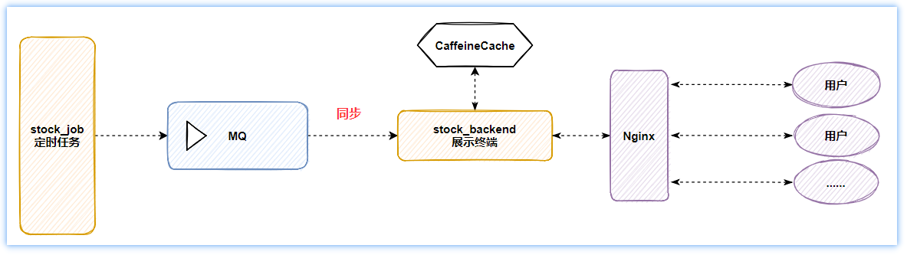

​	同时我们可基于主题交换机向不同的队列发送不同的股票类型数据，比如：通过stockExchange主题交换机向innerMarketQueue发送大盘数据，routingKey为inner.market；

## 2、采集工程向MQ同步大盘数据

stock_job工程引入amqp依赖：

~~~xml
<dependency>
  <groupId>org.springframework.boot</groupId>
  <artifactId>spring-boot-starter-amqp</artifactId>
</dependency>
~~~

stock_job工程定义application-mq.yml配置rabbitmq：

~~~yaml
spring:
  rabbitmq:
    host: 192.168.200.131 # rabbitMQ的ip地址
    port: 5672 # 端口
    username: itcast
    password: 123321
    virtual-host: /
~~~

在stock_job工程定义交换机、队列、消息转化资源bean：

~~~java
@Configuration
public class MqConfig {
    /**
     * 重新定义消息序列化的方式，改为基于json格式序列化和反序列化
     * @return
     */
    @Bean
    public MessageConverter messageConverter(){
        return new Jackson2JsonMessageConverter();
    }

    /**
     * 国内大盘信息队列
     * @return
     */
    @Bean
    public Queue innerMarketQueue(){
        return new Queue("innerMarketQueue",true);
    }

    /**
     * 定义路由股票信息的交换机
     * @return
     */
    @Bean
    public TopicExchange innerMarketTopicExchange(){
        return new TopicExchange("stockExchange",true,false);
    }

    /**
     * 绑定队列到指定交换机
     * @return
     */
    @Bean
    public Binding bindingInnerMarketExchange(){
        return BindingBuilder.bind(innerMarketQueue()).to(innerMarketTopicExchange())
                .with("inner.market");
    }
}
~~~

在stock_job工程com.itheima.stock.service.impl.StockTimerTaskServiceImpl#getInnerMarketInfo方法下添加最新大盘数据同步逻辑：

~~~java
    @Override
    public void getInnerMarketInfo() {
		//......
        //解析的数据批量插入数据库
        int count= stockMarketIndexInfoMapper.insertBatch(entities);
        log.info("当前插入了：{}行数据",count);
		//通知后台终端刷新本地缓存，发送的日期数据是告知对方当前更新的股票数据所在时间点
        rabbitTemplate.convertAndSend("stockExchange","inner.market",new Date());
    }
~~~

## 3、主业务后端大盘数据缓存刷新

在stock_backend工程同样集成amqp，过程与stock_job工程一致，同时主业务工程获取最新大盘数据后，并同步到本地缓存中：

工程引入CaffeineCache依赖：

~~~xml
<dependency>
  <groupId>com.github.ben-manes.caffeine</groupId>
  <artifactId>caffeine</artifactId>
</dependency>
~~~

在CommonConfig中配置本地缓存bean：

~~~java
    /**
     * 构建缓存bean
     * @return
     */
    @Bean
    public Cache<String,Object> caffeineCache(){
        Cache<String, Object> cache = Caffeine
                .newBuilder()
                .maximumSize(200)//设置缓存数量上限
//                .expireAfterAccess(1, TimeUnit.SECONDS)//访问1秒后删除
//                .expireAfterWrite(1,TimeUnit.SECONDS)//写入1秒后删除
                .initialCapacity(100)// 初始的缓存空间大小
                .recordStats()//开启统计
                .build();
        return cache;
    }
~~~

监听消息，刷新缓存：

~~~java
/**
 * 监听股票变化消息
 */
@Component
@Slf4j
public class MqListener {
  
    @Autowired
    private Cache<String,Object> caffeineCache;

    @Autowired
    private StockService stockService;

    /**
     *
     * @param infos
     * @throws Exception
     */
    @RabbitListener(queues = "innerMarketQueue")
    public void acceptInnerMarketInfo(Date date)throws Exception{
        //获取时间毫秒差值
        long diffTime= DateTime.now().getMillis()-new DateTime(date).getMillis();
        //超过一分钟告警
        if (diffTime>60000) {
            log.error("采集国内大盘时间点：{},同步超时：{}ms",new DateTime(date).toString("yyyy-MM-dd HH:mm:ss"),diffTime);
        }
        //将缓存置为失效删除
        caffeineCache.invalidate("innerMarketInfosKey");
        //调用服务更新缓存
        stockService.getNewestInnerMarketInfos();
    }

}
~~~

在com.itheima.stock.service.impl.StockServiceImpl#getInnnerMarketInfos方法中添加缓存查询逻辑：

~~~java
    @Autowired
    private Cache<String,Object> caffeineCache;
    /**
     * 定义获取A股大盘最新数据
     * @return
     */
    @Override
    public R<List<InnerMarketDomain>> getInnnerMarketInfos() {
      	//从缓存中加载数据，如果不存在，则走补偿策略获取数据，并存入本地缓存
        R<List<InnerMarketDomain>> data= (R<List<InnerMarketDomain>>) caffeineCache.get("innerMarketInfos", key->{
            //如果不存在，则从数据库查询
            //1.获取最新的股票交易时间点
            Date lastDate = DateTimeUtil.getLastDate4Stock(DateTime.now()).toDate();
            //TODO 伪造数据，后续删除
            lastDate=DateTime.parse("2022-01-03 09:47:00", DateTimeFormat.forPattern("yyyy-MM-dd HH:mm:ss")).toDate();
            //2.获取国内大盘编码集合
            List<String> innerCodes = stockInfoConfig.getInner();
            //3.调用mapper查询
            List<InnerMarketDomain> infos= stockMarketIndexInfoMapper.getInnerIndexByTimeAndCodes(lastDate,innerCodes);
            //4.响应
            return R.ok(infos);
        });
      return data;
    }
~~~

