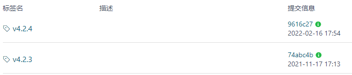

# 项目发布前如何打tag标签及标签命名规范

## 1.问题背景

我们知道git分支可以理解为一系列提交流水组成的线，如果我们开发的项目到了一个比较重要的阶段，比如项目发布上线，处于方便后期代码的追溯和维护的考虑，如何在繁杂的日志提交记录中快速定位到这些重要的阶段呢？

​	很简单，就跟我们阅读书籍一样，遇到出彩的地方，我们可以用记号笔做标记。同理，在git中我们可以给当前或者历史的某次提交节点打上标签(tag);

## 2.标签命名约定

不同的软件公司对git标签的命名规则有不同的约定，整体来看 git标签的命名规则大致与软件的发布版本号一致，格式如下：

以V4.2.4标签名称为例说明：

说明：

~~~tex
（1）主版本号：主版本号一般从0或者1开始，一般当项目进行重大修改，则版本号加1；
（2）次版本号：次版本号是相对于主版本号而言，一般对应的是主版本下局部的调整；
（3）修订版本号：一般是Bug的修复或者细小的变动而发布的一个版本；
~~~

## 3.动手实践

下面我们基于idea工具和git命令两种方式开始动手实践。

### 3.1 使用idea工具实操

#### 1）当前分支下打标签

为当前master分支打标签：

在当前提交head中可看到标签信息：

#### 2）为历史提交记录打标签

有时候针对一些重要阶段漏打tag，此时我们可为历史提交节点打tag：

### 3.2 使用git命令实操

#### 1）为当前master分支head添加标签

查看标签信息：

#### 2）为历史提交记录打标签

打标签：

效果：

