# 1.用户管理

## 1.多条件综合查询

### 1.1 多条件综合查询接口说明

#### 1）原型效果

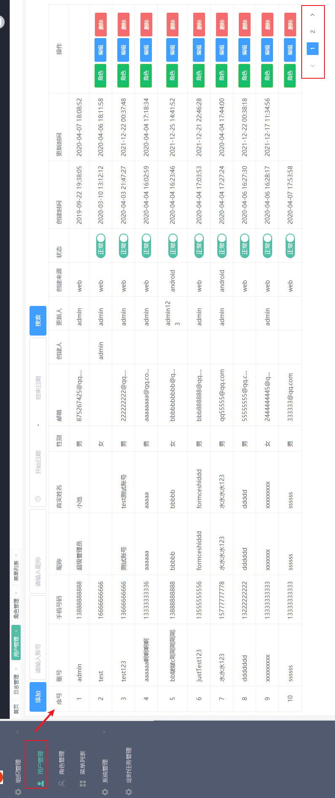

#### 2）接口说明

```text
功能描述：多条件综合查询用户分页信息，条件包含：分页信息 用户创建日期范围
服务路径：/api/users
服务方法：Post
```

请求参数格式：

```json
{
	"pageNum":"1",
	"pageSize":"20",
	"username":"",
	"nickName":"",
	"startTime":"",
	"endTime":""
}
```

响应数据格式：

```json
{
    "code": 1,
    "data": {
        "totalRows": 12,
        "totalPages": 1,
        "pageNum": 1,
        "pageSize": 20,
        "size": 12,
        "rows": [
            {
                "id": 1237361915165020161,
                "username": "admin",
                "password": "$2a$10$JqoiFCw4LUj184ghgynYp.4kW5BVeAZYjKqu7xEKceTaq7X3o4I4W",
                "phone": "13888888888",
                "realName": "小池",
                "nickName": "超级管理员",
                "email": "875267425@qq.com",
                "status": 1,
                "sex": 1,
                "deleted": 1,
                "createId": null,
                "updateId": "1237361915165020161",
                "createWhere": 1,
                "createTime": "2019-09-22T11:38:05.000+00:00",
                "updateTime": "2020-04-07T10:08:52.000+00:00",
                "createUserName": null,
                "updateUserName": "admin"
            },
      		//.....
        ]
    }
}
```


### 1.2 添加用户接口说明

#### 1）原型效果

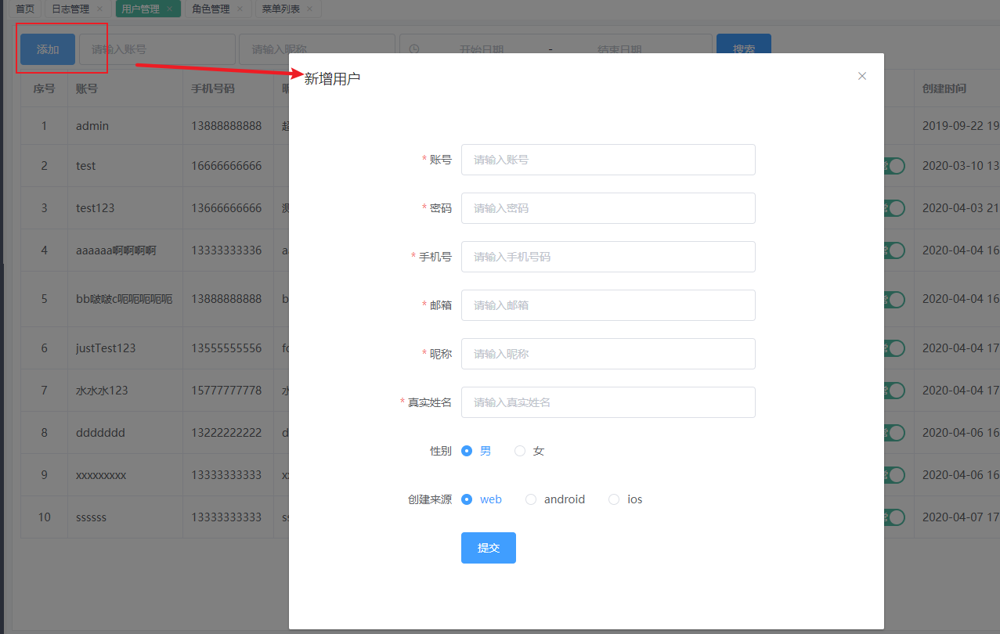

#### 2）接口说明

```
功能描述：添加用户信息
服务路径：/api/user
服务方法：Post
```

请求参数格式：

```
{
	"username":"mike",
	"password":"20",
	"phone":"15367945613",
	"email":"123@qwe.cn",
	"nickName":"jane",
	"realName":"kangkang",
	"sex":"1",
	"createWhere":"1",
	"status":"1"
}
```

响应参数格式：

```
{
    "code": 1,
    "msg": "操作成功"
}
```

### 1.3 获取用户具有的角色信息接口说明

#### 1）原型效果


#### 2）接口说明

```tex
功能描述：获取用户具有的角色信息，以及所有角色信息
服务路径：/user/roles/{userId}
服务方法：Get
请求参数：String userId
```

响应参数格式：

```json
{
"code": 1,
"data": {
    "ownRoleIds": [
        1237258113002901515
    ],
        "allRole": [
        {
            "id": 1237258113002901512,
            "name": "超级管理员",
            "description": "我是超级管理员",
            "status": 1,
            "createTime": "2020-01-06T15:37:45.000+00:00",
            "updateTime": "2021-12-09T23:08:02.000+00:00",
            "deleted": 1
        },
        {
            "id": 1237258113002901513,
            "name": "标记用户角色测试",
            "description": "标记用户角色测试",
            "status": 1,
            "createTime": "2020-01-08T02:53:35.000+00:00",
            "updateTime": "2021-12-28T10:16:21.000+00:00",
            "deleted": 1
        },
       //..............
        
    ]
}
}
```


### 1.4 更新用户角色信息接口说明

#### 1）原型效果


#### 2）接口说明

```
功能描述：更新用户角色信息
服务路径：/user/roles
服务方法：Put
```

请求参数格式：

```yaml
{
    "userId": 
    	1247078461865070592,
    "roleIds": [
        1237258113002901515,
        1245949043784421376
    ]
}
```

响应数据格式：

```
{
    "code": 1,
    "msg": "操作成功"
}
```


### 1.5 批量删除用户信息接口说明

#### 1）原型效果

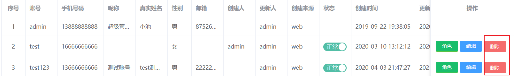

#### 2）接口说明

```json
功能描述： 批量删除用户信息，delete请求可通过请求体携带数据
服务路径：/user
服务方法：Delete
```

请求数据格式：

~~~json
 [
        1473296822679244800,
        1473296022544453632
 ]
~~~

接口提示：请求参数：@RequestBody List<Long> userIds

响应数据格式：

~~~json
{
    "code": 1,
    "msg": "操作成功"
}
~~~


### 1.6 根据用户id查询用户信息

#### 1）原型效果

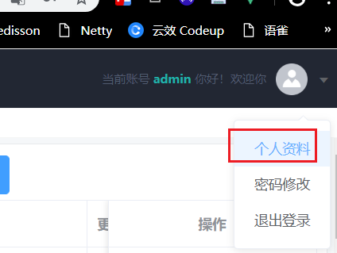

#### 2）接口说明

```
功能描述： 根据用户id查询用户信息
服务路径：/api/user/info/{userId}
服务方法：Get
请求参数：String id
```

响应数据格式：

```
{
    "code": 1,
    "data": {
        "id": "1247515643591397376",
        "username": "admin123",
        "phone": "13699999999",
        "nickName": "admin测试",
        "realName": "admin测试",
        "sex": 1,
        "status": 1,
        "email": "admin123@qq.com"
    }
}
```

### 1.7 更新用户信息

#### 1）原型效果

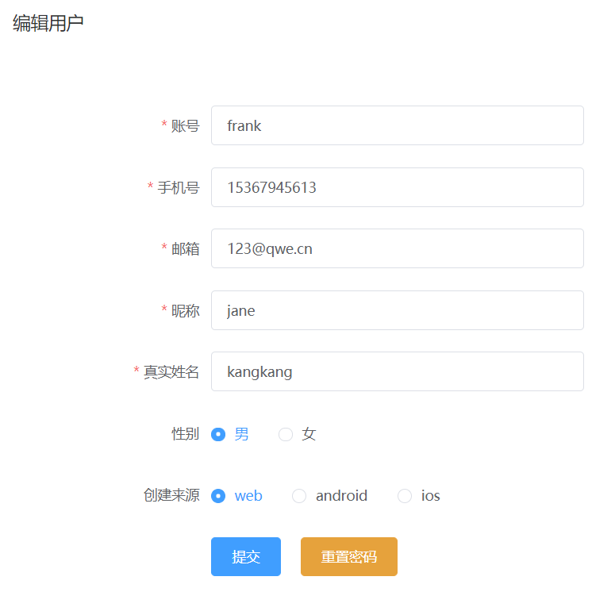

#### 2）接口说明

```
功能描述： 根据id更新用户基本信息
服务路径：/api/user
服务方法：PUT
```

请求参数格式：

~~~json
{
    id: 123456789
    username: 'zhangsan'
    phone: '18811023034'
    email: '345@163.com'
    nickName: '老王'
    realName: '王五'
    sex: '1'
    createWhere: '1'
    status: '1'
}
~~~

响应数据格式：

```
 {    
 	"code": 1,    
 	"msg": "操作成功"
 }
```

# 2.角色管理

## 2.角色处理器

### 2.1 分页查询当前角色信息

#### 1）原型效果

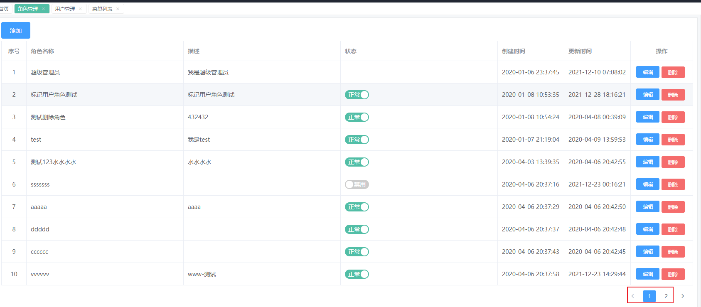

#### 2）接口说明

```
功能描述： 分页查询当前角色信息
服务路径： /api/roles
服务方法：Post
```

请求参数格式：

```
{
	"pageNum":1,
	"pageSize":10
}
```

响应数据格式：

```json
{
    "code": 1,
    "data": {
        "totalRows": 10,
        "totalPages": 1,
        "pageNum": 1,
        "pageSize": 10,
        "size": 10,
        "rows": [
            {
                "id": 1237258113002901512,
                "name": "超级管理员",
                "description": "我是超级管理员",
                "status": 1,
                "createTime": "2020-01-06T15:37:45.000+00:00",
                "updateTime": "2021-12-09T23:08:02.000+00:00",
                "deleted": 1
            },
            {
                "id": 1237258113002901513,
                "name": "标记用户角色测试",
                "description": "标记用户角色测试",
                "status": 1,
                "createTime": "2020-01-08T02:53:35.000+00:00",
                "updateTime": "2021-12-28T10:16:21.000+00:00",
                "deleted": 1
            },
         //.........
        ]
    }
}
```

### 2.2 添加角色回显权限选项功能-1

#### 1）原型效果

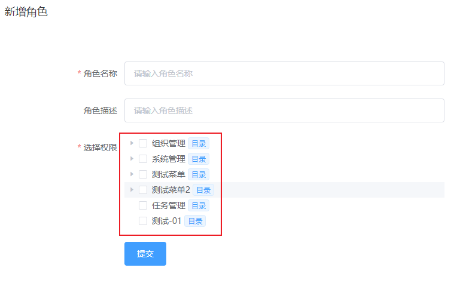

#### 2）接口说明

```
功能描述： 树状结构回显权限集合,底层通过递归获取权限数据集合
服务路径： /api/permissions/tree/all
服务方法：GET
请求参数：无
```

响应格式：

```json
{
    "code": 1,
    "data": [
        {
            "id": "1236916745927790564",
            "title": "组织管理",
            "icon": "el-icon-menu",
            "path": "/org",
            "name": "org",
            "children": [
                {
                    "id": "1236916745927790560",
                    "title": "菜单权限管理",
                    "icon": "el-icon-menu",
                    "path": "/menus",
                    "name": "menus",
                    "children": [
                        {
                            "id": "1236916745927790563",
                            "title": "删除菜单权限",
                            "icon": "",
                            "path": "/api/permission",
                            "name": "",
                            "children": []
                        },
                        {
                            "id": "1236916745927790565",
                            "title": "查询菜单权限列表权限",
                            "icon": "",
                            "path": "/api/permissions",
                            "name": "",
                            "children": []
                        },
                        {
                            "id": "1236916745927790577",
                            "title": "更新菜单权限",
                            "icon": "",
                            "path": "/api/permission",
                            "name": "",
                            "children": []
                        },
                        {
                            "id": "1236916745927790582",
                            "title": "新增菜单权限",
                            "icon": "",
                            "path": "/api/permission",
                            "name": "",
                            "children": []
                        }
                    ]
                },
                {
                    "id": "1236916745927790575",
                    "title": "用户管理",
                    "icon": "el-icon-user-solid",
                    "path": "/user",
                    "name": "user",
                    "children": [
                        {
                            "id": "1236916745927790556",
                            "title": "删除用户权限",
                            "icon": "",
                            "path": "/api/user",
                            "name": "",
                            "children": []
                        },
                        {
                            "id": "1236916745927790561",
                            "title": "新增用户权限",
                            "icon": "",
                            "path": "/api/user",
                            "name": "",
                            "children": []
                        },
                        {
                            "id": "1236916745927790568",
                            "title": "查询用户信息列表权限",
                            "icon": "",
                            "path": "/api/users",
                            "name": "",
                            "children": []
                        },
                        {
                            "id": "1236916745927790579",
                            "title": "赋予用户角色权限",
                            "icon": "",
                            "path": "/api/user/roles",
                            "name": "",
                            "children": []
                        },
                        {
                            "id": "1236916745927790580",
                            "title": "更新用户信息权限",
                            "icon": "",
                            "path": "/api/user",
                            "name": "",
                            "children": []
                        }
                    ]
                },
                {
                    "id": "1236916745927790578",
                    "title": "角色管理",
                    "icon": "el-icon-user",
                    "path": "/roles",
                    "name": "roles",
                    "children": [
                        {
                            "id": "1236916745927790562",
                            "title": "更新角色权限",
                            "icon": "",
                            "path": "/api/role",
                            "name": "",
                            "children": []
                        },
                        {
                            "id": "1236916745927790570",
                            "title": "删除角色权限",
                            "icon": "",
                            "path": "/api/role/*",
                            "name": "",
                            "children": []
                        },
                        {
                            "id": "1236916745927790572",
                            "title": "新增角色权限",
                            "icon": "",
                            "path": "/api/role",
                            "name": "",
                            "children": []
                        },
                        {
                            "id": "1236916745927790574",
                            "title": "角色详情权限",
                            "icon": "",
                            "path": "/api/role/*",
                            "name": "",
                            "children": []
                        },
                        {
                            "id": "1236916745927790583",
                            "title": "查询角色列表权限",
                            "icon": "",
                            "path": "/api/roles",
                            "name": "",
                            "children": []
                        }
                    ]
                }
            ]
        },
        {
          //......
        }
        ]
 }       
```

### 2.2 添加角色和角色关联权限-2

#### 1）原型效果

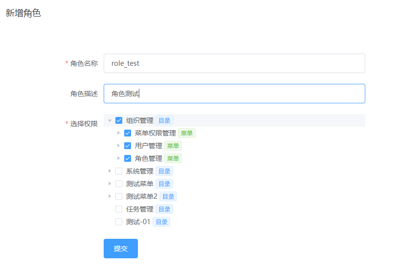

#### 2）接口说明

```
功能描述： 添加角色和角色关联权限
服务路径： /api/role
服务方法：Post
```

请求参数格式：

```
{
	"name":"trevol",
	"description":"I am Trevol",
	"permissionsIds":[
		1236916745927790568,
		1236916745927790564
		]
}
```

响应格式：

```
{
    "code": 1,
    "msg": "操作成功"
}
```

### 2.3 根据角色id查找对应的权限id集合

#### 1）原型效果

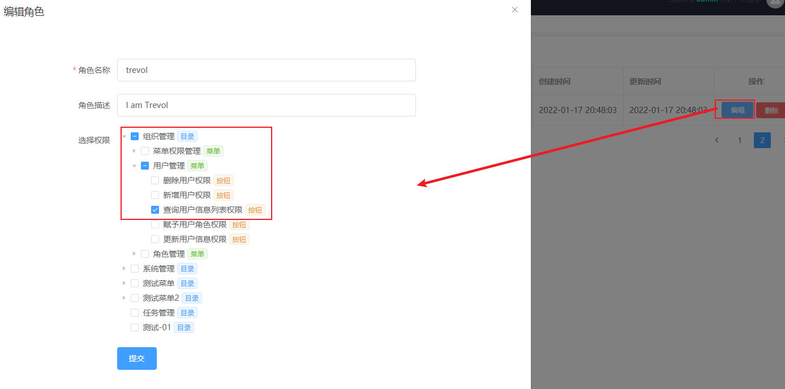

#### 2）接口说明

```
功能描述： 添加角色和角色关联权限
服务路径： /api/role/{roleId}
服务方法：Get
请求参数：String roleId
```

响应数据格式：

```
{
    "code": 1,
    "data": [
        "1236916745927790580",
        "1236916745927790558",
        "1236916745927790556",
        "1236916745927790578",
        "1236916745927790579",
        "1236916745927790557",
        "1236916745927790577"		
        /........
    ]
}
```


### 2.4 更新角色信息，包含角色关联的权限信息

#### 1）原型效果


#### 2）接口说明

```
功能描述： 添加角色和角色关联权限
服务路径： /api/role
服务方法：Put
```

请求参数格式：

```yaml
{
    "id": 1483338014502690844,
    "name": "vvvvvvvvvvvvvvvvvvvvv",
    "description": "vvvvvvvvvvvvvvvvvv",
    "permissionsIds":[
        1236916745927790564,
        1236916745927790577,
        1236916745927790568
    ]
}
```

响应数据类型:

```
{
    "code": 1,
    "msg": "操作成功"
}
```


### 2.5 根据角色id删除角色信息

#### 1）原型效果

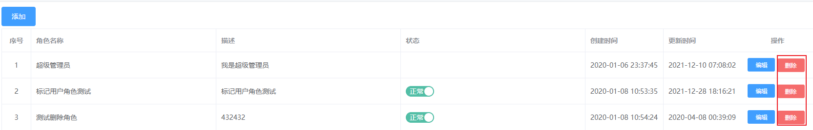

#### 2）接口说明

```
功能描述： 添加角色和角色关联权限
服务路径： /api/role/{roleId}
服务方法：Delete
请求参数：String roleId
```

响应数据类型:

```
{
    "code": 1,
    "msg": "操作成功"
}
```


### 2.6 更新角色的状态信息

#### 1）原型效果

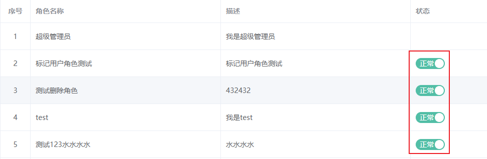

#### 2）接口说明

```
功能描述： 更新用户的状态信息
服务路径： /api/role/{roleId}/{status}
服务方法：Post
```

响应数据类型:

```
{
    "code": 1,
    "msg": "操作成功"
}
```

# 3.权限管理

## 3.权限管理器

### 3.1 权限列表展示功能

#### 1）原型效果

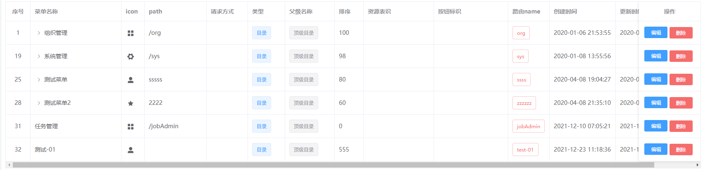

#### 2）接口说明

```
功能描述： 查询所有权限集合
服务路径： /api/permissions
服务方法：Get
请求参数：无
```

响应数据格式:

```Json
{
    "code": 1,
    "data": [
        {
            "id": 1236916745927790556,
            "code": "btn-user-delete",
            "title": "删除用户权限",
            "icon": "",
            "perms": "sys:user:delete",
            "url": "/api/user",
            "method": "DELETE",
            "name": "",
            "pid": 1236916745927790575,
            "orderNum": 100,
            "type": 3,
            "status": 1,
            "createTime": "2020-01-08T07:42:50.000+00:00",
            "updateTime": null,
            "deleted": 1
        },
        {
            "id": 1473855535827783680,
            "code": "",
            "title": "测试-01",
            "icon": "el-icon-user-solid",
            "perms": "",
            "url": null,
            "method": "",
            "name": "test-01",
            "pid": 0,
            "orderNum": 555,
            "type": 1,
            "status": 1,
            "createTime": "2021-12-23T03:18:36.000+00:00",
            "updateTime": "2021-12-23T03:18:36.000+00:00",
            "deleted": 1
        }
        //...............
    ]
}
```

### 3.3 添加权限时回显权限树

#### 1）原型效果

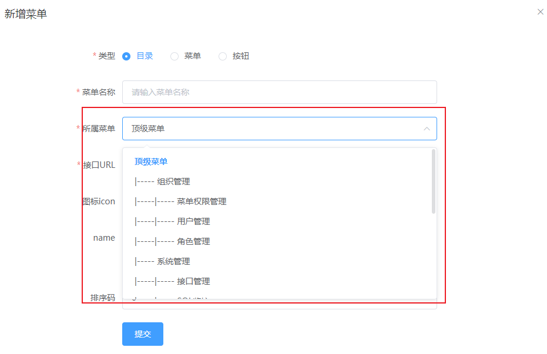

#### 2）接口说明

```
功能描述： 添加权限时回显权限树,仅仅显示目录和菜单
服务路径： /api/permissions/tree
服务方法：Get
请求参数：无
```

响应数据格式:

保证数据顺序；

```json
{
    "code": 1,
    "data": [
        {
            "id": "0",
            "title": "顶级菜单",
            "level": 0
        },
        {
            "id": "1236916745927790564",
            "title": "组织管理",
            "level": 1
        },
        {
            "id": "1236916745927790560",
            "title": "菜单权限管理",
            "level": 2
        },
        {
            "id": "1236916745927790575",
            "title": "用户管理",
            "level": 2
        },
        {
            "id": "1236916745927790578",
            "title": "角色管理",
            "level": 2
        },
        {
            "id": "1236916745927790569",
            "title": "系统管理",
            "level": 1
        },
        {
            "id": "1236916745927790558",
            "title": "接口管理",
            "level": 2
        },
        {
            "id": "1236916745927790571",
            "title": "SQL监控",
            "level": 2
        },
        {
            "id": "1236916745927790589",
            "title": "日志管理",
            "level": 2
        },
        {
            "id": "1247842736313339904",
            "title": "测试菜单",
            "level": 1
        },
        {
            "id": "1247871697634332672",
            "title": "测试子菜单",
            "level": 2
        },
        {
            "id": "1247877926632951808",
            "title": "测试子菜单1",
            "level": 2
        },
        {
            "id": "1247880664557162496",
            "title": "测试菜单2",
            "level": 1
        },
        {
            "id": "1247881176622960640",
            "title": "测试子菜单2",
            "level": 2
        },
        {
            "id": "1247881904334704640",
            "title": "测试子菜单3",
            "level": 2
        },
        {
            "id": "1469201551976435712",
            "title": "任务管理",
            "level": 1
        },
        {
            "id": "1473855535827783680",
            "title": "测试-01",
            "level": 1
        }
    ]
}
```


### 3.4 权限添加按钮

#### 1）原型效果


#### 2）接口说明

```
功能描述： 权限添加按钮
服务路径： /api/permission
服务方法：Post
```

请求参数格式:

```json
{
    "type":"1",		//菜单等级 0 顶级目录 1.目录 2 菜单 3 按钮
    "title":"更新角色权限",
    
     /**
     * 对应资源路径
     *  1.如果类型是目录，则url为空
     *  2.如果类型是菜单，则url对应路由地址
     *  3.如果类型是按钮，则url对应是访问接口的地址
     */
    "pid":1236916745927790560,
 
    "url":"api/permissions/tree",//只有菜单类型有名称，默认是路由的名称
    "name":"org",
    "icon":"el-icon-menu",
    "perms":"sys:role:update",//基于springSecrutiry约定的权限过滤便是
    "method":"DELETE",//请求方式：get put delete post等
    "code":"btn-role-update",//vue按钮回显控制辨识
    "orderNum":100//排序
}
```

​	接口提示：请求参数：@RequestBody PermissionAddVo vo

响应数据格式:

```json
{
    "code": 0,
    "msg": "添加成功"
}
```


### 3.5更新权限

#### 1）原型效果

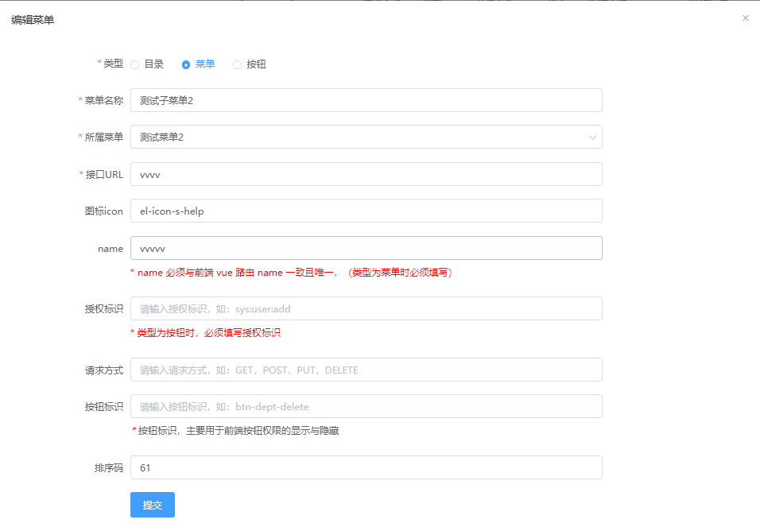

#### 2）接口说明

```
功能描述： 更新权限
服务路径： /api/permission
服务方法：Put
```

请求参数格式:

```json
{
    "id": 1236916745927790556   //权限id
    "type":"1",		//菜单等级 0 顶级目录 1.目录 2 菜单 3 按钮
    "title":"更新角色权限",
    
     /**
     * 对应资源路径
     *  1.如果类型是目录，则url为空
     *  2.如果类型是菜单，则url对应路由地址
     *  3.如果类型是按钮，则url对应是访问接口的地址
     */
    "pid":1236916745927790560,
 
    "url":"api/permissions/tree",//只有菜单类型有名称，默认是路由的名称
    "name":"org",
    "icon":"el-icon-menu",
    "perms":"sys:role:update",//基于springSecrutiry约定的权限过滤便是
    "method":"DELETE",//请求方式：get put delete post等
    "code":"btn-role-update",//vue按钮回显控制辨识
    "orderNum":100//排序
}
```

​	接口提示：请求参数：@RequestBody PermissionUpdateVo vo

响应数据格式:

```json
{
    "code": 0,
    "msg": "添加成功"
}
```

### 3.6 删除权限

#### 1）原型效果

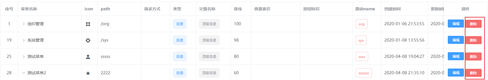

#### 2）接口说明

```
功能描述： 删除权限
服务路径： /api/permission/{permissionId}
服务方法：Delete
```

响应数据格式:

```json
{
    "code": 0,
    "msg": "删除成功"
}
```


#  4.用户操作日志记录功能(扩展)

## 4.1 后端获取当前访问用户信息

补充用户登录功能；

思路：用户登录成功后，将用户的id和name信息经过base64编码，作为票据token响应给前端：

响应格式示例：

~~~json
{
    "code": 1,
    "data": {
        "id": "1237361915165020161",//用户ID
        "username": "admin",//用户名称
        "phone": "13888888888",//手机号
        "nickName": "itheima",//昵称
        "realName": "heima",//真实名称
        "sex": 1,//性别
        "status": 1,//装填
        "email": "875267425@qq.com",//邮件
        "menus": [//权限树（不包含按钮权限）
            {
                "id": "1236916745927790564",//权限ID
                "title": "组织管理",//权限标题
                "icon": "el-icon-star-off",//权限图标（按钮权限无图片）
                "path": "/org",//请求地址
                "name": "org",//权限名称对应前端vue组件名称
                "children": [
                    {
                        "id": "1236916745927790578",
                        "title": "角色管理",
                        "icon": "el-icon-s-promotion",
                        "path": "/roles",
                        "name": "roles",
                        "children": []
                    },
                    {
                        "id": "1236916745927790560",
                        "title": "菜单权限管理",
                        "icon": "el-icon-s-tools",
                        "path": "/menus",
                        "name": "menus",
                        "children": []
                    }
                ]
            },
            {
                "id": "1236916745927790569",
                "title": "账号管理",
                "icon": "el-icon-s-data",
                "path": "/user",
                "name": "user",
                "children": []
            }
        ],
        "permissions": [//按钮权限集合
            "sys:log:delete",//按钮权限security标识
            "sys:user:add",
            "sys:role:update",
            "sys:dept:list"
        ],
      "accessToken":"MTEyMjMzNDQ6emhhbmdzYW4="
    }
}
~~~

说明：accessToken会保存在浏览器前端，同时前端访问后端接口时，会在请求头中携带票据信息，其中请求头中的key为Authorization，value为accessToken对应的值；

后端只需从请求头中获取Authorization对应的值，即可知道当前来自哪个用户的访问了；

base64编码和解码代码如下：

~~~java
    /**
     * 测试base64编码
     */
    @Test
    public void testBase64Encode(){
        String info="11223344:zhangsan";
        String encodeInfo = BaseEncoding.base64().encode(info.getBytes());
        System.out.println(encodeInfo);
        //MTEyMjMzNDQ6emhhbmdzYW4=
    }

    /**
     * @Description 测试base64解码
     */
    @Test
    public void testDecode(){
          String encodeInfo="MTEyMjMzNDQ6emhhbmdzYW4=";
        byte[] decode = BaseEncoding.base64().decode(encodeInfo);
        String info = new String(decode);
        System.out.println(info);
    }
~~~


## 4.2 用户访问日志记录

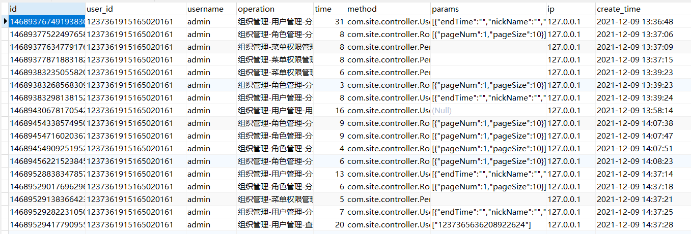

功能要求：

记录用户操作日志流水，包含用户信息 访问接口名称 参数 ip等信息；

技术要求：

1.自定义日志注解；

2.基于SpringMvc拦截器实现；

3.用户信息从请求头的token中获取；

​	3.1 当用户登录成功时，会在响应json数据中返回accessToken信息，token中携带用户的id和name等信息；

​	3.2 用户访问后端接口时，会在请求头中携带该token（前端已经实现）

​	3.3 前端调整：注释掉前端部分代码

4.使用线程异步插入数据，避免阻塞正常业务！

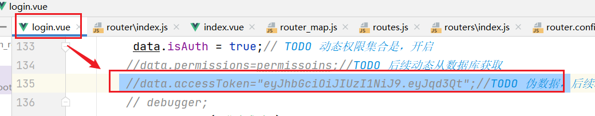

注意事项：HttpServletRequest下获取流数据，默认只加载一次，所以需要重写实现；


