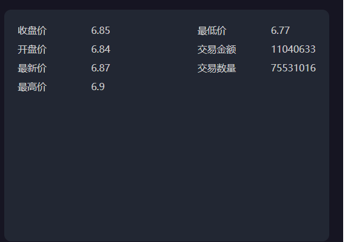
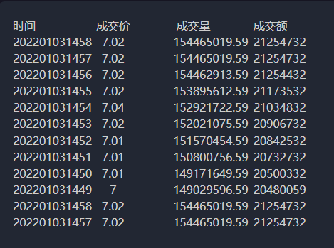
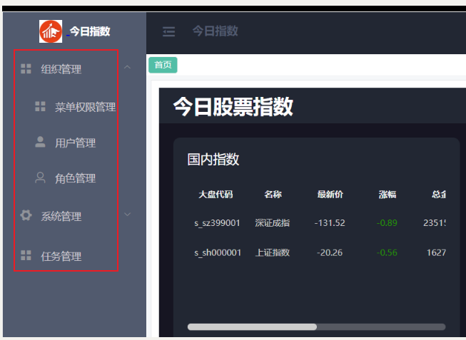
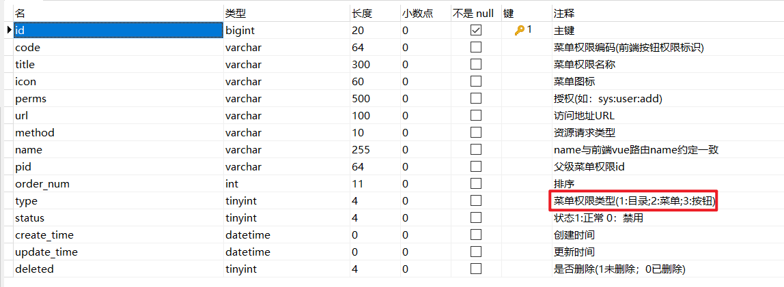
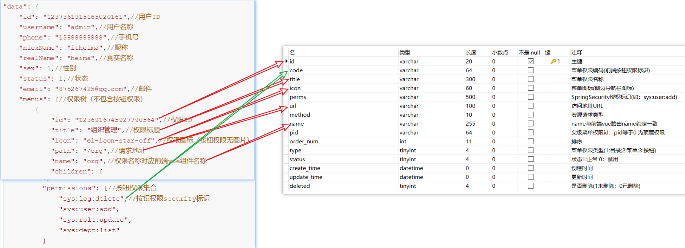
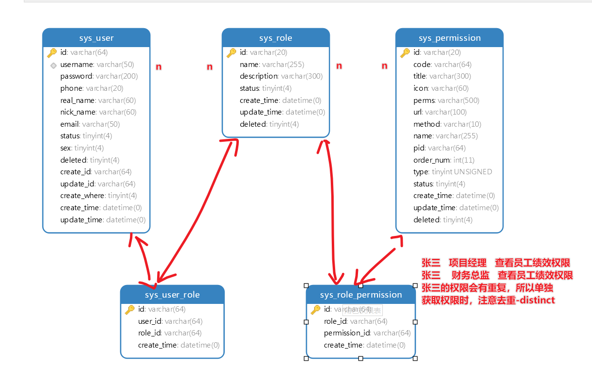
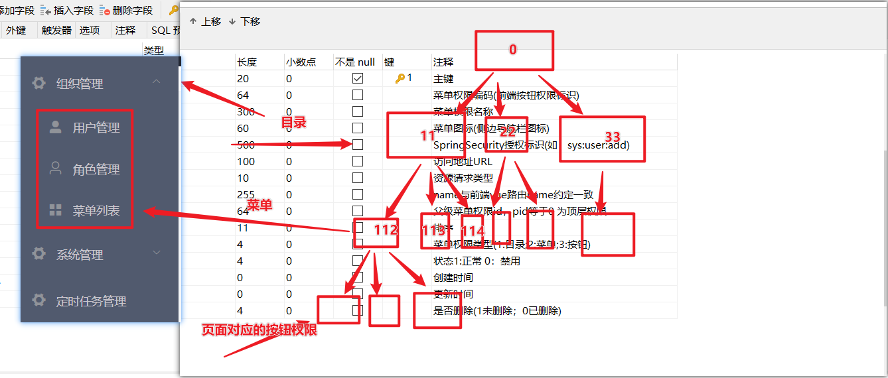

# 今日指数-day08

## 1. 个股最新分时行情数据

### 1.1 个股最新分时行情功能说明

#### 1）个股最新分时行情功能原型

#### 2）个股最新分时行情数据接口分析

~~~json
功能描述：
	获取个股最新分时行情数据，主要包含：
	开盘价、前收盘价、最新价、最高价、最低价、成交金额和成交量、交易时间信息; 
服务路径：/api/quot/stock/screen/second/detail
服务方法：GET
请求参数：code //股票编码
~~~

响应数据格式：

~~~json
R<StockRt>

{
    "code": 1,
    "data": {
        "tradeAmt": 58672751,//最新交易量
        "preClosePrice": 3.89,//前收盘价格
        "lowPrice": 3.89,//最低价
        "highPrice": 3.91,//最高价
        "openPrice": 3.9,//开盘价
        "tradeVol": 228625157,//交易金额
        "tradePrice": 3.9//当前价格
        "curDate": '2022-01-03 14:58'//当前日期
    }
}
~~~

#### 2）注意事项

~~~tex
如果当前日期不在股票交易时间内，则查询最近的股票交易时间的数据回显
~~~

## 2.个股实时交易流水查询

### 2.1 个股实时交易流水查询功能介绍

#### 1）功能原型

#### 2）功能接口说明

~~~tex
功能描述：个股交易流水行情数据查询--查询最新交易流水，按照交易时间降序取前10
服务路径：/quot/stock/screen/second
入参：code  股票编码
服务方法：GET
~~~

响应数据格式：

~~~json
{
    "code": 1,
    "data": [
        {
            "date": "2022-01-03-14:58",//当前时间，精确到分
            "tradeAmt": 58672751,//交易量
            "tradeVol": 228625157,//交易金额
            "tradePrice": 3.9//交易价格
        },
        ...
    ]
}
~~~

## 3.拉取外盘数据功能实现

### 3.1功能分析

国外大盘数据采集与国内大盘数据几乎一致，目前通过sina接口无法获取国外大盘的交易量和交易金额数据，所以针对国外大盘数据，需要单独处理；

注意事项：

​	国外大盘数据接口不提供交易量和交易金额的信息；

字段分析：

~~~javascript
  var hq_str_b_FSSTI="富时新加坡海峡时报指数,3123.68,-2.96,-0.09";
			大盘code      大盘名称       大盘点数    涨跌值    涨幅
~~~

注意：因为外盘的开盘周期不固定的，所以我们就一天仅仅采集一次数据即可；

​	   或者针对不同的外盘，使用不同的采集计划！

> 采集外盘接口：http://hq.sinajs.cn/list=int_dji,int_nasdaq,int_hangseng,int_nikkei,b_FSSTI，其它详见第五天接口说明；

## 4.完善用户登录成功动态回显菜单栏功能

### 1）功能接口说明

~~~tex
功能描述：当前用户登录后，仅仅加载了用户表相关信息，接下来完成的功能是完善用户权限相关的信息；
服务路径：/api/login
请求方式：POST
注意事项：顶级权限（功能菜单项）的pid为0
~~~

对应表表结构：

sys_permissioin表：

接口响应数据格式：

~~~java
{
    "code": 1,
    "data": {
        "id": "1237361915165020161",//用户ID
        "username": "admin",//用户名称
        "phone": "13888888888",//手机号
        "nickName": "itheima",//昵称
        "realName": "heima",//真实名称
        "sex": 1,//性别
        "status": 1,//状态
        "email": "875267425@qq.com",//邮件
        "menus": [//侧边栏权限树（不包含按钮权限）
            {
                "id": "1236916745927790564",//权限ID
                "title": "组织管理",//权限标题
                "icon": "el-icon-star-off",//权限图标（按钮权限无图片）
                "path": "/org",//请求地址
                "name": "org",//权限名称对应前端vue组件名称
                "children": [
                    {
                        "id": "1236916745927790578",
                        "title": "角色管理",
                        "icon": "el-icon-s-promotion",
                        "path": "/roles",
                        "name": "roles",
                        "children": [] // null 则前端展示失败
                    },
                    {
                        "id": "1236916745927790560",
                        "title": "菜单权限管理",
                        "icon": "el-icon-s-tools",
                        "path": "/menus",
                        "name": "menus",
                        "children": [] 
                    }
                ]
            },
            {
                "id": "1236916745927790569",
                "title": "账号管理",
                "icon": "el-icon-s-data",
                "path": "/user",
                "name": "user",
                "children": []
            }
        ],
        "permissions": ["btn-user-delete",//按钮权限标识
                    "btn-log-delete",
                    "btn-user-add",
                    "btn-role-update",
                    "btn-permission-delete",…]
    }
}
~~~

响应结果字段与sys_permission表字段关系：

>实现步骤：
>
>1.根据用户名已经查询了用户信息，且做了用户信息合法性的判断；
>
>2.如果 用户合法，则根据用户的id去数据库查询用户拥有的权限信息集合；
>
>​	根据用户id查询权限信息，数据要注意去重（distinct）
>
>3.递归用户拥有的权限集合，组织出用户的目录-菜单树（不包含按钮权限）---》menus
>
>3.获取按钮权限标识集合（获取权限集合中type=3的权限信息）---》permissions

提示：==用户侧边栏信息先批量查询，然后再通过递归组装数据；==

