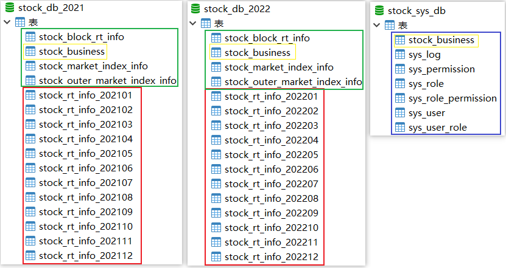
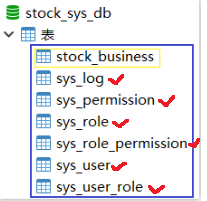
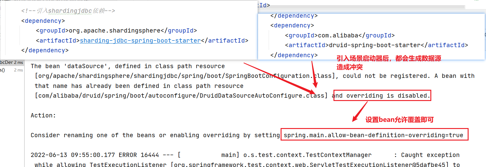
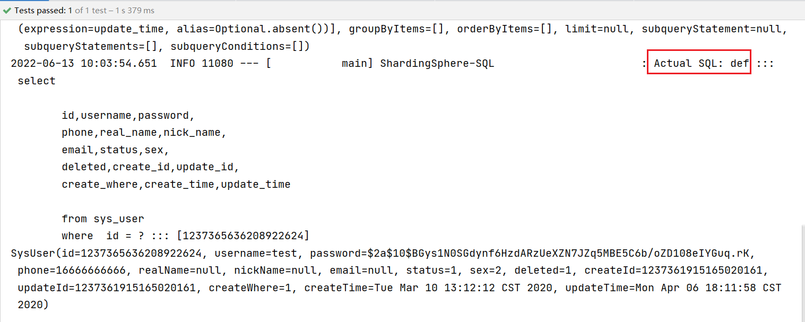
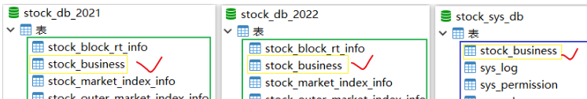
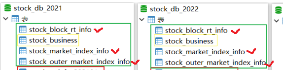
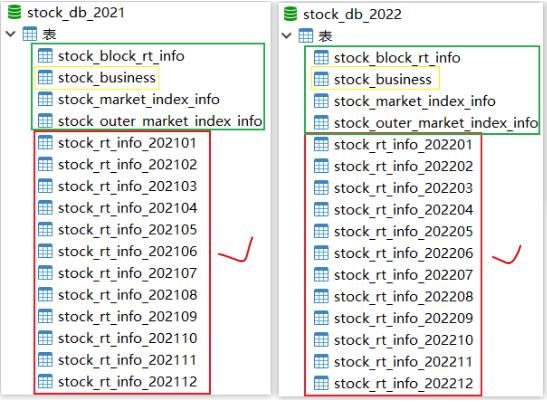

# 项目集成sharding-jdbc

## 目标

1.掌握shardingjdbc标准分片模式；
2.理解项目分库分表的设计思路；
3.理解分库分表代码实现流程；

# 第一章 项目分库分表实现

## 1、股票数据预期增长分析

​	由于今日指数是偏向海量数据分析的产品，而股票的数据会随着时间的积累越来越多，这会严重影响查询性能，所以合理的分库分表规划就迫在眉睫了。

接下来我们分析下股票数据的预期增长情况：

| 表名                                  | 时间周期 | 累计数量                                     | 分库分表策略    |                                |
| ----------------------------------- | ---- | ---------------------------------------- | --------- | ------------------------------ |
| **股票流水表-stock_rt_info**             | 月    | 1(钟)x60（时）x4（天）x21(月)x1500（重点股票）约等于：750W+ | 按年分库，按月分表 |                                |
| 股票主营业务表-stock_business              |      | 3000+                                    | 公共表\|广播表  | 数据量少<br> 数据变化频率低<br> 各个数据库都会用到 |
| 国内大盘流水表-stock_market_index_info     | 年    | 1x60x4x21x12x10约等于：60W+                  | 按年分库不分表   | 方便数据按年维护                       |
| 外盘流水表-stock_outer_market_index_info | 年    | 1x60x4x21x12x10约等于：60W+                  | 按年分库不分表   | 方便数据按年维护                       |
| 股票板块-stock_block_rt_into            | 年    | 1x60x4x21x12x60约等于：360w+                 | 按年分库不分表   | 方便数据按年维护                       |
| 系统表 -sys_log、sys_user、sys_role等     |      | 数据量少                                     | 单库默认数据源   |                                |

>说明：
>
>在数据库运维中，一般将不常用的历史数据会导出到指定格式的文件中，然后压缩保存处理；
>当前项目中的股票数据，同样与时间成正相关。股票数据经过一定的周期后，对于不怎么被使用的数据，一般会导出归档处理；
>
>所以，对于股票相关的流水数据按年分库后，对后续数据库的线性扩容和数据的归档维护都带来极大的便利；

思考：当前我们选择使用**cur_time日期字段作为分库分表的片键**比较合适，那如果使用主键字段作为分片，会存在哪些问题呢？

- 数据库扩容时各节点存储均衡问题
  - 股票数据的持续流入会导致前期分库的各个节点不堪重负，最终势必要进行节点扩容，而新加入的节点和旧的节点之间数据不平衡，需要重新规划，这会导致数据迁移的成本过高；
- 股票查询条件问题
  - 股票数据多以日期作为条件查询，如果基于主键ID作为分片键，则会导致分库的全节点查询，性能开销加大；


## 2、股票数据库表拆分规划

### 2.1 数据分库分表规划

基于上一小节的分析，我们得出一些结论：

- 对于股票流水表按照月维度和年维护进行库表拆分，也就是说一年会产生一个库用于后期数据归档，而每个库下则按照月份产生12张表，对应一年的数据；
- 对于板块表和大盘数据表，我们则以年为单位，与股票流水表年份一致即可，也就是按照年分库分表；
- 对于主营业务表，因为数据量较少，且查询都会用到，作为公共表处理；
- 对于系统表数据量相对较少，作为默认数据源即可；

整体架构如下：



数据详见：**讲义\v-2\资料\今日指数分库分表SQL脚本**

综上，我们以日期时间字段cur_time作为库表的分偏键，分库分表的逻辑存在一定的复杂性，采用标准分片策略比较合适。

### 2.2 分库分表策略规划

​	经过分析发现大盘、板块、股票相关数据的分库策略是一致的，而分表策略则存在部分差异，所以**我们可先定义公共的分库算法类和公共的分表算法类**，对于不一致的，则个别定义即可：

| 表                             | 公共分库算法 | 公共分表算法 | 说明       |
| ----------------------------- | ------ | ------ | -------- |
| stock_block_rt_inf            | 是      | 无      |          |
| stock_market_index_info       | 是      | 无      |          |
| stock_outer_market_index_info | 是      | 无      |          |
| stock_rt_info                 | 是      | 否      | 根据月份分表   |
| stock_business                | 否      | 否      | 公共表\|广播表 |
| 系统管理相关表:sys_user等             | 否      | 否      | 默认数据源    |

## 3、默认数据源配置

### 3.1 工程依赖准备

在stock_common工程导入sharding-jdbc依赖：

~~~xml
<!--引入shardingjdbc依赖-->
<dependency>
  <groupId>org.apache.shardingsphere</groupId>
  <artifactId>sharding-jdbc-spring-boot-starter</artifactId>
</dependency>
~~~

### 3.2 配置默认数据源



系统管理相关的表数据量较少，无需分库分表，所以可作为sharding-jdbc的默认数据源；

在stock_backend工程配置application-sharding.properties：

~~~properties
# 数据源名称，多数据源以逗号分隔
# 注意事项：数据源名称如果存在多个单词，不要使用小驼峰，建议使用中划线间隔(不要使用下划线间隔符）
spring.shardingsphere.datasource.names=df
# 配置默认数据源
# 数据库连接池类名称
spring.shardingsphere.datasource.df.type=com.alibaba.druid.pool.DruidDataSource
# 数据库驱动类名
spring.shardingsphere.datasource.df.driver-class-name=com.mysql.jdbc.Driver
# 数据库 url 连接
spring.shardingsphere.datasource.df.url=jdbc:mysql://192.168.200.132:3306/stock_sys_db?useUnicode=true&characterEncoding=UTF-8&allowMultiQueries=true&useSSL=false&serverTimezone=Asia/Shanghai
# 数据库用户名
spring.shardingsphere.datasource.df.username=root
# 数据库密码
spring.shardingsphere.datasource.df.password=root
# 配置默认数据源
spring.shardingsphere.sharding.default-data-source-name=df
# 是否开启 SQL 显示，默认值: false
spring.shardingsphere.props.sql.show=true
~~~

主配置文件application.yml激活application-sharding.properties配置：

~~~properties
spring.profiles.active=sharding
~~~

同时在application.yml主配置文件中注释掉原有数据源信息！！

### 3.3 默认数据源效果测试

~~~java
@SpringBootTest
public class TestSharding {
    @Autowired
    private SysUserMapper sysUserMapper;
    /**
     * 测试默认数据源
     */
    @Test
    public void testDefaultDs(){
        SysUser user = sysUserMapper.selectByPrimaryKey(1237365636208922624L);
        System.out.println(user);
    }
}
~~~

测试时发现报异常错误：



所以在主配置文件中，配置bean允许被覆盖：

```properties
spring.main.allow-bean-definition-overriding=true
```

最终效果：



## 4、广播表配置

对于stock_business业务表作为广播表处理：



在application-sharding.properties配置其它数据源：

~~~properties
# 第一步：配置shardingjdbc
# 数据源名称，多数据源以逗号分隔(datasource名称不要使用特殊符号)
spring.shardingsphere.datasource.names=ds-2021,ds-2022,df
# 数据库连接池类名称
spring.shardingsphere.datasource.ds-2021.type=com.alibaba.druid.pool.DruidDataSource
# 数据库驱动类名
spring.shardingsphere.datasource.ds-2021.driver-class-name=com.mysql.jdbc.Driver
# 数据库 url 连接
spring.shardingsphere.datasource.ds-2021.url=jdbc:mysql://192.168.200.130:3306/stock_db_2021?useUnicode=true&characterEncoding=UTF-8&allowMultiQueries=true&useSSL=false&serverTimezone=Asia/Shanghai
# 数据库用户名
spring.shardingsphere.datasource.ds-2021.username=root
# 数据库密码
spring.shardingsphere.datasource.ds-2021.password=root

# 数据库连接池类名称
spring.shardingsphere.datasource.ds-2022.type=com.alibaba.druid.pool.DruidDataSource
# 数据库驱动类名
spring.shardingsphere.datasource.ds-2022.driver-class-name=com.mysql.jdbc.Driver
# 数据库 url 连接
spring.shardingsphere.datasource.ds-2022.url=jdbc:mysql://192.168.200.131:3306/stock_db_2022?useUnicode=true&characterEncoding=UTF-8&allowMultiQueries=true&useSSL=false&serverTimezone=Asia/Shanghai
# 数据库用户名
spring.shardingsphere.datasource.ds-2022.username=root
# 数据库密码
spring.shardingsphere.datasource.ds-2022.password=root

# 配置默认数据源
# 数据库连接池类名称
spring.shardingsphere.datasource.df.type=com.alibaba.druid.pool.DruidDataSource
# 数据库驱动类名
spring.shardingsphere.datasource.df.driver-class-name=com.mysql.jdbc.Driver
# 数据库 url 连接
spring.shardingsphere.datasource.df.url=jdbc:mysql://192.168.200.132:3306/stock_sys_db?useUnicode=true&characterEncoding=UTF-8&allowMultiQueries=true&useSSL=false&serverTimezone=Asia/Shanghai
# 数据库用户名
spring.shardingsphere.datasource.df.username=root
# 数据库密码
spring.shardingsphere.datasource.df.password=root

# 配置广播表，如果有多个，以逗号间隔
spring.shardingsphere.sharding.broadcast-tables=stock_business
# 配置默认数据源
spring.shardingsphere.sharding.default-data-source-name=df

# 是否开启 SQL 显示，默认值: false
spring.shardingsphere.props.sql.show=true
~~~

测试广播表：

~~~java
@Autowired
private StockBusinessMapper stockBusinessMapper;
/**
     * @Description 测试广播表
     */
@Test
public void testBroadCastTable(){
  List<StockBusiness> all = stockBusinessMapper.getAll();
  System.out.println(all);
}
~~~

## 5、大盘板块分库分表实现

大盘板块分库分表思路分析：

- 对于stock_block_rt_info等相关表一年产出的数据量不大，所以对这类表只做分库处理，而库内无需做分表处理；
- 大盘板块相关表的分库策略是相同的，所以我们可将分库分表算法抽取出来作为公共算法类，同时库内没有做分表处理，所以无需定义分表策略；
- 主业务工程和定时任务工程都需要分库或分表的算法类，所以我们在common工程下维护；



### 5.1 定义公共分库算法类

在stock_common工程下定义公共分库算法类：

~~~java
package com.itheima.stock.sharding;

import com.google.common.collect.Range;
import org.apache.shardingsphere.api.sharding.standard.PreciseShardingAlgorithm;
import org.apache.shardingsphere.api.sharding.standard.PreciseShardingValue;
import org.apache.shardingsphere.api.sharding.standard.RangeShardingAlgorithm;
import org.apache.shardingsphere.api.sharding.standard.RangeShardingValue;
import org.joda.time.DateTime;

import java.util.Collection;
import java.util.Date;
import java.util.Optional;
import java.util.stream.Collectors;

/**
 * @author by itheima
 * @Date 2022/6/13
 * @Description 定义公共的数据库分片算法类：包含精准匹配数据库和范围匹配数据库
 *  因为分库是根据日期分库的，一年一个库，所以片键的类型是Date
 */
public class CommonShardingAlgorithm4Db implements PreciseShardingAlgorithm<Date>, RangeShardingAlgorithm<Date> {

    /**
     * 精准匹配数据库的方法 cur_time 条件必须是 = 或者in
     * @param dsNames 所有可匹配数据源的集合 ds-2021 ds-2022
     * @param shardingValue
     * @return
     */
    @Override
    public String doSharding(Collection<String> dsNames, PreciseShardingValue<Date> shardingValue) {
        //1.思路：根据传入的日期值，获取年份字符串
        //获取分片字段的名称colume
//        String columnName = shardingValue.getColumnName();
        //获取逻辑表名称
//        String logicTableName = shardingValue.getLogicTableName();
        //获取分片值
        Date value = shardingValue.getValue();
        //获取年份字符串
        String year = new DateTime(value).getYear()+"";
        //2.获取数据源中以
        Optional<String> optional = dsNames.stream().filter(ds -> ds.endsWith(year)).findFirst();
        String actual=null;
        //判断是否有符合指定年份的数据源
        if (optional.isPresent()) {
            actual=optional.get();
        }
        return actual;
    }

    /**
     * 范围查询匹配数据源 关键字：between and
     * @param dsNames ds-2021 ds-2022
     * @param shardingValue
     * @return
     */
    @Override
    public Collection<String> doSharding(Collection<String> dsNames, RangeShardingValue<Date> shardingValue) {
        //获取分片字段名称
//        String columnName = shardingValue.getColumnName();
//        //获取逻辑表名称
//        String logicTableName = shardingValue.getLogicTableName();
        //1.获取范围封装对象
        Range<Date> valueRange = shardingValue.getValueRange();
        //2.1 判断是否有下限值
        if (valueRange.hasLowerBound()) {
            //获取下限日期
            Date lowerDate = valueRange.lowerEndpoint();
            //获取年份  dsNames--> ds_2021 ds_2022 ds_2023
            int year = new DateTime(lowerDate).getYear();//2022
            dsNames= dsNames.stream().filter(dsName->Integer.valueOf(dsName.substring(dsName.lastIndexOf("-")+1))>=year)
                    .collect(Collectors.toList());
        }
        //2.2 判断是否有上限值
        if (valueRange.hasUpperBound()) {
            Date upperDate = valueRange.upperEndpoint();
            int year = new DateTime(upperDate).getYear();
            dsNames= dsNames.stream().filter(dsName->Integer.valueOf(dsName.substring(dsName.lastIndexOf("-")+1))<=year)
                    .collect(Collectors.toList());
        }

        return dsNames;
    }
}
~~~

### 5.2 配置properties

在stock_backend工程下配置application-sharding.properties：

~~~properties
# 第二步：配置板块表的数据节点信息
spring.shardingsphere.sharding.tables.stock_block_rt_info.actual-data-nodes=ds-${2021..2022}.stock_block_rt_info
spring.shardingsphere.sharding.tables.stock_market_index_info.actual-data-nodes=ds-${2021..2022}.stock_market_index_info
spring.shardingsphere.sharding.tables.stock_outer_market_index_info.actual-data-nodes=ds-${2021..2022}.stock_outer_market_index_info

# 提取公共数据库分片算法配置类
common.algorithm4db=com.itheima.stock.sharding.CommonShardingAlgorithm4Db
common.algorithm4StockRtInfoTable=com.itheima.stock.sharding.ShardingAlgorithm4StockRtInfoTable

# 第三步：配置数据库的分片算法
# 分片列名称
spring.shardingsphere.sharding.tables.stock_block_rt_info.database-strategy.standard.sharding-column=cur_time
# 精确分片算法类名称，用于 = 和 IN。该类需实现 PreciseShardingAlgorithm 接口并提供无参数的构造器
spring.shardingsphere.sharding.tables.stock_block_rt_info.database-strategy.standard.precise-algorithm-class-name=${common.algorithm4db}
# 范围分片算法类名称，用于 BETWEEN，可选。该类需实现 RangeShardingAlgorithm 接口并提供无参数的构造器
spring.shardingsphere.sharding.tables.stock_block_rt_info.database-strategy.standard.range-algorithm-class-name=${common.algorithm4db}

spring.shardingsphere.sharding.tables.stock_market_index_info.database-strategy.standard.sharding-column=cur_time
# 精确分片算法类名称，用于 = 和 IN。该类需实现 PreciseShardingAlgorithm 接口并提供无参数的构造器
spring.shardingsphere.sharding.tables.stock_market_index_info.database-strategy.standard.precise-algorithm-class-name=${common.algorithm4db}
# 范围分片算法类名称，用于 BETWEEN，可选。该类需实现 RangeShardingAlgorithm 接口并提供无参数的构造器
spring.shardingsphere.sharding.tables.stock_market_index_info.database-strategy.standard.range-algorithm-class-name=${common.algorithm4db}

spring.shardingsphere.sharding.tables.stock_outer_market_index_info.database-strategy.standard.sharding-column=cur_time
# 精确分片算法类名称，用于 = 和 IN。该类需实现 PreciseShardingAlgorithm 接口并提供无参数的构造器
spring.shardingsphere.sharding.tables.stock_outer_market_index_info.database-strategy.standard.precise-algorithm-class-name=${common.algorithm4db}
# 范围分片算法类名称，用于 BETWEEN，可选。该类需实现 RangeShardingAlgorithm 接口并提供无参数的构造器
spring.shardingsphere.sharding.tables.stock_outer_market_index_info.database-strategy.standard.range-algorithm-class-name=${common.algorithm4db}
~~~

### 5.3 功能测试

```java
@Autowired
private StockBlockRtInfoMapper stockBlockRtInfoMapper;
@Test
public void testCommonSharding(){
  Date curDate= DateTime.parse("2022-01-03 09:30:00", DateTimeFormat.forPattern("yyyy-MM-dd HH:mm:ss")).toDate();
  List<StockBlockDomain> info = stockBlockRtInfoMapper.findBlockInfoByTimeLimit(curDate);
  System.out.println(info);
}
```

## 6、个股表分库分表配置

对于个股流水表来说分库策略与大盘板块一致，所以接下来，我们只定义好分表策略即可。



### 6.1 定义个股表公共分表策略

在stock_common工程下将精准和范围匹配表的接口实现合并到一个算法类下：

~~~java
package com.itheima.stock.sharding;

import com.google.common.collect.Range;
import org.apache.shardingsphere.api.sharding.standard.PreciseShardingAlgorithm;
import org.apache.shardingsphere.api.sharding.standard.PreciseShardingValue;
import org.apache.shardingsphere.api.sharding.standard.RangeShardingAlgorithm;
import org.apache.shardingsphere.api.sharding.standard.RangeShardingValue;
import org.joda.time.DateTime;
import org.joda.time.format.DateTimeFormat;

import java.util.Collection;
import java.util.Date;
import java.util.Optional;
import java.util.stream.Collectors;

/**
 * @author by itheima
 * @Date 2022/6/13
 * @Description 定义股票流水表的分片算法类：包含精准匹配表和范围匹配表
 *  因为分库是根据日期分库的，一年一个库，一个月一张表，也就是说每个库内都包含12张表，所以片键的类型是Date
 */
public class ShardingAlgorithm4StockRtInfoTable implements PreciseShardingAlgorithm<Date>, RangeShardingAlgorithm<Date> {

    /**
     * 精准匹配表的方法 cur_time 条件必须是 = 或者in
     * @param tbNames 所有可匹配表的集合 stock_rt_info_202101....stock_rt_info_202112
     *                                stock_rt_info_202201....stock_rt_info_202212
     * @param shardingValue
     * @return
     */
    @Override
    public String doSharding(Collection<String> tbNames, PreciseShardingValue<Date> shardingValue) {
        //1.思路：根据传入的日期值，获取年份字符串
        //获取分片字段的名称colume
//        String columnName = shardingValue.getColumnName();
        //获取逻辑表名称
//        String logicTableName = shardingValue.getLogicTableName();
        //获取分片值
        Date value = shardingValue.getValue();
        //获取年月组成的字符串
        String yearMonth = new DateTime(value).toString(DateTimeFormat.forPattern("yyyyMM"));
        //过滤表的名称集合，获取名称后缀与yearMonth一致的表名称
        Optional<String> optional = tbNames.stream().filter(tbName -> tbName.endsWith(yearMonth)).findFirst();
        String tbName=null;
        if (optional.isPresent()) {
            tbName=optional.get();
        }
        return tbName;
    }

    /**
     * 范围查询匹配表 关键字：between and
     * @param tbNames 所有可匹配表的集合 stock_rt_info_202101....stock_rt_info_202112
     *                                stock_rt_info_202201....stock_rt_info_202212
     * @param shardingValue
     * @return
     */
    @Override
    public Collection<String> doSharding(Collection<String> tbNames, RangeShardingValue<Date> shardingValue) {
        //获取分片字段名称
//        String columnName = shardingValue.getColumnName();
//        //获取逻辑表名称
//        String logicTableName = shardingValue.getLogicTableName();
        //1.获取范围封装对象
        Range<Date> valueRange = shardingValue.getValueRange();
        //2.1 判断是否有下限值
        if (valueRange.hasLowerBound()) {
            //获取下限日期
            Date lowerDate = valueRange.lowerEndpoint();
            //获取年份  dsNames--> ds_2021 ds_2022 ds_2023
            //获取年月组成的字符串
            String yearMonth = new DateTime(lowerDate).toString(DateTimeFormat.forPattern("yyyyMM"));
            Integer yearM = Integer.valueOf(yearMonth);
            tbNames= tbNames.stream().filter(tbName->Integer.valueOf(tbName.substring(tbName.lastIndexOf("_")+1))>=yearM)
                    .collect(Collectors.toList());
        }
        //2.2 判断是否有上限值
        if (valueRange.hasUpperBound()) {
            Date upperDate = valueRange.upperEndpoint();
            String yearMonth = new DateTime(upperDate).toString(DateTimeFormat.forPattern("yyyyMM"));
            Integer yearM = Integer.valueOf(yearMonth);
            tbNames= tbNames.stream().filter(tbName->Integer.valueOf(tbName.substring(tbName.lastIndexOf("_")+1))<=yearM)
                    .collect(Collectors.toList());
        }
        return tbNames;
    }
}
~~~

### 6.2  配置个股分库分表

在stock_backend工程下配置分库分表策略：

~~~properties
# 配置股票流水节点信息
spring.shardingsphere.sharding.tables.stock_rt_info.actual-data-nodes=ds-2021.stock_rt_info_${202101..202112},ds-2022.stock_rt_info_${202201..202212}
# 抽取公共配置类变量
common.algorithm4StockRtInfoTable=com.itheima.stock.sharding.ShardingAlgorithm4StockRtInfoTable
# 配置股票流水库分片策略
spring.shardingsphere.sharding.tables.stock_rt_info.database-strategy.standard.sharding-column=cur_time
# 精确分片算法类名称，用于 = 和 IN。该类需实现 PreciseShardingAlgorithm 接口并提供无参数的构造器
spring.shardingsphere.sharding.tables.stock_rt_info.database-strategy.standard.precise-algorithm-class-name=${common.algorithm4db}
# 范围分片算法类名称，用于 BETWEEN，可选。该类需实现 RangeShardingAlgorithm 接口并提供无参数的构造器
spring.shardingsphere.sharding.tables.stock_rt_info.database-strategy.standard.range-algorithm-class-name=${common.algorithm4db}

# 第四步：配置表的分片算法
# 因为stock_block_rt_info板块表仅仅按照年分库，并没有库内分片的操作，也就是说每个库内的表名称都一样，且只有一个，所以不需要定义分表的算法类
# 配置股票流水表的分片算法
spring.shardingsphere.sharding.tables.stock_rt_info.table-strategy.standard.sharding-column=cur_time
# 精确分片算法类名称，用于 = 和 IN。该类需实现 PreciseShardingAlgorithm 接口并提供无参数的构造器
spring.shardingsphere.sharding.tables.stock_rt_info.table-strategy.standard.precise-algorithm-class-name=${common.algorithm4StockRtInfoTable}
# 范围分片算法类名称，用于 BETWEEN，可选。该类需实现 RangeShardingAlgorithm 接口并提供无参数的构造器
spring.shardingsphere.sharding.tables.stock_rt_info.table-strategy.standard.range-algorithm-class-name=${common.algorithm4StockRtInfoTable}
~~~

### 6.3测试

~~~java
    @Autowired
    private StockRtInfoMapper stockRtInfoMapper;

    /**
     * @Description 测试分库分表算法类
     */
    @Test
    public void testShardingDbAndTb(){
        //截止时间
        Date endTime=DateTime.parse("2022-05-22 09:30:00",DateTimeFormat.forPattern("yyyy-MM-dd HH:mm:ss")).toDate();
        //开始时间
        Date startTime=DateTime.parse("2021-01-01 09:30:00",DateTimeFormat.forPattern("yyyy-MM-dd HH:mm:ss")).toDate();
        //根据指定日期范围查询周K线数据
        List<Stock4EvrWeekDomain> infos=stockRtInfoMapper.getHalfWeekLineData("000017",startTime,endTime);
        System.out.println(infos);
    }
~~~

最终application-shrding.properties配置：

~~~properties
# 第一步：配置默认数据源
spring.shardingsphere.datasource.names=def,ds-2021,ds-2022
# 数据库连接池类名称
spring.shardingsphere.datasource.def.type=com.alibaba.druid.pool.DruidDataSource
# 数据库驱动类名
spring.shardingsphere.datasource.def.driver-class-name=com.mysql.jdbc.Driver
# 数据库 url 连接
spring.shardingsphere.datasource.def.url=jdbc:mysql://192.168.200.132:3306/stock_sys_db?useUnicode=true&characterEncoding=UTF-8&allowMultiQueries=true&useSSL=false&serverTimezone=Asia/Shanghai
# 数据库用户名
spring.shardingsphere.datasource.def.username=root
# 数据库密码
spring.shardingsphere.datasource.def.password=root

# 数据库连接池类名称
spring.shardingsphere.datasource.ds-2021.type=com.alibaba.druid.pool.DruidDataSource
# 数据库驱动类名
spring.shardingsphere.datasource.ds-2021.driver-class-name=com.mysql.jdbc.Driver
# 数据库 url 连接
spring.shardingsphere.datasource.ds-2021.url=jdbc:mysql://192.168.200.130:3306/stock_db_2021?useUnicode=true&characterEncoding=UTF-8&allowMultiQueries=true&useSSL=false&serverTimezone=Asia/Shanghai
# 数据库用户名
spring.shardingsphere.datasource.ds-2021.username=root
# 数据库密码
spring.shardingsphere.datasource.ds-2021.password=root

# 数据库连接池类名称
spring.shardingsphere.datasource.ds-2022.type=com.alibaba.druid.pool.DruidDataSource
# 数据库驱动类名
spring.shardingsphere.datasource.ds-2022.driver-class-name=com.mysql.jdbc.Driver
# 数据库 url 连接
spring.shardingsphere.datasource.ds-2022.url=jdbc:mysql://192.168.200.131:3306/stock_db_2022?useUnicode=true&characterEncoding=UTF-8&allowMultiQueries=true&useSSL=false&serverTimezone=Asia/Shanghai
# 数据库用户名
spring.shardingsphere.datasource.ds-2022.username=root
# 数据库密码
spring.shardingsphere.datasource.ds-2022.password=root

# 第二步：配置板块表的数据节点信息
spring.shardingsphere.sharding.tables.stock_block_rt_info.actual-data-nodes=ds-${2021..2022}.stock_block_rt_info
spring.shardingsphere.sharding.tables.stock_market_index_info.actual-data-nodes=ds-${2021..2022}.stock_market_index_info
spring.shardingsphere.sharding.tables.stock_outer_market_index_info.actual-data-nodes=ds-${2021..2022}.stock_outer_market_index_info
# 配置股票流水节点信息
spring.shardingsphere.sharding.tables.stock_rt_info.actual-data-nodes=ds-2021.stock_rt_info_${202101..202112},ds-2022.stock_rt_info_${202201..202212}

# 提取公共数据库分片算法配置类
common.algorithm4db=com.itheima.stock.sharding.CommonShardingAlgorithm4Db
common.algorithm4StockRtInfoTable=com.itheima.stock.sharding.ShardingAlgorithm4StockRtInfoTable

# 第三步：配置数据库的分片算法
# 分片列名称
spring.shardingsphere.sharding.tables.stock_block_rt_info.database-strategy.standard.sharding-column=cur_time
# 精确分片算法类名称，用于 = 和 IN。该类需实现 PreciseShardingAlgorithm 接口并提供无参数的构造器
spring.shardingsphere.sharding.tables.stock_block_rt_info.database-strategy.standard.precise-algorithm-class-name=${common.algorithm4db}
# 范围分片算法类名称，用于 BETWEEN，可选。该类需实现 RangeShardingAlgorithm 接口并提供无参数的构造器
spring.shardingsphere.sharding.tables.stock_block_rt_info.database-strategy.standard.range-algorithm-class-name=${common.algorithm4db}

spring.shardingsphere.sharding.tables.stock_market_index_info.database-strategy.standard.sharding-column=cur_time
# 精确分片算法类名称，用于 = 和 IN。该类需实现 PreciseShardingAlgorithm 接口并提供无参数的构造器
spring.shardingsphere.sharding.tables.stock_market_index_info.database-strategy.standard.precise-algorithm-class-name=${common.algorithm4db}
# 范围分片算法类名称，用于 BETWEEN，可选。该类需实现 RangeShardingAlgorithm 接口并提供无参数的构造器
spring.shardingsphere.sharding.tables.stock_market_index_info.database-strategy.standard.range-algorithm-class-name=${common.algorithm4db}

spring.shardingsphere.sharding.tables.stock_outer_market_index_info.database-strategy.standard.sharding-column=cur_time
# 精确分片算法类名称，用于 = 和 IN。该类需实现 PreciseShardingAlgorithm 接口并提供无参数的构造器
spring.shardingsphere.sharding.tables.stock_outer_market_index_info.database-strategy.standard.precise-algorithm-class-name=${common.algorithm4db}
# 范围分片算法类名称，用于 BETWEEN，可选。该类需实现 RangeShardingAlgorithm 接口并提供无参数的构造器
spring.shardingsphere.sharding.tables.stock_outer_market_index_info.database-strategy.standard.range-algorithm-class-name=${common.algorithm4db}

spring.shardingsphere.sharding.tables.stock_rt_info.database-strategy.standard.sharding-column=cur_time
# 精确分片算法类名称，用于 = 和 IN。该类需实现 PreciseShardingAlgorithm 接口并提供无参数的构造器
spring.shardingsphere.sharding.tables.stock_rt_info.database-strategy.standard.precise-algorithm-class-name=${common.algorithm4db}
# 范围分片算法类名称，用于 BETWEEN，可选。该类需实现 RangeShardingAlgorithm 接口并提供无参数的构造器
spring.shardingsphere.sharding.tables.stock_rt_info.database-strategy.standard.range-algorithm-class-name=${common.algorithm4db}

# 第四步：配置表的分片算法
# 因为stock_block_rt_info板块表仅仅按照年分库，并没有库内分片的操作，也就是说每个库内的表名称都一样，且只有一个，所以不需要定义分表的算法类
# 配置股票流水表的分片算法
spring.shardingsphere.sharding.tables.stock_rt_info.table-strategy.standard.sharding-column=cur_time
# 精确分片算法类名称，用于 = 和 IN。该类需实现 PreciseShardingAlgorithm 接口并提供无参数的构造器
spring.shardingsphere.sharding.tables.stock_rt_info.table-strategy.standard.precise-algorithm-class-name=${common.algorithm4StockRtInfoTable}
# 范围分片算法类名称，用于 BETWEEN，可选。该类需实现 RangeShardingAlgorithm 接口并提供无参数的构造器
spring.shardingsphere.sharding.tables.stock_rt_info.table-strategy.standard.range-algorithm-class-name=${common.algorithm4StockRtInfoTable}

# 指定默认数据源
# 未配置分片规则的表将通过默认数据源定位
spring.shardingsphere.sharding.default-data-source-name=def
# 配置广播表
spring.shardingsphere.sharding.broadcast-tables=stock_business

# 是否开启 SQL 显示，默认值: false
spring.shardingsphere.props.sql.show=true
~~~

## 7、股票任务采集工程集成

对于stock_job工程，同样升级到分库分表的环境，只需将stock_backend的配置复制一份即可；

（略）

## 8、分库分表注意事项

基于sharding-jdbc实践分库分表注意事项：

- 条件查询时分片字段不要使用函数处理，否则分片算法失效，导致全节点查询

  - 举例：select * from stock_rt_info where date_format(cur_time,‘%Y%m%d’)='20220910'  ,函数会造成sharding的分片失效，导致全节点查询；
  - 同时在索引角度看，如果查询的分片字段使用函数，会导致索引失效，导致查询性能较低；
- 条件查询时尽量使用符合sharding分片条件的关键字

  - 精准查询尽量使用in =,而范围查询尽量使用between ；
- sharding-jdbc对嵌套查询处理不友好
  - 如果嵌套查询的话，那么最好子查询的条件只命中单张表。如果子查询的条件关联了多张表，那么交易分步骤拆分实现；
  - 示例：我们项目中的K线统计中，需要将SQL拆分，然后分步骤实现；