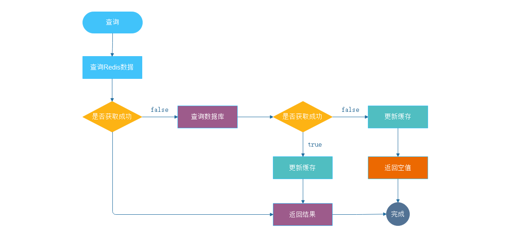
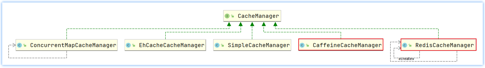
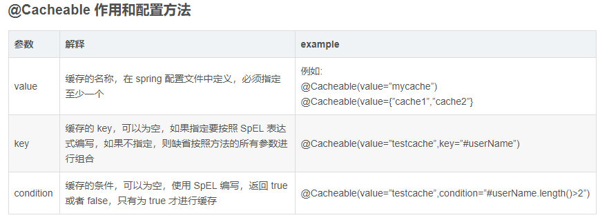
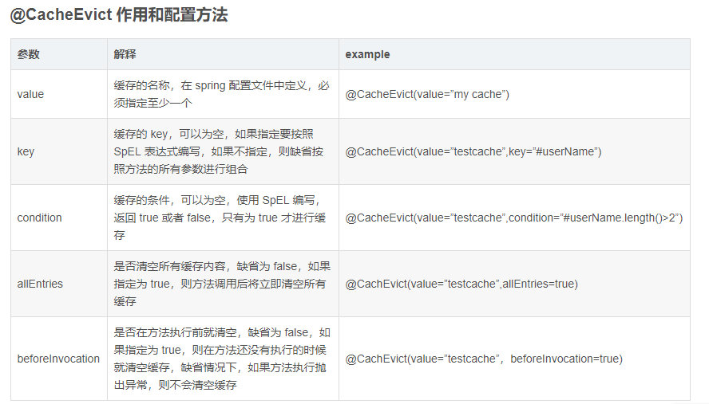
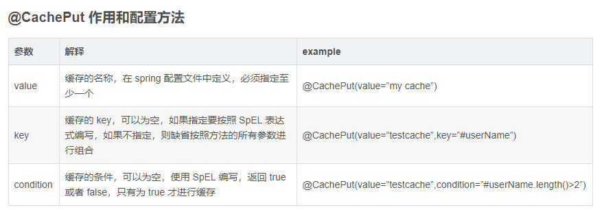
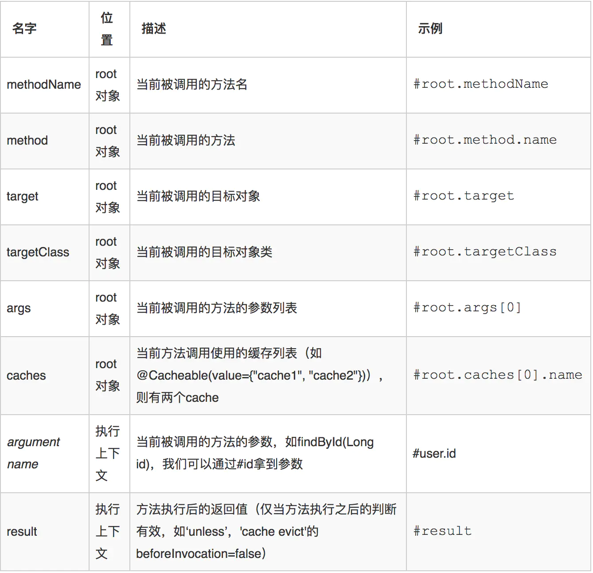
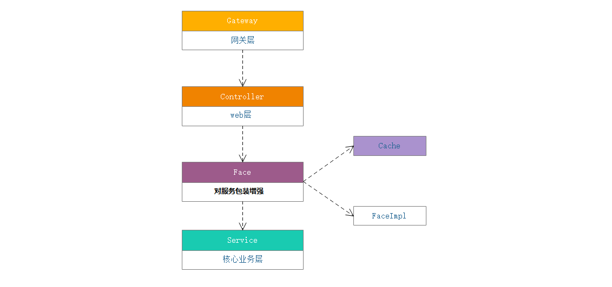
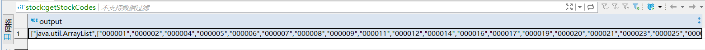

# SpringCache缓存专题

**学习目标**

1、理解缓存存在的意义

2、掌握redis与SpringCache的集成方式

3、掌握SpringCache注解的使用

4、掌握项目集成SpringCache流程

# 第一章 基于SpringCache缓存方案

## 1.为什么需要缓存

​	前台请求，后台先从缓存中取数据，取到直接返回结果，取不到时从数据库中取，数据库取到更新缓存，并返回结果，数据库也没取到，那直接返回空结果：




使用缓存是一个很“高性价比”的性能优化方式，尤其是对于有大量重复查询的程序来说。通常来说，在WEB后端应用程序来说，

**耗时比较大的往往有两个地方：**

1、查数据库；

2、调用其它服务的API（因为其它服务最终也要去做查数据库等耗时操作）；

**重复查询也有两种：**

1、我们在应用程序中代码写得不好，写的for循环，可能每次循环都用重复的参数去查询了。

2、大量的相同或相似请求造成的。比如资讯网站首页的文章列表、电商网站首页的商品列表、微博等社交媒体热搜的文章等等，当大量的用户都去请求同样的接口，同样的数据，如果每次都去查数据库，那对数据库来说是一个不可承受的压力。所以我们通常会把高频的查询进行缓存，我们称它为“热点”。


## 2.SpringCache概述

​	前面提到了缓存有诸多的好处，于是大家就摩拳擦掌准备给自己的应用加上缓存的功能。但是网上一搜却发现缓存的框架太多了，各有各的优势，比如==Redis[中央缓存-远程缓存]==、Memcached、Guava、Caffeine[本地缓存]等等。

​	如果我们的程序想要使用缓存，就要与这些框架耦合。聪明的架构师已经在利用接口来降低耦合了，利用面向对象的抽象和多态的特性，做到业务代码与具体的框架分离。

​	但我们仍然需要显式地在代码中去调用与缓存有关的接口和方法，在合适的时候插入数据到缓存里，在合适的时候从缓存中读取数据。想一想**「AOP」**的适用场景，这不就是天生就应该AOP去做的吗？

​	自Spring 3.1起，提供了类似于 @Transactional 注解事务的注解Cache支持，且提供了Cache抽象，在此之前一般通过AOP实现。

使用Spring Cache的好处：

- 提供基本的Cache抽象，方便切换各种底层Cache；
- 通过注解Cache可以实现类似于事务一样，缓存逻辑透明的应用到我们的业务代码上，且只需要更少的代码就可以完成；
- 提供事务回滚时也自动回滚缓存；
- 支持比较复杂的缓存逻辑；


### 2.1SpringCache概述及核心配置

​	Spring Cache就是一个缓存框架。它利用了AOP（**将缓存逻辑与服务逻辑解耦**），实现了基于注解的缓存功能（声明式缓存），并且进行了合理的抽象，业务代码不用关心底层是使用了什么缓存框架，只需要简单地加一个注解，就能实现缓存功能了。而且Spring Cache也提供了很多默认的配置，用户可以快速将缓存集成到项目中；

接下来，我们以一个很小的例子给大家讲解SpringCache的快速使用；

### 2.2. SpringCache环境准备

导入:**day12\SpringCache缓存专题\代码\springboot-cache**项目代码；

核心步骤如下：

#### 2.2.1 缓存依赖导入

~~~xml
<dependency>
  <groupId>org.springframework.boot</groupId>
  <artifactId>spring-boot-starter-cache</artifactId>
</dependency>
<dependency>
  <groupId>org.springframework.boot</groupId>
  <artifactId>spring-boot-starter-data-redis</artifactId>
</dependency>
~~~

#### 2.2.2 环境配置

~~~yaml
#数据库配置
spring:
  redis:
    host: 192.168.200.130     # Redis服务器地址
    database: 1         # Redis数据库索引（默认为0）
    port: 6379          # Redis服务器连接端口
#    password: ld123456  # Redis服务器连接密码（默认为空）
~~~

#### 2.2.3 缓存配置类定义

SpringCache抽象出公共的缓存接口，同时面向用户屏蔽了底层实现细节，用户可通过配置缓存管理器来实现缓存方案的替换：



我们当前以Redis作为SpringCache缓存底层实现为例展开讲解。

~~~java
/**
 * @author itheima
 * code 自定义redis序列化配置类
 */
@Configuration
public class RedisCacheConfig {

    /**
     * 配置 cacheManager 代替默认的cacheManager （缓存管理器）
     * @param factory RedisConnectionFactory
     * @return  CacheManager
     */
    @Bean
    public CacheManager cacheManager(RedisConnectionFactory factory) {
        RedisSerializer<String> redisSerializer = new StringRedisSerializer();
        Jackson2JsonRedisSerializer serializer = new Jackson2JsonRedisSerializer(Object.class);
        ObjectMapper objectMapper = new ObjectMapper();
        objectMapper.setVisibility(PropertyAccessor.ALL, JsonAutoDetect.Visibility.ANY);
        //仅仅序列化对象的属性，且属性不可为final修饰
        objectMapper.activateDefaultTyping(LaissezFaireSubTypeValidator.instance,ObjectMapper.DefaultTyping.NON_FINAL, JsonTypeInfo.As.PROPERTY);
        serializer.setObjectMapper(objectMapper);
        // 配置key value序列化
        RedisCacheConfiguration config = RedisCacheConfiguration.defaultCacheConfig()
                .serializeKeysWith(RedisSerializationContext.SerializationPair.fromSerializer(redisSerializer))
                .serializeValuesWith(RedisSerializationContext.SerializationPair.fromSerializer(serializer))
                //关闭控制存储
                .disableCachingNullValues()
                //修改前缀与key的间隔符号，默认是::
                .computePrefixWith(cacheName->cacheName+":");

        //设置特有的Redis配置
        Map<String, RedisCacheConfiguration> cacheConfigurations = new HashMap<>();
        //定制化的Cache 设置过期时间 eg:以role：开头的缓存存活时间为10s
        cacheConfigurations.put("role",customRedisCacheConfiguration(config,Duration.ofSeconds(10)));
        cacheConfigurations.put("stock",customRedisCacheConfiguration(config,Duration.ofSeconds(3000)));
        cacheConfigurations.put("market",customRedisCacheConfiguration(config,Duration.ofSeconds(300)));
        //构建redis缓存管理器
        RedisCacheManager cacheManager = RedisCacheManager.builder(factory)
                //Cache事务支持
                .transactionAware()
                .withInitialCacheConfigurations(cacheConfigurations)
                .cacheDefaults(config)
                .build();
        //设置过期时间
        return cacheManager;
    }

    /**
     * 设置RedisConfiguration配置
     * @param config
     * @param ttl
     * @return
     */
    public RedisCacheConfiguration customRedisCacheConfiguration(RedisCacheConfiguration config, Duration ttl) {
        //设置缓存缺省超时时间
        return config.entryTtl(ttl);
    }
}
~~~

### 2.3 SpringCache注解详解

#### 2.3.1 @Cacheable注解

==如果缓存中没有：查询数据库，存储缓存，返回结果，==

==如果缓存中有：直接返回结果==

作用：可以用来进行缓存的写入，将结果存储在缓存中，以便于在后续调用的时候可以直接返回缓存中的值，而不必再执行实际的方法。 最简单的使用方式,注解名称=缓存名称,使用例子如下:



示例代码：

~~~java
@Service
@CacheConfig(cacheNames = "role")//提取缓存的前缀配置
public class RoleServiceImpl implements IRoleService {

    @Autowired
    private RoleMapper roleMapper;

    /**
     * <p>
     * 几个属性：
     * a)cacheNames/value：指定缓存组件的名字
     *      cacheNames = {"role"}可以使用多个参数,是数组的形式，可以指定多个缓存
     * b)key：缓存数据使用的key，可以用他来指定。默认是使用方法参数的值
     *      编写SpEl:   #id  #a0,#po,#argrs[0]  "0"代表参数的索引
     *      #result  方法执行后的返回值
     *      #root.methodName   方法名
     *      key = "#root.methodName+'['+#id+']'"
     * e)condition：指定符合缓存的条件
     *      condition = "#id>0 and #root.methodName eq 'aaa'" 可以多条件判断
     * f)unless: 否定缓存，当unless的条件为true，方法结果不会被缓存,可以获取结果进行判断
     *      unless = "#result==null"，结果为null，就不缓存
     */
    @Override
    //@Cacheable(cacheNames = "role", key = "#id",condition = "#id>0",unless = "#result==null")
    @Cacheable(key = "#id",condition = "#id>0",unless = "#result==null")
    public Role findById(Integer id) {
        return roleMapper.selectByPrimaryKey(id);
    }
  
    @Cacheable(key ="#root.method.getName()")//直接引用mehtodname异常
    @Override
    public R findAllRole() {
        List<Role> roleList = roleMapper.findAll();
        return R.ok(roleList);
    }
}
~~~


#### 2.3.2 @CacheEvict注解

@CacheEvict：删除缓存的注解,这对删除旧的数据和无用的数据是非常有用的。这里还多了一个参数(allEntries),设置allEntries=true时，可以对整个条目进行批量删除



示例代码：

~~~java
    /**
     * .@CacheEvict 缓存清除
     *  key：指定要清除的数据
     */
    @Override
    @CacheEvict(key = "#id")
    public Integer delete(Integer id) {
        return roleMapper.deleteByPrimaryKey(id);
    }
~~~


####  2.3.3 @CachePut注解

@CachePut：当需要更新缓存而不干扰方法的运行时 ，可以使用该注解。也就是说，始终执行该方法，并将结果放入缓存

本质上说，如果存在对应的缓存，则更新覆盖，不存在则添加；



示例代码：

~~~java
/**
     * .@CachePut既调用方法、又更新数据，达到同步更新缓存
     * <p>
     * 运行时机：
     * 1、先调用目标方法 ★★★
     * 2、将目标方法的结果缓存起来★★★
     * 条件：存取Id的key要保持一致
     *     key = "#role.id"     传入员工的Id
     *     key = "#result.id"   使用返回员工的Id
     * 注意： @Cacheable不能使用#result
     *      因为 @Cacheable在目标方法执行之前需要得到这个key，所以不能用#result
     */
@Override
@CachePut(key = "#result.id")//更新或者添加缓存---》有则更新，无则添加
public Role update(Role role) {
  roleMapper.updateByPrimaryKey(role);
  return role;
}
~~~

####  2.3.4 @Caching注释

​	在使用缓存的时候，有可能会同时进行更新和删除，会出现同时使用多个注解的情况.而@Caching可以实现，对于复杂的缓存策略，我们可借助SpEL实现；

Spring Cache提供了一些供我们使用的SpEL上下文数据，下表直接摘自Spring官方文档：



其它：==如果表达式想直接引用一个常量值，那么需要 key="'xxxx'"==

示例代码：

~~~java
    /**
     * .@Caching 定义复杂缓存规则
     */
    @Override
    @Caching(
            cacheable = {
                    @Cacheable(key = "#role.rolename")
               
            },
            put = {
                    @CachePut(key = "#role.id"),
                    @CachePut(key = "#role.rolecode")
            },
            evict = {
                    @CacheEvict(key = "8")
            }
    )
    public R add(Role role) {
//        role.setId(null);
        try {
            roleMapper.insert(role);
        } catch (Exception e) {
            return R.error();
        }
        return R.ok(role.getId());
    }
~~~

#### 2.3.5 注解小结

对于缓存声明，spring的缓存提供了一组java注解:

- @Cacheable
  - 功能：触发缓存写入，如果缓存中没有，查询数据库，存储缓存，返回结果，如果缓存中有，直接返回结果
  - 应用：**查询数据库**方法，且查询的数据时热点数据
- @CacheEvict
  - 功能：触发缓存清除
  - 应用：**删除或修改数据库**方法
- @CachePut
  - 功能：缓存写入(不会影响到方法的运行)。有则更新，无则添加
  - 应用：**新增到数据库**方法
- @Caching
  - 功能：重新组合要应用于方法的多个缓存操作
  - 应用：上面的注解的组合使用
- @CacheConfig(cacheNames = "xxx")
  - 功能：可以提取公共的缓存key的前缀，一般是业务的前缀
  - 应用：作用在类之上


# 第二章 优雅使用SpringCache

## 3.缓存层选择



**选择Face的理由：**

- controller层功能过于粗狂、组装数据返回前端，不易缓存的维护；
- service的功能过于细腻，切关联甚广；
- 使用face处理缓存等一些特殊场景，与开发服务逻辑隔离，方便维护；

## 4.项目集成SpringCache

当前我们先将stock_job任务工程集成SpringCache;

#### 4.1 stock_job工程引入cache依赖

~~~xml
<!--不要将缓存放在中间common层，因为如果引用common的第三方不适用缓存，会导致因为场景依赖自动装配的机制导致启动失败-->
<dependency>
  <groupId>org.springframework.boot</groupId>
  <artifactId>spring-boot-starter-cache</artifactId>
</dependency>
<!--引入redis的starter依赖-->
<dependency>
  <groupId>org.springframework.boot</groupId>
  <artifactId>spring-boot-starter-data-redis</artifactId>
</dependency>
<!-- redis创建连接池，默认不会创建连接池 -->
<dependency>
  <groupId>org.apache.commons</groupId>
  <artifactId>commons-pool2</artifactId>
</dependency>
~~~

#### 4.2 配置application-cache.yml：

~~~yaml
#配置redis的环境
spring:
  redis:
    host: 192.168.200.130 # 默认localhost
    port: 6379 #默认是6379
#    password: laofang #如果redis服务没有配置密码，则可不写
    database: 0 #默认操纵redis的0分片的数据 ，可省略不写
    lettuce:
      pool:
        max-active: 8 # 连接池最大连接数（使用负值表示没有限制）
        max-wait: -1ms # 连接池最大阻塞等待时间（使用负值表示没有限制）
        max-idle: 8 # 连接池中的最大空闲连接
        min-idle: 1  # 连接池中的最小空闲连接
    timeout: PT10S # 连接超时时间
~~~

在主配置文件激活缓存配置：

~~~yml
spring：
	profiles:
		active: true
~~~


#### 4.3 定义SpringCache配置类

RedisConfiguration配置类开启缓存@EnableCaching，然后定义缓存依赖bean：

~~~java
@Configuration
//开启SpringCache缓存注解功能支持
@EnableCaching
public class RedisCacheConfig {

    /**
     * 定义序列化方式
     * @return
     */
    @Bean
    public StringRedisSerializer stringRedisSerializer(){
        return new StringRedisSerializer();
    }

    /**
     * 配置 cacheManager 代替默认的cacheManager （缓存管理器）
     * 当前使用的redis缓存做为底层实现，如果将来想替换缓存方案，那么只需调整CacheManager的实现细节即可
     * 其他代码无需改动
     * @param factory RedisConnectionFactory
     * @return  CacheManager
     */
    @Bean
    public CacheManager cacheManager(RedisConnectionFactory factory) {
        //定义redis数据序列化的对象
        RedisSerializer<String> redisSerializer = new StringRedisSerializer();
        //jackson序列化方式对象
        Jackson2JsonRedisSerializer serializer = new Jackson2JsonRedisSerializer(Object.class);
        ObjectMapper objectMapper = new ObjectMapper();
        //设置被序列化的对象的属性都可访问：暴力反射
        objectMapper.setVisibility(PropertyAccessor.ALL, JsonAutoDetect.Visibility.ANY);
        //仅仅序列化对象的属性，且属性不可为final修饰
        objectMapper.activateDefaultTyping(LaissezFaireSubTypeValidator.instance,ObjectMapper.DefaultTyping.NON_FINAL, JsonTypeInfo.As.PROPERTY);
        serializer.setObjectMapper(objectMapper);
        // 配置key value序列化
        RedisCacheConfiguration config = RedisCacheConfiguration.defaultCacheConfig()
                .serializeKeysWith(RedisSerializationContext.SerializationPair.fromSerializer(redisSerializer))
                .serializeValuesWith(RedisSerializationContext.SerializationPair.fromSerializer(serializer))
                //关闭控制存储--》禁止缓存value为null的数据
                .disableCachingNullValues()
                //修改前缀与key的间隔符号，默认是::  eg:name:findById
                .computePrefixWith(cacheName->cacheName+":");

        //设置特有的Redis配置
        Map<String, RedisCacheConfiguration> cacheConfigurations = new HashMap<>();
        //定制化的Cache 设置过期时间 eg:以role：开头的缓存存活时间为10s
//        cacheConfigurations.put("role",customRedisCacheConfiguration(config,Duration.ofSeconds(20)));
        cacheConfigurations.put(StockConstant.STOCK,customRedisCacheConfiguration(config, Duration.ofHours(24)));
        //构建redis缓存管理器
        RedisCacheManager cacheManager = RedisCacheManager.builder(factory)
                //Cache事务支持,保证reids下的缓存与数据库下的数据一致性
                .transactionAware()
                .withInitialCacheConfigurations(cacheConfigurations)
                .cacheDefaults(config)
                .build();
        //设置过期时间
        return cacheManager;
    }

    /**
     * 设置RedisConfiguration配置
     * @param config
     * @param ttl
     * @return
     */
    public RedisCacheConfiguration customRedisCacheConfiguration(RedisCacheConfiguration config, Duration ttl) {
        //设置缓存缺省超时时间
        return config.entryTtl(ttl);
    }
}
~~~

## 5.项目使用案例

### 5.1 股票code缓存实现

#### 5.1.1 场景说明

原来进行股票数据采集时，需要反复从数据库加载股票code信息，io开销比较大，我们可以将该数据缓存在内存中：

```java
    /**
     * 定义批量获取分钟级股票数据
     */
    @Override
    public void getStockRtIndex() {
        //1.获取股票的编码集合 todo 后期优化 将股票id数据存入redis缓存
        List<String> stockCodes = stockBusinessMapper.getAllStockCodes();
        //2.给股票编码添加交易所前缀，以6开头：sh,其它sz
        stockCodes=stockCodes.stream().map(stockCode->{
           stockCode= stockCode.startsWith("6")?"sh"+stockCode:"sz"+stockCode;
           return stockCode;
        }).collect(Collectors.toList());
      //......
    }
```

显然每次查询都要取数据库获取一次全量的股票code数据，开销较大，我们可以存入redis缓存中提高处理效率；

#### 5.1.2 缓存层接口抽取

定义缓存层接口：

~~~java
package com.itheima.stock.face;

import com.itheima.stock.pojo.entity.StockBusiness;
import java.util.List;

/**
 * @author by itheima
 * @Date 2022/6/16
 * @Description 定义股票缓存层
 */
public interface StockCacheFace {
    /**
     * 获取所有股票编码，并添加上证或者深证的股票前缀编号：sh sz
     * @return
     */
    List<String> getAllStockCodeWithPredix();
    /**
     * 根据id更新股票的信息
     */
    void updateStockInfoById(StockBusiness info);
}
~~~

定义缓存层实现：

~~~java
/**
 * @author by itheima
 * @Date 2022/6/16
 * @Description 股票数据缓存层实现
 */
@Component
@CacheConfig(cacheNames = StockConstant.STOCK)
public class StockCacheFaceImpl implements StockCacheFace {

    @Autowired
    private StockBusinessMapper stockBusinessMapper;

    /**
     * 缓存股票编码，且编码数据提供所属大盘前缀
     * @return
     */
    @Cacheable(key = "#root.method.getName()")
    @Override
    public List<String> getAllStockCodeWithPredix() {
        //1.获取所有A股股票的编码
        List<String> allCodes = stockBusinessMapper.getAllStockCodes();
        //2.添加股票前缀 sh sz
        List<String> prefixCodes = allCodes.stream().map(code -> {
            code = code.startsWith("6") ? "sh" + code : "sz" + code;
            return code;
        }).collect(Collectors.toList());
        return prefixCodes;
    }

    /**
     * 清除缓存
     * 如果指定具体key，表达式需要添加单引号
     * @param info
     */
    @CacheEvict(key = "'getAllStockCodeWithPredix'")
    @Override
    public void updateStockInfoById(StockBusiness info) {
        stockBusinessMapper.updateByPrimaryKeySelective(info);
    }
}
~~~

测试：

~~~java
package com.itheima.stock;

import com.itheima.stock.face.StockCacheFace;
import com.itheima.stock.pojo.entity.StockBusiness;
import org.junit.jupiter.api.Test;
import org.springframework.beans.factory.annotation.Autowired;
import org.springframework.boot.test.context.SpringBootTest;

import java.util.List;

/**
 * @author by itheima
 * @Date 2022/6/16
 * @Description 测试springCache缓存
 */
@SpringBootTest
public class TestSpringCache {

    @Autowired
    private StockCacheFace stockCacheFace;

    /**
     * @Description 测试缓存
     */
    @Test
    public void testCache(){
        List<String> all = stockCacheFace.getAllStockCodeWithPredix();
        System.out.println(all);
    }
    /**
     * @Description 测试缓存
     */
    @Test
    public void deleteCache(){
        StockBusiness info = StockBusiness.builder().stockCode("000012").stockName("建筑材料666").build();
        stockCacheFace.updateStockInfoById(info);
    }
}
~~~

发现数据已经缓存在redis下：




### 5.2 缓存用户权限信息(作业)

~~~java
//获取权限集合
List<SysPermission> permissionList=this.sysPermissionMapper.getPermissionByUserId(user.getId());
List<String> permsNameList = permissionList.stream().filter(item -> !Strings.isNullOrEmpty(item.getPerms())).map(item -> item.getPerms())
  .collect(Collectors.toList());

//获取角色集合 基于角色鉴权注解需要将角色前追加ROLE_
List<SysRole> roleList= sysRoleMapper.getRoleByUserId(user.getId());
List<String> roleNameList = roleList.stream().filter(item -> !Strings.isNullOrEmpty(item.getName()))
  .map(item ->  "ROLE_" + item.getName()).collect(Collectors.toList());

List<String> auths= new ArrayList<String>();
auths.addAll(permsNameList);
auths.addAll(roleNameList);
~~~

将上述代码封装到缓存层；

​	入参：userId

​	出参：List<String> 用户的SpringSecurity的权限标识

### 5.3 用户前端侧边栏信息缓存（作业）

说明：

​	把用户对应的前端展示的侧边栏缓存处理；

关联的代码：

~~~java
//权限树结构，给前端响应 从缓存获取树状结构
List<PermissionRespNodeVo> treeNodeVo = permissionService.getTree(permissionList, "0", true);
user.setMenus(treeNodeVo);
~~~


### 5.4 用户关联的按钮权限信息缓存（作业）

说明：

用户的按钮标识缓存

~~~java
if (!CollectionUtils.isEmpty(permissionList)) {
authBtnPerms = permissionList.stream().filter(per -> !Strings.isNullOrEmpty(per.getCode()) && per.getType()==3)
.map(per -> per.getCode()).collect(Collectors.toList());
}
~~~


> 当然，也可直接把UserDetail对象直接缓存在缓存下（不建议）
>
> ​	key:username
>
> ​	value:LoginUserDetail对象
>
> 使用redis尽量避免出现大value出现
>
> 因为大value的出现会导致网络IO增加，导致其它请求可能会被阻塞（redis的存取数据是单线程），而大value会占用过多的网络io的开下，导致其它请求被阻塞；

## 5.5 缓存股票的最新数据

思考：

​	如何在缓存带来的性能开销和接口性能的提升之间做取舍？

​		用户人群少，比如：几十人，是否需要缓存每分钟的股票相关的数据？

​				人少，访问量就少，数据库能抗住，但是如果加入缓存，那么每分钟还要更新缓存数据，更新频次过高，也会影响性能；

​		用户人群多，访问量大

​			 	数据库扛不住，引入缓存；

​					缓存的策略：方式1：设置缓存失效时间，一分钟 方式2：触发淘汰，一分钟淘汰一次，xxljob触发缓存更新

总之，从缓存的性价比来讲，数据尽量少，且使用频次多，且变化要少；