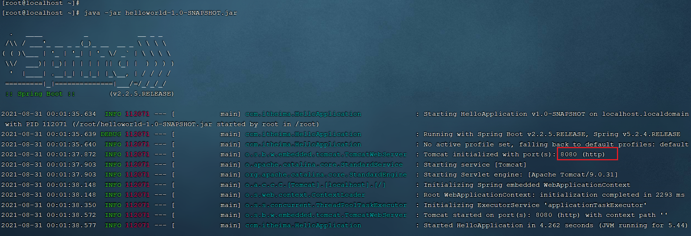
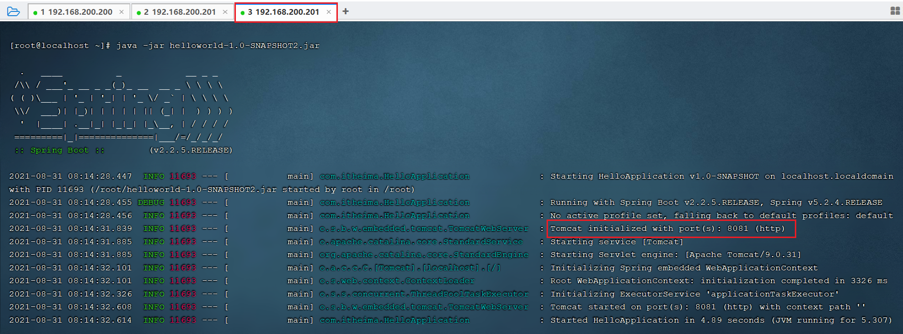

## 目标

1.了解nginx;
2.掌握nginx的安装和基本目录结构; 
3.掌握nginx基本使用命令;
4.掌握nginx的基本应用
   4.1 部署静态资源
   4.2 nginx反向代理
   4.3 负载均衡

## 1. Nginx-概述

### 1.1 介绍

 

​	Nginx是一款轻量级的Web服务器/反向代理服务器及电子邮件（IMAP/POP3）代理服务器。其特点是占有内存少，并发能力强，事实上nginx的并发能力在同类型的网页服务器中表现较好，中国大陆使用nginx的网站有：百度、京东、新浪、网易、腾讯、淘宝等。


​	Nginx是由**伊戈尔·赛索耶夫**为俄罗斯访问量第二的Rambler.ru站点（俄文：Рамблер）开发的，第一个公开版本0.1.0发布于2004年10月4日。

官网：https://nginx.org/

### 1.2 下载和安装

#### 1.2.1 下载

在Nginx的官网的下载页面中(http://nginx.org/en/download.html)，就展示了当前Nginx版本，并提供了下载的连接。 如下： 

 

在本项目中，我们所学习的Nginx选择的是稳定版本的1.16这个版本，我们可以直接从官网下载，当然在我们的课程资料中也已经提供了该版本的安装包。

 

#### 1.2.2 安装

**1). 安装依赖包**

由于nginx是基于c语言开发的，所以需要安装c语言的编译环境，及正则表达式库等第三方依赖库。

```shell
yum -y install gcc pcre-devel zlib-devel openssl openssl-devel
# 保证网络畅通
```


**2). 下载Nginx安装包**

```
yum install wget
wget https://nginx.org/download/nginx-1.16.1.tar.gz
```

> wget : 
>
> wget命令用来从指定的URL下载文件。wget非常稳定，它在带宽很窄的情况下和不稳定网络中有很强的适应性，如果是由于网络的原因下载失败，wget会不断的尝试，直到整个文件下载完毕。如果是服务器打断下载过程，它会再次联到服务器上从停止的地方继续下载。

执行完wget指令后，就会在当前所在目录看到下载下来的文件。

**3). 解压nginx压缩包**

```
tar -zxvf nginx-1.16.1.tar.gz
```


**4). 配置Nginx编译环境**

```shell
# 提前构建好安装nginx的包
mkdir -p /usr/local/nginx
# 进入nginx压缩包路径
cd nginx-1.16.1
# 配置安装位置
./configure --prefix=/usr/local/nginx
```

说明: 

​	--prefix 指定的目录，就是我们安装Nginx的目录(指定编译后的文件存放的位置)。

**5). 编译&安装**

```shell
# 依旧在nginx-1.16.1包下
make & make install
```


### 1.3 目录结构

安装完Nginx后，我们可以切换到Nginx的安装目录(/usr/local/nginx)，先来熟悉一下Nginx的目录结构，如下图：

 

> 备注： 
>
> ​	上述我们用到的一个指令 tree，该指令可以将我们指定的目录以树状结构展示出来。如果没有这个指令，可以通过以下指令进行安装。
>
> ​	yum install tree


重点目录和文件如下: 

| 目录/文件           | 说明                    | 备注                                |
| --------------- | --------------------- | --------------------------------- |
| conf            | 配置文件的存放目录             |                                   |
| conf/nginx.conf | Nginx的核心配置文件          | conf下有很多nginx的配置文件，我们主要操作这个核心配置文件 |
| html            | 存放静态资源(html, css, )   | 部署到Nginx的静态资源都可以放在html目录中         |
| logs            | 存放nginx日志(访问日志、错误日志等) |                                   |
| sbin/nginx      | 二进制文件，用于启动、停止Nginx服务  |                                   |

## 2. Nginx-命令

### 2.1 常用命令

​	Nginx中，我们的二进制可执行文件(nginx)存放在sbin目录下，虽然只有一个可执行文件，但是我们可以通过该指令配合不同的参数达到更加强大的功能。接下来，我们就演示一下Nginx常见指令, 在执行下面的指令时,都需要==在/usr/local/nginx/sbin/目录下执行==。


**1). 查看版本**

```
./nginx -v
```

 


**2). 检查配置文件**

修改了nginx.conf核心配置文件之后，在启动Nginx服务之前，可以先检查一下conf/nginx.conf文件配置的是否有错误，命令如下：

```shell
# -t表示-test
./nginx -t
```

 


**3). 启动**

```
./nginx
```

启动之后，我们可以通过ps -ef指令来查看nginx的进程是否存在。

 

注意： nginx服务启动后，默认就会有两个进程。


启动之后，我们可以直接访问Nginx的80端口， http://192.168.200.200

 


> 注意：
>
> ​	要想正常访问Nginx，需要关闭防火墙或开放指定端口号，执行的指令如下： 
>
> ​	A. 关闭防火墙
>
> ​		systemctl stop firewalld
>
> ​	B. 开放80端口 
>
> ​		firewall-cmd --add-port=80/tcp --permanent
>
> ​		firewall-cmd --reload


**4). 停止**

```shell
# 参数-s :优雅关闭：如果有新的请求进来，直接拒绝，但是如果nginx正处理任务，则不立即关闭，而是处理完任务时关闭
./nginx -s stop
```

停止之后，我们可以查看nginx的进程： 

```
ps -ef|grep nginx
```

 


**5). 重新加载**

当修改了Nginx配置文件后，需要重新加载才能生效，可以使用下面命令重新加载配置文件：

```shell
# nginx正在运行时，修改了配置文件，如果不想让nginx重新启动，但是又想让配置生效
# 在线上环境中，如果临时修改了nginx.conf文件，又不想停止nginx，可使用该命令
./nginx -s reload
```


### 2.2 环境变量配置

在上述我们在使用nginx命令在进行服务的启动、停止、重新加载时，都需要用到一个指令nginx，而这个指令是在nginx/sbin目录下的，我们每一次使用这个指令都需要切换到sbin目录才可以，使用相对繁琐。那么我们能不能在任意目录下都可以执行该指令来操作nginx呢？答案是可以的，配置nginx的环境变量即可。

通过vim编辑器，打开/etc/profile文件, 在PATH环境变量中增加nginx的sbin目录，如下： 

 

修改完配置文件之后，==需要执行 source /etc/profile 使文件生效==。 接下来，我们就可以在任意目录下执行nginx的指令了，如： 

 


## 3. Nginx-应用

介绍了并安装了Nginx之后，本章节将要讲解的是Nginx的使用，我们主要从以下四个方面进行讲解。

### 3.1 配置文件结构

nginx的配置文件(conf/nginx.conf)整体上分为三部分: 全局块、events块、==http块==。这三块的分别配置什么样的信息呢，看下表： 

| 区域      | 职责                          |
| ------- | --------------------------- |
| 全局块     | 配置和nginx运行相关的全局配置           |
| events块 | 配置和网络连接相关的配置                |
| http块   | 配置代理、缓存、日志记录、虚拟主机、静态资源配置等配置 |

具体结构图如下: 

 

> 在全局块、events块以及http块中，我们经常配置的是http块。
>
> 在http块中可以包含多个server块,每个server块可以配置多个location块。


### 3.2 部署静态资源

#### 3.2.1 介绍

​	Nginx可以作为静态web服务器来部署静态资源。这里所说的静态资源是指在服务端真实存在，并且能够直接展示的一些文件，比如常见的html页面、css文件、js文件、图片、视频等资源。

相对于Tomcat，Nginx处理静态资源的能力更加高效，所以在生产环境下，一般都会将静态资源部署到Nginx中。

~~~tex
部署原则：
	动静分离：
		动态请求的资源：eg:/api/login 不同的人请求的参数不一致，且响应不一定一样 Tomcat比较合适；
		静态：html css js img video等，Nginx适合处理请求资源；
~~~


将静态资源部署到Nginx非常简单，只需要将文件复制到Nginx安装目录下的html目录中即可。

```properties
server {
    listen 80;				#监听端口	
    server_name localhost;	#服务器名称
    location / {			#匹配客户端请求url
        root html;			#指定静态资源根目录
        index index.html;	#指定默认首页
    }
}
```


#### 3.2.2 测试

在资料中，我们提供了一个静态的html文件，我们需要将这个文件部署到nginx中，然后通过nginx访问html静态资源。

**1). 将静态资源上传到 /usr/local/nginx/html 目录**

 

注意上传文件的权限问题，否则可能访问拒绝！

~~~shell
chmod 777 hello.html
~~~

**2). 启动nginx**

 


**3). 访问**

http://192.168.200.200/hello.html

 


http://192.168.200.200 ， 访问该地址，访问的是nginx的默认首页

 


**4). 配置首页**

 

如果我们需要将hello.html作为nginx的首页，可以修改location的index指令，配置为hello.html，如下：

 

配置完毕后，我们可以通过指令，来检查配置文件是否配置正确： nginx -t

 

配置文件权限修改了，我们需要重新加载一下，才可以生效： 

```
nginx -s reload
```


**5). 访问**

http://192.168.200.200

 


### 3.3 反向代理

#### 3.3.1 概念介绍

1). 正向代理

​	正向代理服务器是一个位于客户端和原始服务器(origin server)之间的服务器，为了从原始服务器取得内容，客户端向代理发送一个请求并指定目标(原始服务器)，然后代理向原始服务器转交请求并将获得的内容返回给客户端。

​	正向代理的典型用途是为在防火墙内的局域网客户端提供访问Internet的途径。

​	正向代理一般是**在客户端设置代理服务器**，通过代理服务器转发请求，最终访问到目标服务器。

 

总之，正向代理，对于客户端来说，是知道请求访问的服务节点；


2). 反向代理

​	反向代理服务器位于用户与目标服务器之间，但是对于用户而言，反向代理服务器就相当于目标服务器，即用户直接访问反向代理服务器就可以获得目标服务器的资源，反向代理服务器负责将请求转发给目标服务器。用户不需要知道目标服务器的地址，也无须在用户端作任何设定，对于用户来说，访问反向代理服务器是完全无感知的。

 

那么在本小节，我们就是要使用nginx来作为反向代理服务器使用。 在nginx中，我们可以在nginx.conf中配置反向代理: 

```properties
server {
    listen 82;
    server_name localhost;
    location / {
        proxy_pass http://192.168.200.131:8080; 	#反向代理配置，将请求转发到指定服务
    }
}
```

上述配置的含义为: 当我们访问nginx的82端口时，根据反向代理配置，会将请求转发到 http://192.168.200.131:8080 对应的服务上。


#### 3.3.2 测试

需求: 在192.168.188.131这台服务器中部署了java应用，运行端口为8080，并提供了一个可访问的链接 /hello。现在我们需要在访问nginx的82端口时，通过nginx将请求转发到192.168.200.201:8080的服务。

 


**1). 在192.168.188.131部署服务并启动**

将资料中提供的 helloworld-1.0-SNAPSHOT.jar 上传到服务器端，并通过指令 java -jar helloworld-1.0-SNAPSHOT.jar 运行服务。

 


**2). 在192.168.200.200中的nginx.conf中配置反向代理**

进入nginx的安装目录，并编辑配置文件nginx.conf:

```
cd /usr/local/nginx/conf/
vim nginx.conf
```


在http块中,再添加一个server块虚拟主机的配置,监听82端口,并配置反向代理proxy_pass: 

```
server {
    listen 82;
    server_name localhost;
    location / {
        proxy_pass http://192.168.200.129:8080; 	#反向代理配置，将请求转发到指定服务
    }
}

```

 

~~~json
#user  nobody;
worker_processes  1;

#error_log  logs/error.log;
#error_log  logs/error.log  notice;
#error_log  logs/error.log  info;

#pid        logs/nginx.pid;


events {
    worker_connections  1024;
}


http {
    include       mime.types;
    default_type  application/octet-stream;

    #log_format  main  '$remote_addr - $remote_user [$time_local] "$request" '
    #                  '$status $body_bytes_sent "$http_referer" '
    #                  '"$http_user_agent" "$http_x_forwarded_for"';

    #access_log  logs/access.log  main;

    sendfile        on;
    #tcp_nopush     on;

    #keepalive_timeout  0;
    keepalive_timeout  65;

    #gzip  on;

    server {
        listen       80;
        server_name  localhost;

        #charset koi8-r;

        #access_log  logs/host.access.log  main;

        location / {
            root   html;
            index  hello.html;
        }

        #error_page  404              /404.html;

        # redirect server error pages to the static page /50x.html
        #
        error_page   500 502 503 504  /50x.html;
        location = /50x.html {
            root   html;
        }

        # proxy the PHP scripts to Apache listening on 127.0.0.1:80
        #
        #location ~ \.php$ {
        #    proxy_pass   http://127.0.0.1;
        #}

        # pass the PHP scripts to FastCGI server listening on 127.0.0.1:9000
        #
        #location ~ \.php$ {
        #    root           html;
        #    fastcgi_pass   127.0.0.1:9000;
        #    fastcgi_index  index.php;
        #    fastcgi_param  SCRIPT_FILENAME  /scripts$fastcgi_script_name;
        #    include        fastcgi_params;
        #}

        # deny access to .htaccess files, if Apache's document root
        # concurs with nginx's one
        #
        #location ~ /\.ht {
        #    deny  all;
        #}
    }
# 自定义的配置
server {
    listen 82;
    server_name localhost;
    location / {
        proxy_pass http://192.168.200.131:8080; 	#反向代理配置，将请求转发到指定服务
    }
}


    # another virtual host using mix of IP-, name-, and port-based configuration
    #
    #server {
    #    listen       8000;
    #    listen       somename:8080;
    #    server_name  somename  alias  another.alias;

    #    location / {
    #        root   html;
    #        index  index.html index.htm;
    #    }
    #}


    # HTTPS server
    #
    #server {
    #    listen       443 ssl;
    #    server_name  localhost;

    #    ssl_certificate      cert.pem;
    #    ssl_certificate_key  cert.key;

    #    ssl_session_cache    shared:SSL:1m;
    #    ssl_session_timeout  5m;

    #    ssl_ciphers  HIGH:!aNULL:!MD5;
    #    ssl_prefer_server_ciphers  on;

    #    location / {
    #        root   html;
    #        index  index.html index.htm;
    #    }
    #}

}
~~~


**3). 检查配置文件，并重新加载**

```
nginx -t
```

 


```
nginx -s reload
```


**4). 访问**

 


==注意: 在访问82端口时，有可能访问不通，原因是以为防火墙中没有开放端口号。我们可以通过两种方式来解决该问题：== 

==A. 关闭防火墙== 

```
systemctl stop firewalld
```

==B. 开发指定端口==

```
firewall-cmd --add-port=82/tcp --permanent

firewall-cmd --reload
```


### 3.4 负载均衡

#### 3.4.1 概念介绍

​	早期的网站流量和业务功能都比较简单，单台服务器就可以满足基本需求，但是随着互联网的发展，业务流量越来越大并且业务逻辑也越来越复杂，单台服务器的性能及单点故障问题就凸显出来了，因此需要多台服务器组成应用集群，进行性能的水平扩展以及避免单点故障出现；

**应用集群：**将同一应用部署到多台机器上，组成应用集群，接收负载均衡器分发的请求，进行业务处理并返回响应数据

**负载均衡器：**将用户请求根据对应的负载均衡算法分发到应用集群中的一台服务器进行处理

  

​	此处的负载均衡器，我们将会使用Nginx来实现，而Nginx的负载均衡是基于反向代理的，只不过此时所代理的服务器不是一台，而是多台；

#### 3.4.2 测试

**1). 将资料中提供的两个jar包，上传到192.168.200.201服务器上**

| jar                                      | 运行端口 | 请求链接   | 响应数据 |
| ---------------------------------------- | ---- | ------ | ---- |
|  | 8080 | /hello | 8080 |
|  | 8081 | /hello | 8081 |

> 我们在测试时，并没有那么多服务器，我们可以在一台服务器中启动多个服务，运行在不同的端口号上进行测试。


**2). 运行上传上来的两个jar包，运行端口分别是 8080 ， 8081**

由于我们执行 java -jar 指令会占用前台窗口，所以我们可以开启两个窗口进行测试。

 

 


**3). 在nginx中配置负载均衡**

打开nginx的配置文件nginx.conf并增加如下配置: 

```properties
#upstream 分流器 指令可以定义一组服务器 分流器名称随便定义，建议不要使用一些关键字
upstream targetserver{	
    server 192.168.200.129:8080;
    server 192.168.200.129:8081;
}

server {
    listen       83;
    server_name  localhost;
    location / {
        proxy_pass http://targetserver;
    }
}
```

具体的配置位置如下: 

 


**4). 重新加载nginx配置文件,访问**

```shell
nginx -s reload
```

测试时,我们直接访问nginx的8080端口(http://192.168.200.200:8080), 此时nginx会根据负载均衡策略,将请求转发到后面的两台服务器。

 

​	在上述的测试过程中，我们看到请求均衡的转发到了8080和8081，因为模式的负载均衡策略是轮询。

注意: 上述所有涉及到的端口号，都需要在对应的服务器的防火墙中开放，或者彻底关闭防火墙；

#### 3.4.3 负载均衡策略

处理上述默认的轮询策略以外，在Nginx中还提供了其他的负载均衡策略，如下： 

| **名称**     | **说明**         | 特点                                       |
| ---------- | -------------- | ---------------------------------------- |
| 轮询         | 默认方式           | 轮流均衡访问服务节点                               |
| weight     | 权重方式           | 根据权重分发请求,权重大的分配到请求的概率大                   |
| ip_hash    | 依据ip分配方式       | 根据客户端请求的IP地址计算hash值， 根据hash值来分发请求, 同一个IP发起的请求, 会发转发到同一个服务器上 |
| least_conn | 依据最少连接方式       | 哪个服务器当前处理的连接少, 请求优先转发到这台服务器（谁闲用谁）        |
| url_hash   | 依据url分配方式（第三方） | 根据客户端请求url的hash值，来分发请求, 同一个url请求, 会发转发到同一个服务器上 |
| fair       | 依据响应时间方式（第三方）  | 优先把请求分发给处理请求时间短的服务器（强调响应速度-活干的快，就多干-能者多劳） |

权重的配置： 

```properties
#upstream指令可以定义一组服务器 权重大的分配到请求的概率大
upstream targetserver{	
    server 192.168.200.201:8080 weight=10;
    server 192.168.200.201:8081 weight=5;
}
```

上述配置的weight权重是相对的，在上述的配置中，效果就是，在大数据量的请求下，最终8080接收的请求数是8081的两倍。

