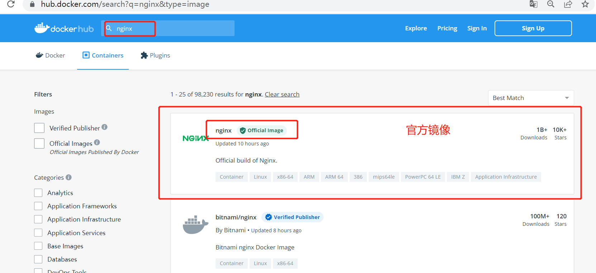
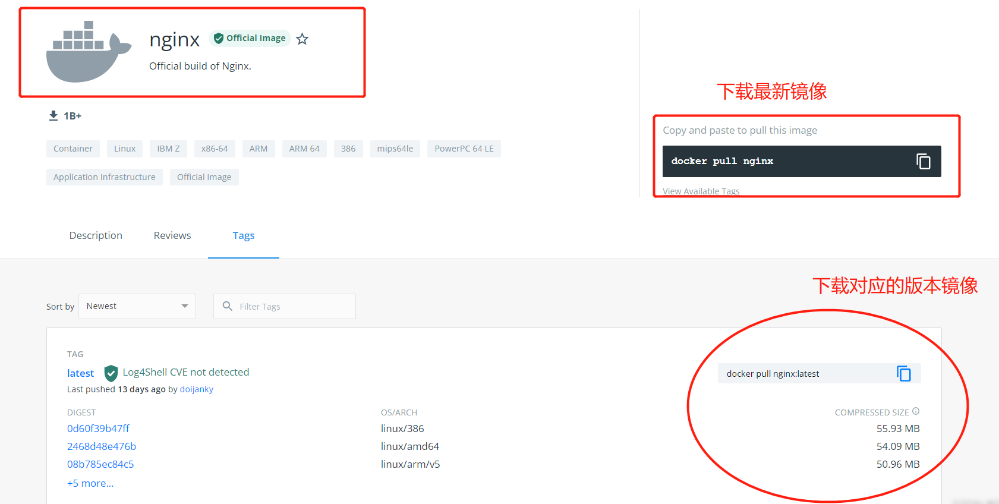
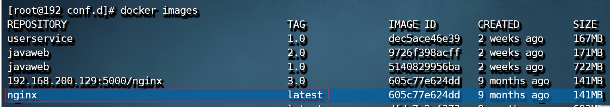
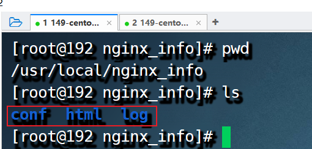
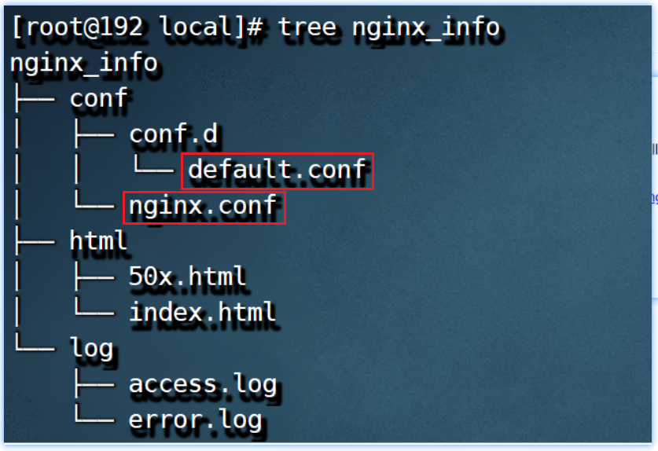

# 基于Docker安装Nginx

## 1.1 寻找Nginx镜像

在DockerHub下搜索nginx镜像信息：

> 或者基于docker search指令搜索Nginx镜像信息；

## 1.2 下载Nginx镜像

| 命令                    | 描述                                       |
| --------------------- | ---------------------------------------- |
| docker pull nginx     | 下载最新版Nginx镜像 ，该命令等同于 : docker pull nginx:latest |
| docker pull nginx:xxx | 下载指定版本的Nginx镜像 (xxx指具体版本号)               |

> 说明:
>
> 可通过docker指令直接导入:day12-项目部署\资料\nginx资料\nginx镜像\nginx.tar

## 1.3 创建Nginx配置文件

​	创建Nginx外部挂在的目录或者配置文件，我们可先启动Nginx容器，然后将容器内的静态资源、配置文件、日志等目录或者文件复制到外部挂载的目录或者文件下；

~~~shell
# 创建挂载目录
mkdir -p /usr/local/nginx_info/conf
mkdir -p /usr/local/nginx_info/log
mkdir -p /usr/local/nginx_info/html
~~~

然后将容器中的nginx.conf文件和conf.d文件夹复制到宿主主机：

~~~shell
# 生成容器
docker run --name nginx -p 80:80 -d nginx
# 将容器nginx.conf文件复制到宿主机
docker cp nginx:/etc/nginx/nginx.conf /usr/local/nginx_info/conf/nginx.conf
# 将容器conf.d文件夹下内容复制到宿主机
docker cp nginx:/etc/nginx/conf.d /usr/local/nginx_info/conf/conf.d
# 将容器中的html文件夹复制到宿主机
docker cp nginx:/usr/share/nginx/html /usr/local/nginx_info/
~~~

## 1.4 创建Nginx容器

删除当前nginx容器：

~~~shell
# 关闭nginx容器
docker stop nginx
# 删除该容器
docker rm nginx
~~~

构建容器，挂在目录并启动：

~~~shell
docker run \
-p 80:80 \
--name nginx \
-v /usr/local/nginx_info/conf/nginx.conf:/etc/nginx/nginx.conf \
-v /usr/local/nginx_info/conf/conf.d:/etc/nginx/conf.d \
-v /usr/local/nginx_info/log:/var/log/nginx \
-v /usr/local/nginx_info/html:/usr/share/nginx/html \
-d nginx:latest
~~~

| 命令                                       | 描述                  |
| ---------------------------------------- | ------------------- |
| –name nginx                              | 启动容器的名字             |
| -d                                       | 后台运行                |
| -p 80:80                                 | 将容器的80端口映射到主机的 80端口 |
| -v /usr/local/nginx_info/conf/nginx.conf:/etc/nginx/nginx.conf | 挂载nginx.conf配置文件    |
| -v /usr/local/nginx_info//conf/conf.d:/etc/nginx/conf.d | 挂载nginx配置文件         |
| -v /usr/local/nginx_info/html:/usr/share/nginx/html | 挂载nginx内容           |
| nginx:latest                             | 本地运行的版本             |
| \                                        | shell 命令换行          |

## 1.5 访问效果

> 说明：tree指令需要体检安装tree插件，使用yum install tree -y即可；

## 1.6 配置文件

详见：/etc/nginx/nginx.conf和/etc/nginx/conf.d

- nginx.conf主配置文件

~~~json
user  nginx;
worker_processes  auto;

error_log  /var/log/nginx/error.log notice;
pid        /var/run/nginx.pid;

events {
    worker_connections  1024;
}

http {
    include       /etc/nginx/mime.types;
    default_type  application/octet-stream;

    log_format  main  '$remote_addr - $remote_user [$time_local] "$request" '
                      '$status $body_bytes_sent "$http_referer" '
                      '"$http_user_agent" "$http_x_forwarded_for"';

    access_log  /var/log/nginx/access.log  main;

    sendfile        on;
    #tcp_nopush     on;

    keepalive_timeout  65;

    #gzip  on;

    include /etc/nginx/conf.d/*.conf; # 导入其它配置文件
}
~~~

> 在nginx容器中nginx.conf配置文件主要负责全局块、event块和http基础信息的配置；

- 默认配置文件-conf.d/default.conf

作用：用户自定义配置，不配置静态资源部署、反向代理、负载均衡等。

~~~json
server {
    listen       80;
    listen  [::]:80;
    server_name  localhost;

    #access_log  /var/log/nginx/host.access.log  main;

    location / {
        root   /usr/share/nginx/html/dist;
        index  index.html;
    }
   location ^~ /api/ {
        proxy_pass http://192.168.200.128:8091;
    }
    #error_page  404              /404.html;

    # redirect server error pages to the static page /50x.html
    #
    error_page   500 502 503 504  /50x.html;
    location = /50x.html {
        root   /usr/share/nginx/html;
    }

    # proxy the PHP scripts to Apache listening on 127.0.0.1:80
    #
    #location ~ \.php$ {
    #    proxy_pass   http://127.0.0.1;
    #}

    # pass the PHP scripts to FastCGI server listening on 127.0.0.1:9000
    #
    #location ~ \.php$ {
    #    root           html;
    #    fastcgi_pass   127.0.0.1:9000;
    #    fastcgi_index  index.php;
    #    fastcgi_param  SCRIPT_FILENAME  /scripts$fastcgi_script_name;
    #    include        fastcgi_params;
    #}

    # deny access to .htaccess files, if Apache's document root
    # concurs with nginx's one
    #
    #location ~ /\.ht {
    #    deny  all;
    #}
}
~~~

