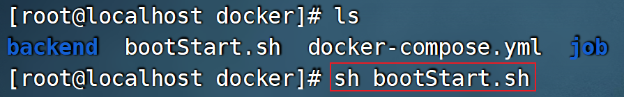

typora-copy-images-to: assets

# 今日指数部署

## 目标

1.理解前端打包和nginx静态资源部署流程;
2.理解后端基本部署流程；

## 项目部署

在本章节，我们要做的是项目的部署，包含前端项目的部署及后端项目的部署。

### 1.部署环境架构说明

#### 1.1 部署组件说明


前端部署服务器： Nginx

后端部署服务器： Tomcat(内嵌)

#### 1.2 环境说明

由于我们的服务器数量有限，我们以这三台服务器，具体的软件规划如下: 

| 服务器             | 软件                       | 名称   |
| --------------- | ------------------------ | ---- |
| 192.168.200.128 | 主业务工程、Redis（缓存中间件）       | 服务器A |
| 192.168.200.129 | 采集数据工程、Mysql、RabbitMQ    | 服务器B |
| 192.168.200.130 | Nginx、xxl-job-admin、YAPI | 服务器C |

由于我们前面的课程中Nginx、MySQL、Redis、JDK、Maven、GIT都已经演示过安装及配置了，这里我们就不再演示软件的安装了。

> 说明：虚拟机部署过程中受限于个人计算机硬件配置，我们也可将软件部署到单台节点上，模拟分布式部署方式。

### 2.前端部署

前端部署的核心流程：

- 前端工程打包成静态资源；
- 静态资源部署到nginx下；
- 基于nginx配置反向代理，解决前端跨域问题；

#### 2.1 前端资源打包

在stock_front_admin工程运行打包指令：

~~~shell
npm run build
~~~


运行完毕后，在stock_front_admin工程下会产生一个dist目录：


> 注意事项：
>
> ​	在打包过程中若出现错误：Module build failed (from ./node_modules/image-webpack-loader/index.js)
>
> 解决方式：
>
> ​	先卸载
> ​		npm uninstall image-webpack-loader
> ​	然后使用
> ​		cnpm install image-webpack-loader --save-dev

#### 2.2 Nginx部署静态资源

**1). 在第二章节已经安装好Nginx容器，接下来将打包好的dist目录上传到Nginx的html目录下即可**

nginx下的html目录已挂载到了**/usr/local/nginx_info/html** 目录下，所以直接将dist目录上传到该目录即可！ 


**2). 修改Nginx配置文件nginx.conf**

容器中的静态资源的配置可在default.conf文件中配置：


配置信息如下：

~~~json
server {
    listen       80;
    listen  [::]:80;
    server_name  localhost;
    location / {
        root   /usr/share/nginx/html/dist;
        index  index.html;
    }
    error_page   500 502 503 504  /50x.html;
    location = /50x.html {
        root   /usr/share/nginx/html;
    }
}
~~~

#### 2.3 配置反向代理

前端工程部署完成之后，我们可以正常的访问到系统的登录页面，点击登录按钮，可以看到服务端发起的请求，请求信息如下： 


当前前端资源存在的问题：

- 通过远程的80端口无法直接获取api开头的接口数据，需要跨域访问8091端口才能获取；
  - 基于nginx的反向代理可天然解决跨域问题；
  - 后台的接口约定都是以api前缀开头，所以我们在配置反向代理时，可为api开头的路径使用反向代理

最终配置如下：

```properties
server {
    listen       80;
    listen  [::]:80;
    server_name  localhost;
    location / {
        root   /usr/share/nginx/html/dist;
        index  index.html;
    }
   location ^~ /api/ {
        proxy_pass http://192.168.200.128:8091;
    }
    error_page   500 502 503 504  /50x.html;
    location = /50x.html {
        root   /usr/share/nginx/html;
    }
} 
```

> 说明：配置中 ^~ /api/表示匹配一切以api开头的请求路径


#### 2.4 nginx部署测试

访问：http://192.168.200.128

 


### 3.后端部署

#### 3.1 后端工程打包规划


在stock_backend工程pom中定义打包名称和保存位置：

```xml
    <build>
        <!--打包名称-->
        <finalName>app</finalName>
        <plugins>
            <plugin>
                <groupId>org.springframework.boot</groupId>
                <artifactId>spring-boot-maven-plugin</artifactId>
                <configuration>
                    <!--jar包保存位置-->
                    <outputDirectory>../docker/backend</outputDirectory>
                </configuration>
            </plugin>
        </plugins>
    </build>
```

同样在stock_job工程做类似配置：

```xml
    <build>
        <!--打包名称-->
        <finalName>app</finalName>
        <plugins>
            <plugin>
                <groupId>org.springframework.boot</groupId>
                <artifactId>spring-boot-maven-plugin</artifactId>
                <configuration>
                    <outputDirectory>../docker/job</outputDirectory>
                </configuration>
            </plugin>
        </plugins>
    </build>
```

测试打包：


> 注意：对应app.jar，我们已经.gitignore文件做了忽略设置；

#### 3.2 Dockerfile定义

在backend和job目录下添加Dockerfile文件，内容一致：

```tex
FROM java:8
COPY ./app.jar /tmp
ENTRYPOINT java -jar /tmp/app.jar
```

> 说明：基础镜像使用的是oracle java8，可通过docker load指令将：day12-项目部署\资料\项目部署资料\oraclejava8镜像\java8.tar直接导入；

效果如下：


#### 3.3 定义docker-compose

在docker目录内定义docker-compose.yml文件


内容如下：

~~~yml
version: "3.2"

services:
  stockbackend:
    environment:
      TZ: Asia/Shanghai
    build: ./backend
    image: stockbackend:1.0
    container_name: stockbackend_container
    ports:
      - "8091:8091"
  stockjob:
    environment:
      TZ: Asia/Shanghai
    build: ./job
    image: stockjob:1.0
    container_name: stockjob_container
    ports:
      - "8092:8092"
      - "6789:6789"
~~~

#### 3.4 整体部署流程说明

部署流程如下：

- 将docker目录及内部文件推送到远程gitlab下(git忽略jar包)；
- 远程服务器通过git pull指令拉取gitlab下最新的工程代码；
- cd进入stock_parent根目录下执行打包安装指令
  - **mvn clean install -Dmaven.test.skip=true**
  - 提前打包的目的及注意事项：
    - 提前打包并安装好工程所需依赖，避免后续执行部署指令时的长久等待；
    - 有问题，提前纠错；
    - 保证打包命令执行位置与父工程pom路径一致；
- 命令进入docker目录下，执行docker-compose指令批量构建容器启动
  - 构建容器并启动：docker-compose up -d
  - 保证命令与docker-complse.yml路径一致；
  - 关闭并删除容器：docker-compose down

显然每次发布更新代码时，都需要重复执行上述指令，不够便捷。我们可通过shell脚本实现一定更新发布功能。

定义bootStart.sh脚本文件，内容如下：

~~~shell
#!/bin/sh
#记事本打开，修改编码格式为utf8，可解决上传centos后中文乱码问题
echo =================================
echo  镜像容器更新
echo =================================
echo 准备从Git仓库拉取最新代码
cd /usr/local/stock_parent
echo 开始从Git仓库拉取最新代码
git pull
echo 代码拉取完成
echo 开始打包安装
output=`mvn clean install -Dmaven.test.skip=true`
# 切换到docker目录
cd ./docker
echo 停止并删除相关容器
output=`docker-compose down`
echo 更新镜像,并启动容器
output=`docker-compose up --build -d`
echo 删除未被使用的镜像
output=`docker image prune -f`
echo 项目启动完成
~~~

> 参考：day12-项目部署\资料\项目部署资料\Docker环境自动化脚本\bootStart.sh


#### 3.5 执行部署脚本

流程如下：

- git拉取bootStart.sh脚本；

- 调整脚本执行权限

  

- 执行脚本，一键发布



- 访问系统测试

http://192.168.200.128/

 