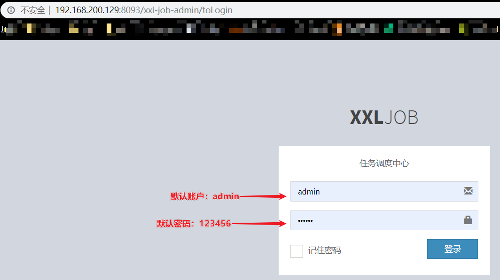

# 今日指数项目部署

基础环境：

CentOS 7.9，可以使用虚拟机或者云服务器。

## 1. Git

打开https://mirrors.edge.kernel.org/pub/software/scm/git/，选择合适的git版本，复制下载链接，以2.44.0版本为例。

```shell
# 安装编译源码所需依赖，耐心等待安装，出现提示输入y即可
$ yum install curl-devel expat-devel gettext-devel openssl-devel zlib-devel gcc perl-ExtUtils-MakeMaker

# 安装依赖时，yum自动安装了Git，需要卸载旧版本Git，出现提示输入y即可
$ yum remove git

# wget 下载git
$ wget https://mirrors.edge.kernel.org/pub/software/scm/git/git-2.44.0.tar.xz

# 解压
$ tar -zxvf git-2.44.0.tar.gz

# 进入解压后的目录
cd git-2.44.0

# 执行编译，耐心等待编译即可
$ make prefix=/usr/local/git all

# 安装Git至/usr/local/git路径
$ make prefix=/usr/local/git install

# 打开环境变量配置文件，在底部加上Git相关配置信息，保存退出
$ vim /etc/profile
# set git environment
PATH=$PATH:/usr/local/git/bin
export PATH 

# 刷新环境变量的值
$ source /etc/profile

# 查看安装的git版本，校验通过，安装成功。
$ git --version
```

## 2. Maven

打开https://archive.apache.org/dist/maven/maven-3/，选择合适的Maven版本，复制下载链接，以3.5.4版本为例。

```shell
# wget 下载Maven
$ wget https://archive.apache.org/dist/maven/maven-3/3.5.4/binaries/apache-maven-3.5.4-bin.tar.gz

# 解压maven安装包到/usr/local/soft目录
$ tar -zxvf apache-maven-3.5.4-bin.tar.gz

# 删除不需要的压缩包
$ rm apache-maven-3.5.4-bib.tar.gz

# 在/etc/profile文件尾部添加环境变量
$ vim /etc/profile
MAVEN_HOME=/usr/local/soft/apache-maven-3.5.4
PATH=$JAVA_HOME/bin:$MAVEN_HOME/bin:$PATH

# 让配置文件立即生效
$ source /etc/profile

# 修改maven的配置文件,配置本地仓库地址
$ cd /usr/local/soft/apache-maven-3.5.4/conf
$ vim settings.xml
# 增加如下配置
<localRepository>/usr/local/soft/repo</localRepository>
# 在mirrors标签中添加阿里云的私服
<mirror> 
    <id>alimaven</id> 
    <mirrorOf>central</mirrorOf> 
    <name>aliyun maven</name> 
    <url>http://maven.aliyun.com/nexus/content/groups/public/</url>
</mirror>

# 创建本地仓库
$ mkdir -p /usr/local/soft/repo
```

## 3. Docker

### 3.1 Docker 安装

如果之前安装过旧版本的Docker，可以使用下面命令卸载：

```shell
$ yum remove docker \
      docker-client \
      docker-client-latest \
      docker-common \
      docker-latest \
      docker-latest-logrotate \
      docker-logrotate \
      docker-selinux \
      docker-engine-selinux \
      docker-engine \
      docker-ce
```

安装yum-utils

```sh
$ yum install -y yum-utils \
      device-mapper-persistent-data \
      lvm2 --skip-broken
```

然后更新本地镜像源

```shell
# 设置docker镜像源
$ yum-config-manager \
      --add-repo \
      https://mirrors.aliyun.com/docker-ce/linux/centos/docker-ce.repo

# 添加docker镜像相关依赖    
sed -i 's/download.docker.com/mirrors.aliyun.com\/docker-ce/g' /etc/yum.repos.d/docker-ce.repo

# 刷新缓存
yum makecache fast
```

> 说明：yum源默认是从国外下载，上述命令表示更新yum源下载的镜像源从阿里云，这样下面安装docker的时候就会快一些。

安装 docker,docker-ce 为社区免费版本。

```shell
yum install -y docker-ce
```

Docker应用需要用到各种端口，逐一去修改防火墙设置非常麻烦，因此建议大家直接关闭防火墙。

```shell
# 关闭
$ systemctl stop firewalld

# 禁止开机启动防火墙
$ systemctl disable firewalld
```

docker相关命令

```sh
$ systemctl start docker  # 启动docker服务

$ systemctl stop docker  # 停止docker服务

$ systemctl restart docker  # 重启docker服务

$ systemctl status docker # 检查docker状态

$ systemctl enable docker # 设置docker服务开机自启

$ systemctl disable docker # 关闭docker服务开机自启

$ docker -v # 查看docker版本
```

### 3.2 配置镜像加速

docker官方镜像仓库网速较差，我们需要设置国内镜像服务：

~~~markdown
1. 安装／升级Docker客户端
推荐安装1.10.0以上版本的Docker客户端，参考文档docker-ce

2. 配置镜像加速器
针对Docker客户端版本大于 1.10.0 的用户

您可以通过修改daemon配置文件/etc/docker/daemon.json来使用加速器
# 1）执行第一条命令
# -p 创建多级目录
sudo mkdir -p /etc/docker

# 2）执行第二条命令

sudo tee /etc/docker/daemon.json <<-'EOF'
{
  "registry-mirrors": ["https://mkoo7bej.mirror.aliyuncs.com"]
}
EOF

# 3）执行第三条命令

sudo systemctl daemon-reload

# 4）执行第四条命令

sudo systemctl restart docker
~~~

## 4. Docker-Compose

### 4.1 安装Docker-Compose

```sh
# 下载
curl -L https://github.com/docker/compose/releases/download/1.23.1/docker-compose-`uname -s`-`uname -m` > /usr/local/bin/docker-compose

# 修改权限
chmod +x /usr/local/bin/docker-compose
```

### 4.2 Base自动补全命令(可选)

以下的命令可以自选执行，执行之后在docker-compose中会有自动提示。

1.需要修改自己的hosts文件：

~~~java
echo "199.232.68.133 raw.githubusercontent.com" >> /etc/hosts
~~~

2.执行命令

```shell
# 补全命令
curl -L https://raw.githubusercontent.com/docker/compose/1.29.1/contrib/completion/bash/docker-compose > /etc/bash_completion.d/docker-compose
```

```shell
# 查看系统中是否已经包含命令补齐脚本
$ ls  /usr/share/bash-completion/completions/docker*
# 下载自动补齐工具
$ yum -y install bash-completion
# 让自动补齐功能生效
$ source /usr/share/bash-completion/completions/docker
$ source /usr/share/bash-completion/bash_completion
```

## 5. Nginx

### 5.1 下载 Nginx 镜像

| 命令                    | 描述                                                         |
| ----------------------- | ------------------------------------------------------------ |
| `docker pull nginx`     | 下载最新版Nginx镜像 ，该命令等同于 : `docker pull nginx:latest` |
| `docker pull nginx:xxx` | 下载指定版本的Nginx镜像 (xxx指具体版本号)                    |

### 5.2  创建Nginx配置文件

创建Nginx外部挂在的目录或者配置文件，我们可先启动Nginx容器，然后将容器内的静态资源、配置文件、日志等目录或者文件复制到外部挂载的目录或者文件下；

~~~shell
# 创建挂载目录
mkdir -p /usr/local/nginx_info/conf
mkdir -p /usr/local/nginx_info/log
mkdir -p /usr/local/nginx_info/html
~~~

然后将容器中的`nginx.conf`文件和`conf.d`文件夹复制到宿主主机：

~~~shell
# 生成容器
$ docker run --name nginx -p 80:80 -d nginx

# 将容器nginx.conf文件复制到宿主机
$ docker cp nginx:/etc/nginx/nginx.conf /usr/local/nginx_info/conf/nginx.conf

# 将容器conf.d文件夹下内容复制到宿主机
$ docker cp nginx:/etc/nginx/conf.d /usr/local/nginx_info/conf/conf.d

# 将容器中的html文件夹复制到宿主机
$ docker cp nginx:/usr/share/nginx/html /usr/local/nginx_info/
~~~

删除当前nginx容器:

```shell
# 关闭nginx容器
$ docker stop nginx

# 删除该容器
$ docker rm nginx
```

### 5.3 创建Nginx容器

构建容器，挂在目录并启动：

~~~shell
docker run \
-p 80:80 \
--name nginx \
-v /usr/local/nginx_info/conf/nginx.conf:/etc/nginx/nginx.conf \
-v /usr/local/nginx_info/conf/conf.d:/etc/nginx/conf.d \
-v /usr/local/nginx_info/log:/var/log/nginx \
-v /usr/local/nginx_info/html:/usr/share/nginx/html \
-d nginx:latest
~~~

| 命令                                                         | 描述                              |
| ------------------------------------------------------------ | --------------------------------- |
| `–name nginx`                                                | 启动容器的名字                    |
| `-d`                                                         | 后台运行                          |
| `-p 80:80`                                                   | 将容器的80端口映射到主机的 80端口 |
| `-v /usr/local/nginx_info/conf/nginx.conf:/etc/nginx/nginx.conf` | 挂载nginx.conf配置文件            |
| `-v /usr/local/nginx_info//conf/conf.d:/etc/nginx/conf.d`    | 挂载nginx配置文件                 |
| `-v /usr/local/nginx_info/html:/usr/share/nginx/html`        | 挂载nginx内容                     |
| `nginx:latest`                                               | 本地运行的版本                    |
| `\`                                                          | shell 命令换行                    |

### 5.4 访问确认创建成功


## 6. 前端部署

前端部署的核心流程：

- 前端工程打包成静态资源；
- 静态资源部署到nginx下；
- 基于nginx配置反向代理，解决前端跨域问题；

### 6.1 前端资源打包

在stock_front_admin工程运行打包指令，运行完毕后，在stock_front_admin工程下会产生一个`dist`目录。

~~~shell
npm run build
~~~

> 注意事项：
>
> ​	在打包过程中若出现错误：Module build failed (from ./node_modules/image-webpack-loader/index.js)
>
> 解决方式：
>
> ​	先卸载
> ​		`npm uninstall image-webpack-loader`
> ​	然后使用
> ​		`cnpm install image-webpack-loader --save-dev`

### 6.2 Nginx部署静态资源

将打包好的dist目录上传到Nginx的html目录下即可。

nginx下的html目录已挂载到了/usr/local/nginx_info/html目录下，所以直接将dist目录上传到该目录即可。

```shell
# 修改配置文件
$ cd /usr/local/nginx_info/conf/conf.d
$ vim default.conf
```

配置信息如下：

~~~json
server {
    listen       80;
    listen  [::]:80;
    server_name  localhost;
    location / {
        root   /usr/share/nginx/html/dist;
        index  index.html;
    }
    error_page   500 502 503 504  /50x.html;
    location = /50x.html {
        root   /usr/share/nginx/html;
    }
}
~~~

### 6.3 配置反向代理

前端工程部署完成之后，我们可以正常的访问到系统的登录页面，点击登录按钮，可以看到服务端发起的请求，请求信息如下： 


当前前端资源存在的问题：

- 通过远程的80端口无法直接获取api开头的接口数据，需要跨域访问8091端口才能获取；
  - 基于nginx的反向代理可天然解决跨域问题；
  - 后台的接口约定都是以api前缀开头，所以我们在配置反向代理时，可为api开头的路径使用反向代理

修改default.conf最终配置如下：

```properties
server {
    listen       80;
    listen  [::]:80;
    server_name  localhost;
    location / {
        root   /usr/share/nginx/html/dist;
        index  index.html;
    }
   location ^~ /api/ {
        proxy_pass http://本机IP地址:8091;
    }
    error_page   500 502 503 504  /50x.html;
    location = /50x.html {
        root   /usr/share/nginx/html;
    }
} 
```

> 说明：配置中 ^~ /api/表示匹配一切以api开头的请求路径

### 6.4 nginx部署测试

```shell
# 检查配置文件是否正确
$ nginx -t

# 重启nginx服务
$ nginx -s reload
```

访问：http://IP地址

 

## 7. MySQL

通过 Docker 创建 MySQL 容器

```shell
$ docker run --restart=always -p 3306:3306 --name mysql -v /tmp/mysql/data:/var/lib/mysql  -e MYSQL_ROOT_PASSWORD=root  -e TZ=Asia/Shanghai -d mysql:5.6 --character-set-server=utf8mb4 --collation-server=utf8mb4_unicode_ci --default-time_zone='+8:00'
```

参数说明：
	MYSQL_ROOT_PASSWORD ： 设置mysql数据库root的密码
	MYSQL_DATABASE ： 启动时创建数据库
	TZ=Asia/shanghai ： 设置容器时区
	character-set-server ： 服务器字符集，在创建数据库和表时不特别指定字符集，这样统一采用character-set-server字符集。
	character-set-database ： 数据库字符集
	character-set-table ： 数据库表字符集
	collation-server ： 排序规则字符集
	default-time_zone ： mysql的时区

## 8. Redis

通过 Docker 创建 Redis 容器

```shell
$ docker run --name redis -p 6379:6379 --requirepass "yourPassword" --restart=always -d redis redis-server --appendonly yes
#   --name：指定容器名称,redis表示容器名
#	-p：指定端口映射。6379:6379 冒号左侧是宿主机端口，右侧是容器端口
#	-d：让容器后台运行
#	redis：表示镜像名
#   redis-server：表示redis服务
#   --appendonly yes ：开启aof持久化
#   --requirepass 设置密码
#   --restart=always 开机自启动
```

## 9. RabbitMQ

docker拉取镜像

```shell
$ docker pull rabbbitmq:3.8-management
```

创建docker容器

```shell
docker run \
 # 设置环境变量  用户名是 itcast
 -e RABBITMQ_DEFAULT_USER=itcast \
 # 设置环境变量  密码是 123321
 -e RABBITMQ_DEFAULT_PASS=123321 \
 # 挂载数据卷，后面高级会用到下面的插件
 -v mq-plugins:/plugins \
 # mq的名字
 --name mq \
 # 主机名 这里不配置也可以，后期如果是集群必须配置
 --hostname mq \
 # web可视化终端监控端口；mq的ui界面管理平台端口
 -p 15672:15672 \
 # 程序与mq交互的访问端口；发消息和收消息的端口
 -p 5672:5672 \
 # 后端运行
 -d \
 # 镜像名称
 rabbitmq:3.8-management
```

```shell
docker run \
 -e RABBITMQ_DEFAULT_USER=itcast \
 -e RABBITMQ_DEFAULT_PASS=123321 \
 -v mq-plugins:/plugins \
 --name mq \
 --hostname mq \
 -p 15672:15672 \
 -p 5672:5672 \
 -d \
 rabbitmq:3.8-management
```

> 5672端口：程序与mq交互的访问端口；发消息和收消息的端口
>
> 15672端口：web可视化终端监控端口；mq的ui界面管理平台端口

> 注意：访问阻塞，则尝试重启mq服务 或者重启docker服务；
>
> 重启[rabbitmq](https://so.csdn.net/so/search?q=rabbitmq&spm=1001.2101.3001.7020)服务通过两个命令来实现：
> `rabbitmqctl stop` ：停止rabbitmq
> `rabbitmq-server restart` : 重启rabbitmq

## 10. XXL-JOB-ADMIN

> 通过gitee下载xxljob源码
>
> ！！！搭建MySQL数据库环境并用官方给的sql文件创建相关表格。

~~~shell
# docker拉取镜像
$ docker pull xuxueli/xxl-job-admin:2.3.0

# 启动xxl-job任务中心容器
# 在指定目录构建xxldata目录，然后运行如下docker指令：
$ docker run -e PARAMS="--spring.datasource.url=jdbc:mysql://ip:3306/xxl_job?useUnicode=true&characterEncoding=UTF-8&autoReconnect=true&serverTimezone=UTC --spring.datasource.username=root --spring.datasource.password=root" -p 8093:8080 -v $PWD/xxldata:/data/applogs --name=xxl-job-admin -d xuxueli/xxl-job-admin:2.3.0
~~~

> 注意修改数据库IP地址、用户名、密码以及将$PWD改为xxldata目录实际所在的路径
>
> 注意：Docker服务重启时，保证对应的mysql服务启动，否则任务信息无法加载！

访问容器服务：

~~~http
http://ip:8093/xxl-job-admin
~~~

效果如下：



登录进入后效果：


## 11. 后端部署


## 12. YAPI


