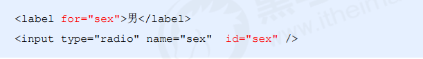

# HTML 基础

## 基本语法

- HTML标签
  - 双标签 `<html> </html>`
  - 单标签 `<br/>`

标签关系：包含与并列

## 基本结构

```html
<!DOCTYPE html>     <!--文档类型声明，告知浏览器网页使用 HTML5 版本来显示网页-->
<html lang="zh-CN">    <!--定义当前文档显示的语言-->
<head>
    <meta charset="UTF-8">   <!--规定 HTML 文档使用哪种字符编码-->
    <meta http-equiv="X-UA-Compatible" content="IE=edge">
    <meta name="viewport" content="width=device-width, initial-scale=1.0">
    <title>Document</title>
</head>
<body>
    
</body>
</html>
```

`<!DOCTYPE html>` 文档类型声明，告知浏览器网页使用 HTML5 版本来显示网页

## 常用标签 <font color='red'>9</font>

| 标签                              | 含义                         |
| --------------------------------- | :--------------------------- |
| `<h1> 标题 </h1>`                 | 标题标签，h1-h6              |
| `<p> </p>`                        | 段落标签                     |
| `<br />`                          | 换行标签                     |
| `<strong></strong>` 或者`<b></b>` | 加粗                         |
| `<em></em>`或者`<i></i>`          | 倾斜                         |
| `<del></del>`或`<s></s>`          | 删除线                       |
| `<ins></ins>`或`<u></u>`          | 下划线                       |
| `<div></div>`                     | 分割，一行只能放一个，大盒子 |
| `<span></span>`                   | 跨度，一行可以放多个，小盒子 |

## 图像标签

``  图像标签

属性 <font color='red'>6</font>

| 属性   | 属性值   | 说明                                 |
| ------ | -------- | :----------------------------------- |
| alt    | 文本     | 替换文本。图像不能显示时显示         |
| title  | 标题     | 提示文本。鼠标在图片上停留显示的文字 |
| width  | 像素     | 图像宽度                             |
| height | 像素     | 图像高度                             |
| src    | 图片路径 | 必须属性                             |
| border | 像素     | 设置图像的边框粗细                   |

## 超链接标签

```html
<a href="跳转目标" target="目标窗口的弹出方式">文本或图像</a>
```

| 属性   | 作用                                                        |
| ------ | ----------------------------------------------------------- |
| href   | 链接目标的url地址                                           |
| target | 指定链接页面的打开方式，默认/_self，/_blank为在新窗口中打开 |

- 链接分类
  - 外部链接
  - 内部链接（index.html）
  - 空链接#
  - 下载链接
  - 网页元素链接，如文本、视频
  - 锚点链接`<a href="#名字">名字</a>`，给目标位置标签添加一个id属性

## 注释与特殊字符

注释格式：

`<!--注释内容-->`

特殊字符：


## 表格标签

<font color='orange'>表格的基本语法</font>


<font color='orange'>表头</font>


<font color='orange'>表格属性 6</font>


height 表格高度

<font color='orange'>表格结构标签</font>


<font color='orange'>合并单元格</font>

`rowspan="2"`  跨行合并

`colspan="2"` 跨列合并

## 列表标签

无序列表：

```html
<ul>
    <li>列表项1</li>
    <li>列表项2</li>
    <li>列表项3</li>
</ul>
```

有序列表：

```html
<ol>
    <li>列表项1</li>
    <li>列表项2</li>
    <li>列表项3</li>
</ol>
```

自定义列表：

```html
<dl>
    <dt>名词1</dt>
    <dd>名词1解释1</dt>
    <dd>名词1解释2</dt>
<dl>
```

## 表单标签

### form表单域


### input 表单元素

`<input type="属性值" />`  10


其他属性 4


- radio或者checkbox如果是一组的，必须给他们命名相同的名字。

- `label`标签：为input元素定义标注，当点击<label> 标签内的文本时，浏览器就会自动将焦点(光标)转到或者选择对应的表单元素上,用来增加用户体验.



### select 表单元素


### textarea 表单元素


