# CSS基础与选择器

CSS 是层叠样式表 ( Cascading Style Sheets ) 的简称.

代码格式规范：

```css
h3 {
    color: pink;
    font-size: 20px;
}
```

## CSS 基础选择器

由单个选择器组成，包括标签选择器、类选择器、id选择器和通配符选择器。

### 标签选择器

标签选择器（元素选择器）是指用 HTML 标签名称作为选择器，按标签名称分类，为页面中某一类标签指定
统一的 CSS 样式。如`<div>`或`<span>`标签。

```css
div {
    color: pink;
    font-size: 20px;
}
```

### 类选择器

一个标签可以有一个或多个类名

```css
.red {
    background-color: red;
}
.font20 {
    font-size: 20px;
}

<div class="red font20">红色</div>
```

### id 选择器

id 属性只能在每个 HTML 文档中出现一次，id 选择器一般用于页面唯一性的元素上，经常和 JavaScript 搭配使用。

```css
#nav {
    color: red;
}
```

### 通配符选择器

通配符选择器使用 * 定义，它表示选取页面中所有元素（标签）。

```css
* {
	margin: 0;
	padding: 0;		
}
```


## CSS 属性

### 字体属性 <font color='red'>4</font>

```css
p {
    font-family: Arial, "微软雅黑", "Microsoft Yahei";
    font-size: 20px;
    font-weight: bold;  <!--normal默认值，bold粗体，100~900 400默认，700加粗-->
    font-style: normal; <!--normal默认值，italic斜体-->
}
```

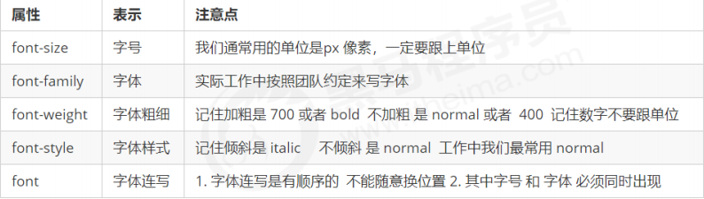

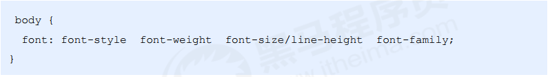

### 文本属性 <font color='red'>5</font>

```css
div {
    color: red;
    text-align: center;
    text-decoration: underline;
    text-indent: 10px;
    text-indent: 2em; 
    <!--相对单位，当前元素（font-size）1文字大小，当前元素没设大小则按照父元素来-->
    line-height: 26px;
}
```

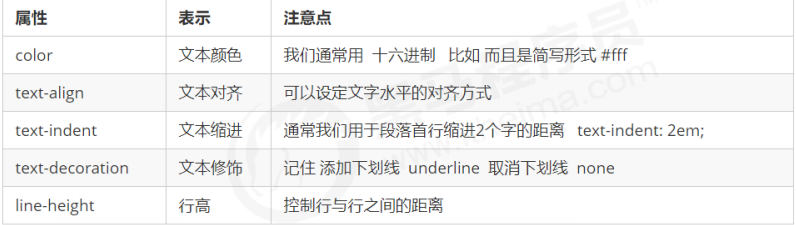

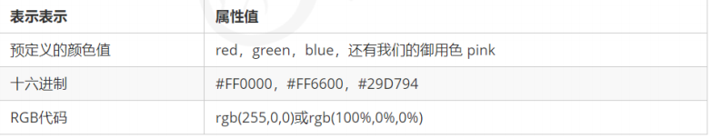

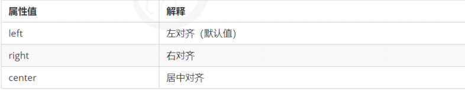

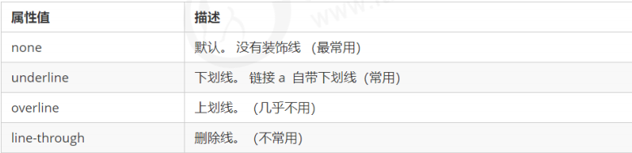


## CSS 的引入方式

### 行内样式表

行内样式表（内联样式表）是在元素标签内部的 style 属性中设定 CSS 样式。适合于修改简单样式.

```css
<div style="color: red; font-size: 12px;">青春不常在，抓紧谈恋爱</div>
```

### 内部样式表

内部样式表（内嵌样式表）是写到html页面内部. 是将所有的 CSS 代码抽取出来，单独放到一个 `<style>` 标签中。`<style>` 标签理论上可以放在 HTML 文档的任何地方，但一般会放在文档的`<head>`标签中。

```css
<style>
	div {
    	color: red;
        font-size: 12px;
	}
</style>
```

### 外部样式表

```html
<link rel="stylesheet" href="./style.css">
```

样式单独写到CSS 文件中，之后把CSS文件引入到 HTML 页面中使用。


## Chrome调试工具

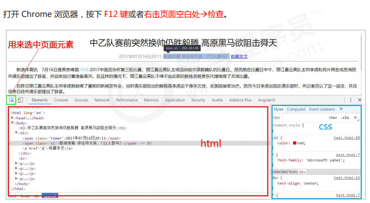

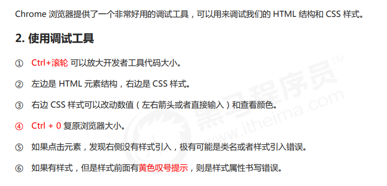


## CSS 复合选择器

后代选择器、子选择器、并集选择器、伪类选择器

### 后代选择器

后代选择器又称为包含选择器，可以选择父元素里面子元素。其写法就是把外层标签写在前面，内层标签写在后面，中间用空格分隔。当标签发生嵌套时，内层标签就成为外层标签的后代。

```css
元素1 元素2 { 样式声明 }
```

- 元素1 和 元素2 中间用空格隔开
- 元素1 是父级，元素2 是子级，最终选择的是元素2
- 元素2 可以是儿子，也可以是孙子等，只要是元素1 的后代即可
- 元素1 和 元素2 可以是任意基础选择器

### 子选择器

```css
元素1 > 元素2 { 样式声明 }
```

元素2 必须是亲儿子，其孙子、重孙之类都不归他管。你也可以叫他 亲儿子选择器。

### 并集选择器

并集选择器可以选择多组标签, 同时为他们定义相同的样式。通常用于集体声明。并集选择器是各选择器通过英文逗号（,）连接而成，任何形式的选择器都可以作为并集选择器的一部分。

```css
元素1,元素2 { 样式声明 }
```

### 伪类选择器

- 链接伪类选择器
  - 请按照LVHA的顺序声明
  - :link :visited :hover :active

```css
a {
    color: gray;
}
a:hover {
    color: red; /*鼠标经过的时候由原来的灰色变成红色*/
}
```

- :focus 伪类选择器，用于选取获得焦点的表单元素。

```css
input:focus {
    background-color: yellow;
}
```

### 复合选择器总结

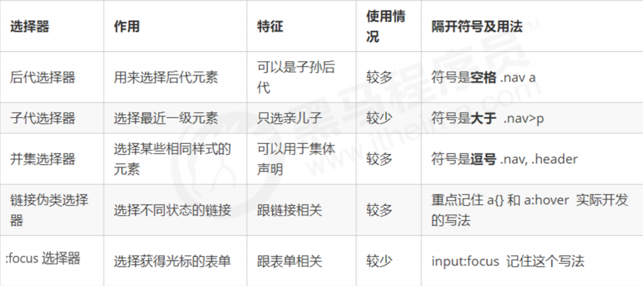


## CSS 的元素显示模式

HTML元素一般分为块元素和行内元素两种类型。

### 块元素

常见的块元素有`<h1>~<h6>、<p>、<div>、<ul>、<ol>、<li>`等，其中 `<div> `标签是最典型的块元素。

块级元素的特点：

① 比较霸道，自己独占一行。

② 高度，宽度、外边距以及内边距都可以控制。

③ 宽度默认是容器（父级宽度）的100%。

④ 是一个容器及盒子，里面可以放行内或者块级元素。

注意：

文字类的元素内不能使用块级元素。

`<p>`标签主要用于存放文字，因此`<p>`里面不能放块级元素，特别是不能放`<div>`。

同理，`<h1>~<h6>`等都是文字类块级标签，里面也不能放其他块级元素。

### 行内元素

常见的行内元素有` <a>、<strong>、<b>、<em>、<i>、<del>、<s>、<ins>、<u>、<span>`等，其中`<span>` 标签是最典型的行内元素。有的地方也将行内元素称为内联元素。

行内元素的特点：

① 相邻行内元素在一行上，一行可以显示多个。

② 高、宽直接设置是无效的。

③ 默认宽度就是它本身内容的宽度。

④ 行内元素只能容纳文本或其他行内元素。

注意：

链接里面不能再放链接。

特殊情况链接` <a> `里面可以放块级元素，但是给`<a>`转换一下块级模式最安全。

### 行内块元素

在行内元素中有几个特殊的标签 —— `、<input />、<td>`，它们同时具有块元素和行内元素的特点。有些资料称它们为行内块元素。

行内块元素的特点：

① 和相邻行内元素（行内块）在一行上，但是他们之间会有空白缝隙。一行可以显示多个（行内元素特点）。

② 默认宽度就是它本身内容的宽度（行内元素特点）。

③ 高度，行高、外边距以及内边距都可以控制（块级元素特点）。

### 元素显示模式总结

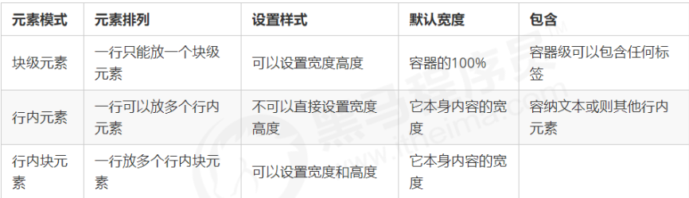

### 元素显示模式转换

特殊情况下，我们需要元素模式的转换，简单理解: 一个模式的元素需要另外一种模式的特性
比如想要增加链接`<a>`的触发范围。

- 转换为块元素：display:block;
- 转换为行内元素：display:inline;
- 转换为行内块：display: inline-block;

###  文字垂直居中

CSS 没有给我们提供文字垂直居中的代码. 这里我们可以使用一个小技巧来实现。解决方案: 让文字的行高等于盒子的高度，就可以让文字在当前盒子内垂直居中。


## CSS 的背景

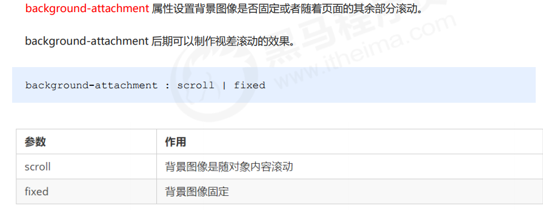

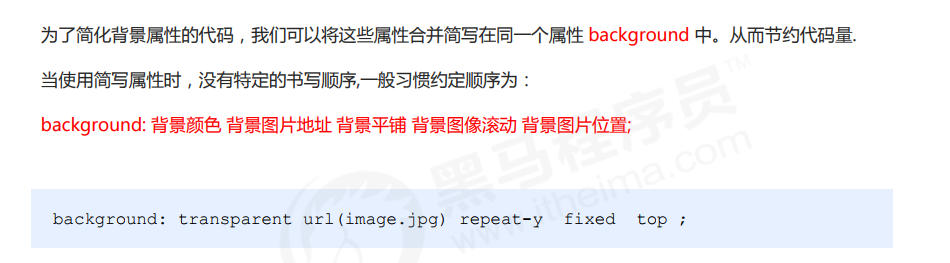

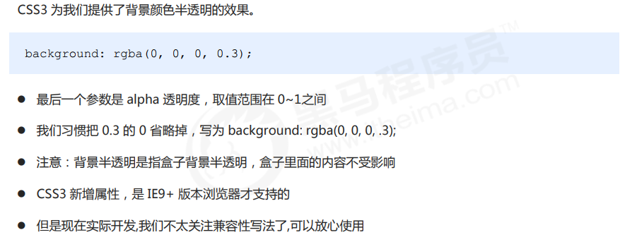

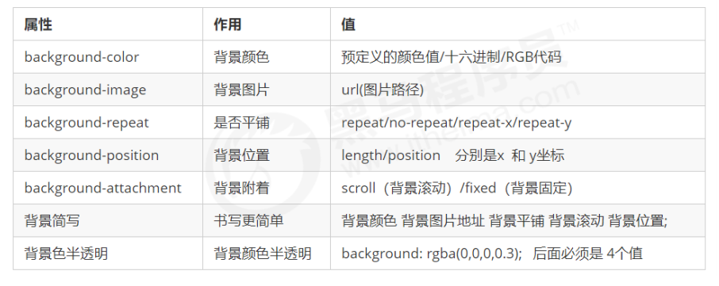

- 背景位置：
  - 方位名词：top、left、bottom、right、center
  - 精确单位：20px 50px

## emmet 语法

略


