## CSS 的三大特性

### 层叠性

相同选择器给设置相同的样式，此时一个样式就会覆盖（层叠）另一个冲突的样式。后来居上。

### 继承性

- 子标签会继承父标签的某些样式，如文本颜色和字号。

- 恰当地使用继承可以简化代码，降低 CSS 样式的复杂性

- 子元素可以继承父元素的样式（text-，font-，line-这些元素开头的可以继承，以及color属性）

#### 行高的继承性

```css
body {
    font: 12px/1.5 Microsoft YaHei;
}
```

- 行高可以跟单位也可以不跟单位
- 如果子元素没有设置行高，则会继承父元素的行高为 1.5
- 此时子元素的行高是：当前子元素的文字大小 * 1.5 
- body 行高 1.5 这样写法最大的优势就是里面子元素可以根据自己文字大小自动调整行高

### 优先级

当同一个元素指定多个选择器，就会有优先级的产生。

- 选择器相同，则执行层叠性
- 选择器不同，则根据选择器权重执行

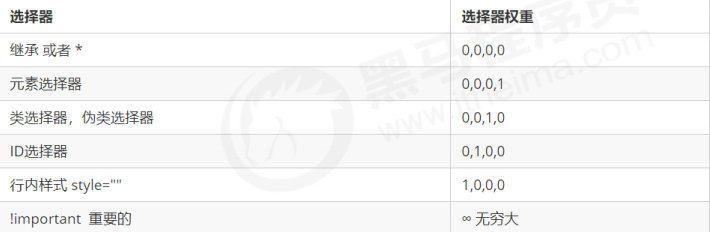

权重叠加：如果是复合选择器，则会有权重叠加，需要计算权重。

- div ul li ------> 0,0,0,3
- .nav ul li ------> 0,0,1,2
- a:hover -----—> 0,0,1,1
- .nav a ------> 0,0,1,1


## CSS 盒子模型

box

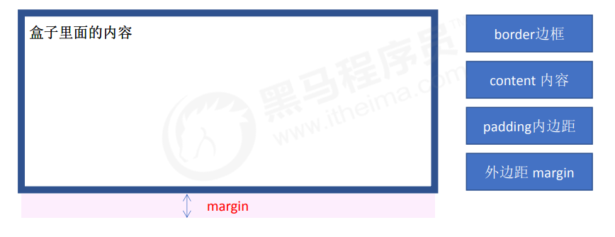

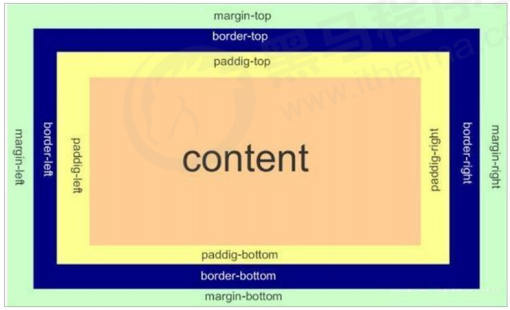

### 边框：宽度、样式、颜色。

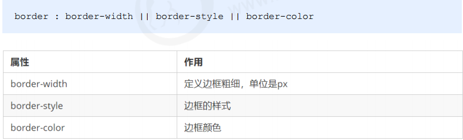

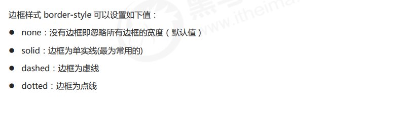

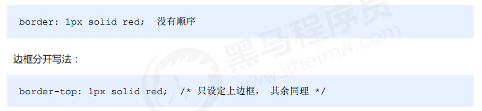

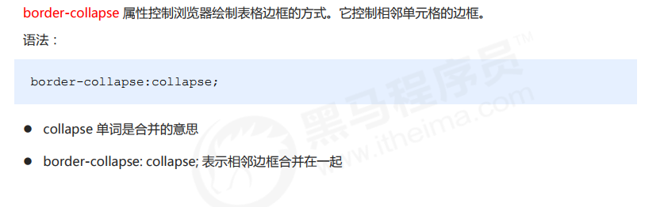

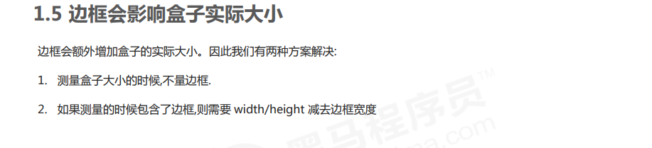

###  内边距

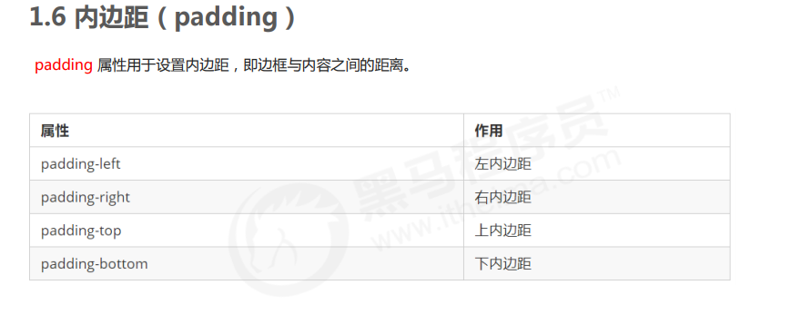

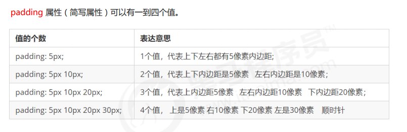

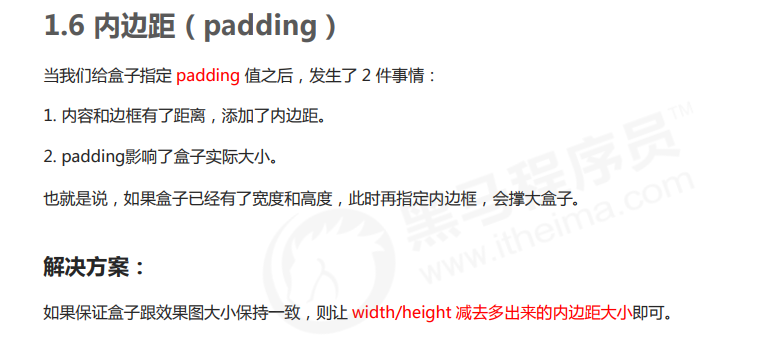

### 外边距

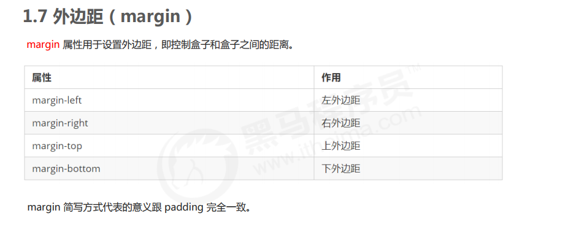

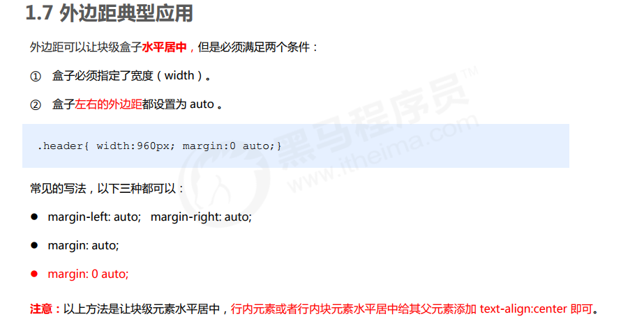

### 外边距合并

#### 外边距合并

相邻块元素垂直外边距的合并：取两者之间较大者。

解决方案：尽量只给一个盒子添加margin值。

#### 嵌套块元素垂直外边距的塌陷

对于两个嵌套关系（父子关系）的块元素，父元素有上外边距同时子元素也有上外边距，此时父元素会塌陷较大的外边距值。

解决方案:

可以为父元素定义上边框

可以为父元素定义上内边距

可以为父元素添加overflow:hidden

还有其他方法，比如浮动、固定，绝对定位的盒子不会有塌陷问题，后面咱们再总结。

### 清除内外边距

```css
* {
    padding: 0;
    margin: 0;
}
```

注意：行内元素为了照顾兼容性，尽量只设置左右内外边距，不要设置上下内外边距。但是转换为块级和行内块元素就可以了

## PS 基本操作

### 略

## CSS 特性

### 圆角边框

```css
border-radius: 100px;
border-radius: 50%;
border-top-left-radius
border-top-right-radius
border-bottom-right-radius
border-bottom-left-radius
/* 兼容性 ie9+ 浏览器支持, 但是不会影响页面布局,可以放心使用. */
```

### 盒子阴影

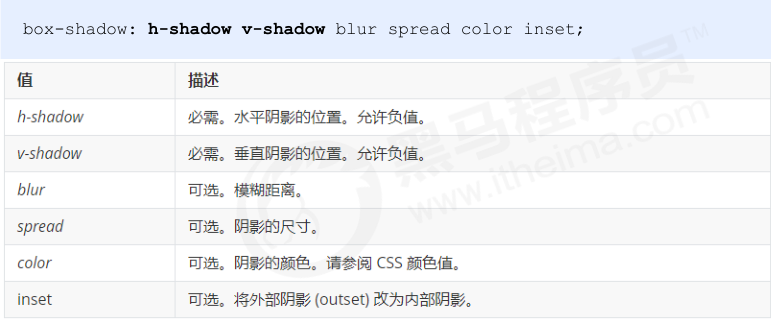

注意：

默认的是外阴影(outset), 但是不可以写这个单词,否则造成阴影无效。

盒子阴影不占用空间，不会影响其他盒子排列。

### 文字阴影

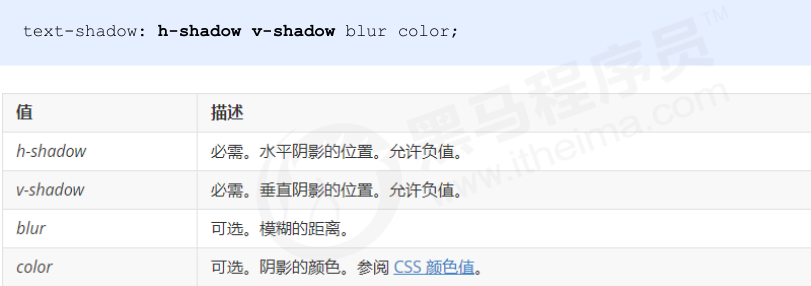


