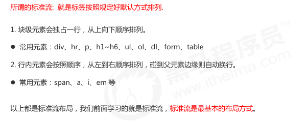
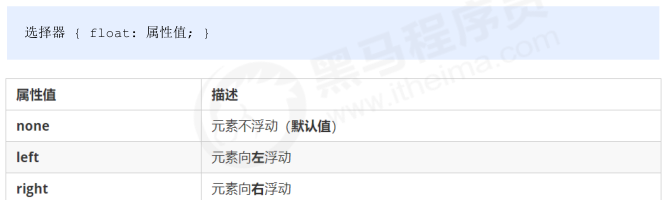
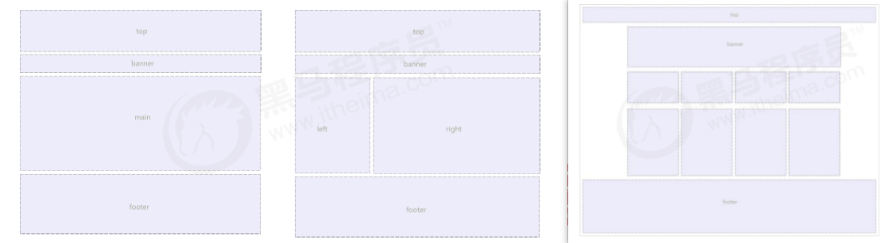
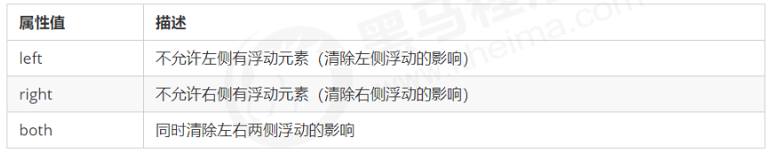

## 传统网页布局三种方式

- 标准流
- 浮动
- 定位



## 浮动 float

网页布局第一准则：多个块级元素纵向排列找标准流，多个块级元素横向排列找浮动。

float 属性用于创建浮动框，将其移动到一边，直到左边缘或右边缘触及包含块或另一个浮动框的边缘。



- 浮动元素会脱离标准流(脱标)
- 浮动的元素会一行内显示并且元素顶部对齐
- 浮动的元素会具有行内块元素的特性.

符合网页布局第一准侧：先用标准流的父元素排列上下位置, 之后内部子元素采取浮动排列左右位置。

网页布局第二准侧：先设置盒子的大小, 之后设置盒子的位置。

## 常见网页布局



注意点：

- 浮动和标准流的父盒子搭配。先用标准流的父元素排列上下位置, 之后内部子元素采取浮动排列左右位置

- 一个元素浮动了，理论上其余的兄弟元素也要浮动。一个盒子里面有多个子盒子，如果其中一个盒子浮动了，那么其他兄弟也应该浮动，以防止引起问题。
  浮动的盒子只会影响浮动盒子后面的标准流，不会影响前面的标准流。

## 清除浮动

为什么要清除浮动：

<font color='red'>由于父级盒子很多情况下，不方便给高度，但是子盒子浮动又不占有位置，最后父级盒子高度为 0 时，就会影响下面的标准流盒子。</font>

- 清除浮动的本质是清除浮动元素造成的影响

- <font color='red'>如果父盒子本身有高度，则不需要清除浮动</font>

- 清除浮动之后，父级就会根据浮动的子盒子自动检测高度。父级有了高度，就不会影响下面的标准流了

```css
选择器 { clear: 属性值; }
```



清除浮动方法：

1. 额外标签法，也成为隔墙法，是W3C推荐的做法。缺点是添加许多无意义标签，结构化较差。
2. 父级添加overflow属性，属性值设置为hidden、auto或scroll。缺点是无法显示溢出部分。
3. 父级添加after伪元素
4. 父级添加双伪元素

```css
.clearfix:after {
	content: "";
	display: block;
	height: 0;
	clear: both;
	visibility: hidden;
}
.clearfix { /* IE6、7 专有 */
	*zoom: 1;
}
```

```css
.clearfix:before,.clearfix:after {
	content:"";
	display:table;
}
.clearfix:after {
	clear:both;
}
.clearfix { /* IE6、7 专有 */
	*zoom:1;
}
```

## PS 切图

### 略

## 学成在线案例

我们本次采取结构与样式相分离思想：
1. 创建 study 目录文件夹 (用于存放我们这个页面的相关内容)。
2. 用vscode打开study目录文件夹.
3. study 目录内新建 images 文件夹，用于保存图片。
4. 新建首页文件 index.html（以后我们的网站首页统一规定为 index.html )。
5. 新建 style.css 样式文件。我们本次采用外链样式表。
6. 将样式引入到我们的 HTML 页面文件中。
7. 样式表写入清除内外边距的样式，来检测样式表是否引入成功。

CSS 属性书写顺序

1. 布局定位属性：display / position / float / clear / visibility / overflow（建议 display 第一个写，毕竟关系到模式）
2. 自身属性：width / height / margin / padding / border / background
3. 文本属性：color / font / text-decoration / text-align / vertical-align / white- space / break-word
4. 其他属性（CSS3）：content / cursor / border-radius / box-shadow / text-shadow / background:linear-gradient …

页面布局整体思路

1. 必须确定页面的版心（可视区），我们测量可得知。
2. 分析页面中的行模块，以及每个行模块中的列模块。其实页面布局第一准则.
3. 一行中的列模块经常浮动布局, 先确定每个列的大小,之后确定列的位置. 页面布局第二准则
4. 制作 HTML 结构。我们还是遵循，先有结构，后有样式的原则。结构永远最重要.
5. 所以, 先理清楚布局结构,再写代码尤为重要. 这需要我们多写多积累.


