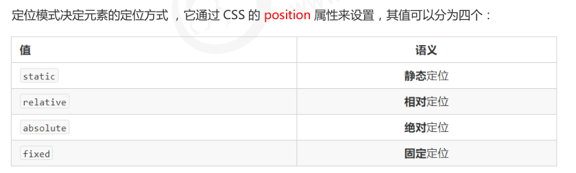

# 5 - CSS 定位

浮动可以让多个块级盒子一行没有缝隙排列显示， 经常用于横向排列盒子。定位则是可以让盒子自由的在某个盒子内移动位置或者固定屏幕中某个位置，并且可以压住其他盒子。

定位：将盒子定在某一个位置，所以定位也是在摆放盒子， 按照定位的方式移动盒子。定位 = 定位模式 + 边偏移 。定位模式用于指定一个元素在文档中的定位方式。边偏移则决定了该元素的最终位置。




## 静态定位

静态定位是元素的默认定位方式，无定位的意思，按照标准流特性摆放位置，它没有边偏移，在布局时很少用到。

```css
选择器 { position: static; }
```

## 相对定位

相对定位是元素在移动位置的时候，是相对于它原来的位置来说的。原来在标准流的位置继续占有，后面的盒子仍然以标准流的方式对待它。因此，相对定位并<font color='red'>没有脱标</font>，<font color='red'>它最典型的应用是给绝对定位当爹的</font>。

```css
选择器 { position: relative; }
```

## 绝对定位

绝对定位是元素在移动位置的时候，是相对于它祖先元素来说的。

```css
选择器 { position: absolute; }
```

绝对定位的特点：

1. 如果没有祖先元素或者祖先元素没有定位，则以浏览器为准定位（Document 文档）。
2. 如果祖先元素有定位（相对、绝对、固定定位），则以最近一级的有定位祖先元素为参考点移动位置。
3. 绝对定位不再占有原先的位置。<font color='red'>（脱标）</font>

## 常用定位

子绝父相，子级是绝对定位的话，父级要用相对定位。

1. 子级绝对定位，不会占有位置，可以放到父盒子里面的任何一个地方，不会影响其他的兄弟盒子。
2. 父盒子需要加定位限制子盒子在父盒子内显示。
3. 父盒子布局时，需要占有位置，因此父亲只能是相对定位。

## 固定定位 fixed

```css
选择器 { position: fixed; }
```

固定定位的特点：

1. 以浏览器的可视窗口为参照点移动元素。
2. 跟父元素没有任何关系。
3. 不随滚动条滚动。
4. 固定定位不再占有原先的位置。
5. 固定定位也是脱标的，其实固定定位也可以看做是一种特殊的绝对定位。

小技巧：

1. 让固定定位的盒子 left: 50%. 走到浏览器可视区（也可以看做版心） 的一半位置。
2. 让固定定位的盒子 margin-left: 版心宽度的一半距离。 多走 版心宽度的一半位置
   就可以让固定定位的盒子<font color='red'>贴着版心右侧对齐了</font>。

## 粘性定位 sticky

粘性定位可以被认为是相对定位和固定定位的混合。

```css
选择器 { position: sticky; top: 10px;}
```

1. 以浏览器的可视窗口为参照点移动元素（固定定位特点）
2. 粘性定位占有原先的位置（相对定位特点）
3. 必须添加 top 、left、right、bottom 其中一个才有效
4. 跟页面滚动搭配使用。 兼容性较差，IE 不支持。


## 定位叠放次序 <font color='red'>z-index</font>

在使用定位布局时，可能会出现盒子重叠的情况。此时，可以使用 z-index 来控制盒子的前后次序 (z轴)。

```css
选择器 { z-index: 1; }
```

1. 数值可以是正整数、负整数或 0, 默认是 auto，数值越大，盒子越靠上
2. 如果属性值相同，则按照书写顺序，后来居上
3. 数字后面不能加单位
4. 只有定位的盒子才有 z-index 属性

## 定位的拓展

### 绝对定位的盒子居中

加了绝对定位的盒子不能通过 margin:0 auto 水平居中，但是可以通过以下计算方法实现水平和垂直居中。

1. left: 50%;：让盒子的左侧移动到父级元素的水平中心位置。
2. margin-left: -100px;：让盒子向左移动自身宽度的一半。

### 定位特殊特性

绝对定位和固定定位也和浮动类似：

1. 行内元素添加绝对或者固定定位，可以直接设置高度和宽度。
2. 块级元素添加绝对或者固定定位，如果不给宽度或者高度，默认大小是内容的大小。

### 脱标的盒子不会触发外边距塌陷

<font color='red'>浮动元素、绝对定位(固定定位）元素的都不会触发外边距合并的问题。</font>

### 绝对定位（固定定位）会完全压住盒子

<font color='red'>浮动元素不同，只会压住它下面标准流的盒子，但是不会压住下面标准流盒子里面的文字（图片），但是绝对定位（固定定位） 会压住下面标准流所有的内容。浮动之所以不会压住文字，因为浮动产生的目的最初是为了做文字环绕效果的。 文字会围绕浮动元素。</font>

## 网页布局总结


## 元素的显示与隐藏

类似网站广告，当我们点击关闭就不见了，但是我们重新刷新页面，会重新出现！本质：让一个元素在页面中隐藏或者显示出来。

1. display 显示隐藏
2. visibility 显示隐藏
3. overflow 溢出显示隐藏

### display 属性

display 属性用于设置一个元素应如何显示。display 隐藏元素后，不再占有原来的位置。后面应用及其广泛，搭配 JS 可以做很多的网页特效。

```css
display: none;   隐藏对象
display: block;  除了转换为块级元素之外，还有显示元素的意思
```

### visibility 可见性

visibility 属性用于指定一个元素应可见还是隐藏。

```css
visiblity: visible;
visiblity: hidden;
```

visibility 隐藏元素后，继续占有原来的位置。

### <font color='red'>overflow</font> 溢出

overflow 属性指定了如果内容溢出一个元素的框（超过其指定高度及宽度） 时，会发生什么。


一般情况下，我们都不想让溢出的内容显示出来，因为溢出的部分会影响布局。但是如果有定位的盒子， 请慎用overflow:hidden 因为它会隐藏多余的部分。


