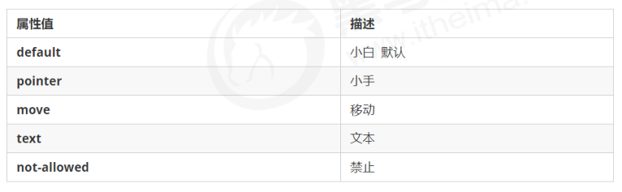
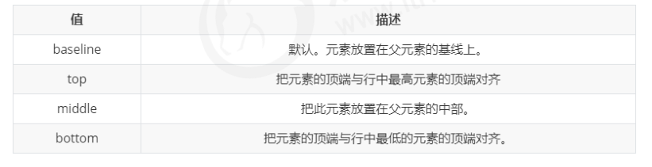
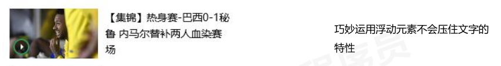
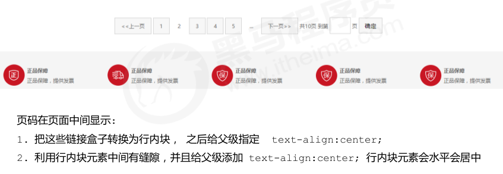

# 6 - CSS 高级技巧

## 精灵图

使用精灵图核心：

- 精灵技术主要针对于背景图片使用。就是把多个小背景图片整合到一张大图片中。

- 这个大图片也称为 sprites 精灵图 或者 雪碧图

- 移动背景图片位置， 此时可以使用 background-position 。

- 移动的距离就是这个目标图片的 x 和 y 坐标。注意网页中的坐标有所不同

- 因为一般情况下都是往上往左移动，所以数值是负值。

- 使用精灵图的时候需要精确测量，每个小背景图片的大小和位置。

## 字体图标

字体图标的优点：

- 轻量级：一个图标字体要比一系列的图像要小。一旦字体加载了，图标就会马上渲染出来，减少了服务器请求
- 灵活性：本质其实是文字，可以很随意的改变颜色、产生阴影、透明效果、旋转等
- 兼容性：几乎支持所有的浏览器，请放心使用

注意： 字体图标不能替代精灵技术，只是对工作中图标部分技术的提升和优化。

### 字体图标的下载

推荐站点 [icomoon字库](http://icomoon.io) [阿里字库](http://www.iconfont.cn) 

### 字体图标的引入

略

### 字体图标的追加

略

## CSS 三角

一些简单的三角形可以直接用css制作：宽高和行高都设置为零，设置边框，并只设置一边的颜色。

```css
div {
    width: 0;
    height: 0;
    line-height: 0;
    font-size: 0;
    border: 50px solid transparent;
    border-left-color: pink;
}
```

## CSS用户界面样式

- 更改用户的<font color='red'>鼠标样式</font>

```css
li { cursor: pointer; }
```



- 表单轮廓 去掉默认的蓝色边框

```css
input { outline: none; }
```

- 防止拖拽文本域

```css
textarea { resize: none; }
```

## vertical-align 属性应用

CSS 的 vertical-align 属性使用场景： 经常用于设置图片或者表单(行内块元素）和文字垂直对齐。官方解释： <font color='red'>用于设置一个元素的垂直对齐方式，但是它只针对于行内元素或者行内块元素有效。</font>

```css
vertical-align : baseline | top | middle | bottom
```



- 应用：
  - 图片、表单和文字对齐
  - 解决图片底部默认空白缝隙问题：添加vertical-align属性或转换为块元素

## 溢出文字省略号显示

### 单行

```css
/*强制一行显示*/
white-space: nowrap; (默认normal自动换行)
/*超出部分自动隐藏*/
overflow: hidden;
/*文字用省略号代替超出的部分*/
text-overflow: ellipsis;
```

### 多行

多行文本溢出显示省略号，有较大兼容性问题， 适合于webKit浏览器或移动端（移动端大部分是webkit内核）

```css
overflow: hidden;
text-overflow: ellipsis;
/* 弹性伸缩盒子模型显示 */
display: -webkit-box;
/* 限制在一个块元素显示的文本的行数 */
-webkit-line-clamp: 2;
/* 设置或检索伸缩盒对象的子元素的排列方式 */
-webkit-box-orient: vertical;
```

更推荐让后台人员来做这个效果，因为后台人员可以设置显示多少个字，操作更简单。

## 常见布局技巧

1.margin负值运用

让每个盒子margin 往左侧移动 -1px，正好压住相邻盒子边框，鼠标经过某个盒子的时候，<font color='red'>提高当前盒子的层级即可（如果没有有定位，则加相对定位（保留位置），如果有定位，则加z-index）</font>。

2.<font color='red'>文字围绕浮动元素</font>



3.行内块元素的妙用



4.CSS 三角强化

```css
width: 0;
height: 0;
border-color: transparent red transparent transparent;
border-style: solid;
border-width: 22px 8px 0 0;
```

## CSS 初始化

不同浏览器对有些标签的默认值是不同的，为了消除不同浏览器对HTML文本呈现的差异，照顾浏览器的兼容，我们需要对CSS 初始化。简单理解： CSS初始化是指重设浏览器的样式。 (也称为CSS reset）每个网页都必须首先进行 CSS初始化。

略


