# 7 - h5/css3提高

## HTML5新增的语义化标签

```html
<header>：头部标签
<nav>：导航标签
<article>：内容标签
<section>：定义文档某个区域
<aside>：侧边栏标签
<footer>：尾部标签
```

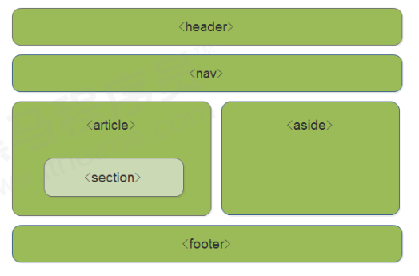

- 这种语义化标准主要是针对搜索引擎的
- 这些新标签页面中可以使用多次
- 在 IE9 中，需要把这些元素转换为块级元素
- 其实，我们移动端更喜欢使用这些标签
- HTML5 还增加了很多其他标签，我们后面再慢慢学

## HTML5 新增的多媒体标签

```HTML
<audio> 音频
<video> 视频
```

### 视频

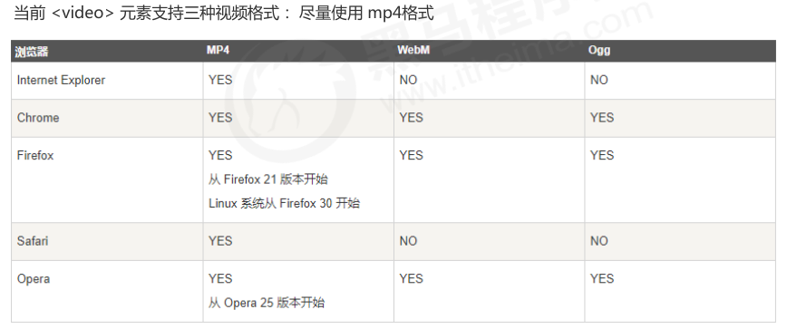

 ```html
 <video src="文件地址" controls="controls"></video>
 
 <video controls="controls" width="300">
     <source src="move.ogg" type="video/ogg">
     <source src="move.mp4" type="video/mp4">
     您的浏览器暂不支持video标签播放视频
 </video>
 ```

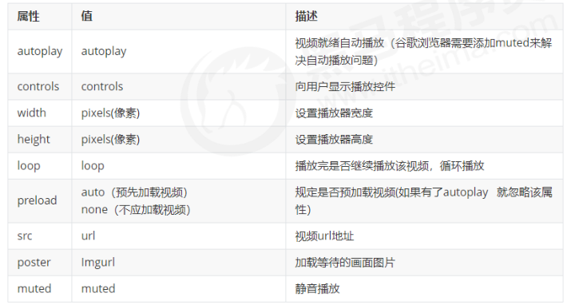

### 音频

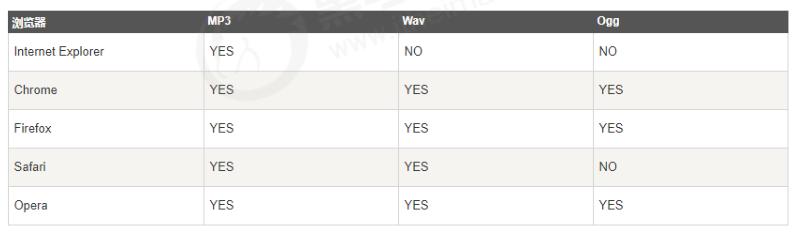

```html
<audio src="文件地址" controls="controls"></audio>

<audio controls="controls">
    <source src="happy.mp3" type="audio/mpeg">
    <source src="happy.ogg" type="audio/ogg">
    您的浏览器暂不支持audio标签。
</audio>
```

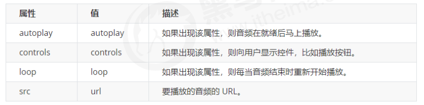

谷歌浏览器把音频和视频自动播放禁止了

## 多媒体标签总结

- 音频标签和视频标签使用方式基本一致
- 浏览器支持情况不同
- 谷歌浏览器把音频和视频自动播放禁止了
- 我们可以给视频标签添加 muted 属性来静音播放视频，音频不可以（可以通过JavaScript解决）
- 视频标签是重点，我们经常设置自动播放，不使用 controls 控件，循环和设置大小属性

## HTML5 新增的input类型

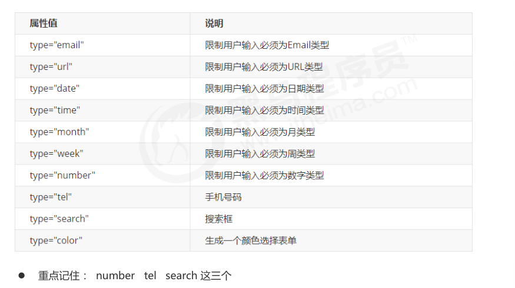

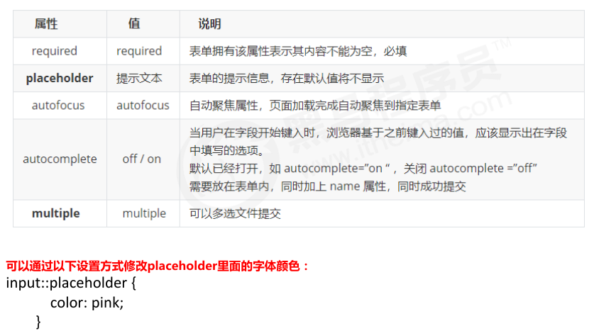

## CSS3 的新特性

- 新增的CSS3特性有兼容性问题，ie9+才支持
- 移动端支持优于 PC 端
- 不断改进中
- 应用相对广泛
- 现阶段主要学习：新增选择器和盒子模型以及其他特性

### 属性选择器

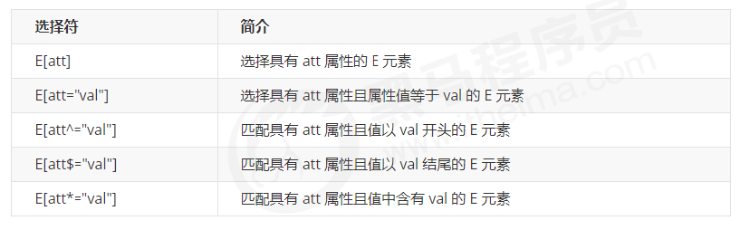

<font color="red">注意：类选择器、属性选择器、伪类选择器，权重为 10。</font>

### 结构伪类选择器

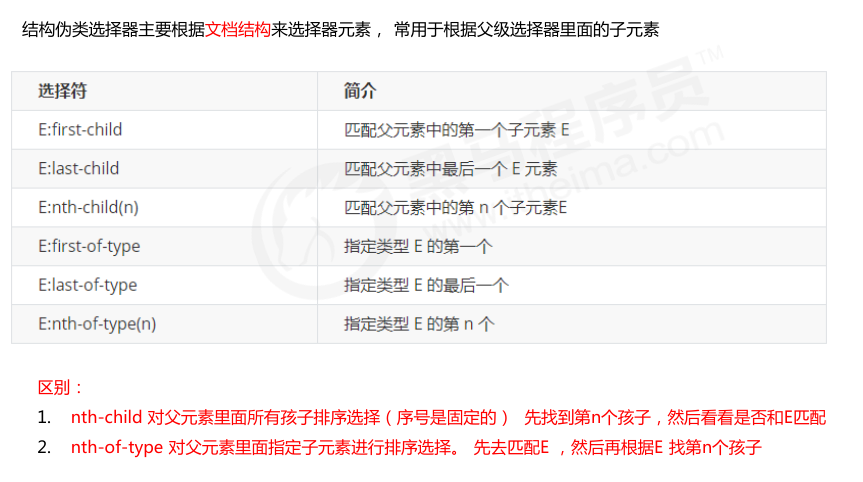

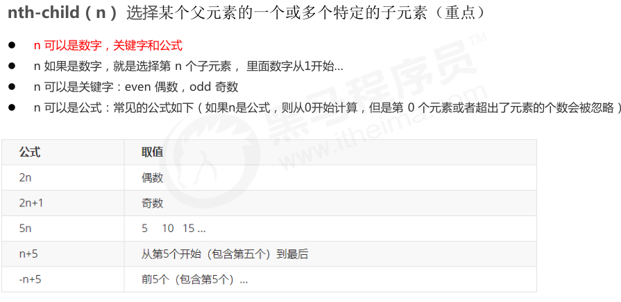

- 结构伪类选择器一般用于选择父级里面的第几个孩子
- nth-child 对父元素里面所有孩子排序选择（序号是固定的） 先找到第n个孩子，然后看看是否和E匹配
- nth-of-type 对父元素里面指定子元素进行排序选择。 先去匹配E ，然后再根据E 找第n个孩子
- 关于 nth-child（n） 我们要知道 n 是从 0 开始计算的，要记住常用的公式
- 如果是无序列表，我们肯定用 nth-child 更多
- 类选择器、属性选择器、伪类选择器，权重为 10

### 伪元素选择器

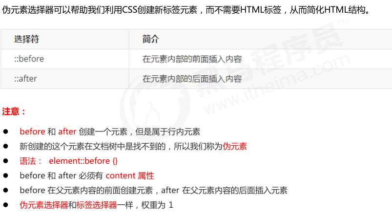

使用场景1：伪元素字体图标

```css
p::before {
    position: absolute;
    right: 20px;
    top: 10px;
    content: '\e91e';
    font-size: 20px;
}
```

使用场景2：仿土豆效果

```css
/* 当我们鼠标经过了 土豆这个盒子，就让里面before遮罩层显示出来 */
.tudou:hover::before {
    /* 而是显示元素 */
    display: block;
}
```

使用场景3：伪元素清除浮动

1. 额外标签法也称为隔墙法，是 W3C 推荐的做法
2. 父级添加 overflow 属性
3. 父级添加after伪元素
4. 父级添加双伪元素

### 其他特性

图片模糊

```css
filter: blur(5px);
```

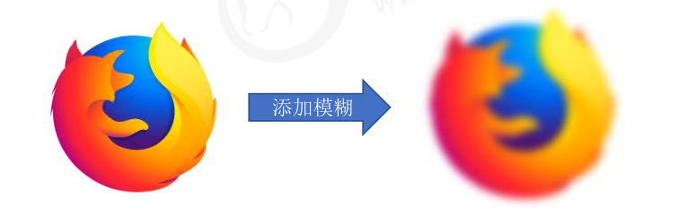

calc() 此CSS函数让你在声明CSS属性值时执行一些计算。

```css
width: calc(100% - 80px);
```

### CSS 过渡

过渡（transition)是CSS3中具有颠覆性的特征之一，我们可以在不使用 Flash 动画或 JavaScript 的情况下，当元素从一种样式变换为另一种样式时为元素添加效果。 过渡动画： 是从一个状态 渐渐的过渡到另外一个状态 可以让我们页面更好看，更动感十足，虽然 低版本浏览器不支持（ie9以下版本） 但是不会影响 页面布局。 我们现在经常和 :hover 一起 搭配使用。

```css
transition: 要过渡的属性 花费时间 运动曲线 何时开始;
```

1. 属性 ： 想要变化的 css 属性， 宽度高度 背景颜色 内外边距都可以 。如果想要所有的属性都变化过渡， 写一个all 就可以。
2. 花费时间： 单位是 秒（必须写单位） 比如 0.5s
3. 运动曲线： 默认是 ease （可以省略
4. 何时开始 ：单位是 秒（必须写单位）可以设置延迟触发时间 默认是 0s （可以省略）

谁做过渡给谁加

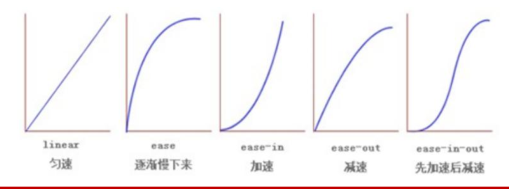


